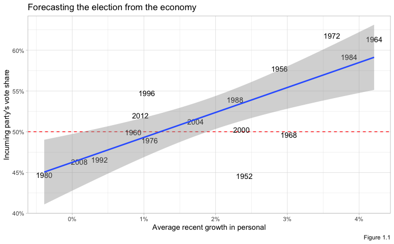
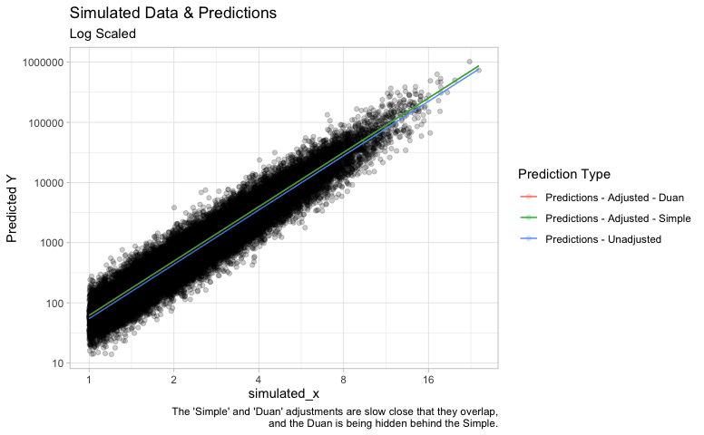
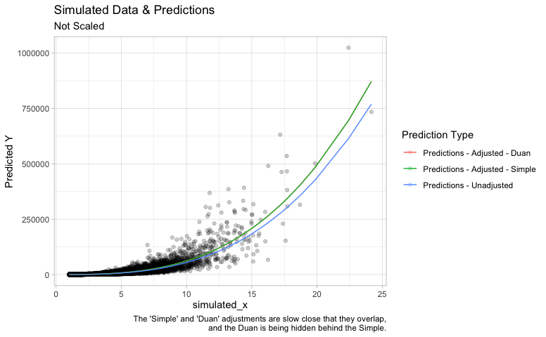

-   [Overview](#overview)
-   [Resources](#resources)
-   [Packages](#packages)
    -   [statistical packages](#statistical-packages)
    -   [base packages](#base-packages)
    -   [Settings](#settings)
-   [Chapter 1 - Overview](#chapter-1---overview)
    -   [Simple Example with `stan_glm`](#simple-example-with-stan_glm)
-   [Chapter 3 - Basic Methods](#chapter-3---basic-methods)
    -   [Log-Log Interpretation](#log-log-interpretation)
        -   [Example Model](#example-model)
        -   [Interpretation](#interpretation)
            -   [Interpretation from
                `Regression and Other Stores`](#interpretation-from-regression-and-other-stores)
            -   [Interpretation from
                `Introductory Econometrics 7e`](#interpretation-from-introductory-econometrics-7e)
        -   [Predictions](#predictions)
        -   [Simulation of Log-Log
            Predictions](#simulation-of-log-log-predictions)
-   [Chapter 4 - Statistcal
    Inference](#chapter-4---statistcal-inference)
    -   [Confidence Interval of
        Proportion](#confidence-interval-of-proportion)
-   [Chapter 5 - Simulation](#chapter-5---simulation)
    -   [How many girls in 400 births?](#how-many-girls-in-400-births)
    -   [Simulation of continuous and mixed discrete/continuous
        models](#simulation-of-continuous-and-mixed-discretecontinuous-models)

Overview
========

This document includes examples and exercises from
`Regression and Other Stories` by Andrew Gelman, Jennifer Hill and Aki
Vehtari, 2020, first edition.

Resources
=========

[Errata](https://avehtari.github.io/ROS-Examples/errata.html)

[Authors’
Code](https://avehtari.github.io/ROS-Examples/examples.html#Examples_by_chapters)

Packages
========

statistical packages
--------------------

``` r
library(rstan)
library(rstanarm)
library(bayesplot)
library(loo)
```

base packages
-------------

``` r
library(tidyverse)
library(ggplot2)
library(scales)
```

Settings
--------

``` r
theme_set(theme_light())
options(scipen=999) # non-scientific notation
options(dplyr.summarise.inform=F)
```

Chapter 1 - Overview
====================

Simple Example with `stan_glm`
------------------------------

Load in the data:

``` r
hibbs <- read.table('data/hibbs.dat', header = TRUE)
head(hibbs)
```

    ##   year growth  vote inc_party_candidate other_candidate
    ## 1 1952   2.40 44.60           Stevenson      Eisenhower
    ## 2 1956   2.89 57.76          Eisenhower       Stevenson
    ## 3 1960   0.85 49.91               Nixon         Kennedy
    ## 4 1964   4.21 61.34             Johnson       Goldwater
    ## 5 1968   3.02 49.60            Humphrey           Nixon
    ## 6 1972   3.62 61.79               Nixon        McGovern

------------------------------------------------------------------------

Graph data:

``` r
hibbs %>%
    ggplot(aes(x=growth, y=vote)) +
    geom_hline(yintercept = 50, color="red", linetype="dashed") +
    geom_text(aes(label=year)) +
    geom_smooth(method='lm') +
    scale_x_continuous(labels=function(.x)paste0(.x, '%')) +
    scale_y_continuous(labels=function(.x)paste0(.x, '%')) +
    labs(title="Forecasting the election from the economy",
         y="Incuming party's vote share",
         x="Average recent growth in personal",
         caption='Figure 1.1')
```



------------------------------------------------------------------------

Build Model:

``` r
model <- stan_glm(vote ~ growth, data=hibbs)
```

    ## 
    ## SAMPLING FOR MODEL 'continuous' NOW (CHAIN 1).
    ## Chain 1: 
    ## Chain 1: Gradient evaluation took 6e-05 seconds
    ## Chain 1: 1000 transitions using 10 leapfrog steps per transition would take 0.6 seconds.
    ## Chain 1: Adjust your expectations accordingly!
    ## Chain 1: 
    ## Chain 1: 
    ## Chain 1: Iteration:    1 / 2000 [  0%]  (Warmup)
    ## Chain 1: Iteration:  200 / 2000 [ 10%]  (Warmup)
    ## Chain 1: Iteration:  400 / 2000 [ 20%]  (Warmup)
    ## Chain 1: Iteration:  600 / 2000 [ 30%]  (Warmup)
    ## Chain 1: Iteration:  800 / 2000 [ 40%]  (Warmup)
    ## Chain 1: Iteration: 1000 / 2000 [ 50%]  (Warmup)
    ## Chain 1: Iteration: 1001 / 2000 [ 50%]  (Sampling)
    ## Chain 1: Iteration: 1200 / 2000 [ 60%]  (Sampling)
    ## Chain 1: Iteration: 1400 / 2000 [ 70%]  (Sampling)
    ## Chain 1: Iteration: 1600 / 2000 [ 80%]  (Sampling)
    ## Chain 1: Iteration: 1800 / 2000 [ 90%]  (Sampling)
    ## Chain 1: Iteration: 2000 / 2000 [100%]  (Sampling)
    ## Chain 1: 
    ## Chain 1:  Elapsed Time: 0.0302 seconds (Warm-up)
    ## Chain 1:                0.027357 seconds (Sampling)
    ## Chain 1:                0.057557 seconds (Total)
    ## Chain 1: 
    ## 
    ## SAMPLING FOR MODEL 'continuous' NOW (CHAIN 2).
    ## Chain 2: 
    ## Chain 2: Gradient evaluation took 8e-06 seconds
    ## Chain 2: 1000 transitions using 10 leapfrog steps per transition would take 0.08 seconds.
    ## Chain 2: Adjust your expectations accordingly!
    ## Chain 2: 
    ## Chain 2: 
    ## Chain 2: Iteration:    1 / 2000 [  0%]  (Warmup)
    ## Chain 2: Iteration:  200 / 2000 [ 10%]  (Warmup)
    ## Chain 2: Iteration:  400 / 2000 [ 20%]  (Warmup)
    ## Chain 2: Iteration:  600 / 2000 [ 30%]  (Warmup)
    ## Chain 2: Iteration:  800 / 2000 [ 40%]  (Warmup)
    ## Chain 2: Iteration: 1000 / 2000 [ 50%]  (Warmup)
    ## Chain 2: Iteration: 1001 / 2000 [ 50%]  (Sampling)
    ## Chain 2: Iteration: 1200 / 2000 [ 60%]  (Sampling)
    ## Chain 2: Iteration: 1400 / 2000 [ 70%]  (Sampling)
    ## Chain 2: Iteration: 1600 / 2000 [ 80%]  (Sampling)
    ## Chain 2: Iteration: 1800 / 2000 [ 90%]  (Sampling)
    ## Chain 2: Iteration: 2000 / 2000 [100%]  (Sampling)
    ## Chain 2: 
    ## Chain 2:  Elapsed Time: 0.029281 seconds (Warm-up)
    ## Chain 2:                0.027739 seconds (Sampling)
    ## Chain 2:                0.05702 seconds (Total)
    ## Chain 2: 
    ## 
    ## SAMPLING FOR MODEL 'continuous' NOW (CHAIN 3).
    ## Chain 3: 
    ## Chain 3: Gradient evaluation took 7e-06 seconds
    ## Chain 3: 1000 transitions using 10 leapfrog steps per transition would take 0.07 seconds.
    ## Chain 3: Adjust your expectations accordingly!
    ## Chain 3: 
    ## Chain 3: 
    ## Chain 3: Iteration:    1 / 2000 [  0%]  (Warmup)
    ## Chain 3: Iteration:  200 / 2000 [ 10%]  (Warmup)
    ## Chain 3: Iteration:  400 / 2000 [ 20%]  (Warmup)
    ## Chain 3: Iteration:  600 / 2000 [ 30%]  (Warmup)
    ## Chain 3: Iteration:  800 / 2000 [ 40%]  (Warmup)
    ## Chain 3: Iteration: 1000 / 2000 [ 50%]  (Warmup)
    ## Chain 3: Iteration: 1001 / 2000 [ 50%]  (Sampling)
    ## Chain 3: Iteration: 1200 / 2000 [ 60%]  (Sampling)
    ## Chain 3: Iteration: 1400 / 2000 [ 70%]  (Sampling)
    ## Chain 3: Iteration: 1600 / 2000 [ 80%]  (Sampling)
    ## Chain 3: Iteration: 1800 / 2000 [ 90%]  (Sampling)
    ## Chain 3: Iteration: 2000 / 2000 [100%]  (Sampling)
    ## Chain 3: 
    ## Chain 3:  Elapsed Time: 0.039437 seconds (Warm-up)
    ## Chain 3:                0.031601 seconds (Sampling)
    ## Chain 3:                0.071038 seconds (Total)
    ## Chain 3: 
    ## 
    ## SAMPLING FOR MODEL 'continuous' NOW (CHAIN 4).
    ## Chain 4: 
    ## Chain 4: Gradient evaluation took 1.1e-05 seconds
    ## Chain 4: 1000 transitions using 10 leapfrog steps per transition would take 0.11 seconds.
    ## Chain 4: Adjust your expectations accordingly!
    ## Chain 4: 
    ## Chain 4: 
    ## Chain 4: Iteration:    1 / 2000 [  0%]  (Warmup)
    ## Chain 4: Iteration:  200 / 2000 [ 10%]  (Warmup)
    ## Chain 4: Iteration:  400 / 2000 [ 20%]  (Warmup)
    ## Chain 4: Iteration:  600 / 2000 [ 30%]  (Warmup)
    ## Chain 4: Iteration:  800 / 2000 [ 40%]  (Warmup)
    ## Chain 4: Iteration: 1000 / 2000 [ 50%]  (Warmup)
    ## Chain 4: Iteration: 1001 / 2000 [ 50%]  (Sampling)
    ## Chain 4: Iteration: 1200 / 2000 [ 60%]  (Sampling)
    ## Chain 4: Iteration: 1400 / 2000 [ 70%]  (Sampling)
    ## Chain 4: Iteration: 1600 / 2000 [ 80%]  (Sampling)
    ## Chain 4: Iteration: 1800 / 2000 [ 90%]  (Sampling)
    ## Chain 4: Iteration: 2000 / 2000 [100%]  (Sampling)
    ## Chain 4: 
    ## Chain 4:  Elapsed Time: 0.030567 seconds (Warm-up)
    ## Chain 4:                0.026508 seconds (Sampling)
    ## Chain 4:                0.057075 seconds (Total)
    ## Chain 4:

------------------------------------------------------------------------

Model Summary:

``` r
summary(model)
```

    ## 
    ## Model Info:
    ##  function:     stan_glm
    ##  family:       gaussian [identity]
    ##  formula:      vote ~ growth
    ##  algorithm:    sampling
    ##  sample:       4000 (posterior sample size)
    ##  priors:       see help('prior_summary')
    ##  observations: 16
    ##  predictors:   2
    ## 
    ## Estimates:
    ##               mean   sd   10%   50%   90%
    ## (Intercept) 46.4    1.8 44.2  46.3  48.6 
    ## growth       3.0    0.8  2.1   3.0   4.0 
    ## sigma        4.0    0.8  3.1   3.9   5.1 
    ## 
    ## Fit Diagnostics:
    ##            mean   sd   10%   50%   90%
    ## mean_PPD 52.1    1.4 50.3  52.1  53.9 
    ## 
    ## The mean_ppd is the sample average posterior predictive distribution of the outcome variable (for details see help('summary.stanreg')).
    ## 
    ## MCMC diagnostics
    ##               mcse Rhat n_eff
    ## (Intercept)   0.0  1.0  2998 
    ## growth        0.0  1.0  2580 
    ## sigma         0.0  1.0  2620 
    ## mean_PPD      0.0  1.0  3500 
    ## log-posterior 0.0  1.0  1505 
    ## 
    ## For each parameter, mcse is Monte Carlo standard error, n_eff is a crude measure of effective sample size, and Rhat is the potential scale reduction factor on split chains (at convergence Rhat=1).

------------------------------------------------------------------------

Print()

``` r
print(model)
```

    ## stan_glm
    ##  family:       gaussian [identity]
    ##  formula:      vote ~ growth
    ##  observations: 16
    ##  predictors:   2
    ## ------
    ##             Median MAD_SD
    ## (Intercept) 46.3    1.6  
    ## growth       3.0    0.7  
    ## 
    ## Auxiliary parameter(s):
    ##       Median MAD_SD
    ## sigma 3.9    0.7   
    ## 
    ## ------
    ## * For help interpreting the printed output see ?print.stanreg
    ## * For info on the priors used see ?prior_summary.stanreg

------------------------------------------------------------------------

Model Coefficients:

``` r
coef(model)
```

    ## (Intercept)      growth 
    ##   46.347295    3.022401

------------------------------------------------------------------------

Compare to `lm()`:

``` r
summary(lm(vote ~ growth, data=hibbs))
```

    ## 
    ## Call:
    ## lm(formula = vote ~ growth, data = hibbs)
    ## 
    ## Residuals:
    ##     Min      1Q  Median      3Q     Max 
    ## -8.9929 -0.6674  0.2556  2.3225  5.3094 
    ## 
    ## Coefficients:
    ##             Estimate Std. Error t value           Pr(>|t|)    
    ## (Intercept)  46.2476     1.6219  28.514 0.0000000000000841 ***
    ## growth        3.0605     0.6963   4.396            0.00061 ***
    ## ---
    ## Signif. codes:  0 '***' 0.001 '**' 0.01 '*' 0.05 '.' 0.1 ' ' 1
    ## 
    ## Residual standard error: 3.763 on 14 degrees of freedom
    ## Multiple R-squared:  0.5798, Adjusted R-squared:  0.5498 
    ## F-statistic: 19.32 on 1 and 14 DF,  p-value: 0.00061

(pretty close)

------------------------------------------------------------------------

Graph using model coefficients rather than `geom_smooth(method='lm')`

``` r
hibbs %>%
    ggplot(aes(x=growth, y=vote)) +
    geom_hline(yintercept = 50, color="red", linetype="dashed") +
    geom_text(aes(label=year)) +
    #geom_smooth(method='lm') +
    geom_abline(intercept = coef(model)['(Intercept)'], slope = coef(model)['growth']) +
    scale_x_continuous(labels=function(.x)paste0(.x, '%')) +
    scale_y_continuous(labels=function(.x)paste0(.x, '%')) +
    labs(title="Forecasting the election from the economy",
         y="Incuming party's vote share",
         x="Average recent growth in personal",
         caption='Figure 1.1')
```


------------------------------------------------------------------------

Chapter 3 - Basic Methods
=========================

Log-Log Interpretation
----------------------

Example from \`Regression & Other Stories pg 39. (Data found elsewhere.)

### Example Model

``` r
metabolic_rate <- read_csv("data/Primate Body Mass and Basal Metabolic Rate.csv")
head(metabolic_rate)
```

    ## # A tibble: 6 x 2
    ##   `Primate Mass` `Metabolic Rate`
    ##            <dbl>            <dbl>
    ## 1           4670            11.6 
    ## 2           1020             2.56
    ## 3            206             0.73
    ## 4            190             0.86
    ## 5            105             0.55
    ## 6            300             1.1

``` r
metabolic_rate %>%
    ggplot(aes(x=`Primate Mass`, y=`Metabolic Rate`)) +
    geom_point() +
    geom_text(data=metabolic_rate, 
              aes(x=`Primate Mass`, y=`Metabolic Rate`,
                  label=glue::glue("({ `Primate Mass` }, { `Metabolic Rate` })"),
                  color=NULL),
              vjust=-0.5, check_overlap = TRUE) +
    labs(title="Primate Body Mass And Basal Metabolic Rate",
         subtitle = "(Not Scaled)")
```


``` r
metabolic_rate %>%
    ggplot(aes(x=`Primate Mass`, y=`Metabolic Rate`)) +
    geom_point() +
    geom_text(data=metabolic_rate, 
              aes(x=`Primate Mass`, y=`Metabolic Rate`,
                  label=glue::glue("({ `Primate Mass` }, { `Metabolic Rate` })"),
                  color=NULL),
              vjust=-0.5, check_overlap = TRUE) +
    scale_x_log10() +
    scale_y_log10() +
    labs(title="Primate Body Mass And Basal Metabolic Rate",
         subtitle = "Log Scaled")
```


``` r
model <- lm(log(`Metabolic Rate`) ~ log(`Primate Mass`), data=metabolic_rate)
summary(model)
```

    ## 
    ## Call:
    ## lm(formula = log(`Metabolic Rate`) ~ log(`Primate Mass`), data = metabolic_rate)
    ## 
    ## Residuals:
    ##      Min       1Q   Median       3Q      Max 
    ## -0.71136 -0.13959  0.01586  0.14175  0.57990 
    ## 
    ## Coefficients:
    ##                     Estimate Std. Error t value        Pr(>|t|)    
    ## (Intercept)         -4.05787    0.28770  -14.11 0.0000000004613 ***
    ## log(`Primate Mass`)  0.74160    0.04198   17.66 0.0000000000189 ***
    ## ---
    ## Signif. codes:  0 '***' 0.001 '**' 0.01 '*' 0.05 '.' 0.1 ' ' 1
    ## 
    ## Residual standard error: 0.2983 on 15 degrees of freedom
    ## Multiple R-squared:  0.9541, Adjusted R-squared:  0.9511 
    ## F-statistic:   312 on 1 and 15 DF,  p-value: 0.00000000001891

``` r
coef(model)
```

    ##         (Intercept) log(`Primate Mass`) 
    ##           -4.057868            0.741598

### Interpretation

#### Interpretation from `Regression and Other Stores`

From `pg. 40`

“For example, when increasing body mass on this curve by a factor of 2,
metabolic rate is multiplied by `2^0.74` = `1.7`. Multiplgying body mass
by `10` corresponds to multiplying metabolic rate by `10^0.74` = `5.5`,
and so forth.”

``` r
(primate_mass_coefficient <- unname(coef(model)['log(`Primate Mass`)']))
```

    ## [1] 0.741598

Lets test this. We’ll start with a body mass of `105`.

``` r
(log_prediction_105 <- predict(model, newdata = data.frame(`Primate Mass`=105, check.names = FALSE)))
```

    ##       1 
    ## -0.6065

``` r
(prediction_105 <- exp(log_prediction_105))
```

    ##         1 
    ## 0.5452559

Our prediction of the metabolic rate is `0.5452559`.

What is our prediction if we **double** the body mass?

We would expect a Metabolic Rate of `0.9116825`.

``` r
2^primate_mass_coefficient * prediction_105
```

    ##         1 
    ## 0.9116825

What is the actual prediction if we double the body mass?

``` r
log_prediction_210 <- predict(model, newdata = data.frame(`Primate Mass`=210, check.names = FALSE))
(prediction_210 <- exp(log_prediction_210))
```

    ##         1 
    ## 0.9116825

------------------------------------------------------------------------

What is our prediction if we multiply body mass by `10`?

We would expect a Metabolic Rate of `3.0074496`.

``` r
10^primate_mass_coefficient * prediction_105
```

    ##       1 
    ## 3.00745

What is the actual prediction if we double the body mass?

``` r
log_prediction_1050 <- predict(model, newdata = data.frame(`Primate Mass`=1050, check.names = FALSE))
(prediction_1050 <- exp(log_prediction_1050))
```

    ##       1 
    ## 3.00745

------------------------------------------------------------------------

#### Interpretation from `Introductory Econometrics 7e`

> "A one-unit difference in `log x` corresponds to an additive
> difference of `b` in `log y`. (R&OS pg. 39)

This is essentially “elasticity” and is interpreted as a `1%` change in
x has a `b`% change in `y` (Intro Econometrics pg. 39), although this
does not hold for large changes in `y` (Intro Econometrics pg. 186).

``` r
format_percent <- function(.x) { paste0(round(.x, 3), '%')}
format_percent_scale <- function(.x) { paste0(round(.x * 100, 3), '%')}

(expected_one_percent_change <- format_percent(primate_mass_coefficient))
```

    ## [1] "0.742%"

So, the interpretation of the `log(Primate Mass)` coefficient is that a
`1%` change in `Primate Mass` results in a `~0.742%` change in
`Metabolic Rate`.

Let’s see if this is true.

If the `Primate Mass` is `105` then our prediction of
`log(Metabolic Rate`) is `-0.6065`, which means our prediction of
`Metabolic Rate` is `0.5452559`, which matches the point on the graph.

Now let’s change `Primate Mass` (x) by `1%` and see how much
`Metabolic Rate` (y) changes by.

``` r
(one_percent_change <- (0.01 * 105) + 105)
```

    ## [1] 106.05

``` r
one_percent_change_prediction <- predict(model, newdata = data.frame(`Primate Mass`=one_percent_change, check.names = FALSE))
(one_percent_change_prediction <- exp(one_percent_change_prediction))
```

    ##         1 
    ## 0.5492943

So if `Primate Mass` is `106.05` then we predict that `Metabolic Rate`
is `0.5492943`.

So a `1%` change in `Primate Mass` resulted in the following percent
change for `Metabolic Rate`:

``` r
format_percent_scale((one_percent_change_prediction - prediction_105) / prediction_105)
```

    ## [1] "0.741%"

Which matches the expected percent change from the coefficient.

``` r
primate_mass_coefficient
```

    ## [1] 0.741598

------------------------------------------------------------------------

Now, lets try with a larger change.

Lets predict `Metabolic Change` for a `Primate Mass` of `9,500`

``` r
(percent_change <- (9500 - 105) / 105)
```

    ## [1] 89.47619

The percent-change in `Primate Mass` between these two values is
`8947.619%`.

``` r
(expected_percent_change_y <- as.numeric(coef(model)["log(`Primate Mass`)"]) * percent_change)
```

    ## [1] 66.35536

Therefore, if `Primate Mass` changes by `8947.619%`, the **expected**
percent change in `Metabolic Rate` should be `6635.536%`.

But the actual percent change is:

``` r
(prediction_9500 <- exp(predict(model, newdata = data.frame(`Primate Mass`=9500, check.names = FALSE))))
```

    ##        1 
    ## 15.40147

``` r
format_percent_scale((prediction_9500 - prediction_105) / prediction_105)
```

    ## [1] "2724.632%"

Which is quite lower than what we expected.

So this rule of thumb doesn’t work across large changes in `y`.

### Predictions

According to `Introductory Econometrics, Wooldridge (pg. 206)`,

> Because the exponential undoes the log, our first guess for predicting
> y (when dependent variable is log(y)) is to simply exponentiate the
> predicted value for `log(y): y_predicted = exp(log y_predicted))`.
> **This does not work; in fact, it will systematically underestimate
> the expected value of y**.

One adjustment that the author describes is the
`Duan smearing estimate`.

> Given an esimtate `a0`, we can predict `y` as
>
> `y_predicted = a0 * exp(log y_predicted)`

where,

> `a0 = sum(exp(residuals)) / N`

The code below implements the `Duan smearing estimate`.

Note, that this adjustment necessary, not just for `log y = log x`
models, but for `log y = x` models (any time the dependent variable is
log y, regardless of X).

``` r
#' This method returns the adjustment coefficient described in `Introductory Econometrics, Wooldridge (pg. 206)`
#' @param .model the regression model
duan_smearing_adjustment <- function(.model) {
    model_residuals <- residuals(.model)
    duan_smearing_coefficient <- sum(exp(model_residuals)) / length(model_residuals)
    
    return (duan_smearing_coefficient)
}

#' This method returns the prediction of `y`, when the dependent variable is `log y`, based on the adjustment coefficient described in `Introductory Econometrics, Wooldridge (pg. 206)`
#' @param .model the regression model
#' @param .newdata the data (e.g. test data) from which predictions will be generated
predict_from_log_y <- function(.model, .newdata) {
    
    duan_smearing_coefficient <- duan_smearing_adjustment(.model)
    .predictions <- predict(.model, newdata=.newdata)
    .predictions <- duan_smearing_coefficient*exp(.predictions)

    return (.predictions)
}
```

Now, let’s create predictions for all `Primate Masses` between `50` and
`80000`, which is around the interval of our data.

``` r
all_predictions <- data.frame(`Primate Mass`=seq(50, 80000), check.names = FALSE)
log_y_predictions <- predict(model, newdata=all_predictions)

# this simple adjustment is also described on pg 206 but assumes normal residuals
all_predictions$`Predictions - Unadjusted` <- exp(log_y_predictions)
all_predictions$`Predictions - Adjusted - Simple` <- exp(((summary(model)$sigma)^2)/2)*exp(log_y_predictions)
all_predictions$`Predictions - Adjusted - Duan` <- predict_from_log_y(.model=model, .newdata=all_predictions)
head(all_predictions)
```

    ##   Primate Mass Predictions - Unadjusted Predictions - Adjusted - Simple
    ## 1           50                0.3145163                       0.3288212
    ## 2           51                0.3191693                       0.3336858
    ## 3           52                0.3237987                       0.3385258
    ## 4           53                0.3284052                       0.3433418
    ## 5           54                0.3329892                       0.3481343
    ## 6           55                0.3375514                       0.3529040
    ##   Predictions - Adjusted - Duan
    ## 1                     0.3266032
    ## 2                     0.3314350
    ## 3                     0.3362423
    ## 4                     0.3410258
    ## 5                     0.3457860
    ## 6                     0.3505236

``` r
predictions_long <- all_predictions %>% 
    # get the original values, where applicable
    #left_join(metabolic_rate, by = 'Primate Mass') %>%
    pivot_longer(-`Primate Mass`, names_to = 'Prediction Type', values_to='Metabolic Rate')

metabolic_rate_plot <- predictions_long %>%
    ggplot(aes(x=`Primate Mass`, y=`Metabolic Rate`, color=`Prediction Type`)) +
    geom_point(data=metabolic_rate, aes(x=`Primate Mass`, y=`Metabolic Rate`, color=NULL)) +
    geom_text(data=metabolic_rate, 
              aes(x=`Primate Mass`, y=`Metabolic Rate`,
                  label=glue::glue("({ `Primate Mass` }, { `Metabolic Rate` })"),
                  color=NULL),
              vjust=-0.5, check_overlap = TRUE) +
    geom_line()

metabolic_rate_plot +
    scale_x_log10() +
    scale_y_log10() +
    labs(title="Primate Body Mass And Basal Metabolic Rate",
         subtitle = "Log Scaled")
```


``` r
metabolic_rate_plot +
    labs(title="Primate Body Mass And Basal Metabolic Rate",
         subtitle = "Unscaled")
```


------------------------------------------------------------------------

### Simulation of Log-Log Predictions

See discussion in previous section regarding systematic underprediction
of `y` when dependent varaible is `log y`.

`log y = b*log x + random-noise`

``` r
set.seed(1)
simulated_x <- rexp(100000, rate = 0.5) + 4
noise <- rnorm(100000, sd = 0.5)
b_coefficient <- 3
actual_log_y <- b_coefficient * log(simulated_x)
simulated_log_y <- actual_log_y + noise
simulated_y <- exp(simulated_log_y)

simulated_data <- data.frame(simulated_x, simulated_y)
simulated_data %>%
    ggplot(aes(x=simulated_x, y=simulated_y)) +
    geom_point(alpha=0.1) +
    scale_x_log10() +
    scale_y_log10() +
    labs(title="Simulated Data (`log y = b*log x + random-noise`)",
         subtitle = "Graphed on a log-scale.")
```


------------------------------------------------------------------------

Create training/test sets, fit model on training data.

``` r
training_indices <- sample.int(n=nrow(simulated_data), size = 0.7*nrow(simulated_data), replace = FALSE)
training_data <- simulated_data[training_indices,]
test_data <- simulated_data[-training_indices,]
model <- lm(log(simulated_y) ~ log(simulated_x), data=training_data)
summary(model)
```

    ## 
    ## Call:
    ## lm(formula = log(simulated_y) ~ log(simulated_x), data = training_data)
    ## 
    ## Residuals:
    ##      Min       1Q   Median       3Q      Max 
    ## -2.11514 -0.33735 -0.00186  0.33470  2.13378 
    ## 
    ## Coefficients:
    ##                  Estimate Std. Error t value            Pr(>|t|)    
    ## (Intercept)      0.001413   0.011745    0.12               0.904    
    ## log(simulated_x) 2.999504   0.006626  452.71 <0.0000000000000002 ***
    ## ---
    ## Signif. codes:  0 '***' 0.001 '**' 0.01 '*' 0.05 '.' 0.1 ' ' 1
    ## 
    ## Residual standard error: 0.499 on 69998 degrees of freedom
    ## Multiple R-squared:  0.7454, Adjusted R-squared:  0.7454 
    ## F-statistic: 2.049e+05 on 1 and 69998 DF,  p-value: < 0.00000000000000022

------------------------------------------------------------------------

Predict on test data.

``` r
log_y_predictions <- predict(model, newdata=test_data)

# this simple adjustment is also described on pg 206 but assumes normal residuals
test_data$`Predictions - Unadjusted` <- exp(log_y_predictions)
test_data$`Predictions - Adjusted - Simple` <- exp(((summary(model)$sigma)^2)/2)*exp(log_y_predictions)
test_data$`Predictions - Adjusted - Duan` <- predict_from_log_y(.model=model, .newdata=test_data)
head(test_data)
```

    ##    simulated_x simulated_y Predictions - Unadjusted
    ## 2     6.363286   395.44189                257.78608
    ## 6     9.789937  1416.81159                938.56020
    ## 8     5.079366   132.26785                131.12703
    ## 10    4.294092    74.23516                 79.23444
    ## 12    5.524060   134.45805                168.66337
    ## 17    7.752070   311.97900                466.04282
    ##    Predictions - Adjusted - Simple Predictions - Adjusted - Duan
    ## 2                        291.96868                     292.12438
    ## 6                       1063.01387                    1063.58074
    ## 8                        148.51455                     148.59375
    ## 10                        89.74097                      89.78883
    ## 12                       191.02824                     191.13011
    ## 17                       527.84039                     528.12187

------------------------------------------------------------------------

``` r
predictions_long <- test_data %>%
    select(-simulated_y) %>%
    # get the original values, where applicable
    #left_join(metabolic_rate, by = 'Primate Mass') %>%
    pivot_longer(-simulated_x, names_to = 'Prediction Type', values_to='Predicted Y')

simulated_plot <- predictions_long %>%
    ggplot(aes(x=simulated_x, y=`Predicted Y`, color=`Prediction Type`)) +
    geom_point(data=test_data, aes(x=simulated_x, y=simulated_y, color=NULL), alpha=0.2) +
    geom_line()

simulated_plot +
    scale_x_log10() +
    scale_y_log10() +
    labs(title="Simulated Data & Predictions",
         subtitle = "Log Scaled",
         caption="The 'Simple' and 'Duan' adjustments are slow close that they overlap,\nand the Duan is being hidden behind the Simple.")
```



------------------------------------------------------------------------

``` r
simulated_plot +
    labs(title="Simulated Data & Predictions",
         subtitle = "Not Scaled",
         caption="The 'Simple' and 'Duan' adjustments are slow close that they overlap,\nand the Duan is being hidden behind the Simple.")
```



------------------------------------------------------------------------

The adjustments seem to make sense, visualy; but we can check the
`Root Mean Square Error` (`RMSE`) to see if the adjustments actually
results in a better **out-of-sample** fit, below (which it appears is
the case; there is a lower error for the adjusted predictions).

``` r
rmse = function(fitted, actual){
  sqrt(mean((fitted - actual)^2))
}

rmse(fitted=test_data$`Predictions - Unadjusted`, actual=test_data$simulated_y)
```

    ## [1] 356.9278

``` r
rmse(fitted=test_data$`Predictions - Adjusted - Simple`, actual=test_data$simulated_y)
```

    ## [1] 342.9284

``` r
rmse(fitted=test_data$`Predictions - Adjusted - Duan`, actual=test_data$simulated_y)
```

    ## [1] 342.9028

NOTE: the “Simple” adjustment (found in
`Introductory Econometrics, Wooldridge (pg. 206)`) is only valid for
residuals that are normally distributed. In this simulation, the
residuals are normally distributed; and the Simple and Duan adjustments
are quite similar.

------------------------------------------------------------------------

We can do another performance check using `R-Squared`, which is a
measure of the percent of variance in the dependent variable (y) that is
explained by the model. The higher the R-squared, the better.

``` r
#' these functions are from `Business Data Science, Taddy, pg 72`
#' @param y the actual y values
#' @param pred the predictions; must be probabilities (0<pred<1) for binomial
deviance <- function(y, pred, family=c("gaussian","binomial")){
    family <- match.arg(family)
    if(family=="gaussian"){
        return( sum( (y-pred)^2 ) )
    }else{
        if(is.factor(y)) y <- as.numeric(y)>1
        return( -2*sum( y*log(pred) + (1-y)*log(1-pred) ) )
    }
}
#' these functions are from `Business Data Science, Taddy, pg 72`
#' returns r-squared which is a measure of the percent of variance in the dependent variable (y) that is explained by the model.
#' @param y the actual y values
#' @param pred the predictions; must be probabilities (0<pred<1) for binomial
R2 <- function(y, pred, family=c("gaussian","binomial")){
    fam <- match.arg(family)
    if(fam=="binomial"){
        if(is.factor(y)){ y <- as.numeric(y)>1 }
    }
    dev <- deviance(y, pred, family=fam)
    dev0 <- deviance(y, mean(y), family=fam)
    return(1-dev/dev0)
}
```

We can see that the adjusted predictions do have a higher `R-Squared`
than the unadjsuted.

``` r
R2(pred=test_data$`Predictions - Unadjusted`, y=test_data$simulated_y)
```

    ## [1] 0.7248093

``` r
R2(pred=test_data$`Predictions - Adjusted - Simple`, y=test_data$simulated_y)
```

    ## [1] 0.7459729

``` r
R2(pred=test_data$`Predictions - Adjusted - Duan`, y=test_data$simulated_y)
```

    ## [1] 0.7460108

Chapter 4 - Statistcal Inference
================================

Confidence Interval of Proportion
---------------------------------

``` r
sample_size <- 1000
respond_yes <- 700

(estimate <- respond_yes / sample_size)
```

    ## [1] 0.7

``` r
(standard_error <- sqrt(estimate * (1 - estimate) / sample_size))
```

    ## [1] 0.01449138

``` r
(z_scores <- qnorm(c(0.025, 0.975)))
```

    ## [1] -1.959964  1.959964

``` r
(confidence_interval_95 <- estimate + (z_scores * standard_error))
```

    ## [1] 0.6715974 0.7284026

------------------------------------------------------------------------

Compare to R’s `prop.test`.

``` r
prop.test(x=respond_yes, n=sample_size)
```

    ## 
    ##  1-sample proportions test with continuity correction
    ## 
    ## data:  respond_yes out of sample_size, null probability 0.5
    ## X-squared = 159.2, df = 1, p-value < 0.00000000000000022
    ## alternative hypothesis: true p is not equal to 0.5
    ## 95 percent confidence interval:
    ##  0.6703646 0.7280778
    ## sample estimates:
    ##   p 
    ## 0.7

Chapter 5 - Simulation
======================

How many girls in 400 births?
-----------------------------

``` r
probability_girl <- 0.488
sample_size <- 400
# one random sample (simulated)
number_of_simulated_samples <- 1
set.seed(1)
rbinom(n = number_of_simulated_samples, size=sample_size, prob = probability_girl)
```

    ## [1] 196

``` r
number_of_simulated_samples <- 1000
set.seed(1)
simulations <- rbinom(n = number_of_simulated_samples, size=sample_size, prob = probability_girl)
simulations[1:10]
```

    ##  [1] 196 195 184 213 198 183 192 168 178 196

95% Interval

``` r
quantile(simulations, c(0.025, 0.975))
```

    ##  2.5% 97.5% 
    ##   176   216

``` r
hist(simulations)
```


------------------------------------------------------------------------

Accounting for twins.

First, simulate birth types of 400 births.

``` r
set.seed(2)
probability_girl_if_twins <- 0.495
probability_of_twins_fraternal <- 1/125  # each has a 49.5% of being a girl
probability_of_twins_identical <- 1/300  # 49.5% chance of being a pair of girls.

simulate_birth_types <- function() {
    
    sample(x=c('fraternal twin', 'identical twin', 'single born'),
           size = sample_size,
           replace = TRUE,
           prob = c(probability_of_twins_fraternal,
                    probability_of_twins_identical,
                    1 - probability_of_twins_fraternal - probability_of_twins_identical))
}
birth_type <- simulate_birth_types()
table(birth_type)
```

    ## birth_type
    ## fraternal twin identical twin    single born 
    ##              2              1            397

Simulating Number of Girls if Fraternal Twin. In this scenario, there
are `2` different people, each of which has a
`49.5% percent chance of being a girl. So the possible outcomes are`0`,`1`,`2\`

-   `0`: 0 girls (both boys)
-   `1`: 1 girl
-   `2`: 2 both

``` r
hist(rbinom(n=10000,  # simulate this scenario 10K times
            size=2, # two different possible chances of being a girl
            prob=probability_girl_if_twins))
```


Simulating Number of Girls if Identical Twin. In this scenario, they are
either both boys, or both girls. So the possible outcomes are either `0`
or `2`

-   `0`: 0 girls (both boys)
-   `2`: both girls

In other words, we’ll simulate the binary outcome of either both girls
or both boys, but the former means we have to count 2 people, so we’ll
multiple the number of people by 2

``` r
hist(2 * rbinom(n=10000,  # simulate this scenario 10K times
                size=1, # two different possible chances of being a girl
                prob=probability_girl_if_twins))
```


Now, we will do 1000 simulations of births, considering
fraternal/identical twins; each simulation has a sample-size of 400.

``` r
set.seed(1)
simulation_results <- replicate(1000, {
    birth_type <- simulate_birth_types()
    
    sample_of_girls <- map_dbl(birth_type, ~ {

        if(. == 'fraternal twin') {
            # simulate number of girls for this particular simulated birth_type
            number_of_girls <- rbinom(n=1,
                   size=2, # two different possible chances of being a girl
                   prob=probability_girl_if_twins)
            
        } else if(. == 'identical twin') {
            # simulate number of girls for this particular simulated birth_type
            number_of_girls <- 2 * rbinom(n=1,
                size=1, # two different possible chances of being a girl
                prob=probability_girl_if_twins)
            
        } else if(. == 'single born') {
            # simulate number of girls for this particular simulated birth_type
            number_of_girls <- rbinom(1, 1, probability_girl)
            
        } else {
            stop()
        }
        
        return(number_of_girls)
    })
    stopifnot(length(sample_of_girls) == sample_size)
    return (sum(sample_of_girls))
})
```

``` r
quantile(simulation_results, c(0.025, 0.975))
```

    ##  2.5% 97.5% 
    ##   178   216

``` r
hist(simulation_results)
```


Simulation of continuous and mixed discrete/continuous models
-------------------------------------------------------------

``` r
n_sims <- 1000
y1 <- rnorm(n = n_sims, mean = 3, sd = 0.5)
y2 <- exp(x = y1)
y3 <- rbinom(n = n_sims, size = 20, prob = 0.6)
y4 <- rpois(n = n_sims, lambda = 5)
```


