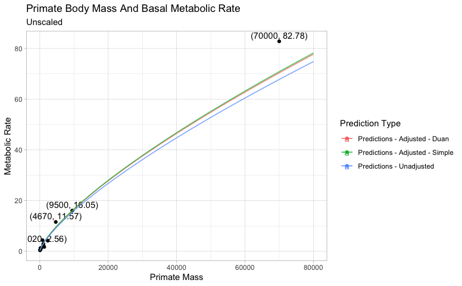
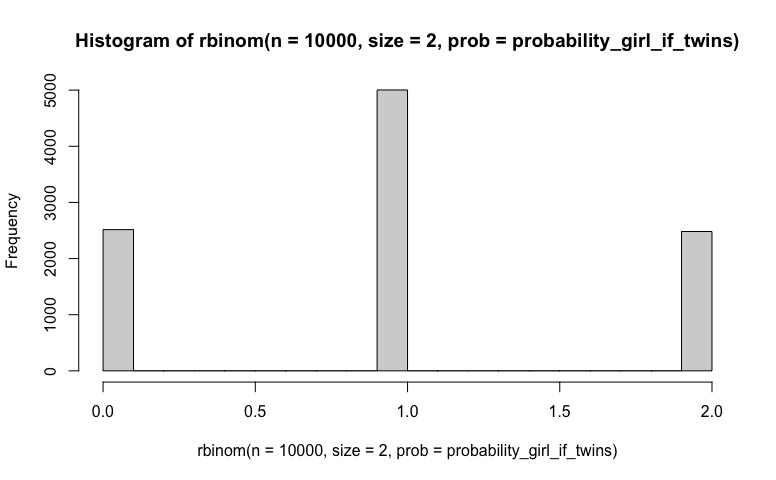
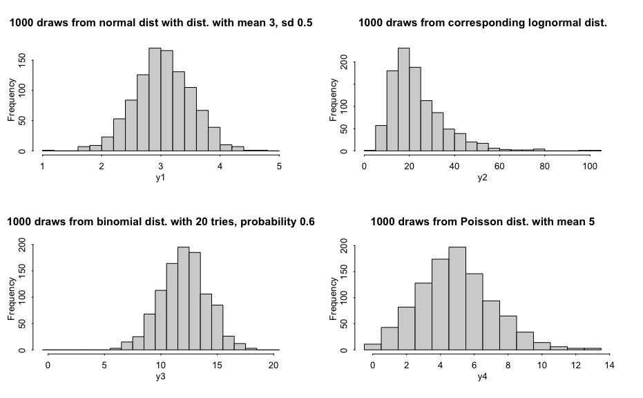
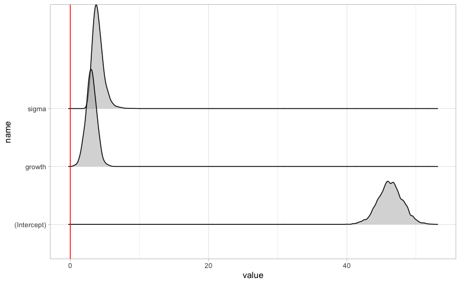
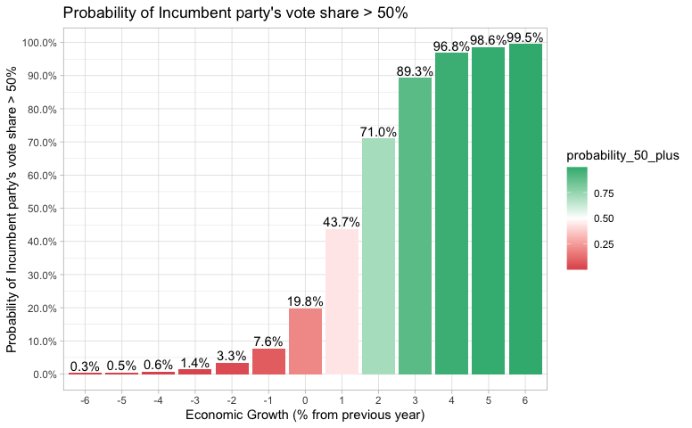
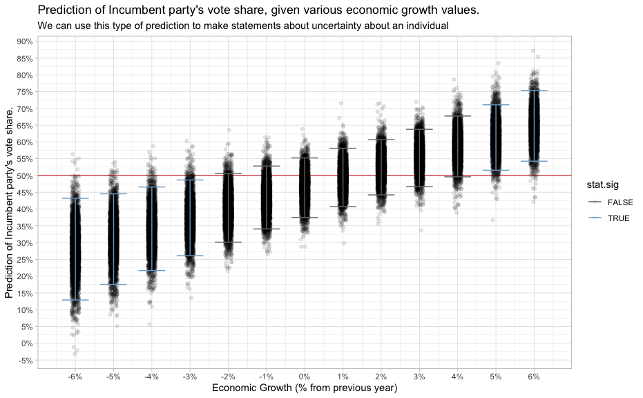

-   [Overview](#overview)
-   [Resources](#resources)
-   [Packages](#packages)
    -   [statistical packages](#statistical-packages)
    -   [base packages](#base-packages)
    -   [Settings](#settings)
-   [Chapter 1 - Overview](#chapter-1---overview)
    -   [Simple Example with `stan_glm`](#simple-example-with-stan_glm)
-   [Chapter 3 - Basic Methods](#chapter-3---basic-methods)
    -   [Log-Log Interpretation](#log-log-interpretation)
        -   [Example Model](#example-model)
        -   [Interpretation](#interpretation)
            -   [Interpretation from
                `Regression and Other Stores`](#interpretation-from-regression-and-other-stores)
            -   [Interpretation from
                `Introductory Econometrics 7e`](#interpretation-from-introductory-econometrics-7e)
        -   [Predictions](#predictions)
        -   [Simulation of Log-Log
            Predictions](#simulation-of-log-log-predictions)
-   [Chapter 4 - Statistcal
    Inference](#chapter-4---statistcal-inference)
    -   [Confidence Interval of
        Proportion](#confidence-interval-of-proportion)
-   [Chapter 5 - Simulation](#chapter-5---simulation)
    -   [How many girls in 400 births?](#how-many-girls-in-400-births)
    -   [Simulation of continuous and mixed discrete/continuous
        models](#simulation-of-continuous-and-mixed-discretecontinuous-models)
    -   [Median Absolute Deviation
        (`MAD SD`)](#median-absolute-deviation-mad-sd)
-   [Chapter 9 - Prediction and Bayesian
    Inference](#chapter-9---prediction-and-bayesian-inference)
    -   [Point Prediction](#point-prediction)
    -   [Linear Predictor with
        Uncertainty](#linear-predictor-with-uncertainty)
    -   [Predictive Distribution](#predictive-distribution)

Overview
========

This document includes examples and exercises from
`Regression and Other Stories` by Andrew Gelman, Jennifer Hill and Aki
Vehtari, 2020, first edition.

Resources
=========

[Errata](https://avehtari.github.io/ROS-Examples/errata.html)

[Authors’
Code](https://avehtari.github.io/ROS-Examples/examples.html#Examples_by_chapters)

Packages
========

statistical packages
--------------------

``` r
library(rstan)
library(rstanarm)
library(bayesplot)
library(loo)
```

base packages
-------------

``` r
library(broom)
library(broom.mixed)

library(tidyverse)
library(ggplot2)
library(scales)
library(ggridges)
```

Settings
--------

``` r
theme_set(theme_light())
options(scipen=999) # non-scientific notation
options(dplyr.summarise.inform=F)
```

Chapter 1 - Overview
====================

Simple Example with `stan_glm`
------------------------------

Load in the data:

``` r
head(hibbs)
```

    ##   year growth  vote inc_party_candidate other_candidate
    ## 1 1952   2.40 44.60           Stevenson      Eisenhower
    ## 2 1956   2.89 57.76          Eisenhower       Stevenson
    ## 3 1960   0.85 49.91               Nixon         Kennedy
    ## 4 1964   4.21 61.34             Johnson       Goldwater
    ## 5 1968   3.02 49.60            Humphrey           Nixon
    ## 6 1972   3.62 61.79               Nixon        McGovern

------------------------------------------------------------------------

Graph data:

``` r
hibbs %>%
    ggplot(aes(x=growth, y=vote)) +
    geom_hline(yintercept = 50, color="red", linetype="dashed") +
    geom_text(aes(label=year)) +
    geom_smooth(method='lm') +
    scale_x_continuous(labels=function(.x)paste0(.x, '%')) +
    scale_y_continuous(labels=function(.x)paste0(.x, '%')) +
    labs(title="Forecasting the election from the economy",
         y="Incuming party's vote share",
         x="Average recent growth in personal",
         caption='Figure 1.1')
```


------------------------------------------------------------------------

Build Model:

``` r
model <- stan_glm(vote ~ growth, data=hibbs)
```

    ## 
    ## SAMPLING FOR MODEL 'continuous' NOW (CHAIN 1).
    ## Chain 1: 
    ## Chain 1: Gradient evaluation took 6.7e-05 seconds
    ## Chain 1: 1000 transitions using 10 leapfrog steps per transition would take 0.67 seconds.
    ## Chain 1: Adjust your expectations accordingly!
    ## Chain 1: 
    ## Chain 1: 
    ## Chain 1: Iteration:    1 / 2000 [  0%]  (Warmup)
    ## Chain 1: Iteration:  200 / 2000 [ 10%]  (Warmup)
    ## Chain 1: Iteration:  400 / 2000 [ 20%]  (Warmup)
    ## Chain 1: Iteration:  600 / 2000 [ 30%]  (Warmup)
    ## Chain 1: Iteration:  800 / 2000 [ 40%]  (Warmup)
    ## Chain 1: Iteration: 1000 / 2000 [ 50%]  (Warmup)
    ## Chain 1: Iteration: 1001 / 2000 [ 50%]  (Sampling)
    ## Chain 1: Iteration: 1200 / 2000 [ 60%]  (Sampling)
    ## Chain 1: Iteration: 1400 / 2000 [ 70%]  (Sampling)
    ## Chain 1: Iteration: 1600 / 2000 [ 80%]  (Sampling)
    ## Chain 1: Iteration: 1800 / 2000 [ 90%]  (Sampling)
    ## Chain 1: Iteration: 2000 / 2000 [100%]  (Sampling)
    ## Chain 1: 
    ## Chain 1:  Elapsed Time: 0.035417 seconds (Warm-up)
    ## Chain 1:                0.03216 seconds (Sampling)
    ## Chain 1:                0.067577 seconds (Total)
    ## Chain 1: 
    ## 
    ## SAMPLING FOR MODEL 'continuous' NOW (CHAIN 2).
    ## Chain 2: 
    ## Chain 2: Gradient evaluation took 8e-06 seconds
    ## Chain 2: 1000 transitions using 10 leapfrog steps per transition would take 0.08 seconds.
    ## Chain 2: Adjust your expectations accordingly!
    ## Chain 2: 
    ## Chain 2: 
    ## Chain 2: Iteration:    1 / 2000 [  0%]  (Warmup)
    ## Chain 2: Iteration:  200 / 2000 [ 10%]  (Warmup)
    ## Chain 2: Iteration:  400 / 2000 [ 20%]  (Warmup)
    ## Chain 2: Iteration:  600 / 2000 [ 30%]  (Warmup)
    ## Chain 2: Iteration:  800 / 2000 [ 40%]  (Warmup)
    ## Chain 2: Iteration: 1000 / 2000 [ 50%]  (Warmup)
    ## Chain 2: Iteration: 1001 / 2000 [ 50%]  (Sampling)
    ## Chain 2: Iteration: 1200 / 2000 [ 60%]  (Sampling)
    ## Chain 2: Iteration: 1400 / 2000 [ 70%]  (Sampling)
    ## Chain 2: Iteration: 1600 / 2000 [ 80%]  (Sampling)
    ## Chain 2: Iteration: 1800 / 2000 [ 90%]  (Sampling)
    ## Chain 2: Iteration: 2000 / 2000 [100%]  (Sampling)
    ## Chain 2: 
    ## Chain 2:  Elapsed Time: 0.030123 seconds (Warm-up)
    ## Chain 2:                0.024511 seconds (Sampling)
    ## Chain 2:                0.054634 seconds (Total)
    ## Chain 2: 
    ## 
    ## SAMPLING FOR MODEL 'continuous' NOW (CHAIN 3).
    ## Chain 3: 
    ## Chain 3: Gradient evaluation took 9e-06 seconds
    ## Chain 3: 1000 transitions using 10 leapfrog steps per transition would take 0.09 seconds.
    ## Chain 3: Adjust your expectations accordingly!
    ## Chain 3: 
    ## Chain 3: 
    ## Chain 3: Iteration:    1 / 2000 [  0%]  (Warmup)
    ## Chain 3: Iteration:  200 / 2000 [ 10%]  (Warmup)
    ## Chain 3: Iteration:  400 / 2000 [ 20%]  (Warmup)
    ## Chain 3: Iteration:  600 / 2000 [ 30%]  (Warmup)
    ## Chain 3: Iteration:  800 / 2000 [ 40%]  (Warmup)
    ## Chain 3: Iteration: 1000 / 2000 [ 50%]  (Warmup)
    ## Chain 3: Iteration: 1001 / 2000 [ 50%]  (Sampling)
    ## Chain 3: Iteration: 1200 / 2000 [ 60%]  (Sampling)
    ## Chain 3: Iteration: 1400 / 2000 [ 70%]  (Sampling)
    ## Chain 3: Iteration: 1600 / 2000 [ 80%]  (Sampling)
    ## Chain 3: Iteration: 1800 / 2000 [ 90%]  (Sampling)
    ## Chain 3: Iteration: 2000 / 2000 [100%]  (Sampling)
    ## Chain 3: 
    ## Chain 3:  Elapsed Time: 0.031737 seconds (Warm-up)
    ## Chain 3:                0.026703 seconds (Sampling)
    ## Chain 3:                0.05844 seconds (Total)
    ## Chain 3: 
    ## 
    ## SAMPLING FOR MODEL 'continuous' NOW (CHAIN 4).
    ## Chain 4: 
    ## Chain 4: Gradient evaluation took 1.1e-05 seconds
    ## Chain 4: 1000 transitions using 10 leapfrog steps per transition would take 0.11 seconds.
    ## Chain 4: Adjust your expectations accordingly!
    ## Chain 4: 
    ## Chain 4: 
    ## Chain 4: Iteration:    1 / 2000 [  0%]  (Warmup)
    ## Chain 4: Iteration:  200 / 2000 [ 10%]  (Warmup)
    ## Chain 4: Iteration:  400 / 2000 [ 20%]  (Warmup)
    ## Chain 4: Iteration:  600 / 2000 [ 30%]  (Warmup)
    ## Chain 4: Iteration:  800 / 2000 [ 40%]  (Warmup)
    ## Chain 4: Iteration: 1000 / 2000 [ 50%]  (Warmup)
    ## Chain 4: Iteration: 1001 / 2000 [ 50%]  (Sampling)
    ## Chain 4: Iteration: 1200 / 2000 [ 60%]  (Sampling)
    ## Chain 4: Iteration: 1400 / 2000 [ 70%]  (Sampling)
    ## Chain 4: Iteration: 1600 / 2000 [ 80%]  (Sampling)
    ## Chain 4: Iteration: 1800 / 2000 [ 90%]  (Sampling)
    ## Chain 4: Iteration: 2000 / 2000 [100%]  (Sampling)
    ## Chain 4: 
    ## Chain 4:  Elapsed Time: 0.030726 seconds (Warm-up)
    ## Chain 4:                0.027397 seconds (Sampling)
    ## Chain 4:                0.058123 seconds (Total)
    ## Chain 4:

------------------------------------------------------------------------

Model Summary:

``` r
summary(model)
```

    ## 
    ## Model Info:
    ##  function:     stan_glm
    ##  family:       gaussian [identity]
    ##  formula:      vote ~ growth
    ##  algorithm:    sampling
    ##  sample:       4000 (posterior sample size)
    ##  priors:       see help('prior_summary')
    ##  observations: 16
    ##  predictors:   2
    ## 
    ## Estimates:
    ##               mean   sd   10%   50%   90%
    ## (Intercept) 46.3    1.7 44.2  46.3  48.5 
    ## growth       3.0    0.8  2.1   3.1   4.0 
    ## sigma        4.0    0.8  3.1   3.9   5.1 
    ## 
    ## Fit Diagnostics:
    ##            mean   sd   10%   50%   90%
    ## mean_PPD 52.1    1.4 50.3  52.1  53.9 
    ## 
    ## The mean_ppd is the sample average posterior predictive distribution of the outcome variable (for details see help('summary.stanreg')).
    ## 
    ## MCMC diagnostics
    ##               mcse Rhat n_eff
    ## (Intercept)   0.0  1.0  2863 
    ## growth        0.0  1.0  2756 
    ## sigma         0.0  1.0  2499 
    ## mean_PPD      0.0  1.0  3256 
    ## log-posterior 0.0  1.0  1618 
    ## 
    ## For each parameter, mcse is Monte Carlo standard error, n_eff is a crude measure of effective sample size, and Rhat is the potential scale reduction factor on split chains (at convergence Rhat=1).

------------------------------------------------------------------------

Print()

``` r
print(model)
```

    ## stan_glm
    ##  family:       gaussian [identity]
    ##  formula:      vote ~ growth
    ##  observations: 16
    ##  predictors:   2
    ## ------
    ##             Median MAD_SD
    ## (Intercept) 46.3    1.6  
    ## growth       3.1    0.7  
    ## 
    ## Auxiliary parameter(s):
    ##       Median MAD_SD
    ## sigma 3.9    0.7   
    ## 
    ## ------
    ## * For help interpreting the printed output see ?print.stanreg
    ## * For info on the priors used see ?prior_summary.stanreg

------------------------------------------------------------------------

Model Coefficients:

``` r
coef(model)
```

    ## (Intercept)      growth 
    ##   46.261185    3.067728

------------------------------------------------------------------------

Compare to `lm()`:

``` r
summary(lm(vote ~ growth, data=hibbs))
```

    ## 
    ## Call:
    ## lm(formula = vote ~ growth, data = hibbs)
    ## 
    ## Residuals:
    ##     Min      1Q  Median      3Q     Max 
    ## -8.9929 -0.6674  0.2556  2.3225  5.3094 
    ## 
    ## Coefficients:
    ##             Estimate Std. Error t value           Pr(>|t|)    
    ## (Intercept)  46.2476     1.6219  28.514 0.0000000000000841 ***
    ## growth        3.0605     0.6963   4.396            0.00061 ***
    ## ---
    ## Signif. codes:  0 '***' 0.001 '**' 0.01 '*' 0.05 '.' 0.1 ' ' 1
    ## 
    ## Residual standard error: 3.763 on 14 degrees of freedom
    ## Multiple R-squared:  0.5798, Adjusted R-squared:  0.5498 
    ## F-statistic: 19.32 on 1 and 14 DF,  p-value: 0.00061

(pretty close)

------------------------------------------------------------------------

Graph using model coefficients rather than `geom_smooth(method='lm')`

``` r
hibbs %>%
    ggplot(aes(x=growth, y=vote)) +
    geom_hline(yintercept = 50, color="red", linetype="dashed") +
    geom_text(aes(label=year)) +
    #geom_smooth(method='lm') +
    geom_abline(intercept = coef(model)['(Intercept)'], slope = coef(model)['growth']) +
    scale_x_continuous(labels=function(.x)paste0(.x, '%')) +
    scale_y_continuous(labels=function(.x)paste0(.x, '%')) +
    labs(title="Forecasting the election from the economy",
         y="Incuming party's vote share",
         x="Average recent growth in personal",
         caption='Figure 1.1')
```


------------------------------------------------------------------------

Chapter 3 - Basic Methods
=========================

Log-Log Interpretation
----------------------

Example from \`Regression & Other Stories pg 39. (Data found elsewhere.)

### Example Model

``` r
metabolic_rate <- read_csv("data/Primate Body Mass and Basal Metabolic Rate.csv")
head(metabolic_rate)
```

    ## # A tibble: 6 x 2
    ##   `Primate Mass` `Metabolic Rate`
    ##            <dbl>            <dbl>
    ## 1           4670            11.6 
    ## 2           1020             2.56
    ## 3            206             0.73
    ## 4            190             0.86
    ## 5            105             0.55
    ## 6            300             1.1

``` r
metabolic_rate %>%
    ggplot(aes(x=`Primate Mass`, y=`Metabolic Rate`)) +
    geom_point() +
    geom_text(data=metabolic_rate, 
              aes(x=`Primate Mass`, y=`Metabolic Rate`,
                  label=glue::glue("({ `Primate Mass` }, { `Metabolic Rate` })"),
                  color=NULL),
              vjust=-0.5, check_overlap = TRUE) +
    labs(title="Primate Body Mass And Basal Metabolic Rate",
         subtitle = "(Not Scaled)")
```


``` r
metabolic_rate %>%
    ggplot(aes(x=`Primate Mass`, y=`Metabolic Rate`)) +
    geom_point() +
    geom_text(data=metabolic_rate, 
              aes(x=`Primate Mass`, y=`Metabolic Rate`,
                  label=glue::glue("({ `Primate Mass` }, { `Metabolic Rate` })"),
                  color=NULL),
              vjust=-0.5, check_overlap = TRUE) +
    scale_x_log10() +
    scale_y_log10() +
    labs(title="Primate Body Mass And Basal Metabolic Rate",
         subtitle = "Log Scaled")
```


``` r
model <- lm(log(`Metabolic Rate`) ~ log(`Primate Mass`), data=metabolic_rate)
summary(model)
```

    ## 
    ## Call:
    ## lm(formula = log(`Metabolic Rate`) ~ log(`Primate Mass`), data = metabolic_rate)
    ## 
    ## Residuals:
    ##      Min       1Q   Median       3Q      Max 
    ## -0.71136 -0.13959  0.01586  0.14175  0.57990 
    ## 
    ## Coefficients:
    ##                     Estimate Std. Error t value        Pr(>|t|)    
    ## (Intercept)         -4.05787    0.28770  -14.11 0.0000000004613 ***
    ## log(`Primate Mass`)  0.74160    0.04198   17.66 0.0000000000189 ***
    ## ---
    ## Signif. codes:  0 '***' 0.001 '**' 0.01 '*' 0.05 '.' 0.1 ' ' 1
    ## 
    ## Residual standard error: 0.2983 on 15 degrees of freedom
    ## Multiple R-squared:  0.9541, Adjusted R-squared:  0.9511 
    ## F-statistic:   312 on 1 and 15 DF,  p-value: 0.00000000001891

``` r
coef(model)
```

    ##         (Intercept) log(`Primate Mass`) 
    ##           -4.057868            0.741598

### Interpretation

#### Interpretation from `Regression and Other Stores`

From `pg. 40`

“For example, when increasing body mass on this curve by a factor of 2,
metabolic rate is multiplied by `2^0.74` = `1.7`. Multiplgying body mass
by `10` corresponds to multiplying metabolic rate by `10^0.74` = `5.5`,
and so forth.”

``` r
(primate_mass_coefficient <- unname(coef(model)['log(`Primate Mass`)']))
```

    ## [1] 0.741598

Lets test this. We’ll start with a body mass of `105`.

``` r
(log_prediction_105 <- predict(model, newdata = data.frame(`Primate Mass`=105, check.names = FALSE)))
```

    ##       1 
    ## -0.6065

``` r
(prediction_105 <- exp(log_prediction_105))
```

    ##         1 
    ## 0.5452559

Our prediction of the metabolic rate is `0.5452559`.

What is our prediction if we **double** the body mass?

We would expect a Metabolic Rate of `0.9116825`.

``` r
2^primate_mass_coefficient * prediction_105
```

    ##         1 
    ## 0.9116825

What is the actual prediction if we double the body mass?

``` r
log_prediction_210 <- predict(model, newdata = data.frame(`Primate Mass`=210, check.names = FALSE))
(prediction_210 <- exp(log_prediction_210))
```

    ##         1 
    ## 0.9116825

------------------------------------------------------------------------

What is our prediction if we multiply body mass by `10`?

We would expect a Metabolic Rate of `3.0074496`.

``` r
10^primate_mass_coefficient * prediction_105
```

    ##       1 
    ## 3.00745

What is the actual prediction if we double the body mass?

``` r
log_prediction_1050 <- predict(model, newdata = data.frame(`Primate Mass`=1050, check.names = FALSE))
(prediction_1050 <- exp(log_prediction_1050))
```

    ##       1 
    ## 3.00745

------------------------------------------------------------------------

#### Interpretation from `Introductory Econometrics 7e`

> "A one-unit difference in `log x` corresponds to an additive
> difference of `b` in `log y`. (R&OS pg. 39)

This is essentially “elasticity” and is interpreted as a `1%` change in
x has a `b`% change in `y` (Intro Econometrics pg. 39), although this
does not hold for large changes in `y` (Intro Econometrics pg. 186).

``` r
format_percent <- function(.x) { paste0(round(.x, 3), '%')}
format_percent_scale <- function(.x) { paste0(round(.x * 100, 3), '%')}

(expected_one_percent_change <- format_percent(primate_mass_coefficient))
```

    ## [1] "0.742%"

So, the interpretation of the `log(Primate Mass)` coefficient is that a
`1%` change in `Primate Mass` results in a `~0.742%` change in
`Metabolic Rate`.

Let’s see if this is true.

If the `Primate Mass` is `105` then our prediction of
`log(Metabolic Rate`) is `-0.6065`, which means our prediction of
`Metabolic Rate` is `0.5452559`, which matches the point on the graph.

Now let’s change `Primate Mass` (x) by `1%` and see how much
`Metabolic Rate` (y) changes by.

``` r
(one_percent_change <- (0.01 * 105) + 105)
```

    ## [1] 106.05

``` r
one_percent_change_prediction <- predict(model, newdata = data.frame(`Primate Mass`=one_percent_change, check.names = FALSE))
(one_percent_change_prediction <- exp(one_percent_change_prediction))
```

    ##         1 
    ## 0.5492943

So if `Primate Mass` is `106.05` then we predict that `Metabolic Rate`
is `0.5492943`.

So a `1%` change in `Primate Mass` resulted in the following percent
change for `Metabolic Rate`:

``` r
format_percent_scale((one_percent_change_prediction - prediction_105) / prediction_105)
```

    ## [1] "0.741%"

Which matches the expected percent change from the coefficient.

``` r
primate_mass_coefficient
```

    ## [1] 0.741598

------------------------------------------------------------------------

Now, lets try with a larger change.

Lets predict `Metabolic Change` for a `Primate Mass` of `9,500`

``` r
(percent_change <- (9500 - 105) / 105)
```

    ## [1] 89.47619

The percent-change in `Primate Mass` between these two values is
`8947.619%`.

``` r
(expected_percent_change_y <- as.numeric(coef(model)["log(`Primate Mass`)"]) * percent_change)
```

    ## [1] 66.35536

Therefore, if `Primate Mass` changes by `8947.619%`, the **expected**
percent change in `Metabolic Rate` should be `6635.536%`.

But the actual percent change is:

``` r
(prediction_9500 <- exp(predict(model, newdata = data.frame(`Primate Mass`=9500, check.names = FALSE))))
```

    ##        1 
    ## 15.40147

``` r
format_percent_scale((prediction_9500 - prediction_105) / prediction_105)
```

    ## [1] "2724.632%"

Which is quite lower than what we expected.

So this rule of thumb doesn’t work across large changes in `y`.

### Predictions

According to `Introductory Econometrics, Wooldridge (pg. 206)`,

> Because the exponential undoes the log, our first guess for predicting
> y (when dependent variable is log(y)) is to simply exponentiate the
> predicted value for `log(y): y_predicted = exp(log y_predicted))`.
> **This does not work; in fact, it will systematically underestimate
> the expected value of y**.

One adjustment that the author describes is the
`Duan smearing estimate`.

> Given an esimtate `a0`, we can predict `y` as
>
> `y_predicted = a0 * exp(log y_predicted)`

where,

> `a0 = sum(exp(residuals)) / N`

The code below implements the `Duan smearing estimate`.

Note, that this adjustment necessary, not just for `log y = log x`
models, but for `log y = x` models (any time the dependent variable is
log y, regardless of X).

``` r
#' This method returns the adjustment coefficient described in `Introductory Econometrics, Wooldridge (pg. 206)`
#' @param .model the regression model
duan_smearing_adjustment <- function(.model) {
    model_residuals <- residuals(.model)
    duan_smearing_coefficient <- sum(exp(model_residuals)) / length(model_residuals)
    
    return (duan_smearing_coefficient)
}

#' This method returns the prediction of `y`, when the dependent variable is `log y`, based on the adjustment coefficient described in `Introductory Econometrics, Wooldridge (pg. 206)`
#' @param .model the regression model
#' @param .newdata the data (e.g. test data) from which predictions will be generated
predict_from_log_y <- function(.model, .newdata) {
    
    duan_smearing_coefficient <- duan_smearing_adjustment(.model)
    .predictions <- predict(.model, newdata=.newdata)
    .predictions <- duan_smearing_coefficient*exp(.predictions)

    return (.predictions)
}
```

Now, let’s create predictions for all `Primate Masses` between `50` and
`80000`, which is around the interval of our data.

``` r
all_predictions <- data.frame(`Primate Mass`=seq(50, 80000), check.names = FALSE)
log_y_predictions <- predict(model, newdata=all_predictions)

# this simple adjustment is also described on pg 206 but assumes normal residuals
all_predictions$`Predictions - Unadjusted` <- exp(log_y_predictions)
all_predictions$`Predictions - Adjusted - Simple` <- exp(((summary(model)$sigma)^2)/2)*exp(log_y_predictions)
all_predictions$`Predictions - Adjusted - Duan` <- predict_from_log_y(.model=model, .newdata=all_predictions)
head(all_predictions)
```

    ##   Primate Mass Predictions - Unadjusted Predictions - Adjusted - Simple
    ## 1           50                0.3145163                       0.3288212
    ## 2           51                0.3191693                       0.3336858
    ## 3           52                0.3237987                       0.3385258
    ## 4           53                0.3284052                       0.3433418
    ## 5           54                0.3329892                       0.3481343
    ## 6           55                0.3375514                       0.3529040
    ##   Predictions - Adjusted - Duan
    ## 1                     0.3266032
    ## 2                     0.3314350
    ## 3                     0.3362423
    ## 4                     0.3410258
    ## 5                     0.3457860
    ## 6                     0.3505236

``` r
predictions_long <- all_predictions %>% 
    # get the original values, where applicable
    #left_join(metabolic_rate, by = 'Primate Mass') %>%
    pivot_longer(-`Primate Mass`, names_to = 'Prediction Type', values_to='Metabolic Rate')

metabolic_rate_plot <- predictions_long %>%
    ggplot(aes(x=`Primate Mass`, y=`Metabolic Rate`, color=`Prediction Type`)) +
    geom_point(data=metabolic_rate, aes(x=`Primate Mass`, y=`Metabolic Rate`, color=NULL)) +
    geom_text(data=metabolic_rate, 
              aes(x=`Primate Mass`, y=`Metabolic Rate`,
                  label=glue::glue("({ `Primate Mass` }, { `Metabolic Rate` })"),
                  color=NULL),
              vjust=-0.5, check_overlap = TRUE) +
    geom_line()

metabolic_rate_plot +
    scale_x_log10() +
    scale_y_log10() +
    labs(title="Primate Body Mass And Basal Metabolic Rate",
         subtitle = "Log Scaled")
```


``` r
metabolic_rate_plot +
    labs(title="Primate Body Mass And Basal Metabolic Rate",
         subtitle = "Unscaled")
```



------------------------------------------------------------------------

### Simulation of Log-Log Predictions

See discussion in previous section regarding systematic underprediction
of `y` when dependent varaible is `log y`.

`log y = a + b*log x + random-noise`

``` r
set.seed(1)
intercept <- 4
b_coefficient <- 3
simulated_x <- rexp(100000, rate = 0.5) + 1
noise <- rnorm(100000, sd = 0.5)

simulated_y <- exp(intercept + b_coefficient*log(simulated_x) + noise)

simulated_data <- data.frame(simulated_x, simulated_y)
simulated_data %>%
    ggplot(aes(x=simulated_x, y=simulated_y)) +
    geom_point(alpha=0.1) +
    scale_x_log10(breaks=2^seq(0,6)) +
    scale_y_log10(breaks=10^seq(1,6)) +
    labs(title="Simulated Data (`log y = a + b*log x + random-noise`)",
         subtitle = "Graphed on a log-scale.")
```


------------------------------------------------------------------------

Create training/test sets, fit model on training data.

``` r
training_indices <- sample.int(n=nrow(simulated_data), size = 0.7*nrow(simulated_data), replace = FALSE)
training_data <- simulated_data[training_indices,]
test_data <- simulated_data[-training_indices,]
model <- lm(log(simulated_y) ~ log(simulated_x), data=training_data)
summary(model)
```

    ## 
    ## Call:
    ## lm(formula = log(simulated_y) ~ log(simulated_x), data = training_data)
    ## 
    ## Residuals:
    ##     Min      1Q  Median      3Q     Max 
    ## -2.1152 -0.3373 -0.0019  0.3348  2.1345 
    ## 
    ## Coefficients:
    ##                  Estimate Std. Error t value            Pr(>|t|)    
    ## (Intercept)      4.001214   0.003572  1120.1 <0.0000000000000002 ***
    ## log(simulated_x) 2.999279   0.003273   916.3 <0.0000000000000002 ***
    ## ---
    ## Signif. codes:  0 '***' 0.001 '**' 0.01 '*' 0.05 '.' 0.1 ' ' 1
    ## 
    ## Residual standard error: 0.499 on 69998 degrees of freedom
    ## Multiple R-squared:  0.923,  Adjusted R-squared:  0.923 
    ## F-statistic: 8.396e+05 on 1 and 69998 DF,  p-value: < 0.00000000000000022

------------------------------------------------------------------------

Predict on test data.

``` r
log_y_predictions <- predict(model, newdata=test_data)

# this simple adjustment is also described on pg 206 but assumes normal residuals
test_data$`Predictions - Unadjusted` <- exp(log_y_predictions)
test_data$`Predictions - Adjusted - Simple` <- exp(((summary(model)$sigma)^2)/2)*exp(log_y_predictions)
test_data$`Predictions - Adjusted - Duan` <- predict_from_log_y(.model=model, .newdata=test_data)
head(test_data)
```

    ##    simulated_x simulated_y Predictions - Unadjusted
    ## 2     3.363286   3187.9213                2077.8609
    ## 6     6.789937  25807.5974               17088.4407
    ## 8     2.079366    495.4461                 491.2115
    ## 10    1.294092    110.9351                 118.4459
    ## 12    2.524060    700.3071                 878.4439
    ## 17    4.752070   3923.7267                5859.5674
    ##    Predictions - Adjusted - Simple Predictions - Adjusted - Duan
    ## 2                        2353.3864                     2354.6418
    ## 6                       19354.3771                    19364.7015
    ## 8                         556.3464                      556.6431
    ## 10                        134.1518                      134.2234
    ## 12                        994.9260                      995.4568
    ## 17                       6636.5492                     6640.0894

------------------------------------------------------------------------

``` r
predictions_long <- test_data %>%
    select(-simulated_y) %>%
    # get the original values, where applicable
    #left_join(metabolic_rate, by = 'Primate Mass') %>%
    pivot_longer(-simulated_x, names_to = 'Prediction Type', values_to='Predicted Y')

simulated_plot <- predictions_long %>%
    ggplot(aes(x=simulated_x, y=`Predicted Y`, color=`Prediction Type`)) +
    geom_point(data=test_data, aes(x=simulated_x, y=simulated_y, color=NULL), alpha=0.2) +
    geom_line()

simulated_plot +
    scale_x_log10(breaks=2^seq(0,6)) +
    scale_y_log10(breaks=10^seq(1,6)) +
    labs(title="Simulated Data & Predictions",
         subtitle = "Log Scaled",
         caption="The 'Simple' and 'Duan' adjustments are slow close that they overlap,\nand the Duan is being hidden behind the Simple.")
```


------------------------------------------------------------------------

``` r
simulated_plot +
    labs(title="Simulated Data & Predictions",
         subtitle = "Not Scaled",
         caption="The 'Simple' and 'Duan' adjustments are slow close that they overlap,\nand the Duan is being hidden behind the Simple.")
```


------------------------------------------------------------------------

The adjustments seem to make sense, visualy; but we can check the
`Root Mean Square Error` (`RMSE`) to see if the adjustments actually
results in a better **out-of-sample** fit, below (which it appears is
the case; there is a lower error for the adjusted predictions).

``` r
rmse = function(fitted, actual){
  sqrt(mean((fitted - actual)^2))
}

rmse(fitted=test_data$`Predictions - Unadjusted`, actual=test_data$simulated_y)
```

    ## [1] 8968.512

``` r
rmse(fitted=test_data$`Predictions - Adjusted - Simple`, actual=test_data$simulated_y)
```

    ## [1] 8546.481

``` r
rmse(fitted=test_data$`Predictions - Adjusted - Duan`, actual=test_data$simulated_y)
```

    ## [1] 8545.582

NOTE: the “Simple” adjustment (found in
`Introductory Econometrics, Wooldridge (pg. 206)`) is only valid for
residuals that are normally distributed. In this simulation, the
residuals are normally distributed; and the Simple and Duan adjustments
are quite similar.

------------------------------------------------------------------------

We can do another performance check using `R-Squared`, which is a
measure of the percent of variance in the dependent variable (y) that is
explained by the model. The higher the R-squared, the better.

``` r
#' these functions are from `Business Data Science, Taddy, pg 72`
#' @param y the actual y values
#' @param pred the predictions; must be probabilities (0<pred<1) for binomial
deviance <- function(y, pred, family=c("gaussian","binomial")){
    family <- match.arg(family)
    if(family=="gaussian"){
        return( sum( (y-pred)^2 ) )
    }else{
        if(is.factor(y)) y <- as.numeric(y)>1
        return( -2*sum( y*log(pred) + (1-y)*log(1-pred) ) )
    }
}
#' these functions are from `Business Data Science, Taddy, pg 72`
#' returns r-squared which is a measure of the percent of variance in the dependent variable (y) that is explained by the model.
#' @param y the actual y values
#' @param pred the predictions; must be probabilities (0<pred<1) for binomial
R2 <- function(y, pred, family=c("gaussian","binomial")){
    fam <- match.arg(family)
    if(fam=="binomial"){
        if(is.factor(y)){ y <- as.numeric(y)>1 }
    }
    dev <- deviance(y, pred, family=fam)
    dev0 <- deviance(y, mean(y), family=fam)
    return(1-dev/dev0)
}
```

We can see that the adjusted predictions do have a higher `R-Squared`
than the unadjsuted.

``` r
R2(pred=test_data$`Predictions - Unadjusted`, y=test_data$simulated_y)
```

    ## [1] 0.782397

``` r
R2(pred=test_data$`Predictions - Adjusted - Simple`, y=test_data$simulated_y)
```

    ## [1] 0.8023946

``` r
R2(pred=test_data$`Predictions - Adjusted - Duan`, y=test_data$simulated_y)
```

    ## [1] 0.8024362

Chapter 4 - Statistcal Inference
================================

Confidence Interval of Proportion
---------------------------------

``` r
sample_size <- 1000
respond_yes <- 700

(estimate <- respond_yes / sample_size)
```

    ## [1] 0.7

``` r
(standard_error <- sqrt(estimate * (1 - estimate) / sample_size))
```

    ## [1] 0.01449138

``` r
(z_scores <- qnorm(c(0.025, 0.975)))
```

    ## [1] -1.959964  1.959964

``` r
(confidence_interval_95 <- estimate + (z_scores * standard_error))
```

    ## [1] 0.6715974 0.7284026

------------------------------------------------------------------------

Compare to R’s `prop.test`.

``` r
prop.test(x=respond_yes, n=sample_size)
```

    ## 
    ##  1-sample proportions test with continuity correction
    ## 
    ## data:  respond_yes out of sample_size, null probability 0.5
    ## X-squared = 159.2, df = 1, p-value < 0.00000000000000022
    ## alternative hypothesis: true p is not equal to 0.5
    ## 95 percent confidence interval:
    ##  0.6703646 0.7280778
    ## sample estimates:
    ##   p 
    ## 0.7

Chapter 5 - Simulation
======================

How many girls in 400 births?
-----------------------------

``` r
probability_girl <- 0.488
sample_size <- 400
# one random sample (simulated)
number_of_simulated_samples <- 1
set.seed(1)
rbinom(n = number_of_simulated_samples, size=sample_size, prob = probability_girl)
```

    ## [1] 196

``` r
number_of_simulated_samples <- 1000
set.seed(1)
simulations <- rbinom(n = number_of_simulated_samples, size=sample_size, prob = probability_girl)
simulations[1:10]
```

    ##  [1] 196 195 184 213 198 183 192 168 178 196

95% Interval

``` r
quantile(simulations, c(0.025, 0.975))
```

    ##  2.5% 97.5% 
    ##   176   216

``` r
hist(simulations)
```


------------------------------------------------------------------------

Accounting for twins.

First, simulate birth types of 400 births.

``` r
set.seed(2)
probability_girl_if_twins <- 0.495
probability_of_twins_fraternal <- 1/125  # each has a 49.5% of being a girl
probability_of_twins_identical <- 1/300  # 49.5% chance of being a pair of girls.

simulate_birth_types <- function() {
    
    sample(x=c('fraternal twin', 'identical twin', 'single born'),
           size = sample_size,
           replace = TRUE,
           prob = c(probability_of_twins_fraternal,
                    probability_of_twins_identical,
                    1 - probability_of_twins_fraternal - probability_of_twins_identical))
}
birth_type <- simulate_birth_types()
table(birth_type)
```

    ## birth_type
    ## fraternal twin identical twin    single born 
    ##              2              1            397

Simulating Number of Girls if Fraternal Twin. In this scenario, there
are `2` different people, each of which has a
`49.5% percent chance of being a girl. So the possible outcomes are`0`,`1`,`2\`

-   `0`: 0 girls (both boys)
-   `1`: 1 girl
-   `2`: 2 both

``` r
hist(rbinom(n=10000,  # simulate this scenario 10K times
            size=2, # two different possible chances of being a girl
            prob=probability_girl_if_twins))
```



Simulating Number of Girls if Identical Twin. In this scenario, they are
either both boys, or both girls. So the possible outcomes are either `0`
or `2`

-   `0`: 0 girls (both boys)
-   `2`: both girls

In other words, we’ll simulate the binary outcome of either both girls
or both boys, but the former means we have to count 2 people, so we’ll
multiple the number of people by 2

``` r
hist(2 * rbinom(n=10000,  # simulate this scenario 10K times
                size=1, # two different possible chances of being a girl
                prob=probability_girl_if_twins))
```


Now, we will do 1000 simulations of births, considering
fraternal/identical twins; each simulation has a sample-size of 400.

``` r
set.seed(1)
simulation_results <- replicate(1000, {
    birth_type <- simulate_birth_types()
    
    sample_of_girls <- map_dbl(birth_type, ~ {

        if(. == 'fraternal twin') {
            # simulate number of girls for this particular simulated birth_type
            number_of_girls <- rbinom(n=1,
                   size=2, # two different possible chances of being a girl
                   prob=probability_girl_if_twins)
            
        } else if(. == 'identical twin') {
            # simulate number of girls for this particular simulated birth_type
            number_of_girls <- 2 * rbinom(n=1,
                size=1, # two different possible chances of being a girl
                prob=probability_girl_if_twins)
            
        } else if(. == 'single born') {
            # simulate number of girls for this particular simulated birth_type
            number_of_girls <- rbinom(1, 1, probability_girl)
            
        } else {
            stop()
        }
        
        return(number_of_girls)
    })
    stopifnot(length(sample_of_girls) == sample_size)
    return (sum(sample_of_girls))
})
```

``` r
quantile(simulation_results, c(0.025, 0.975))
```

    ##  2.5% 97.5% 
    ##   178   216

``` r
hist(simulation_results)
```


Simulation of continuous and mixed discrete/continuous models
-------------------------------------------------------------

``` r
n_sims <- 1000
y1 <- rnorm(n = n_sims, mean = 3, sd = 0.5)
y2 <- exp(x = y1)
y3 <- rbinom(n = n_sims, size = 20, prob = 0.6)
y4 <- rpois(n = n_sims, lambda = 5)
```



Median Absolute Deviation (`MAD SD`)
------------------------------------

``` r
set.seed(1)
z <- rnorm(10000, 5, 2)
hist(z)
```


``` r
rnd3 <- function(.x) {
    round(.x, 3)
}
glue::glue("mean = { rnd3(mean(z)) }, sd = { rnd3(sd(z)) }, median = { rnd3(median(z)) }, mad sd = { rnd3(mad(z)) }")
```

    ## mean = 4.987, sd = 2.025, median = 4.968, mad sd = 1.997

``` r
constant <- 1.4826  # 1.483 defined R&OS pg 73; but function uses more specific number
constant * median(abs(z - median(z)))
```

    ## [1] 1.996752

``` r
mad(z)
```

    ## [1] 1.996752

------------------------------------------------------------------------

The above is a single sample if `10,000` observations.

The `standard error` (i.e. expected **standard deviation** of the
**distribution** of **sample means** (if we were going to run this
simulation many times (or draw a random sample from the population many
times))) is:

``` r
sd(z) / sqrt(length(z))
```

    ## [1] 0.02024713

We can also simulate this.

First, lets run a `1,000` simulations of drawing a sample of `10,000`
observations. Each time we’ll take the mean of those 10,000
observations. So we’ll have a distribution of (1000) sample means.

The standard deviation of the distribution of sample means is:

``` r
set.seed(1)
simulations <- replicate(1000, mean(rnorm(10000, 5, 2)))
sd(simulations)
```

    ## [1] 0.01941111

Which is fairly close to our calculated standard error.

``` r
quantile(simulations, c(0.025, 0.975))
```

    ##     2.5%    97.5% 
    ## 4.960204 5.038125

``` r
hist(simulations, main = "Distribution of Sample Means")
```


Chapter 9 - Prediction and Bayesian Inference
=============================================

``` r
head(hibbs)
```

    ##   year growth  vote inc_party_candidate other_candidate
    ## 1 1952   2.40 44.60           Stevenson      Eisenhower
    ## 2 1956   2.89 57.76          Eisenhower       Stevenson
    ## 3 1960   0.85 49.91               Nixon         Kennedy
    ## 4 1964   4.21 61.34             Johnson       Goldwater
    ## 5 1968   3.02 49.60            Humphrey           Nixon
    ## 6 1972   3.62 61.79               Nixon        McGovern

``` r
# refresh = 0 supresses the default Stan sampling progress output
model <- stan_glm(vote ~ growth, data=hibbs, refresh=0)
print(model)
```

    ## stan_glm
    ##  family:       gaussian [identity]
    ##  formula:      vote ~ growth
    ##  observations: 16
    ##  predictors:   2
    ## ------
    ##             Median MAD_SD
    ## (Intercept) 46.3    1.7  
    ## growth       3.0    0.7  
    ## 
    ## Auxiliary parameter(s):
    ##       Median MAD_SD
    ## sigma 3.9    0.7   
    ## 
    ## ------
    ## * For help interpreting the printed output see ?print.stanreg
    ## * For info on the priors used see ?prior_summary.stanreg

> These numbers are summaries of a matrix of simulations representing
> different possible values of the parameters
> (intercept/slope/residual-standard-deviation). `pg. 113`

> We have a set of `posterior simulations` rather than a single point
> estimate because we have uncertainty about these parameters. `pg. 113`

``` r
simulations <- as.matrix(model)
head(simulations)
```

    ##           parameters
    ## iterations (Intercept)   growth    sigma
    ##       [1,]    47.62082 2.864881 6.521684
    ##       [2,]    45.43180 3.159804 2.789614
    ##       [3,]    45.00267 3.788277 2.664788
    ##       [4,]    47.63697 2.772102 2.962032
    ##       [5,]    46.50408 2.978387 3.019823
    ##       [6,]    46.60710 3.003798 3.251705

``` r
model %>% tidy()
```

    ## # A tibble: 2 x 3
    ##   term        estimate std.error
    ##   <chr>          <dbl>     <dbl>
    ## 1 (Intercept)    46.3      1.69 
    ## 2 growth          3.03     0.696

``` r
median(simulations[, '(Intercept)'])
```

    ## [1] 46.3117

``` r
mad(simulations[, '(Intercept)'])
```

    ## [1] 1.689381

``` r
median(simulations[, 'growth'])
```

    ## [1] 3.032582

``` r
mad(simulations[, 'growth'])
```

    ## [1] 0.6956641

------------------------------------------------------------------------

``` r
simulations %>%
    as.data.frame() %>%
    mutate(index=row_number()) %>%
    pivot_longer(-index) %>%
    #mutate(stat.sig = factor(stat.sig, levels=c("TRUE", "FALSE"))) %>%
    #mutate(name = fct_reorder(name, coef_median)) %>%
    ggplot(aes(x=value, y=name)) +
    geom_density_ridges(alpha=0.5) +
    geom_vline(xintercept = 0, color='red')
```



------------------------------------------------------------------------

``` r
simulations %>%
    as.data.frame() %>%
    mutate(index=row_number()) %>%
    pivot_longer(-index) %>%
    group_by(name) %>%
    summarise(coef_median = median(value),
              coef_mad = mad(value),
              conf.low = coef_median - 2*coef_mad,
              conf.high = coef_median + 2*coef_mad,
              # this is sudo p.value
              # it's the percent of times the simulated values are below zero (if coef_median is greater than zero), or vice-versa
              p.value=ifelse(coef_median > 0, sum(value <= 0) / n(), sum(value >= 0) / n()),
              stat.sig = p.value <= 0.05) %>%
    ungroup() %>%
    mutate(stat.sig = factor(stat.sig, levels=c("TRUE", "FALSE"))) %>%
    mutate(name = fct_reorder(name, coef_median)) %>%
    ggplot(aes(x=coef_median, y=name, color=stat.sig)) +
    geom_point() +
    geom_vline(xintercept = 0, color='red') +
    geom_errorbar(aes(xmin=conf.low, xmax=conf.high)) +
    scale_color_manual(values=c("#37B57F", "#DF585C"))
```


Point Prediction
----------------

``` r
new_data <- data.frame(growth=2.0)
predict(object = model, newdata = new_data)
```

    ##        1 
    ## 52.36997

Linear Predictor with Uncertainty
---------------------------------

> We can use `posterior_linpred` to get uncertainty in the value of the
> fitted regression line. (pg. 116)

``` r
y_linpredict <- posterior_linpred(object=model, newdata = new_data)
head(y_linpredict)
```

    ##           
    ## iterations        1
    ##       [1,] 53.35058
    ##       [2,] 51.75141
    ##       [3,] 52.57922
    ##       [4,] 53.18117
    ##       [5,] 52.46085
    ##       [6,] 52.61470

> Equivalently we can use the function `posterior_epred`, which returns
> the expected prediction for a new data point. For linear regression,
> the expected value is the same as the linear predcitor, but as we
> dicuss in Chapter 13, these two quantities differ for nonlinear
> models. (pg 116)

``` r
head(posterior_epred(object=model, newdata = new_data))
```

    ##           
    ## iterations        1
    ##       [1,] 53.35058
    ##       [2,] 51.75141
    ##       [3,] 52.57922
    ##       [4,] 53.18117
    ##       [5,] 52.46085
    ##       [6,] 52.61470

To understand what these predictions are, we could have calculated them
by hand using the simulations output.

``` r
simulations %>%
    as.data.frame() %>%
    select(-sigma) %>%
    mutate(prediction = `(Intercept)` + growth * 2.0)
```

    ##      (Intercept)    growth prediction
    ## 1       47.62082 2.8648807   53.35058
    ## 2       45.43180 3.1598043   51.75141
    ## 3       45.00267 3.7882772   52.57922
    ## 4       47.63697 2.7721021   53.18117
    ## 5       46.50408 2.9783869   52.46085
    ## 6       46.60710 3.0037981   52.61470
    ## 7       46.58406 2.7962921   52.17664
    ## 8       46.13959 3.3801468   52.89988
    ## 9       45.30623 3.2620340   51.83030
    ## 10      47.32441 2.6174309   52.55927
    ## 11      48.68826 2.0628062   52.81388
    ## 12      43.84976 4.1418952   52.13355
    ## 13      46.91205 2.5397351   51.99153
    ## 14      49.25969 1.6151975   52.49008
    ## 15      49.66467 1.6209348   52.90654
    ## 16      49.48634 1.5136735   52.51369
    ## 17      44.95433 3.4110686   51.77647
    ## 18      49.05150 2.5685072   54.18851
    ## 19      44.60912 2.7447985   50.09871
    ## 20      48.19729 3.0497510   54.29680
    ## 21      46.87727 3.3827144   53.64270
    ## 22      46.56639 3.5384633   53.64332
    ## 23      45.30421 4.0703352   53.44488
    ## 24      46.62745 2.4602697   51.54799
    ## 25      46.89599 3.4473121   53.79061
    ## 26      46.64672 2.4321204   51.51096
    ## 27      46.89082 2.9795480   52.84991
    ## 28      47.76490 2.0659494   51.89679
    ## 29      49.06319 2.0933711   53.24994
    ## 30      44.12705 3.2353952   50.59784
    ## 31      44.41015 3.1884040   50.78695
    ## 32      44.71712 3.3409849   51.39909
    ## 33      48.98127 1.3498771   51.68103
    ## 34      48.74889 1.3914595   51.53181
    ## 35      46.89017 2.3550731   51.60032
    ## 36      46.86384 2.5355114   51.93487
    ## 37      43.14856 3.7612196   50.67100
    ## 38      46.01911 2.8943147   51.80774
    ## 39      45.94786 3.0817260   52.11131
    ## 40      45.69602 3.1222148   51.94045
    ## 41      43.65378 3.5227583   50.69930
    ## 42      48.28604 2.7788324   53.84370
    ## 43      45.08338 3.6021303   52.28764
    ## 44      47.04698 2.8081674   52.66331
    ## 45      46.49987 3.2370636   52.97400
    ## 46      45.97732 2.5922639   51.16185
    ## 47      47.98323 1.7540745   51.49138
    ## 48      46.32205 2.5975827   51.51722
    ## 49      46.20033 2.8425964   51.88553
    ## 50      45.88990 3.4146976   52.71929
    ## 51      45.87619 2.8299505   51.53609
    ## 52      46.69292 2.8901460   52.47321
    ## 53      46.56526 2.8403428   52.24595
    ## 54      45.74055 3.3122266   52.36500
    ## 55      45.78830 3.3143406   52.41698
    ## 56      44.42623 3.6526368   51.73150
    ## 57      47.91050 2.7253165   53.36113
    ## 58      48.82592 1.3514698   51.52886
    ## 59      45.28135 3.4235344   52.12842
    ## 60      41.87244 4.3292457   50.53093
    ## 61      45.92355 3.6127645   53.14908
    ## 62      45.30814 3.7888250   52.88579
    ## 63      40.63002 5.6056182   51.84126
    ## 64      50.30615 1.0214383   52.34903
    ## 65      43.03071 5.0655993   53.16191
    ## 66      43.01640 5.0589054   53.13421
    ## 67      42.42457 5.2611552   52.94689
    ## 68      43.23241 4.7907407   52.81389
    ## 69      43.18305 4.8055633   52.79418
    ## 70      42.94149 4.6142296   52.16995
    ## 71      46.60988 3.0130110   52.63590
    ## 72      46.87964 3.2701928   53.42002
    ## 73      50.06750 0.3750708   50.81764
    ## 74      50.01989 0.5750703   51.17003
    ## 75      47.44275 2.4889027   52.42055
    ## 76      44.42774 3.4360579   51.29986
    ## 77      47.68314 3.0558997   53.79494
    ## 78      46.89024 2.9875288   52.86530
    ## 79      46.05113 2.6572017   51.36553
    ## 80      47.94316 3.0789036   54.10097
    ## 81      47.38837 2.9258493   53.24007
    ## 82      42.66702 3.8624315   50.39189
    ## 83      48.44384 2.3862167   53.21628
    ## 84      48.70094 2.3845362   53.47002
    ## 85      45.05102 2.6241013   50.29922
    ## 86      44.64861 2.9658642   50.58034
    ## 87      44.44033 3.1790367   50.79841
    ## 88      47.34820 2.5350471   52.41829
    ## 89      45.24185 3.1817582   51.60537
    ## 90      44.52793 4.0939342   52.71580
    ## 91      50.31154 1.4351238   53.18178
    ## 92      50.20098 2.0877788   54.37654
    ## 93      45.61467 2.9248598   51.46439
    ## 94      45.49064 3.0112220   51.51308
    ## 95      46.68034 3.0809067   52.84216
    ## 96      45.84467 3.3116198   52.46791
    ## 97      45.70329 2.9928849   51.68906
    ## 98      45.34057 3.8123999   52.96537
    ## 99      47.33367 3.6665822   54.66683
    ## 100     46.60948 3.3588003   53.32708
    ## 101     45.02164 3.7408265   52.50330
    ## 102     44.55962 3.7385957   52.03681
    ## 103     45.34491 2.8393812   51.02368
    ## 104     49.07603 2.8320186   54.74007
    ## 105     47.55035 3.5939744   54.73830
    ## 106     49.06271 3.1135832   55.28988
    ## 107     43.58860 3.0453704   49.67934
    ## 108     44.61392 3.5217504   51.65742
    ## 109     47.51222 2.5948821   52.70199
    ## 110     45.64323 3.5160988   52.67543
    ## 111     44.89189 3.1848134   51.26151
    ## 112     45.93254 3.3644778   52.66149
    ## 113     44.35620 3.9558634   52.26793
    ## 114     43.85858 3.1482013   50.15498
    ## 115     50.04110 2.2701436   54.58139
    ## 116     48.91405 2.4497438   53.81354
    ## 117     49.37953 2.3162784   54.01208
    ## 118     42.78749 3.7842129   50.35592
    ## 119     47.53487 2.1883164   51.91150
    ## 120     45.84903 2.8665131   51.58206
    ## 121     46.66409 3.1689211   53.00194
    ## 122     46.78663 2.6041114   51.99485
    ## 123     45.53340 3.6990670   52.93153
    ## 124     47.28950 2.4547868   52.19908
    ## 125     47.18693 2.5297507   52.24643
    ## 126     46.47327 2.9725558   52.41838
    ## 127     46.06575 3.4731622   53.01208
    ## 128     47.33249 2.5888982   52.51029
    ## 129     48.17795 2.2367863   52.65152
    ## 130     48.33457 2.1237409   52.58205
    ## 131     44.82517 3.7304875   52.28615
    ## 132     45.12385 3.6974140   52.51868
    ## 133     47.84039 1.9905456   51.82149
    ## 134     45.84653 3.0942795   52.03508
    ## 135     46.53000 2.9345743   52.39915
    ## 136     46.74812 2.8502111   52.44854
    ## 137     44.87336 3.1509883   51.17534
    ## 138     46.19658 3.4486693   53.09392
    ## 139     46.51276 2.5365317   51.58583
    ## 140     45.72952 3.2203387   52.17019
    ## 141     45.78222 3.6171595   53.01654
    ## 142     45.27179 4.0881969   53.44819
    ## 143     49.39714 1.7958436   52.98883
    ## 144     45.48250 3.6580220   52.79854
    ## 145     46.91539 2.9802501   52.87589
    ## 146     44.45600 4.1649785   52.78596
    ## 147     43.93621 4.1285743   52.19336
    ## 148     44.30695 3.9875427   52.28203
    ## 149     49.75239 1.7423276   53.23704
    ## 150     44.43155 3.5065486   51.44465
    ## 151     46.97687 2.6895784   52.35602
    ## 152     46.39010 3.0423768   52.47485
    ## 153     46.81494 2.7455306   52.30600
    ## 154     47.07147 2.7688969   52.60926
    ## 155     47.01829 2.7804543   52.57920
    ## 156     46.41158 2.6331041   51.67779
    ## 157     44.66887 3.2151494   51.09917
    ## 158     46.40547 3.3164917   53.03845
    ## 159     46.13689 3.3662861   52.86946
    ## 160     46.15021 2.7133499   51.57691
    ## 161     42.93829 4.4518277   51.84194
    ## 162     45.81321 3.3715826   52.55638
    ## 163     46.54109 2.7011698   51.94343
    ## 164     45.68608 3.4410727   52.56822
    ## 165     44.95694 3.9780763   52.91309
    ## 166     44.21553 3.6860760   51.58768
    ## 167     44.40069 3.5866561   51.57400
    ## 168     45.71650 2.7103241   51.13715
    ## 169     45.24145 3.0089197   51.25929
    ## 170     45.31724 3.1773086   51.67186
    ## 171     48.22805 2.3208435   52.86974
    ## 172     48.17387 2.3074066   52.78868
    ## 173     45.74920 3.5585566   52.86632
    ## 174     46.52779 3.4238579   53.37551
    ## 175     46.32681 2.9576177   52.24204
    ## 176     45.62771 2.9979942   51.62370
    ## 177     45.12443 3.2597882   51.64400
    ## 178     46.69852 3.2577961   53.21411
    ## 179     43.95220 4.5531155   53.05843
    ## 180     43.34784 4.9404367   53.22871
    ## 181     46.79506 3.1946286   53.18432
    ## 182     46.38031 3.2842164   52.94874
    ## 183     45.16905 3.1654093   51.49987
    ## 184     44.88393 3.0737628   51.03146
    ## 185     48.09182 2.6765837   53.44499
    ## 186     47.35615 2.8258467   53.00784
    ## 187     45.77810 3.3021428   52.38239
    ## 188     47.05132 2.7025295   52.45638
    ## 189     47.12181 2.0982332   51.31827
    ## 190     48.71951 2.7679224   54.25536
    ## 191     43.54475 4.1240635   51.79288
    ## 192     44.71276 3.2171623   51.14709
    ## 193     43.80141 3.6693456   51.14010
    ## 194     48.32691 1.7488625   51.82464
    ## 195     46.20187 2.7051802   51.61223
    ## 196     45.94057 2.8674316   51.67543
    ## 197     44.89842 3.4724165   51.84325
    ## 198     44.68456 3.5533869   51.79134
    ## 199     44.63483 3.4531808   51.54119
    ## 200     49.34143 1.4146607   52.17076
    ## 201     45.57184 2.7950397   51.16192
    ## 202     45.63351 3.6093671   52.85224
    ## 203     44.47188 3.8153804   52.10264
    ## 204     46.85815 3.2681296   53.39441
    ## 205     45.70424 2.8185438   51.34133
    ## 206     47.31833 2.7475747   52.81348
    ## 207     45.37314 2.8574517   51.08804
    ## 208     43.82468 3.9731633   51.77101
    ## 209     48.84364 2.6535567   54.15075
    ## 210     47.70099 2.0410207   51.78303
    ## 211     41.17503 4.7734195   50.72187
    ## 212     40.85949 4.3074256   49.47434
    ## 213     47.90253 2.2641800   52.43089
    ## 214     48.65682 1.7208992   52.09862
    ## 215     49.08579 2.3841939   53.85418
    ## 216     47.94906 2.7926150   53.53429
    ## 217     48.17973 2.9913459   54.16242
    ## 218     50.62324 1.2562857   53.13581
    ## 219     49.51592 2.0947724   53.70546
    ## 220     47.29031 3.1260897   53.54249
    ## 221     46.11483 2.9908389   52.09651
    ## 222     46.69937 2.9479026   52.59518
    ## 223     47.15754 2.6581012   52.47374
    ## 224     45.65209 3.3923120   52.43672
    ## 225     45.51905 3.3875053   52.29406
    ## 226     44.11655 4.4920411   53.10063
    ## 227     48.20316 2.1448487   52.49285
    ## 228     47.85520 2.2955366   52.44627
    ## 229     45.46801 3.4473830   52.36278
    ## 230     47.45148 1.8827042   51.21689
    ## 231     43.31373 4.6833808   52.68050
    ## 232     46.27103 2.4017058   51.07445
    ## 233     47.06441 1.9580596   50.98053
    ## 234     43.23280 4.4393815   52.11156
    ## 235     42.65836 4.5553670   51.76909
    ## 236     43.11856 3.8983524   50.91526
    ## 237     46.94211 3.8673731   54.67685
    ## 238     47.19127 2.5248510   52.24098
    ## 239     45.38614 3.6220729   52.63028
    ## 240     45.46460 3.0817874   51.62818
    ## 241     48.29896 2.2611702   52.82130
    ## 242     47.70094 2.4549029   52.61074
    ## 243     44.82412 3.8602205   52.54457
    ## 244     44.59610 4.0545234   52.70514
    ## 245     48.03549 1.9724976   51.98049
    ## 246     45.24484 3.2315857   51.70801
    ## 247     46.65482 3.1408942   52.93661
    ## 248     46.51536 2.8540622   52.22348
    ## 249     48.93815 2.0416427   53.02144
    ## 250     48.47052 2.4827843   53.43609
    ## 251     45.26351 3.6028764   52.46926
    ## 252     45.66455 3.2245213   52.11360
    ## 253     44.88312 3.2950894   51.47330
    ## 254     47.99671 2.9080793   53.81287
    ## 255     46.16642 2.7581621   51.68275
    ## 256     43.80816 3.5884053   50.98497
    ## 257     43.63802 3.6828285   51.00368
    ## 258     43.13279 3.7933812   50.71955
    ## 259     45.43835 3.6948892   52.82812
    ## 260     48.61269 2.3337360   53.28016
    ## 261     48.33609 2.4465647   53.22922
    ## 262     49.06477 2.3369989   53.73877
    ## 263     44.47883 3.2591564   50.99715
    ## 264     44.97993 2.5130166   50.00597
    ## 265     46.52771 2.1534006   50.83451
    ## 266     46.82546 2.1771816   51.17982
    ## 267     49.63356 1.3155811   52.26472
    ## 268     46.83429 2.3792459   51.59279
    ## 269     46.48005 2.7332302   51.94651
    ## 270     48.75163 1.9630594   52.67775
    ## 271     47.72403 3.2914662   54.30697
    ## 272     47.84935 3.4374881   54.72433
    ## 273     44.99752 2.7468351   50.49119
    ## 274     45.69250 2.5666094   50.82572
    ## 275     47.47729 2.4337663   52.34482
    ## 276     45.52313 3.4217209   52.36657
    ## 277     46.59108 2.8437609   52.27860
    ## 278     44.68807 3.0664434   50.82095
    ## 279     45.15545 3.0740600   51.30357
    ## 280     43.01179 4.3094271   51.63065
    ## 281     43.85441 4.2818222   52.41806
    ## 282     44.75423 3.3657160   51.48566
    ## 283     47.18322 2.7896586   52.76254
    ## 284     45.44819 3.3787768   52.20574
    ## 285     47.56192 2.1876151   51.93715
    ## 286     48.54730 1.7642220   52.07574
    ## 287     48.20103 1.8619375   51.92491
    ## 288     48.15374 2.0742956   52.30233
    ## 289     47.52896 2.4305143   52.38999
    ## 290     45.74463 3.3395718   52.42377
    ## 291     46.40647 3.1537386   52.71395
    ## 292     45.73206 2.9982052   51.72847
    ## 293     46.89165 2.5011684   51.89399
    ## 294     45.48391 3.7145626   52.91303
    ## 295     46.18397 3.1781994   52.54037
    ## 296     45.99389 3.0831721   52.16023
    ## 297     46.60653 2.9374407   52.48142
    ## 298     47.05036 2.9936739   53.03771
    ## 299     46.74207 3.1009946   52.94406
    ## 300     47.69653 2.5327364   52.76200
    ## 301     49.92784 1.3101816   52.54821
    ## 302     44.83163 3.3700523   51.57173
    ## 303     43.34763 4.2639079   51.87544
    ## 304     45.14628 3.1877127   51.52171
    ## 305     47.99767 2.3861085   52.76989
    ## 306     46.52465 3.1646575   52.85397
    ## 307     46.08864 2.9601775   52.00900
    ## 308     45.58592 3.3727774   52.33148
    ## 309     45.14242 3.0135653   51.16956
    ## 310     46.51355 2.9237976   52.36114
    ## 311     45.35685 3.6887912   52.73443
    ## 312     45.60525 3.4716783   52.54861
    ## 313     45.51351 3.5748022   52.66311
    ## 314     45.66812 2.9797582   51.62763
    ## 315     46.88401 3.0826987   53.04941
    ## 316     45.62567 3.0285061   51.68269
    ## 317     45.50227 3.4011551   52.30458
    ## 318     45.74909 3.1561357   52.06137
    ## 319     47.52438 1.9580773   51.44054
    ## 320     48.44858 1.7992083   52.04700
    ## 321     47.96344 2.0211722   52.00578
    ## 322     46.67911 3.5026337   53.68437
    ## 323     45.83368 2.5176894   50.86906
    ## 324     46.31253 2.2789094   50.87034
    ## 325     45.74776 3.1859431   52.11964
    ## 326     44.83804 4.2343107   53.30666
    ## 327     48.08333 1.9216272   51.92658
    ## 328     46.73089 2.5366859   51.80426
    ## 329     45.47855 3.3294341   52.13742
    ## 330     46.10715 2.7716443   51.65044
    ## 331     45.04793 2.6940614   50.43606
    ## 332     47.33543 3.4071256   54.14969
    ## 333     46.05993 2.7626436   51.58522
    ## 334     48.60200 2.2563341   53.11467
    ## 335     44.35078 3.9759690   52.30272
    ## 336     46.44677 3.6775800   53.80193
    ## 337     46.82837 2.5689123   51.96620
    ## 338     45.33179 3.5292429   52.39028
    ## 339     49.80117 0.9773834   51.75594
    ## 340     49.54931 1.3078034   52.16492
    ## 341     49.21006 1.5669837   52.34403
    ## 342     46.30837 2.1755109   50.65939
    ## 343     44.65787 3.2759588   51.20979
    ## 344     50.55573 1.7019259   53.95958
    ## 345     47.65852 2.9197757   53.49807
    ## 346     45.01519 4.0698721   53.15493
    ## 347     42.60843 3.5252924   49.65902
    ## 348     43.67969 4.6974034   53.07450
    ## 349     43.90932 4.6164498   53.14222
    ## 350     46.10072 3.6210882   53.34289
    ## 351     46.29689 3.7920785   53.88105
    ## 352     46.45389 2.7443855   51.94266
    ## 353     46.45389 2.7443855   51.94266
    ## 354     47.82745 2.8533921   53.53423
    ## 355     47.55169 2.9644391   53.48057
    ## 356     45.98190 2.8819344   51.74577
    ## 357     46.50203 2.2870459   51.07612
    ## 358     46.51255 3.1437584   52.80006
    ## 359     47.96917 2.4771314   52.92343
    ## 360     45.44446 3.5215265   52.48751
    ## 361     46.26731 3.9639620   54.19524
    ## 362     45.23650 3.4305208   52.09754
    ## 363     46.42541 2.8561438   52.13770
    ## 364     45.52902 3.5659586   52.66094
    ## 365     44.50871 3.6105907   51.72989
    ## 366     45.91826 3.2905570   52.49937
    ## 367     44.97682 3.2935591   51.56394
    ## 368     43.50040 3.9713442   51.44308
    ## 369     46.90383 3.1243938   53.15261
    ## 370     47.07384 3.1638086   53.40145
    ## 371     44.74385 4.9464686   54.63679
    ## 372     44.57054 4.7078646   53.98627
    ## 373     45.49810 3.2496234   51.99735
    ## 374     46.83365 3.1231460   53.07994
    ## 375     46.34730 2.6788752   51.70505
    ## 376     44.89405 3.9561071   52.80626
    ## 377     47.99974 2.3895708   52.77888
    ## 378     46.10021 2.9286346   51.95748
    ## 379     45.97390 3.5750964   53.12409
    ## 380     45.61108 3.5375310   52.68614
    ## 381     47.41994 2.7827389   52.98542
    ## 382     46.77719 2.9274650   52.63212
    ## 383     46.15719 2.7706330   51.69846
    ## 384     47.44089 2.3176848   52.07626
    ## 385     47.12445 1.4461528   50.01676
    ## 386     46.32703 2.2840797   50.89518
    ## 387     48.32487 1.6619845   51.64884
    ## 388     44.84823 3.2578898   51.36401
    ## 389     47.91323 2.2721384   52.45750
    ## 390     48.14170 2.8458411   53.83338
    ## 391     46.65401 2.6712101   51.99643
    ## 392     46.86919 3.5262737   53.92174
    ## 393     46.28725 2.1277553   50.54276
    ## 394     48.15568 1.8239303   51.80354
    ## 395     45.85169 3.9188873   53.68947
    ## 396     46.53306 2.1190255   50.77111
    ## 397     45.86679 3.2638185   52.39443
    ## 398     46.43657 3.4657010   53.36797
    ## 399     45.92169 3.3090521   52.53979
    ## 400     44.55546 3.8349120   52.22529
    ## 401     48.16115 2.1866283   52.53441
    ## 402     47.87286 2.3465573   52.56597
    ## 403     47.66757 1.7419496   51.15147
    ## 404     45.07572 2.6537958   50.38331
    ## 405     43.82292 4.4158710   52.65466
    ## 406     46.36466 3.3966706   53.15800
    ## 407     46.36823 2.4583671   51.28497
    ## 408     47.39469 2.2447447   51.88418
    ## 409     46.35524 2.8765377   52.10832
    ## 410     47.94151 2.5767588   53.09502
    ## 411     48.62665 2.6347714   53.89620
    ## 412     46.52057 3.5141344   53.54884
    ## 413     45.99621 2.9556999   51.90761
    ## 414     46.22424 3.0693253   52.36289
    ## 415     46.15703 3.0175331   52.19210
    ## 416     46.58538 3.0644086   52.71420
    ## 417     44.76255 3.5430268   51.84860
    ## 418     45.18960 3.5532362   52.29607
    ## 419     46.83775 2.5625658   51.96288
    ## 420     45.40516 3.4494832   52.30413
    ## 421     43.97252 4.2865316   52.54558
    ## 422     43.77906 4.5257523   52.83057
    ## 423     44.78157 3.8510080   52.48359
    ## 424     45.04501 3.7376404   52.52029
    ## 425     44.94357 2.9880629   50.91969
    ## 426     45.43428 2.6135846   50.66145
    ## 427     45.58521 2.9880606   51.56133
    ## 428     42.87533 3.6848691   50.24507
    ## 429     45.51086 3.1475367   51.80593
    ## 430     46.51977 3.4037231   53.32721
    ## 431     47.24714 3.1183702   53.48388
    ## 432     45.33814 3.5399537   52.41805
    ## 433     48.82842 1.7754214   52.37926
    ## 434     47.22392 2.5912241   52.40636
    ## 435     47.84065 2.6622323   53.16512
    ## 436     46.78601 2.2430634   51.27214
    ## 437     46.40840 1.9938993   50.39620
    ## 438     44.92295 3.3060566   51.53507
    ## 439     47.83412 2.5051578   52.84443
    ## 440     48.38568 2.3749948   53.13567
    ## 441     45.93440 3.2718486   52.47810
    ## 442     45.39933 3.5548699   52.50907
    ## 443     46.73334 3.0083759   52.75009
    ## 444     47.15263 2.8287360   52.81010
    ## 445     43.29693 4.3862592   52.06945
    ## 446     42.41694 4.3922781   51.20150
    ## 447     47.16124 3.0428142   53.24687
    ## 448     45.03445 3.0559415   51.14633
    ## 449     45.46574 3.3463137   52.15836
    ## 450     47.57097 2.4688161   52.50860
    ## 451     46.33966 3.1570515   52.65376
    ## 452     45.99251 3.0574858   52.10748
    ## 453     44.76510 3.7319847   52.22907
    ## 454     47.64167 2.0868180   51.81531
    ## 455     47.15393 2.4786736   52.11128
    ## 456     44.37863 3.1060603   50.59075
    ## 457     45.71029 2.7423570   51.19500
    ## 458     45.95384 2.4078693   50.76958
    ## 459     47.01129 1.9572782   50.92585
    ## 460     46.66058 2.8446841   52.34995
    ## 461     45.64980 3.6477968   52.94540
    ## 462     45.32471 3.7697981   52.86431
    ## 463     45.83157 3.7258177   53.28321
    ## 464     45.92991 3.7516225   53.43316
    ## 465     48.47436 2.5472190   53.56880
    ## 466     48.73292 2.0595088   52.85194
    ## 467     46.65385 2.8990043   52.45185
    ## 468     44.87510 3.0060258   50.88715
    ## 469     44.99111 3.6405957   52.27230
    ## 470     44.63807 4.1183296   52.87473
    ## 471     48.86979 1.6340557   52.13791
    ## 472     48.24812 2.1763767   52.60087
    ## 473     48.25926 2.7483782   53.75601
    ## 474     49.64461 2.1377548   53.92012
    ## 475     47.11740 3.2637531   53.64491
    ## 476     48.20307 3.1936676   54.59040
    ## 477     47.14460 2.3681128   51.88082
    ## 478     45.23495 3.5557197   52.34639
    ## 479     46.10906 3.1057779   52.32061
    ## 480     47.92420 2.1700969   52.26439
    ## 481     43.96340 4.0832988   52.12999
    ## 482     46.03131 3.4782641   52.98784
    ## 483     48.26294 1.9622217   52.18738
    ## 484     49.33395 1.8373919   53.00873
    ## 485     46.62183 3.2115676   53.04497
    ## 486     46.24101 3.0131901   52.26739
    ## 487     46.11632 3.4211960   52.95871
    ## 488     45.32681 3.6145719   52.55595
    ## 489     47.40561 2.3764245   52.15846
    ## 490     46.39294 3.0505290   52.49400
    ## 491     43.63060 4.1084048   51.84741
    ## 492     43.27056 4.6799903   52.63054
    ## 493     44.94315 3.7541264   52.45140
    ## 494     46.04056 3.0786429   52.19784
    ## 495     46.51239 2.8143878   52.14116
    ## 496     44.27985 4.3471837   52.97422
    ## 497     42.25174 4.8571139   51.96597
    ## 498     44.82341 3.8833402   52.59009
    ## 499     47.59669 2.3594442   52.31558
    ## 500     47.40882 2.3266260   52.06208
    ## 501     47.06044 2.9243721   52.90919
    ## 502     50.50530 1.5420653   53.58943
    ## 503     48.42121 2.5484549   53.51812
    ## 504     47.62118 3.2734442   54.16807
    ## 505     44.86354 3.5015052   51.86655
    ## 506     47.89481 2.5430405   52.98089
    ## 507     44.80279 3.5974191   51.99763
    ## 508     51.80859 1.4950084   54.79861
    ## 509     49.99926 2.2830670   54.56539
    ## 510     50.03632 2.0112498   54.05882
    ## 511     46.25995 2.6126555   51.48526
    ## 512     47.45337 2.2555859   51.96455
    ## 513     44.07983 4.0397995   52.15943
    ## 514     43.21393 3.7328423   50.67962
    ## 515     46.28342 3.2214224   52.72626
    ## 516     48.32118 2.8858616   54.09290
    ## 517     48.42378 2.3097921   53.04336
    ## 518     46.72535 2.5854214   51.89619
    ## 519     43.87613 4.4627944   52.80172
    ## 520     45.93092 2.9391828   51.80928
    ## 521     47.02117 3.0512550   53.12368
    ## 522     45.46862 3.0044326   51.47749
    ## 523     45.20262 3.1133533   51.42933
    ## 524     47.07777 2.3693367   51.81644
    ## 525     48.08537 2.1555691   52.39651
    ## 526     47.71725 2.1976302   52.11251
    ## 527     47.28655 2.7583716   52.80330
    ## 528     44.74898 3.8998807   52.54874
    ## 529     47.79066 2.6577554   53.10617
    ## 530     48.34411 2.6646083   53.67333
    ## 531     45.32032 3.6150493   52.55042
    ## 532     44.74427 3.3140265   51.37232
    ## 533     46.68484 3.1146961   52.91423
    ## 534     46.23938 2.9470491   52.13348
    ## 535     45.64033 3.6050608   52.85045
    ## 536     44.91177 3.3888491   51.68947
    ## 537     44.93076 3.4396814   51.81012
    ## 538     44.98823 3.5219140   52.03205
    ## 539     44.11360 3.8389400   51.79148
    ## 540     46.49137 3.0447896   52.58094
    ## 541     46.43317 2.8102990   52.05377
    ## 542     46.87482 2.7261445   52.32711
    ## 543     43.91778 3.6671931   51.25217
    ## 544     47.44560 2.2847247   52.01505
    ## 545     47.38429 2.3740683   52.13242
    ## 546     45.22122 3.0395532   51.30032
    ## 547     45.43431 2.6825209   50.79935
    ## 548     44.56375 3.6162882   51.79633
    ## 549     47.22233 2.6023669   52.42707
    ## 550     45.84687 3.2397600   52.32639
    ## 551     46.59683 2.9219114   52.44065
    ## 552     45.88345 3.1579612   52.19938
    ## 553     46.67751 2.8526377   52.38279
    ## 554     45.74631 3.3090096   52.36433
    ## 555     47.28865 3.1841853   53.65702
    ## 556     44.27020 4.0226346   52.31547
    ## 557     46.25399 2.9029167   52.05982
    ## 558     48.06743 2.6435357   53.35450
    ## 559     47.20495 2.3848534   51.97465
    ## 560     46.57152 2.5801318   51.73179
    ## 561     47.28513 3.0655869   53.41630
    ## 562     47.18659 2.3622833   51.91116
    ## 563     48.24481 2.0212805   52.28737
    ## 564     46.93643 2.7028407   52.34211
    ## 565     43.17576 4.2149984   51.60575
    ## 566     48.47634 2.2006055   52.87755
    ## 567     49.25721 0.9235554   51.10432
    ## 568     42.63379 5.1420605   52.91791
    ## 569     50.40900 1.7730378   53.95507
    ## 570     44.84219 4.2141897   53.27057
    ## 571     44.37921 3.4837794   51.34677
    ## 572     45.67835 3.3128066   52.30397
    ## 573     47.58105 2.9261149   53.43328
    ## 574     48.21568 3.0761096   54.36790
    ## 575     44.59683 4.0544666   52.70576
    ## 576     45.73443 3.1866827   52.10779
    ## 577     48.26864 2.5450361   53.35871
    ## 578     45.65058 3.1157568   51.88210
    ## 579     47.47533 2.0062486   51.48783
    ## 580     47.25200 2.2438200   51.73964
    ## 581     44.51749 3.8804597   52.27841
    ## 582     47.03019 3.2356959   53.50158
    ## 583     47.02380 3.3105567   53.64491
    ## 584     48.02817 2.4613608   52.95089
    ## 585     45.47917 3.1173844   51.71394
    ## 586     47.89468 2.5503371   52.99535
    ## 587     49.80732 1.5936500   52.99462
    ## 588     45.55043 2.4055045   50.36144
    ## 589     48.25643 2.2399972   52.73642
    ## 590     44.34521 3.8270953   51.99940
    ## 591     44.41706 4.0714398   52.55993
    ## 592     47.69145 2.4734799   52.63841
    ## 593     47.52710 2.5121645   52.55142
    ## 594     45.31869 4.0585214   53.43573
    ## 595     46.58848 2.7362443   52.06097
    ## 596     46.82131 2.5497043   51.92072
    ## 597     46.50582 3.5034339   53.51269
    ## 598     48.14552 2.3388663   52.82325
    ## 599     44.16827 4.2961000   52.76047
    ## 600     45.95569 3.3770947   52.70988
    ## 601     45.22327 3.1756887   51.57465
    ## 602     45.73773 3.0837709   51.90527
    ## 603     47.23638 2.5030859   52.24255
    ## 604     45.84600 3.2570384   52.36007
    ## 605     45.50263 3.2082505   51.91914
    ## 606     46.80496 2.5528100   51.91058
    ## 607     46.56093 3.1569862   52.87490
    ## 608     48.19594 2.2192417   52.63442
    ## 609     47.88065 2.7178362   53.31632
    ## 610     45.89668 4.9377497   55.77218
    ## 611     45.98320 4.8303911   55.64399
    ## 612     44.78519 5.1203914   55.02597
    ## 613     43.82754 5.5193909   54.86633
    ## 614     44.17568 4.9921463   54.15997
    ## 615     47.08936 3.3201485   53.72965
    ## 616     46.91640 3.3082179   53.53283
    ## 617     47.46714 2.9003548   53.26785
    ## 618     46.77027 2.9470641   52.66440
    ## 619     45.40501 3.5850246   52.57506
    ## 620     46.54120 2.6795950   51.90039
    ## 621     46.48078 2.7725180   52.02582
    ## 622     45.00085 3.7263173   52.45348
    ## 623     43.82751 3.7967259   51.42097
    ## 624     43.86553 4.3625470   52.59063
    ## 625     45.25919 3.6951949   52.64958
    ## 626     47.35677 2.0131694   51.38311
    ## 627     44.44315 4.2604965   52.96414
    ## 628     45.10812 4.0770847   53.26229
    ## 629     47.78091 2.2229370   52.22678
    ## 630     45.54085 3.0859109   51.71268
    ## 631     46.88776 2.4511254   51.79001
    ## 632     47.97049 1.9255194   51.82153
    ## 633     47.56604 2.6888117   52.94366
    ## 634     41.82446 4.5184673   50.86140
    ## 635     49.71948 2.1083744   53.93623
    ## 636     48.49346 2.0656302   52.62472
    ## 637     45.61070 2.2176157   50.04593
    ## 638     50.16412 2.3046552   54.77343
    ## 639     50.43380 1.8461632   54.12612
    ## 640     43.95055 4.0910207   52.13259
    ## 641     45.34942 3.3986168   52.14665
    ## 642     47.88952 2.1329541   52.15543
    ## 643     48.09609 2.0076944   52.11148
    ## 644     42.15445 4.4999311   51.15431
    ## 645     49.11025 2.3974991   53.90525
    ## 646     44.20923 3.0816833   50.37260
    ## 647     50.15874 1.6867755   53.53229
    ## 648     42.91409 4.1963973   51.30689
    ## 649     47.09438 2.5374749   52.16933
    ## 650     46.12772 3.2961598   52.72004
    ## 651     46.15146 3.5438507   53.23916
    ## 652     46.79621 2.8287828   52.45378
    ## 653     43.61051 4.1539485   51.91841
    ## 654     52.04859 1.2212054   54.49100
    ## 655     51.55743 0.4696839   52.49679
    ## 656     43.46649 4.4480266   52.36254
    ## 657     44.98460 3.9296900   52.84398
    ## 658     45.25565 3.7111231   52.67790
    ## 659     47.30344 2.6704881   52.64442
    ## 660     47.29450 2.6670126   52.62853
    ## 661     47.64289 2.6014424   52.84578
    ## 662     47.89936 2.4199843   52.73933
    ## 663     47.33339 2.7235602   52.78051
    ## 664     46.24967 3.1168351   52.48334
    ## 665     45.98184 3.2498399   52.48152
    ## 666     48.15443 2.7783842   53.71120
    ## 667     47.19067 2.6447232   52.48012
    ## 668     45.98974 3.1784926   52.34672
    ## 669     46.76651 2.8250265   52.41656
    ## 670     46.42095 2.6428214   51.70659
    ## 671     46.39002 2.7611142   51.91225
    ## 672     47.47136 2.6804276   52.83221
    ## 673     46.61351 3.4017087   53.41693
    ## 674     47.54796 3.4009828   54.34993
    ## 675     45.41244 3.7839753   52.98039
    ## 676     46.92902 2.4030280   51.73508
    ## 677     47.00950 2.2605009   51.53050
    ## 678     44.82290 3.9458086   52.71452
    ## 679     45.02382 4.0644639   53.15275
    ## 680     45.54182 3.0168653   51.57555
    ## 681     45.05420 3.8643647   52.78292
    ## 682     46.84543 2.2859993   51.41743
    ## 683     45.57036 3.8997901   53.36994
    ## 684     44.72342 3.5112079   51.74584
    ## 685     45.50535 3.3624830   52.23032
    ## 686     45.22920 3.3725163   51.97424
    ## 687     45.06307 3.4101848   51.88344
    ## 688     43.43649 4.3514367   52.13936
    ## 689     44.87218 3.1999107   51.27200
    ## 690     43.66653 3.3790940   50.42472
    ## 691     47.28538 2.6336723   52.55272
    ## 692     45.18052 3.3792864   51.93910
    ## 693     47.45214 2.7285733   52.90929
    ## 694     44.27584 3.8616017   51.99904
    ## 695     44.96525 3.7451033   52.45546
    ## 696     47.06659 2.7606186   52.58782
    ## 697     46.39889 3.3041613   53.00721
    ## 698     47.82418 2.2522277   52.32863
    ## 699     47.76022 2.2106227   52.18146
    ## 700     47.49057 2.9132589   53.31709
    ## 701     48.09358 3.1315195   54.35661
    ## 702     46.21486 3.2323936   52.67964
    ## 703     47.57845 2.8894029   53.35726
    ## 704     45.48655 3.5268278   52.54021
    ## 705     46.52436 3.1791429   52.88264
    ## 706     45.78476 2.4271481   50.63906
    ## 707     45.95662 2.7397907   51.43620
    ## 708     46.56763 2.4462678   51.46017
    ## 709     49.36745 3.1435496   55.65455
    ## 710     48.55903 3.1109077   54.78085
    ## 711     45.74225 2.3874223   50.51710
    ## 712     48.10567 2.3028372   52.71134
    ## 713     46.55546 2.7183320   51.99213
    ## 714     45.59335 3.1886881   51.97073
    ## 715     46.33496 3.1120943   52.55915
    ## 716     46.11804 3.1549989   52.42804
    ## 717     45.31134 3.6409333   52.59320
    ## 718     45.01488 3.8727794   52.76044
    ## 719     46.58680 2.8457411   52.27828
    ## 720     45.19841 3.9840676   53.16655
    ## 721     45.53366 3.7605953   53.05485
    ## 722     45.87417 3.0312078   51.93659
    ## 723     46.63436 3.0691190   52.77260
    ## 724     44.51068 3.6285787   51.76783
    ## 725     48.42096 2.6438258   53.70861
    ## 726     45.34054 3.2738966   51.88833
    ## 727     44.26792 3.8521192   51.97216
    ## 728     45.16820 3.5928377   52.35388
    ## 729     48.51094 2.0001565   52.51125
    ## 730     46.07263 2.5890502   51.25073
    ## 731     46.14061 2.5342462   51.20910
    ## 732     43.35723 3.7627142   50.88266
    ## 733     49.07775 2.3571410   53.79203
    ## 734     44.04767 4.0657855   52.17924
    ## 735     43.59718 4.2931755   52.18353
    ## 736     43.61381 4.3923639   52.39854
    ## 737     43.66184 3.4393447   50.54053
    ## 738     43.53402 3.4067420   50.34751
    ## 739     45.44996 2.7349555   50.91987
    ## 740     45.74629 3.1514120   52.04912
    ## 741     47.29490 2.8842526   53.06341
    ## 742     46.08362 3.2859204   52.65546
    ## 743     49.82774 0.9637698   51.75528
    ## 744     49.82095 0.9134808   51.64791
    ## 745     47.16524 2.5708680   52.30697
    ## 746     46.41223 2.5987763   51.60978
    ## 747     43.64966 4.0289331   51.70753
    ## 748     46.48989 3.0221473   52.53418
    ## 749     45.24521 3.1682960   51.58180
    ## 750     44.08992 3.4263818   50.94269
    ## 751     43.78563 3.2331776   50.25198
    ## 752     47.56951 3.3025084   54.17453
    ## 753     44.80101 2.9695267   50.74006
    ## 754     43.73796 3.3899913   50.51794
    ## 755     46.82912 2.2568946   51.34291
    ## 756     46.09464 2.3144609   50.72357
    ## 757     49.20980 1.9709514   53.15171
    ## 758     46.38861 2.6535006   51.69561
    ## 759     46.62035 3.6966481   54.01365
    ## 760     46.98520 2.4565953   51.89839
    ## 761     47.64496 2.5223352   52.68963
    ## 762     48.55774 2.2051364   52.96801
    ## 763     45.39542 2.9694986   51.33442
    ## 764     47.24352 2.6336173   52.51076
    ## 765     45.67538 3.2999959   52.27537
    ## 766     46.76622 2.5007455   51.76772
    ## 767     47.10473 2.8110507   52.72684
    ## 768     46.30416 2.9680173   52.24020
    ## 769     46.57506 2.6645436   51.90415
    ## 770     46.46752 2.5845225   51.63656
    ## 771     45.00332 4.1418135   53.28695
    ## 772     46.55947 2.7034664   51.96640
    ## 773     48.73099 2.4621217   53.65524
    ## 774     44.54408 2.7505271   50.04514
    ## 775     44.64029 2.6077500   49.85579
    ## 776     45.14943 2.6017514   50.35293
    ## 777     46.36398 3.3919723   53.14793
    ## 778     46.58899 3.3565559   53.30210
    ## 779     46.42511 2.1967915   50.81869
    ## 780     46.89331 2.3310173   51.55534
    ## 781     48.46457 1.7070678   51.87871
    ## 782     45.67996 3.9876361   53.65523
    ## 783     47.33095 2.8604169   53.05179
    ## 784     47.32579 2.7974821   52.92076
    ## 785     46.12579 2.9998834   52.12556
    ## 786     45.98666 3.3158068   52.61827
    ## 787     46.53910 2.7532497   52.04560
    ## 788     45.72571 3.7168989   53.15951
    ## 789     45.80851 2.6419817   51.09247
    ## 790     46.73966 3.5820119   53.90368
    ## 791     48.14778 2.9844931   54.11676
    ## 792     46.64324 2.7227195   52.08868
    ## 793     47.51622 2.3559430   52.22810
    ## 794     47.59191 2.3433533   52.27861
    ## 795     45.92503 4.0071693   53.93937
    ## 796     47.43838 2.2652006   51.96878
    ## 797     46.05308 3.2215304   52.49614
    ## 798     45.61485 2.6485468   50.91195
    ## 799     44.06417 4.1661366   52.39644
    ## 800     43.11074 4.3771392   51.86502
    ## 801     47.95415 2.6116026   53.17735
    ## 802     47.23470 2.7214708   52.67764
    ## 803     46.47105 3.0644393   52.59993
    ## 804     46.21745 2.5059097   51.22927
    ## 805     45.89117 2.6694751   51.23012
    ## 806     46.34692 2.2261657   50.79925
    ## 807     47.13439 3.4722603   54.07891
    ## 808     45.67358 3.3492069   52.37199
    ## 809     45.39675 3.6266751   52.65010
    ## 810     47.87430 2.6490251   53.17235
    ## 811     45.25651 2.5134426   50.28340
    ## 812     47.22639 3.4119605   54.05032
    ## 813     45.45083 2.5467618   50.54436
    ## 814     51.22913 1.2198759   53.66888
    ## 815     51.33680 1.1510613   53.63892
    ## 816     50.59802 1.8181263   54.23427
    ## 817     43.53860 3.7411799   51.02096
    ## 818     50.27634 2.0014370   54.27921
    ## 819     50.40490 1.8490960   54.10309
    ## 820     51.08241 1.5904307   54.26327
    ## 821     43.68872 4.4037333   52.49618
    ## 822     46.34063 3.4509951   53.24262
    ## 823     46.10339 3.2703192   52.64403
    ## 824     46.88600 3.0777232   53.04145
    ## 825     47.13637 2.8735917   52.88355
    ## 826     47.08405 2.5219909   52.12803
    ## 827     48.33781 2.1432704   52.62435
    ## 828     46.67249 2.4410549   51.55460
    ## 829     45.00620 3.8876562   52.78151
    ## 830     45.80180 2.8336066   51.46902
    ## 831     45.36967 3.0946771   51.55903
    ## 832     44.34469 3.3005353   50.94576
    ## 833     48.45063 2.5356061   53.52184
    ## 834     46.97990 2.2568425   51.49358
    ## 835     45.25681 3.3364473   51.92971
    ## 836     47.23687 2.8278067   52.89249
    ## 837     43.48018 4.0161702   51.51252
    ## 838     43.88633 3.7668261   51.41998
    ## 839     47.14123 3.2820641   53.70536
    ## 840     45.24760 4.1860951   53.61979
    ## 841     47.02569 2.7949878   52.61567
    ## 842     47.32949 2.8112030   52.95189
    ## 843     46.25866 2.6040429   51.46675
    ## 844     46.41296 2.7723897   51.95774
    ## 845     46.68976 2.4407836   51.57132
    ## 846     47.19735 2.4316836   52.06072
    ## 847     47.26675 2.3854514   52.03765
    ## 848     45.50287 3.2233251   51.94952
    ## 849     48.59953 2.2243626   53.04826
    ## 850     46.75210 2.4967195   51.74554
    ## 851     45.79490 3.1541650   52.10323
    ## 852     46.64904 2.9045508   52.45814
    ## 853     47.89456 1.9755756   51.84571
    ## 854     47.99425 1.9718348   51.93792
    ## 855     43.53485 2.6702373   48.87533
    ## 856     43.73977 3.1179906   49.97575
    ## 857     43.63169 2.8594606   49.35061
    ## 858     46.07513 2.6206862   51.31650
    ## 859     46.90568 2.4549711   51.81563
    ## 860     46.16903 3.5864404   53.34192
    ## 861     45.59927 2.6455717   50.89042
    ## 862     46.10505 3.1077857   52.32062
    ## 863     45.04505 3.7358227   52.51670
    ## 864     46.91920 2.8570561   52.63331
    ## 865     45.86097 3.5373204   52.93561
    ## 866     47.15959 2.5849279   52.32944
    ## 867     46.26040 3.2476399   52.75568
    ## 868     48.10564 2.0478256   52.20129
    ## 869     43.91667 3.7353731   51.38741
    ## 870     46.77594 3.0815968   52.93913
    ## 871     46.66383 3.4963318   53.65649
    ## 872     46.96279 2.7463447   52.45548
    ## 873     46.70514 2.3159586   51.33706
    ## 874     45.90245 3.0715198   52.04549
    ## 875     49.85196 1.9322419   53.71644
    ## 876     45.47468 3.5887487   52.65217
    ## 877     44.41874 4.0694179   52.55758
    ## 878     44.44742 4.1075806   52.66258
    ## 879     44.20987 4.3320451   52.87396
    ## 880     49.77990 2.5328634   54.84563
    ## 881     49.15935 2.9252690   55.00989
    ## 882     48.98720 3.1145143   55.21622
    ## 883     49.01987 2.6629125   54.34570
    ## 884     44.62940 3.4747411   51.57888
    ## 885     46.48037 3.3915616   53.26350
    ## 886     47.92823 2.6537512   53.23573
    ## 887     49.00916 2.5431846   54.09553
    ## 888     45.56834 3.9515439   53.47142
    ## 889     47.43302 3.5179775   54.46898
    ## 890     47.95617 2.7957948   53.54776
    ## 891     45.81122 3.2644148   52.34005
    ## 892     48.32721 2.6021943   53.53160
    ## 893     45.91558 2.8380832   51.59175
    ## 894     46.39365 3.0402387   52.47413
    ## 895     46.68700 2.7706370   52.22827
    ## 896     46.12509 3.0289991   52.18309
    ## 897     44.08521 3.6711672   51.42754
    ## 898     46.22120 2.8769086   51.97501
    ## 899     47.74075 2.3652093   52.47116
    ## 900     46.94787 2.7487667   52.44540
    ## 901     46.94741 2.8260463   52.59951
    ## 902     44.89768 3.2432441   51.38416
    ## 903     43.16423 4.3710421   51.90631
    ## 904     52.01004 1.5613465   55.13273
    ## 905     50.20535 2.3321283   54.86961
    ## 906     47.38526 3.3411715   54.06760
    ## 907     44.66979 3.6419780   51.95374
    ## 908     44.65594 3.1894124   51.03476
    ## 909     45.73508 2.8416567   51.41839
    ## 910     47.31121 2.9337127   53.17864
    ## 911     46.62702 3.0063805   52.63978
    ## 912     47.34196 2.8776081   53.09717
    ## 913     45.49281 3.2649674   52.02274
    ## 914     45.40324 3.0497601   51.50276
    ## 915     45.66451 2.7354314   51.13537
    ## 916     46.83150 3.3310785   53.49366
    ## 917     46.44825 3.7828618   54.01398
    ## 918     45.63270 3.5774290   52.78756
    ## 919     47.22850 2.8022061   52.83291
    ## 920     48.18402 2.7837372   53.75150
    ## 921     45.44673 2.7991261   51.04498
    ## 922     45.89218 2.5955270   51.08324
    ## 923     49.18444 1.5454889   52.27542
    ## 924     48.84066 1.7878819   52.41643
    ## 925     46.26522 3.4601804   53.18558
    ## 926     47.67945 2.4662933   52.61203
    ## 927     46.93269 2.8866796   52.70605
    ## 928     47.68834 2.6604054   53.00915
    ## 929     44.65653 3.6405091   51.93755
    ## 930     47.23895 2.9360725   53.11109
    ## 931     44.44893 3.6944379   51.83780
    ## 932     48.26909 1.8217953   51.91268
    ## 933     44.40754 4.2060220   52.81959
    ## 934     45.32005 3.6634685   52.64699
    ## 935     45.69955 3.6116157   52.92278
    ## 936     47.18860 2.9130069   53.01461
    ## 937     47.54876 2.7783912   53.10554
    ## 938     47.05523 3.0194010   53.09403
    ## 939     44.95306 3.3861764   51.72541
    ## 940     46.96081 3.6185335   54.19788
    ## 941     45.65062 2.3774875   50.40559
    ## 942     45.96515 3.6181919   53.20154
    ## 943     44.12495 3.3067505   50.73845
    ## 944     46.24394 2.9901249   52.22419
    ## 945     46.42361 2.5437237   51.51106
    ## 946     47.51488 2.9135772   53.34204
    ## 947     47.23044 2.8956983   53.02184
    ## 948     47.56211 2.3824812   52.32707
    ## 949     45.43481 3.5217574   52.47832
    ## 950     45.89735 2.9273076   51.75196
    ## 951     45.80679 3.8345890   53.47596
    ## 952     42.85459 4.9549885   52.76457
    ## 953     42.91268 4.8630787   52.63884
    ## 954     43.50223 4.7861837   53.07459
    ## 955     44.30090 4.4337263   53.16835
    ## 956     44.01235 4.6096953   53.23174
    ## 957     49.44676 0.5762359   50.59923
    ## 958     50.11350 0.3713241   50.85615
    ## 959     51.29318 1.1969304   53.68704
    ## 960     49.79293 1.7737559   53.34045
    ## 961     45.06860 3.6720889   52.41277
    ## 962     47.51734 2.1536205   51.82458
    ## 963     45.74983 3.5112925   52.77241
    ## 964     47.03319 2.8535269   52.74024
    ## 965     45.43333 3.8198839   53.07309
    ## 966     46.40412 2.7370528   51.87823
    ## 967     49.21892 0.8344687   50.88786
    ## 968     48.22417 2.1256212   52.47541
    ## 969     41.74687 5.0533361   51.85355
    ## 970     43.39305 4.0645533   51.52216
    ## 971     48.36946 2.4726540   53.31477
    ## 972     47.08800 3.1086463   53.30529
    ## 973     47.69701 2.5371943   52.77140
    ## 974     49.60985 2.4355096   54.48087
    ## 975     49.62639 2.3189223   54.26423
    ## 976     42.90967 4.4471182   51.80391
    ## 977     48.81525 2.1970876   53.20942
    ## 978     47.46845 2.6423262   52.75310
    ## 979     46.08843 2.9846950   52.05782
    ## 980     45.87080 3.3875066   52.64581
    ## 981     45.87576 3.2974867   52.47073
    ## 982     46.58588 3.2171950   53.02027
    ## 983     46.67275 3.2672985   53.20735
    ## 984     46.25026 3.3631741   52.97661
    ## 985     45.65378 2.7919661   51.23771
    ## 986     46.20669 2.3736901   50.95407
    ## 987     47.66083 2.4078206   52.47647
    ## 988     45.28020 3.1604171   51.60103
    ## 989     44.72462 3.5074881   51.73960
    ## 990     43.48528 4.1391792   51.76364
    ## 991     46.40604 2.7828414   51.97172
    ## 992     44.12007 3.6839517   51.48797
    ## 993     47.14572 2.1524690   51.45066
    ## 994     47.08782 2.4503249   51.98847
    ## 995     46.92805 2.1992782   51.32661
    ## 996     45.55273 2.8823503   51.31743
    ## 997     47.55104 2.8354907   53.22202
    ## 998     49.49192 1.6721278   52.83617
    ## 999     43.67555 3.6763786   51.02831
    ## 1000    46.76065 2.9178206   52.59629
    ## 1001    47.96061 3.0380400   54.03669
    ## 1002    48.59985 2.2027397   53.00533
    ## 1003    43.38151 4.0683178   51.51815
    ## 1004    47.35841 3.1736349   53.70568
    ## 1005    46.47879 3.7322334   53.94326
    ## 1006    46.50599 2.4846703   51.47533
    ## 1007    47.36782 1.9578501   51.28352
    ## 1008    45.71800 2.4747403   50.66748
    ## 1009    48.95461 1.5532048   52.06102
    ## 1010    48.66158 1.8296266   52.32083
    ## 1011    46.38654 2.7725165   51.93157
    ## 1012    46.32525 2.9031207   52.13149
    ## 1013    46.50998 3.0943703   52.69872
    ## 1014    50.35150 2.4211486   55.19380
    ## 1015    47.85919 3.1150215   54.08923
    ## 1016    48.17763 2.5790623   53.33576
    ## 1017    44.46140 3.1931123   50.84763
    ## 1018    45.09168 3.8224961   52.73667
    ## 1019    47.81831 2.1603248   52.13896
    ## 1020    45.52187 2.6308454   50.78356
    ## 1021    45.83443 2.5941998   51.02282
    ## 1022    46.54345 2.4750406   51.49353
    ## 1023    44.67969 3.5034573   51.68660
    ## 1024    47.20182 2.3719443   51.94570
    ## 1025    45.38757 3.6364189   52.66041
    ## 1026    46.92571 2.5412904   52.00829
    ## 1027    46.58803 2.3707494   51.32953
    ## 1028    46.86731 2.7481273   52.36356
    ## 1029    45.49633 3.3967118   52.28975
    ## 1030    43.41599 4.1368332   51.68966
    ## 1031    44.85511 4.8179460   54.49101
    ## 1032    44.86713 4.9547110   54.77655
    ## 1033    38.78753 7.3941841   53.57590
    ## 1034    50.84016 0.3873668   51.61490
    ## 1035    50.05117 1.2391017   52.52937
    ## 1036    46.47111 2.6031928   51.67749
    ## 1037    47.41868 3.2000045   53.81869
    ## 1038    46.37937 3.1100671   52.59950
    ## 1039    49.32995 1.4540767   52.23810
    ## 1040    46.62599 2.1085609   50.84312
    ## 1041    46.28280 3.2497342   52.78227
    ## 1042    46.53664 3.0997958   52.73623
    ## 1043    46.06786 3.0260327   52.11992
    ## 1044    45.87858 3.4257651   52.73011
    ## 1045    47.08183 2.8329899   52.74781
    ## 1046    46.28859 1.6878142   49.66422
    ## 1047    45.32213 3.2632007   51.84853
    ## 1048    47.51884 2.8821260   53.28309
    ## 1049    47.59844 2.0363531   51.67115
    ## 1050    45.78796 3.2562383   52.30044
    ## 1051    43.37868 4.0139959   51.40667
    ## 1052    49.74663 2.0885389   53.92370
    ## 1053    44.40480 3.1504781   50.70576
    ## 1054    45.43692 3.1995016   51.83592
    ## 1055    46.66965 3.0020981   52.67385
    ## 1056    45.89822 3.1879957   52.27421
    ## 1057    48.00307 2.1731799   52.34943
    ## 1058    44.08998 3.7817209   51.65342
    ## 1059    47.53148 2.1940951   51.91967
    ## 1060    48.22626 1.5627127   51.35168
    ## 1061    43.80818 4.1041781   52.01653
    ## 1062    44.70003 4.1118350   52.92370
    ## 1063    42.39863 4.9383067   52.27525
    ## 1064    46.89590 2.0953710   51.08664
    ## 1065    46.65746 2.3243603   51.30618
    ## 1066    46.61116 2.1457302   50.90262
    ## 1067    46.27053 2.5075937   51.28571
    ## 1068    44.67721 4.0795726   52.83635
    ## 1069    44.60062 3.9156056   52.43184
    ## 1070    47.91814 2.8162119   53.55057
    ## 1071    48.24922 2.5307696   53.31076
    ## 1072    48.26776 2.4519076   53.17158
    ## 1073    49.17094 2.2052231   53.58139
    ## 1074    45.10260 3.5603471   52.22330
    ## 1075    43.73516 3.8755326   51.48622
    ## 1076    48.13671 2.6256019   53.38791
    ## 1077    49.38148 2.1006443   53.58277
    ## 1078    42.46730 4.1806804   50.82866
    ## 1079    42.98534 4.6400860   52.26551
    ## 1080    47.02810 1.8520777   50.73226
    ## 1081    42.06559 4.8566342   51.77885
    ## 1082    49.87996 1.5035274   52.88701
    ## 1083    49.22815 1.8007394   52.82963
    ## 1084    44.86995 3.8587545   52.58746
    ## 1085    47.56394 2.4849535   52.53385
    ## 1086    47.41131 2.1237838   51.65888
    ## 1087    45.85968 3.4854885   52.83066
    ## 1088    46.75622 2.4977678   51.75176
    ## 1089    46.21004 3.5679288   53.34590
    ## 1090    46.04219 2.6768641   51.39592
    ## 1091    48.88253 2.1044137   53.09136
    ## 1092    48.72596 0.9745621   50.67509
    ## 1093    44.25115 4.7168530   53.68485
    ## 1094    44.37766 4.4634926   53.30465
    ## 1095    43.75127 4.3542817   52.45984
    ## 1096    46.86395 2.6814378   52.22682
    ## 1097    45.66921 3.8058778   53.28097
    ## 1098    45.73476 4.1316812   53.99812
    ## 1099    46.99155 2.0738702   51.13929
    ## 1100    46.60821 2.2911637   51.19054
    ## 1101    46.39095 2.4799674   51.35088
    ## 1102    44.24497 3.5210875   51.28715
    ## 1103    47.68658 2.5373522   52.76129
    ## 1104    46.81449 3.1189161   53.05232
    ## 1105    46.45057 2.6451885   51.74094
    ## 1106    48.58940 2.5298243   53.64905
    ## 1107    48.57958 2.5862711   53.75212
    ## 1108    45.18226 2.9393965   51.06105
    ## 1109    49.44318 1.8526540   53.14849
    ## 1110    48.05581 2.6414905   53.33879
    ## 1111    44.97677 3.3944639   51.76569
    ## 1112    45.20959 3.1720865   51.55376
    ## 1113    47.68416 2.4019383   52.48804
    ## 1114    48.58221 2.0302135   52.64264
    ## 1115    47.45193 2.7129008   52.87773
    ## 1116    44.88598 3.4736854   51.83335
    ## 1117    41.85196 4.6948934   51.24174
    ## 1118    49.30138 1.4531864   52.20775
    ## 1119    48.20356 1.6459226   51.49540
    ## 1120    44.93513 3.9823971   52.89992
    ## 1121    45.12601 4.0473539   53.22072
    ## 1122    46.25851 2.5620943   51.38270
    ## 1123    46.70250 2.8143844   52.33127
    ## 1124    45.97522 3.0102056   51.99563
    ## 1125    45.91129 3.2968265   52.50495
    ## 1126    44.81405 3.2241051   51.26226
    ## 1127    46.66592 3.0396307   52.74518
    ## 1128    47.68095 1.9542201   51.58939
    ## 1129    46.62823 4.1845150   54.99726
    ## 1130    45.27872 2.4588873   50.19649
    ## 1131    48.25354 2.8728917   53.99933
    ## 1132    43.57597 3.5402649   50.65650
    ## 1133    41.53706 4.2033295   49.94372
    ## 1134    43.70758 3.6800212   51.06762
    ## 1135    50.16084 2.1649359   54.49071
    ## 1136    47.94219 3.0007294   53.94365
    ## 1137    44.67291 3.3874340   51.44778
    ## 1138    43.32172 3.9925192   51.30675
    ## 1139    42.50045 4.4425953   51.38564
    ## 1140    49.48440 1.9342328   53.35287
    ## 1141    45.92450 2.8290944   51.58269
    ## 1142    46.12780 3.4429108   53.01362
    ## 1143    45.92099 3.8266011   53.57419
    ## 1144    46.57986 2.0576902   50.69524
    ## 1145    44.47482 3.1962125   50.86725
    ## 1146    46.13203 3.3540672   52.84016
    ## 1147    46.13686 2.9940748   52.12501
    ## 1148    45.29003 3.3671545   52.02434
    ## 1149    47.96956 2.4977809   52.96513
    ## 1150    44.51483 3.4079061   51.33065
    ## 1151    45.82404 2.7331695   51.29038
    ## 1152    47.85760 2.7508643   53.35933
    ## 1153    47.49575 2.7965119   53.08878
    ## 1154    43.82917 3.2344324   50.29804
    ## 1155    44.43958 2.8176882   50.07496
    ## 1156    45.90697 2.5852665   51.07751
    ## 1157    47.93039 2.9802237   53.89084
    ## 1158    46.02627 3.0997448   52.22576
    ## 1159    46.01809 3.1296210   52.27733
    ## 1160    42.99966 4.5640226   52.12770
    ## 1161    43.00963 4.4594795   51.92859
    ## 1162    49.53404 1.4738699   52.48178
    ## 1163    49.28754 1.6528305   52.59320
    ## 1164    47.41509 2.7852849   52.98566
    ## 1165    46.66205 2.9063265   52.47470
    ## 1166    48.76803 3.1140686   54.99617
    ## 1167    45.97737 3.1596452   52.29666
    ## 1168    42.80417 3.9624872   50.72914
    ## 1169    48.66516 2.4935684   53.65230
    ## 1170    43.22635 4.0691518   51.36465
    ## 1171    49.08270 2.4356290   53.95395
    ## 1172    48.44297 2.7856028   54.01417
    ## 1173    41.96046 3.6357771   49.23202
    ## 1174    42.48731 3.7495621   49.98643
    ## 1175    48.43096 2.6096558   53.65028
    ## 1176    43.75726 3.2704317   50.29812
    ## 1177    44.70174 2.7566270   50.21499
    ## 1178    47.19197 3.6620500   54.51607
    ## 1179    48.68121 2.9109001   54.50301
    ## 1180    49.13997 3.1014426   55.34286
    ## 1181    48.21898 2.2208404   52.66066
    ## 1182    46.73116 2.6130881   51.95734
    ## 1183    46.67513 2.9030663   52.48127
    ## 1184    46.09438 2.4602475   51.01488
    ## 1185    46.76208 3.3050382   53.37215
    ## 1186    46.74542 3.2293308   53.20408
    ## 1187    46.14367 3.0477000   52.23907
    ## 1188    45.31170 3.3899925   52.09168
    ## 1189    45.04403 3.8886248   52.82128
    ## 1190    52.70703 1.2109076   55.12885
    ## 1191    43.23352 3.4170487   50.06762
    ## 1192    49.20030 1.8422820   52.88486
    ## 1193    47.38385 2.4703086   52.32446
    ## 1194    47.99017 1.6771039   51.34438
    ## 1195    47.99455 1.7182819   51.43111
    ## 1196    47.51961 2.2614763   52.04257
    ## 1197    45.74022 3.7938309   53.32788
    ## 1198    47.22025 2.0751122   51.37048
    ## 1199    47.38525 2.2252870   51.83582
    ## 1200    44.97927 3.3071564   51.59358
    ## 1201    48.50244 2.6179439   53.73833
    ## 1202    46.82617 2.8650461   52.55627
    ## 1203    45.89662 3.3481399   52.59290
    ## 1204    48.33611 2.5142083   53.36453
    ## 1205    46.83446 3.4505261   53.73552
    ## 1206    47.18612 2.1469701   51.48006
    ## 1207    45.43444 3.9319716   53.29838
    ## 1208    45.98588 2.8553176   51.69651
    ## 1209    48.75349 1.5071781   51.76785
    ## 1210    43.58574 4.4557035   52.49714
    ## 1211    47.49419 3.0316797   53.55755
    ## 1212    45.40441 3.6176289   52.63967
    ## 1213    45.79991 2.9019358   51.60378
    ## 1214    45.19446 3.9901544   53.17477
    ## 1215    45.10761 3.7903036   52.68822
    ## 1216    45.72046 3.2572934   52.23504
    ## 1217    46.67727 2.8809416   52.43915
    ## 1218    45.06008 3.3535171   51.76711
    ## 1219    47.00558 2.9320326   52.86964
    ## 1220    48.20713 2.4024268   53.01199
    ## 1221    47.73529 2.0468153   51.82892
    ## 1222    47.22448 2.0409238   51.30633
    ## 1223    45.67850 2.2602797   50.19906
    ## 1224    50.89729 1.3628142   53.62292
    ## 1225    48.69074 2.5929738   53.87668
    ## 1226    49.56158 2.1140101   53.78960
    ## 1227    48.34853 2.1892224   52.72697
    ## 1228    45.38671 3.4277279   52.24216
    ## 1229    49.57086 2.9077626   55.38638
    ## 1230    49.00891 1.9767270   52.96236
    ## 1231    45.53907 3.0152307   51.56953
    ## 1232    45.77264 3.3648338   52.50231
    ## 1233    46.77995 2.7100406   52.20003
    ## 1234    44.80667 3.9785845   52.76384
    ## 1235    44.26109 3.6284797   51.51805
    ## 1236    46.99250 2.7615724   52.51564
    ## 1237    47.94999 3.2830662   54.51613
    ## 1238    45.06602 2.8723436   50.81071
    ## 1239    43.54846 3.1378865   49.82423
    ## 1240    43.29841 4.4722490   52.24291
    ## 1241    50.53997 1.6450737   53.83012
    ## 1242    45.35121 2.5197112   50.39064
    ## 1243    44.20912 3.2084324   50.62599
    ## 1244    47.71474 2.1165682   51.94788
    ## 1245    46.75824 3.6435645   54.04537
    ## 1246    44.12385 3.1298634   50.38358
    ## 1247    43.86533 3.2969176   50.45917
    ## 1248    44.22340 3.1109300   50.44526
    ## 1249    44.20891 3.3172843   50.84348
    ## 1250    46.48619 3.1069860   52.70017
    ## 1251    45.14770 3.6269046   52.40151
    ## 1252    49.10204 2.5270952   54.15623
    ## 1253    48.45271 2.7368854   53.92648
    ## 1254    48.59168 3.1386417   54.86897
    ## 1255    44.58685 3.4148680   51.41659
    ## 1256    46.19354 3.0915032   52.37655
    ## 1257    45.91501 2.7657554   51.44652
    ## 1258    45.94662 3.7129678   53.37256
    ## 1259    46.57235 2.4604559   51.49326
    ## 1260    46.05750 3.8595942   53.77669
    ## 1261    45.33529 3.9290889   53.19347
    ## 1262    46.60691 3.1869955   52.98090
    ## 1263    45.77250 2.8103839   51.39327
    ## 1264    46.96915 3.1359441   53.24104
    ## 1265    43.26773 4.0216364   51.31100
    ## 1266    43.71686 3.6858420   51.08855
    ## 1267    42.20727 4.4375518   51.08237
    ## 1268    47.47784 2.4768372   52.43151
    ## 1269    48.03066 1.3307683   50.69219
    ## 1270    47.10859 2.0411336   51.19086
    ## 1271    45.42229 3.8380057   53.09830
    ## 1272    44.09741 3.8557007   51.80881
    ## 1273    47.74757 2.8316279   53.41083
    ## 1274    43.46667 4.5084647   52.48360
    ## 1275    46.66302 3.1414218   52.94587
    ## 1276    46.26038 3.1257743   52.51192
    ## 1277    45.91305 3.0642294   52.04151
    ## 1278    48.57873 2.3899646   53.35866
    ## 1279    47.67447 2.7042659   53.08300
    ## 1280    45.56022 3.1851872   51.93059
    ## 1281    46.78291 2.8830964   52.54911
    ## 1282    46.32355 2.9160669   52.15568
    ## 1283    47.59764 2.2723203   52.14229
    ## 1284    43.21548 4.2860710   51.78762
    ## 1285    45.15985 3.2266426   51.61313
    ## 1286    46.54785 3.6858341   53.91952
    ## 1287    45.19748 4.0265941   53.25067
    ## 1288    43.54298 3.8754342   51.29385
    ## 1289    47.95997 3.0664760   54.09293
    ## 1290    45.76225 2.7232391   51.20872
    ## 1291    45.41679 2.3563095   50.12940
    ## 1292    47.22659 2.6673894   52.56137
    ## 1293    47.57447 2.8285942   53.23166
    ## 1294    46.30244 3.1967400   52.69592
    ## 1295    46.60900 2.7596681   52.12834
    ## 1296    44.68579 4.3509517   53.38769
    ## 1297    44.96311 3.0278107   51.01873
    ## 1298    45.93908 3.8320693   53.60322
    ## 1299    49.25556 2.7210470   54.69765
    ## 1300    45.69869 3.1411523   51.98100
    ## 1301    46.60103 2.8679514   52.33693
    ## 1302    46.65758 2.7963510   52.25029
    ## 1303    45.27502 3.4265642   52.12815
    ## 1304    48.24816 2.4315822   53.11133
    ## 1305    44.17518 3.8821303   51.93944
    ## 1306    46.57585 2.3240665   51.22399
    ## 1307    45.68071 2.8267302   51.33417
    ## 1308    47.16270 2.9003352   52.96337
    ## 1309    46.53852 3.4893620   53.51724
    ## 1310    43.48275 3.6999744   50.88270
    ## 1311    44.00914 3.6546466   51.31844
    ## 1312    43.62415 3.9484207   51.52099
    ## 1313    44.15395 3.8991731   51.95230
    ## 1314    45.99113 3.2063236   52.40378
    ## 1315    47.90627 2.6805755   53.26742
    ## 1316    44.78583 2.7711961   50.32822
    ## 1317    45.22047 2.7052545   50.63098
    ## 1318    45.54023 3.2199266   51.98008
    ## 1319    43.65980 3.9224691   51.50474
    ## 1320    46.99975 3.3788463   53.75744
    ## 1321    45.85943 3.6844304   53.22829
    ## 1322    46.81347 2.5031999   51.81987
    ## 1323    45.75139 3.4305230   52.61244
    ## 1324    48.03043 2.4734795   52.97739
    ## 1325    44.36936 3.6497679   51.66889
    ## 1326    43.14762 3.9331444   51.01391
    ## 1327    43.70964 4.0253100   51.76026
    ## 1328    43.70964 4.0253100   51.76026
    ## 1329    45.04033 3.1196000   51.27953
    ## 1330    44.02369 3.7568131   51.53731
    ## 1331    48.06805 2.5188082   53.10567
    ## 1332    44.83505 3.1616489   51.15835
    ## 1333    47.77917 2.3229516   52.42508
    ## 1334    46.36666 3.0560551   52.47877
    ## 1335    47.39337 2.6160680   52.62551
    ## 1336    47.52973 2.2555371   52.04080
    ## 1337    45.88609 3.6407854   53.16766
    ## 1338    45.64509 4.0477616   53.74061
    ## 1339    46.73561 2.2656572   51.26692
    ## 1340    46.09745 2.1688439   50.43514
    ## 1341    45.51463 2.3545327   50.22369
    ## 1342    46.45926 2.6344900   51.72824
    ## 1343    44.85336 3.7658932   52.38515
    ## 1344    47.40048 2.0288280   51.45814
    ## 1345    43.37202 3.4248730   50.22176
    ## 1346    47.35115 3.4114278   54.17400
    ## 1347    47.51501 3.4531680   54.42134
    ## 1348    47.16823 3.0389055   53.24604
    ## 1349    45.07884 3.1520460   51.38293
    ## 1350    47.26534 3.0236866   53.31272
    ## 1351    46.82701 2.5179532   51.86292
    ## 1352    46.48989 3.3825564   53.25500
    ## 1353    46.29684 2.7361484   51.76914
    ## 1354    46.17104 3.4307242   53.03249
    ## 1355    45.72431 3.7192750   53.16286
    ## 1356    51.38206 0.4091830   52.20043
    ## 1357    43.77189 3.2213748   50.21464
    ## 1358    48.65990 2.7472169   54.15433
    ## 1359    44.67767 2.7906103   50.25889
    ## 1360    45.07123 3.0525562   51.17634
    ## 1361    44.50341 3.3696608   51.24273
    ## 1362    47.55317 3.0792821   53.71174
    ## 1363    44.04512 3.3739735   50.79307
    ## 1364    47.95057 2.3035639   52.55770
    ## 1365    44.48120 3.7819005   52.04500
    ## 1366    46.35280 3.0278437   52.40849
    ## 1367    46.39465 3.3736772   53.14200
    ## 1368    43.29034 3.7502273   50.79080
    ## 1369    44.03110 3.4224938   50.87609
    ## 1370    42.46786 4.2824228   51.03271
    ## 1371    45.30682 3.4119810   52.13078
    ## 1372    45.79927 3.0496210   51.89852
    ## 1373    46.61606 2.8793473   52.37476
    ## 1374    45.60872 3.2684440   52.14561
    ## 1375    45.43195 3.5089293   52.44981
    ## 1376    46.91865 2.3167242   51.55210
    ## 1377    47.74104 2.2227202   52.18648
    ## 1378    43.76184 3.9067625   51.57536
    ## 1379    45.39424 3.0836006   51.56144
    ## 1380    45.33542 3.5522930   52.44000
    ## 1381    49.26242 1.9437754   53.14997
    ## 1382    47.68761 2.3524918   52.39259
    ## 1383    44.43480 3.3451626   51.12513
    ## 1384    48.14359 2.4512258   53.04604
    ## 1385    45.92190 3.0440919   52.01009
    ## 1386    47.19567 2.5383484   52.27237
    ## 1387    45.31654 3.4905038   52.29754
    ## 1388    45.36074 3.8159987   52.99274
    ## 1389    46.79958 3.1659264   53.13144
    ## 1390    46.30437 3.1135475   52.53146
    ## 1391    46.64688 3.4113226   53.46952
    ## 1392    45.98129 3.2961942   52.57367
    ## 1393    48.11706 2.6844613   53.48598
    ## 1394    44.68280 3.5638051   51.81041
    ## 1395    44.51252 3.3331745   51.17886
    ## 1396    45.50025 3.9031111   53.30647
    ## 1397    45.70677 3.8987007   53.50417
    ## 1398    46.86728 2.2611552   51.38959
    ## 1399    45.77217 4.0145094   53.80119
    ## 1400    45.31494 2.3943993   50.10374
    ## 1401    48.92577 2.5208204   53.96741
    ## 1402    44.42446 4.3817147   53.18789
    ## 1403    44.28538 4.1492480   52.58387
    ## 1404    46.47155 2.2849966   51.04154
    ## 1405    46.84951 3.0389446   52.92740
    ## 1406    46.43885 2.6283266   51.69551
    ## 1407    46.19933 2.8160208   51.83137
    ## 1408    44.88709 3.5293448   51.94578
    ## 1409    44.65548 3.2268037   51.10909
    ## 1410    47.53958 2.9080554   53.35569
    ## 1411    46.22465 3.3293669   52.88339
    ## 1412    44.72654 3.5351491   51.79684
    ## 1413    45.96162 2.8692453   51.70011
    ## 1414    45.41088 3.4181301   52.24714
    ## 1415    47.43101 2.5269623   52.48493
    ## 1416    47.46149 2.5961145   52.65372
    ## 1417    45.85159 3.3868763   52.62534
    ## 1418    46.95751 3.1139577   53.18543
    ## 1419    46.60397 2.6173957   51.83876
    ## 1420    43.44971 4.6489744   52.74765
    ## 1421    44.54450 3.4738861   51.49227
    ## 1422    47.98706 2.8853825   53.75783
    ## 1423    44.15225 4.1531721   52.45859
    ## 1424    48.65098 1.8785452   52.40807
    ## 1425    44.81104 4.2231035   53.25725
    ## 1426    45.10685 4.5351916   54.17724
    ## 1427    47.22634 2.3461863   51.91871
    ## 1428    46.06161 4.2206837   54.50298
    ## 1429    45.39076 2.8662516   51.12326
    ## 1430    44.43150 3.9403527   52.31220
    ## 1431    47.70367 2.8842515   53.47217
    ## 1432    46.15122 3.5444134   53.24005
    ## 1433    45.76830 2.4437050   50.65571
    ## 1434    43.52629 2.9836196   49.49353
    ## 1435    48.25606 2.7126731   53.68141
    ## 1436    47.12885 2.4060322   51.94091
    ## 1437    44.86266 4.0232629   52.90919
    ## 1438    46.49895 2.8987257   52.29640
    ## 1439    46.72325 2.8624107   52.44807
    ## 1440    48.92075 1.9228691   52.76649
    ## 1441    45.85328 3.3089041   52.47109
    ## 1442    46.66319 3.2896237   53.24244
    ## 1443    48.92626 2.2311150   53.38849
    ## 1444    43.00828 4.1024460   51.21318
    ## 1445    48.03278 2.3129091   52.65860
    ## 1446    49.49760 1.8038494   53.10530
    ## 1447    48.09035 2.2481900   52.58673
    ## 1448    45.66295 2.9443775   51.55170
    ## 1449    43.35971 4.6536669   52.66705
    ## 1450    49.34862 1.3750561   52.09873
    ## 1451    45.45536 3.4910068   52.43737
    ## 1452    47.03668 2.6752780   52.38724
    ## 1453    47.44920 2.5149671   52.47914
    ## 1454    47.81275 2.4621491   52.73704
    ## 1455    45.32133 3.3821503   52.08563
    ## 1456    44.28752 2.8410359   49.96959
    ## 1457    47.75997 3.5461011   54.85218
    ## 1458    45.60642 3.9142461   53.43491
    ## 1459    44.07596 4.4903844   53.05673
    ## 1460    44.40262 3.2237374   50.85009
    ## 1461    47.81382 2.9181317   53.65008
    ## 1462    47.54054 2.7393670   53.01928
    ## 1463    48.03466 2.9768007   53.98826
    ## 1464    43.26654 4.4359818   52.13851
    ## 1465    50.64783 1.0346394   52.71711
    ## 1466    47.47149 2.1520037   51.77550
    ## 1467    44.53997 4.1082427   52.75646
    ## 1468    48.13973 1.9287175   51.99716
    ## 1469    46.68052 2.9796604   52.63985
    ## 1470    47.94763 2.7944685   53.53657
    ## 1471    44.63224 3.1800724   50.99238
    ## 1472    45.68542 3.3604952   52.40641
    ## 1473    47.28087 2.7297953   52.74046
    ## 1474    47.33940 2.8829871   53.10538
    ## 1475    45.41586 3.2717421   51.95934
    ## 1476    47.24180 2.9026933   53.04718
    ## 1477    44.85266 3.3425259   51.53772
    ## 1478    49.13360 2.7132028   54.56001
    ## 1479    47.26642 3.1769928   53.62041
    ## 1480    46.49834 2.5690224   51.63638
    ## 1481    46.79912 3.2364105   53.27194
    ## 1482    46.20203 2.8841297   51.97029
    ## 1483    45.69559 3.4194811   52.53455
    ## 1484    46.67107 3.0404312   52.75193
    ## 1485    46.79274 2.4734845   51.73971
    ## 1486    50.21547 2.2953180   54.80611
    ## 1487    48.67157 2.3454263   53.36242
    ## 1488    45.59013 3.1248412   51.83982
    ## 1489    43.63472 3.8181957   51.27111
    ## 1490    47.41611 2.9832974   53.38270
    ## 1491    43.68606 3.8095228   51.30511
    ## 1492    42.82880 3.8860947   50.60099
    ## 1493    47.42958 3.0138164   53.45722
    ## 1494    48.12808 2.8086859   53.74545
    ## 1495    45.80420 2.9228347   51.64987
    ## 1496    46.62928 3.1635048   52.95629
    ## 1497    46.11449 2.9522559   52.01900
    ## 1498    47.11444 3.1103924   53.33522
    ## 1499    46.84167 2.6772189   52.19611
    ## 1500    46.13309 2.3761747   50.88544
    ## 1501    47.66898 2.6429593   52.95490
    ## 1502    47.78216 2.6737625   53.12968
    ## 1503    45.87291 3.3490724   52.57106
    ## 1504    46.90094 2.5726814   52.04630
    ## 1505    47.34459 2.3305854   52.00576
    ## 1506    45.38017 3.3805161   52.14120
    ## 1507    45.80188 3.1801762   52.16223
    ## 1508    45.13227 3.3799350   51.89214
    ## 1509    44.10556 3.8896257   51.88481
    ## 1510    43.95373 4.4198036   52.79334
    ## 1511    43.65467 4.6816560   53.01798
    ## 1512    44.34593 4.1068388   52.55960
    ## 1513    46.95253 2.4033158   51.75916
    ## 1514    46.26943 2.7699804   51.80939
    ## 1515    47.02311 2.2392519   51.50162
    ## 1516    45.81526 3.7629703   53.34121
    ## 1517    44.36578 4.2140737   52.79393
    ## 1518    43.78408 4.3507064   52.48549
    ## 1519    49.48528 2.1451553   53.77559
    ## 1520    50.07784 1.8159336   53.70971
    ## 1521    47.64803 3.0466274   53.74128
    ## 1522    45.08725 3.0348294   51.15690
    ## 1523    45.54846 3.1938658   51.93619
    ## 1524    45.86668 3.7575774   53.38183
    ## 1525    45.98678 3.7313147   53.44941
    ## 1526    46.83940 2.1406599   51.12072
    ## 1527    47.32600 2.2520777   51.83016
    ## 1528    44.03556 4.1428289   52.32121
    ## 1529    50.72701 1.5641647   53.85534
    ## 1530    47.44746 2.6447206   52.73690
    ## 1531    48.86661 2.4180704   53.70275
    ## 1532    47.10715 2.8403774   52.78791
    ## 1533    45.41569 3.4309683   52.27762
    ## 1534    45.11819 3.5268005   52.17179
    ## 1535    46.42255 2.9773426   52.37724
    ## 1536    45.72875 3.4153508   52.55945
    ## 1537    48.25221 2.3063287   52.86487
    ## 1538    42.89618 4.0833480   51.06288
    ## 1539    44.97689 3.6093831   52.19566
    ## 1540    47.97598 2.3250907   52.62616
    ## 1541    48.23226 2.3603620   52.95298
    ## 1542    44.75230 3.5107016   51.77370
    ## 1543    47.88416 2.3727660   52.62969
    ## 1544    44.32468 3.6646499   51.65398
    ## 1545    45.17254 3.3319019   51.83634
    ## 1546    48.28830 2.4757812   53.23986
    ## 1547    48.85825 2.2228865   53.30402
    ## 1548    43.45046 4.2638357   51.97813
    ## 1549    49.37680 2.1928692   53.76254
    ## 1550    49.10592 2.3911990   53.88832
    ## 1551    48.94727 2.5709766   54.08922
    ## 1552    44.62161 3.1543302   50.93027
    ## 1553    46.39068 2.7334416   51.85757
    ## 1554    46.23878 2.8130552   51.86489
    ## 1555    46.71782 2.9757747   52.66937
    ## 1556    47.02822 2.6859324   52.40008
    ## 1557    45.21781 3.4124330   52.04268
    ## 1558    47.36843 3.0319691   53.43237
    ## 1559    45.55180 2.9980887   51.54798
    ## 1560    49.62874 1.7963965   53.22153
    ## 1561    48.31442 2.2029464   52.72031
    ## 1562    45.64902 3.2033913   52.05580
    ## 1563    45.29598 3.2958522   51.88768
    ## 1564    45.49283 3.0023314   51.49749
    ## 1565    45.71841 3.0044258   51.72726
    ## 1566    47.32690 2.8165716   52.96004
    ## 1567    46.11156 2.5875896   51.28674
    ## 1568    46.11848 3.5318437   53.18217
    ## 1569    45.47067 2.5516341   50.57393
    ## 1570    48.88629 2.3047961   53.49589
    ## 1571    44.29183 3.8366839   51.96520
    ## 1572    46.61073 3.0532135   52.71716
    ## 1573    45.63843 3.4172972   52.47303
    ## 1574    45.83925 2.6843366   51.20792
    ## 1575    47.61368 3.3408985   54.29548
    ## 1576    45.97137 3.4680212   52.90742
    ## 1577    46.60994 3.3071324   53.22420
    ## 1578    45.70159 3.8061140   53.31382
    ## 1579    44.04988 4.3439666   52.73782
    ## 1580    46.10591 2.5345152   51.17494
    ## 1581    44.75916 2.9220157   50.60319
    ## 1582    50.34656 1.7198026   53.78617
    ## 1583    44.90132 2.9009736   50.70326
    ## 1584    46.64881 2.3889613   51.42673
    ## 1585    47.45429 2.5896561   52.63360
    ## 1586    47.00543 2.8268644   52.65916
    ## 1587    46.57353 3.0912729   52.75607
    ## 1588    47.21728 2.7819546   52.78119
    ## 1589    47.22962 2.9595434   53.14870
    ## 1590    45.89666 3.6974977   53.29166
    ## 1591    47.67199 3.1453056   53.96260
    ## 1592    46.93976 3.2956721   53.53111
    ## 1593    45.65143 3.6947864   53.04100
    ## 1594    48.94913 1.4135183   51.77617
    ## 1595    43.55564 3.9284380   51.41252
    ## 1596    46.14013 3.8336819   53.80749
    ## 1597    42.51351 4.6654836   51.84447
    ## 1598    48.40137 3.0850615   54.57150
    ## 1599    49.00367 3.4581540   55.91997
    ## 1600    48.39640 3.5773868   55.55117
    ## 1601    46.82725 2.2084951   51.24424
    ## 1602    47.92377 2.6768005   53.27737
    ## 1603    49.00573 1.5770900   52.15991
    ## 1604    47.12930 2.5765741   52.28245
    ## 1605    45.28360 3.7248433   52.73329
    ## 1606    45.77663 3.0269295   51.83049
    ## 1607    45.55465 3.3634827   52.28162
    ## 1608    46.54840 2.8759968   52.30040
    ## 1609    46.07321 3.1110225   52.29525
    ## 1610    46.38581 3.1305633   52.64694
    ## 1611    46.90133 2.8479943   52.59731
    ## 1612    46.63888 3.0840891   52.80706
    ## 1613    45.42777 3.0873839   51.60254
    ## 1614    52.53448 0.9353011   54.40508
    ## 1615    48.57009 3.3990864   55.36827
    ## 1616    48.51423 3.5390328   55.59229
    ## 1617    43.96506 3.8830197   51.73110
    ## 1618    46.86468 3.2767884   53.41825
    ## 1619    46.20454 3.2735000   52.75154
    ## 1620    44.13075 4.0611277   52.25300
    ## 1621    43.89959 3.9662110   51.83201
    ## 1622    49.03997 2.0001694   53.04031
    ## 1623    46.05618 2.8591541   51.77449
    ## 1624    48.51596 2.5067078   53.52937
    ## 1625    50.27372 1.7291148   53.73195
    ## 1626    43.28545 3.2219957   49.72944
    ## 1627    47.50699 2.7184209   52.94383
    ## 1628    48.60406 2.5408622   53.68579
    ## 1629    43.31270 4.2992090   51.91112
    ## 1630    47.26663 2.2473310   51.76129
    ## 1631    44.45736 3.6236403   51.70464
    ## 1632    44.10443 3.8097838   51.72400
    ## 1633    44.05733 3.5596099   51.17655
    ## 1634    47.93207 2.4590909   52.85026
    ## 1635    43.66883 3.6396520   50.94813
    ## 1636    43.85465 3.5147984   50.88425
    ## 1637    47.13915 2.6711988   52.48155
    ## 1638    45.14242 3.0346836   51.21179
    ## 1639    46.23789 2.3950642   51.02802
    ## 1640    46.48662 1.9825719   50.45176
    ## 1641    46.43126 2.7931409   52.01754
    ## 1642    46.05732 2.9724378   52.00220
    ## 1643    46.17148 2.9737854   52.11906
    ## 1644    44.21022 3.7341189   51.67846
    ## 1645    48.62947 2.0743072   52.77809
    ## 1646    45.82033 3.0536107   51.92755
    ## 1647    44.77638 2.9095174   50.59541
    ## 1648    48.14342 2.9801018   54.10362
    ## 1649    48.58315 2.8925710   54.36829
    ## 1650    42.51365 4.6046674   51.72298
    ## 1651    48.15176 2.6375043   53.42677
    ## 1652    47.01356 2.9620067   52.93757
    ## 1653    45.91719 2.8628739   51.64294
    ## 1654    45.70384 3.7728825   53.24961
    ## 1655    46.27569 2.7117621   51.69922
    ## 1656    47.90839 1.9949515   51.89829
    ## 1657    44.14012 4.4161540   52.97243
    ## 1658    47.90980 2.0097449   51.92929
    ## 1659    48.33989 1.8855395   52.11097
    ## 1660    43.54672 4.9056226   53.35797
    ## 1661    48.10493 2.4803517   53.06564
    ## 1662    47.54936 2.6373557   52.82407
    ## 1663    48.99861 2.3173832   53.63338
    ## 1664    47.71686 3.0026652   53.72219
    ## 1665    46.11955 3.7565148   53.63258
    ## 1666    46.36066 2.9279450   52.21655
    ## 1667    47.82196 2.5753044   52.97257
    ## 1668    44.99106 4.0829999   53.15706
    ## 1669    45.42266 2.6831106   50.78888
    ## 1670    45.06039 4.1622567   53.38490
    ## 1671    45.12647 3.4265807   51.97963
    ## 1672    45.61520 3.8707872   53.35677
    ## 1673    47.45940 2.8435349   53.14647
    ## 1674    45.14322 3.2424753   51.62817
    ## 1675    45.29956 3.5864419   52.47244
    ## 1676    46.80522 2.4597482   51.72472
    ## 1677    47.69877 2.5240876   52.74694
    ## 1678    45.83938 2.7526798   51.34474
    ## 1679    45.10095 4.0416915   53.18433
    ## 1680    47.43154 1.9181768   51.26789
    ## 1681    44.37931 4.0966058   52.57252
    ## 1682    48.46004 1.8205117   52.10106
    ## 1683    48.53286 1.8955209   52.32390
    ## 1684    48.00696 1.8117241   51.63040
    ## 1685    44.56608 5.0945033   54.75509
    ## 1686    50.17208 1.6909450   53.55397
    ## 1687    50.56803 1.5043531   53.57674
    ## 1688    42.37551 3.8220179   50.01954
    ## 1689    49.34168 2.2884798   53.91864
    ## 1690    42.94569 3.8629262   50.67154
    ## 1691    46.39155 2.6325226   51.65660
    ## 1692    46.13181 3.5251615   53.18213
    ## 1693    45.99772 2.7351189   51.46796
    ## 1694    44.08031 3.4163147   50.91294
    ## 1695    48.16169 2.8037213   53.76914
    ## 1696    46.62359 2.8171857   52.25797
    ## 1697    45.60932 3.1592731   51.92787
    ## 1698    47.86315 1.9999283   51.86300
    ## 1699    45.26536 3.5281535   52.32167
    ## 1700    42.34910 4.1245003   50.59810
    ## 1701    49.09716 3.0431327   55.18343
    ## 1702    48.21858 3.0517399   54.32206
    ## 1703    44.93515 3.1080557   51.15126
    ## 1704    46.55046 3.0710070   52.69247
    ## 1705    45.21037 2.8505483   50.91146
    ## 1706    44.91913 4.0937739   53.10668
    ## 1707    46.38635 2.5589383   51.50422
    ## 1708    46.46682 1.8013770   50.06957
    ## 1709    45.89483 4.1344649   54.16376
    ## 1710    45.77984 3.8494998   53.47884
    ## 1711    46.24427 2.7025979   51.64946
    ## 1712    45.62183 3.4645946   52.55102
    ## 1713    51.35006 0.8484065   53.04688
    ## 1714    49.22744 1.7144555   52.65635
    ## 1715    44.73217 4.0418746   52.81592
    ## 1716    45.27069 3.0803839   51.43146
    ## 1717    48.29519 2.5318947   53.35898
    ## 1718    44.52944 3.5517372   51.63292
    ## 1719    47.50776 2.5728964   52.65355
    ## 1720    45.41200 2.7109398   50.83388
    ## 1721    48.11990 2.6412336   53.40236
    ## 1722    43.35178 3.7083130   50.76841
    ## 1723    44.26083 3.4266928   51.11421
    ## 1724    46.09004 2.4959189   51.08188
    ## 1725    46.63348 2.3064718   51.24642
    ## 1726    45.53821 3.8770522   53.29231
    ## 1727    44.88505 3.9272077   52.73946
    ## 1728    47.16432 2.1597372   51.48379
    ## 1729    47.25848 2.9144703   53.08742
    ## 1730    47.74043 2.4594932   52.65942
    ## 1731    45.92321 3.0682830   52.05978
    ## 1732    46.04712 3.3442768   52.73568
    ## 1733    46.48217 3.2737141   53.02960
    ## 1734    45.97580 2.7359113   51.44763
    ## 1735    39.52880 4.6397162   48.80823
    ## 1736    37.51055 5.2032076   47.91697
    ## 1737    49.10521 3.3223274   55.74987
    ## 1738    45.71622 3.3171967   52.35062
    ## 1739    46.20283 3.0257778   52.25439
    ## 1740    45.29642 3.3241689   51.94476
    ## 1741    45.90283 3.1749963   52.25282
    ## 1742    46.54034 3.1624743   52.86529
    ## 1743    44.70708 3.7406677   52.18842
    ## 1744    46.62501 3.3703290   53.36567
    ## 1745    40.61840 5.3750415   51.36848
    ## 1746    43.67189 4.4949866   52.66186
    ## 1747    42.67994 5.0973648   52.87467
    ## 1748    48.31180 1.8947639   52.10132
    ## 1749    45.95067 2.6873546   51.32538
    ## 1750    44.96427 2.9846141   50.93350
    ## 1751    49.52465 1.5389440   52.60254
    ## 1752    47.70035 2.3293886   52.35913
    ## 1753    44.72136 3.1983230   51.11801
    ## 1754    43.73765 3.5820784   50.90181
    ## 1755    43.15791 3.7995899   50.75709
    ## 1756    42.57072 4.3348763   51.24047
    ## 1757    42.66447 4.0525087   50.76948
    ## 1758    46.86296 2.3881150   51.63919
    ## 1759    46.02059 3.5276938   53.07598
    ## 1760    46.41892 2.5808627   51.58065
    ## 1761    44.39549 4.2107803   52.81705
    ## 1762    46.48787 3.4871849   53.46224
    ## 1763    46.87673 3.4330129   53.74275
    ## 1764    47.40175 2.9185591   53.23887
    ## 1765    45.94832 3.2989963   52.54632
    ## 1766    44.60890 3.5163639   51.64163
    ## 1767    45.03826 3.9385874   52.91544
    ## 1768    45.19269 3.9856906   53.16407
    ## 1769    47.03830 3.2644184   53.56713
    ## 1770    47.01168 3.1729287   53.35754
    ## 1771    45.67218 3.1869192   52.04602
    ## 1772    46.83706 2.7369771   52.31102
    ## 1773    46.52620 3.0637182   52.65364
    ## 1774    46.48804 2.7823113   52.05266
    ## 1775    45.71740 3.6108358   52.93907
    ## 1776    44.48131 3.5817353   51.64478
    ## 1777    45.59507 2.5413158   50.67770
    ## 1778    43.92801 2.9055527   49.73911
    ## 1779    45.67349 2.9849336   51.64336
    ## 1780    43.79989 3.6583904   51.11667
    ## 1781    48.41179 2.1111982   52.63419
    ## 1782    47.45264 2.8935124   53.23966
    ## 1783    47.89930 2.8248638   53.54903
    ## 1784    44.31485 3.6586062   51.63206
    ## 1785    48.27351 2.3785879   53.03069
    ## 1786    46.07954 3.6217294   53.32300
    ## 1787    44.53488 3.4224700   51.37982
    ## 1788    48.70795 2.5135449   53.73504
    ## 1789    48.79508 1.8173884   52.42986
    ## 1790    42.00003 5.1071660   52.21436
    ## 1791    42.28121 5.1925117   52.66623
    ## 1792    44.04583 4.5565025   53.15883
    ## 1793    45.85789 3.0693599   51.99661
    ## 1794    45.54257 3.0523320   51.64723
    ## 1795    46.42948 3.2820648   52.99361
    ## 1796    46.78014 2.8602842   52.50071
    ## 1797    45.47749 3.3477392   52.17297
    ## 1798    46.49819 2.9138800   52.32595
    ## 1799    42.55980 4.5377051   51.63521
    ## 1800    43.34773 4.2145921   51.77692
    ## 1801    47.16582 2.3937282   51.95327
    ## 1802    47.34977 2.6752700   52.70031
    ## 1803    46.37518 2.9265278   52.22824
    ## 1804    45.96991 3.3133331   52.59658
    ## 1805    46.66183 2.6555846   51.97300
    ## 1806    46.52506 3.2163165   52.95769
    ## 1807    47.51961 2.7490500   53.01771
    ## 1808    48.48390 2.2412028   52.96630
    ## 1809    43.78294 3.8924257   51.56779
    ## 1810    48.59129 2.1107978   52.81289
    ## 1811    44.38811 3.9848963   52.35790
    ## 1812    45.13144 3.6958908   52.52323
    ## 1813    46.72900 2.8586687   52.44633
    ## 1814    46.01700 3.0161440   52.04929
    ## 1815    45.04998 3.6080979   52.26618
    ## 1816    49.31690 2.5544096   54.42572
    ## 1817    49.03911 2.5181520   54.07542
    ## 1818    48.68171 2.5185023   53.71871
    ## 1819    44.26603 4.0680334   52.40210
    ## 1820    44.99104 3.4910460   51.97313
    ## 1821    46.51729 3.4848655   53.48702
    ## 1822    46.65590 2.2371647   51.13023
    ## 1823    46.93419 3.0103075   52.95481
    ## 1824    47.18757 2.9342262   53.05602
    ## 1825    46.01386 2.9754907   51.96485
    ## 1826    46.03141 3.0545427   52.14050
    ## 1827    47.58336 2.5666578   52.71667
    ## 1828    49.11051 1.8779716   52.86645
    ## 1829    43.72722 3.7925358   51.31229
    ## 1830    44.69276 3.4304644   51.55369
    ## 1831    48.43519 1.8703107   52.17581
    ## 1832    46.93533 3.6487662   54.23287
    ## 1833    45.67193 2.9191862   51.51031
    ## 1834    45.08151 3.2604752   51.60246
    ## 1835    42.46317 4.4230695   51.30931
    ## 1836    48.14450 2.3770919   52.89868
    ## 1837    48.03974 2.4062968   52.85233
    ## 1838    45.38929 3.6786736   52.74664
    ## 1839    45.94322 2.4437887   50.83080
    ## 1840    45.24231 3.9937223   53.22975
    ## 1841    48.10628 1.5235660   51.15341
    ## 1842    44.21570 3.6401592   51.49602
    ## 1843    47.84449 2.2689543   52.38240
    ## 1844    49.60249 2.3073966   54.21728
    ## 1845    47.28253 2.3366021   51.95573
    ## 1846    47.35295 2.2042625   51.76148
    ## 1847    49.87773 1.2544742   52.38668
    ## 1848    43.13438 4.4637551   52.06189
    ## 1849    43.76260 3.9794162   51.72143
    ## 1850    47.01850 2.3356568   51.68982
    ## 1851    48.23845 2.6841771   53.60681
    ## 1852    47.64361 2.2636964   52.17100
    ## 1853    48.02646 1.4871209   51.00070
    ## 1854    47.39107 2.5938750   52.57882
    ## 1855    47.37562 2.6727362   52.72109
    ## 1856    48.16072 2.5081991   53.17712
    ## 1857    47.86943 2.9691823   53.80780
    ## 1858    46.78347 2.8190317   52.42153
    ## 1859    46.89061 2.8449475   52.58051
    ## 1860    47.52409 2.2299416   51.98398
    ## 1861    47.03605 2.5324855   52.10102
    ## 1862    44.57533 3.6278952   51.83112
    ## 1863    48.37025 2.3029052   52.97606
    ## 1864    48.96415 2.2882982   53.54074
    ## 1865    49.24892 2.0200505   53.28902
    ## 1866    44.15383 3.8994783   51.95279
    ## 1867    49.11802 1.9662533   53.05053
    ## 1868    45.15504 3.4643653   52.08377
    ## 1869    48.10016 3.1431430   54.38644
    ## 1870    48.00399 2.8418584   53.68771
    ## 1871    48.66420 2.8177564   54.29971
    ## 1872    48.85501 3.0267190   54.90845
    ## 1873    47.81678 2.9738526   53.76448
    ## 1874    43.57023 3.7658027   51.10184
    ## 1875    49.22676 2.5062321   54.23923
    ## 1876    46.70887 2.3168473   51.34256
    ## 1877    47.11133 3.2732193   53.65777
    ## 1878    46.81066 3.7833529   54.37736
    ## 1879    44.77517 4.6181843   54.01154
    ## 1880    43.53518 4.4232144   52.38161
    ## 1881    46.94172 2.3548331   51.65138
    ## 1882    45.96092 3.5922801   53.14548
    ## 1883    47.55939 2.1332257   51.82584
    ## 1884    44.24028 3.8221982   51.88467
    ## 1885    46.21941 2.9488460   52.11711
    ## 1886    46.34973 3.0387067   52.42714
    ## 1887    45.94276 3.1040320   52.15082
    ## 1888    45.86438 2.4404508   50.74528
    ## 1889    46.80069 3.4458299   53.69235
    ## 1890    45.67046 2.6731937   51.01685
    ## 1891    45.45010 3.7549165   52.95993
    ## 1892    46.93465 2.9123503   52.75935
    ## 1893    47.18138 2.4208424   52.02306
    ## 1894    44.87260 3.8532254   52.57905
    ## 1895    46.66317 2.6454839   51.95413
    ## 1896    46.27437 2.4748484   51.22407
    ## 1897    47.78824 2.4392106   52.66666
    ## 1898    47.42650 2.8002252   53.02695
    ## 1899    45.36755 3.2677114   51.90297
    ## 1900    45.14265 3.1492536   51.44115
    ## 1901    46.35241 3.6077673   53.56794
    ## 1902    47.09832 2.8512950   52.80091
    ## 1903    45.31120 2.9598678   51.23094
    ## 1904    45.76204 2.6164109   50.99486
    ## 1905    45.26509 2.3995212   50.06414
    ## 1906    44.15918 2.6690242   49.49723
    ## 1907    45.82827 3.3470845   52.52244
    ## 1908    43.31523 4.1722519   51.65974
    ## 1909    47.78482 2.8954383   53.57570
    ## 1910    44.11255 3.3761525   50.86485
    ## 1911    44.66525 3.2501946   51.16564
    ## 1912    44.35128 3.1602856   50.67186
    ## 1913    47.97776 2.9645987   53.90696
    ## 1914    45.94138 2.8828378   51.70705
    ## 1915    48.96951 1.7764368   52.52239
    ## 1916    49.60352 1.3754200   52.35436
    ## 1917    47.35373 2.5798647   52.51346
    ## 1918    47.96003 2.4116928   52.78341
    ## 1919    47.13737 2.9108540   52.95908
    ## 1920    44.44295 4.5244272   53.49181
    ## 1921    45.54280 3.9005377   53.34387
    ## 1922    47.10416 2.7205494   52.54526
    ## 1923    45.20479 3.4398373   52.08446
    ## 1924    47.27602 2.3727108   52.02144
    ## 1925    47.75534 2.4231099   52.60156
    ## 1926    46.60804 2.8518383   52.31171
    ## 1927    46.88452 2.6913200   52.26716
    ## 1928    44.45483 4.0302066   52.51524
    ## 1929    47.20247 2.8066582   52.81579
    ## 1930    46.03866 3.3506681   52.74000
    ## 1931    46.58812 2.9300712   52.44827
    ## 1932    44.89685 3.6567531   52.21035
    ## 1933    42.45759 3.9129588   50.28351
    ## 1934    47.18422 2.3090391   51.80230
    ## 1935    45.55638 4.0183004   53.59298
    ## 1936    46.67554 1.9662768   50.60809
    ## 1937    47.33922 1.8977974   51.13481
    ## 1938    44.96693 3.8261653   52.61926
    ## 1939    47.52993 2.2829540   52.09584
    ## 1940    47.79022 2.0020707   51.79436
    ## 1941    47.62716 2.3315818   52.29033
    ## 1942    46.90700 2.3134117   51.53382
    ## 1943    45.56221 4.0962908   53.75479
    ## 1944    43.72870 3.1091688   49.94704
    ## 1945    45.24630 3.0174854   51.28127
    ## 1946    45.14868 2.6387015   50.42609
    ## 1947    43.01692 4.1740604   51.36504
    ## 1948    48.45001 2.6822522   53.81452
    ## 1949    47.80820 2.8659121   53.54003
    ## 1950    44.19696 3.3495952   50.89615
    ## 1951    48.70677 3.1186192   54.94401
    ## 1952    45.79168 1.9337645   49.65921
    ## 1953    46.57542 3.6500844   53.87559
    ## 1954    45.02169 2.8575223   50.73674
    ## 1955    42.12995 4.6793556   51.48866
    ## 1956    42.80343 4.3430985   51.48962
    ## 1957    48.19031 2.2179810   52.62627
    ## 1958    44.95367 3.2248236   51.40331
    ## 1959    48.92930 2.5300221   53.98935
    ## 1960    48.60930 2.4133151   53.43593
    ## 1961    48.09508 3.0253015   54.14568
    ## 1962    45.27726 3.5187979   52.31486
    ## 1963    46.06429 3.0036029   52.07149
    ## 1964    45.81284 2.7525460   51.31793
    ## 1965    47.72363 1.8315901   51.38681
    ## 1966    46.84583 2.1248396   51.09550
    ## 1967    47.58367 2.0885969   51.76086
    ## 1968    44.09636 4.1218704   52.34010
    ## 1969    48.10833 2.6473707   53.40307
    ## 1970    45.77495 3.0766892   51.92833
    ## 1971    46.36565 3.2323635   52.83038
    ## 1972    47.11606 2.6263384   52.36874
    ## 1973    44.12983 3.4893255   51.10848
    ## 1974    41.56209 3.7857814   49.13365
    ## 1975    45.54508 3.7135168   52.97212
    ## 1976    47.01641 2.4727568   51.96193
    ## 1977    46.54642 2.5293278   51.60507
    ## 1978    45.65116 3.3590382   52.36924
    ## 1979    47.71208 2.9406673   53.59342
    ## 1980    46.25890 2.5095557   51.27801
    ## 1981    44.80755 3.8351480   52.47784
    ## 1982    47.70835 2.2802899   52.26893
    ## 1983    43.29243 4.2563580   51.80515
    ## 1984    44.55766 4.5060498   53.56976
    ## 1985    46.16573 3.0607981   52.28732
    ## 1986    45.83539 3.3697017   52.57480
    ## 1987    46.64212 2.9531703   52.54846
    ## 1988    47.38319 2.4720742   52.32734
    ## 1989    47.90896 2.4215259   52.75201
    ## 1990    46.34831 2.9358703   52.22005
    ## 1991    46.65351 2.8294003   52.31231
    ## 1992    46.35774 3.3193075   52.99636
    ## 1993    47.05294 2.0821743   51.21728
    ## 1994    49.85472 1.7352259   53.32517
    ## 1995    46.94372 2.6832856   52.31029
    ## 1996    46.39743 3.4113872   53.22020
    ## 1997    44.77587 3.9844630   52.74479
    ## 1998    44.15236 3.9256156   52.00359
    ## 1999    48.42956 1.9050036   52.23957
    ## 2000    47.25066 1.8080861   50.86683
    ## 2001    54.76976 0.4157629   55.60129
    ## 2002    53.10869 0.7045117   54.51772
    ## 2003    50.00138 1.4501195   52.90162
    ## 2004    42.72913 4.1892381   51.10761
    ## 2005    43.09689 4.1341872   51.36526
    ## 2006    48.24475 2.5156812   53.27611
    ## 2007    48.04801 2.2676242   52.58326
    ## 2008    44.26792 4.3612360   52.99039
    ## 2009    45.65120 3.0830584   51.81732
    ## 2010    44.42348 3.1628510   50.74918
    ## 2011    44.69611 3.3156156   51.32735
    ## 2012    49.98120 1.9792776   53.93975
    ## 2013    50.13036 1.9013953   53.93315
    ## 2014    49.50791 2.3995381   54.30699
    ## 2015    43.20212 3.6911603   50.58444
    ## 2016    49.16011 1.7849963   52.73011
    ## 2017    46.74297 3.3292656   53.40150
    ## 2018    46.37494 2.7036941   51.78232
    ## 2019    46.67505 3.2529422   53.18094
    ## 2020    45.87823 3.0758828   52.02999
    ## 2021    46.01904 3.1293649   52.27777
    ## 2022    46.06738 2.9721652   52.01171
    ## 2023    46.17545 3.2035247   52.58250
    ## 2024    46.33819 2.9525209   52.24324
    ## 2025    48.40446 2.0159754   52.43641
    ## 2026    43.95069 3.6250790   51.20085
    ## 2027    43.07088 4.4591723   51.98923
    ## 2028    41.71023 4.6254779   50.96118
    ## 2029    45.98811 2.7733338   51.53478
    ## 2030    46.44320 2.4907454   51.42469
    ## 2031    45.49058 3.5074844   52.50555
    ## 2032    46.98436 2.5693899   52.12313
    ## 2033    47.06388 2.5366116   52.13711
    ## 2034    47.28098 2.6106124   52.50220
    ## 2035    49.34905 1.3720916   52.09323
    ## 2036    50.00494 0.6341725   51.27329
    ## 2037    47.74811 3.2910953   54.33030
    ## 2038    45.27396 2.9212299   51.11642
    ## 2039    46.83404 2.1389979   51.11204
    ## 2040    45.51497 3.8323804   53.17973
    ## 2041    47.04506 1.9574715   50.96000
    ## 2042    46.67531 3.7172144   54.10974
    ## 2043    44.98211 3.4452198   51.87255
    ## 2044    47.03126 2.5951230   52.22151
    ## 2045    45.49175 3.5167516   52.52525
    ## 2046    43.61190 4.5454652   52.70283
    ## 2047    47.14836 3.3212459   53.79085
    ## 2048    44.76592 3.3502849   51.46649
    ## 2049    44.38182 3.5791233   51.54007
    ## 2050    44.54328 3.4870770   51.51744
    ## 2051    48.64504 2.8313656   54.30777
    ## 2052    49.69516 0.8013257   51.29781
    ## 2053    45.39728 3.3497071   52.09669
    ## 2054    46.27186 3.0505118   52.37288
    ## 2055    45.42979 2.7953738   51.02054
    ## 2056    46.89980 2.6429542   52.18571
    ## 2057    44.83021 3.8845930   52.59940
    ## 2058    44.45085 3.2574285   50.96571
    ## 2059    48.39152 2.9956620   54.38285
    ## 2060    42.32017 4.0765332   50.47324
    ## 2061    42.02014 4.4093265   50.83879
    ## 2062    49.30559 2.4738857   54.25336
    ## 2063    45.12008 3.7919426   52.70396
    ## 2064    43.45726 3.3421002   50.14146
    ## 2065    45.62693 3.2088021   52.04453
    ## 2066    45.61454 3.2560162   52.12657
    ## 2067    46.82860 2.5139935   51.85658
    ## 2068    48.02776 2.5715977   53.17095
    ## 2069    44.17839 3.9448687   52.06813
    ## 2070    48.28386 2.9238633   54.13159
    ## 2071    44.59004 3.7954061   52.18085
    ## 2072    45.73561 3.6278340   52.99128
    ## 2073    46.66106 2.5256659   51.71239
    ## 2074    45.83496 3.5951701   53.02530
    ## 2075    45.80646 3.6823223   53.17111
    ## 2076    45.53890 3.9275102   53.39392
    ## 2077    47.38787 3.0799796   53.54783
    ## 2078    45.95186 3.2398142   52.43149
    ## 2079    46.55696 3.4848121   53.52658
    ## 2080    44.78952 3.6809146   52.15135
    ## 2081    45.46261 3.6947734   52.85216
    ## 2082    45.57018 3.6238395   52.81786
    ## 2083    46.75782 2.4161965   51.59022
    ## 2084    46.10784 2.6800805   51.46800
    ## 2085    46.90000 2.9011690   52.70233
    ## 2086    44.64936 3.1803761   51.01011
    ## 2087    48.06737 2.7591014   53.58557
    ## 2088    44.84824 3.2429013   51.33404
    ## 2089    47.06666 3.0564409   53.17954
    ## 2090    44.66739 3.8655537   52.39849
    ## 2091    45.03172 3.2210580   51.47384
    ## 2092    46.30363 2.9203678   52.14437
    ## 2093    45.45260 3.2234467   51.89949
    ## 2094    46.13781 2.9097093   51.95723
    ## 2095    46.38328 3.0846156   52.55251
    ## 2096    46.44769 2.9178969   52.28348
    ## 2097    45.54385 3.8351177   53.21408
    ## 2098    46.09035 3.7460990   53.58255
    ## 2099    46.46557 3.0646516   52.59488
    ## 2100    45.82250 3.1465442   52.11559
    ## 2101    42.83941 3.9722753   50.78396
    ## 2102    47.46533 3.2972626   54.05986
    ## 2103    44.18631 3.3706405   50.92759
    ## 2104    46.23449 3.8559780   53.94645
    ## 2105    47.45408 3.5005080   54.45509
    ## 2106    47.17647 3.3407005   53.85787
    ## 2107    47.44747 3.4895170   54.42650
    ## 2108    44.95052 3.5575287   52.06557
    ## 2109    45.21088 3.3922123   51.99530
    ## 2110    45.42866 3.6676612   52.76398
    ## 2111    47.64199 2.1243425   51.89068
    ## 2112    48.38666 2.1138902   52.61444
    ## 2113    44.86200 3.5624214   51.98684
    ## 2114    44.51079 3.5252926   51.56137
    ## 2115    44.65095 2.5240698   49.69909
    ## 2116    45.01719 2.7060180   50.42922
    ## 2117    46.11725 2.4813594   51.07996
    ## 2118    48.00709 2.9082931   53.82368
    ## 2119    51.33673 0.9190849   53.17490
    ## 2120    45.63449 3.0191850   51.67286
    ## 2121    45.87893 3.3216445   52.52222
    ## 2122    45.05746 3.6324999   52.32246
    ## 2123    44.95825 3.1585789   51.27541
    ## 2124    46.47508 2.9923353   52.45975
    ## 2125    46.32016 3.2590199   52.83820
    ## 2126    48.28503 2.9441565   54.17334
    ## 2127    44.06370 4.0293987   52.12250
    ## 2128    49.50372 1.7242657   52.95225
    ## 2129    46.61968 2.4242516   51.46818
    ## 2130    46.94864 3.1108302   53.17030
    ## 2131    47.68046 2.8817316   53.44392
    ## 2132    46.51368 3.1984738   52.91063
    ## 2133    46.00439 3.7036510   53.41169
    ## 2134    48.77536 2.4397105   53.65478
    ## 2135    44.04497 3.3962576   50.83748
    ## 2136    46.78999 2.2023335   51.19465
    ## 2137    45.03432 3.1518071   51.33794
    ## 2138    46.30227 3.6794619   53.66120
    ## 2139    46.03258 3.1590517   52.35069
    ## 2140    47.94511 2.2251353   52.39538
    ## 2141    45.46531 4.1171094   53.69953
    ## 2142    44.99100 3.1149680   51.22093
    ## 2143    48.01026 2.9177106   53.84568
    ## 2144    46.36140 2.8229220   52.00724
    ## 2145    45.84316 2.6372163   51.11760
    ## 2146    46.52937 3.5379988   53.60537
    ## 2147    46.48729 2.3389681   51.16522
    ## 2148    46.78013 3.7202896   54.22071
    ## 2149    43.97543 2.9663495   49.90813
    ## 2150    47.41340 3.0983834   53.61016
    ## 2151    47.22978 1.8785489   50.98688
    ## 2152    48.12715 1.5452171   51.21759
    ## 2153    45.64618 3.9876840   53.62154
    ## 2154    48.33813 2.3658555   53.06984
    ## 2155    45.60657 4.1579854   53.92254
    ## 2156    46.00008 3.2609911   52.52206
    ## 2157    45.19426 3.4257322   52.04573
    ## 2158    46.96318 2.8116110   52.58640
    ## 2159    46.38429 3.0255754   52.43544
    ## 2160    45.48842 3.1245622   51.73754
    ## 2161    47.93563 1.8272166   51.59006
    ## 2162    45.92426 2.6392100   51.20268
    ## 2163    47.09439 2.2167545   51.52790
    ## 2164    46.75132 2.3500372   51.45140
    ## 2165    46.38080 3.2919952   52.96479
    ## 2166    46.72957 2.9910565   52.71168
    ## 2167    47.80878 2.5453952   52.89957
    ## 2168    45.81812 2.7066230   51.23136
    ## 2169    48.78019 1.6630085   52.10620
    ## 2170    42.96003 4.6904842   52.34099
    ## 2171    46.07798 3.9654054   54.00879
    ## 2172    46.63234 2.8817116   52.39576
    ## 2173    45.98333 3.6117278   53.20679
    ## 2174    47.31846 2.3759805   52.07043
    ## 2175    47.59098 2.5027582   52.59650
    ## 2176    45.09562 3.5000353   52.09569
    ## 2177    45.83688 2.8936331   51.62414
    ## 2178    47.43883 3.0062483   53.45133
    ## 2179    44.73216 3.3289143   51.38999
    ## 2180    45.59851 3.4662843   52.53108
    ## 2181    44.62837 3.7383039   52.10498
    ## 2182    47.37541 2.4324201   52.24025
    ## 2183    45.49879 3.5889759   52.67674
    ## 2184    45.36827 3.2019485   51.77217
    ## 2185    47.10192 2.7767505   52.65542
    ## 2186    48.32118 2.4033809   53.12794
    ## 2187    46.60486 2.8863287   52.37752
    ## 2188    47.48489 2.5133255   52.51154
    ## 2189    45.04758 3.5543989   52.15638
    ## 2190    44.67277 4.2049197   53.08261
    ## 2191    45.99574 2.7019977   51.39974
    ## 2192    45.57045 4.3471426   54.26473
    ## 2193    43.38556 4.6730058   52.73157
    ## 2194    44.08535 4.4417606   52.96887
    ## 2195    43.89847 4.5532760   53.00502
    ## 2196    46.07073 3.6734725   53.41768
    ## 2197    44.75959 3.6877255   52.13504
    ## 2198    44.75959 3.6877255   52.13504
    ## 2199    47.08595 3.5772249   54.24040
    ## 2200    45.14374 3.6499615   52.44367
    ## 2201    44.14261 3.7847942   51.71219
    ## 2202    46.28336 3.1935170   52.67040
    ## 2203    45.83028 2.7884718   51.40722
    ## 2204    45.04929 3.0943137   51.23791
    ## 2205    44.83578 3.4244104   51.68460
    ## 2206    45.09380 3.4813642   52.05653
    ## 2207    47.39830 2.6618605   52.72202
    ## 2208    45.92666 2.8867869   51.70024
    ## 2209    46.74630 3.1878945   53.12209
    ## 2210    48.14748 3.2671114   54.68170
    ## 2211    48.43698 3.3209502   55.07888
    ## 2212    49.88989 2.5856001   55.06109
    ## 2213    49.48353 2.5945597   54.67265
    ## 2214    48.08421 2.6548661   53.39394
    ## 2215    46.96215 1.7673772   50.49691
    ## 2216    47.20053 2.8738449   52.94822
    ## 2217    45.74382 3.1581287   52.06007
    ## 2218    46.62007 3.0430662   52.70620
    ## 2219    44.50400 3.4091229   51.32224
    ## 2220    48.03452 2.4600899   52.95470
    ## 2221    46.33051 3.0543523   52.43921
    ## 2222    46.54517 3.3749948   53.29516
    ## 2223    45.91800 2.6898430   51.29768
    ## 2224    45.96083 3.6967900   53.35441
    ## 2225    45.14032 3.2967167   51.73375
    ## 2226    46.32308 3.5105433   53.34416
    ## 2227    43.76490 4.4160838   52.59707
    ## 2228    48.20146 2.0253933   52.25225
    ## 2229    45.09603 3.6635661   52.42316
    ## 2230    49.54428 1.9919688   53.52822
    ## 2231    47.03645 2.6789211   52.39429
    ## 2232    46.43102 2.8847373   52.20050
    ## 2233    48.39777 1.9216941   52.24116
    ## 2234    47.41749 2.2572528   51.93199
    ## 2235    45.61657 3.5441260   52.70482
    ## 2236    46.65709 2.4976752   51.65244
    ## 2237    48.65152 2.6084550   53.86843
    ## 2238    46.43755 2.7377637   51.91308
    ## 2239    46.52450 3.3117671   53.14804
    ## 2240    47.41345 3.1169756   53.64740
    ## 2241    44.42876 3.5705110   51.56978
    ## 2242    46.04598 3.6333065   53.31260
    ## 2243    45.77118 4.0721843   53.91554
    ## 2244    47.94415 1.2477452   50.43964
    ## 2245    47.97377 3.0123819   53.99853
    ## 2246    44.24224 3.4136254   51.06950
    ## 2247    43.20657 4.1267932   51.46016
    ## 2248    46.58584 3.4856858   53.55722
    ## 2249    47.61223 3.2910883   54.19440
    ## 2250    44.23836 3.9705502   52.17946
    ## 2251    47.53100 2.4880080   52.50701
    ## 2252    47.60120 2.5224397   52.64608
    ## 2253    47.54899 2.1255485   51.80008
    ## 2254    44.04451 3.4815085   51.00753
    ## 2255    48.16890 2.7837192   53.73634
    ## 2256    43.25043 3.8232229   50.89687
    ## 2257    46.12590 2.9724632   52.07083
    ## 2258    43.85518 3.7580486   51.37128
    ## 2259    46.50566 3.0159234   52.53751
    ## 2260    47.58355 2.2625436   52.10864
    ## 2261    45.95245 3.3794149   52.71128
    ## 2262    45.43783 3.8457281   53.12929
    ## 2263    47.18037 3.4179529   54.01627
    ## 2264    47.23706 2.5556088   52.34828
    ## 2265    48.31745 2.6172260   53.55190
    ## 2266    46.01970 2.5993232   51.21835
    ## 2267    48.05885 1.8421846   51.74322
    ## 2268    48.08089 1.8993071   51.87950
    ## 2269    47.47551 2.8668468   53.20920
    ## 2270    45.63409 2.9983905   51.63087
    ## 2271    48.92816 2.2356851   53.39953
    ## 2272    47.30567 1.8143378   50.93435
    ## 2273    44.78991 4.3600519   53.51002
    ## 2274    49.29178 2.7260763   54.74393
    ## 2275    47.19676 2.4272427   52.05124
    ## 2276    42.32765 4.7694846   51.86662
    ## 2277    48.87416 1.8517879   52.57773
    ## 2278    49.73428 1.6357889   53.00586
    ## 2279    50.75430 1.2211631   53.19663
    ## 2280    42.62469 4.4719730   51.56864
    ## 2281    44.84764 3.8422158   52.53207
    ## 2282    45.95150 3.4585084   52.86851
    ## 2283    43.85648 3.7757258   51.40793
    ## 2284    44.47366 3.4703498   51.41436
    ## 2285    44.09168 3.6102186   51.31212
    ## 2286    45.16735 3.3186643   51.80468
    ## 2287    47.10535 3.0059904   53.11733
    ## 2288    47.87541 2.9040323   53.68347
    ## 2289    45.28864 2.8962145   51.08107
    ## 2290    47.40951 2.5071811   52.42387
    ## 2291    43.60464 3.9967076   51.59805
    ## 2292    44.65661 3.4505286   51.55766
    ## 2293    48.10710 2.0743217   52.25575
    ## 2294    44.12597 3.9327481   51.99147
    ## 2295    46.30276 2.6508013   51.60436
    ## 2296    44.97470 3.8015203   52.57774
    ## 2297    44.70693 3.8283386   52.36360
    ## 2298    48.72634 2.1200075   52.96636
    ## 2299    48.43973 2.3904962   53.22072
    ## 2300    48.20918 2.4674734   53.14413
    ## 2301    44.43772 3.9157575   52.26923
    ## 2302    46.02656 3.0040395   52.03464
    ## 2303    46.29158 3.4463036   53.18418
    ## 2304    47.04186 3.1726088   53.38708
    ## 2305    45.92950 3.5615386   53.05258
    ## 2306    48.68816 3.4981686   55.68449
    ## 2307    45.21020 3.5215778   52.25335
    ## 2308    45.32068 3.3504213   52.02152
    ## 2309    46.47919 2.8305752   52.14034
    ## 2310    46.03749 3.1415735   52.32064
    ## 2311    45.29279 3.3023566   51.89750
    ## 2312    46.41370 3.4545862   53.32288
    ## 2313    46.70552 3.4902032   53.68593
    ## 2314    44.95090 2.9998189   50.95054
    ## 2315    45.42708 2.6315829   50.69025
    ## 2316    46.61921 3.4888597   53.59693
    ## 2317    46.57274 3.3205439   53.21383
    ## 2318    43.62357 3.8777836   51.37914
    ## 2319    44.56022 3.6805051   51.92123
    ## 2320    44.04026 4.0118713   52.06400
    ## 2321    46.37592 2.9931282   52.36217
    ## 2322    46.49845 3.0290417   52.55653
    ## 2323    46.54644 2.9998421   52.54613
    ## 2324    44.50877 3.4472065   51.40318
    ## 2325    47.12623 2.9007909   52.92781
    ## 2326    45.75053 2.8451600   51.44085
    ## 2327    47.31347 2.6197327   52.55294
    ## 2328    48.23529 2.3648119   52.96491
    ## 2329    46.13770 2.9695528   52.07681
    ## 2330    47.60525 2.9801479   53.56554
    ## 2331    46.80037 2.6529855   52.10634
    ## 2332    45.98544 3.4087075   52.80286
    ## 2333    46.85323 3.5154910   53.88421
    ## 2334    46.90811 3.5307184   53.96954
    ## 2335    47.64889 2.9356558   53.52020
    ## 2336    48.19484 3.1184702   54.43178
    ## 2337    46.27321 2.5358593   51.34493
    ## 2338    45.94270 3.0103228   51.96335
    ## 2339    45.89498 2.9798838   51.85474
    ## 2340    45.02268 3.3763981   51.77548
    ## 2341    48.13010 2.5525861   53.23527
    ## 2342    47.42855 2.2111007   51.85075
    ## 2343    45.88400 3.7236496   53.33130
    ## 2344    43.77128 3.7196035   51.21049
    ## 2345    42.95996 3.8049247   50.56981
    ## 2346    44.18241 3.5343434   51.25109
    ## 2347    48.05975 2.6256609   53.31107
    ## 2348    44.59604 3.2653760   51.12680
    ## 2349    47.62849 2.6324189   52.89333
    ## 2350    46.94699 3.0827563   53.11251
    ## 2351    46.00568 3.5874181   53.18051
    ## 2352    45.65612 3.5099428   52.67601
    ## 2353    46.38929 2.5846118   51.55851
    ## 2354    47.36495 2.7940944   52.95313
    ## 2355    45.07239 3.3088911   51.69017
    ## 2356    44.98488 3.2626668   51.51021
    ## 2357    49.37861 2.1433789   53.66536
    ## 2358    43.12343 3.9169915   50.95741
    ## 2359    46.02360 3.1376756   52.29895
    ## 2360    47.70740 2.4959442   52.69928
    ## 2361    49.12991 2.2263798   53.58267
    ## 2362    48.85804 2.4639746   53.78599
    ## 2363    48.50460 2.5380013   53.58060
    ## 2364    47.99903 2.8737108   53.74646
    ## 2365    46.08739 3.0374218   52.16224
    ## 2366    48.14426 2.5205453   53.18535
    ## 2367    44.57488 3.5165365   51.60795
    ## 2368    45.10460 3.2330313   51.57066
    ## 2369    47.02330 3.4473044   53.91791
    ## 2370    47.26834 2.1891891   51.64672
    ## 2371    48.33093 1.4270609   51.18505
    ## 2372    47.84103 2.6220044   53.08504
    ## 2373    46.01612 2.9719976   51.96012
    ## 2374    47.27748 2.6559571   52.58939
    ## 2375    47.20796 2.1551466   51.51825
    ## 2376    45.60865 3.5215513   52.65175
    ## 2377    47.67282 2.1767875   52.02640
    ## 2378    45.97680 3.4908022   52.95841
    ## 2379    46.72309 2.5194028   51.76190
    ## 2380    45.50742 3.2294941   51.96641
    ## 2381    48.40708 2.3284751   53.06403
    ## 2382    47.19769 2.9711063   53.13990
    ## 2383    44.85891 3.1945639   51.24804
    ## 2384    46.95379 3.2584880   53.47076
    ## 2385    47.40520 2.7214603   52.84812
    ## 2386    46.48272 3.2683505   53.01942
    ## 2387    46.28214 2.6191619   51.52046
    ## 2388    46.24176 3.4852887   53.21234
    ## 2389    46.14365 2.6836052   51.51086
    ## 2390    47.14406 3.3386985   53.82145
    ## 2391    47.47097 2.7752359   53.02144
    ## 2392    47.64642 2.1881784   52.02278
    ## 2393    45.18036 3.9392685   53.05890
    ## 2394    45.61882 2.6426815   50.90418
    ## 2395    45.46307 2.5654328   50.59393
    ## 2396    46.71329 3.6657974   54.04488
    ## 2397    47.17352 3.6404511   54.45442
    ## 2398    43.89765 3.1154870   50.12862
    ## 2399    44.08299 3.0879972   50.25898
    ## 2400    43.40621 3.8403802   51.08697
    ## 2401    44.45090 3.5748257   51.60055
    ## 2402    43.47150 3.5218320   50.51516
    ## 2403    46.51352 2.7807986   52.07512
    ## 2404    45.11612 3.4259888   51.96810
    ## 2405    46.24254 2.7938624   51.83026
    ## 2406    47.43455 2.6077113   52.64998
    ## 2407    46.19235 3.0635882   52.31953
    ## 2408    49.81807 0.9536144   51.72530
    ## 2409    45.56775 3.7129972   52.99375
    ## 2410    47.34120 2.5881671   52.51753
    ## 2411    45.23229 3.3158563   51.86400
    ## 2412    48.31757 1.7924691   51.90251
    ## 2413    45.89491 3.0956540   52.08622
    ## 2414    46.83272 2.9354162   52.70355
    ## 2415    45.57573 3.1591451   51.89402
    ## 2416    48.26697 2.1760232   52.61901
    ## 2417    43.40012 4.3241685   52.04845
    ## 2418    46.09504 2.6354304   51.36590
    ## 2419    47.32902 2.8961113   53.12124
    ## 2420    44.47324 3.8165703   52.10639
    ## 2421    44.26373 3.7898301   51.84339
    ## 2422    47.60764 2.7337329   53.07511
    ## 2423    45.73755 3.2823835   52.30232
    ## 2424    44.79108 4.2911698   53.37342
    ## 2425    43.88850 3.6016226   51.09175
    ## 2426    42.08852 4.8361572   51.76084
    ## 2427    47.26019 2.1309318   51.52205
    ## 2428    46.07802 2.7328989   51.54382
    ## 2429    46.08199 3.1644973   52.41098
    ## 2430    46.01313 3.2211513   52.45543
    ## 2431    47.97373 2.0448210   52.06338
    ## 2432    44.15179 3.1606992   50.47319
    ## 2433    46.46300 3.1792649   52.82153
    ## 2434    45.07185 3.3729819   51.81782
    ## 2435    47.06923 3.2729528   53.61514
    ## 2436    44.75473 3.3956297   51.54599
    ## 2437    44.56156 3.9757996   52.51316
    ## 2438    48.51450 2.4642106   53.44292
    ## 2439    45.09982 3.1443585   51.38854
    ## 2440    47.90856 2.1219021   52.15236
    ## 2441    44.54550 3.9790852   52.50367
    ## 2442    48.41711 1.8194135   52.05594
    ## 2443    48.44005 1.6036741   51.64739
    ## 2444    47.12757 2.1527701   51.43311
    ## 2445    48.12630 1.8662884   51.85888
    ## 2446    47.30692 2.3162130   51.93934
    ## 2447    48.98027 1.6500153   52.28030
    ## 2448    44.98776 4.2803358   53.54843
    ## 2449    45.00865 4.6313600   54.27137
    ## 2450    45.87055 4.7544102   55.37937
    ## 2451    46.04088 4.8828526   55.80658
    ## 2452    43.97585 4.4608260   52.89750
    ## 2453    47.51013 2.0780628   51.66626
    ## 2454    46.96123 2.7237041   52.40864
    ## 2455    45.84711 3.2134292   52.27396
    ## 2456    45.73939 3.0855602   51.91051
    ## 2457    45.57894 3.5057463   52.59043
    ## 2458    46.16637 2.8626417   51.89165
    ## 2459    44.57937 3.6212369   51.82184
    ## 2460    49.63877 1.8542234   53.34721
    ## 2461    44.49662 3.1239909   50.74460
    ## 2462    43.29908 3.4969625   50.29301
    ## 2463    46.45939 2.6674942   51.79438
    ## 2464    45.92340 3.3670506   52.65750
    ## 2465    46.91834 3.1919296   53.30220
    ## 2466    47.03626 2.5648365   52.16594
    ## 2467    46.88349 3.0335307   52.95055
    ## 2468    44.56955 3.9993401   52.56823
    ## 2469    45.86153 3.0702134   52.00196
    ## 2470    48.07708 3.0744733   54.22603
    ## 2471    43.78432 3.3802075   50.54473
    ## 2472    46.29453 3.1611747   52.61688
    ## 2473    48.69587 2.1366645   52.96920
    ## 2474    43.93801 3.8524333   51.64288
    ## 2475    44.94106 4.0468737   53.03481
    ## 2476    43.33683 4.1018117   51.54045
    ## 2477    41.55606 4.6826237   50.92130
    ## 2478    44.59682 3.3270232   51.25087
    ## 2479    46.91483 2.9477574   52.81035
    ## 2480    47.10420 2.7910968   52.68639
    ## 2481    46.79415 2.9317555   52.65766
    ## 2482    46.38139 3.2913984   52.96419
    ## 2483    49.93716 1.4828215   52.90280
    ## 2484    43.46318 4.0296808   51.52254
    ## 2485    48.54541 1.8482933   52.24200
    ## 2486    42.96172 3.9220925   50.80590
    ## 2487    48.57308 2.4256294   53.42433
    ## 2488    42.85213 3.5152111   49.88255
    ## 2489    41.68010 4.0358838   49.75186
    ## 2490    46.39684 2.7458653   51.88857
    ## 2491    44.49764 3.1504291   50.79850
    ## 2492    47.92244 2.6338755   53.19019
    ## 2493    43.99155 4.0590649   52.10968
    ## 2494    43.95317 4.1341232   52.22141
    ## 2495    44.33312 3.7587175   51.85055
    ## 2496    45.49157 2.9166997   51.32497
    ## 2497    45.68870 3.2857375   52.26018
    ## 2498    47.41516 2.0981075   51.61137
    ## 2499    44.75926 3.3335005   51.42626
    ## 2500    45.59870 3.4638035   52.52630
    ## 2501    44.31653 3.7675114   51.85155
    ## 2502    44.71469 3.7083745   52.13143
    ## 2503    45.36048 3.4034162   52.16731
    ## 2504    46.37961 3.0100287   52.39967
    ## 2505    47.01054 3.0463449   53.10323
    ## 2506    42.76761 4.2930565   51.35372
    ## 2507    46.38021 2.9727096   52.32562
    ## 2508    44.65424 3.6055462   51.86533
    ## 2509    44.23454 3.6040039   51.44254
    ## 2510    42.99880 4.3247133   51.64823
    ## 2511    47.03268 3.0442377   53.12116
    ## 2512    45.70970 3.0676731   51.84504
    ## 2513    47.96237 2.8398365   53.64204
    ## 2514    45.76286 3.7931264   53.34911
    ## 2515    47.10818 2.3612314   51.83064
    ## 2516    44.03027 4.0543551   52.13898
    ## 2517    48.62480 2.0412054   52.70721
    ## 2518    44.32977 3.9665692   52.26291
    ## 2519    48.45024 2.3036766   53.05759
    ## 2520    46.82978 3.0369301   52.90364
    ## 2521    46.89214 2.8642580   52.62066
    ## 2522    48.68523 2.1670967   53.01943
    ## 2523    44.40217 3.7922766   51.98672
    ## 2524    48.28163 2.2067795   52.69519
    ## 2525    45.86551 3.1924197   52.25035
    ## 2526    45.47227 3.6397328   52.75173
    ## 2527    46.21076 2.5295769   51.26992
    ## 2528    43.29926 4.3697136   52.03869
    ## 2529    45.44699 3.5112610   52.46951
    ## 2530    45.23569 3.3775576   51.99080
    ## 2531    47.58907 2.5791079   52.74728
    ## 2532    46.47652 3.0477309   52.57198
    ## 2533    46.08075 3.0556588   52.19207
    ## 2534    45.06462 2.8733590   50.81133
    ## 2535    45.70547 2.9521464   51.60976
    ## 2536    45.83916 3.0870935   52.01335
    ## 2537    47.17629 2.9412994   53.05889
    ## 2538    47.77287 2.5933677   52.95960
    ## 2539    47.86370 2.4521388   52.76797
    ## 2540    45.08679 3.2761534   51.63910
    ## 2541    45.35771 2.9836175   51.32495
    ## 2542    48.66151 1.8619375   52.38538
    ## 2543    48.46248 2.0015910   52.46566
    ## 2544    44.45667 4.0894888   52.63565
    ## 2545    47.70767 2.2094348   52.12654
    ## 2546    47.44570 2.4075352   52.26077
    ## 2547    45.04627 3.6883343   52.42294
    ## 2548    45.82505 3.2546625   52.33438
    ## 2549    45.29128 3.5931708   52.47762
    ## 2550    46.11410 3.2518408   52.61778
    ## 2551    44.77474 3.8746915   52.52412
    ## 2552    45.51916 3.2597184   52.03860
    ## 2553    44.47511 4.0136019   52.50232
    ## 2554    46.79827 2.3429379   51.48414
    ## 2555    48.05161 1.6129862   51.27758
    ## 2556    47.45307 2.9336576   53.32038
    ## 2557    47.88669 2.8501347   53.58696
    ## 2558    45.36194 3.8211130   53.00417
    ## 2559    45.30803 2.9984113   51.30486
    ## 2560    45.74024 2.9435546   51.62735
    ## 2561    47.11635 2.7617408   52.63984
    ## 2562    46.69690 2.6041273   51.90515
    ## 2563    43.52181 3.7598501   51.04151
    ## 2564    46.22585 2.9943569   52.21456
    ## 2565    49.95913 1.4099627   52.77906
    ## 2566    46.21427 3.5801292   53.37453
    ## 2567    45.71902 2.4751387   50.66930
    ## 2568    46.69027 3.7167491   54.12377
    ## 2569    44.33485 4.8005452   53.93594
    ## 2570    44.66438 4.2777434   53.21987
    ## 2571    48.01026 2.5108464   53.03196
    ## 2572    46.40885 3.1336672   52.67619
    ## 2573    46.22172 2.6542601   51.53024
    ## 2574    46.59491 3.3665754   53.32806
    ## 2575    47.71546 2.0348771   51.78521
    ## 2576    45.08951 3.9495645   52.98863
    ## 2577    49.22840 2.3974059   54.02321
    ## 2578    43.86715 3.6315132   51.13018
    ## 2579    43.62871 3.6447341   50.91817
    ## 2580    49.04247 2.0179340   53.07834
    ## 2581    45.93271 3.3764347   52.68558
    ## 2582    47.44159 2.5291960   52.49998
    ## 2583    44.78711 3.4864134   51.75994
    ## 2584    45.22423 3.4888742   52.20198
    ## 2585    46.66139 2.6481847   51.95776
    ## 2586    47.19271 2.7229463   52.63860
    ## 2587    46.64864 2.9591412   52.56692
    ## 2588    45.26874 3.3315028   51.93174
    ## 2589    46.58545 2.9566182   52.49868
    ## 2590    47.34672 2.5866012   52.51992
    ## 2591    46.00779 3.4834819   52.97476
    ## 2592    48.31460 2.2788321   52.87227
    ## 2593    44.05413 3.2419243   50.53798
    ## 2594    46.39687 3.8156688   54.02821
    ## 2595    45.29105 3.4167765   52.12460
    ## 2596    46.07265 3.1288102   52.33027
    ## 2597    46.78130 2.7860055   52.35331
    ## 2598    48.47420 2.3142751   53.10275
    ## 2599    44.52521 2.9567189   50.43865
    ## 2600    49.12896 2.0488368   53.22664
    ## 2601    45.74423 2.9499831   51.64420
    ## 2602    44.00209 3.4150098   50.83211
    ## 2603    45.20812 3.1466813   51.50149
    ## 2604    43.35104 3.5508438   50.45273
    ## 2605    43.70123 3.2787055   50.25864
    ## 2606    48.03150 2.0552508   52.14200
    ## 2607    47.57937 2.0910692   51.76151
    ## 2608    45.55035 3.9367572   53.42386
    ## 2609    45.91173 3.4301798   52.77209
    ## 2610    44.86419 2.9639526   50.79210
    ## 2611    45.06124 4.3398310   53.74090
    ## 2612    47.75449 3.7977654   55.35003
    ## 2613    46.58106 2.2134864   51.00803
    ## 2614    45.64540 2.9302324   51.50586
    ## 2615    47.70292 2.0181782   51.73928
    ## 2616    47.98946 2.3780629   52.74559
    ## 2617    44.66289 3.6831609   52.02921
    ## 2618    46.29900 2.6186367   51.53627
    ## 2619    45.63509 3.6450866   52.92526
    ## 2620    45.45935 3.1641406   51.78763
    ## 2621    46.56536 2.6874411   51.94024
    ## 2622    46.18929 3.3243232   52.83794
    ## 2623    48.36302 2.3845205   53.13206
    ## 2624    46.37887 2.5176987   51.41427
    ## 2625    45.63112 3.2258805   52.08288
    ## 2626    47.21068 2.4940802   52.19884
    ## 2627    45.16604 3.1385780   51.44319
    ## 2628    46.66730 2.7129693   52.09324
    ## 2629    46.04185 3.3861518   52.81415
    ## 2630    46.12476 2.9998948   52.12455
    ## 2631    47.50597 2.4642129   52.43439
    ## 2632    45.79088 3.2788620   52.34860
    ## 2633    43.61862 4.5283920   52.67540
    ## 2634    42.59066 4.8906652   52.37199
    ## 2635    46.36349 3.2558371   52.87516
    ## 2636    46.42880 3.2189841   52.86677
    ## 2637    45.73743 3.0809641   51.89936
    ## 2638    43.59964 3.4062513   50.41214
    ## 2639    46.89691 2.7422824   52.38147
    ## 2640    48.79404 2.1166403   53.02732
    ## 2641    48.96802 2.0867273   53.14148
    ## 2642    45.85044 3.0173063   51.88505
    ## 2643    46.05475 3.1124347   52.27962
    ## 2644    46.46232 3.4546281   53.37158
    ## 2645    47.66673 3.2212321   54.10920
    ## 2646    45.69429 3.2541492   52.20259
    ## 2647    45.21566 3.8838598   52.98338
    ## 2648    46.69719 2.8477306   52.39265
    ## 2649    45.52236 3.1256497   51.77366
    ## 2650    46.38313 3.1473146   52.67776
    ## 2651    45.77767 3.1181731   52.01401
    ## 2652    46.00290 2.6224020   51.24770
    ## 2653    44.62668 3.1728067   50.97229
    ## 2654    45.84532 3.1333918   52.11211
    ## 2655    45.91336 3.1437100   52.20078
    ## 2656    47.43294 2.5107752   52.45449
    ## 2657    45.27730 3.4595606   52.19642
    ## 2658    49.61327 2.4887549   54.59078
    ## 2659    42.15744 4.2500947   50.65763
    ## 2660    47.92861 2.2162108   52.36104
    ## 2661    47.79842 2.4760667   52.75055
    ## 2662    49.65981 1.6296524   52.91912
    ## 2663    49.11571 1.6827070   52.48113
    ## 2664    43.48045 4.1441094   51.76867
    ## 2665    47.57262 2.5917359   52.75609
    ## 2666    47.21458 2.1954604   51.60550
    ## 2667    46.34782 2.8578613   52.06354
    ## 2668    44.15940 3.5534116   51.26622
    ## 2669    45.14632 3.3142394   51.77480
    ## 2670    47.57020 2.4945984   52.55940
    ## 2671    44.79608 4.0483348   52.89275
    ## 2672    47.44923 2.6641659   52.77757
    ## 2673    47.47998 2.7206763   52.92134
    ## 2674    45.08253 3.5152746   52.11308
    ## 2675    48.51677 2.2884280   53.09363
    ## 2676    45.34192 3.3212241   51.98436
    ## 2677    43.65875 3.8242056   51.30716
    ## 2678    48.45393 2.7327459   53.91943
    ## 2679    43.44007 3.3998886   50.23984
    ## 2680    44.54580 4.7505892   54.04698
    ## 2681    43.60115 4.1891047   51.97935
    ## 2682    46.28178 3.6172567   53.51629
    ## 2683    45.99614 2.3703198   50.73678
    ## 2684    48.43947 2.6466915   53.73285
    ## 2685    44.91882 3.5651553   52.04913
    ## 2686    47.94170 2.8220166   53.58574
    ## 2687    50.05256 1.3931329   52.83883
    ## 2688    48.34543 2.2210142   52.78746
    ## 2689    44.22997 3.3692152   50.96840
    ## 2690    46.57288 3.1585836   52.89004
    ## 2691    47.19196 2.4302866   52.05254
    ## 2692    47.02022 2.3435274   51.70727
    ## 2693    47.44957 2.6394897   52.72855
    ## 2694    46.77099 2.7306197   52.23222
    ## 2695    48.26321 1.8931544   52.04951
    ## 2696    45.24395 3.8756081   52.99517
    ## 2697    44.89581 3.5356357   51.96708
    ## 2698    43.24810 4.2821729   51.81244
    ## 2699    41.99292 4.2158125   50.42454
    ## 2700    44.61528 3.1548993   50.92508
    ## 2701    46.76700 3.2240083   53.21502
    ## 2702    48.11775 2.9837165   54.08518
    ## 2703    46.54446 3.0331958   52.61085
    ## 2704    47.25967 2.5961837   52.45204
    ## 2705    46.73301 3.0393221   52.81165
    ## 2706    46.17687 3.5658547   53.30858
    ## 2707    48.74798 2.8045000   54.35698
    ## 2708    45.64085 2.5812648   50.80338
    ## 2709    46.52287 3.3184907   53.15985
    ## 2710    46.43011 2.8565778   52.14327
    ## 2711    48.46000 2.1876251   52.83525
    ## 2712    42.84772 4.6350580   52.11784
    ## 2713    45.90977 3.8340371   53.57785
    ## 2714    46.32262 3.7253053   53.77323
    ## 2715    45.56774 3.6054016   52.77855
    ## 2716    45.33308 3.3657524   52.06459
    ## 2717    45.76556 3.5882535   52.94207
    ## 2718    45.61485 3.4499033   52.51466
    ## 2719    45.52066 3.1474003   51.81546
    ## 2720    47.46573 3.1964435   53.85862
    ## 2721    45.43700 3.7346565   52.90631
    ## 2722    46.25705 2.5478865   51.35283
    ## 2723    48.57532 2.4722052   53.51973
    ## 2724    43.92840 4.1211208   52.17064
    ## 2725    48.05014 3.2943227   54.63879
    ## 2726    46.17099 2.9817543   52.13450
    ## 2727    45.59056 3.4290091   52.44858
    ## 2728    47.11315 2.7230557   52.55926
    ## 2729    46.15776 3.1966201   52.55100
    ## 2730    48.30792 2.1730089   52.65393
    ## 2731    46.66958 2.7379774   52.14554
    ## 2732    49.97013 2.3157197   54.60157
    ## 2733    48.01379 3.2079801   54.42975
    ## 2734    47.04583 2.9854280   53.01668
    ## 2735    46.44258 2.7879382   52.01846
    ## 2736    44.18208 3.8969563   51.97599
    ## 2737    47.79789 2.8306582   53.45921
    ## 2738    48.83121 2.4083286   53.64787
    ## 2739    51.15479 1.7459737   54.64674
    ## 2740    48.68101 2.7545454   54.19010
    ## 2741    43.56996 3.5162941   50.60255
    ## 2742    48.09513 3.0633188   54.22176
    ## 2743    43.68622 3.3071945   50.30061
    ## 2744    43.57829 3.0826936   49.74368
    ## 2745    43.53320 2.9649570   49.46311
    ## 2746    44.36582 2.7755228   49.91687
    ## 2747    47.91835 1.6518596   51.22207
    ## 2748    46.29712 3.7877380   53.87260
    ## 2749    48.55211 1.0101694   50.57244
    ## 2750    46.55348 1.5774217   49.70832
    ## 2751    46.79468 2.7029175   52.20052
    ## 2752    46.14532 3.1196604   52.38464
    ## 2753    46.60986 2.8642746   52.33841
    ## 2754    47.55460 3.4523651   54.45933
    ## 2755    46.48963 3.5191862   53.52800
    ## 2756    44.35295 3.7691947   51.89134
    ## 2757    48.07697 2.3350255   52.74702
    ## 2758    44.76868 3.6949718   52.15862
    ## 2759    45.03255 3.1342871   51.30112
    ## 2760    45.28055 3.4110416   52.10263
    ## 2761    46.58093 2.5667258   51.71438
    ## 2762    47.71397 2.8262352   53.36644
    ## 2763    45.57068 2.8482330   51.26715
    ## 2764    45.52905 3.6989804   52.92701
    ## 2765    42.94835 4.1139683   51.17629
    ## 2766    47.62226 2.5348557   52.69197
    ## 2767    46.21511 3.0502469   52.31560
    ## 2768    45.67688 3.5143869   52.70565
    ## 2769    46.64269 2.5626570   51.76801
    ## 2770    46.41602 3.4924156   53.40085
    ## 2771    44.90374 3.5360665   51.97588
    ## 2772    47.83552 2.4263177   52.68816
    ## 2773    45.59955 3.4786083   52.55676
    ## 2774    48.47106 2.0397851   52.55063
    ## 2775    44.13500 4.2010979   52.53720
    ## 2776    46.45700 3.2688638   52.99472
    ## 2777    45.28953 3.1132007   51.51593
    ## 2778    47.30541 2.4047773   52.11496
    ## 2779    45.07912 3.7392026   52.55753
    ## 2780    43.37826 4.2598178   51.89790
    ## 2781    48.13758 2.4432116   53.02401
    ## 2782    48.33122 2.4299037   53.19103
    ## 2783    44.15580 3.6339739   51.42375
    ## 2784    48.53303 2.4912272   53.51548
    ## 2785    47.48857 3.4508861   54.39034
    ## 2786    46.49760 2.3303070   51.15822
    ## 2787    44.33773 3.7479366   51.83361
    ## 2788    47.31860 2.4768291   52.27226
    ## 2789    45.50608 3.4544849   52.41505
    ## 2790    44.72170 3.4720106   51.66572
    ## 2791    45.38009 3.3097390   51.99957
    ## 2792    47.15421 3.0130164   53.18024
    ## 2793    48.70152 2.9599172   54.62136
    ## 2794    47.07650 3.6709889   54.41848
    ## 2795    45.45179 2.3442496   50.14029
    ## 2796    43.72578 4.4969699   52.71972
    ## 2797    46.22689 3.5782209   53.38334
    ## 2798    46.39632 2.4624545   51.32123
    ## 2799    45.60613 3.1952188   51.99657
    ## 2800    44.10509 3.6689045   51.44290
    ## 2801    46.43989 3.4626190   53.36512
    ## 2802    46.46568 3.2200194   52.90572
    ## 2803    44.64404 3.5576091   51.75926
    ## 2804    48.41378 2.3371529   53.08808
    ## 2805    43.98550 3.8323379   51.65017
    ## 2806    47.63013 2.2743445   52.17882
    ## 2807    46.37979 3.4091382   53.19806
    ## 2808    46.66017 2.5670275   51.79422
    ## 2809    46.48296 3.1850253   52.85301
    ## 2810    46.25675 3.3251377   52.90702
    ## 2811    48.52686 1.7960962   52.11905
    ## 2812    46.91371 2.1989553   51.31162
    ## 2813    45.93984 3.1384017   52.21664
    ## 2814    46.23523 2.4285014   51.09224
    ## 2815    46.45305 2.8873794   52.22781
    ## 2816    45.94843 3.2363258   52.42108
    ## 2817    44.65089 3.7242397   52.09937
    ## 2818    44.69250 3.3569374   51.40637
    ## 2819    49.02538 1.9412201   52.90782
    ## 2820    50.11221 2.2754469   54.66310
    ## 2821    48.89370 2.3088631   53.51142
    ## 2822    48.45657 2.3576874   53.17194
    ## 2823    45.76488 3.1992864   52.16345
    ## 2824    48.74151 1.9346366   52.61078
    ## 2825    48.31938 2.1764905   52.67236
    ## 2826    47.12353 2.7815486   52.68663
    ## 2827    46.05468 2.7664029   51.58749
    ## 2828    43.78988 4.6825415   53.15497
    ## 2829    45.71404 3.8499666   53.41398
    ## 2830    45.40559 3.8716756   53.14894
    ## 2831    43.15379 4.7374833   52.62876
    ## 2832    48.03013 1.9507531   51.93164
    ## 2833    44.84498 4.0862474   53.01748
    ## 2834    48.59681 2.6807671   53.95834
    ## 2835    45.63446 3.1646813   51.96383
    ## 2836    48.11856 2.4310953   52.98075
    ## 2837    49.44871 2.6238277   54.69637
    ## 2838    47.68750 1.8614225   51.41034
    ## 2839    44.81828 3.4399334   51.69815
    ## 2840    47.23210 3.2000974   53.63229
    ## 2841    43.77436 3.7725178   51.31940
    ## 2842    44.27293 3.5170878   51.30711
    ## 2843    46.36854 3.1275722   52.62369
    ## 2844    45.66689 3.3372454   52.34138
    ## 2845    44.49118 3.3051891   51.10156
    ## 2846    44.55681 2.9181908   50.39319
    ## 2847    46.49300 2.4245159   51.34203
    ## 2848    44.56728 3.8633431   52.29397
    ## 2849    47.33607 2.2710587   51.87819
    ## 2850    45.12743 4.2001388   53.52770
    ## 2851    45.90424 2.8835630   51.67137
    ## 2852    46.53223 2.8765320   52.28530
    ## 2853    48.74734 2.3755540   53.49845
    ## 2854    44.01338 3.4629670   50.93931
    ## 2855    45.18004 2.9654102   51.11086
    ## 2856    49.56741 2.0555557   53.67853
    ## 2857    46.88676 2.2996495   51.48606
    ## 2858    45.46844 3.2635244   51.99549
    ## 2859    48.61638 2.1591251   52.93463
    ## 2860    44.93405 3.2543390   51.44273
    ## 2861    45.76868 3.2653717   52.29942
    ## 2862    46.16220 3.2266230   52.61545
    ## 2863    45.95368 3.0217743   51.99723
    ## 2864    45.90907 3.1833358   52.27574
    ## 2865    46.87592 2.8115000   52.49892
    ## 2866    44.64154 3.8551330   52.35180
    ## 2867    44.02137 4.0218336   52.06504
    ## 2868    44.65687 2.5292348   49.71534
    ## 2869    43.99149 2.7290941   49.44967
    ## 2870    44.00504 2.9368199   49.87868
    ## 2871    45.90385 2.4227037   50.74926
    ## 2872    46.47764 3.7611474   53.99993
    ## 2873    45.17728 2.6694975   50.51628
    ## 2874    49.76361 1.9670581   53.69773
    ## 2875    43.79278 3.7649548   51.32269
    ## 2876    47.83912 2.6354735   53.11006
    ## 2877    47.52464 2.4887333   52.50210
    ## 2878    45.64001 3.1693526   51.97872
    ## 2879    48.85912 2.6238242   54.10677
    ## 2880    45.58706 3.6371843   52.86143
    ## 2881    47.60871 2.3727205   52.35415
    ## 2882    47.73560 2.4572788   52.65016
    ## 2883    46.71300 2.6149593   51.94292
    ## 2884    46.53175 3.0026033   52.53696
    ## 2885    46.14425 2.9783178   52.10089
    ## 2886    45.59983 3.2625975   52.12502
    ## 2887    46.76513 2.8763907   52.51792
    ## 2888    47.48231 3.0466109   53.57554
    ## 2889    45.34498 3.5585306   52.46204
    ## 2890    45.68844 3.4490218   52.58648
    ## 2891    45.78872 3.1963014   52.18133
    ## 2892    46.44145 3.1505210   52.74249
    ## 2893    46.03999 2.9692286   51.97845
    ## 2894    46.66527 3.0228966   52.71106
    ## 2895    46.91432 2.9895813   52.89349
    ## 2896    45.18011 4.0688839   53.31788
    ## 2897    46.06379 3.6421616   53.34811
    ## 2898    46.85415 3.1472902   53.14873
    ## 2899    46.03888 2.6826083   51.40410
    ## 2900    46.19096 2.9018817   51.99472
    ## 2901    43.86399 4.8776598   53.61931
    ## 2902    44.79583 4.3509424   53.49771
    ## 2903    44.74438 3.7609672   52.26632
    ## 2904    45.63988 3.3355576   52.31099
    ## 2905    46.73977 2.3653266   51.47042
    ## 2906    45.50230 3.5165035   52.53531
    ## 2907    44.50117 3.3547839   51.21074
    ## 2908    48.77240 2.3659702   53.50434
    ## 2909    43.27767 3.5030934   50.28386
    ## 2910    47.77407 3.1386047   54.05128
    ## 2911    46.69645 3.0373022   52.77105
    ## 2912    46.31218 2.5561513   51.42449
    ## 2913    46.04321 3.4109526   52.86511
    ## 2914    46.15152 2.4874385   51.12639
    ## 2915    45.95807 3.6800674   53.31821
    ## 2916    44.18553 3.9996906   52.18491
    ## 2917    47.48006 2.5154887   52.51104
    ## 2918    46.16822 3.1428174   52.45386
    ## 2919    47.41945 2.6893556   52.79816
    ## 2920    44.41382 3.6925837   51.79899
    ## 2921    45.48123 3.1783381   51.83790
    ## 2922    45.80350 3.2820444   52.36759
    ## 2923    48.59685 2.6977683   53.99238
    ## 2924    48.53374 2.3953707   53.32449
    ## 2925    45.96976 2.8684750   51.70671
    ## 2926    49.23520 2.7949397   54.82508
    ## 2927    51.51593 1.2326165   53.98116
    ## 2928    53.41701 0.9424984   55.30200
    ## 2929    53.08842 1.0124032   55.11323
    ## 2930    44.86031 3.4322688   51.72484
    ## 2931    44.38443 3.6605605   51.70555
    ## 2932    44.95320 3.3512362   51.65567
    ## 2933    43.54367 3.7908518   51.12537
    ## 2934    42.34156 4.0182930   50.37815
    ## 2935    43.11247 3.5509638   50.21440
    ## 2936    48.75078 2.7688261   54.28844
    ## 2937    44.99017 2.7965161   50.58320
    ## 2938    47.08415 3.0047184   53.09359
    ## 2939    46.50734 3.1567879   52.82092
    ## 2940    51.55755 1.7153851   54.98832
    ## 2941    48.63889 2.1408295   52.92055
    ## 2942    47.73573 2.2477384   52.23120
    ## 2943    47.60765 1.8513780   51.31041
    ## 2944    49.26608 2.4408780   54.14783
    ## 2945    45.42780 3.3401372   52.10807
    ## 2946    46.91035 2.7884895   52.48733
    ## 2947    44.85690 3.3660603   51.58902
    ## 2948    47.66149 2.5226298   52.70675
    ## 2949    46.19503 3.4713549   53.13774
    ## 2950    46.62809 3.5692659   53.76662
    ## 2951    45.56229 3.2559825   52.07426
    ## 2952    47.47491 2.2226044   51.92012
    ## 2953    47.53376 2.0000265   51.53381
    ## 2954    47.61430 1.6421431   50.89859
    ## 2955    48.55432 1.3963784   51.34708
    ## 2956    47.27949 2.1530644   51.58561
    ## 2957    47.34099 2.2344624   51.80992
    ## 2958    45.11510 3.9643921   53.04389
    ## 2959    44.52414 4.1611416   52.84643
    ## 2960    46.36021 3.2155807   52.79138
    ## 2961    45.71656 4.0875025   53.89157
    ## 2962    45.31649 3.8548697   53.02623
    ## 2963    48.34379 1.9974864   52.33876
    ## 2964    44.51557 4.1298336   52.77523
    ## 2965    42.86718 3.3419652   49.55111
    ## 2966    45.87595 3.0131966   51.90235
    ## 2967    46.21731 3.0082914   52.23389
    ## 2968    47.42446 2.6819525   52.78836
    ## 2969    48.36471 2.2424827   52.84968
    ## 2970    46.58638 3.0725974   52.73158
    ## 2971    46.31360 3.3110964   52.93580
    ## 2972    46.07495 2.9701862   52.01532
    ## 2973    45.69716 3.6229946   52.94315
    ## 2974    46.39774 2.6661079   51.72996
    ## 2975    45.59779 3.6240089   52.84581
    ## 2976    47.16409 2.4300404   52.02417
    ## 2977    45.51161 3.7129966   52.93760
    ## 2978    46.48173 2.4253651   51.33246
    ## 2979    44.43225 3.1272465   50.68674
    ## 2980    49.59548 2.1837510   53.96298
    ## 2981    50.09665 2.2709245   54.63850
    ## 2982    43.98094 3.2261516   50.43325
    ## 2983    47.46983 2.8045122   53.07885
    ## 2984    43.78610 4.4465828   52.67926
    ## 2985    43.53318 4.9064926   53.34617
    ## 2986    44.16223 4.4428215   53.04787
    ## 2987    44.47733 4.3981838   53.27370
    ## 2988    46.08904 3.4609693   53.01098
    ## 2989    48.88385 1.4659891   51.81583
    ## 2990    46.14647 2.7767888   51.70005
    ## 2991    47.61901 2.7446699   53.10835
    ## 2992    46.24515 2.9250304   52.09521
    ## 2993    46.87773 2.9073806   52.69249
    ## 2994    44.39644 4.5122442   53.42093
    ## 2995    48.16983 3.1712761   54.51239
    ## 2996    45.55947 2.4898824   50.53923
    ## 2997    43.71655 3.4755582   50.66766
    ## 2998    48.69477 2.4104223   53.51562
    ## 2999    47.64842 3.0160606   53.68054
    ## 3000    46.71755 3.1821264   53.08180
    ## 3001    45.42959 2.5991823   50.62795
    ## 3002    49.16217 1.0583354   51.27885
    ## 3003    47.43446 2.5829761   52.60041
    ## 3004    47.05394 2.7543963   52.56274
    ## 3005    46.31475 2.8353105   51.98537
    ## 3006    46.32274 2.7758412   51.87442
    ## 3007    47.06125 2.7243750   52.51000
    ## 3008    44.60279 3.6932378   51.98926
    ## 3009    48.08090 2.5755140   53.23193
    ## 3010    43.60824 3.7839689   51.17618
    ## 3011    43.31640 4.0727610   51.46192
    ## 3012    50.72793 2.1779790   55.08389
    ## 3013    45.70794 3.4334474   52.57483
    ## 3014    46.78484 2.7729233   52.33069
    ## 3015    47.45384 2.6059270   52.66570
    ## 3016    46.37068 3.4637611   53.29820
    ## 3017    46.86543 2.9107001   52.68683
    ## 3018    45.49394 3.2319615   51.95786
    ## 3019    47.20085 2.7302831   52.66141
    ## 3020    47.60017 2.7049283   53.01002
    ## 3021    46.20632 2.5329938   51.27231
    ## 3022    46.43525 3.3658664   53.16698
    ## 3023    46.66397 3.0537062   52.77139
    ## 3024    45.55325 2.8292203   51.21169
    ## 3025    47.08144 3.2973423   53.67613
    ## 3026    47.23944 3.2738039   53.78705
    ## 3027    47.04306 3.3326600   53.70838
    ## 3028    45.43959 3.8502851   53.14016
    ## 3029    47.50465 2.2323225   51.96929
    ## 3030    44.88900 4.0139826   52.91697
    ## 3031    47.05225 2.3948971   51.84205
    ## 3032    47.03899 2.5949680   52.22893
    ## 3033    44.20308 4.2102268   52.62353
    ## 3034    45.09736 3.7918385   52.68104
    ## 3035    47.61016 2.1180105   51.84618
    ## 3036    47.27618 2.2083738   51.69293
    ## 3037    45.15064 3.1290958   51.40883
    ## 3038    48.14607 2.2344147   52.61490
    ## 3039    43.93531 3.7353865   51.40609
    ## 3040    51.67408 0.3621197   52.39832
    ## 3041    49.80350 1.1798206   52.16314
    ## 3042    44.99766 3.5352055   52.06807
    ## 3043    47.21472 2.6733291   52.56137
    ## 3044    47.69990 2.0568814   51.81366
    ## 3045    43.59930 3.6118901   50.82308
    ## 3046    45.97522 2.7800435   51.53531
    ## 3047    46.35810 3.0248877   52.40788
    ## 3048    46.80832 2.3493857   51.50709
    ## 3049    46.70605 2.3373250   51.38070
    ## 3050    46.68453 3.2438346   53.17219
    ## 3051    46.90805 2.9201525   52.74836
    ## 3052    48.33639 2.8132592   53.96291
    ## 3053    44.69758 3.2111507   51.11988
    ## 3054    47.09781 2.9142608   52.92633
    ## 3055    45.33895 3.1434374   51.62582
    ## 3056    47.03055 2.7853435   52.60124
    ## 3057    46.48736 2.7358379   51.95904
    ## 3058    46.96540 2.5984256   52.16225
    ## 3059    47.18037 2.7882280   52.75683
    ## 3060    45.52118 3.3886100   52.29840
    ## 3061    45.68613 3.3626812   52.41149
    ## 3062    47.07748 2.6492508   52.37598
    ## 3063    46.26012 3.1540625   52.56825
    ## 3064    46.11774 2.2416160   50.60097
    ## 3065    46.52009 2.7021773   51.92444
    ## 3066    45.82741 3.4098854   52.64718
    ## 3067    46.69044 2.7166594   52.12376
    ## 3068    46.92698 2.6549103   52.23680
    ## 3069    48.37704 2.3194273   53.01589
    ## 3070    46.55319 3.5397526   53.63270
    ## 3071    44.80198 3.2186129   51.23921
    ## 3072    45.79329 3.0249622   51.84321
    ## 3073    46.54356 3.0233075   52.59018
    ## 3074    47.10206 3.6300816   54.36222
    ## 3075    43.87192 4.4449230   52.76177
    ## 3076    48.85531 1.4199783   51.69526
    ## 3077    47.63026 2.4508796   52.53202
    ## 3078    46.04666 2.6689281   51.38452
    ## 3079    47.13456 3.2708382   53.67623
    ## 3080    45.04538 3.3326118   51.71060
    ## 3081    45.42829 3.2080770   51.84445
    ## 3082    48.23998 2.8291164   53.89821
    ## 3083    46.86548 2.8916364   52.64875
    ## 3084    45.09253 3.4155487   51.92362
    ## 3085    48.27223 2.1090925   52.49042
    ## 3086    44.82704 3.7518952   52.33083
    ## 3087    47.74456 2.1626973   52.06996
    ## 3088    49.72319 1.6106536   52.94449
    ## 3089    45.41786 3.2266462   51.87116
    ## 3090    43.57741 3.1646922   49.90679
    ## 3091    46.23359 2.8251624   51.88392
    ## 3092    50.87383 1.6239597   54.12175
    ## 3093    45.28479 3.4670618   52.21891
    ## 3094    47.58213 2.3144809   52.21109
    ## 3095    44.36688 3.7533700   51.87362
    ## 3096    43.31493 3.2612837   49.83750
    ## 3097    49.38650 2.6276562   54.64181
    ## 3098    45.48614 2.6587645   50.80367
    ## 3099    45.71993 3.3461574   52.41224
    ## 3100    45.56102 3.3187302   52.19848
    ## 3101    48.67811 2.5945911   53.86729
    ## 3102    43.45076 3.5755241   50.60180
    ## 3103    47.05890 3.4867992   54.03250
    ## 3104    46.75920 3.3645410   53.48829
    ## 3105    46.30190 2.5071731   51.31625
    ## 3106    44.25046 3.9174764   52.08541
    ## 3107    49.45085 1.5487292   52.54831
    ## 3108    44.27187 3.8698523   52.01158
    ## 3109    45.69690 3.8882367   53.47337
    ## 3110    45.43985 3.0116344   51.46312
    ## 3111    45.98411 3.4229846   52.83008
    ## 3112    44.15021 3.3112082   50.77263
    ## 3113    48.70825 2.6083026   53.92485
    ## 3114    44.23652 3.2133734   50.66326
    ## 3115    47.71549 3.1225825   53.96065
    ## 3116    48.99197 2.3988509   53.78967
    ## 3117    46.77159 3.3164918   53.40457
    ## 3118    47.74463 1.9719851   51.68860
    ## 3119    44.98924 3.6674755   52.32419
    ## 3120    46.67253 2.3083192   51.28917
    ## 3121    45.59705 2.5081596   50.61336
    ## 3122    46.16853 2.6486386   51.46581
    ## 3123    46.13367 3.2867090   52.70709
    ## 3124    46.90922 3.2347358   53.37869
    ## 3125    46.94515 3.0932902   53.13173
    ## 3126    45.90190 2.9121453   51.72619
    ## 3127    44.94906 3.4779547   51.90497
    ## 3128    44.45924 3.1318060   50.72285
    ## 3129    48.90352 2.0694645   53.04245
    ## 3130    49.45250 1.8383801   53.12926
    ## 3131    46.76905 2.5390081   51.84707
    ## 3132    46.23463 3.1220849   52.47880
    ## 3133    45.83759 2.9498319   51.73725
    ## 3134    42.76148 4.9097832   52.58105
    ## 3135    42.66049 4.6530809   51.96665
    ## 3136    45.91436 3.3416053   52.59757
    ## 3137    44.85570 3.8643839   52.58447
    ## 3138    47.48422 2.3391987   52.16262
    ## 3139    49.63201 2.0253075   53.68263
    ## 3140    47.37134 2.7519598   52.87526
    ## 3141    44.40844 3.7156241   51.83968
    ## 3142    44.85130 3.5609200   51.97314
    ## 3143    47.37642 2.7558159   52.88806
    ## 3144    48.41557 2.2305834   52.87674
    ## 3145    48.44491 2.5471831   53.53928
    ## 3146    46.67564 2.9501157   52.57587
    ## 3147    46.54185 3.3865684   53.31499
    ## 3148    49.54285 2.1888892   53.92062
    ## 3149    48.54349 2.6371641   53.81782
    ## 3150    46.20332 3.0611546   52.32563
    ## 3151    44.52254 3.6926338   51.90781
    ## 3152    45.89298 3.0876745   52.06833
    ## 3153    46.48894 3.0154485   52.51984
    ## 3154    46.11910 2.8573473   51.83379
    ## 3155    46.04935 3.1207481   52.29085
    ## 3156    45.88072 3.2108790   52.30248
    ## 3157    44.10221 3.4261280   50.95446
    ## 3158    46.63705 2.8741047   52.38526
    ## 3159    46.42437 2.8838374   52.19204
    ## 3160    46.13766 3.1177212   52.37310
    ## 3161    47.44097 2.3641864   52.16934
    ## 3162    44.69431 3.8980621   52.49043
    ## 3163    46.48979 2.3611789   51.21215
    ## 3164    45.51806 3.9730127   53.46409
    ## 3165    45.78938 3.4224820   52.63435
    ## 3166    46.28219 2.9566857   52.19556
    ## 3167    47.69608 2.3275340   52.35115
    ## 3168    47.63706 2.2347061   52.10647
    ## 3169    47.02789 2.6273194   52.28253
    ## 3170    45.61734 3.8219855   53.26131
    ## 3171    44.95199 4.0187002   52.98939
    ## 3172    47.19106 2.2889071   51.76888
    ## 3173    45.54730 3.7839827   53.11527
    ## 3174    46.78203 2.7538828   52.28979
    ## 3175    48.77837 2.0480753   52.87452
    ## 3176    45.22389 3.5298803   52.28365
    ## 3177    46.49216 3.0271785   52.54652
    ## 3178    46.45993 2.6643821   51.78869
    ## 3179    46.57437 2.2985217   51.17142
    ## 3180    45.80684 3.6798273   53.16649
    ## 3181    48.20782 2.9565742   54.12097
    ## 3182    49.42689 2.2703585   53.96761
    ## 3183    46.00521 4.0124256   54.03006
    ## 3184    45.49130 2.8628499   51.21700
    ## 3185    46.38451 3.5331018   53.45071
    ## 3186    45.41237 2.9345634   51.28149
    ## 3187    46.65512 2.7142137   52.08355
    ## 3188    46.27705 2.8019661   51.88099
    ## 3189    45.98956 3.3860968   52.76175
    ## 3190    46.30494 3.7598869   53.82471
    ## 3191    49.07702 2.5618104   54.20064
    ## 3192    44.35115 3.5104657   51.37208
    ## 3193    45.93124 3.1649697   52.26118
    ## 3194    47.49855 2.5264982   52.55154
    ## 3195    44.17739 3.7831017   51.74360
    ## 3196    46.28802 3.2875446   52.86311
    ## 3197    47.48569 2.8446285   53.17495
    ## 3198    47.08357 2.2972580   51.67808
    ## 3199    44.51545 3.9418301   52.39911
    ## 3200    47.25481 4.0551979   55.36521
    ## 3201    43.22787 4.6197520   52.46737
    ## 3202    47.36086 3.1439932   53.64885
    ## 3203    44.14996 3.4213178   50.99260
    ## 3204    48.28381 2.5605171   53.40485
    ## 3205    47.24487 2.5994921   52.44386
    ## 3206    47.01872 2.7274913   52.47370
    ## 3207    46.70960 1.9567136   50.62303
    ## 3208    46.46002 2.0773528   50.61472
    ## 3209    46.91231 2.0925721   51.09745
    ## 3210    44.58601 3.2626262   51.11126
    ## 3211    47.04016 2.8249805   52.69012
    ## 3212    46.15869 3.6601632   53.47901
    ## 3213    45.41720 4.2455946   53.90839
    ## 3214    46.40903 2.5153789   51.43979
    ## 3215    44.94877 4.2278389   53.40445
    ## 3216    48.21943 1.7698690   51.75917
    ## 3217    48.10348 1.8874378   51.87836
    ## 3218    44.30368 3.9527917   52.20927
    ## 3219    47.56684 2.4798784   52.52660
    ## 3220    46.73588 3.1736798   53.08324
    ## 3221    48.88752 1.9465568   52.78064
    ## 3222    48.64849 2.2653490   53.17918
    ## 3223    47.30154 2.3548395   52.01122
    ## 3224    46.94856 2.9226347   52.79383
    ## 3225    46.00884 2.9631529   51.93515
    ## 3226    46.18668 2.8781983   51.94308
    ## 3227    47.30868 3.2386152   53.78591
    ## 3228    46.31540 2.6374176   51.59024
    ## 3229    46.11561 3.5246076   53.16482
    ## 3230    45.29940 3.5423973   52.38420
    ## 3231    44.31375 3.5235207   51.36079
    ## 3232    45.70384 3.2330063   52.16985
    ## 3233    45.18538 3.4343774   52.05413
    ## 3234    45.17466 3.7277558   52.63017
    ## 3235    46.92792 2.5910189   52.10996
    ## 3236    45.89270 2.8918861   51.67647
    ## 3237    46.01990 3.1569825   52.33386
    ## 3238    46.87274 3.0128693   52.89847
    ## 3239    45.07119 3.3577393   51.78666
    ## 3240    44.80635 4.0831433   52.97263
    ## 3241    46.11758 2.3607198   50.83902
    ## 3242    47.01518 3.2520237   53.51923
    ## 3243    46.90547 3.5393624   53.98420
    ## 3244    47.15018 3.5817096   54.31360
    ## 3245    47.40903 2.9261156   53.26126
    ## 3246    46.03804 2.8882993   51.81464
    ## 3247    45.89978 2.7450319   51.38985
    ## 3248    46.37723 3.4363642   53.24996
    ## 3249    45.59211 2.6791626   50.95043
    ## 3250    45.38721 3.3805455   52.14830
    ## 3251    48.50723 2.0566808   52.62059
    ## 3252    45.55878 2.9768158   51.51242
    ## 3253    46.23733 2.8544015   51.94613
    ## 3254    45.95212 3.4439283   52.83998
    ## 3255    45.43195 3.8515730   53.13510
    ## 3256    45.64643 3.6718131   52.99006
    ## 3257    45.69402 3.0405740   51.77516
    ## 3258    47.00231 3.3389410   53.68019
    ## 3259    45.99666 2.6672870   51.33124
    ## 3260    45.21995 2.7691407   50.75823
    ## 3261    47.15072 3.1064996   53.36372
    ## 3262    48.20143 3.0789335   54.35930
    ## 3263    48.67338 2.5871451   53.84767
    ## 3264    44.28831 3.9008838   52.09007
    ## 3265    46.04382 2.9921703   52.02816
    ## 3266    48.33356 2.9641188   54.26180
    ## 3267    48.69858 1.9440223   52.58662
    ## 3268    46.42391 3.3071831   53.03828
    ## 3269    46.59266 3.3534477   53.29956
    ## 3270    45.72636 4.5011213   54.72860
    ## 3271    45.74635 3.8772626   53.50087
    ## 3272    45.64090 3.5240642   52.68903
    ## 3273    44.43447 3.3137918   51.06205
    ## 3274    47.56675 2.7737769   53.11431
    ## 3275    46.96594 3.0726648   53.11127
    ## 3276    45.06567 3.2803555   51.62638
    ## 3277    44.10110 3.9652285   52.03156
    ## 3278    48.60955 1.6910319   51.99162
    ## 3279    48.59755 2.1681362   52.93382
    ## 3280    46.13021 3.1298318   52.38988
    ## 3281    44.27815 3.7846818   51.84751
    ## 3282    44.75359 3.5795229   51.91264
    ## 3283    46.65472 3.1368703   52.92847
    ## 3284    47.55010 2.5799209   52.70994
    ## 3285    45.75593 2.7457109   51.24735
    ## 3286    45.87934 2.7821576   51.44366
    ## 3287    46.87376 3.0248685   52.92349
    ## 3288    47.66697 2.7656006   53.19817
    ## 3289    43.23915 3.2193236   49.67780
    ## 3290    43.57061 2.8664245   49.30346
    ## 3291    50.23823 2.1154276   54.46908
    ## 3292    46.49084 2.8460167   52.18287
    ## 3293    46.21519 3.1194546   52.45410
    ## 3294    45.82664 3.0013354   51.82931
    ## 3295    47.73209 2.4830470   52.69819
    ## 3296    47.11473 2.5711169   52.25696
    ## 3297    44.62155 3.4178212   51.45720
    ## 3298    47.53710 2.6615783   52.86025
    ## 3299    46.39190 3.2118981   52.81569
    ## 3300    46.42111 3.4406071   53.30232
    ## 3301    49.47297 1.5290241   52.53102
    ## 3302    43.23386 4.2358626   51.70558
    ## 3303    43.57302 3.6492248   50.87147
    ## 3304    46.30242 2.6167957   51.53601
    ## 3305    47.01721 3.2572072   53.53162
    ## 3306    45.28135 3.3928879   52.06713
    ## 3307    44.77800 3.6450996   52.06819
    ## 3308    45.03954 3.7753608   52.59027
    ## 3309    47.47625 2.5105982   52.49744
    ## 3310    47.31454 2.1906784   51.69589
    ## 3311    47.20587 3.0543572   53.31459
    ## 3312    46.64719 3.2043460   53.05588
    ## 3313    46.50662 3.1728716   52.85237
    ## 3314    45.84569 3.7623427   53.37038
    ## 3315    46.42491 2.9563884   52.33769
    ## 3316    46.03127 3.2364729   52.50422
    ## 3317    46.47404 2.7271821   51.92841
    ## 3318    45.97868 3.9752129   53.92911
    ## 3319    48.84482 1.3112030   51.46722
    ## 3320    47.71413 1.9423161   51.59877
    ## 3321    46.75804 2.0998051   50.95765
    ## 3322    45.69709 2.4916539   50.68040
    ## 3323    46.96058 2.7845457   52.52968
    ## 3324    45.53524 2.8120404   51.15932
    ## 3325    45.52499 2.9964178   51.51782
    ## 3326    47.09574 2.9165374   52.92882
    ## 3327    44.93242 3.1606233   51.25366
    ## 3328    46.01622 3.1200793   52.25637
    ## 3329    46.11266 3.2412871   52.59523
    ## 3330    47.66796 2.4640801   52.59612
    ## 3331    45.50814 3.6925790   52.89330
    ## 3332    45.09138 3.7471724   52.58573
    ## 3333    45.02713 4.6395719   54.30628
    ## 3334    46.71869 3.7713590   54.26141
    ## 3335    43.76309 3.1061793   49.97545
    ## 3336    44.02633 3.3592533   50.74484
    ## 3337    45.50207 3.1825294   51.86713
    ## 3338    44.79816 3.2632740   51.32471
    ## 3339    46.31027 3.2514097   52.81309
    ## 3340    47.09893 2.3684147   51.83576
    ## 3341    46.73111 3.0542727   52.83966
    ## 3342    46.41387 2.8742666   52.16240
    ## 3343    45.40913 3.5392792   52.48769
    ## 3344    47.48250 2.4861406   52.45478
    ## 3345    45.74681 3.3624083   52.47163
    ## 3346    46.52468 2.7552594   52.03520
    ## 3347    46.72925 3.0340243   52.79729
    ## 3348    46.19251 3.1661698   52.52485
    ## 3349    46.19251 3.1661698   52.52485
    ## 3350    47.55034 2.9191078   53.38856
    ## 3351    45.41950 3.4789759   52.37745
    ## 3352    46.26143 2.4761472   51.21372
    ## 3353    44.50704 3.0255770   50.55819
    ## 3354    47.33379 3.3327310   53.99925
    ## 3355    46.08364 3.2650425   52.61373
    ## 3356    46.63381 2.7884188   52.21065
    ## 3357    46.59739 3.2049334   53.00726
    ## 3358    44.01610 3.1462798   50.30866
    ## 3359    44.13936 3.9192338   51.97783
    ## 3360    45.74589 3.0639716   51.87384
    ## 3361    44.63700 3.2402445   51.11749
    ## 3362    46.42629 2.9213277   52.26895
    ## 3363    46.38914 2.9988707   52.38688
    ## 3364    47.22819 2.5056205   52.23943
    ## 3365    44.77865 3.8781942   52.53504
    ## 3366    43.43327 4.2452500   51.92377
    ## 3367    49.17645 2.6905605   54.55758
    ## 3368    47.59993 1.6998963   50.99972
    ## 3369    46.94954 1.4536196   49.85678
    ## 3370    46.72308 2.1956376   51.11436
    ## 3371    46.15850 2.7649110   51.68832
    ## 3372    48.76507 2.4446000   53.65427
    ## 3373    44.07279 3.6448814   51.36256
    ## 3374    48.33058 3.2126430   54.75587
    ## 3375    48.61975 2.9709689   54.56169
    ## 3376    47.77645 3.1692507   54.11495
    ## 3377    46.51001 2.8664106   52.24283
    ## 3378    45.13468 3.7281765   52.59104
    ## 3379    47.72211 2.6037500   52.92961
    ## 3380    44.25198 3.7668393   51.78566
    ## 3381    47.70384 2.5587810   52.82141
    ## 3382    44.58952 3.4726641   51.53485
    ## 3383    44.95646 3.3376226   51.63171
    ## 3384    47.33674 2.8244794   52.98570
    ## 3385    46.11975 3.2151323   52.55002
    ## 3386    44.76459 3.7792031   52.32299
    ## 3387    46.49908 2.5982566   51.69560
    ## 3388    46.93763 3.4419812   53.82159
    ## 3389    46.66289 3.6349009   53.93269
    ## 3390    45.91101 3.4494919   52.81000
    ## 3391    40.47797 4.5870331   49.65204
    ## 3392    46.39316 3.4176547   53.22847
    ## 3393    43.91008 4.5295545   52.96919
    ## 3394    47.67391 2.5949353   52.86378
    ## 3395    45.72850 3.1491328   52.02677
    ## 3396    46.69666 2.9834430   52.66354
    ## 3397    46.09607 3.2301999   52.55647
    ## 3398    46.18527 2.7660237   51.71732
    ## 3399    45.79010 3.3945632   52.57922
    ## 3400    45.96668 3.2698936   52.50647
    ## 3401    47.35307 2.4438543   52.24078
    ## 3402    47.33932 2.8187875   52.97689
    ## 3403    44.18084 3.3280261   50.83690
    ## 3404    46.22515 2.8371776   51.89951
    ## 3405    46.66297 2.5436518   51.75028
    ## 3406    46.79593 3.0302979   52.85653
    ## 3407    47.62474 2.7317527   53.08825
    ## 3408    44.73133 3.3066424   51.34462
    ## 3409    48.37031 2.6353572   53.64102
    ## 3410    45.47391 3.3032580   52.08043
    ## 3411    43.81216 3.7605630   51.33329
    ## 3412    46.35434 3.1825816   52.71951
    ## 3413    43.33591 3.3554255   50.04676
    ## 3414    48.57162 2.6788339   53.92929
    ## 3415    45.40170 2.9313747   51.26444
    ## 3416    45.78633 3.3176498   52.42163
    ## 3417    46.90322 2.3302836   51.56378
    ## 3418    47.28891 2.2019173   51.69274
    ## 3419    44.91950 3.6789432   52.27739
    ## 3420    45.02351 3.4442801   51.91207
    ## 3421    44.10293 3.8098165   51.72257
    ## 3422    46.97461 3.1195781   53.21377
    ## 3423    45.62833 2.7918356   51.21200
    ## 3424    46.68723 2.7915252   52.27028
    ## 3425    45.89050 3.1696357   52.22978
    ## 3426    46.90633 2.9780137   52.86236
    ## 3427    47.55503 2.7858303   53.12669
    ## 3428    46.76472 2.9591655   52.68305
    ## 3429    46.61941 2.6170274   51.85346
    ## 3430    46.62806 2.8135009   52.25506
    ## 3431    44.09078 3.1978282   50.48644
    ## 3432    46.89643 1.9951028   50.88664
    ## 3433    47.19443 2.4395828   52.07360
    ## 3434    43.55324 4.0770257   51.70729
    ## 3435    44.27360 4.0419993   52.35760
    ## 3436    48.00469 2.2502678   52.50523
    ## 3437    47.87798 2.5410273   52.96003
    ## 3438    48.36668 1.7016982   51.77008
    ## 3439    45.46211 3.3988562   52.25982
    ## 3440    45.74616 2.6933451   51.13285
    ## 3441    47.80784 3.0398069   53.88746
    ## 3442    48.79242 2.3077369   53.40789
    ## 3443    47.51704 3.1162382   53.74952
    ## 3444    46.45621 3.4147135   53.28564
    ## 3445    46.79768 3.1659012   53.12948
    ## 3446    43.85322 3.4713995   50.79602
    ## 3447    42.95578 3.9191386   50.79405
    ## 3448    48.34948 2.0928980   52.53527
    ## 3449    43.95948 2.8016322   49.56275
    ## 3450    47.90098 2.6112099   53.12340
    ## 3451    44.30183 3.5786954   51.45922
    ## 3452    47.82996 2.8522983   53.53456
    ## 3453    45.43197 2.8473658   51.12670
    ## 3454    46.51251 2.7739768   52.06046
    ## 3455    45.45477 2.8333186   51.12141
    ## 3456    45.27158 4.5479995   54.36758
    ## 3457    47.96223 2.6796408   53.32151
    ## 3458    45.33833 3.3168102   51.97195
    ## 3459    47.53246 2.5152354   52.56293
    ## 3460    48.41607 1.7774972   51.97106
    ## 3461    43.71596 4.5425745   52.80111
    ## 3462    44.67109 3.5047120   51.68052
    ## 3463    44.37073 3.3569999   51.08473
    ## 3464    44.18189 3.2671982   50.71628
    ## 3465    48.55755 2.7921640   54.14188
    ## 3466    45.18949 3.4308639   52.05122
    ## 3467    49.59967 1.7516736   53.10302
    ## 3468    49.48422 1.6452077   52.77464
    ## 3469    42.44063 4.5632020   51.56703
    ## 3470    42.40694 4.4824500   51.37184
    ## 3471    47.94856 2.2207614   52.39009
    ## 3472    45.95050 3.0179331   51.98637
    ## 3473    45.35605 3.0073669   51.37078
    ## 3474    45.89995 2.8300019   51.55995
    ## 3475    44.66396 4.1138076   52.89158
    ## 3476    48.70973 1.6610371   52.03181
    ## 3477    44.26986 4.5463203   53.36250
    ## 3478    44.15475 3.5903400   51.33543
    ## 3479    44.59808 3.7342465   52.06658
    ## 3480    46.78653 2.3792777   51.54509
    ## 3481    43.98388 4.2752064   52.53429
    ## 3482    47.27165 2.4796700   52.23099
    ## 3483    45.99386 3.4441862   52.88223
    ## 3484    46.20470 3.2181965   52.64109
    ## 3485    46.56466 3.4121312   53.38892
    ## 3486    48.93622 2.7839629   54.50414
    ## 3487    42.15048 4.4865450   51.12357
    ## 3488    42.67554 4.7984365   52.27241
    ## 3489    48.65118 1.7946015   52.24039
    ## 3490    47.92523 2.0982396   52.12171
    ## 3491    47.46672 2.8760875   53.21889
    ## 3492    45.86882 3.0964325   52.06168
    ## 3493    45.74544 2.7072444   51.15993
    ## 3494    45.95610 3.1911993   52.33850
    ## 3495    46.72615 2.8911883   52.50853
    ## 3496    46.71037 2.9820090   52.67439
    ## 3497    48.74924 2.5023386   53.75392
    ## 3498    43.41610 3.9035805   51.22326
    ## 3499    46.62787 3.2063642   53.04060
    ## 3500    47.23525 2.6731196   52.58149
    ## 3501    47.78037 3.2629933   54.30636
    ## 3502    44.06914 3.9614836   51.99211
    ## 3503    46.96896 2.0523495   51.07365
    ## 3504    46.08467 2.6683867   51.42144
    ## 3505    46.98130 3.2342236   53.44975
    ## 3506    47.04786 2.2785615   51.60498
    ## 3507    47.49167 2.7540008   52.99967
    ## 3508    46.48965 2.9568480   52.40335
    ## 3509    47.05816 3.0350371   53.12823
    ## 3510    46.36297 3.4617307   53.28643
    ## 3511    48.17320 1.6937961   51.56079
    ## 3512    48.27745 3.4418010   55.16105
    ## 3513    50.73246 2.2638968   55.26025
    ## 3514    45.82398 3.2610244   52.34603
    ## 3515    44.65107 3.2179320   51.08694
    ## 3516    46.76383 3.1886241   53.14107
    ## 3517    47.88561 3.0038583   53.89332
    ## 3518    42.93094 3.8512119   50.63337
    ## 3519    48.02517 3.4520262   54.92922
    ## 3520    46.40215 3.1203340   52.64282
    ## 3521    44.99294 3.2092196   51.41138
    ## 3522    47.02318 2.8221443   52.66747
    ## 3523    48.14234 2.5174019   53.17714
    ## 3524    50.69795 1.0073392   52.71263
    ## 3525    44.38388 3.6487005   51.68128
    ## 3526    45.31170 3.4888303   52.28936
    ## 3527    43.39972 3.9410793   51.28188
    ## 3528    48.92060 1.8655098   52.65162
    ## 3529    43.26868 4.1968167   51.66232
    ## 3530    48.59699 2.1362642   52.86952
    ## 3531    44.84894 3.5702265   51.98939
    ## 3532    47.20095 3.1204368   53.44183
    ## 3533    46.20203 2.5905531   51.38314
    ## 3534    46.18401 2.6139538   51.41192
    ## 3535    45.20366 3.7782918   52.76024
    ## 3536    45.29367 3.7408793   52.77543
    ## 3537    46.75237 2.5426666   51.83770
    ## 3538    45.75418 3.6814955   53.11717
    ## 3539    48.78001 1.7833107   52.34663
    ## 3540    42.55424 4.8090749   52.17239
    ## 3541    48.48205 2.5471642   53.57638
    ## 3542    44.59361 3.5738828   51.74138
    ## 3543    46.63278 2.8818567   52.39649
    ## 3544    45.75157 3.1552896   52.06215
    ## 3545    46.36536 2.9067661   52.17889
    ## 3546    44.75628 3.2461864   51.24865
    ## 3547    46.10813 3.0140466   52.13623
    ## 3548    42.89019 4.1108359   51.11186
    ## 3549    45.13222 3.9693216   53.07086
    ## 3550    47.39915 2.1139523   51.62705
    ## 3551    45.32979 3.8286933   52.98718
    ## 3552    46.29711 2.6489125   51.59493
    ## 3553    46.40569 3.3371948   53.08007
    ## 3554    46.41127 3.0697551   52.55078
    ## 3555    46.24127 3.0138770   52.26903
    ## 3556    47.67920 2.7829407   53.24509
    ## 3557    46.86370 3.5865335   54.03677
    ## 3558    44.27877 3.1024652   50.48370
    ## 3559    45.77332 3.3380848   52.44949
    ## 3560    47.99907 2.6411119   53.28129
    ## 3561    45.21085 3.0175315   51.24592
    ## 3562    45.89661 2.6719335   51.24048
    ## 3563    43.69098 3.0744395   49.83986
    ## 3564    48.68465 2.9457561   54.57616
    ## 3565    44.75190 3.1382037   51.02831
    ## 3566    48.22519 1.7593464   51.74389
    ## 3567    47.07023 2.0934749   51.25718
    ## 3568    45.11083 3.8950609   52.90095
    ## 3569    45.14664 3.8962268   52.93910
    ## 3570    44.08317 2.9609838   50.00514
    ## 3571    47.90292 3.1993026   54.30152
    ## 3572    48.46119 2.6576418   53.77647
    ## 3573    48.45093 2.6408421   53.73262
    ## 3574    44.61392 3.4773097   51.56854
    ## 3575    41.71278 4.3972117   50.50720
    ## 3576    50.03300 2.0668303   54.16666
    ## 3577    42.50329 3.6152585   49.73381
    ## 3578    41.57728 4.1161452   49.80957
    ## 3579    44.26742 3.0731986   50.41382
    ## 3580    42.55020 4.4432761   51.43675
    ## 3581    44.60903 2.9299092   50.46885
    ## 3582    48.78775 2.3142396   53.41623
    ## 3583    48.52033 2.4195576   53.35944
    ## 3584    45.51405 2.4933941   50.50084
    ## 3585    47.18714 3.7013739   54.58989
    ## 3586    46.83617 3.7373318   54.31083
    ## 3587    46.86266 2.4456867   51.75404
    ## 3588    47.41105 3.0953152   53.60168
    ## 3589    45.14414 3.7267438   52.59763
    ## 3590    47.31684 2.4259386   52.16872
    ## 3591    44.42604 3.9644655   52.35497
    ## 3592    46.12325 3.8255646   53.77437
    ## 3593    48.21249 2.8495040   53.91150
    ## 3594    46.95589 2.7952653   52.54642
    ## 3595    49.16426 2.1036744   53.37161
    ## 3596    48.53255 2.1407491   52.81405
    ## 3597    47.38262 2.4792671   52.34116
    ## 3598    44.44234 2.8635419   50.16942
    ## 3599    47.28232 2.8716116   53.02555
    ## 3600    46.90679 2.5928728   52.09254
    ## 3601    47.11384 2.6137670   52.34138
    ## 3602    46.86579 2.7928746   52.45154
    ## 3603    48.13088 3.2196072   54.57009
    ## 3604    45.10065 3.1655162   51.43168
    ## 3605    47.21471 2.6622486   52.53921
    ## 3606    46.13328 3.3168977   52.76707
    ## 3607    47.14861 2.5232755   52.19516
    ## 3608    46.32230 2.8837096   52.08971
    ## 3609    42.99760 4.0689090   51.13542
    ## 3610    48.31924 2.5879899   53.49522
    ## 3611    45.84140 3.2485066   52.33842
    ## 3612    47.02074 2.7846149   52.58997
    ## 3613    47.09615 2.5808276   52.25780
    ## 3614    44.80951 4.2614477   53.33240
    ## 3615    42.99106 4.7903295   52.57172
    ## 3616    46.75950 2.6271809   52.01386
    ## 3617    46.96130 2.4933703   51.94804
    ## 3618    48.31221 1.9961292   52.30446
    ## 3619    49.26135 2.6465061   54.55436
    ## 3620    48.95003 2.5235682   53.99716
    ## 3621    47.98637 2.9821878   53.95074
    ## 3622    48.55190 2.5313248   53.61455
    ## 3623    49.23506 2.4347521   54.10456
    ## 3624    49.80462 2.3528417   54.51030
    ## 3625    47.60181 2.3055644   52.21294
    ## 3626    45.28091 3.6049351   52.49078
    ## 3627    47.22898 2.5373663   52.30371
    ## 3628    48.39177 2.5707875   53.53335
    ## 3629    43.22931 3.8902165   51.00974
    ## 3630    43.64434 3.5975179   50.83938
    ## 3631    43.73673 3.4809092   50.69854
    ## 3632    44.18657 3.2137922   50.61415
    ## 3633    47.95774 1.4959993   50.94974
    ## 3634    45.00228 4.2052943   53.41287
    ## 3635    46.33914 3.0354676   52.41008
    ## 3636    45.83940 3.1087403   52.05688
    ## 3637    46.23892 2.6806762   51.60027
    ## 3638    46.81695 2.3824007   51.58176
    ## 3639    41.51055 4.4757861   50.46212
    ## 3640    43.84254 3.3803228   50.60318
    ## 3641    47.38408 1.7745079   50.93310
    ## 3642    45.78137 3.6215866   53.02454
    ## 3643    47.17434 2.2641938   51.70273
    ## 3644    46.92972 2.7735569   52.47683
    ## 3645    43.96109 3.4343319   50.82976
    ## 3646    48.53962 2.6278006   53.79522
    ## 3647    45.38684 2.9683437   51.32353
    ## 3648    46.83249 2.7965567   52.42561
    ## 3649    47.78585 2.2954009   52.37665
    ## 3650    44.37046 4.1998090   52.77007
    ## 3651    51.21101 2.2245478   55.66010
    ## 3652    49.32286 2.2167569   53.75637
    ## 3653    48.98808 2.2475729   53.48323
    ## 3654    48.69270 2.4479633   53.58863
    ## 3655    47.05216 3.7328209   54.51780
    ## 3656    45.87584 4.7358748   55.34758
    ## 3657    46.01930 3.1945563   52.40841
    ## 3658    48.67532 1.9651946   52.60571
    ## 3659    45.23778 3.3553733   51.94852
    ## 3660    45.32005 3.2074969   51.73505
    ## 3661    43.50873 3.5885082   50.68575
    ## 3662    46.81455 3.3301676   53.47488
    ## 3663    46.98264 2.5909799   52.16460
    ## 3664    45.55208 3.4051853   52.36245
    ## 3665    43.86200 3.9282654   51.71854
    ## 3666    44.99124 3.8737374   52.73872
    ## 3667    46.94029 2.5084961   51.95728
    ## 3668    47.14130 2.4984481   52.13820
    ## 3669    44.61589 3.5785589   51.77301
    ## 3670    44.59947 3.8747746   52.34902
    ## 3671    46.19872 2.6527024   51.50412
    ## 3672    44.98994 3.0976970   51.18534
    ## 3673    47.60121 2.8763951   53.35400
    ## 3674    43.99130 2.5445180   49.08034
    ## 3675    42.61194 3.6493109   49.91057
    ## 3676    40.70284 3.8657630   48.43436
    ## 3677    46.77086 2.1608788   51.09262
    ## 3678    45.32677 2.6895838   50.70594
    ## 3679    48.69693 2.1362135   52.96935
    ## 3680    48.32112 2.2339318   52.78898
    ## 3681    42.67008 4.0596686   50.78942
    ## 3682    41.59725 4.7103783   51.01800
    ## 3683    49.77941 1.1787120   52.13684
    ## 3684    48.53186 2.0657662   52.66339
    ## 3685    43.58032 3.6990541   50.97843
    ## 3686    43.12822 4.1805425   51.48931
    ## 3687    47.49593 2.9205900   53.33711
    ## 3688    48.31521 2.2670242   52.84926
    ## 3689    49.31644 1.6625814   52.64160
    ## 3690    46.50509 2.4820844   51.46926
    ## 3691    45.33842 3.0648530   51.46813
    ## 3692    46.90835 2.3619592   51.63227
    ## 3693    47.21492 2.6117511   52.43843
    ## 3694    46.50152 3.3668810   53.23528
    ## 3695    46.11382 2.8110486   51.73592
    ## 3696    45.10409 3.7430077   52.59010
    ## 3697    48.55602 1.8481094   52.25224
    ## 3698    48.40921 1.9625937   52.33440
    ## 3699    43.75016 4.0717432   51.89365
    ## 3700    48.29682 3.1868576   54.67053
    ## 3701    48.16715 3.4495523   55.06625
    ## 3702    48.40021 3.2558229   54.91186
    ## 3703    47.77105 3.6864561   55.14396
    ## 3704    47.61965 3.4058636   54.43138
    ## 3705    41.30125 4.6625111   50.62627
    ## 3706    42.89422 3.7564853   50.40719
    ## 3707    44.29632 3.6720137   51.64035
    ## 3708    47.76135 2.4157910   52.59293
    ## 3709    44.47830 3.5464740   51.57124
    ## 3710    44.74835 3.5271188   51.80259
    ## 3711    49.39590 2.2993232   53.99454
    ## 3712    51.03251 1.8809461   54.79440
    ## 3713    49.65371 1.9114982   53.47671
    ## 3714    49.93521 1.9474897   53.83019
    ## 3715    47.57939 2.6464408   52.87227
    ## 3716    45.71498 3.5020978   52.71918
    ## 3717    45.25782 3.1826000   51.62302
    ## 3718    45.55539 3.2547405   52.06487
    ## 3719    47.70041 2.3519709   52.40435
    ## 3720    46.01597 2.9737161   51.96340
    ## 3721    48.44960 1.7700642   51.98973
    ## 3722    48.22890 2.6429240   53.51475
    ## 3723    48.75785 2.5409067   53.83967
    ## 3724    46.07560 3.8284470   53.73249
    ## 3725    46.18628 3.6742502   53.53478
    ## 3726    46.95048 2.4244227   51.79933
    ## 3727    46.19736 3.1860206   52.56940
    ## 3728    44.73330 3.4024437   51.53819
    ## 3729    46.74881 2.2742729   51.29735
    ## 3730    45.59701 3.1611962   51.91940
    ## 3731    46.32076 2.7396269   51.80002
    ## 3732    47.11824 2.7728417   52.66393
    ## 3733    45.25036 3.2611989   51.77275
    ## 3734    46.61777 3.3039048   53.22558
    ## 3735    43.56578 3.9778018   51.52139
    ## 3736    46.64808 2.8830277   52.41414
    ## 3737    43.62347 4.5195401   52.66255
    ## 3738    46.80422 2.8829723   52.57016
    ## 3739    46.85678 2.9231610   52.70310
    ## 3740    45.66623 3.1116008   51.88943
    ## 3741    43.78084 4.1068048   51.99445
    ## 3742    45.25919 3.6525669   52.56432
    ## 3743    44.97565 3.2716980   51.51904
    ## 3744    45.53349 3.2991620   52.13181
    ## 3745    47.90530 2.7215741   53.34844
    ## 3746    45.28635 3.1306562   51.54766
    ## 3747    45.28635 3.1306562   51.54766
    ## 3748    48.52497 2.3743921   53.27376
    ## 3749    45.63365 2.7233238   51.08030
    ## 3750    47.35641 2.1299841   51.61638
    ## 3751    44.99541 4.2128831   53.42117
    ## 3752    47.80680 3.1566332   54.12006
    ## 3753    45.17387 3.1140390   51.40195
    ## 3754    44.36460 3.4141940   51.19299
    ## 3755    46.90983 3.0186955   52.94722
    ## 3756    47.87441 2.1985144   52.27143
    ## 3757    42.69023 3.5485322   49.78729
    ## 3758    41.27145 4.9660330   51.20352
    ## 3759    41.82219 4.6398147   51.10182
    ## 3760    47.71536 2.8935439   53.50245
    ## 3761    44.81703 3.2514516   51.31993
    ## 3762    43.89977 3.2797154   50.45920
    ## 3763    51.37136 1.2394784   53.85031
    ## 3764    49.49562 2.0299703   53.55556
    ## 3765    49.46706 2.0804478   53.62796
    ## 3766    47.46323 2.8652394   53.19371
    ## 3767    45.19378 3.0800138   51.35381
    ## 3768    47.24861 2.9307369   53.11009
    ## 3769    48.55583 2.5251686   53.60616
    ## 3770    51.48724 1.6938804   54.87500
    ## 3771    42.84771 4.3348883   51.51748
    ## 3772    43.95012 4.2830582   52.51623
    ## 3773    48.08117 1.8355460   51.75227
    ## 3774    45.15392 4.1270781   53.40807
    ## 3775    49.44675 1.3559554   52.15866
    ## 3776    46.66890 3.5161168   53.70113
    ## 3777    46.52318 3.1594857   52.84215
    ## 3778    45.52870 2.4129388   50.35458
    ## 3779    42.40306 3.6087185   49.62049
    ## 3780    41.95717 3.5742026   49.10557
    ## 3781    48.62842 1.9658630   52.56014
    ## 3782    50.14437 2.0230555   54.19048
    ## 3783    49.49319 2.4389838   54.37116
    ## 3784    49.61862 2.2986695   54.21596
    ## 3785    45.85486 2.9942202   51.84330
    ## 3786    45.69760 3.4004477   52.49850
    ## 3787    46.06264 2.7581646   51.57896
    ## 3788    48.06899 2.7078384   53.48467
    ## 3789    47.53023 2.7615459   53.05332
    ## 3790    46.94059 3.4903527   53.92129
    ## 3791    46.30404 3.1534369   52.61091
    ## 3792    44.96770 3.4770890   51.92188
    ## 3793    42.55975 4.2505925   51.06093
    ## 3794    44.32364 3.8101453   51.94393
    ## 3795    46.47188 2.4693703   51.41063
    ## 3796    45.66853 2.8842333   51.43700
    ## 3797    46.60901 3.2163916   53.04179
    ## 3798    46.46802 2.8972301   52.26248
    ## 3799    47.56317 3.0222716   53.60772
    ## 3800    46.45671 2.5514262   51.55956
    ## 3801    45.91527 3.5391285   52.99353
    ## 3802    48.19119 2.2507202   52.69263
    ## 3803    48.55510 2.1048524   52.76480
    ## 3804    44.98577 2.4713337   49.92844
    ## 3805    44.67340 2.7275487   50.12850
    ## 3806    46.33909 3.0608012   52.46069
    ## 3807    46.31122 3.3508562   53.01294
    ## 3808    45.39672 3.2407316   51.87818
    ## 3809    42.40055 4.9017060   52.20396
    ## 3810    43.57008 4.2342968   52.03867
    ## 3811    45.78462 3.4918211   52.76826
    ## 3812    49.89926 2.0210472   53.94136
    ## 3813    50.46506 2.0909982   54.64706
    ## 3814    51.40029 1.5086136   54.41751
    ## 3815    50.49363 1.7367991   53.96722
    ## 3816    49.02145 1.5158012   52.05306
    ## 3817    45.86772 2.6039201   51.07556
    ## 3818    47.58483 1.4902720   50.56537
    ## 3819    44.36961 4.6112076   53.59202
    ## 3820    46.69438 1.5371104   49.76860
    ## 3821    46.36256 2.4702498   51.30306
    ## 3822    49.12681 2.3915103   53.90983
    ## 3823    45.66443 2.7614018   51.18724
    ## 3824    46.16486 3.2183464   52.60156
    ## 3825    46.03087 2.8006172   51.63211
    ## 3826    48.77417 2.2906466   53.35546
    ## 3827    45.88068 2.9779336   51.83655
    ## 3828    46.80737 2.5234386   51.85425
    ## 3829    45.29173 3.5691380   52.43001
    ## 3830    45.11471 3.3026484   51.72000
    ## 3831    47.33651 2.7940294   52.92457
    ## 3832    47.56548 2.5992124   52.76390
    ## 3833    46.38960 2.9346679   52.25894
    ## 3834    45.08950 3.8631127   52.81573
    ## 3835    47.35147 2.5408172   52.43310
    ## 3836    46.00324 3.3932840   52.78980
    ## 3837    49.44289 1.9966727   53.43624
    ## 3838    44.90137 3.8945868   52.69054
    ## 3839    46.67307 2.9242593   52.52159
    ## 3840    45.24686 3.4371898   52.12124
    ## 3841    47.76222 2.6565652   53.07535
    ## 3842    46.38828 3.4543716   53.29702
    ## 3843    44.52625 3.3253154   51.17688
    ## 3844    48.07786 2.5853174   53.24849
    ## 3845    47.35749 2.9900510   53.33759
    ## 3846    47.49538 3.1380067   53.77139
    ## 3847    47.49877 2.7726902   53.04415
    ## 3848    44.98853 3.6773655   52.34327
    ## 3849    44.10914 3.5340193   51.17718
    ## 3850    44.92180 3.9470049   52.81581
    ## 3851    41.09943 4.5861906   50.27181
    ## 3852    43.71057 3.7575417   51.22566
    ## 3853    44.91696 3.2766068   51.47017
    ## 3854    47.81642 2.6454147   53.10725
    ## 3855    46.27118 2.8891639   52.04951
    ## 3856    43.88462 3.5467434   50.97811
    ## 3857    48.75049 1.9684925   52.68747
    ## 3858    43.90058 4.0492001   51.99898
    ## 3859    40.74537 5.5942087   51.93378
    ## 3860    50.53370 1.2051656   52.94403
    ## 3861    47.84514 2.2743482   52.39384
    ## 3862    48.31234 2.0651050   52.44255
    ## 3863    47.38725 1.7865941   50.96044
    ## 3864    46.10802 3.0649630   52.23794
    ## 3865    46.80043 2.6401465   52.08072
    ## 3866    46.99193 2.7420016   52.47594
    ## 3867    44.40713 3.8289758   52.06508
    ## 3868    46.45032 3.0919971   52.63431
    ## 3869    46.38682 3.0544680   52.49576
    ## 3870    45.71779 3.6446781   53.00714
    ## 3871    45.36275 3.7852903   52.93333
    ## 3872    46.71085 2.3921543   51.49515
    ## 3873    47.79837 2.7435802   53.28553
    ## 3874    47.26685 2.8249097   52.91666
    ## 3875    42.56376 4.4335348   51.43083
    ## 3876    47.42771 3.7871441   55.00200
    ## 3877    47.96208 3.2338195   54.42972
    ## 3878    46.90372 2.6303171   52.16436
    ## 3879    44.68306 3.8669209   52.41691
    ## 3880    47.28196 3.1168345   53.51563
    ## 3881    47.25666 3.2772844   53.81123
    ## 3882    45.22992 2.8699507   50.96982
    ## 3883    44.93262 3.0555325   51.04369
    ## 3884    45.34890 2.8255669   51.00003
    ## 3885    45.51092 3.5948536   52.70063
    ## 3886    41.73898 5.4269124   52.59281
    ## 3887    52.02025 0.6309230   53.28210
    ## 3888    46.68689 2.6008524   51.88859
    ## 3889    47.78832 1.9112849   51.61089
    ## 3890    47.93052 2.8825328   53.69559
    ## 3891    45.61174 2.5610138   50.73377
    ## 3892    45.51325 3.0101240   51.53349
    ## 3893    46.06835 2.9683882   52.00512
    ## 3894    42.97723 3.3882434   49.75371
    ## 3895    41.73611 4.0205274   49.77717
    ## 3896    46.18109 4.0132018   54.20749
    ## 3897    43.81326 3.6510812   51.11542
    ## 3898    44.44121 3.2506407   50.94249
    ## 3899    44.98462 3.4737841   51.93219
    ## 3900    47.98290 2.2769475   52.53679
    ## 3901    48.15445 2.5771496   53.30875
    ## 3902    45.49917 3.2505200   52.00021
    ## 3903    45.20043 3.8491738   52.89878
    ## 3904    46.64290 2.8765068   52.39592
    ## 3905    43.66136 4.3761798   52.41371
    ## 3906    46.46153 3.5902599   53.64205
    ## 3907    46.73670 1.8178746   50.37245
    ## 3908    47.73935 3.4218484   54.58305
    ## 3909    47.29924 3.3451229   53.98949
    ## 3910    42.43753 3.8409956   50.11952
    ## 3911    49.88770 2.1535738   54.19485
    ## 3912    46.26738 2.9941109   52.25560
    ## 3913    43.36360 4.4742763   52.31216
    ## 3914    45.39670 3.3134032   52.02351
    ## 3915    44.10243 3.3078012   50.71804
    ## 3916    46.19525 2.7541249   51.70350
    ## 3917    47.71663 2.2813847   52.27940
    ## 3918    47.12570 2.6384821   52.40267
    ## 3919    45.01778 2.9851982   50.98818
    ## 3920    47.84771 2.5040456   52.85580
    ## 3921    49.02012 1.8854991   52.79111
    ## 3922    47.33986 2.3262119   51.99229
    ## 3923    47.54701 1.6584247   50.86386
    ## 3924    43.30430 5.1120872   53.52848
    ## 3925    42.99672 4.8470150   52.69075
    ## 3926    44.47710 3.2174547   50.91201
    ## 3927    47.63851 2.9005566   53.43963
    ## 3928    42.08879 3.8390309   49.76685
    ## 3929    48.86377 2.1067202   53.07721
    ## 3930    45.23918 4.2092713   53.65773
    ## 3931    45.45522 3.3993758   52.25397
    ## 3932    46.91689 2.9074983   52.73189
    ## 3933    48.62305 2.3986349   53.42032
    ## 3934    43.12606 4.1638068   51.45367
    ## 3935    44.51728 3.6560938   51.82947
    ## 3936    46.39582 2.5257931   51.44741
    ## 3937    46.54496 3.3393318   53.22363
    ## 3938    49.30960 1.4479980   52.20559
    ## 3939    48.94436 1.5425329   52.02943
    ## 3940    47.50425 1.6805703   50.86539
    ## 3941    46.59554 3.0364113   52.66837
    ## 3942    45.69073 2.8915150   51.47376
    ## 3943    44.44596 3.7097661   51.86549
    ## 3944    49.12108 1.9280375   52.97715
    ## 3945    46.52802 2.7445519   52.01712
    ## 3946    48.42853 1.7996485   52.02782
    ## 3947    44.70206 4.1810453   53.06415
    ## 3948    43.99040 4.8636065   53.71762
    ## 3949    44.95021 4.1042138   53.15864
    ## 3950    45.07011 2.9491166   50.96834
    ## 3951    46.52861 2.9527999   52.43421
    ## 3952    44.64903 3.3908299   51.43069
    ## 3953    44.28230 3.6144038   51.51111
    ## 3954    49.00450 2.1826124   53.36972
    ## 3955    43.46015 3.9696097   51.39937
    ## 3956    44.48186 3.1073790   50.69662
    ## 3957    45.94206 2.7102251   51.36251
    ## 3958    47.02174 3.0787021   53.17915
    ## 3959    45.39185 3.9356592   53.26317
    ## 3960    46.65736 3.0113997   52.68016
    ## 3961    46.86990 3.1554932   53.18089
    ## 3962    45.79077 3.7880199   53.36681
    ## 3963    45.81261 2.9635580   51.73972
    ## 3964    45.14362 3.8638020   52.87123
    ## 3965    46.75163 2.6337472   52.01912
    ## 3966    46.08270 3.4058203   52.89434
    ## 3967    42.26714 5.1451531   52.55745
    ## 3968    49.77460 0.8332270   51.44105
    ## 3969    48.00858 1.5067175   51.02201
    ## 3970    48.05816 2.2009482   52.46006
    ## 3971    48.58284 1.6416008   51.86604
    ## 3972    46.74308 2.8245267   52.39213
    ## 3973    47.33415 2.8480852   53.03032
    ## 3974    46.49021 2.6610315   51.81227
    ## 3975    44.36288 3.7191556   51.80119
    ## 3976    48.39916 2.5446350   53.48843
    ## 3977    46.60338 3.1621278   52.92764
    ## 3978    44.82548 3.5502772   51.92603
    ## 3979    44.84700 3.2947771   51.43655
    ## 3980    46.21684 2.8999668   52.01677
    ## 3981    45.88868 3.0333232   51.95533
    ## 3982    45.33100 3.4632550   52.25751
    ## 3983    46.44503 2.7051757   51.85538
    ## 3984    45.58648 3.7150530   53.01658
    ## 3985    46.63966 3.5575171   53.75470
    ## 3986    44.68912 3.5702706   51.82966
    ## 3987    45.36741 3.9330561   53.23352
    ## 3988    45.71148 2.9820672   51.67561
    ## 3989    43.78552 3.4911695   50.76786
    ## 3990    44.35564 4.3912396   53.13812
    ## 3991    43.26145 3.4984997   50.25845
    ## 3992    45.72242 3.3251064   52.37264
    ## 3993    45.79437 3.1149632   52.02430
    ## 3994    47.93962 2.6208730   53.18136
    ## 3995    45.06003 3.4970613   52.05415
    ## 3996    44.56558 3.8086110   52.18280
    ## 3997    48.39575 2.0964712   52.58870
    ## 3998    45.00860 2.7004103   50.40942
    ## 3999    45.11598 3.0497382   51.21546
    ## 4000    47.63084 2.9655096   53.56186

``` r
simulate_election_results_conf_int <- function(.growth) {

    predictions <- posterior_linpred(object=model, newdata = data.frame(growth=.growth))
    confidence_intervals <- quantile(predictions, c(0.025, 0.975))
    data.frame(prediction=median(predictions),
               conf.low=unname(confidence_intervals[1]),
               conf.high=unname(confidence_intervals[2]))
}
simulate_election_results_conf_int(2)
```

    ##   prediction conf.low conf.high
    ## 1   52.36322 50.30846  54.50298

``` r
data.frame(growth = -6:6) %>%
    mutate(results = map(growth, ~simulate_election_results_conf_int(.growth=.))) %>%
    unnest(results) %>%
    ggplot(aes(x=growth, y=prediction)) +
    geom_point() +
    geom_errorbar(aes(ymin=conf.low, ymax=conf.high)) +
    scale_x_continuous(breaks = pretty_breaks(20)) +
    scale_y_continuous(breaks = pretty_breaks(10)) +
    labs(title="Uncertainty in the value of the fitted regression LINE (not the prediction)",
         subtitle="NOTE: I doubt this is how we ever want to express uncertainty in the actual predictions.")
```


NOTE: I doubt this is how we ever want to express uncertainty in the
actual predictions.

Predictive Distribution
-----------------------

> We can construct a vector representing **predictive uncertainty** in a
> single election.

Note the confidence intervals are being simulated so the numbers/graph
will change each time unless a seed is set.

``` r
set.seed(1)
y_pred <- posterior_predict(object = model, newdata = new_data)
head(y_pred)
```

    ##             1
    ## [1,] 49.26505
    ## [2,] 52.26371
    ## [3,] 50.35245
    ## [4,] 57.90645
    ## [5,] 53.45591
    ## [6,] 49.94677

If we were to predict on several instances, we would get a column for
each input value (i.e. growth of `-2` corresponds to column `1`)

``` r
head(posterior_predict(object=model, newdata = data.frame(growth=-2:2)))
```

    ##             1        2        3        4        5
    ## [1,] 34.49136 49.74214 51.34281 41.67038 40.11231
    ## [2,] 40.75940 38.33008 49.92403 53.72573 55.56843
    ## [3,] 34.08028 37.52540 44.95049 49.22420 52.22025
    ## [4,] 41.84159 43.16774 52.57647 48.70086 54.07528
    ## [5,] 39.37011 41.09187 44.53855 43.96766 52.15938
    ## [6,] 41.02029 44.95428 50.87175 44.22702 50.80831

If we were to do this by hand, we do the same as before, but add the
error term to the computation (which assumes normal distribution).

``` r
set.seed(1)
simulations %>%
    as.data.frame() %>%
    mutate(error = rnorm(nrow(simulations), 0, sigma)) %>%
    mutate(prediction = `(Intercept)` + growth*2.0 + error)
```

    ##      (Intercept)    growth    sigma          error prediction
    ## 1       47.62082 2.8648807 6.521684  -4.0855338602   49.26505
    ## 2       45.43180 3.1598043 2.789614   0.5122939148   52.26371
    ## 3       45.00267 3.7882772 2.664788  -2.2267734477   50.35245
    ## 4       47.63697 2.7721021 2.962032   4.7252733038   57.90645
    ## 5       46.50408 2.9783869 3.019823   0.9950550410   53.45591
    ## 6       46.60710 3.0037981 3.251705  -2.6679209122   49.94677
    ## 7       46.58406 2.7962921 3.538715   1.7248724933   53.90151
    ## 8       46.13959 3.3801468 3.443982   2.5427772743   55.44266
    ## 9       45.30623 3.2620340 4.015164   2.3118564155   54.14215
    ## 10      47.32441 2.6174309 3.423453  -1.0454828536   51.51379
    ## 11      48.68826 2.0628062 3.260107   4.9285677135   57.74244
    ## 12      43.84976 4.1418952 3.524776   1.3741099304   53.50766
    ## 13      46.91205 2.5397351 3.787363  -2.3528636902   49.63866
    ## 14      49.25969 1.6151975 3.899565  -8.6363662954   43.85372
    ## 15      49.66467 1.6209348 3.984829   4.4826572687   57.38919
    ## 16      49.48634 1.5136735 3.207348  -0.1441177201   52.36957
    ## 17      44.95433 3.4110686 5.436486  -0.0880181396   51.68845
    ## 18      49.05150 2.5685072 4.619488   4.3600403420   58.54855
    ## 19      44.60912 2.7447985 4.248726   3.4891436675   53.58786
    ## 20      48.19729 3.0497510 3.334825   1.9805567088   56.27735
    ## 21      46.87727 3.3827144 4.269688   3.9237464801   57.56644
    ## 22      46.56639 3.5384633 4.095233   3.2030306979   56.84635
    ## 23      45.30421 4.0703352 4.630274   0.3452563259   53.79014
    ## 24      46.62745 2.4602697 2.935416  -5.8395744654   45.70842
    ## 25      46.89599 3.4473121 5.140926   3.1864784609   56.97709
    ## 26      46.64672 2.4321204 3.328993  -0.1868521556   51.32411
    ## 27      46.89082 2.9795480 2.995118  -0.4666258755   52.38329
    ## 28      47.76490 2.0659494 4.316229  -6.3481034246   45.54869
    ## 29      49.06319 2.0933711 4.322981  -2.0670337243   51.18290
    ## 30      44.12705 3.2353952 3.973266   1.6605931233   52.25843
    ## 31      44.41015 3.1884040 3.670266   4.9867147086   55.77367
    ## 32      44.71712 3.3409849 5.356317  -0.5505636557   50.84852
    ## 33      48.98127 1.3498771 4.494086   1.7422294835   53.42326
    ## 34      48.74889 1.3914595 5.128571  -0.2759429883   51.25586
    ## 35      46.89017 2.3550731 3.892552  -5.3602763099   46.24004
    ## 36      46.86384 2.5355114 3.666703  -1.5216617773   50.41321
    ## 37      43.14856 3.7612196 6.114954  -2.4110649911   48.25993
    ## 38      46.01911 2.8943147 5.306544  -0.3147491212   51.49299
    ## 39      45.94786 3.0817260 4.807449   5.2883157823   57.39962
    ## 40      45.69602 3.1222148 4.697693   3.5851655475   55.52561
    ## 41      43.65378 3.5227583 4.573535  -0.7524544818   49.94685
    ## 42      48.28604 2.7788324 3.018356  -0.7647356724   53.07897
    ## 43      45.08338 3.6021303 3.249922   2.2650767657   54.55272
    ## 44      47.04698 2.8081674 4.444809   2.4742615109   55.13757
    ## 45      46.49987 3.2370636 4.315555  -2.9723633914   50.00164
    ## 46      45.97732 2.5922639 4.238617  -2.9988007031   48.16305
    ## 47      47.98323 1.7540745 3.189413   1.1628024027   52.65418
    ## 48      46.32205 2.5975827 3.629199   2.7891592994   54.30638
    ## 49      46.20033 2.8425964 4.855103  -0.5454524108   51.34007
    ## 50      45.88990 3.4146976 2.776657   2.4465335121   55.16583
    ## 51      45.87619 2.8299505 5.446799   2.1684026457   53.70449
    ## 52      46.69292 2.8901460 2.484936  -1.5208461962   50.95236
    ## 53      46.56526 2.8403428 2.631784   0.8977531852   53.14370
    ## 54      45.74055 3.3122266 3.836537  -4.3328429451   48.03216
    ## 55      45.78830 3.3143406 4.267037   6.1147646968   58.53174
    ## 56      44.42623 3.6526368 3.947956   7.8185319487   59.55003
    ## 57      47.91050 2.7253165 5.095351  -1.8711222163   51.49001
    ## 58      48.82592 1.3514698 4.678721  -4.8852141248   46.64364
    ## 59      45.28135 3.4235344 6.518202   3.7135473784   55.84197
    ## 60      41.87244 4.3292457 4.321746  -0.5836717244   49.94726
    ## 61      45.92355 3.6127645 4.787215  11.4970596314   64.64614
    ## 62      45.30814 3.7888250 5.338271  -0.2094737771   52.67632
    ## 63      40.63002 5.6056182 4.929606   3.4001433175   55.24140
    ## 64      50.30615 1.0214383 3.154635   0.0883365903   52.43737
    ## 65      43.03071 5.0655993 8.526152  -6.3372600759   46.82465
    ## 66      43.01640 5.0589054 7.834399   1.4790742912   54.61328
    ## 67      42.42457 5.2611552 5.954458 -10.7475508194   42.19933
    ## 68      43.23241 4.7907407 5.517889   8.0867684238   60.90065
    ## 69      43.18305 4.8055633 5.626635   0.8623005613   53.65648
    ## 70      42.94149 4.6142296 3.855998   8.3775862061   60.54754
    ## 71      46.60988 3.0130110 3.268927   1.5544059795   54.19030
    ## 72      46.87964 3.2701928 4.171704  -2.9616863642   50.45834
    ## 73      50.06750 0.3750708 4.821434   2.9445767924   53.76221
    ## 74      50.01989 0.5750703 6.165030  -5.7587395070   45.41129
    ## 75      47.44275 2.4889027 3.642002  -4.5657352674   47.85482
    ## 76      44.42774 3.4360579 4.149722   1.2094208431   52.50928
    ## 77      47.68314 3.0558997 3.948986  -1.7505533585   52.04439
    ## 78      46.89024 2.9875288 4.040357   0.0044660152   52.86976
    ## 79      46.05113 2.6572017 3.732446   0.2774749905   51.64301
    ## 80      47.94316 3.0789036 3.006408  -1.7723404389   52.32863
    ## 81      47.38837 2.9258493 3.901325  -2.2185614327   51.02151
    ## 82      42.66702 3.8624315 5.242975  -0.7087381101   49.68315
    ## 83      48.44384 2.3862167 4.026250   4.7432728160   57.95955
    ## 84      48.70094 2.3845362 4.058529  -6.1834401123   47.28658
    ## 85      45.05102 2.6241013 4.295152   2.5510893974   52.85031
    ## 86      44.64861 2.9658642 3.372201   1.1227754651   51.70311
    ## 87      44.44033 3.1790367 3.369029   3.5816137188   54.38002
    ## 88      47.34820 2.5350471 3.843382  -1.1690948806   51.24920
    ## 89      45.24185 3.1817582 3.800944   1.4064206156   53.01179
    ## 90      44.52793 4.0939342 4.788833   1.2790915764   53.99489
    ## 91      50.31154 1.4351238 3.465390  -1.8800432904   51.30174
    ## 92      50.20098 2.0877788 3.307973   3.9955941388   58.37213
    ## 93      45.61467 2.9248598 3.685430   4.2765821187   55.74097
    ## 94      45.49064 3.0112220 3.607430   2.5259715862   54.03906
    ## 95      46.68034 3.0809067 4.142373   6.5732559768   59.41541
    ## 96      45.84467 3.3116198 3.832930   2.1406393641   54.60855
    ## 97      45.70329 2.9928849 4.553902  -5.8134755065   45.87558
    ## 98      45.34057 3.8123999 4.217689  -2.4178552552   50.54752
    ## 99      47.33367 3.6665822 3.794238  -4.6464722497   50.02036
    ## 100     46.60948 3.3588003 3.439521  -1.6282713785   51.69881
    ## 101     45.02164 3.7408265 3.675800  -2.2803437463   50.22295
    ## 102     44.55962 3.7385957 4.412356   0.1858302373   52.22264
    ## 103     45.34491 2.8393812 3.882997  -3.5371063043   47.48657
    ## 104     49.07603 2.8320186 3.764401   0.5948836169   55.33495
    ## 105     47.55035 3.5939744 5.549799  -3.6328133522   51.10549
    ## 106     49.06271 3.1135832 4.025669   7.1145127513   62.40439
    ## 107     43.58860 3.0453704 3.604037   2.5830403958   52.26238
    ## 108     44.61392 3.5217504 5.017843   4.5671109626   56.22453
    ## 109     47.51222 2.5948821 2.855640   1.0970950097   53.79908
    ## 110     45.64323 3.5160988 5.073068   8.5337937181   61.20923
    ## 111     44.89189 3.1848134 2.694594  -1.7130517560   49.54846
    ## 112     45.93254 3.3644778 5.200615  -2.4008363321   50.26066
    ## 113     44.35620 3.9558634 4.591611   6.5764834091   58.84441
    ## 114     43.85858 3.1482013 3.382119  -2.2007327106   47.95425
    ## 115     50.04110 2.2701436 3.176638  -0.6587734952   53.92261
    ## 116     48.91405 2.4497438 3.684700  -1.4473793038   52.36616
    ## 117     49.37953 2.3162784 2.985050  -0.9551946432   53.05689
    ## 118     42.78749 3.7842129 3.973036  -1.1089271917   49.24699
    ## 119     47.53487 2.1883164 4.412736   2.1807227925   54.09222
    ## 120     45.84903 2.8665131 3.794320  -0.6728485284   50.90921
    ## 121     46.66409 3.1689211 5.148115  -2.6047271894   50.39721
    ## 122     46.78663 2.6041114 2.704914   3.6328048103   55.62765
    ## 123     45.53340 3.6990670 5.196919  -1.1151517223   51.81638
    ## 124     47.28950 2.4547868 2.819922  -0.5063354823   51.69274
    ## 125     47.18693 2.5297507 2.999049  -0.3004769627   51.94595
    ## 126     46.47327 2.9725558 3.619370   2.5794028688   54.99778
    ## 127     46.06575 3.4731622 3.217487  -0.2366925253   52.77538
    ## 128     47.33249 2.5888982 3.050816  -0.1148149284   52.39548
    ## 129     48.17795 2.2367863 3.479388  -2.3717612823   50.27976
    ## 130     48.33457 2.1237409 3.357030  -1.0885850773   51.49346
    ## 131     44.82517 3.7304875 3.477447   0.2092047466   52.49535
    ## 132     45.12385 3.6974140 3.418152  -2.0129309831   50.50575
    ## 133     47.84039 1.9905456 4.507032   2.3954701539   54.21696
    ## 134     45.84653 3.0942795 2.973647  -4.5151683238   47.51992
    ## 135     46.53000 2.9345743 3.242138   0.9939029770   53.39305
    ## 136     46.74812 2.8502111 3.710959  -5.7017026249   46.74684
    ## 137     44.87336 3.1509883 3.409334  -1.0261282344   50.14921
    ## 138     46.19658 3.4486693 3.275946  -1.7306165757   51.36330
    ## 139     46.51276 2.5365317 4.069514  -2.6537091560   48.93212
    ## 140     45.72952 3.2203387 3.465142  -0.1971554095   51.97304
    ## 141     45.78222 3.6171595 4.242754  -8.1221565275   44.89439
    ## 142     45.27179 4.0881969 4.477788   5.2684901961   58.71668
    ## 143     49.39714 1.7958436 3.346234  -5.5713872362   47.41744
    ## 144     45.48250 3.6580220 4.185413  -1.9400661176   50.85848
    ## 145     46.91539 2.9802501 5.403368  -6.0297268172   46.84616
    ## 146     44.45600 4.1649785 3.337607  -2.5059384809   50.28002
    ## 147     43.93621 4.1285743 3.544793   7.3985738910   59.59194
    ## 148     44.30695 3.9875427 3.797309   0.0660565472   52.34809
    ## 149     49.75239 1.7423276 3.870984  -4.9792488984   48.25779
    ## 150     44.43155 3.5065486 3.911144  -6.4166452191   45.02800
    ## 151     46.97687 2.6895784 3.661633   1.6484201054   54.00444
    ## 152     46.39010 3.0423768 3.565853  -0.0661816415   52.40867
    ## 153     46.81494 2.7455306 4.065423  -1.2930825726   51.01292
    ## 154     47.07147 2.7688969 4.093180  -3.8040468421   48.80522
    ## 155     47.01829 2.7804543 3.990304  -5.9354191819   46.64378
    ## 156     46.41158 2.6331041 4.791988  -5.1523089375   46.52548
    ## 157     44.66887 3.2151494 3.783760   3.7838693293   54.88304
    ## 158     46.40547 3.3164917 2.974911  -1.8482131316   51.19024
    ## 159     46.13689 3.3662861 3.868851  -5.3561405059   47.51332
    ## 160     46.15021 2.7133499 4.266026   7.9744427225   59.55135
    ## 161     42.93829 4.4518277 4.141259   1.7604509186   53.60239
    ## 162     45.81321 3.3715826 3.642853  -0.8693562517   51.68702
    ## 163     46.54109 2.7011698 3.687497   3.9031526622   55.84658
    ## 164     45.68608 3.4410727 3.740641   3.3157889096   55.88401
    ## 165     44.95694 3.9780763 3.505905  -2.1710071722   50.74208
    ## 166     44.21553 3.6860760 3.923925   8.6565807068   60.24426
    ## 167     44.40069 3.5866561 3.846380  -0.9809308095   50.59307
    ## 168     45.71650 2.7103241 3.902382  -5.5589227481   45.57822
    ## 169     45.24145 3.0089197 3.381468  -0.4882825908   50.77100
    ## 170     45.31724 3.1773086 3.711574   0.7702938598   52.44215
    ## 171     48.22805 2.3208435 3.421594   7.8969644501   60.76670
    ## 172     48.17387 2.3074066 3.331202   0.3524490445   53.14113
    ## 173     45.74920 3.5585566 3.643951   1.6652811813   54.53160
    ## 174     46.52779 3.4238579 4.234328  -0.3266908430   53.04882
    ## 175     46.32681 2.9576177 3.402250  -1.1363544824   51.10569
    ## 176     45.62771 2.9979942 3.492979  -0.1212973048   51.50240
    ## 177     45.12443 3.2597882 3.789761   2.9849658723   54.62897
    ## 178     46.69852 3.2577961 4.462799   9.2614017600   62.47551
    ## 179     43.95220 4.5531155 4.475628   4.5982262560   57.65665
    ## 180     43.34784 4.9404367 4.247096   5.1301027483   58.35882
    ## 181     46.79506 3.1946286 4.249906  -5.2330090113   47.95131
    ## 182     46.38031 3.2842164 3.786449   3.7254704930   56.67421
    ## 183     45.16905 3.1654093 3.185774   0.7006307530   52.20050
    ## 184     44.88393 3.0737628 3.337006  -4.8962216075   46.13524
    ## 185     48.09182 2.6765837 2.769208   1.4428201316   54.88781
    ## 186     47.35615 2.8258467 3.103133  -0.4926366947   52.51520
    ## 187     45.77810 3.3021428 3.117857   4.5663736857   56.94876
    ## 188     47.05132 2.7025295 4.028004  -3.0857812263   49.37060
    ## 189     47.12181 2.0982332 4.324208  -1.8603252013   49.45795
    ## 190     48.71951 2.7679224 4.128953  -3.8238625628   50.43149
    ## 191     43.54475 4.1240635 4.548426  -0.8055442608   50.98734
    ## 192     44.71276 3.2171623 3.708907   1.4910241422   52.63811
    ## 193     43.80141 3.6693456 3.557490  -2.6031867913   48.53691
    ## 194     48.32691 1.7488625 5.021378   4.1696173177   55.99425
    ## 195     46.20187 2.7051802 5.363578  -6.4796458126   45.13259
    ## 196     45.94057 2.8674316 5.536493  -5.8021582316   45.87327
    ## 197     44.89842 3.4724165 4.460068   6.4276615465   58.27091
    ## 198     44.68456 3.5533869 3.664271  -3.7223399459   48.06900
    ## 199     44.63483 3.4531808 5.253537   2.1643243190   53.70551
    ## 200     49.34143 1.4146607 4.169935  -1.5890623102   50.58169
    ## 201     45.57184 2.7950397 4.385053   1.7952487203   52.95717
    ## 202     45.63351 3.6093671 3.342712   5.6454165623   58.49766
    ## 203     44.47188 3.8153804 3.268874   5.1863579211   57.28900
    ## 204     46.85815 3.2681296 3.482386  -1.1523487045   52.24206
    ## 205     45.70424 2.8185438 3.559169  -8.1335397638   43.20779
    ## 206     47.31833 2.7475747 3.582446   8.9477387512   61.76121
    ## 207     45.37314 2.8574517 3.805116   2.5382644735   53.62631
    ## 208     43.82468 3.9731633 3.825917   2.0710732408   53.84208
    ## 209     48.84364 2.6535567 4.147916  -0.0555801008   54.09517
    ## 210     47.70099 2.0410207 3.854901   1.9664174535   53.74945
    ## 211     41.17503 4.7734195 4.571277  -0.7514074684   49.97046
    ## 212     40.85949 4.3074256 4.752016   1.9991475466   51.47349
    ## 213     47.90253 2.2641800 4.933716  -1.9747039445   50.45619
    ## 214     48.65682 1.7208992 4.771977  -6.5385998339   45.56002
    ## 215     49.08579 2.3841939 4.301808   4.2494905823   58.10367
    ## 216     47.94906 2.7926150 4.164022   6.3282519769   59.86254
    ## 217     48.17973 2.9913459 4.513314  -1.3934431296   52.76898
    ## 218     50.62324 1.2562857 4.211235  -5.2778972802   47.85791
    ## 219     49.51592 2.0947724 4.294688   2.7582259196   56.46369
    ## 220     47.29031 3.1260897 3.232417  -0.1445185937   53.39797
    ## 221     46.11483 2.9908389 5.899672 -10.2254207442   41.87109
    ## 222     46.69937 2.9479026 5.855704   0.0124835389   52.60766
    ## 223     47.15754 2.6581012 5.517239  -3.4775178223   48.99622
    ## 224     45.65209 3.3923120 2.607593  -0.8891073961   51.54761
    ## 225     45.51905 3.3875053 2.592462  -2.9983700322   49.29569
    ## 226     44.11655 4.4920411 8.595021  15.4980431014   68.59867
    ## 227     48.20316 2.1448487 2.520184  -0.8345137251   51.65834
    ## 228     47.85520 2.2955366 2.581393  -4.1444618529   48.30181
    ## 229     45.46801 3.4473830 5.739959   1.1318822590   53.49466
    ## 230     47.45148 1.8827042 3.168708   0.8339269005   52.05082
    ## 231     43.31373 4.6833808 5.244918  -5.1705802718   47.50992
    ## 232     46.27103 2.4017058 4.179719 -12.0748777367   38.99957
    ## 233     47.06441 1.9580596 4.817128  -3.0852822751   47.89525
    ## 234     43.23280 4.4393815 3.688527   2.1043327599   54.21589
    ## 235     42.65836 4.5553670 3.546600  -0.2118145881   51.55728
    ## 236     43.11856 3.8983524 6.454047  -0.6336502650   50.28161
    ## 237     46.94211 3.8673731 4.397488   2.4662026356   57.14305
    ## 238     47.19127 2.5248510 4.518946  -5.3615420578   46.87943
    ## 239     45.38614 3.6220729 4.782083   5.2448788507   57.87516
    ## 240     45.46460 3.0817874 2.867608  -0.0153245767   51.61286
    ## 241     48.29896 2.2611702 3.885707   2.7484019450   55.56970
    ## 242     47.70094 2.4549029 3.491269   3.6103480471   56.22109
    ## 243     44.82412 3.8602205 3.874005   0.8657641893   53.41033
    ## 244     44.59610 4.0545234 3.572282  -3.1389917446   49.56615
    ## 245     48.03549 1.9724976 4.020244   4.6754016020   56.65589
    ## 246     45.24484 3.2315857 4.156548  -8.3137813110   43.39423
    ## 247     46.65482 3.1408942 4.075558  -2.2203264066   50.71629
    ## 248     46.51536 2.8540622 3.096787  -0.7917576387   51.43172
    ## 249     48.93815 2.0416427 3.476081  -0.5774501515   52.44399
    ## 250     48.47052 2.4827843 3.177909   3.2429412766   56.67903
    ## 251     45.26351 3.6028764 3.487944   0.4751343055   52.94440
    ## 252     45.66455 3.2245213 3.251127   1.3237534887   53.43735
    ## 253     44.88312 3.2950894 4.798704  -0.3342528341   51.13905
    ## 254     47.99671 2.9080793 4.246290  -1.0516546199   52.76122
    ## 255     46.16642 2.7581621 3.446775   2.3974070544   54.08015
    ## 256     43.80816 3.5884053 3.831162   4.3913867089   55.37636
    ## 257     43.63802 3.6828285 4.046457  -9.7240265684   41.27965
    ## 258     43.13279 3.7933812 3.973883   2.2759998912   52.99555
    ## 259     45.43835 3.6948892 4.493104   1.6836755884   54.51180
    ## 260     48.61269 2.3337360 3.370021  -1.4331612982   51.84700
    ## 261     48.33609 2.4465647 3.150138   2.9958217111   56.22504
    ## 262     49.06477 2.3369989 3.030675  -1.1796513644   52.55912
    ## 263     44.47883 3.2591564 4.329752  -1.2310812558   49.76606
    ## 264     44.97993 2.5130166 4.049900   3.4724240207   53.47839
    ## 265     46.52771 2.1534006 4.827387   8.3013061282   59.13581
    ## 266     46.82546 2.1771816 4.818921   1.3013731266   52.48120
    ## 267     49.63356 1.3155811 4.408204  -1.8610733176   50.40365
    ## 268     46.83429 2.3792459 3.600266  -4.2811242880   47.31166
    ## 269     46.48005 2.7332302 3.566374  -1.1805874850   50.76592
    ## 270     48.75163 1.9630594 3.245694  -3.0503984479   49.62735
    ## 271     47.72403 3.2914662 5.321359  -1.3778731348   52.92909
    ## 272     47.84935 3.4374881 5.442188   2.1462853830   56.87061
    ## 273     44.99752 2.7468351 3.101362  -2.6419169788   47.84927
    ## 274     45.69250 2.5666094 3.248113   8.6047927920   59.43051
    ## 275     47.47729 2.4337663 3.779541   0.5896524578   52.93447
    ## 276     45.52313 3.4217209 2.998013   3.3883756021   55.75495
    ## 277     46.59108 2.8437609 4.696524 -10.7509266926   41.52767
    ## 278     44.68807 3.0664434 3.806711   2.8207772947   53.64173
    ## 279     45.15545 3.0740600 4.044361  -5.3233707367   45.98020
    ## 280     43.01179 4.3094271 3.976962   3.6580246473   55.28867
    ## 281     43.85441 4.2818222 3.735534   1.4872288653   53.90528
    ## 282     44.75423 3.3657160 3.835028  -1.5628835124   49.92278
    ## 283     47.18322 2.7896586 4.302005   5.6969678887   58.45950
    ## 284     45.44819 3.3787768 3.369996  -2.3631482708   49.84259
    ## 285     47.56192 2.1876151 3.882655  -2.2543251864   49.68282
    ## 286     48.54730 1.7642220 3.577565  -3.5814009313   48.49434
    ## 287     48.20103 1.8619375 3.489553  -2.3316446815   49.59326
    ## 288     48.15374 2.0742956 3.397330   3.2111049124   55.51343
    ## 289     47.52896 2.4305143 3.661510   1.5880049628   53.97799
    ## 290     45.74463 3.3395718 2.837259   2.8518965801   55.27567
    ## 291     46.40647 3.1537386 2.935486  -1.1451878463   51.56876
    ## 292     45.73206 2.9982052 3.849926   1.4489979499   53.17747
    ## 293     46.89165 2.5011684 4.677615   1.1421095632   53.03609
    ## 294     45.48391 3.7145626 3.944472  -5.6258328530   47.28720
    ## 295     46.18397 3.1781994 5.241445   9.3215392758   61.86191
    ## 296     45.99389 3.0831721 2.578767   0.3467092498   52.50694
    ## 297     46.60653 2.9374407 4.268801   3.2681894241   55.74960
    ## 298     47.05036 2.9936739 2.862704   2.7342738071   55.77198
    ## 299     46.74207 3.1009946 2.781706  -0.1406589239   52.80340
    ## 300     47.69653 2.5327364 3.273091  -1.0009616932   51.76104
    ## 301     49.92784 1.3101816 4.738721   4.2348705535   56.78308
    ## 302     44.83163 3.3700523 4.248434  -4.4493774716   47.12235
    ## 303     43.34763 4.2639079 4.263082   8.4039724761   60.27942
    ## 304     45.14628 3.1877127 4.999529  -1.9179800044   49.60373
    ## 305     47.99767 2.3861085 2.986119   4.9394750282   57.70936
    ## 306     46.52465 3.1646575 4.582947   6.9303911972   59.78436
    ## 307     46.08864 2.9601775 2.896685   0.2403256281   52.24932
    ## 308     45.58592 3.3727774 3.661755   2.0770241316   54.40850
    ## 309     45.14242 3.0135653 2.646472  -2.7114389178   48.45812
    ## 310     46.51355 2.9237976 2.904854   0.9382868092   53.29943
    ## 311     45.35685 3.6887912 3.108859   3.2444443279   55.97887
    ## 312     45.60525 3.4716783 3.552551   0.3519814086   52.90059
    ## 313     45.51351 3.5748022 4.072241  -1.8493551202   50.81376
    ## 314     45.66812 2.9797582 3.978123  -2.6087809771   49.01885
    ## 315     46.88401 3.0826987 3.335381  -0.1198149628   52.92959
    ## 316     45.62567 3.0285061 3.936977   4.2092639258   55.89195
    ## 317     45.50227 3.4011551 3.812242  -1.8450295148   50.45956
    ## 318     45.74909 3.1561357 3.280038  -0.3969177738   51.66445
    ## 319     47.52438 1.9580773 2.869263  -3.7132284672   47.72731
    ## 320     48.44858 1.7992083 2.760947   1.3647716825   53.41177
    ## 321     47.96344 2.0211722 3.315505   4.3363543293   56.34214
    ## 322     46.67911 3.5026337 3.194757   4.7826823886   58.46706
    ## 323     45.83368 2.5176894 4.411443   3.5940145891   54.46307
    ## 324     46.31253 2.2789094 3.044111  -5.6918443986   45.17850
    ## 325     45.74776 3.1859431 4.943181   2.3827589988   54.50240
    ## 326     44.83804 4.2343107 3.628303   1.6549983632   54.96166
    ## 327     48.08333 1.9216272 3.290286  -1.1627879683   50.76379
    ## 328     46.73089 2.5366859 3.305768   0.5635985825   52.36786
    ## 329     45.47855 3.3294341 3.258452  -2.8154194717   49.32200
    ## 330     46.10715 2.7716443 4.487813   3.0482604651   54.69870
    ## 331     45.04793 2.6940614 4.018359  -1.3144094456   49.12165
    ## 332     47.33543 3.4071256 3.629425  -5.6948662298   48.45482
    ## 333     46.05993 2.7626436 2.956797  -1.0864773900   50.49874
    ## 334     48.60200 2.2563341 4.530979   6.1822255385   59.29690
    ## 335     44.35078 3.9759690 3.202134  -1.0704135831   51.23231
    ## 336     46.44677 3.6775800 3.741842   2.7418351819   56.54376
    ## 337     46.82837 2.5689123 4.021717   3.8068998418   55.77310
    ## 338     45.33179 3.5292429 3.748580   0.0164888947   52.40677
    ## 339     49.80117 0.9773834 4.198241  -1.4791340178   50.27680
    ## 340     49.54931 1.3078034 4.502151  -2.3847690119   49.78015
    ## 341     49.21006 1.5669837 4.536069   3.3548274420   55.69886
    ## 342     46.30837 2.1755109 5.553782  -5.9062108425   44.75318
    ## 343     44.65787 3.2759588 3.667233   0.9029125365   52.11270
    ## 344     50.55573 1.7019259 4.898072  -1.4179888014   52.54160
    ## 345     47.65852 2.9197757 3.731869  -8.4522700757   45.04580
    ## 346     45.01519 4.0698721 4.806535  -6.7716891662   46.38324
    ## 347     42.60843 3.5252924 5.185995   4.7504714911   54.40949
    ## 348     43.67969 4.6974034 3.949963  -0.7555448510   52.31895
    ## 349     43.90932 4.6164498 3.914667   3.1445861015   56.28681
    ## 350     46.10072 3.6210882 4.075190   7.6918178381   61.03471
    ## 351     46.29689 3.7920785 5.494977   8.0989437233   61.97999
    ## 352     46.45389 2.7443855 2.476925   1.6775433074   53.62021
    ## 353     46.45389 2.7443855 2.476925   0.9411391039   52.88380
    ## 354     47.82745 2.8533921 2.981604  -0.5748485930   52.95938
    ## 355     47.55169 2.9644391 2.890157   4.5603552235   58.04093
    ## 356     45.98190 2.8819344 5.573091   3.3228672030   55.06863
    ## 357     46.50203 2.2870459 4.904292  -5.7555644920   45.32055
    ## 358     46.51255 3.1437584 2.799076  -0.4356552383   52.36441
    ## 359     47.96917 2.4771314 3.786726  -7.2663849533   45.65705
    ## 360     45.44446 3.5215265 4.141850  -0.8087328394   51.67878
    ## 361     46.26731 3.9639620 4.113285 -10.6629832184   43.53225
    ## 362     45.23650 3.4305208 4.010348   5.2696063995   57.36715
    ## 363     46.42541 2.8561438 2.701089  -1.7166583977   50.42104
    ## 364     45.52902 3.5659586 3.800313  -1.6340542462   51.02688
    ## 365     44.50871 3.6105907 4.071088  -0.6893097626   51.04058
    ## 366     45.91826 3.2905570 4.168076   2.5517718237   55.05114
    ## 367     44.97682 3.2935591 3.588110   2.4339590458   53.99789
    ## 368     43.50040 3.9713442 3.556046   2.0196631799   53.46275
    ## 369     46.90383 3.1243938 4.646088  -2.6600832760   50.49253
    ## 370     47.07384 3.1638086 5.013515  -6.8348806134   46.56657
    ## 371     44.74385 4.9464686 4.633518  -1.8011515017   52.83563
    ## 372     44.57054 4.7078646 4.539819   1.2616799338   55.24795
    ## 373     45.49810 3.2496234 4.240855  -3.4905673476   48.50678
    ## 374     46.83365 3.1231460 5.947308  -0.4094182505   52.67052
    ## 375     46.34730 2.6788752 2.850187  -3.3280558387   48.37700
    ## 376     44.89405 3.9561071 5.397966  -0.0448517762   52.76141
    ## 377     47.99974 2.3895708 2.981016   0.3841200338   53.16300
    ## 378     46.10021 2.9286346 3.205630  -0.4676232777   51.48985
    ## 379     45.97390 3.5750964 3.744930  -0.6138349919   52.51025
    ## 380     45.61108 3.5375310 4.063665   7.1664837843   59.85262
    ## 381     47.41994 2.7827389 3.305165   2.5204739588   55.50589
    ## 382     46.77719 2.9274650 3.501250   3.8913981383   56.52351
    ## 383     46.15719 2.7706330 4.348633  -4.0146878528   47.68377
    ## 384     47.44089 2.3176848 5.303864   0.8716467951   52.94791
    ## 385     47.12445 1.4461528 4.872317   5.6266739366   55.64343
    ## 386     46.32703 2.2840797 3.880787  -0.2193476328   50.67584
    ## 387     48.32487 1.6619845 4.621713  -9.8412929463   41.80755
    ## 388     44.84823 3.2578898 3.599331   1.2412141531   52.60522
    ## 389     47.91323 2.2721384 3.731382  -7.1081164654   45.34939
    ## 390     48.14170 2.8458411 4.308472  -3.4949041772   50.33848
    ## 391     46.65401 2.6712101 3.207873   4.2472374926   56.24367
    ## 392     46.86919 3.5262737 3.517764   2.1656653406   56.08740
    ## 393     46.28725 2.1277553 4.137060   4.5163003805   55.05906
    ## 394     48.15568 1.8239303 5.292091   1.6225807904   53.42612
    ## 395     45.85169 3.9188873 2.997322  -0.3301813124   53.35929
    ## 396     46.53306 2.1190255 3.864161  -3.5716935511   47.19942
    ## 397     45.86679 3.2638185 4.229983   6.7379987754   59.13243
    ## 398     46.43657 3.4657010 3.616914   0.1627994816   53.53077
    ## 399     45.92169 3.3090521 3.387298  -2.4223532305   50.11744
    ## 400     44.55546 3.8349120 3.558905   3.0792469377   55.30453
    ## 401     48.16115 2.1866283 3.569656   3.8353851241   56.36979
    ## 402     47.87286 2.3465573 3.618056   6.8585860713   59.42456
    ## 403     47.66757 1.7419496 5.774474  -3.4819924982   47.66948
    ## 404     45.07572 2.6537958 5.475773  -2.1403036010   48.24301
    ## 405     43.82292 4.4158710 3.085500  -1.2842529396   51.37040
    ## 406     46.36466 3.3966706 3.727043  -1.4000915353   51.75791
    ## 407     46.36823 2.4583671 3.768153  -1.3815214462   49.90345
    ## 408     47.39469 2.2447447 3.577482  -1.0577807672   50.82640
    ## 409     46.35524 2.8765377 3.855295   5.5586429749   57.66696
    ## 410     47.94151 2.5767588 3.717788  -2.5932995114   50.50173
    ## 411     48.62665 2.6347714 3.445277  -1.3373446606   52.55885
    ## 412     46.52057 3.5141344 5.075141   3.3117142884   56.86056
    ## 413     45.99621 2.9556999 2.818834   3.1705468773   55.07816
    ## 414     46.22424 3.0693253 3.095950  -2.3904166125   49.97247
    ## 415     46.15703 3.0175331 2.683448  -1.3634231704   50.82868
    ## 416     46.58538 3.0644086 3.487891   1.8263317445   54.54053
    ## 417     44.76255 3.5430268 3.974390   4.0449518694   55.89355
    ## 418     45.18960 3.5532362 4.224472  -1.0610376955   51.23503
    ## 419     46.83775 2.5625658 2.675756  -3.8263141303   48.13657
    ## 420     45.40516 3.4494832 3.433639   5.8685037782   58.17263
    ## 421     43.97252 4.2865316 4.694212   6.7365206366   59.28210
    ## 422     43.77906 4.5257523 4.826520  -3.4286206937   49.40195
    ## 423     44.78157 3.8510080 4.573968  -0.2976170175   52.18597
    ## 424     45.04501 3.7376404 4.470922  -7.8664470652   44.65385
    ## 425     44.94357 2.9880629 5.134774   2.9253987727   53.84509
    ## 426     45.43428 2.6135846 4.329012   6.9798690846   57.64132
    ## 427     45.58521 2.9880606 5.364545  -8.7832662166   42.77806
    ## 428     42.87533 3.6848691 5.393576  -4.2046617620   46.04040
    ## 429     45.51086 3.1475367 4.706720  -3.0178403406   48.78809
    ## 430     46.51977 3.4037231 3.055727  -2.0813515914   51.24586
    ## 431     47.24714 3.1183702 3.430669  -6.9755288813   46.50835
    ## 432     45.33814 3.5399537 4.255705   2.1319531667   54.55000
    ## 433     48.82842 1.7754214 3.900754  -5.9751679643   46.40410
    ## 434     47.22392 2.5912241 5.488340  -0.1371955380   52.26917
    ## 435     47.84065 2.6622323 3.199898   1.8974906245   55.06261
    ## 436     46.78601 2.2430634 3.882152  -0.7694248352   50.50271
    ## 437     46.40840 1.9938993 3.467472   3.0930143353   53.48921
    ## 438     44.92295 3.3060566 4.649678  -0.1195667867   51.41550
    ## 439     47.83412 2.5051578 4.962650  -3.2141123707   49.63032
    ## 440     48.38568 2.3749948 4.981334   3.2197322874   56.35540
    ## 441     45.93440 3.2718486 3.640417  -1.5793320041   50.89876
    ## 442     45.39933 3.5548699 3.929149   6.9648540651   59.47393
    ## 443     46.73334 3.0083759 3.796549  -0.0693238819   52.68076
    ## 444     47.15263 2.8287360 3.556067   3.0326669939   55.84276
    ## 445     43.29693 4.3862592 5.488572   1.1260514270   53.19550
    ## 446     42.41694 4.3922781 4.257065 -12.8054587388   38.39604
    ## 447     47.16124 3.0428142 3.246172  -4.4346344218   48.81224
    ## 448     45.03445 3.0559415 4.247129  -1.8012170527   49.34512
    ## 449     45.46574 3.3463137 4.292274   1.0164263088   53.17479
    ## 450     47.57097 2.4688161 3.640931  -8.5296921639   43.97891
    ## 451     46.33966 3.1570515 3.236460   3.1124927992   55.76625
    ## 452     45.99251 3.0574858 4.099594  -2.4779003257   49.62958
    ## 453     44.76510 3.7319847 3.763359  -2.8333477848   49.39572
    ## 454     47.64167 2.0868180 2.932931  -4.5625010209   47.25281
    ## 455     47.15393 2.4786736 3.876599  -5.6361629543   46.47511
    ## 456     44.37863 3.1060603 3.436393   0.1935783133   50.78433
    ## 457     45.71029 2.7423570 4.773971   2.4317149846   53.62671
    ## 458     45.95384 2.4078693 5.063980 -10.6236365268   40.14595
    ## 459     47.01129 1.9572782 5.052997  -5.0750379422   45.85081
    ## 460     46.66058 2.8446841 5.301882   2.8405986754   55.19055
    ## 461     45.64980 3.6477968 5.975962  -2.7073325214   50.23807
    ## 462     45.32471 3.7697981 4.797203  10.3877116402   63.25202
    ## 463     45.83157 3.7258177 4.628442   5.7658661864   59.04908
    ## 464     45.92991 3.7516225 3.609511   2.1494568529   55.58262
    ## 465     48.47436 2.5472190 2.828415   0.0138152485   53.58262
    ## 466     48.73292 2.0595088 3.645806   1.0184953353   53.87044
    ## 467     46.65385 2.8990043 3.553211  -2.5082330651   49.94362
    ## 468     44.87510 3.0060258 2.810060   1.7647659523   52.65192
    ## 469     44.99111 3.6405957 3.340181   4.9441832436   57.21648
    ## 470     44.63807 4.1183296 3.249050   3.5201177532   56.39485
    ## 471     48.86979 1.6340557 3.866995  -3.1448115575   48.99309
    ## 472     48.24812 2.1763767 4.453018  -7.2088875759   45.39198
    ## 473     48.25926 2.7483782 4.453449  -0.4883460298   53.26767
    ## 474     49.64461 2.1377548 4.358145   1.9214595935   55.84158
    ## 475     47.11740 3.2637531 4.155111   5.6135295407   59.25844
    ## 476     48.20307 3.1936676 4.362692  -5.7526868257   48.83772
    ## 477     47.14460 2.3681128 4.260624   1.5525055696   53.43333
    ## 478     45.23495 3.5557197 3.770512   0.8804139061   53.22680
    ## 479     46.10906 3.1057779 3.437133   4.1037835874   56.42440
    ## 480     47.92420 2.1700969 3.448160  -0.0962380560   52.16815
    ## 481     43.96340 4.0832988 3.453290  -1.2338565780   50.89614
    ## 482     46.03131 3.4782641 4.008755  -4.5972965152   48.39054
    ## 483     48.26294 1.9622217 3.758061  -1.9444975225   50.24288
    ## 484     49.33395 1.8373919 5.202660  -1.8840067995   51.12472
    ## 485     46.62183 3.2115676 3.399099   7.9897669834   61.03473
    ## 486     46.24101 3.0131901 3.489753   8.5377910905   60.80518
    ## 487     46.11632 3.4211960 4.338686  -0.7232731575   52.23543
    ## 488     45.32681 3.6145719 3.245982  -3.3877260617   49.16822
    ## 489     47.40561 2.3764245 4.071917  -8.0336265583   44.12483
    ## 490     46.39294 3.0505290 3.578423   1.8417128681   54.33571
    ## 491     43.63060 4.1084048 3.813362  -4.1587520372   47.68865
    ## 492     43.27056 4.6799903 3.946839   9.0171824442   61.64772
    ## 493     44.94315 3.7541264 4.758292  -4.2140268462   48.23737
    ## 494     46.04056 3.0786429 3.496019   0.3884301393   52.58627
    ## 495     46.51239 2.8143878 3.049160  11.6181444815   63.75931
    ## 496     44.27985 4.3471837 4.000380  -4.4360609834   48.53816
    ## 497     42.25174 4.8571139 3.875286   1.1919085321   53.15788
    ## 498     44.82341 3.8833402 4.407433  -4.8785633329   47.71153
    ## 499     47.59669 2.3594442 3.098260   1.0771214983   53.39270
    ## 500     47.40882 2.3266260 2.995352  -2.6157350520   49.44634
    ## 501     47.06044 2.9243721 5.340676   0.4128509012   53.32204
    ## 502     50.50530 1.5420653 4.557734  -1.3530481589   52.23638
    ## 503     48.42121 2.5484549 4.495025  -5.3187037111   48.19942
    ## 504     47.62118 3.2734442 3.921144   0.0442802595   54.21235
    ## 505     44.86354 3.5015052 3.031129   3.0056704185   54.87222
    ## 506     47.89481 2.5430405 4.127908   6.5797516153   59.56064
    ## 507     44.80279 3.5974191 3.535104  -4.8526765834   47.14495
    ## 508     51.80859 1.4950084 5.801148  -1.4480300778   53.35058
    ## 509     49.99926 2.2830670 5.333327   6.1835895965   60.74898
    ## 510     50.03632 2.0112498 4.585764  -5.1095603156   48.94926
    ## 511     46.25995 2.6126555 4.314379 -10.9089114170   40.57635
    ## 512     47.45337 2.2555859 2.964223  -2.7742235135   49.19032
    ## 513     44.07983 4.0397995 4.855191  -4.6961324386   47.46330
    ## 514     43.21393 3.7328423 4.750398   0.2255896933   50.90521
    ## 515     46.28342 3.2214224 4.256030  -1.7183157341   51.00794
    ## 516     48.32118 2.8858616 4.344202   1.0056658794   55.09857
    ## 517     48.42378 2.3097921 3.414915  -1.4423660666   51.60100
    ## 518     46.72535 2.5854214 3.608487   1.3500015273   53.24619
    ## 519     43.87613 4.4627944 4.052525  -1.4832473724   51.31847
    ## 520     45.93092 2.9391828 3.255233   3.8740580248   55.68334
    ## 521     47.02117 3.0512550 2.940184  -2.1678788280   50.95580
    ## 522     45.46862 3.0044326 4.783683   1.3904571568   52.86795
    ## 523     45.20262 3.1133533 4.981521  -4.4078971213   47.02143
    ## 524     47.07777 2.3693367 5.126427   1.0663300958   52.88277
    ## 525     48.08537 2.1555691 4.806268  -0.2294039857   52.16711
    ## 526     47.71725 2.1976302 4.453327  -7.5017217937   44.61079
    ## 527     47.28655 2.7583716 4.161875  -0.6002528631   52.20304
    ## 528     44.74898 3.8998807 3.773640   4.4537013058   57.00244
    ## 529     47.79066 2.6577554 3.023936   2.0605097827   55.16668
    ## 530     48.34411 2.6646083 4.213631   0.6035926058   54.27692
    ## 531     45.32032 3.6150493 3.500535  -4.1737459008   48.37667
    ## 532     44.74427 3.3140265 3.755578   4.3911289144   55.76345
    ## 533     46.68484 3.1146961 3.956661   0.3133743305   53.22760
    ## 534     46.23938 2.9470491 4.170491  -1.8841181647   50.24936
    ## 535     45.64033 3.6050608 3.125696   5.1324806842   57.98293
    ## 536     44.91177 3.3888491 4.062068  -3.1261360798   48.56334
    ## 537     44.93076 3.4396814 4.420534   1.3410173745   53.15114
    ## 538     44.98823 3.5219140 4.820573   6.1787082649   58.21076
    ## 539     44.11360 3.8389400 5.351220   3.2226268984   55.01410
    ## 540     46.49137 3.0447896 4.391837  -1.3483916667   51.23255
    ## 541     46.43317 2.8102990 4.149446  -1.7362033255   50.31756
    ## 542     46.87482 2.7261445 3.807123   1.3520448061   53.67916
    ## 543     43.91778 3.6671931 3.526652   1.8108693051   53.06304
    ## 544     47.44560 2.2847247 3.720528   0.0692293495   52.08428
    ## 545     47.38429 2.3740683 3.983727   5.2523409651   57.38476
    ## 546     45.22122 3.0395532 4.394143  -0.2892752228   51.01105
    ## 547     45.43431 2.6825209 4.320211  -3.0254269404   47.77393
    ## 548     44.56375 3.6162882 4.797061   2.5775861918   54.37392
    ## 549     47.22233 2.6023669 3.453140  -7.6030626559   44.82400
    ## 550     45.84687 3.2397600 3.298713   1.2930089790   53.61940
    ## 551     46.59683 2.9219114 4.165754   2.0702172555   54.51087
    ## 552     45.88345 3.1579612 3.170474  -0.7129594743   51.48642
    ## 553     46.67751 2.8526377 2.936341  -3.2803130064   49.10248
    ## 554     45.74631 3.3090096 2.971130  -1.1735802544   51.19075
    ## 555     47.28865 3.1841853 3.505850   5.4334734182   59.09050
    ## 556     44.27020 4.0226346 3.840118  -2.8551830338   49.46028
    ## 557     46.25399 2.9029167 3.478462  -8.1107723179   43.94905
    ## 558     48.06743 2.6435357 3.812618   3.0967814108   56.45128
    ## 559     47.20495 2.3848534 4.534651  -2.2732690255   49.70139
    ## 560     46.57152 2.5801318 4.161185  -2.1258935661   49.60589
    ## 561     47.28513 3.0655869 3.857606  -4.6883953147   48.72791
    ## 562     47.18659 2.3622833 3.432605  -0.0774348633   51.83372
    ## 563     48.24481 2.0212805 3.500098   2.4544064110   54.74178
    ## 564     46.93643 2.7028407 3.717879  -2.1841870169   50.15792
    ## 565     43.17576 4.2149984 3.205781  -1.9450369760   49.66071
    ## 566     48.47634 2.2006055 5.237691   5.7438625118   58.62142
    ## 567     49.25721 0.9235554 5.006139  -1.2390679563   49.86525
    ## 568     42.63379 5.1420605 3.771959  -0.6031426642   52.31477
    ## 569     50.40900 1.7730378 5.425034  -3.3948681789   50.56020
    ## 570     44.84219 4.2141897 7.033923   6.3335880637   59.60416
    ## 571     44.37921 3.4837794 3.835543  -3.8132723016   47.53350
    ## 572     45.67835 3.3128066 4.001663   3.3984137320   55.70238
    ## 573     47.58105 2.9261149 3.977230   3.2044636458   56.63775
    ## 574     48.21568 3.0761096 4.863628  -2.2742368598   52.09367
    ## 575     44.59683 4.0544666 5.306688   4.5023017756   57.20806
    ## 576     45.73443 3.1866827 5.146386   5.0782988527   57.18609
    ## 577     48.26864 2.5450361 5.729899   3.2982463196   56.65696
    ## 578     45.65058 3.1157568 2.647826   5.3614289600   57.24353
    ## 579     47.47533 2.0062486 3.716035  -7.2921722835   44.19566
    ## 580     47.25200 2.2438200 4.253367  -4.9548358354   46.78481
    ## 581     44.51749 3.8804597 4.431330  -6.0998105600   46.17860
    ## 582     47.03019 3.2356959 3.376924   0.5662424239   54.06782
    ## 583     47.02380 3.3105567 3.256266   5.1599740515   58.80488
    ## 584     48.02817 2.4613608 4.448228   7.4636320499   60.41452
    ## 585     45.47917 3.1173844 3.138104   1.5323256007   53.24626
    ## 586     47.89468 2.5503371 4.611159   4.0517023611   57.04705
    ## 587     49.80732 1.5936500 5.074659  -0.7351905369   52.25943
    ## 588     45.55043 2.4055045 4.830474   2.2653558987   52.62680
    ## 589     48.25643 2.2399972 4.157368   1.5641492476   54.30057
    ## 590     44.34521 3.8270953 3.709274  -2.8229067740   49.17650
    ## 591     44.41706 4.0714398 3.704389  -1.0864784253   51.47346
    ## 592     47.69145 2.4734799 3.300702  -0.4450708163   52.19334
    ## 593     47.52710 2.5121645 4.152407   5.7878148891   58.33924
    ## 594     45.31869 4.0585214 4.125686  -4.2782894706   49.15744
    ## 595     46.58848 2.7362443 4.113546  -8.6974149548   43.36356
    ## 596     46.82131 2.5497043 4.417371   3.3937698396   55.31449
    ## 597     46.50582 3.5034339 4.147400  -3.3849448582   50.12774
    ## 598     48.14552 2.3388663 4.120690  -1.7970613187   51.02619
    ## 599     44.16827 4.2961000 3.787081   3.4261915677   56.18667
    ## 600     45.95569 3.3770947 3.437929  -2.6234363908   50.08645
    ## 601     45.22327 3.1756887 3.155449  -1.0762194695   50.49843
    ## 602     45.73773 3.0837709 3.416823   5.1335194543   57.03879
    ## 603     47.23638 2.5030859 4.206598   2.2223783729   54.46493
    ## 604     45.84600 3.2570384 3.330938   1.8060056781   54.16608
    ## 605     45.50263 3.2082505 3.593659  -0.4911574261   51.42798
    ## 606     46.80496 2.5528100 4.067727  -4.6239228768   47.28666
    ## 607     46.56093 3.1569862 2.813943  -4.2114237898   48.66347
    ## 608     48.19594 2.2192417 6.274042  -1.4015310215   51.23289
    ## 609     47.88065 2.7178362 5.973068  11.9564059892   65.27273
    ## 610     45.89668 4.9377497 5.616545   1.2452094395   57.01739
    ## 611     45.98320 4.8303911 5.777925   0.9497343037   56.59372
    ## 612     44.78519 5.1203914 7.034703   2.3399084538   57.36588
    ## 613     43.82754 5.5193909 5.739910  -2.2110592607   52.65527
    ## 614     44.17568 4.9921463 5.411117  -7.5688223313   46.59115
    ## 615     47.08936 3.3201485 3.902943  10.4432641396   64.17292
    ## 616     46.91640 3.3082179 4.061169  -1.7206606100   51.81217
    ## 617     47.46714 2.9003548 4.431101  -1.3231335503   51.94471
    ## 618     46.77027 2.9470641 4.084536  -7.3208846566   45.34351
    ## 619     45.40501 3.5850246 4.818681  -1.1950724953   51.37999
    ## 620     46.54120 2.6795950 3.912753  -0.9676392510   50.93275
    ## 621     46.48078 2.7725180 3.904642  -0.9976765265   51.02814
    ## 622     45.00085 3.7263173 3.581831  -6.4005094088   46.05297
    ## 623     43.82751 3.7967259 4.034250   7.1997760156   58.62074
    ## 624     43.86553 4.3625470 3.793105   6.6894674079   59.28009
    ## 625     45.25919 3.6951949 3.669507   2.5304931457   55.18008
    ## 626     47.35677 2.0131694 4.373555  -4.8141500104   46.56896
    ## 627     44.44315 4.2604965 3.237908   2.3135155005   55.27766
    ## 628     45.10812 4.0770847 3.326305  -0.8198354192   52.44246
    ## 629     47.78091 2.2229370 4.208310  -1.3457592298   50.88102
    ## 630     45.54085 3.0859109 4.923331   6.7087484488   58.42142
    ## 631     46.88776 2.4511254 4.169493  -5.1196477980   46.67036
    ## 632     47.97049 1.9255194 4.351106  -2.2243692205   49.59716
    ## 633     47.56604 2.6888117 3.200950  -2.3405183541   50.60314
    ## 634     41.82446 4.5184673 4.718582   0.0932014672   50.95460
    ## 635     49.71948 2.1083744 2.916329  -4.5869885354   49.34924
    ## 636     48.49346 2.0656302 5.239394  -3.6850402695   48.93968
    ## 637     45.61070 2.2176157 4.473896   3.2030057191   53.24894
    ## 638     50.16412 2.3046552 4.213844   1.9603429947   56.73378
    ## 639     50.43380 1.8461632 4.422916  -4.3074882390   49.81864
    ## 640     43.95055 4.0910207 3.752025   2.0981988378   54.23079
    ## 641     45.34942 3.3986168 4.056886  -9.8689425319   42.27771
    ## 642     47.88952 2.1329541 3.764560  -1.2817758412   50.87365
    ## 643     48.09609 2.0076944 3.387416   2.4153402001   54.52682
    ## 644     42.15445 4.4999311 3.441366  -2.2679887001   48.88633
    ## 645     49.11025 2.3974991 3.617532  -0.1316876467   53.77356
    ## 646     44.20923 3.0816833 3.736037  -5.9525765317   44.42002
    ## 647     50.15874 1.6867755 4.830857   4.0955660032   57.62785
    ## 648     42.91409 4.1963973 3.725715  -6.8940215790   44.41287
    ## 649     47.09438 2.5374749 2.999740  -0.9708678413   51.19846
    ## 650     46.12772 3.2961598 4.504184  -1.1496845563   51.57036
    ## 651     46.15146 3.5438507 2.981215   0.1816192622   53.42078
    ## 652     46.79621 2.8287828 4.457567  -3.6707691057   48.78301
    ## 653     43.61051 4.1539485 3.790678   6.9359197990   58.85433
    ## 654     52.04859 1.2212054 4.747881  -6.7890715662   47.70193
    ## 655     51.55743 0.4696839 7.129917   1.8119768102   54.30877
    ## 656     43.46649 4.4480266 2.439250  -7.1708426905   45.19170
    ## 657     44.98460 3.9296900 5.053685   0.0122087383   52.85619
    ## 658     45.25565 3.7111231 3.534651   1.8014898850   54.47939
    ## 659     47.30344 2.6704881 3.582572  -3.8860877826   48.75833
    ## 660     47.29450 2.6670126 3.699397   2.6074568370   55.23598
    ## 661     47.64289 2.6014424 3.805911   1.2596664970   54.10545
    ## 662     47.89936 2.4199843 3.799023   3.7090902508   56.44842
    ## 663     47.33339 2.7235602 3.665694  -3.0914260256   49.68909
    ## 664     46.24967 3.1168351 3.589833  -3.4842200961   48.99912
    ## 665     45.98184 3.2498399 3.288997  -5.8265605078   46.65496
    ## 666     48.15443 2.7783842 2.855511  -0.9208174729   52.79039
    ## 667     47.19067 2.6447232 3.741637  -5.0093065950   47.47081
    ## 668     45.98974 3.1784926 3.908951   2.6899678592   55.03669
    ## 669     46.76651 2.8250265 3.362678   0.2396938896   52.65625
    ## 670     46.42095 2.6428214 3.876859   8.4893615372   60.19595
    ## 671     46.39002 2.7611142 3.782340  -4.3788434290   47.53341
    ## 672     47.47136 2.6804276 6.204777   7.3321114004   60.16432
    ## 673     46.61351 3.4017087 4.144669  -2.1857674446   51.23116
    ## 674     47.54796 3.4009828 4.098210  -5.9695671977   48.38036
    ## 675     45.41244 3.7839753 3.693593   2.1163080970   55.09670
    ## 676     46.92902 2.4030280 3.663723  -5.2514989300   46.48358
    ## 677     47.00950 2.2605009 3.563115  -3.7597450844   47.77076
    ## 678     44.82290 3.9458086 3.248896  -2.3818042804   50.33271
    ## 679     45.02382 4.0644639 3.165067   0.6675356729   53.82028
    ## 680     45.54182 3.0168653 4.089755  -4.0853405495   47.49021
    ## 681     45.05420 3.8643647 4.392004   4.7339228588   57.51685
    ## 682     46.84543 2.2859993 3.227970  -3.8702528693   47.54718
    ## 683     45.57036 3.8997901 3.476888   0.7532227290   54.12317
    ## 684     44.72342 3.5112079 4.553626   0.6515647505   52.39740
    ## 685     45.50535 3.3624830 3.457812  -3.6851631359   48.54515
    ## 686     45.22920 3.3725163 4.769818  -2.0444554634   49.92978
    ## 687     45.06307 3.4101848 5.264763  -3.4546292071   48.42881
    ## 688     43.43649 4.3514367 3.930862   3.7712463630   55.91061
    ## 689     44.87218 3.1999107 3.743574   5.8251985592   57.09720
    ## 690     43.66653 3.3790940 4.516186  -4.7004305055   45.72429
    ## 691     47.28538 2.6336723 4.133565   3.8465814219   56.39930
    ## 692     45.18052 3.3792864 3.135843  -0.2365865715   51.70251
    ## 693     47.45214 2.7285733 4.029029  -7.9258865084   44.98340
    ## 694     44.27584 3.8616017 3.519517  -2.6604158279   49.33863
    ## 695     44.96525 3.7451033 3.586437   1.6538825964   54.10934
    ## 696     47.06659 2.7606186 3.097105   0.4494104574   53.03723
    ## 697     46.39889 3.3041613 3.376728  -8.2470220463   44.76019
    ## 698     47.82418 2.2522277 4.404636   2.5560928591   54.88472
    ## 699     47.76022 2.2106227 4.233632   2.7732493335   54.95471
    ## 700     47.49057 2.9132589 4.105113  -1.2500431615   52.06704
    ## 701     48.09358 3.1315195 4.085308  -2.8906339204   51.46598
    ## 702     46.21486 3.2323936 5.246489  10.3438307292   63.02347
    ## 703     47.57845 2.8894029 4.326975  -0.3894220847   52.96783
    ## 704     45.48655 3.5268278 3.799512  -0.0532587175   52.48695
    ## 705     46.52436 3.1791429 3.481472  -3.9112840069   48.97136
    ## 706     45.78476 2.4271481 4.649605  -6.2496741850   44.38939
    ## 707     45.95662 2.7397907 4.505825  -6.8630732968   44.57313
    ## 708     46.56763 2.4462678 4.925866  -2.0785588575   49.38161
    ## 709     49.36745 3.1435496 4.309824   5.8653442465   61.51990
    ## 710     48.55903 3.1109077 4.109690   7.2075538556   61.98840
    ## 711     45.74225 2.3874223 3.467718   5.4386463837   55.95574
    ## 712     48.10567 2.3028372 4.034663   5.2319712270   57.94332
    ## 713     46.55546 2.7183320 4.688078  -1.1138698511   50.87826
    ## 714     45.59335 3.1886881 2.827219  -3.4609404785   48.50979
    ## 715     46.33496 3.1120943 3.914621  -1.2832624536   51.27589
    ## 716     46.11804 3.1549989 3.389018  -8.1758384175   44.25220
    ## 717     45.31134 3.6409333 3.723751  -1.1684864359   51.42472
    ## 718     45.01488 3.8727794 4.320902   7.1721724386   59.93261
    ## 719     46.58680 2.8457411 3.093472   0.4050996917   52.68338
    ## 720     45.19841 3.9840676 4.195496   4.5977962324   57.76434
    ## 721     45.53366 3.7605953 4.042221   1.9780245122   55.03287
    ## 722     45.87417 3.0312078 4.072473  -3.1720908286   48.76450
    ## 723     46.63436 3.0691190 3.184697   5.5527088408   58.32531
    ## 724     44.51068 3.6285787 4.480533  -0.3512168240   51.41662
    ## 725     48.42096 2.6438258 3.483316  -3.3981618318   50.31045
    ## 726     45.34054 3.2738966 3.964944   0.2801622774   52.16849
    ## 727     44.26792 3.8521192 3.603112  -5.4716848382   46.50048
    ## 728     45.16820 3.5928377 3.588617   3.0997719267   55.45365
    ## 729     48.51094 2.0001565 4.265321   2.1393503440   54.65060
    ## 730     46.07263 2.5890502 4.830503  -1.7137723922   49.53696
    ## 731     46.14061 2.5342462 4.730609  -2.3105662297   48.89854
    ## 732     43.35723 3.7627142 3.638858   3.4070410322   54.28970
    ## 733     49.07775 2.3571410 3.599551  -3.8241927844   49.96784
    ## 734     44.04767 4.0657855 4.776522  -4.6992417700   47.48000
    ## 735     43.59718 4.2931755 5.066243   2.1493427254   54.33287
    ## 736     43.61381 4.3923639 5.214557  -2.3533999312   50.04514
    ## 737     43.66184 3.4393447 3.779087   3.4959760220   54.03650
    ## 738     43.53402 3.4067420 6.512853  -1.2935881692   49.05392
    ## 739     45.44996 2.7349555 3.580463   4.2781199358   55.19799
    ## 740     45.74629 3.1514120 4.075510   2.0195974118   54.06871
    ## 741     47.29490 2.8842526 3.621006  -8.1297111451   44.93369
    ## 742     46.08362 3.2859204 5.405230  -7.2179888963   45.43747
    ## 743     49.82774 0.9637698 3.789833   4.8615041876   56.61678
    ## 744     49.82095 0.9134808 3.541648   2.4465560620   54.09447
    ## 745     47.16524 2.5708680 4.484449  -4.3367429004   47.97023
    ## 746     46.41223 2.5987763 3.677862  -4.9496431079   46.66014
    ## 747     43.64966 4.0289331 4.356526   4.5031903329   56.21072
    ## 748     46.48989 3.0221473 2.864262  -2.3251407868   50.20904
    ## 749     45.24521 3.1682960 3.884294   6.9984306217   58.58024
    ## 750     44.08992 3.4263818 4.631827   8.2054763133   59.14816
    ## 751     43.78563 3.2331776 3.629165  -5.2793148138   44.97267
    ## 752     47.56951 3.3025084 3.945396  -3.3364412423   50.83809
    ## 753     44.80101 2.9695267 3.418334  -4.2745567687   46.46551
    ## 754     43.73796 3.3899913 3.535114   2.3589391006   52.87688
    ## 755     46.82912 2.2568946 3.440184  -4.4404857565   46.90243
    ## 756     46.09464 2.3144609 4.429932  -9.0149272120   41.70864
    ## 757     49.20980 1.9709514 4.292975   8.6775915038   61.82930
    ## 758     46.38861 2.6535006 5.633157   5.6668066396   57.36241
    ## 759     46.62035 3.6966481 3.023867   2.4708734577   56.48452
    ## 760     46.98520 2.4565953 5.239905  -3.4792354356   48.41915
    ## 761     47.64496 2.5223352 4.375897  -0.0493655032   52.64026
    ## 762     48.55774 2.2051364 3.031979   1.8788483811   54.84686
    ## 763     45.39542 2.9694986 3.873579  -4.9629798395   46.37144
    ## 764     47.24352 2.6336173 2.808784  -0.3490232265   52.16173
    ## 765     45.67538 3.2999959 5.256962   0.9238671656   53.19924
    ## 766     46.76622 2.5007455 3.047807   5.1592478466   56.92696
    ## 767     47.10473 2.8110507 3.210785   2.0617498406   54.78859
    ## 768     46.30416 2.9680173 3.193249   4.0944896116   56.33469
    ## 769     46.57506 2.6645436 3.317144   0.4662145658   52.37036
    ## 770     46.46752 2.5845225 3.322860  -3.6966911039   47.93987
    ## 771     45.00332 4.1418135 4.501519  -1.5290623009   51.75789
    ## 772     46.55947 2.7034664 3.093979  -5.1507468692   46.81565
    ## 773     48.73099 2.4621217 3.473088   3.2259837674   56.88122
    ## 774     44.54408 2.7505271 4.207301   5.9610172154   56.00615
    ## 775     44.64029 2.6077500 4.190330  -0.2628207463   49.59297
    ## 776     45.14943 2.6017514 4.521862  -4.4355049500   45.91742
    ## 777     46.36398 3.3919723 4.886001   5.3118176198   58.45975
    ## 778     46.58899 3.3565559 4.532982   0.6315669147   53.93367
    ## 779     46.42511 2.1967915 3.427062  -1.3237783504   49.49491
    ## 780     46.89331 2.3310173 3.902883   4.3852226132   55.94057
    ## 781     48.46457 1.7070678 3.478830  -2.6433737947   49.23533
    ## 782     45.67996 3.9876361 3.484810   4.0039038986   57.65913
    ## 783     47.33095 2.8604169 3.915734  -3.2989129523   49.75287
    ## 784     47.32579 2.7974821 3.926494   1.5368822403   54.45764
    ## 785     46.12579 2.9998834 3.742676   3.3361366533   55.46169
    ## 786     45.98666 3.3158068 3.425492  -4.5739177401   48.04436
    ## 787     46.53910 2.7532497 3.833445   1.5261845883   53.57178
    ## 788     45.72571 3.7168989 3.688005  -0.4115326413   52.74798
    ## 789     45.80851 2.6419817 3.292012   2.2245571693   53.31703
    ## 790     46.73966 3.5820119 4.064863  -3.2055423218   50.69814
    ## 791     48.14778 2.9844931 3.651260  -0.3176097584   53.79915
    ## 792     46.64324 2.7227195 4.651596   6.4298272651   58.51851
    ## 793     47.51622 2.3559430 5.285001   0.8904707205   53.11857
    ## 794     47.59191 2.3433533 4.912791   4.0441651619   56.32278
    ## 795     45.92503 4.0071693 4.736846  -1.0463437209   52.89303
    ## 796     47.43838 2.2652006 3.858995  -3.9724176052   47.99636
    ## 797     46.05308 3.2215304 4.610761  -0.0503757539   52.44576
    ## 798     45.61485 2.6485468 3.065609  -3.7553442245   47.15660
    ## 799     44.06417 4.1661366 4.490909 -11.6588995730   40.73754
    ## 800     43.11074 4.3771392 4.073193   4.7620618762   56.62708
    ## 801     47.95415 2.6116026 3.773331  -4.1012668216   49.07609
    ## 802     47.23470 2.7214708 3.715042  -6.7839745149   45.89367
    ## 803     46.47105 3.0644393 3.277500   3.2620357724   55.86196
    ## 804     46.21745 2.5059097 3.901309  -0.0462764725   51.18299
    ## 805     45.89117 2.6694751 3.463749  -2.0769625464   49.15316
    ## 806     46.34692 2.2261657 2.949171  -0.5247990251   50.27445
    ## 807     47.13439 3.4722603 5.266235  -2.2433179899   51.83560
    ## 808     45.67358 3.3492069 4.115602   4.1018506584   56.47384
    ## 809     45.39675 3.6266751 3.871312   2.8170019822   55.46711
    ## 810     47.87430 2.6490251 3.548670  -6.1272424713   47.04511
    ## 811     45.25651 2.5134426 4.177136   1.4761936951   51.75959
    ## 812     47.22639 3.4119605 3.258665   2.3684424881   56.41876
    ## 813     45.45083 2.5467618 4.063677   2.7155964898   53.25995
    ## 814     51.22913 1.2198759 5.343429 -12.9541669579   40.71471
    ## 815     51.33680 1.1510613 5.680943  -1.3370520824   52.30187
    ## 816     50.59802 1.8181263 6.016645  11.9107512602   66.14503
    ## 817     43.53860 3.7411799 2.768112   2.2056168605   53.22658
    ## 818     50.27634 2.0014370 5.565482  -9.5129459942   44.76627
    ## 819     50.40490 1.8490960 6.112223 -10.1687146426   43.93438
    ## 820     51.08241 1.5904307 5.286097   2.5960526790   56.85933
    ## 821     43.68872 4.4037333 3.597877  -0.6262301491   51.86995
    ## 822     46.34063 3.4509951 3.710522   3.5668894811   56.80951
    ## 823     46.10339 3.2703192 3.069836   0.9019995262   53.54603
    ## 824     46.88600 3.0777232 2.016369   0.1633245745   53.20477
    ## 825     47.13637 2.8735917 2.246402   0.4125783183   53.29613
    ## 826     47.08405 2.5219909 3.917934   0.6513762787   52.77941
    ## 827     48.33781 2.1432704 3.849845  -4.8877596769   47.73659
    ## 828     46.67249 2.4410549 4.444769  10.4429545316   61.99756
    ## 829     45.00620 3.8876562 3.478105  -4.9111023665   47.87041
    ## 830     45.80180 2.8336066 2.974701  -0.0504553647   51.41856
    ## 831     45.36967 3.0946771 3.089242  -1.6815341018   49.87749
    ## 832     44.34469 3.3005353 4.024243   7.2440896035   58.18985
    ## 833     48.45063 2.5356061 3.496534   3.5365353612   57.05838
    ## 834     46.97990 2.2568425 3.834410  -2.1615203417   49.33206
    ## 835     45.25681 3.3364473 3.539661   0.7271200739   52.65683
    ## 836     47.23687 2.8278067 3.885159   4.5280053329   57.42049
    ## 837     43.48018 4.0161702 2.766363   6.1864816847   57.69900
    ## 838     43.88633 3.7668261 4.002353   1.2097714066   52.62975
    ## 839     47.14123 3.2820641 3.393683  -3.5379364574   50.16742
    ## 840     45.24760 4.1860951 5.014591  -4.9320619456   48.68773
    ## 841     47.02569 2.7949878 3.688752   7.3985975954   60.01427
    ## 842     47.32949 2.8112030 3.926352  -8.1297926118   44.82210
    ## 843     46.25866 2.6040429 3.749045  11.4561166838   62.92286
    ## 844     46.41296 2.7723897 3.593476  -0.9391570939   51.01858
    ## 845     46.68976 2.4407836 3.608810  -1.6398191263   49.93150
    ## 846     47.19735 2.4316836 5.282816   0.8323634007   52.89308
    ## 847     47.26675 2.3854514 4.532156   4.2302630847   56.26792
    ## 848     45.50287 3.2233251 2.834821   0.8584639065   52.80799
    ## 849     48.59953 2.2243626 3.738525  -7.3131161071   45.73514
    ## 850     46.75210 2.4967195 3.070296   1.0854625148   52.83100
    ## 851     45.79490 3.1541650 4.090553   1.8424854715   53.94572
    ## 852     46.64904 2.9045508 4.026568   2.6557263765   55.11386
    ## 853     47.89456 1.9755756 4.030881  -4.1575343383   47.68817
    ## 854     47.99425 1.9718348 4.056931  -9.6190756514   42.31884
    ## 855     43.53485 2.6702373 6.143528  -1.9940436735   46.88128
    ## 856     43.73977 3.1179906 5.345985  -5.0482067225   44.92754
    ## 857     43.63169 2.8594606 4.444363  -3.4038931767   45.94671
    ## 858     46.07513 2.6206862 4.733365  -4.5145856506   46.80192
    ## 859     46.90568 2.4549711 4.226657  -1.6822284650   50.13340
    ## 860     46.16903 3.5864404 3.592533  -1.1180576901   52.22386
    ## 861     45.59927 2.6455717 4.647759   3.7000467131   54.59046
    ## 862     46.10505 3.1077857 4.180308   4.1235739835   56.44419
    ## 863     45.04505 3.7358227 3.771464  -2.9965476805   49.52015
    ## 864     46.91920 2.8570561 3.633279  -1.1220218525   51.51129
    ## 865     45.86097 3.5373204 3.618277   1.3078071855   54.24342
    ## 866     47.15959 2.5849279 4.126134   5.7715994477   58.10104
    ## 867     46.26040 3.2476399 3.638024  -0.2039855561   52.55170
    ## 868     48.10564 2.0478256 4.020661  -6.8305942778   45.37069
    ## 869     43.91667 3.7353731 4.178378   0.9687676571   52.35618
    ## 870     46.77594 3.0815968 4.927222  -0.5867862264   52.35234
    ## 871     46.66383 3.4963318 5.608651   9.9412936312   63.59778
    ## 872     46.96279 2.7463447 4.431313   1.5218112150   53.97729
    ## 873     46.70514 2.3159586 5.579149  -3.4760874299   47.86097
    ## 874     45.90245 3.0715198 4.227955  -1.8582806277   50.18721
    ## 875     49.85196 1.9322419 4.280841  -2.1630951356   51.55335
    ## 876     45.47468 3.5887487 3.180111   0.5916124409   53.24379
    ## 877     44.41874 4.0694179 3.079424   0.5432651987   53.10084
    ## 878     44.44742 4.1075806 2.938599   2.6913109299   55.35389
    ## 879     44.20987 4.3320451 3.285767   1.0520261148   53.92599
    ## 880     49.77990 2.5328634 4.403263  -1.6146206016   53.23101
    ## 881     49.15935 2.9252690 4.487923  -4.2213911610   50.78850
    ## 882     48.98720 3.1145143 4.893530   3.1059377430   58.32216
    ## 883     49.01987 2.6629125 4.416022  -0.2759504824   54.06975
    ## 884     44.62940 3.4747411 3.436880   0.6283917971   52.20727
    ## 885     46.48037 3.3915616 3.632846   4.0093575648   57.27286
    ## 886     47.92823 2.6537512 4.280831   7.5001677659   60.73590
    ## 887     49.00916 2.5431846 3.940862  -3.7588594890   50.33667
    ## 888     45.56834 3.9515439 4.532316   7.4514925978   60.92292
    ## 889     47.43302 3.5179775 3.601280  -3.1213499717   51.34763
    ## 890     47.95617 2.7957948 4.741612   1.2629386633   54.81070
    ## 891     45.81122 3.2644148 4.574637   1.0172642445   53.35731
    ## 892     48.32721 2.6021943 2.964190  -0.8208094675   52.71079
    ## 893     45.91558 2.8380832 2.601411   3.6270250804   55.21878
    ## 894     46.39365 3.0402387 2.470197  -1.6276423145   50.84649
    ## 895     46.68700 2.7706370 2.701915   1.7846995663   54.01297
    ## 896     46.12509 3.0289991 3.037700  -0.0402668377   52.14283
    ## 897     44.08521 3.6711672 2.534523  -2.3608586842   49.06668
    ## 898     46.22120 2.8769086 2.951596   3.5852712426   55.56028
    ## 899     47.74075 2.3652093 4.317152  -9.0156832695   43.45548
    ## 900     46.94787 2.7487667 5.319712  -2.7989796455   49.64642
    ## 901     46.94741 2.8260463 5.595249  -8.6245305171   43.97498
    ## 902     44.89768 3.2432441 6.324203   1.2289259303   52.61309
    ## 903     43.16423 4.3710421 3.087675   0.8164510020   52.72276
    ## 904     52.01004 1.5613465 6.110598  -6.8361412948   48.29659
    ## 905     50.20535 2.3321283 4.804557   3.1275403719   57.99715
    ## 906     47.38526 3.3411715 5.440351  -5.6193398850   48.44826
    ## 907     44.66979 3.6419780 3.199746   2.1092775932   54.06302
    ## 908     44.65594 3.1894124 5.958019   1.4169919642   52.45176
    ## 909     45.73508 2.8416567 3.287909   2.3517619496   53.77016
    ## 910     47.31121 2.9337127 2.933916  -2.7534308405   50.42521
    ## 911     46.62702 3.0063805 3.625195   0.3456768540   52.98546
    ## 912     47.34196 2.8776081 3.688532  -1.7071244577   51.39005
    ## 913     45.49281 3.2649674 3.076200  -4.5185758942   47.50417
    ## 914     45.40324 3.0497601 3.069317   0.4686432716   51.97140
    ## 915     45.66451 2.7354314 2.675257   4.7452716484   55.88065
    ## 916     46.83150 3.3310785 3.372731  -2.1857690245   51.30789
    ## 917     46.44825 3.7828618 4.186732  -0.8365822817   53.17740
    ## 918     45.63270 3.5774290 4.309073   2.9700012841   55.75756
    ## 919     47.22850 2.8022061 3.586662   0.1296417111   52.96256
    ## 920     48.18402 2.7837372 3.205628   6.2302549909   59.98175
    ## 921     45.44673 2.7991261 6.320581   4.6596193790   55.70460
    ## 922     45.89218 2.5955270 5.376841  12.4814445832   63.56468
    ## 923     49.18444 1.5454889 4.403086   1.5362778735   53.81170
    ## 924     48.84066 1.7878819 4.362509  -4.9467221335   47.46971
    ## 925     46.26522 3.4601804 2.931361   1.2350857911   54.42067
    ## 926     47.67945 2.4662933 3.349228  -3.0965501554   49.51548
    ## 927     46.93269 2.8866796 2.920090  -2.9407125035   49.76534
    ## 928     47.68834 2.6604054 3.078924  -0.5833770038   52.42578
    ## 929     44.65653 3.6405091 4.348541   4.0611746668   55.99872
    ## 930     47.23895 2.9360725 3.731093   1.2831601129   54.39425
    ## 931     44.44893 3.6944379 3.439567   2.7998774952   54.63768
    ## 932     48.26909 1.8217953 3.678303   3.3669012394   55.27958
    ## 933     44.40754 4.2060220 3.894705  -0.6693133432   52.15027
    ## 934     45.32005 3.6634685 3.779302  -9.0787557340   43.56824
    ## 935     45.69955 3.6116157 4.011371   3.1926775014   56.11546
    ## 936     47.18860 2.9130069 3.547379   7.6946759907   60.70929
    ## 937     47.54876 2.7783912 3.917821   0.2287361157   53.33428
    ## 938     47.05523 3.0194010 3.070510  -4.1602780101   48.93375
    ## 939     44.95306 3.3861764 3.812116  -1.4011462348   50.32426
    ## 940     46.96081 3.6185335 3.796558  -3.5479505202   50.64993
    ## 941     45.65062 2.3774875 3.371918  -0.1404040376   50.26519
    ## 942     45.96515 3.6181919 5.332166   3.6051414863   56.80668
    ## 943     44.12495 3.3067505 3.542708   3.0695305906   53.80798
    ## 944     46.24394 2.9901249 3.941031   0.9268321260   53.15102
    ## 945     46.42361 2.5437237 3.167706  -2.9585427618   48.55252
    ## 946     47.51488 2.9135772 4.044893   3.2895180440   56.63156
    ## 947     47.23044 2.8956983 4.147727   5.5924570390   58.61429
    ## 948     47.56211 2.3824812 3.175020   7.1497721604   59.47684
    ## 949     45.43481 3.5217574 3.440314  -1.6983192105   50.78000
    ## 950     45.89735 2.9273076 4.217402   1.9994392078   53.75140
    ## 951     45.80679 3.8345890 4.201011   5.0147119248   58.49068
    ## 952     42.85459 4.9549885 3.677342  -0.4280259077   52.33655
    ## 953     42.91268 4.8630787 3.737524   1.9616712086   54.60051
    ## 954     43.50223 4.7861837 3.927259   0.8420887904   53.91668
    ## 955     44.30090 4.4337263 3.747399  -0.5038361106   52.66452
    ## 956     44.01235 4.6096953 3.417264   0.5758400719   53.80758
    ## 957     49.44676 0.5762359 5.550934   5.3551682798   55.95440
    ## 958     50.11350 0.3713241 5.924925   2.4219845488   53.27813
    ## 959     51.29318 1.1969304 5.310059  -2.4768142206   51.21022
    ## 960     49.79293 1.7737559 3.629878  -8.1301391177   45.21031
    ## 961     45.06860 3.6720889 4.729792  -3.7604836761   48.65229
    ## 962     47.51734 2.1536205 4.561219  -0.0910196699   51.73356
    ## 963     45.74983 3.5112925 4.213307 -10.5940450472   42.17837
    ## 964     47.03319 2.8535269 6.267182  13.8564387109   66.59668
    ## 965     45.43333 3.8198839 2.781800  -4.1414383893   48.93166
    ## 966     46.40412 2.7370528 6.527964  -7.5773460505   44.30088
    ## 967     49.21892 0.8344687 3.775430   5.5035884156   56.39145
    ## 968     48.22417 2.1256212 6.605874 -14.4660442069   38.00937
    ## 969     41.74687 5.0533361 3.202570   2.3668999748   54.22045
    ## 970     43.39305 4.0645533 3.488421  -1.2000474871   50.32211
    ## 971     48.36946 2.4726540 3.918034   1.7861406926   55.10091
    ## 972     47.08800 3.1086463 3.686694   3.2373239914   56.54262
    ## 973     47.69701 2.5371943 3.641739  -3.4904754587   49.28093
    ## 974     49.60985 2.4355096 5.315340  -3.7518054389   50.72907
    ## 975     49.62639 2.3189223 5.270468 -15.7953249640   38.46891
    ## 976     42.90967 4.4471182 3.479473  -3.3439552582   48.45995
    ## 977     48.81525 2.1970876 3.637321   1.3828665588   54.59229
    ## 978     47.46845 2.6423262 3.578020   1.8071421300   54.56025
    ## 979     46.08843 2.9846950 4.117376   8.3461517518   60.40398
    ## 980     45.87080 3.3875066 3.961155   0.2559976730   52.90181
    ## 981     45.87576 3.2974867 3.319428   1.5390816887   54.00982
    ## 982     46.58588 3.2171950 4.422491   0.3307064966   53.35097
    ## 983     46.67275 3.2672985 4.541368  -2.2109026125   50.99645
    ## 984     46.25026 3.3631741 2.870292   2.1495930913   55.12620
    ## 985     45.65378 2.7919661 4.066685   1.8878956920   53.12561
    ## 986     46.20669 2.3736901 4.844203   0.6269390301   51.58100
    ## 987     47.66083 2.4078206 2.914683  -2.3768096537   50.09966
    ## 988     45.28020 3.1604171 4.744721  -0.1905027061   51.41053
    ## 989     44.72462 3.5074881 5.258177   4.1088290040   55.84843
    ## 990     43.48528 4.1391792 3.657491   2.4741199912   54.23776
    ## 991     46.40604 2.7828414 3.313058  -1.5990557632   50.37267
    ## 992     44.12007 3.6839517 3.499332  -2.3414500232   49.14652
    ## 993     47.14572 2.1524690 3.154789   1.6177798863   53.06844
    ## 994     47.08782 2.4503249 3.580948   3.7560917558   55.74456
    ## 995     46.92805 2.1992782 3.271746   0.3960715367   51.72268
    ## 996     45.55273 2.8823503 4.238007  -1.3277375266   49.98969
    ## 997     47.55104 2.8354907 2.826954  -2.4896157091   50.73240
    ## 998     49.49192 1.6721278 4.360350  -1.8282375597   51.00793
    ## 999     43.67555 3.6763786 4.275613  -6.3396716232   44.68864
    ## 1000    46.76065 2.9178206 4.160394  -2.9011182030   49.69518
    ## 1001    47.96061 3.0380400 5.647173   6.4093441390   60.44604
    ## 1002    48.59985 2.2027397 3.345353   3.7198049946   56.72514
    ## 1003    43.38151 4.0683178 4.889268  -4.2574648018   47.26068
    ## 1004    47.35841 3.1736349 3.750289   0.7903043043   54.49599
    ## 1005    46.47879 3.7322334 3.962354   0.2749701470   54.21823
    ## 1006    46.50599 2.4846703 4.299670  -7.1488411943   44.32649
    ## 1007    47.36782 1.9578501 4.627652   3.7522854248   55.03580
    ## 1008    45.71800 2.4747403 4.971501  -9.5072299419   41.16025
    ## 1009    48.95461 1.5532048 3.658845  -4.5616775205   47.49934
    ## 1010    48.66158 1.8296266 4.058171   4.0506810059   56.37151
    ## 1011    46.38654 2.7725165 2.941696  -1.5910832801   50.34049
    ## 1012    46.32525 2.9031207 2.924042  -0.6326918315   51.49880
    ## 1013    46.50998 3.0943703 5.266382  -8.5417411720   44.15698
    ## 1014    50.35150 2.4211486 5.160129  -7.4871615538   47.70664
    ## 1015    47.85919 3.1150215 4.644387   1.6297606326   55.71899
    ## 1016    48.17763 2.5790623 3.436606  -0.5998490166   52.73591
    ## 1017    44.46140 3.1931123 3.931714  -2.3253275577   48.52230
    ## 1018    45.09168 3.8224961 4.059976  -5.4161180716   47.32056
    ## 1019    47.81831 2.1603248 3.216744  -3.5297286877   48.60923
    ## 1020    45.52187 2.6308454 3.512419   7.1516483303   57.93521
    ## 1021    45.83443 2.5941998 3.225335  -1.0530382085   49.96979
    ## 1022    46.54345 2.4750406 4.471514   3.4609752303   54.95450
    ## 1023    44.67969 3.5034573 3.800903   2.9837335522   54.67033
    ## 1024    47.20182 2.3719443 4.426289   3.3783479429   55.32405
    ## 1025    45.38757 3.6364189 3.130040   0.9227631403   53.58317
    ## 1026    46.92571 2.5412904 3.527768  -4.4180216763   47.59027
    ## 1027    46.58803 2.3707494 3.408369  -3.4407611576   47.88877
    ## 1028    46.86731 2.7481273 3.406175   2.5593700888   54.92293
    ## 1029    45.49633 3.3967118 4.206646  -5.5037796469   46.78597
    ## 1030    43.41599 4.1368332 3.697457   1.9505568047   53.64021
    ## 1031    44.85511 4.8179460 7.289959  -3.8894817330   50.60152
    ## 1032    44.86713 4.9547110 7.404264  -2.9496810997   51.82687
    ## 1033    38.78753 7.3941841 6.101364  -4.8174505277   48.75845
    ## 1034    50.84016 0.3873668 3.669633  -0.8445334653   50.77036
    ## 1035    50.05117 1.2391017 4.067378   3.5678423813   56.09722
    ## 1036    46.47111 2.6031928 4.580289   2.0782290418   53.75572
    ## 1037    47.41868 3.2000045 4.481916  -1.0418846677   52.77681
    ## 1038    46.37937 3.1100671 3.478117   3.0259812970   55.62548
    ## 1039    49.32995 1.4540767 5.820772   9.6392195207   61.87732
    ## 1040    46.62599 2.1085609 4.128900  -0.0262966710   50.81682
    ## 1041    46.28280 3.2497342 3.167269   1.4901666775   54.27243
    ## 1042    46.53664 3.0997958 2.772852   0.7714590228   53.50769
    ## 1043    46.06786 3.0260327 5.413347  -5.2937280263   46.82619
    ## 1044    45.87858 3.4257651 4.438351  -4.1125149079   48.61759
    ## 1045    47.08183 2.8329899 3.111563   5.9734861522   58.72130
    ## 1046    46.28859 1.6878142 5.154936   4.5429305966   54.20715
    ## 1047    45.32213 3.2632007 4.933877   3.6613403241   55.50987
    ## 1048    47.51884 2.8821260 3.315518   0.4892822884   53.77238
    ## 1049    47.59844 2.0363531 4.677116   2.2702188579   53.94137
    ## 1050    45.78796 3.2562383 5.321873   0.8081585602   53.10860
    ## 1051    43.37868 4.0139959 3.590386   0.1507917370   51.55746
    ## 1052    49.74663 2.0885389 3.802307   0.8495203210   54.77323
    ## 1053    44.40480 3.1504781 3.895894  -3.9366647720   46.76909
    ## 1054    45.43692 3.1995016 4.016864   9.6453834480   61.48131
    ## 1055    46.66965 3.0020981 3.176271   2.5472482913   55.22110
    ## 1056    45.89822 3.1879957 4.602837  -1.1562692920   51.11794
    ## 1057    48.00307 2.1731799 2.381960   2.8890535567   55.23849
    ## 1058    44.08998 3.7817209 3.640196  -2.2833422997   49.37008
    ## 1059    47.53148 2.1940951 4.174227   7.1427631942   59.06244
    ## 1060    48.22626 1.5627127 4.234276  -1.6698864581   49.68180
    ## 1061    43.80818 4.1041781 4.912872 -11.4051874223   40.61135
    ## 1062    44.70003 4.1118350 4.725234   6.4457824017   59.36948
    ## 1063    42.39863 4.9383067 4.615784   5.2261252675   57.50137
    ## 1064    46.89590 2.0953710 4.455053  -3.4496203587   47.63702
    ## 1065    46.65746 2.3243603 4.603429  -6.4925613505   44.81362
    ## 1066    46.61116 2.1457302 4.157044  -7.6262116679   43.27641
    ## 1067    46.27053 2.5075937 4.140235  -1.1137792842   50.17194
    ## 1068    44.67721 4.0795726 3.430556  -6.2913941564   46.54496
    ## 1069    44.60062 3.9156056 3.449820  -2.8097678152   49.62207
    ## 1070    47.91814 2.8162119 4.527886   0.7406359746   54.29120
    ## 1071    48.24922 2.5307696 4.315068   3.6916240461   57.00239
    ## 1072    48.26776 2.4519076 4.508659  -3.6969338150   49.47464
    ## 1073    49.17094 2.2052231 3.854944  -0.4764817708   53.10491
    ## 1074    45.10260 3.5603471 3.215384   0.8197564506   53.04305
    ## 1075    43.73516 3.8755326 4.134278   7.1065192672   58.59274
    ## 1076    48.13671 2.6256019 3.900313  -3.7386196688   49.64929
    ## 1077    49.38148 2.1006443 3.361726  -5.3932507733   48.18952
    ## 1078    42.46730 4.1806804 3.929650  -7.2525998187   43.57606
    ## 1079    42.98534 4.6400860 4.380451   2.4343797618   54.69989
    ## 1080    47.02810 1.8520777 4.084722  -0.2455701916   50.48669
    ## 1081    42.06559 4.8566342 4.076399   3.1473314956   54.92619
    ## 1082    49.87996 1.5035274 4.020343  -0.5662226827   52.32079
    ## 1083    49.22815 1.8007394 4.501605   1.7695536399   54.59918
    ## 1084    44.86995 3.8587545 3.115365   0.6985226146   53.28598
    ## 1085    47.56394 2.4849535 3.703692   0.0871922511   52.62104
    ## 1086    47.41131 2.1237838 5.011157  -3.1217634225   48.53711
    ## 1087    45.85968 3.4854885 2.975057   3.7545501313   56.58521
    ## 1088    46.75622 2.4977678 4.308408  -1.7482400653   50.00352
    ## 1089    46.21004 3.5679288 3.753351   2.5025982710   55.84850
    ## 1090    46.04219 2.6768641 4.020613   0.6619503452   52.05787
    ## 1091    48.88253 2.1044137 4.742985   8.4497445858   61.54111
    ## 1092    48.72596 0.9745621 6.265204   4.4559008713   55.13099
    ## 1093    44.25115 4.7168530 3.273350  -1.1053812027   52.57947
    ## 1094    44.37766 4.4634926 3.387913  -0.0309958560   53.27365
    ## 1095    43.75127 4.3542817 4.185325  -0.5244597427   51.93538
    ## 1096    46.86395 2.6814378 4.573407  -9.5622897783   42.66453
    ## 1097    45.66921 3.8058778 3.755383   6.3743641228   59.65533
    ## 1098    45.73476 4.1316812 3.879688   4.1275272792   58.12565
    ## 1099    46.99155 2.0738702 3.261249  -2.5001279027   48.63916
    ## 1100    46.60821 2.2911637 4.107288   1.5690149204   52.75955
    ## 1101    46.39095 2.4799674 3.919825   0.9481897198   52.29907
    ## 1102    44.24497 3.5210875 4.368760  -4.9487544086   46.33839
    ## 1103    47.68658 2.5373522 3.980047   5.9299011696   58.69119
    ## 1104    46.81449 3.1189161 4.057881  -1.0073571371   52.04497
    ## 1105    46.45057 2.6451885 3.188382   0.5853349871   52.32628
    ## 1106    48.58940 2.5298243 4.496846   1.8206426029   55.46969
    ## 1107    48.57958 2.5862711 4.658193  -4.6308234132   49.12130
    ## 1108    45.18226 2.9393965 3.534650  -3.8366127454   47.22444
    ## 1109    49.44318 1.8526540 4.553895  -0.2210577174   52.92743
    ## 1110    48.05581 2.6414905 4.104221   2.3643825737   55.70317
    ## 1111    44.97677 3.3944639 3.492838   0.2578780762   52.02357
    ## 1112    45.20959 3.1720865 4.137626   2.9209384231   54.47470
    ## 1113    47.68416 2.4019383 4.026752   1.3488817853   53.83692
    ## 1114    48.58221 2.0302135 3.305530   1.8027958472   54.44544
    ## 1115    47.45193 2.7129008 3.104092  -4.3547491784   48.52299
    ## 1116    44.88598 3.4736854 3.992442   2.7030980736   54.53645
    ## 1117    41.85196 4.6948934 4.335840  -3.4244483896   47.81729
    ## 1118    49.30138 1.4531864 3.848322  -1.7922748415   50.41548
    ## 1119    48.20356 1.6459226 5.824864  -0.6107490331   50.88466
    ## 1120    44.93513 3.9823971 3.048019  -5.0226806849   47.87724
    ## 1121    45.12601 4.0473539 3.030387  -0.3016354870   52.91908
    ## 1122    46.25851 2.5620943 3.491334  -1.5356898738   49.84701
    ## 1123    46.70250 2.8143844 3.651872  -2.6239117092   49.70735
    ## 1124    45.97522 3.0102056 4.344934  -2.4096900965   49.58594
    ## 1125    45.91129 3.2968265 3.716432   4.6287758720   57.13372
    ## 1126    44.81405 3.2241051 4.010373  -5.0487438628   46.21352
    ## 1127    46.66592 3.0396307 3.032489  -0.6531510485   52.09203
    ## 1128    47.68095 1.9542201 5.150272 -12.7312743424   38.85812
    ## 1129    46.62823 4.1845150 3.813753  -2.5711152952   52.42615
    ## 1130    45.27872 2.4588873 3.892897  -1.9514985389   48.24499
    ## 1131    48.25354 2.8728917 3.821342   5.8937547560   59.89308
    ## 1132    43.57597 3.5402649 4.175721  -4.0171193266   46.63938
    ## 1133    41.53706 4.2033295 3.728585  -3.2519951643   46.69172
    ## 1134    43.70758 3.6800212 3.569264  -4.9885093869   46.07911
    ## 1135    50.16084 2.1649359 3.205764   0.5764128455   55.06713
    ## 1136    47.94219 3.0007294 3.864028   4.4594436933   58.40310
    ## 1137    44.67291 3.3874340 4.429748  -5.3092022277   46.13858
    ## 1138    43.32172 3.9925192 5.217627  -2.2212713312   49.08548
    ## 1139    42.50045 4.4425953 4.635248   6.3331794362   57.71882
    ## 1140    49.48440 1.9342328 4.682604  -3.2042937847   50.14857
    ## 1141    45.92450 2.8290944 3.533015   2.4219246362   54.00461
    ## 1142    46.12780 3.4429108 3.905946   1.5213799406   54.53500
    ## 1143    45.92099 3.8266011 2.970294  -3.8774095149   49.69678
    ## 1144    46.57986 2.0576902 4.395654   5.3490184574   56.04426
    ## 1145    44.47482 3.1962125 3.978569   3.1636548334   54.03090
    ## 1146    46.13203 3.3540672 3.578946  -1.7472506309   51.09291
    ## 1147    46.13686 2.9940748 3.742881  -3.3835397581   48.74147
    ## 1148    45.29003 3.3671545 3.181893  -1.2422695822   50.78207
    ## 1149    47.96956 2.4977809 3.213108   2.6156739026   55.58080
    ## 1150    44.51483 3.4079061 4.468615  -2.5214125372   48.80923
    ## 1151    45.82404 2.7331695 4.872760  -9.1325525861   42.15783
    ## 1152    47.85760 2.7508643 2.910320  -0.4158983945   52.94343
    ## 1153    47.49575 2.7965119 3.011163   2.3243291040   55.41310
    ## 1154    43.82917 3.2344324 4.823412  -5.5909036592   44.70713
    ## 1155    44.43958 2.8176882 4.845304  -1.1527730341   48.92218
    ## 1156    45.90697 2.5852665 4.655711  -5.6901787637   45.38733
    ## 1157    47.93039 2.9802237 3.562252   0.4160932151   54.30693
    ## 1158    46.02627 3.0997448 4.497407  -0.5959047582   51.62985
    ## 1159    46.01809 3.1296210 4.529437  -0.1525730866   52.12476
    ## 1160    42.99966 4.5640226 6.358321  -3.9569511967   48.17075
    ## 1161    43.00963 4.4594795 5.323599  -3.7763662814   48.15222
    ## 1162    49.53404 1.4738699 3.925981   3.4212780761   55.90306
    ## 1163    49.28754 1.6528305 3.681985   0.3871166525   52.98032
    ## 1164    47.41509 2.7852849 4.049339  -0.7569643139   52.22870
    ## 1165    46.66205 2.9063265 5.141328 -16.5200557619   35.95464
    ## 1166    48.76803 3.1140686 4.062892  -5.1827004150   49.81347
    ## 1167    45.97737 3.1596452 5.807494   4.4305736553   56.72724
    ## 1168    42.80417 3.9624872 4.719469  -1.9199514576   48.80919
    ## 1169    48.66516 2.4935684 2.811942  -3.3977195451   50.25458
    ## 1170    43.22635 4.0691518 5.682466  -2.4964359487   48.86821
    ## 1171    49.08270 2.4356290 3.121676  -1.1724412218   52.78151
    ## 1172    48.44297 2.7856028 2.560062  -1.2837237051   52.73045
    ## 1173    41.96046 3.6357771 7.434509   3.6920708861   52.92409
    ## 1174    42.48731 3.7495621 6.395045   9.7261015788   59.71254
    ## 1175    48.43096 2.6096558 2.858499   2.8244595905   56.47474
    ## 1176    43.75726 3.2704317 4.881915   6.0834643247   56.38158
    ## 1177    44.70174 2.7566270 4.185913  -1.3807960145   48.83419
    ## 1178    47.19197 3.6620500 3.990863   3.3696640216   57.88574
    ## 1179    48.68121 2.9109001 4.040483  -3.9640194653   50.53899
    ## 1180    49.13997 3.1014426 6.242342  -0.8690675561   54.47379
    ## 1181    48.21898 2.2208404 3.404291   7.4398664498   60.10053
    ## 1182    46.73116 2.6130881 3.614633  -0.0463685517   51.91097
    ## 1183    46.67513 2.9030663 3.633330  -1.1092881295   51.37198
    ## 1184    46.09438 2.4602475 4.959903  -2.8976423638   48.11724
    ## 1185    46.76208 3.3050382 3.634002   2.8027911482   56.17494
    ## 1186    46.74542 3.2293308 4.238839   8.9277984152   62.13188
    ## 1187    46.14367 3.0477000 3.165567   1.3047107698   53.54378
    ## 1188    45.31170 3.3899925 3.023260  -0.7898716598   51.30181
    ## 1189    45.04403 3.8886248 4.908775  10.1797382880   63.00102
    ## 1190    52.70703 1.2109076 5.429512  -4.2286677622   50.90018
    ## 1191    43.23352 3.4170487 3.405878   3.8538622168   53.92148
    ## 1192    49.20030 1.8422820 2.838148  -1.1958397173   51.68902
    ## 1193    47.38385 2.4703086 3.735754  -3.8169966691   48.50747
    ## 1194    47.99017 1.6771039 3.684762   4.4891659517   55.83354
    ## 1195    47.99455 1.7182819 3.777866  -6.7992546312   44.63185
    ## 1196    47.51961 2.2614763 4.854796  -1.4964904273   50.54607
    ## 1197    45.74022 3.7938309 3.255464   0.0505093222   53.37839
    ## 1198    47.22025 2.0751122 5.014865  -2.2181636698   49.15231
    ## 1199    47.38525 2.2252870 3.126869  -5.1218356251   46.71399
    ## 1200    44.97927 3.3071564 4.296148  -2.7555545578   48.83803
    ## 1201    48.50244 2.6179439 3.658864  -5.6969812773   48.04134
    ## 1202    46.82617 2.8650461 4.729510   9.0956219020   61.65189
    ## 1203    45.89662 3.3481399 4.736808  -8.7954446897   43.79745
    ## 1204    48.33611 2.5142083 4.473609  -9.4219511122   43.94258
    ## 1205    46.83446 3.4505261 3.442290   2.4015082688   56.13702
    ## 1206    47.18612 2.1469701 3.691124   3.3494894059   54.82955
    ## 1207    45.43444 3.9319716 3.403431  -0.6670322245   52.63135
    ## 1208    45.98588 2.8553176 4.632141  -0.9580216527   50.73849
    ## 1209    48.75349 1.5071781 4.134414   2.9976284449   54.76548
    ## 1210    43.58574 4.4557035 3.273641   4.5789038445   57.07605
    ## 1211    47.49419 3.0316797 4.067711  -6.4699187421   47.08763
    ## 1212    45.40441 3.6176289 3.638313   4.7461684337   57.38584
    ## 1213    45.79991 2.9019358 3.108168   0.6092373414   52.21302
    ## 1214    45.19446 3.9901544 4.598706  -1.5605405713   51.61423
    ## 1215    45.10761 3.7903036 3.412318   4.3170745861   57.00529
    ## 1216    45.72046 3.2572934 4.080561   3.8348038094   56.06985
    ## 1217    46.67727 2.8809416 3.417023   4.3667925988   56.80595
    ## 1218    45.06008 3.3535171 3.345113  -0.9739634743   50.79315
    ## 1219    47.00558 2.9320326 4.309839   3.3451785141   56.21482
    ## 1220    48.20713 2.4024268 4.286080   1.2675035812   54.27949
    ## 1221    47.73529 2.0468153 4.607178  -2.3828301554   49.44609
    ## 1222    47.22448 2.0409238 4.155711   7.3025522275   58.60888
    ## 1223    45.67850 2.2602797 5.767005   0.9326792922   51.13174
    ## 1224    50.89729 1.3628142 3.940719  -0.2154957489   53.40743
    ## 1225    48.69074 2.5929738 3.764671   1.9914037874   55.86809
    ## 1226    49.56158 2.1140101 4.602359   1.7936980837   55.58329
    ## 1227    48.34853 2.1892224 4.151252  -2.9298347618   49.79714
    ## 1228    45.38671 3.4277279 3.460784  -0.1840392327   52.05812
    ## 1229    49.57086 2.9077626 4.974257  12.9651249496   68.35151
    ## 1230    49.00891 1.9767270 4.249056  -0.3084521756   52.65391
    ## 1231    45.53907 3.0152307 4.058662  -1.2024674911   50.36707
    ## 1232    45.77264 3.3648338 3.800980   2.7911750416   55.29348
    ## 1233    46.77995 2.7100406 3.395348   1.3631668508   53.56320
    ## 1234    44.80667 3.9785845 4.220962  -2.2721481670   50.49169
    ## 1235    44.26109 3.6284797 4.061899  -4.3979105592   47.12014
    ## 1236    46.99250 2.7615724 3.751835   3.1808109559   55.69645
    ## 1237    47.94999 3.2830662 4.741048   0.5634499566   55.07958
    ## 1238    45.06602 2.8723436 4.751141   2.2912247066   53.10194
    ## 1239    43.54846 3.1378865 3.772046  -1.0988906430   48.72534
    ## 1240    43.29841 4.4722490 5.084920  -8.4008492259   43.84206
    ## 1241    50.53997 1.6450737 3.500432   0.2418609544   54.07198
    ## 1242    45.35121 2.5197112 5.496605  13.1400560376   63.53069
    ## 1243    44.20912 3.2084324 3.802871  -5.5589291977   45.06706
    ## 1244    47.71474 2.1165682 5.053857  -4.9770702827   46.97081
    ## 1245    46.75824 3.6435645 3.226470  -4.3107376429   49.73464
    ## 1246    44.12385 3.1298634 4.919297  -1.7961907615   48.58739
    ## 1247    43.86533 3.2969176 5.343489   7.3817854037   57.84095
    ## 1248    44.22340 3.1109300 5.140468  -0.7881224607   49.65714
    ## 1249    44.20891 3.3172843 5.440553  -1.3904509453   49.45302
    ## 1250    46.48619 3.1069860 2.633858  -3.3940610254   49.30611
    ## 1251    45.14770 3.6269046 3.133656   0.2045224688   52.60603
    ## 1252    49.10204 2.5270952 4.510875   4.6702282132   58.82645
    ## 1253    48.45271 2.7368854 4.364979   9.8657939020   63.79227
    ## 1254    48.59168 3.1386417 5.868385   7.7151437374   62.58411
    ## 1255    44.58685 3.4148680 2.889344  -2.5137969308   48.90279
    ## 1256    46.19354 3.0915032 4.018683  -2.0219203505   50.35463
    ## 1257    45.91501 2.7657554 3.471491   2.1087763706   53.55530
    ## 1258    45.94662 3.7129678 3.752738  -0.0376828055   53.33487
    ## 1259    46.57235 2.4604559 3.298061   0.9080561927   52.40132
    ## 1260    46.05750 3.8595942 4.977116  -6.5314629729   47.24522
    ## 1261    45.33529 3.9290889 4.422374  -1.8862745151   51.30719
    ## 1262    46.60691 3.1869955 3.007139  -2.7858263596   50.19508
    ## 1263    45.77250 2.8103839 4.237908  -3.9351434614   47.45812
    ## 1264    46.96915 3.1359441 3.450692  -2.4807047053   50.76033
    ## 1265    43.26773 4.0216364 4.205377  -1.7443506981   49.56665
    ## 1266    43.71686 3.6858420 3.655735  -0.0207203164   51.06783
    ## 1267    42.20727 4.4375518 3.297195   2.0886043038   53.17097
    ## 1268    47.47784 2.4768372 6.463251  -3.2909632556   49.14055
    ## 1269    48.03066 1.3307683 4.262363  -3.6528817018   47.03931
    ## 1270    47.10859 2.0411336 4.298057   6.9463807955   58.13724
    ## 1271    45.42229 3.8380057 4.275830   4.2496039005   57.34790
    ## 1272    44.09741 3.8557007 4.734456   3.2991859463   55.10800
    ## 1273    47.74757 2.8316279 3.693312   6.2785214223   59.68935
    ## 1274    43.46667 4.5084647 4.853152  -4.7451301472   47.73847
    ## 1275    46.66302 3.1414218 2.972112   6.0893161704   59.03518
    ## 1276    46.26038 3.1257743 4.022637   4.9335600587   57.44548
    ## 1277    45.91305 3.0642294 4.064772   1.2479784765   53.28949
    ## 1278    48.57873 2.3899646 3.395402   2.1198613926   55.47852
    ## 1279    47.67447 2.7042659 3.936562   0.2414743840   53.32448
    ## 1280    45.56022 3.1851872 3.436493  -0.3808520738   51.54974
    ## 1281    46.78291 2.8830964 3.771914  -5.9454172059   46.60369
    ## 1282    46.32355 2.9160669 3.035444   2.2540895668   54.40977
    ## 1283    47.59764 2.2723203 3.680554   7.8849368256   60.02722
    ## 1284    43.21548 4.2860710 4.478092   9.3581961106   61.14582
    ## 1285    45.15985 3.2266426 5.091309   0.8644753362   52.47761
    ## 1286    46.54785 3.6858341 5.363708  -0.5786249963   53.34089
    ## 1287    45.19748 4.0265941 3.848108   0.7003345544   53.95100
    ## 1288    43.54298 3.8754342 4.089314   4.6860603431   55.97991
    ## 1289    47.95997 3.0664760 3.206145   4.7364346496   58.82936
    ## 1290    45.76225 2.7232391 5.029498   2.0517541053   53.26048
    ## 1291    45.41679 2.3563095 5.652021   6.2979263003   56.42733
    ## 1292    47.22659 2.6673894 6.219883  -0.1684085772   52.39296
    ## 1293    47.57447 2.8285942 5.672040   2.8231003354   56.05476
    ## 1294    46.30244 3.1967400 4.954226   5.8739284120   58.56984
    ## 1295    46.60900 2.7596681 3.198486  11.6411266731   63.76946
    ## 1296    44.68579 4.3509517 5.826477  -0.3146448666   53.07305
    ## 1297    44.96311 3.0278107 3.255064  -2.1748623605   48.84387
    ## 1298    45.93908 3.8320693 4.712139   2.1007091046   55.70393
    ## 1299    49.25556 2.7210470 3.829298  -1.5540257350   53.14363
    ## 1300    45.69869 3.1411523 4.091550   2.5992925325   54.58029
    ## 1301    46.60103 2.8679514 4.007078   1.3674088287   53.70434
    ## 1302    46.65758 2.7963510 3.994166   5.2569904978   57.50728
    ## 1303    45.27502 3.4265642 3.369548  -3.2340128439   48.89414
    ## 1304    48.24816 2.4315822 3.750698  -4.5217487825   48.58958
    ## 1305    44.17518 3.8821303 4.044315   6.3397596751   58.27920
    ## 1306    46.57585 2.3240665 4.119554   0.9280770326   52.15206
    ## 1307    45.68071 2.8267302 3.553729  -3.2779974506   48.05617
    ## 1308    47.16270 2.9003352 2.125061  -2.2818315401   50.68154
    ## 1309    46.53852 3.4893620 2.907079  -1.6057493044   51.91149
    ## 1310    43.48275 3.6999744 4.143168   2.4463808128   53.32908
    ## 1311    44.00914 3.6546466 4.373300  -2.3059336286   49.01250
    ## 1312    43.62415 3.9484207 4.397187   5.9003488350   57.42134
    ## 1313    44.15395 3.8991731 3.937356   0.9601030904   52.91240
    ## 1314    45.99113 3.2063236 3.215136   0.6297833445   53.03356
    ## 1315    47.90627 2.6805755 3.577556  -0.0555226987   53.21190
    ## 1316    44.78583 2.7711961 4.329848  -1.2884647131   49.03976
    ## 1317    45.22047 2.7052545 4.093607  -0.6864125537   49.94457
    ## 1318    45.54023 3.2199266 5.426544   6.2756818468   58.25577
    ## 1319    43.65980 3.9224691 4.225128  -5.6564497972   45.84829
    ## 1320    46.99975 3.3788463 3.715284   4.0376546896   57.79510
    ## 1321    45.85943 3.6844304 2.993054  -1.0496165685   52.17867
    ## 1322    46.81347 2.5031999 3.449605   2.5345051690   54.35437
    ## 1323    45.75139 3.4305230 3.121393  -0.1823345397   52.43011
    ## 1324    48.03043 2.4734795 3.062796  -4.1219509260   48.85544
    ## 1325    44.36936 3.6497679 4.139148   1.4358924246   53.10478
    ## 1326    43.14762 3.9331444 3.704291  -2.3648364568   48.64907
    ## 1327    43.70964 4.0253100 3.240259   3.6433220740   55.40359
    ## 1328    43.70964 4.0253100 3.240259  -2.6820691286   49.07820
    ## 1329    45.04033 3.1196000 3.337683  -5.9670427692   45.31249
    ## 1330    44.02369 3.7568131 2.908164  -2.4836009714   49.05371
    ## 1331    48.06805 2.5188082 3.535758  -2.0225340069   51.08313
    ## 1332    44.83505 3.1616489 2.989447  -2.4690759878   48.68928
    ## 1333    47.77917 2.3229516 4.058428  -0.9642179009   51.46086
    ## 1334    46.36666 3.0560551 4.042391  -2.4065423006   50.07222
    ## 1335    47.39337 2.6160680 4.411137  -1.8118402922   50.81367
    ## 1336    47.52973 2.2555371 3.693406   1.2114057018   53.25221
    ## 1337    45.88609 3.6407854 3.990849  -4.6439374211   48.52372
    ## 1338    45.64509 4.0477616 4.720890   3.5887149150   57.32933
    ## 1339    46.73561 2.2656572 3.024410  -0.0077298973   51.25919
    ## 1340    46.09745 2.1688439 3.674114  -0.1404531970   50.29469
    ## 1341    45.51463 2.3545327 3.369290  -6.8606736429   43.36302
    ## 1342    46.45926 2.6344900 3.319480  -0.9999240028   50.72832
    ## 1343    44.85336 3.7658932 3.557548  -1.9767379547   50.40841
    ## 1344    47.40048 2.0288280 4.038984   3.4222129312   54.88035
    ## 1345    43.37202 3.4248730 5.105439   7.1007487912   57.32251
    ## 1346    47.35115 3.4114278 2.939898   3.6197387632   57.79374
    ## 1347    47.51501 3.4531680 2.709661  -3.0167667839   51.40458
    ## 1348    47.16823 3.0389055 3.518128  -2.8006192128   50.44543
    ## 1349    45.07884 3.1520460 4.076801  -0.3649547215   51.01797
    ## 1350    47.26534 3.0236866 3.423510  -3.6277458626   49.68497
    ## 1351    46.82701 2.5179532 4.043134  -6.4864495707   45.37647
    ## 1352    46.48989 3.3825564 3.470639   2.7464921828   56.00149
    ## 1353    46.29684 2.7361484 3.035163   0.2068661433   51.97600
    ## 1354    46.17104 3.4307242 4.258086   2.6161507108   55.64864
    ## 1355    45.72431 3.7192750 3.487653  -4.1958827538   48.96698
    ## 1356    51.38206 0.4091830 6.412312  -2.1831025133   50.01733
    ## 1357    43.77189 3.2213748 4.376037  -5.1254270342   45.08921
    ## 1358    48.65990 2.7472169 3.733733  -3.0968132020   51.05752
    ## 1359    44.67767 2.7906103 4.426617   1.0146338785   51.27352
    ## 1360    45.07123 3.0525562 4.478538  -3.6499770708   47.52637
    ## 1361    44.50341 3.3696608 5.608015  -5.5712572308   45.67147
    ## 1362    47.55317 3.0792821 3.240380  -4.2324818676   49.47926
    ## 1363    44.04512 3.3739735 4.048630  -5.8066338507   44.98644
    ## 1364    47.95057 2.3035639 3.890244  -3.3566887665   49.20101
    ## 1365    44.48120 3.7819005 3.686853   6.2816569623   58.32666
    ## 1366    46.35280 3.0278437 3.799943  -2.4913663548   49.91712
    ## 1367    46.39465 3.3736772 3.533416  -3.9332882212   49.20871
    ## 1368    43.29034 3.7502273 4.930977  -6.9305147101   43.86028
    ## 1369    44.03110 3.4224938 4.697979  -0.7077209257   50.16837
    ## 1370    42.46786 4.2824228 4.843019  -1.9081830963   49.12452
    ## 1371    45.30682 3.4119810 4.579619   1.1543814331   53.28516
    ## 1372    45.79927 3.0496210 3.193673  -0.9028718111   50.99564
    ## 1373    46.61606 2.8793473 3.869217   3.3571944845   55.73195
    ## 1374    45.60872 3.2684440 3.136526   2.2585846605   54.40419
    ## 1375    45.43195 3.5089293 2.810883   2.9684882608   55.41830
    ## 1376    46.91865 2.3167242 5.408461   1.3169713349   52.86907
    ## 1377    47.74104 2.2227202 3.429800   3.8220406480   56.00852
    ## 1378    43.76184 3.9067625 4.305312  -0.3295833185   51.24578
    ## 1379    45.39424 3.0836006 4.271069   3.9845875947   55.54603
    ## 1380    45.33542 3.5522930 3.305432  -0.5221978321   51.91780
    ## 1381    49.26242 1.9437754 3.118697  -2.1254215754   51.02455
    ## 1382    47.68761 2.3524918 3.464779  -4.2273800814   48.16521
    ## 1383    44.43480 3.3451626 3.629208  -2.5727925406   48.55234
    ## 1384    48.14359 2.4512258 4.304225  -3.2224858085   49.82356
    ## 1385    45.92190 3.0440919 3.374885   1.9441952932   53.95428
    ## 1386    47.19567 2.5383484 3.858817  -0.2010423183   52.07132
    ## 1387    45.31654 3.4905038 3.529985  -2.2250809706   50.07246
    ## 1388    45.36074 3.8159987 5.383240  -4.8359590210   48.15678
    ## 1389    46.79958 3.1659264 4.074971   6.1641518265   59.29559
    ## 1390    46.30437 3.1135475 4.495910  -1.0644034407   51.46706
    ## 1391    46.64688 3.4113226 3.764401  -4.7009969761   48.76852
    ## 1392    45.98129 3.2961942 3.801409  -1.6346411860   50.93903
    ## 1393    48.11706 2.6844613 3.296994   0.3076076805   53.79359
    ## 1394    44.68280 3.5638051 3.724872   3.1029716147   54.91338
    ## 1395    44.51252 3.3331745 3.617128  -0.3072116113   50.87165
    ## 1396    45.50025 3.9031111 4.632688   0.5181802472   53.82465
    ## 1397    45.70677 3.8987007 4.453692  -4.6293280240   48.87484
    ## 1398    46.86728 2.2611552 3.333057   2.6545229221   54.04412
    ## 1399    45.77217 4.0145094 4.428898   0.4424618217   54.24365
    ## 1400    45.31494 2.3943993 3.721851   2.7428544876   52.84660
    ## 1401    48.92577 2.5208204 5.206996   8.0546055444   62.02202
    ## 1402    44.42446 4.3817147 4.038510   0.7225741461   53.91047
    ## 1403    44.28538 4.1492480 4.638265  -1.3105258969   51.27335
    ## 1404    46.47155 2.2849966 3.776645  -2.8978151403   48.14373
    ## 1405    46.84951 3.0389446 3.981229  -2.2947970111   50.63260
    ## 1406    46.43885 2.6283266 3.578126  -3.2734691748   48.42204
    ## 1407    46.19933 2.8160208 3.368449   1.2460260387   53.07740
    ## 1408    44.88709 3.5293448 4.140486  -6.0769268170   45.86885
    ## 1409    44.65548 3.2268037 4.581386  -7.9961762194   43.11291
    ## 1410    47.53958 2.9080554 3.530046  -2.3558887896   50.99980
    ## 1411    46.22465 3.3293669 3.948284   4.2810414347   57.16443
    ## 1412    44.72654 3.5351491 3.092991   0.3799172100   52.17676
    ## 1413    45.96162 2.8692453 3.553719  -1.7564233203   49.94368
    ## 1414    45.41088 3.4181301 2.920171   1.9553122250   54.20246
    ## 1415    47.43101 2.5269623 5.001050  -1.7577634494   50.72717
    ## 1416    47.46149 2.5961145 4.404895  -0.5064766057   52.14724
    ## 1417    45.85159 3.3868763 2.451300   0.1789129235   52.80426
    ## 1418    46.95751 3.1139577 4.847586   5.2779289816   58.46336
    ## 1419    46.60397 2.6173957 2.800291   3.6195684749   55.45833
    ## 1420    43.44971 4.6489744 4.857161   6.2293635284   58.97702
    ## 1421    44.54450 3.4738861 4.064076   3.9789584145   55.47123
    ## 1422    47.98706 2.8853825 4.004647   1.3194100577   55.07724
    ## 1423    44.15225 4.1531721 5.186906   9.7494938974   62.20808
    ## 1424    48.65098 1.8785452 3.014777   6.1588848745   58.56695
    ## 1425    44.81104 4.2231035 5.210516   6.9225681133   60.17981
    ## 1426    45.10685 4.5351916 4.583421  -1.0068337707   53.17040
    ## 1427    47.22634 2.3461863 3.598583  -3.7426967335   48.17602
    ## 1428    46.06161 4.2206837 3.514659   0.6781527672   55.18113
    ## 1429    45.39076 2.8662516 4.824657  -2.6788242177   48.44444
    ## 1430    44.43150 3.9403527 3.046823   0.8378484819   53.15005
    ## 1431    47.70367 2.8842515 4.590072  -2.5268959334   50.94528
    ## 1432    46.15122 3.5444134 2.904107   2.6754375134   55.91548
    ## 1433    45.76830 2.4437050 4.222216   9.2443569855   59.90007
    ## 1434    43.52629 2.9836196 6.144512   5.9232778848   55.41680
    ## 1435    48.25606 2.7126731 3.222554   2.3905498929   56.07196
    ## 1436    47.12885 2.4060322 3.977630   0.1485906089   52.08950
    ## 1437    44.86266 4.0232629 3.711773   8.0947589459   61.00395
    ## 1438    46.49895 2.8987257 3.175532  -0.2527253410   52.04368
    ## 1439    46.72325 2.8624107 3.087286   4.2490164969   56.69708
    ## 1440    48.92075 1.9228691 2.877283   4.5326326798   57.29912
    ## 1441    45.85328 3.3089041 3.579183   0.5740186323   53.04511
    ## 1442    46.66319 3.2896237 3.105695 -10.1035082710   43.13893
    ## 1443    48.92626 2.2311150 3.931774  -1.2972120169   52.09128
    ## 1444    43.00828 4.1024460 3.454099   1.5788335477   52.79201
    ## 1445    48.03278 2.3129091 3.960468  -5.1648612083   47.49373
    ## 1446    49.49760 1.8038494 3.614360  -4.6667659835   48.43853
    ## 1447    48.09035 2.2481900 3.490333   3.1635672322   55.75030
    ## 1448    45.66295 2.9443775 4.113269 -11.5005419508   40.05116
    ## 1449    43.35971 4.6536669 3.798350   0.8871447980   53.55419
    ## 1450    49.34862 1.3750561 4.164041  -1.1202767538   50.97846
    ## 1451    45.45536 3.4910068 3.780367  -2.4895419213   49.94783
    ## 1452    47.03668 2.6752780 3.640977   0.2306405976   52.61788
    ## 1453    47.44920 2.5149671 3.775026   0.2056514629   52.68479
    ## 1454    47.81275 2.4621491 4.278388   1.0568018229   53.79385
    ## 1455    45.32133 3.3821503 3.454225   0.4284466534   52.51408
    ## 1456    44.28752 2.8410359 3.473574  -1.8592536452   48.11033
    ## 1457    47.75997 3.5461011 3.665480   0.9474628729   55.79964
    ## 1458    45.60642 3.9142461 3.326372   4.6160358962   58.05095
    ## 1459    44.07596 4.4903844 6.100564   4.0701157114   57.12685
    ## 1460    44.40262 3.2237374 4.303992   6.4432890788   57.29338
    ## 1461    47.81382 2.9181317 3.277684  -0.9009710056   52.74911
    ## 1462    47.54054 2.7393670 3.731900   2.1759806075   55.19526
    ## 1463    48.03466 2.9768007 5.284950   2.6602248053   56.64848
    ## 1464    43.26654 4.4359818 3.124575  -2.3223333727   49.81617
    ## 1465    50.64783 1.0346394 5.170896  -4.2239893769   48.49312
    ## 1466    47.47149 2.1520037 4.509471   8.4339904411   60.20949
    ## 1467    44.53997 4.1082427 3.389400  -2.8038913722   49.95257
    ## 1468    48.13973 1.9287175 3.271723   3.1104683471   55.10763
    ## 1469    46.68052 2.9796604 3.751148  -0.9984519737   51.64139
    ## 1470    47.94763 2.7944685 3.488070  -3.8336760010   49.70289
    ## 1471    44.63224 3.1800724 4.055607  -6.2221838752   44.77020
    ## 1472    45.68542 3.3604952 3.675477  -4.4337640883   47.97265
    ## 1473    47.28087 2.7297953 3.486828  -6.7994027382   45.94106
    ## 1474    47.33940 2.8829871 3.794594  -3.3545732622   49.75080
    ## 1475    45.41586 3.2717421 3.693449   3.5952256146   55.55457
    ## 1476    47.24180 2.9026933 4.468465  -2.5960497173   50.45113
    ## 1477    44.85266 3.3425259 3.174741   5.5137874103   57.05150
    ## 1478    49.13360 2.7132028 4.233147  -0.7309599359   53.82905
    ## 1479    47.26642 3.1769928 4.060608  -3.8088195779   49.81159
    ## 1480    46.49834 2.5690224 3.358201  -0.9557228116   50.68066
    ## 1481    46.79912 3.2364105 3.552539  -2.0925099224   51.17943
    ## 1482    46.20203 2.8841297 3.915497  -1.7382121454   50.23208
    ## 1483    45.69559 3.4194811 3.734108   0.2240336708   52.75858
    ## 1484    46.67107 3.0404312 2.908749   0.2391950448   52.99113
    ## 1485    46.79274 2.4734845 5.116178   3.8800967773   55.61981
    ## 1486    50.21547 2.2953180 3.024318   1.6321122443   56.43822
    ## 1487    48.67157 2.3454263 4.088655   3.1754441828   56.53786
    ## 1488    45.59013 3.1248412 4.963164   0.6559896406   52.49581
    ## 1489    43.63472 3.8181957 4.449990  -3.5905422502   47.68057
    ## 1490    47.41611 2.9832974 3.417524   1.5356647284   54.91837
    ## 1491    43.68606 3.8095228 4.031158   1.6634227323   52.96853
    ## 1492    42.82880 3.8860947 4.644861  -1.8747312441   48.72626
    ## 1493    47.42958 3.0138164 3.476794  -1.3493029294   52.10791
    ## 1494    48.12808 2.8086859 3.570069   3.9098959090   57.65535
    ## 1495    45.80420 2.9228347 3.648024   4.8901037086   56.53997
    ## 1496    46.62928 3.1635048 3.801559   0.4349194754   53.39121
    ## 1497    46.11449 2.9522559 4.026281  -1.5793676410   50.43963
    ## 1498    47.11444 3.1103924 4.322704   7.1426541290   60.47788
    ## 1499    46.84167 2.6772189 3.326021  -4.1365644361   48.05955
    ## 1500    46.13309 2.3761747 2.829884  -2.5806443711   48.30479
    ## 1501    47.66898 2.6429593 5.798245   4.9287603638   57.88366
    ## 1502    47.78216 2.6737625 6.026583  -5.5764757179   47.55321
    ## 1503    45.87291 3.3490724 3.054351   2.7293105884   55.30037
    ## 1504    46.90094 2.5726814 4.205534  -3.9574480956   48.08886
    ## 1505    47.34459 2.3305854 4.000212   2.1559228971   54.16168
    ## 1506    45.38017 3.3805161 3.717489  -0.6764877653   51.46471
    ## 1507    45.80188 3.1801762 2.677165   2.3874090473   54.54964
    ## 1508    45.13227 3.3799350 3.359992   4.4661289132   56.35827
    ## 1509    44.10556 3.8896257 3.061739  -0.3167863203   51.56803
    ## 1510    43.95373 4.4198036 4.930861   3.0327982803   55.82614
    ## 1511    43.65467 4.6816560 4.365137  -7.8562533889   45.16173
    ## 1512    44.34593 4.1068388 5.152222  -1.3535152323   51.20609
    ## 1513    46.95253 2.4033158 3.111090  -3.7648605507   47.99430
    ## 1514    46.26943 2.7699804 4.126773   0.8438311430   52.65323
    ## 1515    47.02311 2.2392519 4.032575  -0.0564322703   51.44519
    ## 1516    45.81526 3.7629703 3.659487  -0.8607144006   52.48049
    ## 1517    44.36578 4.2140737 3.990355  -0.7514583487   52.04247
    ## 1518    43.78408 4.3507064 3.248821   3.0905487380   55.57604
    ## 1519    49.48528 2.1451553 5.537294  -0.8528252233   52.92276
    ## 1520    50.07784 1.8159336 6.101453  11.3135848388   65.02329
    ## 1521    47.64803 3.0466274 3.407062  -6.4876167382   47.25367
    ## 1522    45.08725 3.0348294 4.746333   1.7053560240   52.86226
    ## 1523    45.54846 3.1938658 4.169847   8.8172878976   60.75348
    ## 1524    45.86668 3.7575774 3.387034  -3.8468207716   49.53501
    ## 1525    45.98678 3.7313147 3.345972  -2.6642500291   50.78516
    ## 1526    46.83940 2.1406599 4.377114  -1.7402067095   49.38051
    ## 1527    47.32600 2.2520777 4.476046   0.4105609973   52.24072
    ## 1528    44.03556 4.1428289 3.763539  -0.8983343927   51.42288
    ## 1529    50.72701 1.5641647 4.054710  -1.8731232976   51.98221
    ## 1530    47.44746 2.6447206 4.304501   8.2919349272   61.02884
    ## 1531    48.86661 2.4180704 3.605992   0.4401286646   54.14288
    ## 1532    47.10715 2.8403774 4.741788   5.1782727463   57.96618
    ## 1533    45.41569 3.4309683 3.005694  -8.9336956464   43.34393
    ## 1534    45.11819 3.5268005 2.972110   3.3539941055   55.52578
    ## 1535    46.42255 2.9773426 3.008056   3.9465692600   56.32381
    ## 1536    45.72875 3.4153508 3.357140  -1.6201823785   50.93926
    ## 1537    48.25221 2.3063287 3.714835  -0.8353140789   52.02956
    ## 1538    42.89618 4.0833480 3.901722   6.5071560013   57.57004
    ## 1539    44.97689 3.6093831 5.115309   0.2108455231   52.40651
    ## 1540    47.97598 2.3250907 4.093781   4.2500604119   56.87622
    ## 1541    48.23226 2.3603620 4.170786   2.4509327049   55.40391
    ## 1542    44.75230 3.5107016 3.258872  -0.5158780707   51.25783
    ## 1543    47.88416 2.3727660 4.552958  -1.3298525470   51.29984
    ## 1544    44.32468 3.6646499 3.935881  -5.5885529591   46.06543
    ## 1545    45.17254 3.3319019 3.734823  -7.9862397317   43.85010
    ## 1546    48.28830 2.4757812 5.014323  -0.1128227890   53.12704
    ## 1547    48.85825 2.2228865 3.158228   0.8519980932   54.15602
    ## 1548    43.45046 4.2638357 4.596661  -2.3119798604   49.66615
    ## 1549    49.37680 2.1928692 4.585433   2.8925251830   56.65506
    ## 1550    49.10592 2.3911990 4.950651   2.3494065255   56.23773
    ## 1551    48.94727 2.5709766 4.926951  -1.6784103950   52.41081
    ## 1552    44.62161 3.1543302 2.793598   0.1385668043   51.06884
    ## 1553    46.39068 2.7334416 3.222288   4.1737110311   56.03128
    ## 1554    46.23878 2.8130552 3.269375   1.0286243603   52.89351
    ## 1555    46.71782 2.9757747 3.383377   2.7120222166   55.38139
    ## 1556    47.02822 2.6859324 2.761069   1.3420423585   53.74212
    ## 1557    45.21781 3.4124330 2.843374   4.9064146869   56.94909
    ## 1558    47.36843 3.0319691 4.247725   0.4351066623   53.86747
    ## 1559    45.55180 2.9980887 2.990432  -2.9600403436   48.58794
    ## 1560    49.62874 1.7963965 2.767408  -1.2742286211   51.94730
    ## 1561    48.31442 2.2029464 2.753552   0.6544131592   53.37472
    ## 1562    45.64902 3.2033913 4.452740  -1.1995560204   50.85625
    ## 1563    45.29598 3.2958522 4.101124  -0.6953621807   51.19232
    ## 1564    45.49283 3.0023314 5.227955   3.4759052931   54.97339
    ## 1565    45.71841 3.0044258 3.786917  -2.9369471544   48.79031
    ## 1566    47.32690 2.8165716 3.348808  -6.4272360892   46.53280
    ## 1567    46.11156 2.5875896 4.004288   8.0859887412   59.37273
    ## 1568    46.11848 3.5318437 4.114643   1.7907359027   54.97290
    ## 1569    45.47067 2.5516341 4.543297   4.7712293109   55.34516
    ## 1570    48.88629 2.3047961 3.863491  -1.2058527340   52.29003
    ## 1571    44.29183 3.8366839 3.391317   0.3174870605   52.28268
    ## 1572    46.61073 3.0532135 3.601479  -7.7546595106   44.96250
    ## 1573    45.63843 3.4172972 4.275624   1.5306436205   54.00367
    ## 1574    45.83925 2.6843366 3.645052   1.7053914244   52.91331
    ## 1575    47.61368 3.3408985 3.795236  -3.4410981538   50.85438
    ## 1576    45.97137 3.4680212 3.314544  -1.7545535270   51.15286
    ## 1577    46.60994 3.3071324 3.537862   4.7533888761   57.97759
    ## 1578    45.70159 3.8061140 3.225282   1.5140572989   54.82787
    ## 1579    44.04988 4.3439666 3.424025  -0.8666382430   51.87118
    ## 1580    46.10591 2.5345152 5.616251   2.0729792089   53.24792
    ## 1581    44.75916 2.9220157 3.645149  -4.9089489747   45.69424
    ## 1582    50.34656 1.7198026 4.605794   5.3976933549   59.18386
    ## 1583    44.90132 2.9009736 3.616528  -6.9029988070   43.80027
    ## 1584    46.64881 2.3889613 4.261632  -4.2803442115   47.14638
    ## 1585    47.45429 2.5896561 4.330901   2.9306663843   55.56427
    ## 1586    47.00543 2.8268644 4.361177   5.0254789850   57.68464
    ## 1587    46.57353 3.0912729 3.612489  -6.2595762775   46.49650
    ## 1588    47.21728 2.7819546 4.398217   2.6446869640   55.42588
    ## 1589    47.22962 2.9595434 3.997830   1.3658600073   54.51456
    ## 1590    45.89666 3.6974977 3.548439  -0.1251925121   53.16647
    ## 1591    47.67199 3.1453056 4.661786  -2.9190473101   51.04355
    ## 1592    46.93976 3.2956721 3.999174  -3.4231778639   50.10793
    ## 1593    45.65143 3.6947864 3.283875   0.4984193876   53.53942
    ## 1594    48.94913 1.4135183 4.165677   5.0253595164   56.80153
    ## 1595    43.55564 3.9284380 3.915187  -5.8280614626   45.58445
    ## 1596    46.14013 3.8336819 4.430411  -4.6535890702   49.15390
    ## 1597    42.51351 4.6654836 4.524733   7.4109424471   59.25542
    ## 1598    48.40137 3.0850615 4.391665  -5.3022076789   49.26929
    ## 1599    49.00367 3.4581540 5.857407 -15.3824599012   40.53751
    ## 1600    48.39640 3.5773868 6.151897   0.1074322081   55.65860
    ## 1601    46.82725 2.2084951 3.311739   1.1398806343   52.38412
    ## 1602    47.92377 2.6768005 4.878355   0.0620518854   53.33942
    ## 1603    49.00573 1.5770900 4.277742  -3.7363940825   48.42352
    ## 1604    47.12930 2.5765741 4.209067   1.4428693894   53.72532
    ## 1605    45.28360 3.7248433 3.641556  -0.6459674833   52.08732
    ## 1606    45.77663 3.0269295 4.144681   3.8190466863   55.64954
    ## 1607    45.55465 3.3634827 3.475725   1.0459999954   53.32762
    ## 1608    46.54840 2.8759968 3.844316   2.6655976267   54.96599
    ## 1609    46.07321 3.1110225 3.251346   1.0582219405   53.35347
    ## 1610    46.38581 3.1305633 3.446027   1.4061549241   54.05309
    ## 1611    46.90133 2.8479943 3.437249   2.6117667584   55.20908
    ## 1612    46.63888 3.0840891 3.810768  -8.7158109443   44.09125
    ## 1613    45.42777 3.0873839 3.609860   1.8693233920   53.47186
    ## 1614    52.53448 0.9353011 4.412657  -5.9448913228   48.46019
    ## 1615    48.57009 3.3990864 5.292228   1.9219248851   57.29019
    ## 1616    48.51423 3.5390328 7.850799  10.3218575910   65.91415
    ## 1617    43.96506 3.8830197 3.196485  -1.4330032628   50.29810
    ## 1618    46.86468 3.2767884 4.852927  -3.9219630758   49.49629
    ## 1619    46.20454 3.2735000 4.440487  -0.3830741172   52.36847
    ## 1620    44.13075 4.0611277 2.862876   4.5388734287   56.79188
    ## 1621    43.89959 3.9662110 2.896515   0.2927144644   52.12473
    ## 1622    49.03997 2.0001694 5.298177   0.7881685003   53.82848
    ## 1623    46.05618 2.8591541 3.019754  -1.6500981202   50.12439
    ## 1624    48.51596 2.5067078 4.877377  -2.5736725555   50.95570
    ## 1625    50.27372 1.7291148 4.135427  -0.5784286146   53.15353
    ## 1626    43.28545 3.2219957 4.269041  -6.7852620661   42.94418
    ## 1627    47.50699 2.7184209 4.180224   5.1588322355   58.10266
    ## 1628    48.60406 2.5408622 4.314831  -1.4474309561   52.23836
    ## 1629    43.31270 4.2992090 4.315358  -8.6350423446   43.27608
    ## 1630    47.26663 2.2473310 3.746861  -0.0654142103   51.69588
    ## 1631    44.45736 3.6236403 4.249465  -1.0239803944   50.68066
    ## 1632    44.10443 3.8097838 4.741774  -8.4972080188   43.22679
    ## 1633    44.05733 3.5596099 6.765584  13.8673590795   65.04391
    ## 1634    47.93207 2.4590909 2.578787  -2.8810665746   49.96919
    ## 1635    43.66883 3.6396520 6.231779  -8.4350212071   42.51311
    ## 1636    43.85465 3.5147984 5.780664   2.6088269810   53.49307
    ## 1637    47.13915 2.6711988 4.749879   4.9077048249   57.38926
    ## 1638    45.14242 3.0346836 3.941795  -0.7721411712   50.43965
    ## 1639    46.23789 2.3950642 4.141912   0.9414995067   51.96952
    ## 1640    46.48662 1.9825719 3.761567  -4.1459977067   46.30576
    ## 1641    46.43126 2.7931409 3.937436   3.7613439090   55.77888
    ## 1642    46.05732 2.9724378 2.976504   0.9311411128   52.93334
    ## 1643    46.17148 2.9737854 3.074103   0.3105020025   52.42956
    ## 1644    44.21022 3.7341189 3.115496   2.3307507995   54.00921
    ## 1645    48.62947 2.0743072 5.680210   5.6743077127   58.45240
    ## 1646    45.82033 3.0536107 3.019006  -2.2114679200   49.71608
    ## 1647    44.77638 2.9095174 3.479753   1.6733966921   52.26881
    ## 1648    48.14342 2.9801018 3.038477  -3.0064217651   51.09720
    ## 1649    48.58315 2.8925710 2.935805   6.5455515104   60.91384
    ## 1650    42.51365 4.6046674 6.687051   3.0542210174   54.77721
    ## 1651    48.15176 2.6375043 2.862629  -0.1025263102   53.32424
    ## 1652    47.01356 2.9620067 3.200411  -1.5696181055   51.36795
    ## 1653    45.91719 2.8628739 3.538759  -0.7805319780   50.86241
    ## 1654    45.70384 3.7728825 4.452477  -4.9031095890   48.34650
    ## 1655    46.27569 2.7117621 3.446148   0.2187286606   51.91795
    ## 1656    47.90839 1.9949515 3.152549   1.8395942232   53.73788
    ## 1657    44.14012 4.4161540 4.695399  -2.4104244424   50.56201
    ## 1658    47.90980 2.0097449 3.088690  -2.5097215706   49.41957
    ## 1659    48.33989 1.8855395 2.798158  -4.5590950723   47.55187
    ## 1660    43.54672 4.9056226 5.191575   2.9535164658   56.31148
    ## 1661    48.10493 2.4803517 3.438212   1.1476178782   54.21326
    ## 1662    47.54936 2.6373557 3.687524  -0.7792570490   52.04482
    ## 1663    48.99861 2.3173832 3.857631  -2.1259325559   51.50745
    ## 1664    47.71686 3.0026652 3.769549   0.9739049372   54.69609
    ## 1665    46.11955 3.7565148 4.107627  -5.6488512208   47.98373
    ## 1666    46.36066 2.9279450 3.269597  -4.8153121547   47.40123
    ## 1667    47.82196 2.5753044 3.535678  -5.1097954572   47.86278
    ## 1668    44.99106 4.0829999 4.031996  -1.4567136548   51.70035
    ## 1669    45.42266 2.6831106 4.016570   3.1759415991   53.96482
    ## 1670    45.06039 4.1622567 3.713603   2.6539552433   56.03886
    ## 1671    45.12647 3.4265807 3.544615  -2.0032518023   49.97638
    ## 1672    45.61520 3.8707872 3.702764   5.2505724703   58.60734
    ## 1673    47.45940 2.8435349 3.954382  -4.5307603086   48.61571
    ## 1674    45.14322 3.2424753 3.154036  -1.5543652834   50.07381
    ## 1675    45.29956 3.5864419 3.757377  -2.7543539493   49.71809
    ## 1676    46.80522 2.4597482 3.757049   0.5982427239   52.32296
    ## 1677    47.69877 2.5240876 4.014954  -7.0309583936   45.71598
    ## 1678    45.83938 2.7526798 4.235983   5.0189239217   56.36366
    ## 1679    45.10095 4.0416915 4.136066   4.9923619761   58.17670
    ## 1680    47.43154 1.9181768 3.294304   3.2206742665   54.48857
    ## 1681    44.37931 4.0966058 3.616061  -0.2964871733   52.27603
    ## 1682    48.46004 1.8205117 4.636434   5.3609390941   57.46200
    ## 1683    48.53286 1.8955209 4.750970   2.3127550128   54.63666
    ## 1684    48.00696 1.8117241 3.542526   3.3967460746   55.02715
    ## 1685    44.56608 5.0945033 5.933469   1.0549254884   55.81001
    ## 1686    50.17208 1.6909450 3.723533   1.0882058634   54.64218
    ## 1687    50.56803 1.5043531 4.678795  -9.8878867831   43.68885
    ## 1688    42.37551 3.8220179 4.435553  -2.3865402526   47.63300
    ## 1689    49.34168 2.2884798 3.594607   3.6450233603   57.56366
    ## 1690    42.94569 3.8629262 4.094661   0.4146648698   51.08621
    ## 1691    46.39155 2.6325226 4.427275  -5.3955529498   46.26104
    ## 1692    46.13181 3.5251615 3.129616  -2.9993509229   50.18278
    ## 1693    45.99772 2.7351189 3.394719  -1.8867762997   49.58118
    ## 1694    44.08031 3.4163147 3.865910   8.2029819536   59.11592
    ## 1695    48.16169 2.8037213 3.591659  -0.6450259076   53.12411
    ## 1696    46.62359 2.8171857 3.443198  -2.2199514916   50.03801
    ## 1697    45.60932 3.1592731 3.962909  -8.2927182715   43.63515
    ## 1698    47.86315 1.9999283 3.188103  -6.0633607033   45.79964
    ## 1699    45.26536 3.5281535 4.669129   5.7068443368   58.02851
    ## 1700    42.34910 4.1245003 3.480517  -2.9626872532   47.63541
    ## 1701    49.09716 3.0431327 4.880755   7.9126933179   63.09612
    ## 1702    48.21858 3.0517399 4.471885  -1.4717098532   52.85035
    ## 1703    44.93515 3.1080557 3.514667  -8.1765557577   42.97470
    ## 1704    46.55046 3.0710070 2.419389   5.3057142020   57.99819
    ## 1705    45.21037 2.8505483 4.896724  -5.3006056736   45.61086
    ## 1706    44.91913 4.0937739 3.711931  -1.8795767324   51.22710
    ## 1707    46.38635 2.5589383 4.710610   0.4518368099   51.95606
    ## 1708    46.46682 1.8013770 4.385494  -0.5269840129   49.54259
    ## 1709    45.89483 4.1344649 3.362954  -5.1072092643   49.05656
    ## 1710    45.77984 3.8494998 4.249066  -6.4185757267   47.06026
    ## 1711    46.24427 2.7025979 3.487450   4.8671020586   56.51656
    ## 1712    45.62183 3.4645946 4.288992  -3.0384163737   49.51260
    ## 1713    51.35006 0.8484065 3.657205   3.0279405182   56.07482
    ## 1714    49.22744 1.7144555 4.661619   7.9609073160   60.61726
    ## 1715    44.73217 4.0418746 3.570842  -2.7822809572   50.03364
    ## 1716    45.27069 3.0803839 3.425341  -2.4213700417   49.01009
    ## 1717    48.29519 2.5318947 3.903551  -7.7793961198   45.57958
    ## 1718    44.52944 3.5517372 3.200963   6.0814338328   57.71435
    ## 1719    47.50776 2.5728964 4.959577  -3.7504661610   48.90308
    ## 1720    45.41200 2.7109398 5.060123  -1.9125025882   48.92138
    ## 1721    48.11990 2.6412336 3.170470  -4.3243783061   49.07799
    ## 1722    43.35178 3.7083130 5.304115   3.9354314217   54.70384
    ## 1723    44.26083 3.4266928 5.514029   8.8829685278   59.99718
    ## 1724    46.09004 2.4959189 3.598890   0.8183424278   51.90022
    ## 1725    46.63348 2.3064718 3.731215  -1.4944098903   49.75201
    ## 1726    45.53821 3.8770522 3.671194  -6.1293529506   47.16296
    ## 1727    44.88505 3.9272077 3.419597   5.0975977423   57.83706
    ## 1728    47.16432 2.1597372 3.931199   2.7183748591   54.20217
    ## 1729    47.25848 2.9144703 4.530886  -0.1856642853   52.90176
    ## 1730    47.74043 2.4594932 5.056644   6.0899430096   58.74936
    ## 1731    45.92321 3.0682830 2.971292   3.8582671679   55.91805
    ## 1732    46.04712 3.3442768 2.622124  -1.2119905615   51.52369
    ## 1733    46.48217 3.2737141 2.741700  -3.3607044672   49.66889
    ## 1734    45.97580 2.7359113 5.179533   4.9892719512   56.43690
    ## 1735    39.52880 4.6397162 6.672008   4.6251107414   53.43334
    ## 1736    37.51055 5.2032076 7.085404  -3.5525733307   44.36439
    ## 1737    49.10521 3.3223274 4.164663  13.1352266115   68.88509
    ## 1738    45.71622 3.3171967 3.471101  -8.8482070971   43.50241
    ## 1739    46.20283 3.0257778 3.868633  -0.0314832663   52.22291
    ## 1740    45.29642 3.3241689 3.658771   4.1665370348   56.11129
    ## 1741    45.90283 3.1749963 3.417013   5.0651970051   57.31802
    ## 1742    46.54034 3.1624743 3.652364   3.5641408706   56.42943
    ## 1743    44.70708 3.7406677 3.141474   0.4660386540   52.65446
    ## 1744    46.62501 3.3703290 5.865488   4.6273348571   57.99300
    ## 1745    40.61840 5.3750415 4.861930   2.7109210889   54.07940
    ## 1746    43.67189 4.4949866 4.281855  -0.1172988216   52.54456
    ## 1747    42.67994 5.0973648 5.756520  -5.0488994993   47.82577
    ## 1748    48.31180 1.8947639 3.631649   4.4169694546   56.51829
    ## 1749    45.95067 2.6873546 3.735585  -1.3121234430   50.01326
    ## 1750    44.96427 2.9846141 4.165564  -1.2263132997   49.70718
    ## 1751    49.52465 1.5389440 4.231076   1.0710454190   53.67358
    ## 1752    47.70035 2.3293886 3.823095   0.0439578893   52.40308
    ## 1753    44.72136 3.1983230 6.277512 -12.4030065787   38.71500
    ## 1754    43.73765 3.5820784 4.439983  -1.8928835411   49.00892
    ## 1755    43.15791 3.7995899 4.360160   2.6697368267   53.42683
    ## 1756    42.57072 4.3348763 3.672634   4.5203299036   55.76080
    ## 1757    42.66447 4.0525087 3.624903  -4.6065550943   46.16293
    ## 1758    46.86296 2.3881150 3.983111  -2.5912356120   49.04795
    ## 1759    46.02059 3.5276938 3.557944  -8.6926484744   44.38333
    ## 1760    46.41892 2.5808627 3.506532   3.4944292947   55.07508
    ## 1761    44.39549 4.2107803 4.126098   0.0210989185   52.83815
    ## 1762    46.48787 3.4871849 5.863463   4.6381444772   58.10038
    ## 1763    46.87673 3.4330129 5.944880  -3.3481060591   50.39465
    ## 1764    47.40175 2.9185591 3.025630   0.6469588846   53.88583
    ## 1765    45.94832 3.2989963 4.588767   4.4836047627   57.02992
    ## 1766    44.60890 3.5163639 4.689560  -1.0981124411   50.54351
    ## 1767    45.03826 3.9385874 4.076554   3.4596103880   56.37505
    ## 1768    45.19269 3.9856906 4.143763   2.7099006232   55.87397
    ## 1769    47.03830 3.2644184 6.195993  -9.8551603752   43.71197
    ## 1770    47.01168 3.1729287 4.296064   1.3293015372   54.68684
    ## 1771    45.67218 3.1869192 3.949958  -9.8195245458   42.22649
    ## 1772    46.83706 2.7369771 3.523193  -0.9809947861   51.33002
    ## 1773    46.52620 3.0637182 3.172457  -1.7525724302   50.90107
    ## 1774    46.48804 2.7823113 4.186667   3.6676965172   55.72035
    ## 1775    45.71740 3.6108358 4.830365   1.4176334711   54.35671
    ## 1776    44.48131 3.5817353 4.608580  -2.7523457117   48.89244
    ## 1777    45.59507 2.5413158 5.102233  -0.8020893952   49.87561
    ## 1778    43.92801 2.9055527 4.475993   0.8244110095   50.56352
    ## 1779    45.67349 2.9849336 5.096386  -5.1628019033   46.48056
    ## 1780    43.79989 3.6583904 3.196742  -2.1732838936   48.94339
    ## 1781    48.41179 2.1111982 4.893636  -6.0812899578   46.55290
    ## 1782    47.45264 2.8935124 3.493692  -5.3628833981   47.87678
    ## 1783    47.89930 2.8248638 4.391151  -2.3033343829   51.24570
    ## 1784    44.31485 3.6586062 3.540364  -0.0655936954   51.56647
    ## 1785    48.27351 2.3785879 3.464882  -5.4334443274   47.59725
    ## 1786    46.07954 3.6217294 3.497259   1.6361982562   54.95920
    ## 1787    44.53488 3.4224700 4.157458  -2.7764702443   48.60335
    ## 1788    48.70795 2.5135449 4.095472   1.2740291664   55.00907
    ## 1789    48.79508 1.8173884 4.989106   0.7112020723   53.14106
    ## 1790    42.00003 5.1071660 4.325920  -1.6180443277   50.59632
    ## 1791    42.28121 5.1925117 3.961637  -7.7050928518   44.96114
    ## 1792    44.04583 4.5565025 3.951102  -6.3126020053   46.84623
    ## 1793    45.85789 3.0693599 4.534075 -11.5195328166   40.47708
    ## 1794    45.54257 3.0523320 3.554699   4.8416674663   56.48890
    ## 1795    46.42948 3.2820648 3.863826  -1.3935505400   51.60006
    ## 1796    46.78014 2.8602842 3.501033   6.7793899224   59.28010
    ## 1797    45.47749 3.3477392 3.557580  -5.1794230940   46.99354
    ## 1798    46.49819 2.9138800 3.360506   4.9799523723   57.30590
    ## 1799    42.55980 4.5377051 5.622833   6.0508409658   57.68605
    ## 1800    43.34773 4.2145921 3.519435  -2.6659314958   49.11098
    ## 1801    47.16582 2.3937282 4.072823   2.9083441665   54.86162
    ## 1802    47.34977 2.6752700 3.671891   2.1347811458   54.83509
    ## 1803    46.37518 2.9265278 3.780973  -0.5547591093   51.67348
    ## 1804    45.96991 3.3133331 2.873821   4.3307959020   56.92737
    ## 1805    46.66183 2.6555846 3.586059  -1.0024204469   50.97058
    ## 1806    46.52506 3.2163165 4.410086   8.9425015351   61.90019
    ## 1807    47.51961 2.7490500 3.585157  -4.2869160249   48.73079
    ## 1808    48.48390 2.2412028 3.369285   4.4215723802   57.38787
    ## 1809    43.78294 3.8924257 3.742339  -1.9610138944   49.60678
    ## 1810    48.59129 2.1107978 3.747634   1.3275976460   54.14049
    ## 1811    44.38811 3.9848963 4.136310  -0.2964678936   52.06143
    ## 1812    45.13144 3.6958908 4.164346  -0.5544589804   51.96877
    ## 1813    46.72900 2.8586687 4.084282  -0.3597328316   52.08660
    ## 1814    46.01700 3.0161440 3.102754   2.8476728937   54.89696
    ## 1815    45.04998 3.6080979 2.231034   0.0701420538   52.33632
    ## 1816    49.31690 2.5544096 6.508828   8.8450456746   63.27077
    ## 1817    49.03911 2.5181520 6.470859   0.7344091798   54.80983
    ## 1818    48.68171 2.5185023 6.232504   1.0863662892   54.80508
    ## 1819    44.26603 4.0680334 3.300472  -0.1765105654   52.22559
    ## 1820    44.99104 3.4910460 3.679947  -1.5630872142   50.41005
    ## 1821    46.51729 3.4848655 3.220823   0.6696462141   54.15667
    ## 1822    46.65590 2.2371647 4.097559   4.0685603548   55.19879
    ## 1823    46.93419 3.0103075 3.502196   2.8502901200   55.80510
    ## 1824    47.18757 2.9342262 3.409226   3.3956082569   56.45163
    ## 1825    46.01386 2.9754907 3.710756   6.4297919075   58.39464
    ## 1826    46.03141 3.0545427 3.766885   1.3449362048   53.48544
    ## 1827    47.58336 2.5666578 4.279898   0.6664928961   53.38317
    ## 1828    49.11051 1.8779716 4.103703   6.3721828173   59.23864
    ## 1829    43.72722 3.7925358 3.491352  -0.2236895657   51.08860
    ## 1830    44.69276 3.4304644 4.017692  -4.0507128149   47.50298
    ## 1831    48.43519 1.8703107 3.932139  -3.5109894686   48.66482
    ## 1832    46.93533 3.6487662 4.608660  -3.0164356176   51.21643
    ## 1833    45.67193 2.9191862 3.977990  -5.7035741684   45.80673
    ## 1834    45.08151 3.2604752 3.857249   5.4702905945   57.07275
    ## 1835    42.46317 4.4230695 3.034644  -1.8022313967   49.50708
    ## 1836    48.14450 2.3770919 5.119524   5.7286028981   58.62728
    ## 1837    48.03974 2.4062968 4.929640  11.7526627105   64.60500
    ## 1838    45.38929 3.6786736 2.801526  -1.1298174110   51.61682
    ## 1839    45.94322 2.4437887 5.826816   2.1565544930   52.98735
    ## 1840    45.24231 3.9937223 3.187515  -1.8337551478   51.39600
    ## 1841    48.10628 1.5235660 4.420534  12.9045504643   64.05796
    ## 1842    44.21570 3.6401592 3.433017  -3.7039329211   47.79209
    ## 1843    47.84449 2.2689543 4.261732   5.0224145111   57.40481
    ## 1844    49.60249 2.3073966 3.863040   3.3593098643   57.57659
    ## 1845    47.28253 2.3366021 4.871696   4.5363588941   56.49209
    ## 1846    47.35295 2.2042625 4.762945   4.8805006656   56.64198
    ## 1847    49.87773 1.2544742 4.283149   2.6254634360   55.01214
    ## 1848    43.13438 4.4637551 4.335627   2.6368852005   54.69877
    ## 1849    43.76260 3.9794162 4.282083  -3.8234361124   47.89799
    ## 1850    47.01850 2.3356568 3.025827   1.3677813950   53.05760
    ## 1851    48.23845 2.6841771 5.274108  -1.9762729971   51.63054
    ## 1852    47.64361 2.2636964 4.678867  13.2888489315   65.45985
    ## 1853    48.02646 1.4871209 5.804235   4.2509840594   55.25168
    ## 1854    47.39107 2.5938750 5.647649   4.7469562062   57.32578
    ## 1855    47.37562 2.6727362 5.875720 -13.0420550875   39.67904
    ## 1856    48.16072 2.5081991 4.501508  -5.9755891025   47.20153
    ## 1857    47.86943 2.9691823 5.068673  -4.9503741516   48.85742
    ## 1858    46.78347 2.8190317 3.077157  -1.8065246105   50.61501
    ## 1859    46.89061 2.8449475 4.585212  -2.6044594513   49.97605
    ## 1860    47.52409 2.2299416 4.656288   2.9969775609   54.98095
    ## 1861    47.03605 2.5324855 3.563693  -0.8456897460   51.25533
    ## 1862    44.57533 3.6278952 3.205904  -0.9572123592   50.87391
    ## 1863    48.37025 2.3029052 4.034879   4.7997409732   57.77580
    ## 1864    48.96415 2.2882982 3.630000  -7.6554565310   45.88529
    ## 1865    49.24892 2.0200505 4.145096  -0.3037609640   52.98526
    ## 1866    44.15383 3.8994783 2.858661   2.4681759185   54.42096
    ## 1867    49.11802 1.9662533 6.293157   6.7633024335   59.81383
    ## 1868    45.15504 3.4643653 3.321154  -0.6836682833   51.40010
    ## 1869    48.10016 3.1431430 4.790920  -2.0774089801   52.30903
    ## 1870    48.00399 2.8418584 4.399323  -0.8016613261   52.88605
    ## 1871    48.66420 2.8177564 4.380159  -1.8881929253   52.41152
    ## 1872    48.85501 3.0267190 4.646260  -1.9728465227   52.93561
    ## 1873    47.81678 2.9738526 4.461861  -6.0405546184   47.72393
    ## 1874    43.57023 3.7658027 3.216647  -0.6323766185   50.46946
    ## 1875    49.22676 2.5062321 5.348543   1.2521803008   55.49141
    ## 1876    46.70887 2.3168473 3.366402  -1.8757804307   49.46678
    ## 1877    47.11133 3.2732193 4.635218  -5.1605050412   48.49726
    ## 1878    46.81066 3.7833529 4.727128  -7.7082231362   46.66914
    ## 1879    44.77517 4.6181843 5.275538  -2.0459795370   51.96556
    ## 1880    43.53518 4.4232144 4.529100   7.8019728024   60.18358
    ## 1881    46.94172 2.3548331 3.219082  -1.7978580396   49.85353
    ## 1882    45.96092 3.5922801 3.462964  -2.2047338510   50.94075
    ## 1883    47.55939 2.1332257 2.961365   8.2367017914   60.06254
    ## 1884    44.24028 3.8221982 2.695455  -5.2756949959   46.60898
    ## 1885    46.21941 2.9488460 3.227011   0.4599391538   52.57705
    ## 1886    46.34973 3.0387067 4.151139   2.7584267062   55.18557
    ## 1887    45.94276 3.1040320 3.492226  -1.6714751853   50.47935
    ## 1888    45.86438 2.4404508 4.669585   5.5273389375   56.27262
    ## 1889    46.80069 3.4458299 3.357988   2.7046487535   56.39700
    ## 1890    45.67046 2.6731937 3.349618   0.1785941433   51.19544
    ## 1891    45.45010 3.7549165 3.981774  -4.6481090677   48.31182
    ## 1892    46.93465 2.9123503 3.424876   1.1074343453   53.86678
    ## 1893    47.18138 2.4208424 3.554412  -1.1401951290   50.88287
    ## 1894    44.87260 3.8532254 3.518130  -3.1168884237   49.46216
    ## 1895    46.66317 2.6454839 4.050616   0.6127697827   52.56690
    ## 1896    46.27437 2.4748484 3.792371   2.1971613392   53.42123
    ## 1897    47.78824 2.4392106 4.283095  -0.3390790664   52.32758
    ## 1898    47.42650 2.8002252 4.439655   3.7682352371   56.79518
    ## 1899    45.36755 3.2677114 3.114959  -7.8217668841   44.08121
    ## 1900    45.14265 3.1492536 3.469607   2.5622253281   54.00338
    ## 1901    46.35241 3.6077673 3.991479  -2.2791114229   51.28883
    ## 1902    47.09832 2.8512950 3.985716   1.1420631559   53.94298
    ## 1903    45.31120 2.9598678 3.472289   3.9848672506   55.21580
    ## 1904    45.76204 2.6164109 3.854088   0.5378715072   51.53273
    ## 1905    45.26509 2.3995212 4.025780   0.3579989628   50.42214
    ## 1906    44.15918 2.6690242 4.060330 -10.6793153829   38.81792
    ## 1907    45.82827 3.3470845 3.724332  -4.5333341122   47.98910
    ## 1908    43.31523 4.1722519 4.475281   3.3526684752   55.01241
    ## 1909    47.78482 2.8954383 3.386513  -4.7950747922   48.78063
    ## 1910    44.11255 3.3761525 3.956707  -0.4446652896   50.42019
    ## 1911    44.66525 3.2501946 3.638214   1.1061333976   52.27177
    ## 1912    44.35128 3.1602856 3.883934  -1.3749624956   49.29689
    ## 1913    47.97776 2.9645987 3.225040  -2.7452909092   51.16167
    ## 1914    45.94138 2.8828378 3.781293  -5.5251236463   46.18193
    ## 1915    48.96951 1.7764368 3.384815   0.8944436848   53.41683
    ## 1916    49.60352 1.3754200 3.839971  -7.3241986896   45.03016
    ## 1917    47.35373 2.5798647 4.549623  -4.2094530763   48.30401
    ## 1918    47.96003 2.4116928 4.755297  -0.5305546775   52.25286
    ## 1919    47.13737 2.9108540 3.127328  -3.0186048826   49.94047
    ## 1920    44.44295 4.5244272 2.388427  -0.3890721420   53.10273
    ## 1921    45.54280 3.9005377 2.599212   2.2358006100   55.57968
    ## 1922    47.10416 2.7205494 3.507496   0.0634813851   52.60874
    ## 1923    45.20479 3.4398373 3.890705   0.5340477515   52.61851
    ## 1924    47.27602 2.3727108 3.510026   5.6121317411   57.63357
    ## 1925    47.75534 2.4231099 3.660677  -0.4074364752   52.19412
    ## 1926    46.60804 2.8518383 3.823654   1.0914844047   53.40320
    ## 1927    46.88452 2.6913200 4.298372  -8.5275828750   43.73958
    ## 1928    44.45483 4.0302066 3.736890   0.1148728211   52.63011
    ## 1929    47.20247 2.8066582 4.802110  -3.6496270892   49.16616
    ## 1930    46.03866 3.3506681 4.750807  -5.8150508060   46.92494
    ## 1931    46.58812 2.9300712 2.701053   2.7074450495   55.15571
    ## 1932    44.89685 3.6567531 8.639239  -0.1861015062   52.02425
    ## 1933    42.45759 3.9129588 4.469323   4.2249465468   54.50846
    ## 1934    47.18422 2.3090391 4.809915  -4.3697652851   47.43254
    ## 1935    45.55638 4.0183004 2.482610  -5.9637316874   47.62925
    ## 1936    46.67554 1.9662768 6.063156   0.9879187944   51.59601
    ## 1937    47.33922 1.8977974 5.811934   5.4818682870   56.61668
    ## 1938    44.96693 3.8261653 3.550446   9.0344811232   61.65374
    ## 1939    47.52993 2.2829540 3.486464   3.0931589534   55.18899
    ## 1940    47.79022 2.0020707 3.453559   3.6622810963   55.45664
    ## 1941    47.62716 2.3315818 3.920739  -2.4141866597   49.87614
    ## 1942    46.90700 2.3134117 3.529602   1.2454371664   52.77926
    ## 1943    45.56221 4.0962908 4.519615  -2.1483000701   51.60649
    ## 1944    43.72870 3.1091688 4.529798   1.9118300178   51.85887
    ## 1945    45.24630 3.0174854 5.375248  -6.3619240700   44.91934
    ## 1946    45.14868 2.6387015 4.391497  -1.6852351402   48.74085
    ## 1947    43.01692 4.1740604 4.970815  -7.2557283904   44.10932
    ## 1948    48.45001 2.6822522 3.840863   0.1758086977   53.99032
    ## 1949    47.80820 2.8659121 3.701755   1.6748814877   55.21491
    ## 1950    44.19696 3.3495952 2.833201   0.1630956590   51.05925
    ## 1951    48.70677 3.1186192 6.617244  -4.2263927730   50.71762
    ## 1952    45.79168 1.9337645 4.046142  -0.9657385207   48.69347
    ## 1953    46.57542 3.6500844 3.602385  -5.9183676156   47.95722
    ## 1954    45.02169 2.8575223 4.362334  -0.9709446238   49.76579
    ## 1955    42.12995 4.6793556 4.468079  -7.9333796419   43.55528
    ## 1956    42.80343 4.3430985 4.080118  -0.0631027015   51.42652
    ## 1957    48.19031 2.2179810 3.431923   6.0094577303   58.63573
    ## 1958    44.95367 3.2248236 3.400145   2.3944045017   53.79772
    ## 1959    48.92930 2.5300221 4.896172   7.2513256709   61.24067
    ## 1960    48.60930 2.4133151 6.341008   8.5786735768   62.01461
    ## 1961    48.09508 3.0253015 6.813679  -2.2482266253   51.89746
    ## 1962    45.27726 3.5187979 2.885897   1.0490197657   53.36388
    ## 1963    46.06429 3.0036029 3.668817  -6.7053593339   45.36613
    ## 1964    45.81284 2.7525460 3.090241   2.7619888310   54.07992
    ## 1965    47.72363 1.8315901 5.322191  -3.8273205038   47.55949
    ## 1966    46.84583 2.1248396 4.853394   4.5646631931   55.66017
    ## 1967    47.58367 2.0885969 5.251571  -9.8265165289   41.93435
    ## 1968    44.09636 4.1218704 3.393302   3.8921266677   56.23223
    ## 1969    48.10833 2.6473707 4.430842  -2.2286741729   51.17440
    ## 1970    45.77495 3.0766892 3.087454   4.4023954842   56.33072
    ## 1971    46.36565 3.2323635 4.435927  -0.0857906381   52.74459
    ## 1972    47.11606 2.6263384 3.528471  -2.2514245086   50.11731
    ## 1973    44.12983 3.4893255 5.546588   2.7637039513   53.87218
    ## 1974    41.56209 3.7857814 4.962766  -0.2890649385   48.84459
    ## 1975    45.54508 3.7135168 4.130026  -2.5862913487   50.38583
    ## 1976    47.01641 2.4727568 3.350659  -2.9975692608   48.96436
    ## 1977    46.54642 2.5293278 3.492438   8.4169862737   60.02206
    ## 1978    45.65116 3.3590382 4.387933  -4.1669883683   48.20225
    ## 1979    47.71208 2.9406673 3.466468   1.9382806140   55.53170
    ## 1980    46.25890 2.5095557 4.002944  -0.8462812399   50.43173
    ## 1981    44.80755 3.8351480 3.592598  -3.6567429414   48.82110
    ## 1982    47.70835 2.2802899 3.407656  -4.7372927119   47.53164
    ## 1983    43.29243 4.2563580 4.964711  -7.3906136523   44.41454
    ## 1984    44.55766 4.5060498 7.365886 -10.3567638530   43.21300
    ## 1985    46.16573 3.0607981 2.932011  -4.3869791648   47.90034
    ## 1986    45.83539 3.3697017 4.887196   3.3533295495   55.92813
    ## 1987    46.64212 2.9531703 2.901156  -0.6868823569   51.86157
    ## 1988    47.38319 2.4720742 2.753363   5.5043647778   57.83170
    ## 1989    47.90896 2.4215259 3.074724   1.9470340318   54.69904
    ## 1990    46.34831 2.9358703 2.581663   4.2550902215   56.47514
    ## 1991    46.65351 2.8294003 3.437869   1.7282810535   54.04059
    ## 1992    46.35774 3.3193075 4.279532   3.6182046986   56.61456
    ## 1993    47.05294 2.0821743 3.197363   1.4939596562   52.71124
    ## 1994    49.85472 1.7352259 4.858805  -1.9535069910   51.37167
    ## 1995    46.94372 2.6832856 4.625597   4.2718622719   56.58215
    ## 1996    46.39743 3.4113872 3.779373  -0.0304452721   53.18976
    ## 1997    44.77587 3.9844630 3.550541   3.6704930443   56.41529
    ## 1998    44.15236 3.9256156 3.638295  -2.9074597289   49.09613
    ## 1999    48.42956 1.9050036 3.676608   3.6921708020   55.93174
    ## 2000    47.25066 1.8080861 4.366048  -1.3620905180   49.50474
    ## 2001    54.76976 0.4157629 5.576155  -4.9413078088   50.65998
    ## 2002    53.10869 0.7045117 4.538030  -8.7232507929   45.79447
    ## 2003    50.00138 1.4501195 4.783625   7.7480415370   60.64966
    ## 2004    42.72913 4.1892381 3.424889   1.7784416251   52.88605
    ## 2005    43.09689 4.1341872 3.533300  -0.1973345592   51.16793
    ## 2006    48.24475 2.5156812 3.782217   2.6340024115   55.91011
    ## 2007    48.04801 2.2676242 3.351991   0.1793840956   52.76264
    ## 2008    44.26792 4.3612360 4.120694  -5.3992767843   47.59112
    ## 2009    45.65120 3.0830584 3.902039  -8.2842855595   43.53303
    ## 2010    44.42348 3.1628510 3.126447  -0.6505466992   50.09863
    ## 2011    44.69611 3.3156156 3.122423  -0.9766519411   50.35069
    ## 2012    49.98120 1.9792776 3.914374  -4.1423304126   49.79742
    ## 2013    50.13036 1.9013953 4.496342   1.8759799904   55.80913
    ## 2014    49.50791 2.3995381 4.345493  -1.3707923527   52.93620
    ## 2015    43.20212 3.6911603 3.424239   2.8268773491   53.41132
    ## 2016    49.16011 1.7849963 5.674245   7.3269944966   60.05710
    ## 2017    46.74297 3.3292656 3.445786  -2.1539777570   51.24752
    ## 2018    46.37494 2.7036941 2.916005  -2.5519327461   49.23039
    ## 2019    46.67505 3.2529422 5.003213   0.7172453624   53.89818
    ## 2020    45.87823 3.0758828 3.427443   4.8847564315   56.91475
    ## 2021    46.01904 3.1293649 2.555606  -4.4333352006   47.84443
    ## 2022    46.06738 2.9721652 5.047625  -4.2269047192   47.78481
    ## 2023    46.17545 3.2035247 2.788503  -1.9958780851   50.58662
    ## 2024    46.33819 2.9525209 3.242728   1.2154423860   53.45868
    ## 2025    48.40446 2.0159754 3.468196   8.2658491363   60.70226
    ## 2026    43.95069 3.6250790 3.906314  -1.8121897658   49.38866
    ## 2027    43.07088 4.4591723 3.780281  -1.6122913736   50.37693
    ## 2028    41.71023 4.6254779 3.874112  -6.5979820288   44.36320
    ## 2029    45.98811 2.7733338 5.920708  -6.1664022123   45.36838
    ## 2030    46.44320 2.4907454 5.188034   3.9882232389   55.41291
    ## 2031    45.49058 3.5074844 4.199755  -3.1301633220   49.37539
    ## 2032    46.98436 2.5693899 3.130653  -1.5229736540   50.60016
    ## 2033    47.06388 2.5366116 3.127720  -1.1042085776   51.03290
    ## 2034    47.28098 2.6106124 3.267044  -0.2035385425   52.29866
    ## 2035    49.34905 1.3720916 4.742018   7.6802437336   59.77348
    ## 2036    50.00494 0.6341725 5.559316   6.9280831227   58.20137
    ## 2037    47.74811 3.2910953 3.251061   6.5300490271   60.86035
    ## 2038    45.27396 2.9212299 3.197070  -5.9287089711   45.18771
    ## 2039    46.83404 2.1389979 3.975663  -1.8395966268   49.27244
    ## 2040    45.51497 3.8323804 3.430887   3.5787712026   56.75850
    ## 2041    47.04506 1.9574715 3.622532  -1.1006610252   49.85934
    ## 2042    46.67531 3.7172144 3.403814   1.0826875861   55.19243
    ## 2043    44.98211 3.4452198 3.771379  -2.4466784329   49.42587
    ## 2044    47.03126 2.5951230 3.459934  -6.4662848297   45.75522
    ## 2045    45.49175 3.5167516 3.488204  -4.2102506957   48.31500
    ## 2046    43.61190 4.5454652 3.427638   6.5031133620   59.20594
    ## 2047    47.14836 3.3212459 5.154680  -1.3483898695   52.44246
    ## 2048    44.76592 3.3502849 2.928094   5.2353778756   56.70187
    ## 2049    44.38182 3.5791233 2.841296   2.4642576780   54.00433
    ## 2050    44.54328 3.4870770 3.659001   2.5707440113   54.08818
    ## 2051    48.64504 2.8313656 4.871332   7.9087642842   62.21653
    ## 2052    49.69516 0.8013257 4.466790  -7.1029046210   44.19491
    ## 2053    45.39728 3.3497071 5.307329  -3.2374240020   48.85927
    ## 2054    46.27186 3.0505118 2.719484  -0.8519631305   51.52092
    ## 2055    45.42979 2.7953738 4.413405  -4.0697319760   46.95081
    ## 2056    46.89980 2.6429542 2.906119  -0.7453631808   51.44035
    ## 2057    44.83021 3.8845930 4.205576  -8.7596043461   43.83979
    ## 2058    44.45085 3.2574285 3.853460  -5.4609459321   45.50476
    ## 2059    48.39152 2.9956620 4.107025   2.5084926604   56.89134
    ## 2060    42.32017 4.0765332 3.967510   0.9582361156   51.43148
    ## 2061    42.02014 4.4093265 4.053413   5.2855074677   56.12430
    ## 2062    49.30559 2.4738857 4.328965  -1.4481624428   52.80520
    ## 2063    45.12008 3.7919426 5.051108  -1.9423525985   50.76161
    ## 2064    43.45726 3.3421002 3.676643  -1.5484852956   48.59297
    ## 2065    45.62693 3.2088021 4.371624  -4.1895685646   47.85496
    ## 2066    45.61454 3.2560162 3.504137   0.8729376735   52.99951
    ## 2067    46.82860 2.5139935 2.900076  -3.4188395738   48.43774
    ## 2068    48.02776 2.5715977 3.576505   1.7724917556   54.94345
    ## 2069    44.17839 3.9448687 4.051681  -0.7200011308   51.34813
    ## 2070    48.28386 2.9238633 4.395034   3.4049817071   57.53657
    ## 2071    44.59004 3.7954061 4.190388   5.2293799537   57.41023
    ## 2072    45.73561 3.6278340 3.681112  -1.5321403921   51.45914
    ## 2073    46.66106 2.5256659 3.713121  -1.5955946748   50.11679
    ## 2074    45.83496 3.5951701 3.527032  -0.1640959596   52.86120
    ## 2075    45.80646 3.6823223 3.508365  -2.3105796424   50.86053
    ## 2076    45.53890 3.9275102 2.958711   4.7415837460   58.13550
    ## 2077    47.38787 3.0799796 3.514941  -0.2238034927   53.32403
    ## 2078    45.95186 3.2398142 3.446937   2.9947939607   55.42629
    ## 2079    46.55696 3.4848121 3.491802   1.3212122352   54.84780
    ## 2080    44.78952 3.6809146 3.176976   4.4976074751   56.64896
    ## 2081    45.46261 3.6947734 3.405684  -0.7118791343   52.14028
    ## 2082    45.57018 3.6238395 3.374829  -9.0379420921   43.77991
    ## 2083    46.75782 2.4161965 4.166770   2.5383148778   54.12853
    ## 2084    46.10784 2.6800805 2.638523  -2.7272829431   48.74071
    ## 2085    46.90000 2.9011690 3.918767   1.9491611494   54.65150
    ## 2086    44.64936 3.1803761 4.265355  -4.1539960651   46.85612
    ## 2087    48.06737 2.7591014 3.427484  -0.3238009369   53.26177
    ## 2088    44.84824 3.2429013 3.247141  -1.7988406017   49.53520
    ## 2089    47.06666 3.0564409 4.429573  -1.0886099685   52.09093
    ## 2090    44.66739 3.8655537 3.947334  -2.5846576504   49.81384
    ## 2091    45.03172 3.2210580 3.881472  -3.8186128602   47.65523
    ## 2092    46.30363 2.9203678 4.160723   0.8171971293   52.96156
    ## 2093    45.45260 3.2234467 3.976357  -4.8373431631   47.06215
    ## 2094    46.13781 2.9097093 2.561895  -0.7302499429   51.22698
    ## 2095    46.38328 3.0846156 2.743017  -0.8238543763   51.72865
    ## 2096    46.44769 2.9178969 3.375552  -2.1556967322   50.12779
    ## 2097    45.54385 3.8351177 4.505038   7.8515963526   61.06568
    ## 2098    46.09035 3.7460990 3.875426  -7.2447239162   46.33782
    ## 2099    46.46557 3.0646516 3.830077   0.1194390075   52.71432
    ## 2100    45.82250 3.1465442 3.545186  -4.2865339566   47.82906
    ## 2101    42.83941 3.9722753 3.655181  -4.9017834194   45.88217
    ## 2102    47.46533 3.2972626 4.032357  -0.1843078650   53.87555
    ## 2103    44.18631 3.3706405 3.004865   6.5746179809   57.50221
    ## 2104    46.23449 3.8559780 4.554629   6.4771182840   60.42356
    ## 2105    47.45408 3.5005080 4.367622   0.8003536473   55.25545
    ## 2106    47.17647 3.3407005 4.667056  -3.0472741890   50.81060
    ## 2107    47.44747 3.4895170 4.707134   9.6146011650   64.04111
    ## 2108    44.95052 3.5575287 3.265096  -0.7656363615   51.29994
    ## 2109    45.21088 3.3922123 3.336709  -2.9744250586   49.02088
    ## 2110    45.42866 3.6676612 3.122341  -4.2384851510   48.52550
    ## 2111    47.64199 2.1243425 4.191824  -2.4481426852   49.44253
    ## 2112    48.38666 2.1138902 4.237086   7.0678627759   59.68230
    ## 2113    44.86200 3.5624214 4.224450   4.5866683028   56.57351
    ## 2114    44.51079 3.5252926 3.738215   2.0841609812   53.64554
    ## 2115    44.65095 2.5240698 3.462990  -5.6683349863   44.03076
    ## 2116    45.01719 2.7060180 3.643546  -0.9893613020   49.43986
    ## 2117    46.11725 2.4813594 3.385998   3.6968277563   54.77679
    ## 2118    48.00709 2.9082931 4.466618  -1.4014159522   52.42226
    ## 2119    51.33673 0.9190849 5.408560  -3.6887669988   49.48613
    ## 2120    45.63449 3.0191850 3.365410   0.1752728453   51.84814
    ## 2121    45.87893 3.3216445 4.221641  -2.9943953871   49.52782
    ## 2122    45.05746 3.6324999 3.556261  -1.2614354418   51.06103
    ## 2123    44.95825 3.1585789 3.547743   8.4969631079   59.77238
    ## 2124    46.47508 2.9923353 3.743333   2.0626134168   54.52236
    ## 2125    46.32016 3.2590199 4.459272   5.5686755154   58.40688
    ## 2126    48.28503 2.9441565 4.425936   0.2189517510   54.39229
    ## 2127    44.06370 4.0293987 3.693739  -1.6826782060   50.43982
    ## 2128    49.50372 1.7242657 4.156014   2.7341972458   55.68645
    ## 2129    46.61968 2.4242516 4.524146  -6.7204715436   44.74771
    ## 2130    46.94864 3.1108302 3.753408   5.5144487440   58.68475
    ## 2131    47.68046 2.8817316 3.465046  -0.7684125460   52.67551
    ## 2132    46.51368 3.1984738 3.615283 -10.9264827003   41.98415
    ## 2133    46.00439 3.7036510 3.733575  -3.2448329781   50.16686
    ## 2134    48.77536 2.4397105 3.513441  -1.4541834021   52.20060
    ## 2135    44.04497 3.3962576 3.434961   6.8328865096   57.67037
    ## 2136    46.78999 2.2023335 4.249490  -0.3356662196   50.85899
    ## 2137    45.03432 3.1518071 3.538910  -5.2511365133   46.08680
    ## 2138    46.30227 3.6794619 4.508584  -1.2933821564   52.36781
    ## 2139    46.03258 3.1590517 4.951163  -4.4611159463   47.88957
    ## 2140    47.94511 2.2251353 3.301890  -5.1972306510   47.19815
    ## 2141    45.46531 4.1171094 4.263546  -2.8493912449   50.85014
    ## 2142    44.99100 3.1149680 2.959573  -5.4934536195   45.72748
    ## 2143    48.01026 2.9177106 4.556844  12.2302170131   66.07590
    ## 2144    46.36140 2.8229220 2.972965   0.8272178974   52.83446
    ## 2145    45.84316 2.6372163 5.270920   3.2946918338   54.41229
    ## 2146    46.52937 3.5379988 2.935609  -3.3801555874   50.22522
    ## 2147    46.48729 2.3389681 3.894682   5.0462122883   56.21144
    ## 2148    46.78013 3.7202896 3.727654   1.9463142744   56.16703
    ## 2149    43.97543 2.9663495 4.531682  -4.2535572031   45.65457
    ## 2150    47.41340 3.0983834 4.121466  -0.4440379298   53.16613
    ## 2151    47.22978 1.8785489 4.035391  -1.6126692120   49.37421
    ## 2152    48.12715 1.5452171 3.884877   4.9986771578   56.21627
    ## 2153    45.64618 3.9876840 3.914792  -0.6406522063   52.98089
    ## 2154    48.33813 2.3658555 4.336324   4.7059086571   57.77575
    ## 2155    45.60657 4.1579854 4.284882   3.1272441159   57.04978
    ## 2156    46.00008 3.2609911 3.679072  -1.1006885985   51.42137
    ## 2157    45.19426 3.4257322 3.902324  -0.1947986062   51.85093
    ## 2158    46.96318 2.8116110 2.083505  -1.7968360464   50.78956
    ## 2159    46.38429 3.0255754 2.171135  -1.0812210570   51.35422
    ## 2160    45.48842 3.1245622 3.445302  -4.8093599395   46.92818
    ## 2161    47.93563 1.8272166 3.749466  -1.5911880604   49.99888
    ## 2162    45.92426 2.6392100 3.573291  -1.3038487880   49.89883
    ## 2163    47.09439 2.2167545 4.675206  -1.0195721947   50.50833
    ## 2164    46.75132 2.3500372 4.903126  12.2546363448   63.70603
    ## 2165    46.38080 3.2919952 3.009732   0.4369345015   53.40172
    ## 2166    46.72957 2.9910565 3.605086  -5.3276081755   47.38407
    ## 2167    47.80878 2.5453952 3.456836   3.2122426052   56.11181
    ## 2168    45.81812 2.7066230 4.766554  -1.3728659733   49.85850
    ## 2169    48.78019 1.6630085 4.473958   6.3054729173   58.41168
    ## 2170    42.96003 4.6904842 3.793915   0.2039912508   52.54499
    ## 2171    46.07798 3.9654054 4.366783   7.0164054930   61.02520
    ## 2172    46.63234 2.8817116 5.074341  -0.0874162929   52.30834
    ## 2173    45.98333 3.6117278 4.250774  -2.3066362018   50.90015
    ## 2174    47.31846 2.3759805 2.922015   5.7817697705   57.85220
    ## 2175    47.59098 2.5027582 3.684201  -5.0330342027   47.56346
    ## 2176    45.09562 3.5000353 3.381795   1.4369124985   53.53260
    ## 2177    45.83688 2.8936331 2.854719  -2.7870882439   48.83706
    ## 2178    47.43883 3.0062483 4.151737   4.9529045420   58.40423
    ## 2179    44.73216 3.3289143 3.758942   1.6575415970   53.04753
    ## 2180    45.59851 3.4662843 5.124819  -2.1990472515   50.33203
    ## 2181    44.62837 3.7383039 4.159824  -1.5710169912   50.53396
    ## 2182    47.37541 2.4324201 3.462519   3.0771409037   55.31739
    ## 2183    45.49879 3.5889759 3.823366  -4.0719086509   48.60483
    ## 2184    45.36827 3.2019485 3.938095  -3.0609678664   48.71120
    ## 2185    47.10192 2.7767505 4.147708   1.6916951478   54.34711
    ## 2186    48.32118 2.4033809 4.115594   3.0878138748   56.21575
    ## 2187    46.60486 2.8863287 3.795177  -6.5087403124   45.86878
    ## 2188    47.48489 2.5133255 3.940042   0.7574915959   53.26903
    ## 2189    45.04758 3.5543989 3.344455  -3.8853651006   48.27102
    ## 2190    44.67277 4.2049197 4.133695  -2.6531242435   50.42949
    ## 2191    45.99574 2.7019977 3.530215   4.6331920069   56.03293
    ## 2192    45.57045 4.3471426 4.434784   4.4416135445   58.70635
    ## 2193    43.38556 4.6730058 5.739893  -1.1108290803   51.62074
    ## 2194    44.08535 4.4417606 5.540002  -5.1698010605   47.79907
    ## 2195    43.89847 4.5532760 5.610960   1.7412462184   54.74627
    ## 2196    46.07073 3.6734725 3.705249   5.8666009396   59.28428
    ## 2197    44.75959 3.6877255 3.925839   3.5573957688   55.69244
    ## 2198    44.75959 3.6877255 3.925839   1.5748221696   53.70986
    ## 2199    47.08595 3.5772249 5.051287   0.3823694849   54.62277
    ## 2200    45.14374 3.6499615 3.873531   4.1039644294   56.54763
    ## 2201    44.14261 3.7847942 3.917488   3.5920935453   55.30429
    ## 2202    46.28336 3.1935170 5.408343   4.3768265631   57.04722
    ## 2203    45.83028 2.7884718 4.463183  -3.1761002670   48.23112
    ## 2204    45.04929 3.0943137 4.274832 -11.4975244752   39.74039
    ## 2205    44.83578 3.4244104 3.850497  -2.1834127421   49.50119
    ## 2206    45.09380 3.4813642 3.449823   4.4820059700   56.53853
    ## 2207    47.39830 2.6618605 3.394396  -0.6459248675   52.07610
    ## 2208    45.92666 2.8867869 4.263648  -2.7204136922   48.97982
    ## 2209    46.74630 3.1878945 3.196319  -6.5057366602   46.61635
    ## 2210    48.14748 3.2671114 6.976083  -4.2161518739   50.46555
    ## 2211    48.43698 3.3209502 7.043349  -5.6921659847   49.38672
    ## 2212    49.88989 2.5856001 8.373075  -5.0806074345   49.98048
    ## 2213    49.48353 2.5945597 7.783889   0.6764885926   55.34914
    ## 2214    48.08421 2.6548661 5.776624  -1.3534459031   52.04050
    ## 2215    46.96215 1.7673772 3.956485   4.9951683565   55.49208
    ## 2216    47.20053 2.8738449 4.257057  -6.6571777124   46.29105
    ## 2217    45.74382 3.1581287 3.082850  -4.6041491046   47.45592
    ## 2218    46.62007 3.0430662 4.327414  -4.7477569075   47.95844
    ## 2219    44.50400 3.4091229 3.648961  -0.1062093883   51.21603
    ## 2220    48.03452 2.4600899 3.977154   8.6450795506   61.59978
    ## 2221    46.33051 3.0543523 3.797250   5.2014245257   57.64064
    ## 2222    46.54517 3.3749948 2.804333  -1.0611053767   52.23406
    ## 2223    45.91800 2.6898430 3.791612  -2.9526985002   48.34498
    ## 2224    45.96083 3.6967900 3.564347   4.5056390511   57.86005
    ## 2225    45.14032 3.2967167 3.084220   0.9499803489   52.68373
    ## 2226    46.32308 3.5105433 4.584561  -1.9186464336   51.42552
    ## 2227    43.76490 4.4160838 4.671813  -0.1758607102   52.42121
    ## 2228    48.20146 2.0253933 2.815869   3.3432776807   55.59552
    ## 2229    45.09603 3.6635661 5.615108  -0.5932793598   51.82988
    ## 2230    49.54428 1.9919688 3.870521   0.7835547079   54.31177
    ## 2231    47.03645 2.6789211 5.738319   4.4782331482   56.87252
    ## 2232    46.43102 2.8847373 5.074156  -2.7509152522   49.44958
    ## 2233    48.39777 1.9216941 4.200388  -8.5122221245   43.72894
    ## 2234    47.41749 2.2572528 2.950729  -0.0639481892   51.86804
    ## 2235    45.61657 3.5441260 2.789274   3.4092812579   56.11410
    ## 2236    46.65709 2.4976752 4.211273  -0.7314206924   50.92102
    ## 2237    48.65152 2.6084550 3.321338   2.2054121625   56.07385
    ## 2238    46.43755 2.7377637 3.503528  -1.9193665200   49.99371
    ## 2239    46.52450 3.3117671 3.467127  -3.1808883553   49.96715
    ## 2240    47.41345 3.1169756 4.216461   1.8430391806   55.49044
    ## 2241    44.42876 3.5705110 3.448797  -1.3276782944   50.24210
    ## 2242    46.04598 3.6333065 4.028847   3.3938010766   56.70640
    ## 2243    45.77118 4.0721843 3.179028   3.0296651412   56.94521
    ## 2244    47.94415 1.2477452 4.120704  -1.6920920538   48.74755
    ## 2245    47.97377 3.0123819 4.192177   0.4226061503   54.42114
    ## 2246    44.24224 3.4136254 3.342458   3.0775872852   54.14708
    ## 2247    43.20657 4.1267932 4.567092   6.6661056341   58.12626
    ## 2248    46.58584 3.4856858 3.600332  -1.4287649253   52.12845
    ## 2249    47.61223 3.2910883 5.943170  -2.8710495377   51.32335
    ## 2250    44.23836 3.9705502 3.587237  -1.1343530823   51.04511
    ## 2251    47.53100 2.4880080 3.326745   4.0253748327   56.53239
    ## 2252    47.60120 2.5224397 3.606018  -2.7152617745   49.93082
    ## 2253    47.54899 2.1255485 3.141420  -2.0396213154   49.76046
    ## 2254    44.04451 3.4815085 4.748347  -1.2072407735   49.80029
    ## 2255    48.16890 2.7837192 3.078897  -3.9913887196   49.74495
    ## 2256    43.25043 3.8232229 4.793456  -2.0355748936   48.86130
    ## 2257    46.12590 2.9724632 3.189191  -1.2729836863   50.79785
    ## 2258    43.85518 3.7580486 3.446621   0.2063661112   51.57764
    ## 2259    46.50566 3.0159234 3.920901   2.6688707097   55.20638
    ## 2260    47.58355 2.2625436 2.952959   4.6344383966   56.74308
    ## 2261    45.95245 3.3794149 5.025864   4.0775287710   56.78881
    ## 2262    45.43783 3.8457281 5.375440  -6.8336245349   46.29566
    ## 2263    47.18037 3.4179529 4.309953   6.4850825716   60.50136
    ## 2264    47.23706 2.5556088 4.162791   3.3593183419   55.70760
    ## 2265    48.31745 2.6172260 3.885562   0.2509178767   53.80282
    ## 2266    46.01970 2.5993232 4.076634   5.4792154804   56.69756
    ## 2267    48.05885 1.8421846 4.328832   2.3457844992   54.08900
    ## 2268    48.08089 1.8993071 4.068531  -0.6268183555   51.25269
    ## 2269    47.47551 2.8668468 3.900806  -2.2715629573   50.93764
    ## 2270    45.63409 2.9983905 2.812289   2.4933435254   54.12422
    ## 2271    48.92816 2.2356851 5.587388 -12.3545911598   41.04494
    ## 2272    47.30567 1.8143378 3.888593  -0.6022974408   50.33205
    ## 2273    44.78991 4.3600519 4.003474  -4.5123696191   48.99765
    ## 2274    49.29178 2.7260763 6.070346 -12.2628094952   42.48112
    ## 2275    47.19676 2.4272427 3.956781   0.8808863803   52.93213
    ## 2276    42.32765 4.7694846 5.243483  -0.6706578612   51.19596
    ## 2277    48.87416 1.8517879 2.996991  -6.0660451384   46.51169
    ## 2278    49.73428 1.6357889 4.749764  -1.3284086999   51.67745
    ## 2279    50.75430 1.2211631 4.511431   1.8976463987   55.09427
    ## 2280    42.62469 4.4719730 3.222945   2.0719828156   53.64062
    ## 2281    44.84764 3.8422158 3.494121   1.0286043149   53.56068
    ## 2282    45.95150 3.4585084 3.738585   2.6885723734   55.55708
    ## 2283    43.85648 3.7757258 3.712663   0.7147050384   52.12264
    ## 2284    44.47366 3.4703498 3.749335   1.3776543565   52.79202
    ## 2285    44.09168 3.6102186 3.817253  -0.4328723667   50.87924
    ## 2286    45.16735 3.3186643 3.892127  -4.0345538531   47.77012
    ## 2287    47.10535 3.0059904 3.898685   0.9847734009   54.10211
    ## 2288    47.87541 2.9040323 3.968444   3.6610698037   57.34454
    ## 2289    45.28864 2.8962145 3.680454   8.3727970703   59.45387
    ## 2290    47.40951 2.5071811 5.298853  -2.3391185167   50.08475
    ## 2291    43.60464 3.9967076 2.965123   0.0348462246   51.63290
    ## 2292    44.65661 3.4505286 2.599255  -5.5285967576   46.02907
    ## 2293    48.10710 2.0743217 2.543935  -2.0150882038   50.24066
    ## 2294    44.12597 3.9327481 4.188330   5.3979955182   57.38947
    ## 2295    46.30276 2.6508013 4.018315  -1.0220043691   50.58236
    ## 2296    44.97470 3.8015203 3.939494   2.2411221501   54.81886
    ## 2297    44.70693 3.8283386 3.797242   2.5344700979   54.89807
    ## 2298    48.72634 2.1200075 3.266028  -3.1014997630   49.86486
    ## 2299    48.43973 2.3904962 3.071594   0.0476363502   53.26836
    ## 2300    48.20918 2.4674734 3.217693   0.7482179019   53.89235
    ## 2301    44.43772 3.9157575 3.934166  -1.2262369919   51.04299
    ## 2302    46.02656 3.0040395 2.515811   0.5176256903   52.55227
    ## 2303    46.29158 3.4463036 4.940646  -3.2311176810   49.95307
    ## 2304    47.04186 3.1726088 4.606883  -5.3129227944   48.07415
    ## 2305    45.92950 3.5615386 5.040387   2.6587585871   55.71134
    ## 2306    48.68816 3.4981686 4.406377   6.1421333186   61.82663
    ## 2307    45.21020 3.5215778 3.950612   0.7175518338   52.97090
    ## 2308    45.32068 3.3504213 4.722446  -0.3272727336   51.69425
    ## 2309    46.47919 2.8305752 3.021620  -0.8897624571   51.25057
    ## 2310    46.03749 3.1415735 3.277734   4.6348146277   56.95546
    ## 2311    45.29279 3.3023566 3.791221   4.1703349649   56.06784
    ## 2312    46.41370 3.4545862 3.655133   5.1333100421   58.45619
    ## 2313    46.70552 3.4902032 3.544619   2.2087666966   55.89469
    ## 2314    44.95090 2.9998189 3.936104   1.0782677495   52.02881
    ## 2315    45.42708 2.6315829 3.525020   1.7612614271   52.45151
    ## 2316    46.61921 3.4888597 4.164915   1.0967949370   54.69372
    ## 2317    46.57274 3.3205439 4.056575  -4.8683697598   48.34546
    ## 2318    43.62357 3.8777836 3.276413   7.0501267828   58.42926
    ## 2319    44.56022 3.6805051 3.558341  -4.0759709210   47.84526
    ## 2320    44.04026 4.0118713 3.562671   3.3927518237   55.45675
    ## 2321    46.37592 2.9931282 3.879871  -4.7952260538   47.56695
    ## 2322    46.49845 3.0290417 3.542938  -3.1668422848   49.38969
    ## 2323    46.54644 2.9998421 4.348920  -3.0829974278   49.46313
    ## 2324    44.50877 3.4472065 4.107156  -4.9189646269   46.48422
    ## 2325    47.12623 2.9007909 3.800049  -0.2663467634   52.66146
    ## 2326    45.75053 2.8451600 3.488577  -2.9626023383   48.47824
    ## 2327    47.31347 2.6197327 3.589998   0.5631392006   53.11608
    ## 2328    48.23529 2.3648119 4.116567   8.3048242400   61.26974
    ## 2329    46.13770 2.9695528 4.052464   2.9890675440   55.06587
    ## 2330    47.60525 2.9801479 3.293455  -5.5711723766   47.99437
    ## 2331    46.80037 2.6529855 4.638883   2.2160712543   54.32241
    ## 2332    45.98544 3.4087075 3.161554   0.2361128132   53.03897
    ## 2333    46.85323 3.5154910 4.487532   8.7167227276   62.60093
    ## 2334    46.90811 3.5307184 4.563631   2.3053063161   56.27485
    ## 2335    47.64889 2.9356558 3.877921  -1.0022935516   52.51790
    ## 2336    48.19484 3.1184702 3.950446  -4.9873256685   49.44446
    ## 2337    46.27321 2.5358593 3.743414   0.1751529910   51.52008
    ## 2338    45.94270 3.0103228 3.169606   3.7717385318   55.73508
    ## 2339    45.89498 2.9798838 2.955259  -2.6420933828   49.21265
    ## 2340    45.02268 3.3763981 5.894658  -4.5111305880   47.26435
    ## 2341    48.13010 2.5525861 2.933655   2.8882565288   56.12353
    ## 2342    47.42855 2.2111007 4.324646   3.9647139127   55.81547
    ## 2343    45.88400 3.7236496 3.284729  -0.9510756311   52.38022
    ## 2344    43.77128 3.7196035 4.503119  -2.1953188485   49.01517
    ## 2345    42.95996 3.8049247 4.471920  -1.2156138708   49.35420
    ## 2346    44.18241 3.5343434 4.566251   5.0512667510   56.30236
    ## 2347    48.05975 2.6256609 3.255476   0.1908465905   53.50192
    ## 2348    44.59604 3.2653760 4.776068   1.2353597864   52.36216
    ## 2349    47.62849 2.6324189 3.139529   5.1218454860   58.01517
    ## 2350    46.94699 3.0827563 4.528318   3.9367770412   57.04928
    ## 2351    46.00568 3.5874181 4.545734   5.5323596879   58.71287
    ## 2352    45.65612 3.5099428 3.607416   6.2061895144   58.88220
    ## 2353    46.38929 2.5846118 3.752926  -1.1738306035   50.38468
    ## 2354    47.36495 2.7940944 3.476672  -0.3552626666   52.59787
    ## 2355    45.07239 3.3088911 3.765753   0.6296507659   52.31982
    ## 2356    44.98488 3.2626668 3.658467   1.6704830067   53.18070
    ## 2357    49.37861 2.1433789 3.879586  -1.9459025237   51.71946
    ## 2358    43.12343 3.9169915 3.408631   0.7735546643   51.73097
    ## 2359    46.02360 3.1376756 3.731670  -2.6443852075   49.65457
    ## 2360    47.70740 2.4959442 3.450645   1.2197596063   53.91904
    ## 2361    49.12991 2.2263798 3.506736  -3.3215720498   50.26110
    ## 2362    48.85804 2.4639746 3.381170  -0.7856250312   53.00036
    ## 2363    48.50460 2.5380013 3.502988   4.8746033156   58.45521
    ## 2364    47.99903 2.8737108 3.331724  -1.1468567988   52.59960
    ## 2365    46.08739 3.0374218 4.671550  -3.2580416937   48.90419
    ## 2366    48.14426 2.5205453 3.500186   2.0490559205   55.23441
    ## 2367    44.57488 3.5165365 3.863673 -11.5720993223   40.03585
    ## 2368    45.10460 3.2330313 3.670767   0.3743659364   51.94503
    ## 2369    47.02330 3.4473044 4.618708   0.9549604385   54.87287
    ## 2370    47.26834 2.1891891 4.409394  10.3374999221   61.98422
    ## 2371    48.33093 1.4270609 4.833839  -2.7111991185   48.47385
    ## 2372    47.84103 2.6220044 4.088194  -3.2796363646   49.80540
    ## 2373    46.01612 2.9719976 3.836891   8.7689572957   60.72907
    ## 2374    47.27748 2.6559571 3.869488   1.4210438022   54.01044
    ## 2375    47.20796 2.1551466 3.736525  -0.0219182975   51.49633
    ## 2376    45.60865 3.5215513 3.409000   1.7456711148   54.39742
    ## 2377    47.67282 2.1767875 4.301991  -1.9246427937   50.10175
    ## 2378    45.97680 3.4908022 2.992751  -3.6243179826   49.33409
    ## 2379    46.72309 2.5194028 4.694211   3.6190202629   55.38092
    ## 2380    45.50742 3.2294941 3.869486   0.3444185454   52.31083
    ## 2381    48.40708 2.3284751 2.893099  -0.2861783636   52.77785
    ## 2382    47.19769 2.9711063 3.519425  -4.6305940536   48.50931
    ## 2383    44.85891 3.1945639 2.878844  -2.2904563770   48.95758
    ## 2384    46.95379 3.2584880 3.682427   1.7763317264   55.24710
    ## 2385    47.40520 2.7214603 3.971709  -3.7795979888   49.06852
    ## 2386    46.48272 3.2683505 3.265502   1.6312377104   54.65066
    ## 2387    46.28214 2.6191619 4.085082   5.0742987427   56.59476
    ## 2388    46.24176 3.4852887 3.324578   3.1493055315   56.36165
    ## 2389    46.14365 2.6836052 3.082770  -4.0962275953   47.41463
    ## 2390    47.14406 3.3386985 4.496157   0.5708176836   54.39227
    ## 2391    47.47097 2.7752359 5.154441   0.0511082501   53.07255
    ## 2392    47.64642 2.1881784 4.657192   4.2145818113   56.23736
    ## 2393    45.18036 3.9392685 5.409809   2.0731280734   55.13203
    ## 2394    45.61882 2.6426815 3.585053  -4.6907908096   46.21339
    ## 2395    45.46307 2.5654328 4.050738  -1.3706052064   49.22333
    ## 2396    46.71329 3.6657974 3.701799   4.1726248886   58.21751
    ## 2397    47.17352 3.6404511 4.881805   4.5631687609   59.01759
    ## 2398    43.89765 3.1154870 3.215177   5.8856897762   56.01431
    ## 2399    44.08299 3.0879972 3.421279  -3.3553596773   46.90362
    ## 2400    43.40621 3.8403802 3.044442  -2.0420445894   49.04493
    ## 2401    44.45090 3.5748257 4.455984  -1.6680036387   49.93255
    ## 2402    43.47150 3.5218320 4.071106   4.0521906366   54.56736
    ## 2403    46.51352 2.7807986 4.382705   0.4476648492   52.52278
    ## 2404    45.11612 3.4259888 3.103273   4.6019790955   56.57008
    ## 2405    46.24254 2.7938624 4.068105   2.2783370739   54.10860
    ## 2406    47.43455 2.6077113 3.156178   0.4496005330   53.09958
    ## 2407    46.19235 3.0635882 4.679494   8.5619377535   60.88147
    ## 2408    49.81807 0.9536144 5.501306   2.8518651417   54.57716
    ## 2409    45.56775 3.7129972 3.167728   2.1916697335   55.18541
    ## 2410    47.34120 2.5881671 5.002399   0.1401173888   52.65765
    ## 2411    45.23229 3.3158563 4.629791  -0.7641245125   51.09987
    ## 2412    48.31757 1.7924691 3.404370  -2.4546699770   49.44784
    ## 2413    45.89491 3.0956540 4.754272  -6.0941693817   45.99205
    ## 2414    46.83272 2.9354162 3.245671  -0.7232939859   51.98026
    ## 2415    45.57573 3.1591451 4.003837   0.1093799481   52.00340
    ## 2416    48.26697 2.1760232 4.062569   7.4248644553   60.04388
    ## 2417    43.40012 4.3241685 4.970796   5.8576446810   57.90610
    ## 2418    46.09504 2.6354304 4.458867  -1.5887440753   49.77716
    ## 2419    47.32902 2.8961113 4.258529   3.9765917428   57.09783
    ## 2420    44.47324 3.8165703 3.907488  -4.2409500781   47.86544
    ## 2421    44.26373 3.7898301 3.620889   0.4338057879   52.27720
    ## 2422    47.60764 2.7337329 4.582196   2.1616989646   55.23681
    ## 2423    45.73755 3.2823835 2.976195  -5.0517594373   47.25056
    ## 2424    44.79108 4.2911698 3.297621   3.9330911429   57.30651
    ## 2425    43.88850 3.6016226 5.664972  -3.8963683457   47.19538
    ## 2426    42.08852 4.8361572 4.766293  -8.6291655982   43.13167
    ## 2427    47.26019 2.1309318 5.218373  -6.4848650038   45.03719
    ## 2428    46.07802 2.7328989 4.409851  -8.6907371074   42.85308
    ## 2429    46.08199 3.1644973 5.681853  -2.3411319225   50.06985
    ## 2430    46.01313 3.2211513 5.854860   4.8349670763   57.29040
    ## 2431    47.97373 2.0448210 3.259526  -1.8304152018   50.23296
    ## 2432    44.15179 3.1606992 3.580003  -4.3920089618   46.08118
    ## 2433    46.46300 3.1792649 3.378407  -1.1269823065   51.69455
    ## 2434    45.07185 3.3729819 3.259369   0.0201250230   51.83794
    ## 2435    47.06923 3.2729528 4.651782   1.1469408510   54.76208
    ## 2436    44.75473 3.3956297 2.673011   1.1963539114   52.74235
    ## 2437    44.56156 3.9757996 4.213397  -1.0323578879   51.48080
    ## 2438    48.51450 2.4642106 4.006685  -0.3062445170   53.13667
    ## 2439    45.09982 3.1443585 2.926361   3.2864486377   54.67499
    ## 2440    47.90856 2.1219021 3.458393   5.4668558483   57.61922
    ## 2441    44.54550 3.9790852 3.863820  -3.1987072611   49.30496
    ## 2442    48.41711 1.8194135 3.921106   1.9260931459   53.98203
    ## 2443    48.44005 1.6036741 4.035584   0.0749689431   51.72236
    ## 2444    47.12757 2.1527701 3.859623   5.0983614631   56.53147
    ## 2445    48.12630 1.8662884 3.946076   3.6707616202   55.52964
    ## 2446    47.30692 2.3162130 3.504386   3.7714768037   55.71082
    ## 2447    48.98027 1.6500153 3.824348  -1.1483393912   51.13196
    ## 2448    44.98776 4.2803358 4.346533   4.5409994787   58.08943
    ## 2449    45.00865 4.6313600 5.064915   3.5917392682   57.86311
    ## 2450    45.87055 4.7544102 5.557772  -7.0550769792   48.32429
    ## 2451    46.04088 4.8828526 6.739600  -6.2818845727   49.52470
    ## 2452    43.97585 4.4608260 5.199381   7.1419073660   60.03941
    ## 2453    47.51013 2.0780628 2.930674  -1.3511953922   50.31506
    ## 2454    46.96123 2.7237041 3.247874   4.2732157877   56.68185
    ## 2455    45.84711 3.2134292 4.010091   2.6423880851   54.91635
    ## 2456    45.73939 3.0855602 3.551201  -3.8033037774   48.10721
    ## 2457    45.57894 3.5057463 3.828009  -2.0632449222   50.52719
    ## 2458    46.16637 2.8626417 4.813479  -6.2449500086   45.64670
    ## 2459    44.57937 3.6212369 4.356458   0.8287442284   52.65058
    ## 2460    49.63877 1.8542234 3.678379 -13.0199385323   40.32728
    ## 2461    44.49662 3.1239909 4.865119   5.8935930880   56.63819
    ## 2462    43.29908 3.4969625 4.758626   1.3842074088   51.67721
    ## 2463    46.45939 2.6674942 4.228365   3.4451488970   55.23953
    ## 2464    45.92340 3.3670506 3.178250  -0.7066540600   51.95084
    ## 2465    46.91834 3.1919296 4.326834   6.2082751767   59.51047
    ## 2466    47.03626 2.5648365 4.277069   0.8109712665   52.97691
    ## 2467    46.88349 3.0335307 3.959555  -3.8866490804   49.06391
    ## 2468    44.56955 3.9993401 4.299168  -0.3366299358   52.23160
    ## 2469    45.86153 3.0702134 3.904283   3.5167509968   55.51871
    ## 2470    48.07708 3.0744733 4.125446  -5.9658267722   48.26020
    ## 2471    43.78432 3.3802075 3.948543  -0.2822303922   50.26250
    ## 2472    46.29453 3.1611747 4.415516  -3.5153845627   49.10150
    ## 2473    48.69587 2.1366645 4.346108  -6.7166474973   46.25255
    ## 2474    43.93801 3.8524333 3.468888   7.2714829559   58.91436
    ## 2475    44.94106 4.0468737 4.687651   0.7844601001   53.81927
    ## 2476    43.33683 4.1018117 4.738510   2.4360614207   53.97652
    ## 2477    41.55606 4.6826237 4.578965   0.5741780753   51.49548
    ## 2478    44.59682 3.3270232 6.687665 -10.5748562054   40.67601
    ## 2479    46.91483 2.9477574 2.956242   0.2159261748   53.02627
    ## 2480    47.10420 2.7910968 2.750247   3.7064994954   56.39289
    ## 2481    46.79415 2.9317555 2.757181   3.7922261589   56.44989
    ## 2482    46.38139 3.2913984 3.068020  -1.5864156383   51.37777
    ## 2483    49.93716 1.4828215 4.088972   6.1981739081   59.10098
    ## 2484    43.46318 4.0296808 3.171361   4.7542682236   56.27681
    ## 2485    48.54541 1.8482933 3.594194   2.9277472778   55.16975
    ## 2486    42.96172 3.9220925 5.213774   8.6843142942   59.49022
    ## 2487    48.57308 2.4256294 2.905618   2.9491109498   56.37345
    ## 2488    42.85213 3.5152111 6.388668   3.3678257847   53.25038
    ## 2489    41.68010 4.0358838 4.278937  -8.3222581543   41.42961
    ## 2490    46.39684 2.7458653 4.818245   3.3164474245   55.20501
    ## 2491    44.49764 3.1504291 3.325520   0.2538416862   51.05234
    ## 2492    47.92244 2.6338755 5.584121  -4.6766991329   48.51349
    ## 2493    43.99155 4.0590649 4.150985  -0.6234242622   51.48626
    ## 2494    43.95317 4.1341232 4.539329  -4.5221407203   47.69927
    ## 2495    44.33312 3.7587175 4.167192   5.0698063052   56.92036
    ## 2496    45.49157 2.9166997 4.109845  -0.7062164078   50.61876
    ## 2497    45.68870 3.2857375 3.911083  -5.2172282080   47.04295
    ## 2498    47.41516 2.0981075 3.173466   0.4492381798   52.06061
    ## 2499    44.75926 3.3335005 3.894688  -5.0296427810   46.39662
    ## 2500    45.59870 3.4638035 3.425868  -4.5649248888   47.96138
    ## 2501    44.31653 3.7675114 6.379719 -11.5184781283   40.33308
    ## 2502    44.71469 3.7083745 7.019343  -4.7593998934   47.37203
    ## 2503    45.36048 3.4034162 4.163919  -1.9710245493   50.19629
    ## 2504    46.37961 3.0100287 3.467078   3.5621355481   55.96180
    ## 2505    47.01054 3.0463449 3.700216  -2.2104629146   50.89277
    ## 2506    42.76761 4.2930565 3.170924   3.6777943382   55.03152
    ## 2507    46.38021 2.9727096 5.021167  -6.6943547880   45.63127
    ## 2508    44.65424 3.6055462 3.735711  -3.4583558025   48.40698
    ## 2509    44.23454 3.6040039 3.210503  -3.4496702701   47.99287
    ## 2510    42.99880 4.3247133 3.157265  -4.5815587968   47.06667
    ## 2511    47.03268 3.0442377 3.829133  -2.2543339611   50.86682
    ## 2512    45.70970 3.0676731 3.283373  -0.3788496964   51.46620
    ## 2513    47.96237 2.8398365 4.679884  -3.3712519196   50.27079
    ## 2514    45.76286 3.7931264 3.984625   0.0131502867   53.36226
    ## 2515    47.10818 2.3612314 3.442508   3.3989994434   55.22964
    ## 2516    44.03027 4.0543551 2.839158   2.7071637345   54.84614
    ## 2517    48.62480 2.0412054 3.885702  -6.6395035804   46.06771
    ## 2518    44.32977 3.9665692 3.305771   0.9699092649   53.23282
    ## 2519    48.45024 2.3036766 3.701073  -4.2525394983   48.80505
    ## 2520    46.82978 3.0369301 3.453188  -0.6053227740   52.29832
    ## 2521    46.89214 2.8642580 3.352812   0.1178674437   52.73852
    ## 2522    48.68523 2.1670967 4.089911  -2.7270971075   50.29233
    ## 2523    44.40217 3.7922766 3.563422  -2.9066367411   49.08008
    ## 2524    48.28163 2.2067795 3.837395   0.4676915953   53.16288
    ## 2525    45.86551 3.1924197 3.223647   0.2106783732   52.46103
    ## 2526    45.47227 3.6397328 2.626944  -4.5350307007   48.21670
    ## 2527    46.21076 2.5295769 3.614822  -3.3819787416   47.88794
    ## 2528    43.29926 4.3697136 3.397501   4.4121793926   56.45087
    ## 2529    45.44699 3.5112610 5.363617  -3.1644466103   49.30506
    ## 2530    45.23569 3.3775576 3.578786   1.9872747839   53.97808
    ## 2531    47.58907 2.5791079 4.643320  -0.9051849536   51.84210
    ## 2532    46.47652 3.0477309 4.058363  -2.7926631364   49.77932
    ## 2533    46.08075 3.0556588 4.592726   0.3798121854   52.57188
    ## 2534    45.06462 2.8733590 3.564435   0.5993484169   51.41068
    ## 2535    45.70547 2.9521464 3.643762   2.9352201747   54.54498
    ## 2536    45.83916 3.0870935 3.852345  -0.8174709008   51.19588
    ## 2537    47.17629 2.9412994 3.047306  -2.5976134649   50.46128
    ## 2538    47.77287 2.5933677 3.377614  -4.3796665654   48.57994
    ## 2539    47.86370 2.4521388 3.503522  -8.9152752459   43.85270
    ## 2540    45.08679 3.2761534 3.749734   2.0108251406   53.64992
    ## 2541    45.35771 2.9836175 3.629732   0.0851740702   51.41012
    ## 2542    48.66151 1.8619375 4.348812   4.5529064301   56.93829
    ## 2543    48.46248 2.0015910 3.529395  -1.7873029208   50.67836
    ## 2544    44.45667 4.0894888 4.066100   2.6346781122   55.27033
    ## 2545    47.70767 2.2094348 3.430771   1.6663900125   53.79293
    ## 2546    47.44570 2.4075352 3.675693  -4.4365674893   47.82420
    ## 2547    45.04627 3.6883343 3.333516  -0.0099012113   52.41304
    ## 2548    45.82505 3.2546625 3.311961   5.2556170466   57.58999
    ## 2549    45.29128 3.5931708 4.487610  -4.4572033171   48.02042
    ## 2550    46.11410 3.2518408 3.702329   0.2222232261   52.84000
    ## 2551    44.77474 3.8746915 3.609089   2.3726674952   54.89679
    ## 2552    45.51916 3.2597184 3.762056  -0.8769651542   51.16163
    ## 2553    44.47511 4.0136019 3.562184   2.6562448968   55.15856
    ## 2554    46.79827 2.3429379 3.238405   1.7522293441   53.23637
    ## 2555    48.05161 1.6129862 2.996733  -2.5027485583   48.77483
    ## 2556    47.45307 2.9336576 4.231374   0.5704393899   53.89082
    ## 2557    47.88669 2.8501347 3.642792  -1.0360868135   52.55087
    ## 2558    45.36194 3.8211130 2.987800   1.3943613238   54.39853
    ## 2559    45.30803 2.9984113 5.469818  -6.0519297298   45.25293
    ## 2560    45.74024 2.9435546 3.399528  -0.3665436719   51.26080
    ## 2561    47.11635 2.7617408 3.491848   0.1754225367   52.81526
    ## 2562    46.69690 2.6041273 4.009412   1.2464422664   53.15159
    ## 2563    43.52181 3.7598501 3.434213   0.6143377108   51.65585
    ## 2564    46.22585 2.9943569 3.280110  -3.4761985336   48.73836
    ## 2565    49.95913 1.4099627 3.739982  -3.6413752336   49.13768
    ## 2566    46.21427 3.5801292 5.548863  -3.1147795073   50.25975
    ## 2567    45.71902 2.4751387 3.104450  -3.9826951954   46.68660
    ## 2568    46.69027 3.7167491 4.317723   8.5777524981   62.70152
    ## 2569    44.33485 4.8005452 4.768260   0.3394272977   54.27537
    ## 2570    44.66438 4.2777434 4.380676  -1.7614434905   51.45843
    ## 2571    48.01026 2.5108464 3.354375  -0.6566717292   52.37528
    ## 2572    46.40885 3.1336672 3.759839  -1.4784507277   51.19774
    ## 2573    46.22172 2.6542601 4.511785  -0.4066724474   51.12357
    ## 2574    46.59491 3.3665754 2.867221  -0.5542679183   52.77379
    ## 2575    47.71546 2.0348771 3.301077  -2.0872586548   49.69795
    ## 2576    45.08951 3.9495645 4.270845  -1.5874047256   51.40123
    ## 2577    49.22840 2.3974059 4.187309  -3.0675882572   50.95562
    ## 2578    43.86715 3.6315132 3.368731  -2.7397481504   48.39043
    ## 2579    43.62871 3.6447341 3.404572   2.0010444807   52.91922
    ## 2580    49.04247 2.0179340 5.105308  -2.7166541246   50.36169
    ## 2581    45.93271 3.3764347 4.773359   7.0175120223   59.70309
    ## 2582    47.44159 2.5291960 3.273837   0.4126543217   52.91264
    ## 2583    44.78711 3.4864134 4.359081   3.8255960855   55.58553
    ## 2584    45.22423 3.4888742 3.628853  -1.7326487737   50.46933
    ## 2585    46.66139 2.6481847 3.489826  -7.8274394556   44.13032
    ## 2586    47.19271 2.7229463 4.699862   0.0734060586   52.71201
    ## 2587    46.64864 2.9591412 4.069849   4.6077506262   57.17467
    ## 2588    45.26874 3.3315028 3.316580  -0.2500872547   51.68165
    ## 2589    46.58545 2.9566182 3.716024  -1.6488551190   50.84983
    ## 2590    47.34672 2.5866012 4.023302   1.0463738252   53.56630
    ## 2591    46.00779 3.4834819 4.069921   0.0542999877   53.02906
    ## 2592    48.31460 2.2788321 3.462626  -3.3375713121   49.53470
    ## 2593    44.05413 3.2419243 5.087452   8.4314732823   58.96946
    ## 2594    46.39687 3.8156688 3.381840  -0.7611368385   53.26707
    ## 2595    45.29105 3.4167765 4.115049  -6.2490101889   45.87559
    ## 2596    46.07265 3.1288102 3.842189  -5.1315638514   47.19871
    ## 2597    46.78130 2.7860055 3.391076   1.7956723183   54.14898
    ## 2598    48.47420 2.3142751 3.421333   4.7668100949   57.86956
    ## 2599    44.52521 2.9567189 4.414838   4.9738787962   55.41253
    ## 2600    49.12896 2.0488368 4.033803  -0.0458213587   53.18082
    ## 2601    45.74423 2.9499831 3.491237   3.2829383710   54.92714
    ## 2602    44.00209 3.4150098 6.870233   5.4127489981   56.24486
    ## 2603    45.20812 3.1466813 6.881004   0.5982478114   52.09973
    ## 2604    43.35104 3.5508438 6.831496   0.2240797030   50.67681
    ## 2605    43.70123 3.2787055 4.942671   7.6752630061   57.93390
    ## 2606    48.03150 2.0552508 6.028680 -14.4982403669   37.64376
    ## 2607    47.57937 2.0910692 4.591307   0.7682601618   52.52977
    ## 2608    45.55035 3.9367572 3.501017  -1.4113533115   52.01251
    ## 2609    45.91173 3.4301798 3.678214  -6.4215874796   46.35050
    ## 2610    44.86419 2.9639526 4.165883  -2.8904690665   47.90163
    ## 2611    45.06124 4.3398310 6.587263  -0.9200178980   52.82088
    ## 2612    47.75449 3.7977654 5.387202  -2.4686203831   52.88141
    ## 2613    46.58106 2.2134864 3.379543   3.3254597305   54.33349
    ## 2614    45.64540 2.9302324 3.804326   2.6144296065   54.12029
    ## 2615    47.70292 2.0181782 2.760692  -3.0660368388   48.67324
    ## 2616    47.98946 2.3780629 3.014403   1.6325605355   54.37815
    ## 2617    44.66289 3.6831609 3.118906   2.4333016009   54.46251
    ## 2618    46.29900 2.6186367 2.956976  -3.5252738114   48.01100
    ## 2619    45.63509 3.6450866 5.136496  -1.2700866383   51.65517
    ## 2620    45.45935 3.1641406 4.577582   7.5716504025   59.35928
    ## 2621    46.56536 2.6874411 3.428572   1.7247086693   53.66495
    ## 2622    46.18929 3.3243232 3.748149   3.4110160668   56.24895
    ## 2623    48.36302 2.3845205 3.675498   6.4549823042   59.58704
    ## 2624    46.37887 2.5176987 4.519839   0.5741870593   51.98846
    ## 2625    45.63112 3.2258805 4.022160   1.0697616478   53.15264
    ## 2626    47.21068 2.4940802 3.849782   4.1579115583   56.35675
    ## 2627    45.16604 3.1385780 4.234274   0.0396702834   51.48286
    ## 2628    46.66730 2.7129693 3.180510   1.2220163140   53.31526
    ## 2629    46.04185 3.3861518 2.898216  -1.5446702955   51.26948
    ## 2630    46.12476 2.9998948 3.426760  -2.8186734597   49.30587
    ## 2631    47.50597 2.4642129 4.453371  -0.2077718456   52.22662
    ## 2632    45.79088 3.2788620 3.335582  -1.8772979345   50.47130
    ## 2633    43.61862 4.5283920 4.161179   3.2743939111   55.94980
    ## 2634    42.59066 4.8906652 4.162773  -2.6956733149   49.67632
    ## 2635    46.36349 3.2558371 3.966290  -3.0938347223   49.78132
    ## 2636    46.42880 3.2189841 3.818853  -3.4427918689   49.42398
    ## 2637    45.73743 3.0809641 3.368765   3.8018005652   55.70116
    ## 2638    43.59964 3.4062513 4.408951  -1.6922735834   48.71987
    ## 2639    46.89691 2.7422824 4.313055  -2.5588515970   49.82262
    ## 2640    48.79404 2.1166403 4.216308  -0.5271476545   52.50017
    ## 2641    48.96802 2.0867273 4.673954  -2.2560815929   50.88539
    ## 2642    45.85044 3.0173063 4.107450   6.8637362171   58.74879
    ## 2643    46.05475 3.1124347 4.147542   2.8452023969   55.12482
    ## 2644    46.46232 3.4546281 4.044327  -2.9428693362   50.42871
    ## 2645    47.66673 3.2212321 4.416071   1.3340553996   55.44325
    ## 2646    45.69429 3.2541492 4.192944   1.0803379384   53.28293
    ## 2647    45.21566 3.8838598 3.905876   4.3940155349   57.37740
    ## 2648    46.69719 2.8477306 4.200346  -1.3025543852   51.09010
    ## 2649    45.52236 3.1256497 4.823106   3.9770943044   55.75075
    ## 2650    46.38313 3.1473146 4.238675   4.9799890412   57.65775
    ## 2651    45.77767 3.1181731 4.273326   8.4453229201   60.45933
    ## 2652    46.00290 2.6224020 3.924792  -0.1416920342   51.10601
    ## 2653    44.62668 3.1728067 5.235154   0.3725768031   51.34487
    ## 2654    45.84532 3.1333918 4.605555   5.6811644872   57.79327
    ## 2655    45.91336 3.1437100 2.622120   0.7493581516   52.95014
    ## 2656    47.43294 2.5107752 3.371087   0.7274859057   53.18198
    ## 2657    45.27730 3.4595606 3.127714   4.3016083467   56.49803
    ## 2658    49.61327 2.4887549 4.170217   3.6972355771   58.28801
    ## 2659    42.15744 4.2500947 3.907121   0.0684324055   50.72606
    ## 2660    47.92861 2.2162108 3.252643  -5.3143613512   47.04667
    ## 2661    47.79842 2.4760667 3.286403  -0.3298610327   52.42069
    ## 2662    49.65981 1.6296524 2.962583   3.3466523010   56.26577
    ## 2663    49.11571 1.6827070 3.077577  -1.5732068072   50.90792
    ## 2664    43.48045 4.1441094 4.248133  -9.8049235720   41.96375
    ## 2665    47.57262 2.5917359 3.535931   0.9713467325   53.72744
    ## 2666    47.21458 2.1954604 3.423027  -2.1297210818   49.47578
    ## 2667    46.34782 2.8578613 3.828704  -0.4269342605   51.63661
    ## 2668    44.15940 3.5534116 3.007570  -0.3431776344   50.92305
    ## 2669    45.14632 3.3142394 2.990016  -3.5441562284   48.23065
    ## 2670    47.57020 2.4945984 5.525461  -0.9701848009   51.58921
    ## 2671    44.79608 4.0483348 3.872071  -2.0183701357   50.87438
    ## 2672    47.44923 2.6641659 4.170390  -0.9220529117   51.85551
    ## 2673    47.47998 2.7206763 4.511698  -2.4944177756   50.42692
    ## 2674    45.08253 3.5152746 3.314907  -1.4536201059   50.65946
    ## 2675    48.51677 2.2884280 3.472969  -1.9713286828   51.12230
    ## 2676    45.34192 3.3212241 3.811122   6.9275643742   58.91193
    ## 2677    43.65875 3.8242056 4.097234   2.4492307905   53.75639
    ## 2678    48.45393 2.7327459 3.110605   0.9447619243   54.86419
    ## 2679    43.44007 3.3998886 4.672129   8.0265301338   58.26637
    ## 2680    44.54580 4.7505892 3.959144  -3.5341949614   50.51279
    ## 2681    43.60115 4.1891047 4.802553   2.7544313290   54.73379
    ## 2682    46.28178 3.6172567 3.477839  -3.5208119962   49.99548
    ## 2683    45.99614 2.3703198 4.024781  -1.9400467786   48.79673
    ## 2684    48.43947 2.6466915 3.557067   1.8191045837   55.55196
    ## 2685    44.91882 3.5651553 4.160275  -2.3292837663   49.71984
    ## 2686    47.94170 2.8220166 4.553880  -2.1979010375   51.38783
    ## 2687    50.05256 1.3931329 4.874687   7.1800528292   60.01888
    ## 2688    48.34543 2.2210142 4.124923   6.5760441434   59.36351
    ## 2689    44.22997 3.3692152 4.234811  -3.0950954097   47.87330
    ## 2690    46.57288 3.1585836 4.175434  -0.1598741201   52.73017
    ## 2691    47.19196 2.4302866 3.929105   3.8967388793   55.94928
    ## 2692    47.02022 2.3435274 3.765517  -7.0275201970   44.67975
    ## 2693    47.44957 2.6394897 3.001056  -1.3124611751   51.41609
    ## 2694    46.77099 2.7306197 3.260318   3.0519204771   55.28415
    ## 2695    48.26321 1.8931544 4.846391   1.8570605293   53.90657
    ## 2696    45.24395 3.8756081 2.991378  -0.9026024800   52.09257
    ## 2697    44.89581 3.5356357 3.710990  -3.7267738419   48.24031
    ## 2698    43.24810 4.2821729 3.844961   3.1136356534   54.92608
    ## 2699    41.99292 4.2158125 3.967068   5.7905583994   56.21510
    ## 2700    44.61528 3.1548993 4.459457  -9.7716782688   41.15340
    ## 2701    46.76700 3.2240083 3.574854  -1.4490285178   51.76599
    ## 2702    48.11775 2.9837165 3.877913   7.5257560692   61.61094
    ## 2703    46.54446 3.0331958 3.440932   1.6687322773   54.27958
    ## 2704    47.25967 2.5961837 3.995192  -0.8074173916   51.64462
    ## 2705    46.73301 3.0393221 3.484491  -4.0755598531   48.73609
    ## 2706    46.17687 3.5658547 5.489327  -2.0302061721   51.27837
    ## 2707    48.74798 2.8045000 6.128017   4.6560297130   59.01301
    ## 2708    45.64085 2.5812648 2.738551   0.5416555767   51.34504
    ## 2709    46.52287 3.3184907 2.919745  -1.3277138195   51.83214
    ## 2710    46.43011 2.8565778 5.680996  -5.2299064975   46.91336
    ## 2711    48.46000 2.1876251 3.065970  -0.3302271465   52.50502
    ## 2712    42.84772 4.6350580 5.014883  -6.0362262720   46.08161
    ## 2713    45.90977 3.8340371 4.629643  12.3836978466   65.96155
    ## 2714    46.32262 3.7253053 3.794978   5.9674701182   59.74070
    ## 2715    45.56774 3.6054016 3.415666   2.3172535375   55.09580
    ## 2716    45.33308 3.3657524 5.297001   0.6166376651   52.68123
    ## 2717    45.76556 3.5882535 3.266961  -1.5234266216   51.41864
    ## 2718    45.61485 3.4499033 3.571141   6.5931600635   59.10782
    ## 2719    45.52066 3.1474003 3.244419  -4.1898261304   47.62563
    ## 2720    47.46573 3.1964435 5.140536   4.9386955978   58.79732
    ## 2721    45.43700 3.7346565 4.179743   0.9719612134   53.87827
    ## 2722    46.25705 2.5478865 3.972961   3.4268775911   54.77970
    ## 2723    48.57532 2.4722052 4.001139   5.6473191151   59.16705
    ## 2724    43.92840 4.1211208 3.718420  -0.0483946674   52.12225
    ## 2725    48.05014 3.2943227 3.579718   0.7240480414   55.36283
    ## 2726    46.17099 2.9817543 4.777661 -13.3106331587   38.82387
    ## 2727    45.59056 3.4290091 3.490923  -0.5515670879   51.89701
    ## 2728    47.11315 2.7230557 3.324717   2.7649608347   55.32422
    ## 2729    46.15776 3.1966201 4.253862   9.3097100186   61.86071
    ## 2730    48.30792 2.1730089 4.551795  -5.2167824426   47.43715
    ## 2731    46.66958 2.7379774 3.693943   0.8542247455   52.99976
    ## 2732    49.97013 2.3157197 3.691718   0.0836113490   54.68518
    ## 2733    48.01379 3.2079801 4.085549   5.6345012101   60.06425
    ## 2734    47.04583 2.9854280 5.408438  -1.3318427007   51.68484
    ## 2735    46.44258 2.7879382 2.691660  -0.0137956860   52.00466
    ## 2736    44.18208 3.8969563 3.336023  -3.2125992955   48.76339
    ## 2737    47.79789 2.8306582 5.395706  -0.1045335909   53.35467
    ## 2738    48.83121 2.4083286 6.062473  -7.0243929329   46.62348
    ## 2739    51.15479 1.7459737 5.048469  -0.7929852610   53.85375
    ## 2740    48.68101 2.7545454 4.602682  -2.7649277973   51.42518
    ## 2741    43.56996 3.5162941 4.331253  -0.7103330263   49.89222
    ## 2742    48.09513 3.0633188 3.515424  -2.4038373167   51.81793
    ## 2743    43.68622 3.3071945 3.569999   5.9368315620   56.23744
    ## 2744    43.57829 3.0826936 3.501046  -2.0014429723   47.74223
    ## 2745    43.53320 2.9649570 3.538503  -0.1254706702   49.33764
    ## 2746    44.36582 2.7755228 4.034424  -1.6019176637   48.31495
    ## 2747    47.91835 1.6518596 4.588283   3.2794049905   54.50148
    ## 2748    46.29712 3.7877380 3.807931   4.8263802727   58.69898
    ## 2749    48.55211 1.0101694 4.591129  -1.6380522130   48.93439
    ## 2750    46.55348 1.5774217 4.165583  -4.2710682651   45.43726
    ## 2751    46.79468 2.7029175 4.225576   1.7312884918   53.93181
    ## 2752    46.14532 3.1196604 2.688054   1.4240085303   53.80865
    ## 2753    46.60986 2.8642746 4.791675  -1.7399886956   50.59842
    ## 2754    47.55460 3.4523651 4.407627   3.0048973361   57.46423
    ## 2755    46.48963 3.5191862 4.140330   0.8421877267   54.37019
    ## 2756    44.35295 3.7691947 4.327666  -5.5591159390   46.33222
    ## 2757    48.07697 2.3350255 3.027817   1.8487741352   54.59579
    ## 2758    44.76868 3.6949718 5.546964  -6.6357690372   45.52285
    ## 2759    45.03255 3.1342871 4.217150   5.5776335760   56.87875
    ## 2760    45.28055 3.4110416 3.806687   1.4248260472   53.52746
    ## 2761    46.58093 2.5667258 3.476737   5.6926066464   57.40699
    ## 2762    47.71397 2.8262352 3.638772  -0.3478440962   53.01859
    ## 2763    45.57068 2.8482330 3.398072  -5.3011007738   45.96605
    ## 2764    45.52905 3.6989804 5.025858  -6.9891799341   45.93783
    ## 2765    42.94835 4.1139683 4.857968   6.2465252111   57.42281
    ## 2766    47.62226 2.5348557 2.809706  -1.7056945876   50.98627
    ## 2767    46.21511 3.0502469 2.908751  -2.8503777419   49.46522
    ## 2768    45.67688 3.5143869 2.982234   0.9019109109   53.60757
    ## 2769    46.64269 2.5626570 5.057821  -1.2993391346   50.46867
    ## 2770    46.41602 3.4924156 3.099657  -3.3110309686   50.08982
    ## 2771    44.90374 3.5360665 3.134133  -7.9337071328   44.04217
    ## 2772    47.83552 2.4263177 4.056421  -1.8291507602   50.85901
    ## 2773    45.59955 3.4786083 3.494803   1.2385974006   53.79536
    ## 2774    48.47106 2.0397851 3.595762  -1.2548432402   51.29579
    ## 2775    44.13500 4.2010979 3.277722  -0.4788060292   52.05839
    ## 2776    46.45700 3.2688638 3.774979  -1.7084957135   51.28623
    ## 2777    45.28953 3.1132007 4.448948   1.0450765272   52.56101
    ## 2778    47.30541 2.4047773 4.036823   2.8308536356   54.94582
    ## 2779    45.07912 3.7392026 3.871347   5.1357221830   57.69325
    ## 2780    43.37826 4.2598178 3.808798  -5.9917380153   45.90616
    ## 2781    48.13758 2.4432116 3.820890   0.8340352068   53.85804
    ## 2782    48.33122 2.4299037 4.114134  -1.0422555584   52.14877
    ## 2783    44.15580 3.6339739 3.308472   3.4835030667   54.90725
    ## 2784    48.53303 2.4912272 4.287539   9.5313908533   63.04687
    ## 2785    47.48857 3.4508861 4.571682  -0.0359071927   54.35443
    ## 2786    46.49760 2.3303070 2.844539   1.2188895379   52.37711
    ## 2787    44.33773 3.7479366 4.853915   5.1273775909   56.96098
    ## 2788    47.31860 2.4768291 3.289744   5.0060075764   57.27826
    ## 2789    45.50608 3.4544849 4.447324   5.3349567029   57.75000
    ## 2790    44.72170 3.4720106 3.441170  -7.0850391357   44.58068
    ## 2791    45.38009 3.3097390 3.357727  -3.8836383763   48.11593
    ## 2792    47.15421 3.0130164 3.197874  -0.9724264314   52.20782
    ## 2793    48.70152 2.9599172 3.228254   6.1308653069   60.75222
    ## 2794    47.07650 3.6709889 3.440006   0.4879300685   54.90641
    ## 2795    45.45179 2.3442496 4.355012   0.4020689660   50.54236
    ## 2796    43.72578 4.4969699 3.887834   0.3841340331   53.10386
    ## 2797    46.22689 3.5782209 3.006555   1.7828004689   55.16614
    ## 2798    46.39632 2.4624545 3.638342   4.6383122501   55.95955
    ## 2799    45.60613 3.1952188 2.883830   2.9039878637   54.90056
    ## 2800    44.10509 3.6689045 4.746104 -11.2094887951   40.23341
    ## 2801    46.43989 3.4626190 5.614566 -11.8133843264   41.55174
    ## 2802    46.46568 3.2200194 5.371862  -0.4535971599   52.45212
    ## 2803    44.64404 3.5576091 3.191033   2.4134723542   54.17273
    ## 2804    48.41378 2.3371529 2.962448  -4.6827885952   48.40530
    ## 2805    43.98550 3.8323379 4.969574   3.5147112105   55.16489
    ## 2806    47.63013 2.2743445 3.466589  -3.6260097015   48.55281
    ## 2807    46.37979 3.4091382 4.685582   1.2142280982   54.41229
    ## 2808    46.66017 2.5670275 3.038213  -0.0051188363   51.78911
    ## 2809    46.48296 3.1850253 3.054348  -3.5905478487   49.26246
    ## 2810    46.25675 3.3251377 3.032193   5.2900507131   58.19707
    ## 2811    48.52686 1.7960962 3.300684   2.3707970040   54.48984
    ## 2812    46.91371 2.1989553 2.924706   8.3709255532   59.68255
    ## 2813    45.93984 3.1384017 3.535751   2.5386200691   54.75526
    ## 2814    46.23523 2.4285014 3.618185  -1.1913667056   49.90087
    ## 2815    46.45305 2.8873794 3.626052  -0.4731256208   51.75469
    ## 2816    45.94843 3.2363258 3.531471  -1.9328732878   50.48820
    ## 2817    44.65089 3.7242397 3.975628  -5.0958025357   47.00356
    ## 2818    44.69250 3.3569374 4.038751  -8.7661547969   42.64022
    ## 2819    49.02538 1.9412201 4.221130   0.0023774060   52.91020
    ## 2820    50.11221 2.2754469 4.635841   7.1577464860   61.82085
    ## 2821    48.89370 2.3088631 4.159547   1.6163755630   55.12780
    ## 2822    48.45657 2.3576874 4.278243  -1.3469104316   51.82503
    ## 2823    45.76488 3.1992864 4.008859   3.1703393128   55.33379
    ## 2824    48.74151 1.9346366 3.851027   0.7262482483   53.33703
    ## 2825    48.31938 2.1764905 4.789478   2.7986929138   55.47105
    ## 2826    47.12353 2.7815486 3.662832   1.8863305987   54.57296
    ## 2827    46.05468 2.7664029 3.551049  -0.6045104380   50.98298
    ## 2828    43.78988 4.6825415 4.542219   4.7293680368   57.88433
    ## 2829    45.71404 3.8499666 5.615153   1.8033198271   55.21730
    ## 2830    45.40559 3.8716756 5.497640  -8.5630824406   44.58585
    ## 2831    43.15379 4.7374833 5.764922   3.6111919425   56.23995
    ## 2832    48.03013 1.9507531 2.797127   5.5205507283   57.45219
    ## 2833    44.84498 4.0862474 6.254637   1.8981777625   54.91566
    ## 2834    48.59681 2.6807671 4.000505   7.9592571079   61.91760
    ## 2835    45.63446 3.1646813 3.081781   1.4802598771   53.44409
    ## 2836    48.11856 2.4310953 4.631263   2.5247708994   55.50552
    ## 2837    49.44871 2.6238277 5.246260  -1.2204987242   53.47587
    ## 2838    47.68750 1.8614225 3.609286  -7.4211421918   43.98920
    ## 2839    44.81828 3.4399334 3.692161  -4.2362409115   47.46191
    ## 2840    47.23210 3.2000974 4.430082  -0.7976436284   52.83465
    ## 2841    43.77436 3.7725178 4.047192  -4.4531842513   46.86621
    ## 2842    44.27293 3.5170878 3.513225  -5.5119468609   45.79516
    ## 2843    46.36854 3.1275722 3.888781  -0.1879961385   52.43569
    ## 2844    45.66689 3.3372454 3.568721  -2.1337032884   50.20768
    ## 2845    44.49118 3.3051891 3.910636   9.4533328479   60.55490
    ## 2846    44.55681 2.9181908 3.723839   0.4080607037   50.80125
    ## 2847    46.49300 2.4245159 4.310356   1.9394533715   53.28149
    ## 2848    44.56728 3.8633431 3.064392   1.5039237675   53.79789
    ## 2849    47.33607 2.2710587 5.344163   0.2683813691   52.14657
    ## 2850    45.12743 4.2001388 4.658338   3.0497640865   56.57747
    ## 2851    45.90424 2.8835630 2.950732   1.5691481496   53.24052
    ## 2852    46.53223 2.8765320 5.231981   4.0323848196   56.31768
    ## 2853    48.74734 2.3755540 3.325830   3.3029670614   56.80141
    ## 2854    44.01338 3.4629670 4.434444   4.6273871768   55.56670
    ## 2855    45.18004 2.9654102 4.236575   0.2449748135   51.35584
    ## 2856    49.56741 2.0555557 4.907332  -6.1991669052   47.47936
    ## 2857    46.88676 2.2996495 3.599435  -9.5515563867   41.93451
    ## 2858    45.46844 3.2635244 3.613212  -1.6239041221   50.37158
    ## 2859    48.61638 2.1591251 3.852588  -5.8459370623   47.08869
    ## 2860    44.93405 3.2543390 3.520460  -1.1197216093   50.32301
    ## 2861    45.76868 3.2653717 3.123490  -0.7579375293   51.54148
    ## 2862    46.16220 3.2266230 3.428461   1.0036508064   53.61910
    ## 2863    45.95368 3.0217743 3.724954   6.2277996192   58.22503
    ## 2864    45.90907 3.1833358 3.475839   5.9016825374   58.17742
    ## 2865    46.87592 2.8115000 4.097902   3.7646348505   56.26356
    ## 2866    44.64154 3.8551330 3.479725   0.8083917689   53.16020
    ## 2867    44.02137 4.0218336 3.230449   1.3639243056   53.42896
    ## 2868    44.65687 2.5292348 5.248795  -0.2512323083   49.46411
    ## 2869    43.99149 2.7290941 5.472755  -8.7209046846   40.72877
    ## 2870    44.00504 2.9368199 6.023826  11.7411956543   61.61987
    ## 2871    45.90385 2.4227037 3.963425   4.7032554122   55.45251
    ## 2872    46.47764 3.7611474 3.784458   4.4435218493   58.44346
    ## 2873    45.17728 2.6694975 4.203306  -2.1261968571   48.39008
    ## 2874    49.76361 1.9670581 4.258623   2.4625841295   56.16032
    ## 2875    43.79278 3.7649548 3.622320   1.7828794995   53.10557
    ## 2876    47.83912 2.6354735 3.343663  -5.2405388450   47.86953
    ## 2877    47.52464 2.4887333 3.580122  -0.6015310935   51.90057
    ## 2878    45.64001 3.1693526 4.604694   1.7387610346   53.71748
    ## 2879    48.85912 2.6238242 3.923643   1.5816084384   55.68838
    ## 2880    45.58706 3.6371843 3.796936  -2.3825749170   50.47885
    ## 2881    47.60871 2.3727205 3.994373   7.5200414272   59.87419
    ## 2882    47.73560 2.4572788 4.416551   8.1951237777   60.84528
    ## 2883    46.71300 2.6149593 2.745519   1.9117066312   53.85462
    ## 2884    46.53175 3.0026033 2.999414  -1.9262333657   50.61072
    ## 2885    46.14425 2.9783178 4.250571  -3.9853142414   48.11557
    ## 2886    45.59983 3.2625975 4.051610  -5.2647043946   46.86032
    ## 2887    46.76513 2.8763907 3.200288  -2.0948948226   50.42302
    ## 2888    47.48231 3.0466109 4.721346  -8.6789099512   44.89663
    ## 2889    45.34498 3.5585306 2.921961   1.4538326057   53.91587
    ## 2890    45.68844 3.4490218 2.793412  -4.0881066793   48.49837
    ## 2891    45.78872 3.1963014 2.860149  -3.4269335609   48.75439
    ## 2892    46.44145 3.1505210 3.222735   2.1950147443   54.93751
    ## 2893    46.03999 2.9692286 3.123063   1.2730211320   53.25147
    ## 2894    46.66527 3.0228966 4.213134   4.7958839913   57.50694
    ## 2895    46.91432 2.9895813 4.695056   2.3556174283   55.24910
    ## 2896    45.18011 4.0688839 3.330284  -0.2232712501   53.09460
    ## 2897    46.06379 3.6421616 3.681964   1.6202615013   54.96837
    ## 2898    46.85415 3.1472902 4.005285  -6.0958874774   47.05284
    ## 2899    46.03888 2.6826083 3.510268   0.3848014238   51.78890
    ## 2900    46.19096 2.9018817 3.642682   0.6886292058   52.68335
    ## 2901    43.86399 4.8776598 4.296211   3.3555174968   56.97482
    ## 2902    44.79583 4.3509424 5.860329  -0.2725598681   53.22515
    ## 2903    44.74438 3.7609672 3.474452   0.3327340837   52.59905
    ## 2904    45.63988 3.3355576 3.575996  -4.7748761949   47.53612
    ## 2905    46.73977 2.3653266 3.858811   2.1176608756   53.58808
    ## 2906    45.50230 3.5165035 4.516844  -8.6056881314   43.92962
    ## 2907    44.50117 3.3547839 4.220158   0.8620700955   52.07281
    ## 2908    48.77240 2.3659702 3.623875   1.4786822070   54.98303
    ## 2909    43.27767 3.5030934 4.499111   6.4191112383   56.70297
    ## 2910    47.77407 3.1386047 3.306158   3.0590910759   57.11037
    ## 2911    46.69645 3.0373022 4.274663   4.3786407733   57.14969
    ## 2912    46.31218 2.5561513 3.567504  -6.4148800831   45.00960
    ## 2913    46.04321 3.4109526 3.204311   5.1343377321   57.99945
    ## 2914    46.15152 2.4874385 4.655162  -2.0270128210   49.09938
    ## 2915    45.95807 3.6800674 3.087201   8.1721905050   61.49040
    ## 2916    44.18553 3.9996906 4.265769  -2.8740592535   49.31085
    ## 2917    47.48006 2.5154887 2.609046  -3.0755788501   49.43546
    ## 2918    46.16822 3.1428174 3.900354   2.7831000096   55.23696
    ## 2919    47.41945 2.6893556 3.047336  -0.0368760088   52.76129
    ## 2920    44.41382 3.6925837 4.492374   5.6598053432   57.45879
    ## 2921    45.48123 3.1783381 3.096695  -1.4770515901   50.36085
    ## 2922    45.80350 3.2820444 3.459420  -3.2612684024   49.10632
    ## 2923    48.59685 2.6977683 3.912843   2.9764042788   56.96879
    ## 2924    48.53374 2.3953707 4.234631  -1.0584519223   52.26603
    ## 2925    45.96976 2.8684750 3.175950   3.4264159498   55.13313
    ## 2926    49.23520 2.7949397 5.322811   3.4217380633   58.24682
    ## 2927    51.51593 1.2326165 7.617476  -1.7336968611   52.24747
    ## 2928    53.41701 0.9424984 5.443196   0.9577276889   56.25973
    ## 2929    53.08842 1.0124032 6.108273   2.2516304403   57.36486
    ## 2930    44.86031 3.4322688 7.033326  -8.2216030285   43.50324
    ## 2931    44.38443 3.6605605 6.652812  -3.8548559274   47.85070
    ## 2932    44.95320 3.3512362 7.027448   2.0895398208   53.74521
    ## 2933    43.54367 3.7908518 4.994823   9.2526508794   60.37802
    ## 2934    42.34156 4.0182930 5.366140   4.3289382953   54.70709
    ## 2935    43.11247 3.5509638 4.571256   2.2316298509   52.44603
    ## 2936    48.75078 2.7688261 3.174423   2.9411069951   57.22954
    ## 2937    44.99017 2.7965161 5.827162   2.6706460481   53.25385
    ## 2938    47.08415 3.0047184 4.056440  -2.6445690755   50.44902
    ## 2939    46.50734 3.1567879 3.866712   4.7011659968   57.52209
    ## 2940    51.55755 1.7153851 4.573620  -4.9692768297   50.01904
    ## 2941    48.63889 2.1408295 5.726087  -5.5835282663   47.33702
    ## 2942    47.73573 2.2477384 4.480070   1.4023799386   53.63358
    ## 2943    47.60765 1.8513780 3.967638   6.7113910629   58.02180
    ## 2944    49.26608 2.4408780 5.353207  -3.0641091075   51.08372
    ## 2945    45.42780 3.3401372 3.285079   3.4534828491   55.56155
    ## 2946    46.91035 2.7884895 3.310809  -0.6000999525   51.88723
    ## 2947    44.85690 3.3660603 3.735940   1.8143483685   53.40337
    ## 2948    47.66149 2.5226298 3.814081  -5.4767644291   47.22998
    ## 2949    46.19503 3.4713549 3.336353  -3.5430102896   49.59473
    ## 2950    46.62809 3.5692659 4.215677   7.9786178381   61.74524
    ## 2951    45.56229 3.2559825 3.988648   0.0976847583   52.17194
    ## 2952    47.47491 2.2226044 3.836411   0.2603147734   52.18043
    ## 2953    47.53376 2.0000265 3.577161  -9.2019473270   42.33187
    ## 2954    47.61430 1.6421431 3.556946   4.3405320444   55.23912
    ## 2955    48.55432 1.3963784 3.456459  -0.4621249200   50.88496
    ## 2956    47.27949 2.1530644 3.927987   1.7857535841   53.37137
    ## 2957    47.34099 2.2344624 3.918810   1.4173568143   53.22728
    ## 2958    45.11510 3.9643921 4.349515   1.7024730820   54.74636
    ## 2959    44.52414 4.1611416 3.919509  -1.5757525310   51.27067
    ## 2960    46.36021 3.2155807 4.328171   8.1585921906   60.94997
    ## 2961    45.71656 4.0875025 4.234081   0.5749424899   54.46651
    ## 2962    45.31649 3.8548697 3.689496  -0.6240380638   52.40219
    ## 2963    48.34379 1.9974864 4.095882   6.6428056652   58.98157
    ## 2964    44.51557 4.1298336 4.072405  -1.5190694403   51.25617
    ## 2965    42.86718 3.3419652 4.551753  -6.1287711813   43.42234
    ## 2966    45.87595 3.0131966 3.596609  -7.5121681275   44.39018
    ## 2967    46.21731 3.0082914 2.579779  -0.2621528707   51.97174
    ## 2968    47.42446 2.6819525 3.468553  -2.0616939441   50.72667
    ## 2969    48.36471 2.2424827 3.107899  -0.6709739763   52.17870
    ## 2970    46.58638 3.0725974 3.693687   0.2779869126   53.00957
    ## 2971    46.31360 3.3110964 3.902572   8.4565819066   61.39238
    ## 2972    46.07495 2.9701862 4.019489   2.5941981881   54.60952
    ## 2973    45.69716 3.6229946 4.326428  -0.8537455498   52.08940
    ## 2974    46.39774 2.6661079 4.072538   5.1870999498   56.91706
    ## 2975    45.59779 3.6240089 3.549893  -1.0910214121   51.75479
    ## 2976    47.16409 2.4300404 3.053346   1.5939121053   53.61808
    ## 2977    45.51161 3.7129966 4.060340   4.7206844073   57.65829
    ## 2978    46.48173 2.4253651 3.174829  -0.2947793497   51.03768
    ## 2979    44.43225 3.1272465 3.131640  -5.9562167846   44.73052
    ## 2980    49.59548 2.1837510 5.534961  -2.7302094091   51.23278
    ## 2981    50.09665 2.2709245 5.168425   9.6323539853   64.27085
    ## 2982    43.98094 3.2261516 3.813687  -0.8115868950   49.62166
    ## 2983    47.46983 2.8045122 4.859407   5.5234941499   58.60235
    ## 2984    43.78610 4.4465828 4.884181   2.1624195191   54.84168
    ## 2985    43.53318 4.9064926 4.845483   0.3387209924   53.68489
    ## 2986    44.16223 4.4428215 4.872655 -12.7950235052   40.25285
    ## 2987    44.47733 4.3981838 4.978329   3.5665438167   56.84025
    ## 2988    46.08904 3.4609693 5.222542  -3.1576099786   49.85337
    ## 2989    48.88385 1.4659891 3.964387  -1.4691404328   50.34669
    ## 2990    46.14647 2.7767888 3.567325  -1.9037683283   49.79628
    ## 2991    47.61901 2.7446699 4.735725   8.5820176167   61.69037
    ## 2992    46.24515 2.9250304 2.634174  -3.1512865560   48.94392
    ## 2993    46.87773 2.9073806 2.623382  -7.0615341326   45.63095
    ## 2994    44.39644 4.5122442 6.264525   3.4236465955   56.84458
    ## 2995    48.16983 3.1712761 4.340898   3.3378307788   57.85022
    ## 2996    45.55947 2.4898824 3.366536  -0.6287269206   49.91050
    ## 2997    43.71655 3.4755582 4.569399  -1.0480363000   49.61963
    ## 2998    48.69477 2.4104223 4.232493   6.8997493028   60.41537
    ## 2999    47.64842 3.0160606 4.821211 -10.4363386196   43.24420
    ## 3000    46.71755 3.1821264 4.128464  -4.4495597991   48.63224
    ## 3001    45.42959 2.5991823 4.412715   3.2615032670   53.88945
    ## 3002    49.16217 1.0583354 5.069397   1.9598730470   53.23872
    ## 3003    47.43446 2.5829761 4.722045   6.1216461984   58.72206
    ## 3004    47.05394 2.7543963 5.012543  -4.0278708781   48.53486
    ## 3005    46.31475 2.8353105 3.416224  -5.4749285374   46.51044
    ## 3006    46.32274 2.7758412 3.853229   3.5960293657   55.47045
    ## 3007    47.06125 2.7243750 2.876212   5.1946950784   57.70470
    ## 3008    44.60279 3.6932378 2.997688  -0.1693802747   51.81988
    ## 3009    48.08090 2.5755140 2.530619   4.7725231713   58.00445
    ## 3010    43.60824 3.7839689 5.125496   8.0899978183   59.26618
    ## 3011    43.31640 4.0727610 4.155156   2.0870707946   53.54899
    ## 3012    50.72793 2.1779790 4.221770   1.8149989883   56.89889
    ## 3013    45.70794 3.4334474 4.546902  -5.7547662313   46.82007
    ## 3014    46.78484 2.7729233 3.087812   6.9050659898   59.23575
    ## 3015    47.45384 2.6059270 4.770558   1.5836744275   54.24937
    ## 3016    46.37068 3.4637611 4.786504  -0.6666756909   52.63153
    ## 3017    46.86543 2.9107001 2.753246  -2.0225176991   50.66431
    ## 3018    45.49394 3.2319615 2.934170  -8.1499296690   43.80793
    ## 3019    47.20085 2.7302831 3.656598  -1.1805471179   51.48086
    ## 3020    47.60017 2.7049283 4.194380  -4.3436432000   48.66638
    ## 3021    46.20632 2.5329938 4.420851   0.2420532948   51.51436
    ## 3022    46.43525 3.3658664 2.983327   4.6053165992   57.77230
    ## 3023    46.66397 3.0537062 4.351980   4.1972512914   56.96864
    ## 3024    45.55325 2.8292203 3.541290  -6.4887164852   44.72298
    ## 3025    47.08144 3.2973423 3.651634   0.4855261738   54.16166
    ## 3026    47.23944 3.2738039 3.644517  -3.7662509351   50.02080
    ## 3027    47.04306 3.3326600 3.699649  -6.3940560907   47.31432
    ## 3028    45.43959 3.8502851 3.366814  -3.9050702560   49.23509
    ## 3029    47.50465 2.2323225 4.172918  -5.8147258718   46.15457
    ## 3030    44.88900 4.0139826 3.643290  -3.6503264208   49.26664
    ## 3031    47.05225 2.3948971 4.400121   5.9330874150   57.77513
    ## 3032    47.03899 2.5949680 2.856691  -5.0730163171   47.15591
    ## 3033    44.20308 4.2102268 4.999394   1.8516488723   54.47518
    ## 3034    45.09736 3.7918385 4.092775   0.1717352285   52.85277
    ## 3035    47.61016 2.1180105 4.072613  -0.5406414151   51.30554
    ## 3036    47.27618 2.2083738 3.647775  -0.0508573766   51.64207
    ## 3037    45.15064 3.1290958 3.934072  -1.4400248107   49.96881
    ## 3038    48.14607 2.2344147 4.239696  -0.4459055361   52.16899
    ## 3039    43.93531 3.7353865 3.629220   6.0253918257   57.43148
    ## 3040    51.67408 0.3621197 5.603419   8.7137507782   61.11207
    ## 3041    49.80350 1.1798206 6.034569   2.6745506789   54.83769
    ## 3042    44.99766 3.5352055 3.963431  -1.7386253530   50.32945
    ## 3043    47.21472 2.6733291 3.369005   4.0760527650   56.63743
    ## 3044    47.69990 2.0568814 5.056276  -7.1947061332   44.61896
    ## 3045    43.59930 3.6118901 3.811923  -0.2245133376   50.59856
    ## 3046    45.97522 2.7800435 3.992939   0.8135067014   52.34881
    ## 3047    46.35810 3.0248877 3.515250   2.6118684092   55.01975
    ## 3048    46.80832 2.3493857 4.101197  -1.5490175720   49.95807
    ## 3049    46.70605 2.3373250 3.635878   8.6485913320   60.02929
    ## 3050    46.68453 3.2438346 3.039908  -2.6992312025   50.47296
    ## 3051    46.90805 2.9201525 3.442905  -3.5671122596   49.18125
    ## 3052    48.33639 2.8132592 3.142728   7.4413094124   61.40422
    ## 3053    44.69758 3.2111507 5.410937   3.0363692619   54.15625
    ## 3054    47.09781 2.9142608 2.966451  -1.3228595069   51.60347
    ## 3055    45.33895 3.1434374 4.109514  -3.8399973061   47.78582
    ## 3056    47.03055 2.7853435 3.366087   1.6140440169   54.21528
    ## 3057    46.48736 2.7358379 4.022446   0.9532414901   52.91228
    ## 3058    46.96540 2.5984256 4.836947  -6.4786191070   45.68363
    ## 3059    47.18037 2.7882280 3.762827  -0.4042369159   52.35259
    ## 3060    45.52118 3.3886100 2.829416   1.6346187727   53.93302
    ## 3061    45.68613 3.3626812 3.018831   1.3707207758   53.78221
    ## 3062    47.07748 2.6492508 4.129580  -4.9155333972   47.46045
    ## 3063    46.26012 3.1540625 3.211046   6.3360682668   58.90432
    ## 3064    46.11774 2.2416160 3.318161  -3.5704651478   47.03050
    ## 3065    46.52009 2.7021773 4.093872   0.7940111524   52.71845
    ## 3066    45.82741 3.4098854 3.597717   3.9072655980   56.55445
    ## 3067    46.69044 2.7166594 2.837711   0.2234014429   52.34716
    ## 3068    46.92698 2.6549103 4.379368   6.4384739322   58.67527
    ## 3069    48.37704 2.3194273 4.524312  12.2804821664   65.29638
    ## 3070    46.55319 3.5397526 3.629704   4.0520189360   57.68472
    ## 3071    44.80198 3.2186129 3.427565   3.3890326832   54.62824
    ## 3072    45.79329 3.0249622 3.111783  -3.1924630459   48.65075
    ## 3073    46.54356 3.0233075 4.481085   7.5928663825   60.18304
    ## 3074    47.10206 3.6300816 4.681923  -0.2053394543   54.15688
    ## 3075    43.87192 4.4449230 3.769265   1.5413443306   54.30312
    ## 3076    48.85531 1.4199783 4.144033   0.4774318633   52.17270
    ## 3077    47.63026 2.4508796 4.644483  -0.8193016326   51.71272
    ## 3078    46.04666 2.6689281 4.198676   8.7404517604   60.12497
    ## 3079    47.13456 3.2708382 4.241163   8.6904239954   62.36666
    ## 3080    45.04538 3.3326118 4.081671  -3.4477414653   48.26286
    ## 3081    45.42829 3.2080770 3.752474  -1.5857378646   50.25871
    ## 3082    48.23998 2.8291164 3.625123  -0.0001556853   53.89806
    ## 3083    46.86548 2.8916364 5.026374  -6.1542375528   46.49451
    ## 3084    45.09253 3.4155487 3.288947   2.0264681170   53.95009
    ## 3085    48.27223 2.1090925 4.459845   2.6437477465   55.13416
    ## 3086    44.82704 3.7518952 3.073139   4.1659616627   56.49679
    ## 3087    47.74456 2.1626973 4.432704  -3.7144218400   48.35554
    ## 3088    49.72319 1.6106536 4.610179   4.6310834348   57.57558
    ## 3089    45.41786 3.2266462 3.481110   3.1928116335   55.06397
    ## 3090    43.57741 3.1646922 4.060665  -0.5953863949   49.31140
    ## 3091    46.23359 2.8251624 4.967755  -6.2659692754   45.61795
    ## 3092    50.87383 1.6239597 3.986186  -1.0107562565   53.11099
    ## 3093    45.28479 3.4670618 3.980427   6.6351754433   58.85409
    ## 3094    47.58213 2.3144809 3.952883   2.8552210485   55.06631
    ## 3095    44.36688 3.7533700 3.590897   2.1326541003   54.00628
    ## 3096    43.31493 3.2612837 4.707565 -13.5814079980   36.25609
    ## 3097    49.38650 2.6276562 4.587502   0.0739113093   54.71572
    ## 3098    45.48614 2.6587645 3.675940   2.2596328865   53.06331
    ## 3099    45.71993 3.3461574 3.475529  -3.9453659660   48.46688
    ## 3100    45.56102 3.3187302 3.153105  -1.5010395472   50.69744
    ## 3101    48.67811 2.5945911 4.117583   1.2999403437   55.16723
    ## 3102    43.45076 3.5755241 3.870985   0.6344210677   51.23622
    ## 3103    47.05890 3.4867992 5.463865   5.2325159239   59.26501
    ## 3104    46.75920 3.3645410 3.773084  -0.4946374036   52.99365
    ## 3105    46.30190 2.5071731 3.441653  -0.1609390658   51.15531
    ## 3106    44.25046 3.9174764 3.219206   3.4849958655   55.57041
    ## 3107    49.45085 1.5487292 3.846638   0.2157743027   52.76408
    ## 3108    44.27187 3.8698523 4.516055  -5.7878147297   46.22376
    ## 3109    45.69690 3.8882367 3.162363  -2.8296234870   50.64375
    ## 3110    45.43985 3.0116344 3.527867   2.7285394653   54.19166
    ## 3111    45.98411 3.4229846 4.727246   3.6275667937   56.45765
    ## 3112    44.15021 3.3112082 3.667152   2.5705780049   53.34320
    ## 3113    48.70825 2.6083026 3.518284   1.8959521960   55.82080
    ## 3114    44.23652 3.2133734 3.777248   4.2733143649   54.93658
    ## 3115    47.71549 3.1225825 3.489414  -1.5296762905   52.43098
    ## 3116    48.99197 2.3988509 3.345779   4.6918447239   58.48152
    ## 3117    46.77159 3.3164918 3.322296  -4.4469090688   48.95766
    ## 3118    47.74463 1.9719851 4.581791   3.5006044032   55.18920
    ## 3119    44.98924 3.6674755 3.193947  -1.2632277567   51.06096
    ## 3120    46.67253 2.3083192 4.735982   3.3467954793   54.63597
    ## 3121    45.59705 2.5081596 5.988914  -0.6955436923   49.91782
    ## 3122    46.16853 2.6486386 5.857452  -2.8197648205   48.64604
    ## 3123    46.13367 3.2867090 2.585016   0.1262519131   52.83334
    ## 3124    46.90922 3.2347358 2.469534   0.7687732222   54.14746
    ## 3125    46.94515 3.0932902 2.953288  -0.0130540861   53.11868
    ## 3126    45.90190 2.9121453 5.091757  -0.9954148150   50.73078
    ## 3127    44.94906 3.4779547 3.753651  -3.3409241623   48.56404
    ## 3128    44.45924 3.1318060 3.316925   3.9729666334   54.69582
    ## 3129    48.90352 2.0694645 3.352096   0.1561239282   53.19857
    ## 3130    49.45250 1.8383801 3.992079   1.0447986080   54.17406
    ## 3131    46.76905 2.5390081 3.475369   4.6559348644   56.50300
    ## 3132    46.23463 3.1220849 4.256007   7.2416007153   59.72040
    ## 3133    45.83759 2.9498319 3.825995   5.9352480404   57.67250
    ## 3134    42.76148 4.9097832 4.332072  -1.3962535515   51.18480
    ## 3135    42.66049 4.6530809 3.939237   2.6083349630   54.57499
    ## 3136    45.91436 3.3416053 4.886190   8.0120453872   60.60962
    ## 3137    44.85570 3.8643839 3.557716  -4.6899466846   47.89452
    ## 3138    47.48422 2.3391987 3.422046  -4.6708904839   47.49173
    ## 3139    49.63201 2.0253075 2.764832   0.3410632852   54.02369
    ## 3140    47.37134 2.7519598 2.865019  -1.6961781185   51.17909
    ## 3141    44.40844 3.7156241 5.254611  11.4435113515   63.28320
    ## 3142    44.85130 3.5609200 3.840411   4.8125132447   56.78565
    ## 3143    47.37642 2.7558159 3.972584 -10.6332496668   42.25481
    ## 3144    48.41557 2.2305834 5.001992  -8.3332281224   44.54351
    ## 3145    48.44491 2.5471831 5.145096   4.3346267874   57.87390
    ## 3146    46.67564 2.9501157 3.468091   1.3369709839   53.91284
    ## 3147    46.54185 3.3865684 3.422991   7.3199690560   60.63496
    ## 3148    49.54285 2.1888892 3.827359   0.8144586992   54.73508
    ## 3149    48.54349 2.6371641 4.567487   8.4065633835   62.22438
    ## 3150    46.20332 3.0611546 4.290189  -8.4182043470   43.90743
    ## 3151    44.52254 3.6926338 4.853715  -5.1745549262   46.73326
    ## 3152    45.89298 3.0876745 3.465227   0.5757701570   52.64410
    ## 3153    46.48894 3.0154485 3.053994  -1.4923775112   51.02746
    ## 3154    46.11910 2.8573473 4.716271  -3.7916188075   48.04217
    ## 3155    46.04935 3.1207481 2.533020  -2.9975139320   49.29334
    ## 3156    45.88072 3.2108790 3.944101  -2.1261258574   50.17635
    ## 3157    44.10221 3.4261280 3.473122  -5.4078936331   45.54657
    ## 3158    46.63705 2.8741047 3.688593  -2.4777143708   49.90755
    ## 3159    46.42437 2.8838374 4.167579   3.8073978461   55.99944
    ## 3160    46.13766 3.1177212 3.180277  -2.4400250813   49.93308
    ## 3161    47.44097 2.3641864 2.852797   2.6253449629   54.79469
    ## 3162    44.69431 3.8980621 4.619672   1.5207682701   54.01120
    ## 3163    46.48979 2.3611789 3.470901   1.3800824550   52.59223
    ## 3164    45.51806 3.9730127 3.758341  -8.0724250449   45.39167
    ## 3165    45.78938 3.4224820 3.477729  -6.6593299414   45.97502
    ## 3166    46.28219 2.9566857 3.313826   0.4697733324   52.66534
    ## 3167    47.69608 2.3275340 4.427824   7.7521273743   60.10327
    ## 3168    47.63706 2.2347061 4.619766   4.3684982820   56.47497
    ## 3169    47.02789 2.6273194 3.413779  -0.3883641401   51.89416
    ## 3170    45.61734 3.8219855 4.095669   5.2069654478   58.46828
    ## 3171    44.95199 4.0187002 4.058940  -0.5487619999   52.44063
    ## 3172    47.19106 2.2889071 3.178362  -0.0309020279   51.73798
    ## 3173    45.54730 3.7839827 3.966816   6.0683254661   59.18359
    ## 3174    46.78203 2.7538828 4.051732  -4.8171840729   47.47261
    ## 3175    48.77837 2.0480753 3.780709  -0.5507981782   52.32372
    ## 3176    45.22389 3.5298803 3.211680  -2.7776894998   49.50596
    ## 3177    46.49216 3.0271785 5.050600  -2.7465607388   49.79996
    ## 3178    46.45993 2.6643821 3.764190  -6.1241610601   45.66453
    ## 3179    46.57437 2.2985217 4.648554   0.5628053366   51.73422
    ## 3180    45.80684 3.6798273 4.007388   3.9316691204   57.09816
    ## 3181    48.20782 2.9565742 3.779332  -0.3290969263   53.79187
    ## 3182    49.42689 2.2703585 6.220360  -1.8498407374   52.11777
    ## 3183    46.00521 4.0124256 4.368333   2.6803519456   56.71041
    ## 3184    45.49130 2.8628499 5.359771   7.2331750887   58.45017
    ## 3185    46.38451 3.5331018 2.680054   2.6472785987   56.09799
    ## 3186    45.41237 2.9345634 3.124550   2.4994398165   53.78093
    ## 3187    46.65512 2.7142137 3.437534   4.8585523621   56.94210
    ## 3188    46.27705 2.8019661 3.121935  -3.0876672240   48.79332
    ## 3189    45.98956 3.3860968 4.400288  -0.2781261058   52.48362
    ## 3190    46.30494 3.7598869 4.817007   4.5381482043   58.36286
    ## 3191    49.07702 2.5618104 4.375396  -2.6009250522   51.59971
    ## 3192    44.35115 3.5104657 3.457694   2.4797958313   53.85188
    ## 3193    45.93124 3.1649697 3.433780   0.2923146739   52.55350
    ## 3194    47.49855 2.5264982 4.262112   4.4119498791   56.96349
    ## 3195    44.17739 3.7831017 4.388474  -8.1060164716   43.63758
    ## 3196    46.28802 3.2875446 2.936951   0.9733128918   53.83642
    ## 3197    47.48569 2.8446285 5.544627   5.6689825009   58.84393
    ## 3198    47.08357 2.2972580 4.038135   2.2257878064   53.90387
    ## 3199    44.51545 3.9418301 4.429984   6.3830455825   58.78216
    ## 3200    47.25481 4.0551979 4.752282  -0.3527097074   55.01250
    ## 3201    43.22787 4.6197520 3.451187  -0.3905170555   52.07686
    ## 3202    47.36086 3.1439932 3.949325   3.3825170208   57.03136
    ## 3203    44.14996 3.4213178 4.910821  -0.9113702241   50.08123
    ## 3204    48.28381 2.5605171 4.177397   5.9655395750   59.37039
    ## 3205    47.24487 2.5994921 4.188025   8.7184932558   61.16235
    ## 3206    47.01872 2.7274913 2.722107  -1.5447689140   50.92893
    ## 3207    46.70960 1.9567136 5.486930  -5.9684433675   44.65458
    ## 3208    46.46002 2.0773528 4.808986   6.3527199826   56.96744
    ## 3209    46.91231 2.0925721 4.981042   3.5771940419   54.67465
    ## 3210    44.58601 3.2626262 3.760160   2.7054514389   53.81672
    ## 3211    47.04016 2.8249805 3.389544  -3.2712433211   49.41888
    ## 3212    46.15869 3.6601632 5.482269   0.9125718220   54.39159
    ## 3213    45.41720 4.2455946 4.759099   5.0462794242   58.95467
    ## 3214    46.40903 2.5153789 4.445659  -1.6281074109   49.81168
    ## 3215    44.94877 4.2278389 3.957215   1.3445593742   54.74901
    ## 3216    48.21943 1.7698690 3.609889  -8.3619031859   43.39726
    ## 3217    48.10348 1.8874378 4.021867   4.7793775001   56.65774
    ## 3218    44.30368 3.9527917 3.316930  -4.6116472199   47.59762
    ## 3219    47.56684 2.4798784 4.411534  -6.9975094767   45.52909
    ## 3220    46.73588 3.1736798 4.562562   5.9447157985   59.02796
    ## 3221    48.88752 1.9465568 3.523809   2.5964064093   55.37704
    ## 3222    48.64849 2.2653490 2.945824  -1.6823878123   51.49680
    ## 3223    47.30154 2.3548395 3.418719  -1.4371637425   50.57406
    ## 3224    46.94856 2.9226347 4.117186   3.6886664669   56.48250
    ## 3225    46.00884 2.9631529 3.078160   3.3573624371   55.29251
    ## 3226    46.18668 2.8781983 3.239662  -0.1685547437   51.77452
    ## 3227    47.30868 3.2386152 3.591949  -2.4068927907   51.37902
    ## 3228    46.31540 2.6374176 3.281677  -1.3111982597   50.27904
    ## 3229    46.11561 3.5246076 3.820561   1.6577036818   54.82252
    ## 3230    45.29940 3.5423973 3.071268  -0.5759054033   51.80829
    ## 3231    44.31375 3.5235207 4.200578  -4.1741351043   47.18666
    ## 3232    45.70384 3.2330063 4.198243  -3.8725025513   48.29735
    ## 3233    45.18538 3.4343774 3.805909  -0.0859621677   51.96817
    ## 3234    45.17466 3.7277558 3.839762  -0.0412384730   52.58893
    ## 3235    46.92792 2.5910189 3.335586  -1.6685831525   50.44137
    ## 3236    45.89270 2.8918861 4.270827  -0.7758883849   50.90058
    ## 3237    46.01990 3.1569825 4.104114   0.7778996799   53.11176
    ## 3238    46.87274 3.0128693 4.571921   2.2996259723   55.19810
    ## 3239    45.07119 3.3577393 5.923463   9.9153994288   61.70206
    ## 3240    44.80635 4.0831433 3.611638   9.1996672195   62.17230
    ## 3241    46.11758 2.3607198 4.508665   2.3541939433   53.19322
    ## 3242    47.01518 3.2520237 3.066903  -2.7369659768   50.78227
    ## 3243    46.90547 3.5393624 3.545827   2.5824706300   56.56667
    ## 3244    47.15018 3.5817096 3.120656  -3.6166001648   50.69700
    ## 3245    47.40903 2.9261156 3.273977   4.8889766116   58.15024
    ## 3246    46.03804 2.8882993 3.910041  -3.3166919587   48.49794
    ## 3247    45.89978 2.7450319 2.772309   0.8529895354   52.24284
    ## 3248    46.37723 3.4363642 4.974033   9.6149182207   62.86487
    ## 3249    45.59211 2.6791626 3.149477   2.2126437997   53.16308
    ## 3250    45.38721 3.3805455 2.898433   0.0472726257   52.19557
    ## 3251    48.50723 2.0566808 5.305599   3.4033747263   56.02396
    ## 3252    45.55878 2.9768158 3.336012   5.5218302211   57.03425
    ## 3253    46.23733 2.8544015 3.430337  -2.9488390244   48.99729
    ## 3254    45.95212 3.4439283 3.617494   2.2333825827   55.07336
    ## 3255    45.43195 3.8515730 3.288580   4.3930057505   57.52810
    ## 3256    45.64643 3.6718131 3.306715  -1.7658148049   51.22425
    ## 3257    45.69402 3.0405740 3.483535   1.8406053461   53.61577
    ## 3258    47.00231 3.3389410 3.513033  -0.2589043285   53.42129
    ## 3259    45.99666 2.6672870 4.414617   0.4832217551   51.81446
    ## 3260    45.21995 2.7691407 4.162940   4.5799867082   55.33822
    ## 3261    47.15072 3.1064996 3.800544  -0.5836800086   52.78004
    ## 3262    48.20143 3.0789335 5.906131  -0.9228797406   53.43642
    ## 3263    48.67338 2.5871451 5.740693  -2.2180493340   51.62962
    ## 3264    44.28831 3.9008838 2.857550  -2.4198293450   49.67024
    ## 3265    46.04382 2.9921703 4.066981  -8.8372519192   43.19091
    ## 3266    48.33356 2.9641188 5.400604  -3.8771269440   50.38467
    ## 3267    48.69858 1.9440223 3.670003   6.2382085442   58.82483
    ## 3268    46.42391 3.3071831 4.809448  -0.3327815077   52.70550
    ## 3269    46.59266 3.3534477 3.996010  -5.1076548946   48.19190
    ## 3270    45.72636 4.5011213 4.714963  -2.7130258969   52.01557
    ## 3271    45.74635 3.8772626 5.968558  -8.2941735401   45.20670
    ## 3272    45.64090 3.5240642 2.591132  -3.8934157672   48.79561
    ## 3273    44.43447 3.3137918 2.460380   2.2912383343   53.35329
    ## 3274    47.56675 2.7737769 2.915824  -0.8488810271   52.26542
    ## 3275    46.96594 3.0726648 3.457357   2.3412175218   55.45248
    ## 3276    45.06567 3.2803555 3.957250  -2.4802871771   49.14609
    ## 3277    44.10110 3.9652285 3.442302  -4.9654436314   47.06612
    ## 3278    48.60955 1.6910319 4.401031  -2.5985956898   49.39302
    ## 3279    48.59755 2.1681362 3.073340  -2.4348438719   50.49898
    ## 3280    46.13021 3.1298318 2.595679  -2.4188355669   49.97104
    ## 3281    44.27815 3.7846818 4.477825  -0.0792421205   51.76827
    ## 3282    44.75359 3.5795229 4.207917   4.1787263627   56.09136
    ## 3283    46.65472 3.1368703 3.877002   0.1689016653   53.09737
    ## 3284    47.55010 2.5799209 3.767508  -7.6236697192   45.08627
    ## 3285    45.75593 2.7457109 3.279147   6.2134784973   57.46083
    ## 3286    45.87934 2.7821576 3.734511   4.4079124884   55.85157
    ## 3287    46.87376 3.0248685 3.608686   8.7119581097   61.63545
    ## 3288    47.66697 2.7656006 4.046244  -0.9737819202   52.22439
    ## 3289    43.23915 3.2193236 4.489945   9.2999753893   58.97778
    ## 3290    43.57061 2.8664245 5.022115   1.1687169579   50.47217
    ## 3291    50.23823 2.1154276 3.436309  -1.2833525952   53.18573
    ## 3292    46.49084 2.8460167 3.268067  -2.7234293288   49.45944
    ## 3293    46.21519 3.1194546 3.965898  -5.8037271890   46.65037
    ## 3294    45.82664 3.0013354 3.249349   3.3654134455   55.19472
    ## 3295    47.73209 2.4830470 4.525506   5.8509122763   58.54910
    ## 3296    47.11473 2.5711169 4.353528   4.9803687367   57.23733
    ## 3297    44.62155 3.4178212 3.724465   2.6265245673   54.08372
    ## 3298    47.53710 2.6615783 4.126351   1.1877491732   54.04800
    ## 3299    46.39190 3.2118981 3.643316   0.9386388438   53.75433
    ## 3300    46.42111 3.4406071 4.012453   8.0047893104   61.30711
    ## 3301    49.47297 1.5290241 4.354975  -1.9405957192   50.59042
    ## 3302    43.23386 4.2358626 4.582665  -3.0996869032   48.60590
    ## 3303    43.57302 3.6492248 4.625935   1.9040606468   52.77553
    ## 3304    46.30242 2.6167957 4.579369  -2.6874092509   48.84860
    ## 3305    47.01721 3.2572072 3.218613  -4.1016962522   49.42992
    ## 3306    45.28135 3.3928879 4.600747  -4.1263892436   47.94074
    ## 3307    44.77800 3.6450996 3.386085   1.7020499547   53.77024
    ## 3308    45.03954 3.7753608 3.282267   6.2364043837   58.82667
    ## 3309    47.47625 2.5105982 3.215862   5.0129947451   57.51044
    ## 3310    47.31454 2.1906784 3.020677  -3.3394912370   48.35640
    ## 3311    47.20587 3.0543572 3.987729   0.7066203405   54.02121
    ## 3312    46.64719 3.2043460 3.844833   7.8123672638   60.86825
    ## 3313    46.50662 3.1728716 3.769525   5.3114922156   58.16386
    ## 3314    45.84569 3.7623427 3.754473   3.5659723345   56.93635
    ## 3315    46.42491 2.9563884 3.509227   0.7359176244   53.07361
    ## 3316    46.03127 3.2364729 4.556701   5.5735595859   58.07778
    ## 3317    46.47404 2.7271821 3.665808   3.9849276581   55.91333
    ## 3318    45.97868 3.9752129 3.534610  -0.6839157035   53.24520
    ## 3319    48.84482 1.3112030 3.996205  -3.1789818034   48.28824
    ## 3320    47.71413 1.9423161 3.695656  -1.0708436127   50.52792
    ## 3321    46.75804 2.0998051 3.892220  -5.5894235555   45.36822
    ## 3322    45.69709 2.4916539 3.387257   2.9718312193   53.65223
    ## 3323    46.96058 2.7845457 3.307732  -0.3480223557   52.18165
    ## 3324    45.53524 2.8120404 4.546002 -10.6134778674   40.54585
    ## 3325    45.52499 2.9964178 4.658843  -5.1110541332   46.40677
    ## 3326    47.09574 2.9165374 2.978974   1.1504603146   54.07928
    ## 3327    44.93242 3.1606233 4.641082   4.7381695553   55.99183
    ## 3328    46.01622 3.1200793 3.136114   1.1765700549   53.43294
    ## 3329    46.11266 3.2412871 3.274685  -3.7360711425   48.85916
    ## 3330    47.66796 2.4640801 3.083573  -2.3179169167   50.27821
    ## 3331    45.50814 3.6925790 3.909777  11.9816052094   64.87490
    ## 3332    45.09138 3.7471724 4.959559   7.1259173218   59.71164
    ## 3333    45.02713 4.6395719 3.159805   1.0192120687   55.32549
    ## 3334    46.71869 3.7713590 3.481303  -0.3741874875   53.88722
    ## 3335    43.76309 3.1061793 4.421504  -0.2278526244   49.74760
    ## 3336    44.02633 3.3592533 4.053190   3.2011047205   53.94594
    ## 3337    45.50207 3.1825294 3.577005  -0.7794492602   51.08768
    ## 3338    44.79816 3.2632740 3.266674  -1.7787116491   49.54599
    ## 3339    46.31027 3.2514097 3.673772  -1.0087453918   51.80434
    ## 3340    47.09893 2.3684147 2.940498   0.0812280299   51.91699
    ## 3341    46.73111 3.0542727 3.092945   2.9991582191   55.83882
    ## 3342    46.41387 2.8742666 3.294680  -7.2463399926   44.91606
    ## 3343    45.40913 3.5392792 4.143538   8.0720004377   60.55969
    ## 3344    47.48250 2.4861406 3.448413   0.6202081470   53.07498
    ## 3345    45.74681 3.3624083 4.157553   1.7256206846   54.19725
    ## 3346    46.52468 2.7552594 3.221010   2.0834795761   54.11868
    ## 3347    46.72925 3.0340243 3.065269  -2.0046857380   50.79261
    ## 3348    46.19251 3.1661698 3.355292  -3.7577580376   48.76709
    ## 3349    46.19251 3.1661698 3.355292  -3.3712142180   49.15364
    ## 3350    47.55034 2.9191078 3.738810   2.1190401004   55.50760
    ## 3351    45.41950 3.4789759 3.605215   2.2861682892   54.66362
    ## 3352    46.26143 2.4761472 3.509243  -4.2463098540   46.96741
    ## 3353    44.50704 3.0255770 4.836998  -0.4494655780   50.10872
    ## 3354    47.33379 3.3327310 3.837228  -5.6729931539   48.32626
    ## 3355    46.08364 3.2650425 4.138522   1.6052528413   54.21898
    ## 3356    46.63381 2.7884188 2.964155  -1.5135727973   50.69707
    ## 3357    46.59739 3.2049334 2.835636  -2.2764613009   50.73079
    ## 3358    44.01610 3.1462798 4.426048   1.2229203268   51.53158
    ## 3359    44.13936 3.9192338 4.203448   4.7787257222   56.75655
    ## 3360    45.74589 3.0639716 4.289015  -7.2519872706   44.62185
    ## 3361    44.63700 3.2402445 5.052346  -2.5436925230   48.57379
    ## 3362    46.42629 2.9213277 4.437592   8.5278779159   60.79683
    ## 3363    46.38914 2.9988707 3.096934   1.7530031080   54.13988
    ## 3364    47.22819 2.5056205 3.095861   8.1074684377   60.34690
    ## 3365    44.77865 3.8781942 3.281125  -4.5908868859   47.94415
    ## 3366    43.43327 4.2452500 3.829421   0.5898727445   52.51365
    ## 3367    49.17645 2.6905605 3.203171  -2.9258913481   51.63168
    ## 3368    47.59993 1.6998963 6.467409   7.7027159445   58.70244
    ## 3369    46.94954 1.4536196 5.246527   7.0151176989   56.87190
    ## 3370    46.72308 2.1956376 5.056335   2.3281048276   53.44246
    ## 3371    46.15850 2.7649110 4.856726   8.1472920303   59.83561
    ## 3372    48.76507 2.4446000 3.563163   3.4452646271   57.09954
    ## 3373    44.07279 3.6448814 3.767342  -5.4349476324   45.92761
    ## 3374    48.33058 3.2126430 4.461270  -1.1784516482   53.57741
    ## 3375    48.61975 2.9709689 4.103783   4.2003010352   58.76199
    ## 3376    47.77645 3.1692507 4.476049 -10.3018146998   43.81313
    ## 3377    46.51001 2.8664106 4.304762   1.3870127308   53.62984
    ## 3378    45.13468 3.7281765 3.685045  -1.6138806698   50.97716
    ## 3379    47.72211 2.6037500 3.133593  -1.3261756710   51.60343
    ## 3380    44.25198 3.7668393 4.035802  -4.4748669513   47.31079
    ## 3381    47.70384 2.5587810 3.157759   1.1652735400   53.98668
    ## 3382    44.58952 3.4726641 4.486700   1.2208952933   52.75574
    ## 3383    44.95646 3.3376226 3.121051   1.8411079212   53.47282
    ## 3384    47.33674 2.8244794 4.427841   1.6471022496   54.63280
    ## 3385    46.11975 3.2151323 3.212928   1.4328840812   53.98290
    ## 3386    44.76459 3.7792031 2.946560   1.5523907416   53.87538
    ## 3387    46.49908 2.5982566 4.389321  -2.8445765057   48.85102
    ## 3388    46.93763 3.4419812 3.401704   3.4759875865   57.29758
    ## 3389    46.66289 3.6349009 3.870407   4.2351164602   58.16781
    ## 3390    45.91101 3.4494919 4.201914   0.3248330887   53.13483
    ## 3391    40.47797 4.5870331 5.282881  -1.4508810460   48.20116
    ## 3392    46.39316 3.4176547 5.946112   0.4475724395   53.67605
    ## 3393    43.91008 4.5295545 3.625422   3.5185411281   56.48773
    ## 3394    47.67391 2.5949353 5.333960  -2.7807189775   50.08306
    ## 3395    45.72850 3.1491328 2.748533   2.2904383450   54.31720
    ## 3396    46.69666 2.9834430 4.016399   2.8325552145   55.49610
    ## 3397    46.09607 3.2301999 3.283408  -6.7457778445   45.81069
    ## 3398    46.18527 2.7660237 3.183681  -2.1784319897   49.53889
    ## 3399    45.79010 3.3945632 4.610675  -5.8243786877   46.75485
    ## 3400    45.96668 3.2698936 3.461809   4.0028133636   56.50928
    ## 3401    47.35307 2.4438543 3.245993  -3.4024031747   48.83838
    ## 3402    47.33932 2.8187875 4.298475  -1.8292109831   51.14768
    ## 3403    44.18084 3.3280261 3.531954  -0.8295610135   50.00734
    ## 3404    46.22515 2.8371776 4.056083   4.8279112403   56.72742
    ## 3405    46.66297 2.5436518 4.404773   2.3817211970   54.13200
    ## 3406    46.79593 3.0302979 3.233317  -0.2886204663   52.56790
    ## 3407    47.62474 2.7317527 2.603815  -1.8543569165   51.23389
    ## 3408    44.73133 3.3066424 4.987270   2.5146370871   53.85926
    ## 3409    48.37031 2.6353572 6.231249  -0.6645194901   52.97650
    ## 3410    45.47391 3.3032580 2.796743  -7.2259257824   44.85450
    ## 3411    43.81216 3.7605630 4.915531   4.6805667942   56.01386
    ## 3412    46.35434 3.1825816 4.705533   2.2335405104   54.95305
    ## 3413    43.33591 3.3554255 3.285878  -1.4549596652   48.59180
    ## 3414    48.57162 2.6788339 3.563310   0.5585848330   54.48787
    ## 3415    45.40170 2.9313747 5.248598  -3.9297840421   47.33466
    ## 3416    45.78633 3.3176498 3.281186   6.6584924230   59.08013
    ## 3417    46.90322 2.3302836 3.571923   0.4083941624   51.97218
    ## 3418    47.28891 2.2019173 3.954674   5.4898156883   57.18256
    ## 3419    44.91950 3.6789432 3.887481   5.2733055972   57.55069
    ## 3420    45.02351 3.4442801 4.879855  -3.4763194863   48.43575
    ## 3421    44.10293 3.8098165 4.367651  -3.0142427027   48.70832
    ## 3422    46.97461 3.1195781 3.426495   0.9397007870   54.15347
    ## 3423    45.62833 2.7918356 3.958119  -1.5071988016   49.70480
    ## 3424    46.68723 2.7915252 3.636544   4.0577603447   56.32804
    ## 3425    45.89050 3.1696357 2.877929   0.4960115936   52.72579
    ## 3426    46.90633 2.9780137 2.605996   1.3357408967   54.19810
    ## 3427    47.55503 2.7858303 3.139848  -5.5487497893   47.57794
    ## 3428    46.76472 2.9591655 5.012405  -3.3594313017   49.32362
    ## 3429    46.61941 2.6170274 5.482249   1.5183249586   53.37179
    ## 3430    46.62806 2.8135009 4.722041   2.0397697078   54.29483
    ## 3431    44.09078 3.1978282 3.941271  -3.7871340835   46.69930
    ## 3432    46.89643 1.9951028 4.411062   0.1209979284   51.00763
    ## 3433    47.19443 2.4395828 3.452757  -1.2761451866   50.79745
    ## 3434    43.55324 4.0770257 4.879876   3.9421708271   55.64946
    ## 3435    44.27360 4.0419993 3.290441   0.9790137729   53.33661
    ## 3436    48.00469 2.2502678 5.196493   0.1198087442   52.62504
    ## 3437    47.87798 2.5410273 5.233944   5.7673589459   58.72739
    ## 3438    48.36668 1.7016982 5.208748  -0.8440957485   50.92598
    ## 3439    45.46211 3.3988562 5.389040   0.4663929613   52.72621
    ## 3440    45.74616 2.6933451 2.965814   0.0504126215   51.18326
    ## 3441    47.80784 3.0398069 4.914274   0.7379884868   54.62544
    ## 3442    48.79242 2.3077369 5.015023   2.4218272822   55.82972
    ## 3443    47.51704 3.1162382 3.711378   3.2756932319   57.02521
    ## 3444    46.45621 3.4147135 4.424060   1.3976703483   54.68331
    ## 3445    46.79768 3.1659012 5.169245   1.1798201041   54.30930
    ## 3446    43.85322 3.4713995 5.249956  -0.5690132926   50.22701
    ## 3447    42.95578 3.9191386 4.936247   5.4548544675   56.24891
    ## 3448    48.34948 2.0928980 6.250757   3.6799402203   56.21521
    ## 3449    43.95948 2.8016322 4.826454  -1.5270066239   48.03574
    ## 3450    47.90098 2.6112099 3.153123   1.1551673432   54.27857
    ## 3451    44.30183 3.5786954 4.173163  -3.1761508026   48.28307
    ## 3452    47.82996 2.8522983 3.513525  -1.3619345934   52.17262
    ## 3453    45.43197 2.8473658 4.147379  -9.7496701923   41.37703
    ## 3454    46.51251 2.7739768 5.146740  -3.9387996321   48.12166
    ## 3455    45.45477 2.8333186 6.259415   2.8928983277   54.01431
    ## 3456    45.27158 4.5479995 5.260879  11.4366380665   65.80422
    ## 3457    47.96223 2.6796408 4.140107  -8.4322260128   44.88929
    ## 3458    45.33833 3.3168102 3.108861   0.4931820665   52.46513
    ## 3459    47.53246 2.5152354 3.712929  -2.8092568631   49.75367
    ## 3460    48.41607 1.7774972 3.462202  -0.7292504947   51.24181
    ## 3461    43.71596 4.5425745 3.803733   2.8766304208   55.67774
    ## 3462    44.67109 3.5047120 4.621263  -4.6200360314   47.06048
    ## 3463    44.37073 3.3569999 4.076725  -3.8473867567   47.23734
    ## 3464    44.18189 3.2671982 3.859025  -0.1239945999   50.59229
    ## 3465    48.55755 2.7921640 3.737063  -5.6597915862   48.48209
    ## 3466    45.18949 3.4308639 3.975563  -6.4365740023   45.61464
    ## 3467    49.59967 1.7516736 4.071645  -1.5806685687   51.52235
    ## 3468    49.48422 1.6452077 3.675813  -1.3916737986   51.38297
    ## 3469    42.44063 4.5632020 4.222723  -6.7354484697   44.83158
    ## 3470    42.40694 4.4824500 4.402648  -4.8822578836   46.48958
    ## 3471    47.94856 2.2207614 2.937982   0.1630600149   52.55315
    ## 3472    45.95050 3.0179331 3.858299  -5.2959740204   46.69040
    ## 3473    45.35605 3.0073669 4.163277   5.7091677898   57.07995
    ## 3474    45.89995 2.8300019 3.943455  -8.1197120510   43.44024
    ## 3475    44.66396 4.1138076 4.142864  -4.1077552440   48.78382
    ## 3476    48.70973 1.6610371 3.410544   0.8592316809   52.89104
    ## 3477    44.26986 4.5463203 4.434927  -4.7185189037   48.64398
    ## 3478    44.15475 3.5903400 3.617118  -0.7845611428   50.55087
    ## 3479    44.59808 3.7342465 3.277879  -2.7476783529   49.31890
    ## 3480    46.78653 2.3792777 3.305801   2.1777746488   53.72286
    ## 3481    43.98388 4.2752064 4.799066   2.1692138291   54.70351
    ## 3482    47.27165 2.4796700 2.846584   2.2771641744   54.50816
    ## 3483    45.99386 3.4441862 4.530578   1.6524318995   54.53467
    ## 3484    46.20470 3.2181965 3.985596   8.3137388195   60.95483
    ## 3485    46.56466 3.4121312 4.084809  -0.2920019783   53.09692
    ## 3486    48.93622 2.7839629 4.844058   0.9801380343   55.48428
    ## 3487    42.15048 4.4865450 3.860689  -5.9059610253   45.21761
    ## 3488    42.67554 4.7984365 4.313611  -1.4583806115   50.81403
    ## 3489    48.65118 1.7946015 3.572619   3.4087657624   55.64915
    ## 3490    47.92523 2.0982396 3.707256   0.3034111658   52.42512
    ## 3491    47.46672 2.8760875 5.179251   8.8462532104   62.06515
    ## 3492    45.86882 3.0964325 2.604996   5.2257604919   57.28744
    ## 3493    45.74544 2.7072444 3.303922  -2.6032306960   48.55670
    ## 3494    45.95610 3.1911993 4.123840  -8.2899469667   44.04855
    ## 3495    46.72615 2.8911883 3.840766   4.3645455784   56.87307
    ## 3496    46.71037 2.9820090 4.312638   8.0434033034   60.71779
    ## 3497    48.74924 2.5023386 4.825089   4.9438711506   58.69779
    ## 3498    43.41610 3.9035805 3.228403  -0.6856684742   50.53759
    ## 3499    46.62787 3.2063642 3.238093   0.6833550112   53.72395
    ## 3500    47.23525 2.6731196 4.716376   2.1038603910   54.68535
    ## 3501    47.78037 3.2629933 3.794935   1.9756417887   56.28200
    ## 3502    44.06914 3.9614836 5.065152   1.9124084757   53.90452
    ## 3503    46.96896 2.0523495 3.909450  -2.4381631395   48.63549
    ## 3504    46.08467 2.6683867 4.427591  -2.5352849791   48.88616
    ## 3505    46.98130 3.2342236 3.458222   1.0806982561   54.53044
    ## 3506    47.04786 2.2785615 4.290522  -3.0352346621   48.56975
    ## 3507    47.49167 2.7540008 4.056662   2.1143461664   55.11402
    ## 3508    46.48965 2.9568480 3.836813   1.7196132784   54.12296
    ## 3509    47.05816 3.0350371 3.636103  -1.8374049388   51.29083
    ## 3510    46.36297 3.4617307 4.266671  -0.8815461338   52.40489
    ## 3511    48.17320 1.6937961 3.156395   0.0934735482   51.65426
    ## 3512    48.27745 3.4418010 6.250774  12.8287391552   67.98979
    ## 3513    50.73246 2.2638968 5.452884  -4.1908557243   51.06940
    ## 3514    45.82398 3.2610244 3.063297  -1.7315555298   50.61447
    ## 3515    44.65107 3.2179320 3.232042   5.3867263944   56.47367
    ## 3516    46.76383 3.1886241 3.584176  -5.5210682708   47.62001
    ## 3517    47.88561 3.0038583 3.227973   3.6961783065   57.58950
    ## 3518    42.93094 3.8512119 4.489003  -7.0115959058   43.62177
    ## 3519    48.02517 3.4520262 4.429573   2.0873104934   57.01653
    ## 3520    46.40215 3.1203340 5.196321   0.1858258140   52.82865
    ## 3521    44.99294 3.2092196 2.817012  -0.9911664990   50.42021
    ## 3522    47.02318 2.8221443 3.177828  -2.9990913238   49.66837
    ## 3523    48.14234 2.5174019 3.492281   1.2829824788   54.46012
    ## 3524    50.69795 1.0073392 3.572273  -6.6639750608   46.04865
    ## 3525    44.38388 3.6487005 5.846258   0.6463268149   52.32761
    ## 3526    45.31170 3.4888303 5.143494  -2.5029784105   49.78638
    ## 3527    43.39972 3.9410793 4.087135   4.8944760092   56.17635
    ## 3528    48.92060 1.8655098 3.792440   5.7373260492   58.38895
    ## 3529    43.26868 4.1968167 3.675774  -2.6714306015   48.99089
    ## 3530    48.59699 2.1362642 4.116822  -1.0204012457   51.84912
    ## 3531    44.84894 3.5702265 3.260072   0.4382487757   52.42764
    ## 3532    47.20095 3.1204368 4.508195   4.8928241134   58.33465
    ## 3533    46.20203 2.5905531 4.353651   5.6429669287   57.02610
    ## 3534    46.18401 2.6139538 4.574717   5.8905430568   57.30246
    ## 3535    45.20366 3.7782918 3.262922  -1.1051634322   51.65508
    ## 3536    45.29367 3.7408793 3.393845   2.0508889298   54.82632
    ## 3537    46.75237 2.5426666 2.978601   2.7425988899   54.58030
    ## 3538    45.75418 3.6814955 4.104637   6.7511582166   59.86833
    ## 3539    48.78001 1.7833107 3.126326  -2.7707112349   49.57592
    ## 3540    42.55424 4.8090749 4.991784  10.8446513910   63.01704
    ## 3541    48.48205 2.5471642 3.529022   2.5227367425   56.09911
    ## 3542    44.59361 3.5738828 4.270157   4.4299145935   56.17129
    ## 3543    46.63278 2.8818567 3.343277  -3.5959336835   48.80056
    ## 3544    45.75157 3.1552896 3.461330  -1.6415541943   50.42059
    ## 3545    46.36536 2.9067661 4.218807  -0.2945258265   51.88436
    ## 3546    44.75628 3.2461864 4.192743  -3.1970634856   48.05159
    ## 3547    46.10813 3.0140466 3.061116  -1.7528245867   50.38340
    ## 3548    42.89019 4.1108359 3.276428  -3.6948011114   47.41706
    ## 3549    45.13222 3.9693216 3.296908   0.4046180613   53.47548
    ## 3550    47.39915 2.1139523 3.744852   4.6016350322   56.22869
    ## 3551    45.32979 3.8286933 3.428024  -2.0142146317   50.97297
    ## 3552    46.29711 2.6489125 4.077588  -7.4993698869   44.09556
    ## 3553    46.40569 3.3371948 3.432408   1.7087425805   54.78882
    ## 3554    46.41127 3.0697551 3.290599   1.6666282301   54.21741
    ## 3555    46.24127 3.0138770 3.946763   2.0665425000   54.33557
    ## 3556    47.67920 2.7829407 3.684957   2.3029133629   55.54800
    ## 3557    46.86370 3.5865335 3.993375 -11.9036710617   42.13309
    ## 3558    44.27877 3.1024652 3.227556   6.0901619383   56.57386
    ## 3559    45.77332 3.3380848 4.532153   2.0842475577   54.53374
    ## 3560    47.99907 2.6411119 5.171804   2.0243868884   55.30568
    ## 3561    45.21085 3.0175315 4.704345  -5.5852507073   45.66066
    ## 3562    45.89661 2.6719335 4.112617   1.8273327053   53.06781
    ## 3563    43.69098 3.0744395 4.322519  -3.2589370672   46.58092
    ## 3564    48.68465 2.9457561 4.012889   0.8467654543   55.42293
    ## 3565    44.75190 3.1382037 3.889317  -0.5318721221   50.49644
    ## 3566    48.22519 1.7593464 4.372717   0.0579122452   51.80180
    ## 3567    47.07023 2.0934749 4.240411   2.8839271178   54.14111
    ## 3568    45.11083 3.8950609 3.884362  -0.2164574907   52.68449
    ## 3569    45.14664 3.8962268 4.174554  -2.0835117301   50.85558
    ## 3570    44.08317 2.9609838 4.410297  -3.6469944506   46.35814
    ## 3571    47.90292 3.1993026 3.517252  -1.0194121454   53.28211
    ## 3572    48.46119 2.6576418 3.475688  -1.7119127561   52.06456
    ## 3573    48.45093 2.6408421 3.546883   3.4586014239   57.19122
    ## 3574    44.61392 3.4773097 4.023044   0.3940950440   51.96264
    ## 3575    41.71278 4.3972117 3.765461  -1.8720383294   48.63516
    ## 3576    50.03300 2.0668303 4.150578   1.7567124993   55.92338
    ## 3577    42.50329 3.6152585 4.187070  -2.1740655885   47.55974
    ## 3578    41.57728 4.1161452 4.461031   8.5612159942   58.37079
    ## 3579    44.26742 3.0731986 3.728977  -4.6416011253   45.77221
    ## 3580    42.55020 4.4432761 5.755045  -0.9233393846   50.51341
    ## 3581    44.60903 2.9299092 4.443399   4.5392913085   55.00814
    ## 3582    48.78775 2.3142396 4.128769  -2.6128125181   50.80342
    ## 3583    48.52033 2.4195576 4.088663  -0.8317764824   52.52767
    ## 3584    45.51405 2.4933941 4.099687   1.6861117633   52.18695
    ## 3585    47.18714 3.7013739 3.886979  -3.9436528371   50.64623
    ## 3586    46.83617 3.7373318 3.824570   3.8180214057   58.12885
    ## 3587    46.86266 2.4456867 4.237204  -6.9163456798   44.83769
    ## 3588    47.41105 3.0953152 3.635635  -0.8513245814   52.75036
    ## 3589    45.14414 3.7267438 4.285437  -7.0928672165   45.50476
    ## 3590    47.31684 2.4259386 3.166663  -2.6393212349   49.52940
    ## 3591    44.42604 3.9644655 5.239623  12.0976785869   64.45265
    ## 3592    46.12325 3.8255646 5.658592  -1.4913537197   52.28302
    ## 3593    48.21249 2.8495040 3.988682   7.9658312563   61.87733
    ## 3594    46.95589 2.7952653 3.651477  -0.8867318283   51.65969
    ## 3595    49.16426 2.1036744 3.934603  -2.1826799753   51.18893
    ## 3596    48.53255 2.1407491 3.904018  -2.0670860192   50.74696
    ## 3597    47.38262 2.4792671 3.977896   2.8033652820   55.14452
    ## 3598    44.44234 2.8635419 3.439888  -3.2296616702   46.93976
    ## 3599    47.28232 2.8716116 5.438815   4.7604103053   57.78596
    ## 3600    46.90679 2.5928728 4.104414  -3.0551904253   49.03735
    ## 3601    47.11384 2.6137670 3.983253   6.8873338232   59.22871
    ## 3602    46.86579 2.7928746 5.006732  -4.0804475618   48.37109
    ## 3603    48.13088 3.2196072 4.348953  -7.3507433630   47.21935
    ## 3604    45.10065 3.1655162 2.495812   3.7211175122   55.15280
    ## 3605    47.21471 2.6622486 3.108543   2.1872738471   54.72648
    ## 3606    46.13328 3.3168977 4.690993  -4.5159890328   48.25108
    ## 3607    47.14861 2.5232755 2.895683  -3.4676876622   48.72747
    ## 3608    46.32230 2.8837096 4.704102  -0.0041274865   52.08559
    ## 3609    42.99760 4.0689090 3.937587   2.7602808648   53.89570
    ## 3610    48.31924 2.5879899 4.307007  -1.0653003223   52.42992
    ## 3611    45.84140 3.2485066 2.803446  -0.0175964210   52.32082
    ## 3612    47.02074 2.7846149 3.052035   0.4415187343   53.03149
    ## 3613    47.09615 2.5808276 4.728962   2.5179175048   54.77572
    ## 3614    44.80951 4.2614477 3.430520  -4.0344150013   49.29799
    ## 3615    42.99106 4.7903295 3.341093   8.2981199951   60.86984
    ## 3616    46.75950 2.6271809 4.862651  -6.4754421072   45.53842
    ## 3617    46.96130 2.4933703 4.106793  -5.5883944513   46.35965
    ## 3618    48.31221 1.9961292 4.756316  -1.1181741004   51.18629
    ## 3619    49.26135 2.6465061 4.787875  -0.4287780851   54.12558
    ## 3620    48.95003 2.5235682 4.456077   0.8949082892   54.89207
    ## 3621    47.98637 2.9821878 3.806970  -1.0102377910   52.94051
    ## 3622    48.55190 2.5313248 4.079573  -0.4488092494   53.16574
    ## 3623    49.23506 2.4347521 3.951934  -0.8448555840   53.25971
    ## 3624    49.80462 2.3528417 3.940953   2.9791565300   57.48946
    ## 3625    47.60181 2.3055644 5.744918  -0.8917627215   51.32117
    ## 3626    45.28091 3.6049351 2.669175  -0.6753190624   51.81546
    ## 3627    47.22898 2.5373663 3.572811  -5.8997953164   46.40392
    ## 3628    48.39177 2.5707875 3.081921  -5.4227226953   48.11062
    ## 3629    43.22931 3.8902165 4.870360  -1.9130091244   49.09673
    ## 3630    43.64434 3.5975179 5.508514  -5.1588043455   45.68058
    ## 3631    43.73673 3.4809092 4.944644  -8.7284853152   41.97006
    ## 3632    44.18657 3.2137922 5.012516  -8.8185773725   41.79558
    ## 3633    47.95774 1.4959993 4.628877   3.3442813524   54.29402
    ## 3634    45.00228 4.2052943 3.235248   0.3426224235   53.75549
    ## 3635    46.33914 3.0354676 3.365666   1.3130706925   53.72315
    ## 3636    45.83940 3.1087403 3.209528  -5.2763463391   46.78054
    ## 3637    46.23892 2.6806762 4.135248  -2.7078208988   48.89245
    ## 3638    46.81695 2.3824007 3.947634  -0.3519029496   51.22985
    ## 3639    41.51055 4.4757861 5.111124  -3.5236673015   46.93846
    ## 3640    43.84254 3.3803228 7.112856   1.0128592611   51.61604
    ## 3641    47.38408 1.7745079 3.376461  -1.8121099624   49.12099
    ## 3642    45.78137 3.6215866 3.791775   5.3827616240   58.40730
    ## 3643    47.17434 2.2641938 3.385485   1.7798765690   53.48260
    ## 3644    46.92972 2.7735569 3.963516  -1.4268753834   51.04996
    ## 3645    43.96109 3.4343319 3.827055   1.6286216649   52.45838
    ## 3646    48.53962 2.6278006 3.821952  -1.5719299838   52.22329
    ## 3647    45.38684 2.9683437 4.113552   4.4053050178   55.72883
    ## 3648    46.83249 2.7965567 3.742452   3.9176816561   56.34329
    ## 3649    47.78585 2.2954009 3.598929  -1.2976813590   51.07897
    ## 3650    44.37046 4.1998090 5.000742  -1.2307853520   51.53929
    ## 3651    51.21101 2.2245478 4.836151  12.7328318478   68.39293
    ## 3652    49.32286 2.2167569 4.965862   0.4115369577   54.16791
    ## 3653    48.98808 2.2475729 5.121513  -5.0894856644   48.39375
    ## 3654    48.69270 2.4479633 5.285717   1.8162208123   55.40485
    ## 3655    47.05216 3.7328209 5.448097   0.2719831083   54.78978
    ## 3656    45.87584 4.7358748 4.467230 -11.2007546043   44.14683
    ## 3657    46.01930 3.1945563 4.518882   1.4842629814   53.89268
    ## 3658    48.67532 1.9651946 3.939272   4.3978669265   57.00358
    ## 3659    45.23778 3.3553733 4.298125  -1.7050314767   50.24349
    ## 3660    45.32005 3.2074969 3.707152   4.6597661572   56.39481
    ## 3661    43.50873 3.5885082 4.381308   0.5543242372   51.24007
    ## 3662    46.81455 3.3301676 2.745504   2.9653137731   56.44020
    ## 3663    46.98264 2.5909799 3.510739  -0.1166025945   52.04800
    ## 3664    45.55208 3.4051853 2.457142   0.2346600344   52.59711
    ## 3665    43.86200 3.9282654 5.743300  -2.9307902897   48.78774
    ## 3666    44.99124 3.8737374 4.390950   3.9896771399   56.72839
    ## 3667    46.94029 2.5084961 3.309737  -1.2825766146   50.67471
    ## 3668    47.14130 2.4984481 3.901771   8.0417624132   60.17996
    ## 3669    44.61589 3.5785589 3.512842  -1.5198120884   50.25320
    ## 3670    44.59947 3.8747746 3.896283  -2.4533053589   49.89571
    ## 3671    46.19872 2.6527024 3.966823  -3.0976817731   48.40644
    ## 3672    44.98994 3.0976970 3.747793   0.4208928514   51.60623
    ## 3673    47.60121 2.8763951 2.959651   2.5766707669   55.93067
    ## 3674    43.99130 2.5445180 5.622951   7.9834810643   57.06382
    ## 3675    42.61194 3.6493109 4.613723   3.1961038236   53.10667
    ## 3676    40.70284 3.8657630 5.155046 -11.6587193767   36.77564
    ## 3677    46.77086 2.1608788 6.217215   4.4352319980   55.52785
    ## 3678    45.32677 2.6895838 7.233049  11.1105412109   61.81648
    ## 3679    48.69693 2.1362135 3.073236   0.9790428985   53.94840
    ## 3680    48.32112 2.2339318 3.284375 -10.5364631060   42.25252
    ## 3681    42.67008 4.0596686 3.584968   1.5654900370   52.35491
    ## 3682    41.59725 4.7103783 3.624236  -2.2225665370   48.79544
    ## 3683    49.77941 1.1787120 5.868788  -0.2051748823   51.93166
    ## 3684    48.53186 2.0657662 4.913218  -4.4520544974   48.21133
    ## 3685    43.58032 3.6990541 5.153729  -2.6491267017   48.32930
    ## 3686    43.12822 4.1805425 4.246273   0.6243342415   52.11364
    ## 3687    47.49593 2.9205900 3.515640  -4.7245841244   48.61253
    ## 3688    48.31521 2.2670242 4.341144   0.7096102592   53.55887
    ## 3689    49.31644 1.6625814 4.249499  -2.3070923808   50.33451
    ## 3690    46.50509 2.4820844 4.524547   1.9139598192   53.38322
    ## 3691    45.33842 3.0648530 4.375648  -5.3891037665   46.07903
    ## 3692    46.90835 2.3619592 3.931066   4.3504146057   55.98269
    ## 3693    47.21492 2.6117511 4.008337   0.2128396467   52.65127
    ## 3694    46.50152 3.3668810 3.837274 -12.2873746968   40.94790
    ## 3695    46.11382 2.8110486 3.563827  -3.3995498784   48.33637
    ## 3696    45.10409 3.7430077 2.812783  -0.5770564463   52.01305
    ## 3697    48.55602 1.8481094 4.241975   1.4951240342   53.74736
    ## 3698    48.40921 1.9625937 4.387326   2.5867158124   54.92111
    ## 3699    43.75016 4.0717432 2.801329   4.4093118260   56.30296
    ## 3700    48.29682 3.1868576 8.860911  -5.5623954850   49.10813
    ## 3701    48.16715 3.4495523 5.960910   5.1750534753   60.24131
    ## 3702    48.40021 3.2558229 5.397684  -8.0121612757   46.89970
    ## 3703    47.77105 3.6864561 6.510077  -2.6098852075   52.53408
    ## 3704    47.61965 3.4058636 5.372178  -3.4346893589   50.99669
    ## 3705    41.30125 4.6625111 5.898158   1.2763085074   51.90258
    ## 3706    42.89422 3.7564853 3.931893  -4.9586577180   45.44853
    ## 3707    44.29632 3.6720137 4.141612   8.2333952422   59.87375
    ## 3708    47.76135 2.4157910 3.198223   3.1416295259   55.73456
    ## 3709    44.47830 3.5464740 3.631806  -1.1143117633   50.45693
    ## 3710    44.74835 3.5271188 3.156935  -4.1455714992   47.65702
    ## 3711    49.39590 2.2993232 4.874738  -4.4224166112   49.57213
    ## 3712    51.03251 1.8809461 4.663545  -0.4322497480   54.36215
    ## 3713    49.65371 1.9114982 4.923770 -12.3258104332   41.15090
    ## 3714    49.93521 1.9474897 4.787210  -2.7899501919   51.04024
    ## 3715    47.57939 2.6464408 4.542586   5.0914529064   57.96373
    ## 3716    45.71498 3.5020978 3.052855   3.5569333659   56.27611
    ## 3717    45.25782 3.1826000 2.531092  -0.5633825195   51.05964
    ## 3718    45.55539 3.2547405 2.728126   0.7415305263   52.80640
    ## 3719    47.70041 2.3519709 2.844108  -2.5888832385   49.81547
    ## 3720    46.01597 2.9737161 3.952937  -2.9296050130   49.03380
    ## 3721    48.44960 1.7700642 3.321173  -1.4174315256   50.57230
    ## 3722    48.22890 2.6429240 4.360325   3.2732201396   56.78797
    ## 3723    48.75785 2.5409067 4.954425   3.2170501805   57.05672
    ## 3724    46.07560 3.8284470 4.214886  -1.8895148133   51.84298
    ## 3725    46.18628 3.6742502 3.774619   3.9988894614   57.53367
    ## 3726    46.95048 2.4244227 3.788212 -10.2103865177   41.58894
    ## 3727    46.19736 3.1860206 3.852719  -1.2604524940   51.30895
    ## 3728    44.73330 3.4024437 4.388505   5.7913735720   57.32956
    ## 3729    46.74881 2.2742729 4.079534   6.3579996741   57.65535
    ## 3730    45.59701 3.1611962 3.156176   2.7163229591   54.63572
    ## 3731    46.32076 2.7396269 2.756997   0.3918708595   52.19189
    ## 3732    47.11824 2.7728417 2.912238   0.5893300508   53.25326
    ## 3733    45.25036 3.2611989 3.426391  -1.7140589716   50.05870
    ## 3734    46.61777 3.3039048 3.699395  -4.2568635172   48.96871
    ## 3735    43.56578 3.9778018 2.604943  -1.5852426991   49.93614
    ## 3736    46.64808 2.8830277 4.609221  -0.6779007338   51.73624
    ## 3737    43.62347 4.5195401 6.031353  -8.6599890408   44.00257
    ## 3738    46.80422 2.8829723 2.727830  -0.6633328518   51.90683
    ## 3739    46.85678 2.9231610 3.296401   6.6807989319   59.38390
    ## 3740    45.66623 3.1116008 2.955696  -3.0088906121   48.88054
    ## 3741    43.78084 4.1068048 3.688892  -4.8319178086   47.16253
    ## 3742    45.25919 3.6525669 3.823796  -2.3571825078   50.20714
    ## 3743    44.97565 3.2716980 3.207911   3.2862444375   54.80529
    ## 3744    45.53349 3.2991620 3.148276  -2.6217250011   49.51009
    ## 3745    47.90530 2.7215741 4.323084   6.2342215039   59.58267
    ## 3746    45.28635 3.1306562 3.253243  -4.1290777951   47.41858
    ## 3747    45.28635 3.1306562 3.253243  -1.0225234843   50.52514
    ## 3748    48.52497 2.3743921 4.212127  -2.5870793569   50.68668
    ## 3749    45.63365 2.7233238 4.364654  -2.4633080844   48.61699
    ## 3750    47.35641 2.1299841 3.334918  -1.8838852856   49.73249
    ## 3751    44.99541 4.2128831 4.295787 -13.1934061107   40.22777
    ## 3752    47.80680 3.1566332 4.512626  -5.9316939462   48.18837
    ## 3753    45.17387 3.1140390 3.518447   2.3821862457   53.78413
    ## 3754    44.36460 3.4141940 3.376224   5.3989776278   56.59197
    ## 3755    46.90983 3.0186955 3.463343  -3.3905710380   49.55665
    ## 3756    47.87441 2.1985144 3.229529  -1.3908197260   50.88061
    ## 3757    42.69023 3.5485322 6.514180 -10.5666445552   39.22065
    ## 3758    41.27145 4.9660330 4.849491  -3.1385695441   48.06495
    ## 3759    41.82219 4.6398147 6.011174   2.1700680619   53.27189
    ## 3760    47.71536 2.8935439 3.410191  -2.6850139456   50.81744
    ## 3761    44.81703 3.2514516 5.556653   1.4692592668   52.78919
    ## 3762    43.89977 3.2797154 4.404771  -0.5038100132   49.95539
    ## 3763    51.37136 1.2394784 4.149248  -6.7666085672   47.08371
    ## 3764    49.49562 2.0299703 4.936755  -4.8742573719   48.68131
    ## 3765    49.46706 2.0804478 5.532970  -9.8586219936   43.76933
    ## 3766    47.46323 2.8652394 3.692436  -4.1172512840   49.07646
    ## 3767    45.19378 3.0800138 3.844161   6.0987242662   57.45253
    ## 3768    47.24861 2.9307369 3.601989  -2.7950212294   50.31507
    ## 3769    48.55583 2.5251686 4.902022  -3.2161796090   50.38998
    ## 3770    51.48724 1.6938804 5.236555  -5.0535324403   49.82147
    ## 3771    42.84771 4.3348883 3.807684   2.8438192602   54.36130
    ## 3772    43.95012 4.2830582 4.571396   3.0989745636   55.61521
    ## 3773    48.08117 1.8355460 3.502540   4.5411701152   56.29344
    ## 3774    45.15392 4.1270781 4.370762   4.3679829594   57.77606
    ## 3775    49.44675 1.3559554 3.967457  -1.8586381239   50.30002
    ## 3776    46.66890 3.5161168 5.023740   2.8709952882   56.57213
    ## 3777    46.52318 3.1594857 4.056444   1.7173729837   54.55952
    ## 3778    45.52870 2.4129388 4.148816   6.5217038442   56.87628
    ## 3779    42.40306 3.6087185 5.682841   1.3653402715   50.98583
    ## 3780    41.95717 3.5742026 4.966878   1.5716332132   50.67721
    ## 3781    48.62842 1.9658630 4.836531  -2.6318972696   49.92825
    ## 3782    50.14437 2.0230555 6.296499   0.7722760098   54.96275
    ## 3783    49.49319 2.4389838 4.874475   4.6535422402   59.02470
    ## 3784    49.61862 2.2986695 4.352573   6.4953074530   60.71127
    ## 3785    45.85486 2.9942202 4.026029   3.1507181749   54.99402
    ## 3786    45.69760 3.4004477 3.919728   2.0834724356   54.58197
    ## 3787    46.06264 2.7581646 3.695215   2.0960467337   53.67501
    ## 3788    48.06899 2.7078384 5.401105   0.8467967417   54.33146
    ## 3789    47.53023 2.7615459 5.560649  -2.2394970696   50.81382
    ## 3790    46.94059 3.4903527 3.233266   0.2440656852   54.16536
    ## 3791    46.30404 3.1534369 2.697940  -3.2446249679   49.36629
    ## 3792    44.96770 3.4770890 3.945876  -1.4693833524   50.45250
    ## 3793    42.55975 4.2505925 3.658835   2.3869914536   53.44793
    ## 3794    44.32364 3.8101453 3.703987   2.2853975184   54.22932
    ## 3795    46.47188 2.4693703 3.617299  -1.6174373630   49.79319
    ## 3796    45.66853 2.8842333 4.124738   0.6536926338   52.09069
    ## 3797    46.60901 3.2163916 3.071472  -1.5787335461   51.46306
    ## 3798    46.46802 2.8972301 3.890489  -4.3680979999   47.89438
    ## 3799    47.56317 3.0222716 3.552928  -1.5886526856   52.01906
    ## 3800    46.45671 2.5514262 3.992734  -8.4320707866   43.12749
    ## 3801    45.91527 3.5391285 3.351134  -2.4399558583   50.55357
    ## 3802    48.19119 2.2507202 4.231690  -1.0439595405   51.64867
    ## 3803    48.55510 2.1048524 4.223073  -2.5913436634   50.17346
    ## 3804    44.98577 2.4713337 4.820433   0.5010736828   50.42951
    ## 3805    44.67340 2.7275487 5.370326  -4.2993681816   45.82913
    ## 3806    46.33909 3.0608012 3.444193   4.5590919039   57.01978
    ## 3807    46.31122 3.3508562 3.315533   0.1033255404   53.11626
    ## 3808    45.39672 3.2407316 4.133789  -3.4046453192   48.47354
    ## 3809    42.40055 4.9017060 4.191622  -3.6330957608   48.57086
    ## 3810    43.57008 4.2342968 3.615872  -4.5291742556   47.50949
    ## 3811    45.78462 3.4918211 4.177327  -4.3870203977   48.38124
    ## 3812    49.89926 2.0210472 4.359440   3.6031851488   57.54454
    ## 3813    50.46506 2.0909982 4.531815  -3.8233572092   50.82370
    ## 3814    51.40029 1.5086136 4.410901  -9.5570159124   44.86050
    ## 3815    50.49363 1.7367991 5.136666   3.9758567499   57.94308
    ## 3816    49.02145 1.5158012 4.329483   2.5919807785   54.64504
    ## 3817    45.86772 2.6039201 4.607352   5.5160356930   56.59159
    ## 3818    47.58483 1.4902720 3.911170  -1.4399906858   49.12538
    ## 3819    44.36961 4.6112076 4.270024   2.9989224804   56.59094
    ## 3820    46.69438 1.5371104 4.644686   0.3499634337   50.11856
    ## 3821    46.36256 2.4702498 4.216344  -9.5401122362   41.76295
    ## 3822    49.12681 2.3915103 3.310031   3.4911066421   57.40093
    ## 3823    45.66443 2.7614018 4.173154  -3.7446771263   47.44256
    ## 3824    46.16486 3.2183464 2.909561   6.9796151266   59.58117
    ## 3825    46.03087 2.8006172 3.861881   4.8783267905   56.51044
    ## 3826    48.77417 2.2906466 3.700735   4.7761130072   58.13157
    ## 3827    45.88068 2.9779336 3.530133   7.0196194075   58.85617
    ## 3828    46.80737 2.5234386 2.948095   0.6167617555   52.47101
    ## 3829    45.29173 3.5691380 4.609731  -2.0499316701   50.38007
    ## 3830    45.11471 3.3026484 4.358540  -7.2285413687   44.49146
    ## 3831    47.33651 2.7940294 3.373230   1.9643334772   54.88891
    ## 3832    47.56548 2.5992124 3.015863  -2.1449044963   50.61900
    ## 3833    46.38960 2.9346679 2.452739   3.3577962661   55.61673
    ## 3834    45.08950 3.8631127 3.940168   0.2411419982   53.05687
    ## 3835    47.35147 2.5408172 3.529722  -0.8924367307   51.54067
    ## 3836    46.00324 3.3932840 4.326851   4.3642493288   57.15405
    ## 3837    49.44289 1.9966727 3.475791  -2.2774382421   51.15880
    ## 3838    44.90137 3.8945868 5.098023  13.4288635039   66.11940
    ## 3839    46.67307 2.9242593 2.890621  -0.8826016991   51.63899
    ## 3840    45.24686 3.4371898 4.022023   0.3961419459   52.51738
    ## 3841    47.76222 2.6565652 3.592201  -2.4757768231   50.59958
    ## 3842    46.38828 3.4543716 3.488318   1.0963109295   54.39333
    ## 3843    44.52625 3.3253154 4.125841   3.7964939468   54.97337
    ## 3844    48.07786 2.5853174 3.875137  -5.8597759097   47.38872
    ## 3845    47.35749 2.9900510 3.810119  -0.0560177020   53.28157
    ## 3846    47.49538 3.1380067 3.346269   2.0266734282   55.79807
    ## 3847    47.49877 2.7726902 3.111462  -3.1639858193   49.88017
    ## 3848    44.98853 3.6773655 2.565172   2.8618067989   55.20507
    ## 3849    44.10914 3.5340193 3.409103  -0.8869251402   50.29026
    ## 3850    44.92180 3.9470049 5.533270   5.7351013141   58.55091
    ## 3851    41.09943 4.5861906 3.817717   1.8748018510   52.14662
    ## 3852    43.71057 3.7575417 5.022338  -6.6589779110   44.56668
    ## 3853    44.91696 3.2766068 4.354761   4.8318572908   56.30203
    ## 3854    47.81642 2.6454147 3.381598  -1.2143628627   51.89288
    ## 3855    46.27118 2.8891639 4.577120   7.8881925738   59.93770
    ## 3856    43.88462 3.5467434 3.663606  -2.9465184261   48.03159
    ## 3857    48.75049 1.9684925 3.337150   4.7631320130   57.45060
    ## 3858    43.90058 4.0492001 3.778130  -4.1060307821   47.89295
    ## 3859    40.74537 5.5942087 5.486390   3.1388797735   55.07266
    ## 3860    50.53370 1.2051656 3.091462   4.4046940417   57.34873
    ## 3861    47.84514 2.2743482 3.893535  -1.5810530035   50.81278
    ## 3862    48.31234 2.0651050 3.779449   0.1857492854   52.62830
    ## 3863    47.38725 1.7865941 5.480574  -5.6519254130   45.30852
    ## 3864    46.10802 3.0649630 3.338027   3.4401046861   55.67805
    ## 3865    46.80043 2.6401465 3.617143   2.8812418983   54.96196
    ## 3866    46.99193 2.7420016 3.473276  -2.3174227189   50.15851
    ## 3867    44.40713 3.8289758 3.758515   0.8776043746   52.94269
    ## 3868    46.45032 3.0919971 3.974370   7.4010530309   60.03536
    ## 3869    46.38682 3.0544680 3.369141  -0.1891877694   52.30657
    ## 3870    45.71779 3.6446781 3.501393  -3.4216729975   49.58547
    ## 3871    45.36275 3.7852903 4.550868   4.3209802711   57.25431
    ## 3872    46.71085 2.3921543 4.152819   0.8023961596   52.29755
    ## 3873    47.79837 2.7435802 3.925503  -3.9934166266   49.29211
    ## 3874    47.26685 2.8249097 3.445952   0.0492047639   52.96587
    ## 3875    42.56376 4.4335348 3.778167  -5.7432175070   45.68761
    ## 3876    47.42771 3.7871441 4.901916  -3.3007013945   51.70130
    ## 3877    47.96208 3.2338195 5.363665  -4.0193375442   50.41038
    ## 3878    46.90372 2.6303171 2.656033  -0.0910494577   52.07331
    ## 3879    44.68306 3.8669209 4.121458 -12.2501950307   40.16671
    ## 3880    47.28196 3.1168345 3.801193   2.6404237909   56.15606
    ## 3881    47.25666 3.2772844 3.675498   2.6838915136   56.49512
    ## 3882    45.22992 2.8699507 3.359781  -3.8098797714   47.15994
    ## 3883    44.93262 3.0555325 3.477113  -0.1963946139   50.84729
    ## 3884    45.34890 2.8255669 3.341535  -0.8633047428   50.13673
    ## 3885    45.51092 3.5948536 4.926985  -6.1526402072   46.54799
    ## 3886    41.73898 5.4269124 4.273615  -0.4406548812   52.15215
    ## 3887    52.02025 0.6309230 4.238164   7.0743265180   60.35642
    ## 3888    46.68689 2.6008524 4.147177  -5.3001091847   46.58848
    ## 3889    47.78832 1.9112849 4.261981   3.1785825689   54.78948
    ## 3890    47.93052 2.8825328 4.075541   1.9973702834   55.69296
    ## 3891    45.61174 2.5610138 3.856791  -7.7008824890   43.03289
    ## 3892    45.51325 3.0101240 3.792082  -5.3424194991   46.19108
    ## 3893    46.06835 2.9683882 4.296455   3.9434799263   55.94860
    ## 3894    42.97723 3.3882434 5.465105  -4.0959906968   45.65772
    ## 3895    41.73611 4.0205274 6.373102  -7.8926999045   41.88447
    ## 3896    46.18109 4.0132018 3.321494   5.3623805963   59.56987
    ## 3897    43.81326 3.6510812 4.926949  -1.9184274227   49.19700
    ## 3898    44.44121 3.2506407 4.643596   1.2232149483   52.16571
    ## 3899    44.98462 3.4737841 4.767603  -0.9655428597   50.96665
    ## 3900    47.98290 2.2769475 3.177310   3.3606054185   55.89740
    ## 3901    48.15445 2.5771496 3.039296   0.7959836432   54.10473
    ## 3902    45.49917 3.2505200 4.288820   0.4619019317   52.46211
    ## 3903    45.20043 3.8491738 3.809237   3.1651773535   56.06396
    ## 3904    46.64290 2.8765068 3.522856   3.0341462025   55.43006
    ## 3905    43.66136 4.3761798 3.947933   1.3040389382   53.71775
    ## 3906    46.46153 3.5902599 4.360479   4.7527584452   58.39481
    ## 3907    46.73670 1.8178746 4.782865   2.8639246473   53.23637
    ## 3908    47.73935 3.4218484 3.366553   1.6733203367   56.25637
    ## 3909    47.29924 3.3451229 3.327517  -1.5242350477   52.46525
    ## 3910    42.43753 3.8409956 4.933543   4.5263541520   54.64587
    ## 3911    49.88770 2.1535738 3.519313  -1.4441090652   52.75074
    ## 3912    46.26738 2.9941109 2.764433  -2.2837062342   49.97190
    ## 3913    43.36360 4.4742763 3.835828   0.1758091727   52.48797
    ## 3914    45.39670 3.3134032 4.350867   0.1086075657   52.13212
    ## 3915    44.10243 3.3078012 4.423539  -3.9592386662   46.75880
    ## 3916    46.19525 2.7541249 4.448039  -2.8867407261   48.81676
    ## 3917    47.71663 2.2813847 5.711374  -3.1681746052   49.11123
    ## 3918    47.12570 2.6384821 3.664186  -3.8530632491   48.54960
    ## 3919    45.01778 2.9851982 3.324185  -0.3434894239   50.64469
    ## 3920    47.84771 2.5040456 3.463171  -4.9677197327   47.88808
    ## 3921    49.02012 1.8854991 4.158162  -5.7408361521   47.05028
    ## 3922    47.33986 2.3262119 4.645035  -6.9647305916   45.02756
    ## 3923    47.54701 1.6584247 4.389775   0.0966578331   50.96051
    ## 3924    43.30430 5.1120872 3.791914   0.3790538854   53.90753
    ## 3925    42.99672 4.8470150 4.449199  -0.5121945426   52.17856
    ## 3926    44.47710 3.2174547 5.196633  -2.0866498438   48.82536
    ## 3927    47.63851 2.9005566 2.828487   6.6317374068   60.07136
    ## 3928    42.08879 3.8390309 6.004348  -5.8675501238   43.89930
    ## 3929    48.86377 2.1067202 3.086555   2.7693549637   55.84657
    ## 3930    45.23918 4.2092713 5.126280  -0.4702967125   53.18743
    ## 3931    45.45522 3.3993758 3.081189  -0.9752313597   51.27874
    ## 3932    46.91689 2.9074983 4.899736  -6.8738145362   45.85808
    ## 3933    48.62305 2.3986349 4.032373  -0.6233803016   52.79694
    ## 3934    43.12606 4.1638068 3.870705   2.4841844618   53.93786
    ## 3935    44.51728 3.6560938 4.120480  -5.7938853479   46.03558
    ## 3936    46.39582 2.5257931 3.720890  -3.3069914499   48.14042
    ## 3937    46.54496 3.3393318 3.380435   0.4044603246   53.62809
    ## 3938    49.30960 1.4479980 4.160093   3.8499007252   56.05549
    ## 3939    48.94436 1.5425329 4.225126  -2.8744672445   49.15496
    ## 3940    47.50425 1.6805703 4.068933  -0.5265813590   50.33881
    ## 3941    46.59554 3.0364113 3.498106   0.4387157931   53.10708
    ## 3942    45.69073 2.8915150 3.207805  -0.6769791744   50.79678
    ## 3943    44.44596 3.7097661 3.046055   2.6542619521   54.51975
    ## 3944    49.12108 1.9280375 4.453899   6.9422056275   59.91936
    ## 3945    46.52802 2.7445519 3.833334   0.8363884465   52.85351
    ## 3946    48.42853 1.7996485 3.407631   1.3840253674   53.41185
    ## 3947    44.70206 4.1810453 5.054760  -1.3051762676   51.75897
    ## 3948    43.99040 4.8636065 5.534847   4.8999123522   58.61753
    ## 3949    44.95021 4.1042138 5.404157   3.0183762911   56.17702
    ## 3950    45.07011 2.9491166 3.100187   0.5635656389   51.53191
    ## 3951    46.52861 2.9527999 4.250499   6.1553019597   58.58952
    ## 3952    44.64903 3.3908299 3.397021   1.2677782222   52.69847
    ## 3953    44.28230 3.6144038 2.934901  -1.1594352919   50.35167
    ## 3954    49.00450 2.1826124 4.493088  -2.1455815232   51.22414
    ## 3955    43.46015 3.9696097 3.456117  -0.5633263303   50.83604
    ## 3956    44.48186 3.1073790 3.829340  -0.7237850874   49.97284
    ## 3957    45.94206 2.7102251 4.212617   0.7640115406   52.12652
    ## 3958    47.02174 3.0787021 3.781704   3.1243253979   56.30347
    ## 3959    45.39185 3.9356592 3.633942   1.4332837689   54.69645
    ## 3960    46.65736 3.0113997 3.415642   2.5227417965   55.20290
    ## 3961    46.86990 3.1554932 2.984490  -0.8091853526   52.37170
    ## 3962    45.79077 3.7880199 5.239420  -0.3227015304   53.04410
    ## 3963    45.81261 2.9635580 3.058986   2.5984105673   54.33814
    ## 3964    45.14362 3.8638020 4.348490  -5.2539727175   47.61725
    ## 3965    46.75163 2.6337472 2.992072   3.1647205212   55.18384
    ## 3966    46.08270 3.4058203 5.365784  12.7402172305   65.63456
    ## 3967    42.26714 5.1451531 4.241467  -1.6976360551   50.85981
    ## 3968    49.77460 0.8332270 4.612733   4.5740596950   56.01511
    ## 3969    48.00858 1.5067175 4.921224   4.7414902947   55.76350
    ## 3970    48.05816 2.2009482 3.882236   0.3870315241   52.84709
    ## 3971    48.58284 1.6416008 3.502250  -2.2866264222   49.57941
    ## 3972    46.74308 2.8245267 3.035987  -4.1350276775   48.25711
    ## 3973    47.33415 2.8480852 3.304496   1.4970037681   54.52732
    ## 3974    46.49021 2.6610315 4.642692   0.0501768304   51.86245
    ## 3975    44.36288 3.7191556 3.537592  -3.6207137645   48.18047
    ## 3976    48.39916 2.5446350 3.068692  -4.9587608858   48.52967
    ## 3977    46.60338 3.1621278 3.089871  -2.6617291997   50.26591
    ## 3978    44.82548 3.5502772 4.511295   3.9058654086   55.83190
    ## 3979    44.84700 3.2947771 3.907904  -3.9436899557   47.49286
    ## 3980    46.21684 2.8999668 4.048981  -0.5496413712   51.46713
    ## 3981    45.88868 3.0333232 4.564914   2.6217990943   54.57713
    ## 3982    45.33100 3.4632550 4.315809 -10.3485728012   41.90894
    ## 3983    46.44503 2.7051757 3.250981   0.9160866633   52.77146
    ## 3984    45.58648 3.7150530 3.113035   0.1286201140   53.14520
    ## 3985    46.63966 3.5575171 2.898635  -5.3642809219   48.39042
    ## 3986    44.68912 3.5702706 2.951879  -2.3452007576   49.48446
    ## 3987    45.36741 3.9330561 4.127539  -2.0443135526   51.18921
    ## 3988    45.71148 2.9820672 3.508798  -2.4066171866   49.26899
    ## 3989    43.78552 3.4911695 3.280078  -1.8130827401   48.95478
    ## 3990    44.35564 4.3912396 6.886879  -0.7062081513   52.43191
    ## 3991    43.26145 3.4984997 4.841431   3.9935922363   54.25204
    ## 3992    45.72242 3.3251064 3.398184  -0.4348400276   51.93780
    ## 3993    45.79437 3.1149632 3.959418  -2.3292089220   49.69509
    ## 3994    47.93962 2.6208730 3.282373   2.1932439424   55.37461
    ## 3995    45.06003 3.4970613 3.391314   3.4087739752   55.46292
    ## 3996    44.56558 3.8086110 2.835735  -0.4032523649   51.77955
    ## 3997    48.39575 2.0964712 4.348121   3.7580201463   56.34672
    ## 3998    45.00860 2.7004103 3.411282  -0.0747227553   50.33470
    ## 3999    45.11598 3.0497382 3.422600  -0.9060680123   50.30939
    ## 4000    47.63084 2.9655096 3.976196  -3.6315120051   49.93035

``` r
simulate_election_results_conf_int <- function(.growth) {

    predictions <- posterior_predict(object=model, newdata = data.frame(growth=.growth))
    confidence_intervals_68 <- quantile(predictions, c(0.16, 1-0.16))
    confidence_intervals_95 <- quantile(predictions, c(0.025, 0.975))
    data.frame(prediction=median(predictions),
               conf.low.68=unname(confidence_intervals_68[1]),
               conf.high.68=unname(confidence_intervals_68[2]),
               conf.low.95=unname(confidence_intervals_95[1]),
               conf.high.95=unname(confidence_intervals_95[2]),
               probability_50_plus = mean(predictions > 50)) %>%
        mutate(stat.sig = !between(50, conf.low.95, conf.high.95))
}
set.seed(1)
simulate_election_results_conf_int(2)
```

    ##   prediction conf.low.68 conf.high.68 conf.low.95 conf.high.95
    ## 1   52.38854    48.31445     56.54039    43.57586     61.00448
    ##   probability_50_plus stat.sig
    ## 1             0.71825    FALSE

``` r
set.seed(1)
results <- data.frame(growth = -6:6) %>%
    mutate(results = map(growth, ~simulate_election_results_conf_int(.growth=.))) %>%
    unnest(results) 
results
```

    ## # A tibble: 13 x 8
    ##    growth prediction conf.low.68 conf.high.68 conf.low.95 conf.high.95
    ##     <int>      <dbl>       <dbl>        <dbl>       <dbl>        <dbl>
    ##  1     -6       28.1        21.2         35.1        13.8         42.4
    ##  2     -5       31.1        24.8         37.4        18.2         44.0
    ##  3     -4       34.2        28.2         39.9        21.8         45.9
    ##  4     -3       37.1        31.9         42.3        26.2         48.0
    ##  5     -2       40.3        35.5         45.0        30.4         50.6
    ##  6     -1       43.4        38.8         47.8        33.9         53.0
    ##  7      0       46.3        41.9         50.6        37.4         55.2
    ##  8      1       49.4        45.1         53.6        40.8         58.2
    ##  9      2       52.2        48.3         56.5        44.0         60.8
    ## 10      3       55.4        51.2         59.3        46.8         64.0
    ## 11      4       58.4        54.1         62.9        49.7         67.8
    ## 12      5       61.5        56.7         66.1        51.6         71.0
    ## 13      6       64.4        59.5         69.5        54.1         74.7
    ## # … with 2 more variables: probability_50_plus <dbl>, stat.sig <lgl>

Note the confidence intervals are being simulated so the numbers/graph
will change each time unless a seed is set.

``` r
results %>%
    ggplot(aes(x=growth, y=prediction, color=stat.sig)) +
    geom_hline(yintercept = 50, color="#DF585C") +
    geom_point() +
    geom_errorbar(aes(ymin=conf.low.68, ymax=conf.high.68), width=0.5) +
    geom_errorbar(aes(ymin=conf.low.95, ymax=conf.high.95), width=0.5, alpha=0.5) +
    scale_x_continuous(breaks = pretty_breaks(10), labels = function(.x)paste0(.x, "%")) +
    scale_y_continuous(breaks = pretty_breaks(10), labels = function(.x)paste0(.x, "%")) +
    scale_color_manual(values=c("#7A7A7A", "#7AA9CF")) +
    labs(title="Prediction of Incumbent party's vote share, given various economic growth values.",
         x="Economic Growth (% from previous year)",
         y="Prediction of Incumbent party's vote share.")
```


``` r
results %>%
    ggplot(aes(x=growth, y=prediction)) +
    geom_hline(yintercept = 50, color="#DF585C") +
    geom_ribbon(aes(ymin=conf.low.68, ymax=conf.high.68), alpha=0.3) +
    geom_ribbon(aes(ymin=conf.low.95, ymax=conf.high.95), alpha=0.3) +
    geom_point(aes(color=stat.sig)) +
    #geom_point() +
    #geom_errorbar(aes(ymin=conf.low, ymax=conf.high), width=0.5) +
    scale_x_continuous(breaks = pretty_breaks(10), labels = function(.x)paste0(.x, "%")) +
    scale_y_continuous(breaks = pretty_breaks(10), labels = function(.x)paste0(.x, "%")) +
    scale_color_manual(values=c("black", "purple")) +
    labs(title="Prediction of Incumbent party's vote share, given various economic growth values.",
         x="Economic Growth (% from previous year)",
         y="Prediction of Incumbent party's vote share.")
```


``` r
results %>%
    mutate(growth = factor(growth)) %>%
    ggplot(aes(x=growth, y=probability_50_plus, fill=probability_50_plus)) +
    geom_col() +
    geom_text(aes(label=percent(probability_50_plus, accuracy = 0.1)), vjust=-0.3) +
    scale_y_continuous(breaks=pretty_breaks(10), labels = scales::percent_format()) +
    #scale_fill_gradient2(low = 'red', mid = 'white', high = 'green', midpoint = 0.5) +
    scale_fill_gradient2(low = '#DF585C', mid = 'white', high = '#37B57F', midpoint = 0.5) +
    labs(title="Probability of Incumbent party's vote share > 50%",
         x="Economic Growth (% from previous year)",
         y="Probability of Incumbent party's vote share > 50%")
```



``` r
all_predictions <- posterior_predict(object=model, newdata = data.frame(growth=-6:6)) %>%
    as.data.frame() %>%
    mutate(temp=1) %>%
    pivot_longer(-temp, names_to='growth', values_to='prediction') %>%
    mutate(growth = as.numeric(growth) - 6 - 1) %>%
    select(-temp)
head(all_predictions, 20)
```

    ## # A tibble: 20 x 2
    ##    growth prediction
    ##     <dbl>      <dbl>
    ##  1     -6       35.1
    ##  2     -5       43.9
    ##  3     -4       44.4
    ##  4     -3       41.9
    ##  5     -2       42.4
    ##  6     -1       37.9
    ##  7      0       50.6
    ##  8      1       50.5
    ##  9      2       58.9
    ## 10      3       54.4
    ## 11      4       55.9
    ## 12      5       55.2
    ## 13      6       73.1
    ## 14     -6       28.9
    ## 15     -5       31.0
    ## 16     -4       33.2
    ## 17     -3       35.5
    ## 18     -2       43.9
    ## 19     -1       45.2
    ## 20      0       50.2

``` r
results %>%
    ggplot(aes(x=growth, y=prediction, color=stat.sig)) +
    geom_hline(yintercept = 50, color="#DF585C") +
    #geom_point() +
    geom_jitter(data=all_predictions, aes(x=growth, y=prediction, color=NULL), width=0.1, alpha=0.1) +
    #geom_errorbar(aes(ymin=conf.low.68, ymax=conf.high.68), width=0.5) +
    geom_errorbar(aes(ymin=conf.low.95, ymax=conf.high.95), width=0.7) +
    scale_x_continuous(breaks = pretty_breaks(10), labels = function(.x)paste0(.x, "%")) +
    scale_y_continuous(breaks = pretty_breaks(20), labels = function(.x)paste0(.x, "%")) +
    scale_color_manual(values=c("#7A7A7A", "#7AA9CF")) +
    labs(title="Prediction of Incumbent party's vote share, given various economic growth values.",
         x="Economic Growth (% from previous year)",
         y="Prediction of Incumbent party's vote share.")
```


