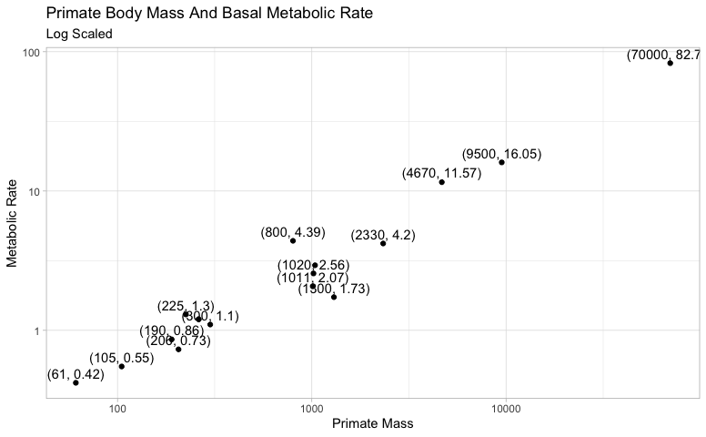
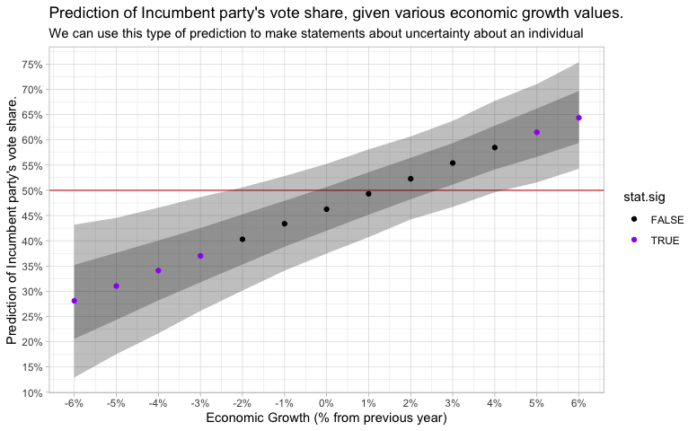
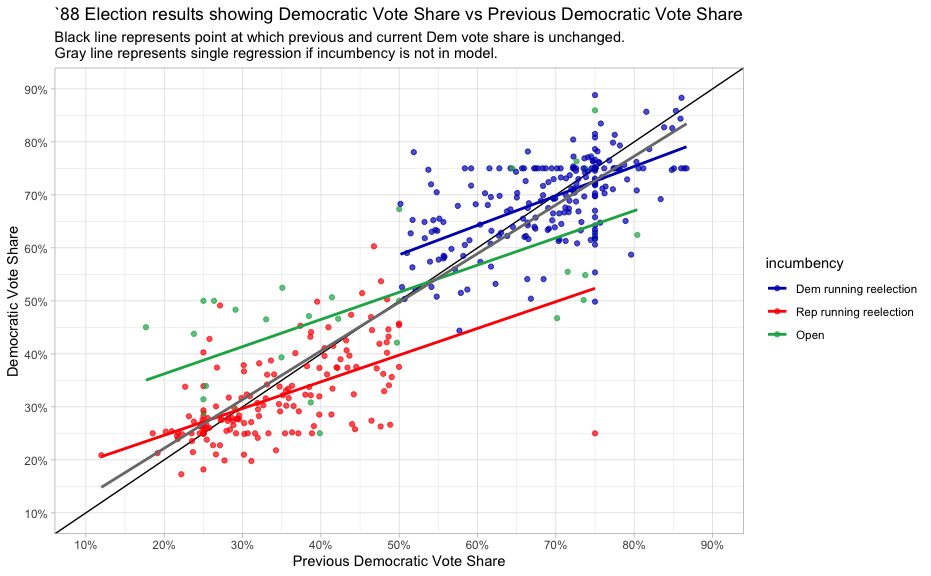
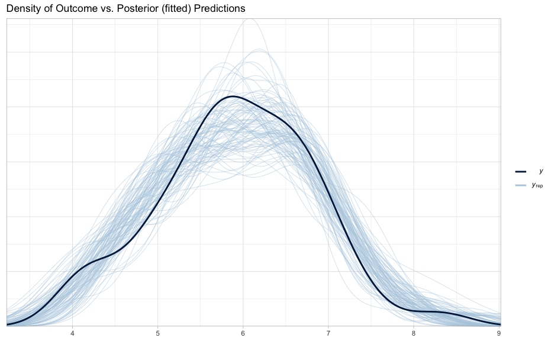

-   [Overview](#overview)
-   [Resources](#resources)
-   [Packages](#packages)
    -   [statistical packages](#statistical-packages)
    -   [base packages](#base-packages)
    -   [Settings](#settings)
-   [Chapter 1 - Overview](#chapter-1---overview)
    -   [Simple Example with `stan_glm`](#simple-example-with-stan_glm)
-   [Chapter 3 - Basic Methods](#chapter-3---basic-methods)
    -   [Log-Log Interpretation](#log-log-interpretation)
        -   [Example Model](#example-model)
        -   [Interpretation](#interpretation)
            -   [Interpretation from
                `Regression and Other Stores`](#interpretation-from-regression-and-other-stores)
            -   [Interpretation from
                `Introductory Econometrics 7e`](#interpretation-from-introductory-econometrics-7e)
        -   [Predictions](#predictions)
        -   [Simulation of Log-Log
            Predictions](#simulation-of-log-log-predictions)
-   [Chapter 4 - Statistcal
    Inference](#chapter-4---statistcal-inference)
    -   [Confidence Interval of
        Proportion](#confidence-interval-of-proportion)
-   [Chapter 5 - Simulation](#chapter-5---simulation)
    -   [How many girls in 400 births?](#how-many-girls-in-400-births)
    -   [Simulation of continuous and mixed discrete/continuous
        models](#simulation-of-continuous-and-mixed-discretecontinuous-models)
    -   [Median Absolute Deviation
        (`MAD SD`)](#median-absolute-deviation-mad-sd)
-   [Chapter 9 - Prediction and Bayesian
    Inference](#chapter-9---prediction-and-bayesian-inference)
-   [pg. 104 describes how sigma (residual standard deviation) is
    calculated.](#pg.-104-describes-how-sigma-residual-standard-deviation-is-calculated.)
    -   [Point Prediction](#point-prediction)
    -   [Linear Predictor with
        Uncertainty](#linear-predictor-with-uncertainty)
    -   [Predictive Distribution](#predictive-distribution)
    -   [9.3 Prior Information and Bayesian
        Synthesis](#prior-information-and-bayesian-synthesis)
    -   [9.5 Uniform, weakly informative, and informative priors in
        regression](#uniform-weakly-informative-and-informative-priors-in-regression)
        -   [Uniform prior distribution](#uniform-prior-distribution)
        -   [Default Prior Distribution](#default-prior-distribution)
        -   [Weekly informative prior distribution based on
            subject-matter
            knowledge](#weekly-informative-prior-distribution-based-on-subject-matter-knowledge)
-   [Chapter 10](#chapter-10)
    -   [Example: uncertainty in predicting congressional
        elections](#example-uncertainty-in-predicting-congressional-elections)
    -   [Fitting the same model to many
        datasets](#fitting-the-same-model-to-many-datasets)
-   [Chapter 11](#chapter-11)
    -   [Comparing data to replications from a fitted
        model](#comparing-data-to-replications-from-a-fitted-model)
    -   [11.6 Residual Standard Deviation and Explained
        R^2](#residual-standard-deviation-and-explained-r2)
        -   [`loo()` &
            `Posterior Predictive Log Score`](#loo-posterior-predictive-log-score)
        -   [`loo_compare`](#loo_compare)
        -   [loo `R^2` and other metrics](#loo-r2-and-other-metrics)
    -   [11.8 Cross Validation](#cross-validation)
-   [Chapter 12 - Transformations and
    regression](#chapter-12---transformations-and-regression)
    -   [Centering & Scaling](#centering-scaling)
        -   [No transformations](#no-transformations)
            -   [`kid_score ~ mom_hs + mom_iq`](#kid_score-mom_hs-mom_iq)
            -   [`kid_score ~ mom_hs + mom_iq + mom_hs:mom_iq`](#kid_score-mom_hs-mom_iq-mom_hsmom_iq)
        -   [Centering](#centering)
            -   [`kid_score ~ mom_hs + mom_iq`](#kid_score-mom_hs-mom_iq-1)
            -   [`kid_score ~ mom_hs + mom_iq + mom_hs:mom_iq`](#kid_score-mom_hs-mom_iq-mom_hsmom_iq-1)
        -   [standardizing via z-score](#standardizing-via-z-score)
        -   [Center/Scaling using 2 standard
            deviations](#centerscaling-using-2-standard-deviations)
    -   [Example](#example)
    -   [Regularized horseshoe prior](#regularized-horseshoe-prior)

Overview
========

This document includes examples and exercises from
`Regression and Other Stories` by Andrew Gelman, Jennifer Hill and Aki
Vehtari, 2020, first edition.

Resources
=========

[Errata](https://avehtari.github.io/ROS-Examples/errata.html)

[Authors’
Code](https://avehtari.github.io/ROS-Examples/examples.html#Examples_by_chapters)

Packages
========

statistical packages
--------------------

``` r
library(rstan)
library(rstanarm)
library(bayesplot)
library(loo)
```

base packages
-------------

``` r
library(broom)
library(broom.mixed)

library(tidyverse)
library(ggplot2)
library(scales)
library(ggridges)
```

Settings
--------

``` r
theme_set(theme_light())
options(scipen=999) # non-scientific notation
options(dplyr.summarise.inform=F)
```

Chapter 1 - Overview
====================

Simple Example with `stan_glm`
------------------------------

Load in the data:

``` r
head(hibbs)
```

    ##   year growth  vote inc_party_candidate other_candidate
    ## 1 1952   2.40 44.60           Stevenson      Eisenhower
    ## 2 1956   2.89 57.76          Eisenhower       Stevenson
    ## 3 1960   0.85 49.91               Nixon         Kennedy
    ## 4 1964   4.21 61.34             Johnson       Goldwater
    ## 5 1968   3.02 49.60            Humphrey           Nixon
    ## 6 1972   3.62 61.79               Nixon        McGovern

------------------------------------------------------------------------

Graph data:

``` r
hibbs %>%
    ggplot(aes(x=growth, y=vote)) +
    geom_hline(yintercept = 50, color="red", linetype="dashed") +
    geom_text(aes(label=year)) +
    geom_smooth(method='lm') +
    scale_x_continuous(labels=function(.x)paste0(.x, '%')) +
    scale_y_continuous(labels=function(.x)paste0(.x, '%')) +
    labs(title="Forecasting the election from the economy",
         y="Incuming party's vote share",
         x="Average recent growth in personal",
         caption='Figure 1.1')
```


------------------------------------------------------------------------

Build Model:

``` r
model <- stan_glm(vote ~ growth, data=hibbs)
```

    ## 
    ## SAMPLING FOR MODEL 'continuous' NOW (CHAIN 1).
    ## Chain 1: 
    ## Chain 1: Gradient evaluation took 5.5e-05 seconds
    ## Chain 1: 1000 transitions using 10 leapfrog steps per transition would take 0.55 seconds.
    ## Chain 1: Adjust your expectations accordingly!
    ## Chain 1: 
    ## Chain 1: 
    ## Chain 1: Iteration:    1 / 2000 [  0%]  (Warmup)
    ## Chain 1: Iteration:  200 / 2000 [ 10%]  (Warmup)
    ## Chain 1: Iteration:  400 / 2000 [ 20%]  (Warmup)
    ## Chain 1: Iteration:  600 / 2000 [ 30%]  (Warmup)
    ## Chain 1: Iteration:  800 / 2000 [ 40%]  (Warmup)
    ## Chain 1: Iteration: 1000 / 2000 [ 50%]  (Warmup)
    ## Chain 1: Iteration: 1001 / 2000 [ 50%]  (Sampling)
    ## Chain 1: Iteration: 1200 / 2000 [ 60%]  (Sampling)
    ## Chain 1: Iteration: 1400 / 2000 [ 70%]  (Sampling)
    ## Chain 1: Iteration: 1600 / 2000 [ 80%]  (Sampling)
    ## Chain 1: Iteration: 1800 / 2000 [ 90%]  (Sampling)
    ## Chain 1: Iteration: 2000 / 2000 [100%]  (Sampling)
    ## Chain 1: 
    ## Chain 1:  Elapsed Time: 0.026365 seconds (Warm-up)
    ## Chain 1:                0.026387 seconds (Sampling)
    ## Chain 1:                0.052752 seconds (Total)
    ## Chain 1: 
    ## 
    ## SAMPLING FOR MODEL 'continuous' NOW (CHAIN 2).
    ## Chain 2: 
    ## Chain 2: Gradient evaluation took 8e-06 seconds
    ## Chain 2: 1000 transitions using 10 leapfrog steps per transition would take 0.08 seconds.
    ## Chain 2: Adjust your expectations accordingly!
    ## Chain 2: 
    ## Chain 2: 
    ## Chain 2: Iteration:    1 / 2000 [  0%]  (Warmup)
    ## Chain 2: Iteration:  200 / 2000 [ 10%]  (Warmup)
    ## Chain 2: Iteration:  400 / 2000 [ 20%]  (Warmup)
    ## Chain 2: Iteration:  600 / 2000 [ 30%]  (Warmup)
    ## Chain 2: Iteration:  800 / 2000 [ 40%]  (Warmup)
    ## Chain 2: Iteration: 1000 / 2000 [ 50%]  (Warmup)
    ## Chain 2: Iteration: 1001 / 2000 [ 50%]  (Sampling)
    ## Chain 2: Iteration: 1200 / 2000 [ 60%]  (Sampling)
    ## Chain 2: Iteration: 1400 / 2000 [ 70%]  (Sampling)
    ## Chain 2: Iteration: 1600 / 2000 [ 80%]  (Sampling)
    ## Chain 2: Iteration: 1800 / 2000 [ 90%]  (Sampling)
    ## Chain 2: Iteration: 2000 / 2000 [100%]  (Sampling)
    ## Chain 2: 
    ## Chain 2:  Elapsed Time: 0.03221 seconds (Warm-up)
    ## Chain 2:                0.028393 seconds (Sampling)
    ## Chain 2:                0.060603 seconds (Total)
    ## Chain 2: 
    ## 
    ## SAMPLING FOR MODEL 'continuous' NOW (CHAIN 3).
    ## Chain 3: 
    ## Chain 3: Gradient evaluation took 9e-06 seconds
    ## Chain 3: 1000 transitions using 10 leapfrog steps per transition would take 0.09 seconds.
    ## Chain 3: Adjust your expectations accordingly!
    ## Chain 3: 
    ## Chain 3: 
    ## Chain 3: Iteration:    1 / 2000 [  0%]  (Warmup)
    ## Chain 3: Iteration:  200 / 2000 [ 10%]  (Warmup)
    ## Chain 3: Iteration:  400 / 2000 [ 20%]  (Warmup)
    ## Chain 3: Iteration:  600 / 2000 [ 30%]  (Warmup)
    ## Chain 3: Iteration:  800 / 2000 [ 40%]  (Warmup)
    ## Chain 3: Iteration: 1000 / 2000 [ 50%]  (Warmup)
    ## Chain 3: Iteration: 1001 / 2000 [ 50%]  (Sampling)
    ## Chain 3: Iteration: 1200 / 2000 [ 60%]  (Sampling)
    ## Chain 3: Iteration: 1400 / 2000 [ 70%]  (Sampling)
    ## Chain 3: Iteration: 1600 / 2000 [ 80%]  (Sampling)
    ## Chain 3: Iteration: 1800 / 2000 [ 90%]  (Sampling)
    ## Chain 3: Iteration: 2000 / 2000 [100%]  (Sampling)
    ## Chain 3: 
    ## Chain 3:  Elapsed Time: 0.029071 seconds (Warm-up)
    ## Chain 3:                0.025751 seconds (Sampling)
    ## Chain 3:                0.054822 seconds (Total)
    ## Chain 3: 
    ## 
    ## SAMPLING FOR MODEL 'continuous' NOW (CHAIN 4).
    ## Chain 4: 
    ## Chain 4: Gradient evaluation took 7e-06 seconds
    ## Chain 4: 1000 transitions using 10 leapfrog steps per transition would take 0.07 seconds.
    ## Chain 4: Adjust your expectations accordingly!
    ## Chain 4: 
    ## Chain 4: 
    ## Chain 4: Iteration:    1 / 2000 [  0%]  (Warmup)
    ## Chain 4: Iteration:  200 / 2000 [ 10%]  (Warmup)
    ## Chain 4: Iteration:  400 / 2000 [ 20%]  (Warmup)
    ## Chain 4: Iteration:  600 / 2000 [ 30%]  (Warmup)
    ## Chain 4: Iteration:  800 / 2000 [ 40%]  (Warmup)
    ## Chain 4: Iteration: 1000 / 2000 [ 50%]  (Warmup)
    ## Chain 4: Iteration: 1001 / 2000 [ 50%]  (Sampling)
    ## Chain 4: Iteration: 1200 / 2000 [ 60%]  (Sampling)
    ## Chain 4: Iteration: 1400 / 2000 [ 70%]  (Sampling)
    ## Chain 4: Iteration: 1600 / 2000 [ 80%]  (Sampling)
    ## Chain 4: Iteration: 1800 / 2000 [ 90%]  (Sampling)
    ## Chain 4: Iteration: 2000 / 2000 [100%]  (Sampling)
    ## Chain 4: 
    ## Chain 4:  Elapsed Time: 0.028717 seconds (Warm-up)
    ## Chain 4:                0.032108 seconds (Sampling)
    ## Chain 4:                0.060825 seconds (Total)
    ## Chain 4:

------------------------------------------------------------------------

Model Summary:

``` r
summary(model)
```

    ## 
    ## Model Info:
    ##  function:     stan_glm
    ##  family:       gaussian [identity]
    ##  formula:      vote ~ growth
    ##  algorithm:    sampling
    ##  sample:       4000 (posterior sample size)
    ##  priors:       see help('prior_summary')
    ##  observations: 16
    ##  predictors:   2
    ## 
    ## Estimates:
    ##               mean   sd   10%   50%   90%
    ## (Intercept) 46.2    1.8 44.0  46.2  48.3 
    ## growth       3.1    0.8  2.1   3.1   4.0 
    ## sigma        4.0    0.9  3.1   3.9   5.1 
    ## 
    ## Fit Diagnostics:
    ##            mean   sd   10%   50%   90%
    ## mean_PPD 52.0    1.5 50.2  52.0  53.9 
    ## 
    ## The mean_ppd is the sample average posterior predictive distribution of the outcome variable (for details see help('summary.stanreg')).
    ## 
    ## MCMC diagnostics
    ##               mcse Rhat n_eff
    ## (Intercept)   0.0  1.0  2249 
    ## growth        0.0  1.0  2594 
    ## sigma         0.0  1.0  2347 
    ## mean_PPD      0.0  1.0  3419 
    ## log-posterior 0.0  1.0  1283 
    ## 
    ## For each parameter, mcse is Monte Carlo standard error, n_eff is a crude measure of effective sample size, and Rhat is the potential scale reduction factor on split chains (at convergence Rhat=1).

------------------------------------------------------------------------

Print()

``` r
print(model)
```

    ## stan_glm
    ##  family:       gaussian [identity]
    ##  formula:      vote ~ growth
    ##  observations: 16
    ##  predictors:   2
    ## ------
    ##             Median MAD_SD
    ## (Intercept) 46.2    1.6  
    ## growth       3.1    0.7  
    ## 
    ## Auxiliary parameter(s):
    ##       Median MAD_SD
    ## sigma 3.9    0.8   
    ## 
    ## ------
    ## * For help interpreting the printed output see ?print.stanreg
    ## * For info on the priors used see ?prior_summary.stanreg

------------------------------------------------------------------------

Model Coefficients:

``` r
coef(model)
```

    ## (Intercept)      growth 
    ##   46.207934    3.058527

------------------------------------------------------------------------

Compare to `lm()`:

``` r
summary(lm(vote ~ growth, data=hibbs))
```

    ## 
    ## Call:
    ## lm(formula = vote ~ growth, data = hibbs)
    ## 
    ## Residuals:
    ##     Min      1Q  Median      3Q     Max 
    ## -8.9929 -0.6674  0.2556  2.3225  5.3094 
    ## 
    ## Coefficients:
    ##             Estimate Std. Error t value           Pr(>|t|)    
    ## (Intercept)  46.2476     1.6219  28.514 0.0000000000000841 ***
    ## growth        3.0605     0.6963   4.396            0.00061 ***
    ## ---
    ## Signif. codes:  0 '***' 0.001 '**' 0.01 '*' 0.05 '.' 0.1 ' ' 1
    ## 
    ## Residual standard error: 3.763 on 14 degrees of freedom
    ## Multiple R-squared:  0.5798, Adjusted R-squared:  0.5498 
    ## F-statistic: 19.32 on 1 and 14 DF,  p-value: 0.00061

(pretty close)

------------------------------------------------------------------------

Graph using model coefficients rather than `geom_smooth(method='lm')`

``` r
hibbs %>%
    ggplot(aes(x=growth, y=vote)) +
    geom_hline(yintercept = 50, color="red", linetype="dashed") +
    geom_text(aes(label=year)) +
    #geom_smooth(method='lm') +
    geom_abline(intercept = coef(model)['(Intercept)'], slope = coef(model)['growth']) +
    scale_x_continuous(labels=function(.x)paste0(.x, '%')) +
    scale_y_continuous(labels=function(.x)paste0(.x, '%')) +
    labs(title="Forecasting the election from the economy",
         y="Incuming party's vote share",
         x="Average recent growth in personal",
         caption='Figure 1.1')
```


------------------------------------------------------------------------

Chapter 3 - Basic Methods
=========================

Log-Log Interpretation
----------------------

Example from \`Regression & Other Stories pg 39. (Data found elsewhere.)

### Example Model

``` r
head(metabolic_rate)
```

    ## # A tibble: 6 x 2
    ##   `Primate Mass` `Metabolic Rate`
    ##            <dbl>            <dbl>
    ## 1           4670            11.6 
    ## 2           1020             2.56
    ## 3            206             0.73
    ## 4            190             0.86
    ## 5            105             0.55
    ## 6            300             1.1

``` r
metabolic_rate %>%
    ggplot(aes(x=`Primate Mass`, y=`Metabolic Rate`)) +
    geom_point() +
    geom_text(data=metabolic_rate, 
              aes(x=`Primate Mass`, y=`Metabolic Rate`,
                  label=glue::glue("({ `Primate Mass` }, { `Metabolic Rate` })"),
                  color=NULL),
              vjust=-0.5, check_overlap = TRUE) +
    labs(title="Primate Body Mass And Basal Metabolic Rate",
         subtitle = "(Not Scaled)")
```


``` r
metabolic_rate %>%
    ggplot(aes(x=`Primate Mass`, y=`Metabolic Rate`)) +
    geom_point() +
    geom_text(data=metabolic_rate, 
              aes(x=`Primate Mass`, y=`Metabolic Rate`,
                  label=glue::glue("({ `Primate Mass` }, { `Metabolic Rate` })"),
                  color=NULL),
              vjust=-0.5, check_overlap = TRUE) +
    scale_x_log10() +
    scale_y_log10() +
    labs(title="Primate Body Mass And Basal Metabolic Rate",
         subtitle = "Log Scaled")
```



``` r
model <- lm(log(`Metabolic Rate`) ~ log(`Primate Mass`), data=metabolic_rate)
summary(model)
```

    ## 
    ## Call:
    ## lm(formula = log(`Metabolic Rate`) ~ log(`Primate Mass`), data = metabolic_rate)
    ## 
    ## Residuals:
    ##      Min       1Q   Median       3Q      Max 
    ## -0.71136 -0.13959  0.01586  0.14175  0.57990 
    ## 
    ## Coefficients:
    ##                     Estimate Std. Error t value        Pr(>|t|)    
    ## (Intercept)         -4.05787    0.28770  -14.11 0.0000000004613 ***
    ## log(`Primate Mass`)  0.74160    0.04198   17.66 0.0000000000189 ***
    ## ---
    ## Signif. codes:  0 '***' 0.001 '**' 0.01 '*' 0.05 '.' 0.1 ' ' 1
    ## 
    ## Residual standard error: 0.2983 on 15 degrees of freedom
    ## Multiple R-squared:  0.9541, Adjusted R-squared:  0.9511 
    ## F-statistic:   312 on 1 and 15 DF,  p-value: 0.00000000001891

``` r
coef(model)
```

    ##         (Intercept) log(`Primate Mass`) 
    ##           -4.057868            0.741598

### Interpretation

#### Interpretation from `Regression and Other Stores`

From `pg. 40`

“For example, when increasing body mass on this curve by a factor of 2,
metabolic rate is multiplied by `2^0.74` = `1.7`. Multiplying body mass
by `10` corresponds to multiplying metabolic rate by `10^0.74` = `5.5`,
and so forth.”

``` r
(primate_mass_coefficient <- unname(coef(model)['log(`Primate Mass`)']))
```

    ## [1] 0.741598

Lets test this. We’ll start with a body mass of `105`.

``` r
(log_prediction_105 <- predict(model, newdata = data.frame(`Primate Mass`=105, check.names = FALSE)))
```

    ##       1 
    ## -0.6065

``` r
(prediction_105 <- exp(log_prediction_105))
```

    ##         1 
    ## 0.5452559

Our prediction of the metabolic rate is `0.5452559`.

What is our prediction if we **double** the body mass?

We would expect a Metabolic Rate of `0.9116825`.

``` r
2^primate_mass_coefficient * prediction_105
```

    ##         1 
    ## 0.9116825

What is the actual prediction if we double the body mass?

``` r
log_prediction_210 <- predict(model, newdata = data.frame(`Primate Mass`=210, check.names = FALSE))
(prediction_210 <- exp(log_prediction_210))
```

    ##         1 
    ## 0.9116825

------------------------------------------------------------------------

What is our prediction if we multiply body mass by `10`?

We would expect a Metabolic Rate of `3.0074496`.

``` r
10^primate_mass_coefficient * prediction_105
```

    ##       1 
    ## 3.00745

What is the actual prediction if we double the body mass?

``` r
log_prediction_1050 <- predict(model, newdata = data.frame(`Primate Mass`=1050, check.names = FALSE))
(prediction_1050 <- exp(log_prediction_1050))
```

    ##       1 
    ## 3.00745

------------------------------------------------------------------------

#### Interpretation from `Introductory Econometrics 7e`

> "A one-unit difference in `log x` corresponds to an additive
> difference of `b` in `log y`. (R&OS pg. 39)

This is essentially “elasticity” and is interpreted as a `1%` change in
x has a `b`% change in `y` (Intro Econometrics pg. 39), although this
does not hold for large changes in `y` (Intro Econometrics pg. 186).

``` r
format_percent <- function(.x) { paste0(round(.x, 3), '%')}
format_percent_scale <- function(.x) { paste0(round(.x * 100, 3), '%')}

(expected_one_percent_change <- format_percent(primate_mass_coefficient))
```

    ## [1] "0.742%"

So, the interpretation of the `log(Primate Mass)` coefficient is that a
`1%` change in `Primate Mass` results in a `~0.742%` change in
`Metabolic Rate`.

Let’s see if this is true.

If the `Primate Mass` is `105` then our prediction of
`log(Metabolic Rate`) is `-0.6065`, which means our prediction of
`Metabolic Rate` is `0.5452559`, which matches the point on the graph.

Now let’s change `Primate Mass` (x) by `1%` and see how much
`Metabolic Rate` (y) changes by.

``` r
(one_percent_change <- (0.01 * 105) + 105)
```

    ## [1] 106.05

``` r
one_percent_change_prediction <- predict(model, newdata = data.frame(`Primate Mass`=one_percent_change, check.names = FALSE))
(one_percent_change_prediction <- exp(one_percent_change_prediction))
```

    ##         1 
    ## 0.5492943

So if `Primate Mass` is `106.05` then we predict that `Metabolic Rate`
is `0.5492943`.

So a `1%` change in `Primate Mass` resulted in the following percent
change for `Metabolic Rate`:

``` r
format_percent_scale((one_percent_change_prediction - prediction_105) / prediction_105)
```

    ## [1] "0.741%"

Which matches the expected percent change from the coefficient.

``` r
primate_mass_coefficient
```

    ## [1] 0.741598

------------------------------------------------------------------------

Now, lets try with a larger change.

Lets predict `Metabolic Change` for a `Primate Mass` of `9,500`

``` r
(percent_change <- (9500 - 105) / 105)
```

    ## [1] 89.47619

The percent-change in `Primate Mass` between these two values is
`8947.619%`.

``` r
(expected_percent_change_y <- as.numeric(coef(model)["log(`Primate Mass`)"]) * percent_change)
```

    ## [1] 66.35536

Therefore, if `Primate Mass` changes by `8947.619%`, the **expected**
percent change in `Metabolic Rate` should be `6635.536%`.

But the actual percent change is:

``` r
(prediction_9500 <- exp(predict(model, newdata = data.frame(`Primate Mass`=9500, check.names = FALSE))))
```

    ##        1 
    ## 15.40147

``` r
format_percent_scale((prediction_9500 - prediction_105) / prediction_105)
```

    ## [1] "2724.632%"

Which is quite lower than what we expected.

So this rule of thumb doesn’t work across large changes in `y`.

### Predictions

According to `Introductory Econometrics, Wooldridge (pg. 206)`,

> Because the exponential undoes the log, our first guess for predicting
> y (when dependent variable is log(y)) is to simply exponentiate the
> predicted value for `log(y): y_predicted = exp(log y_predicted))`.
> **This does not work; in fact, it will systematically underestimate
> the expected value of y**.

One adjustment that the author describes is the
`Duan smearing estimate`.

> Given an esimtate `a0`, we can predict `y` as
>
> `y_predicted = a0 * exp(log y_predicted)`

where,

> `a0 = sum(exp(residuals)) / N`

The code below implements the `Duan smearing estimate`.

Note, that this adjustment necessary, not just for `log y = log x`
models, but for `log y = x` models (any time the dependent variable is
log y, regardless of X).

``` r
#' This method returns the adjustment coefficient described in `Introductory Econometrics, Wooldridge (pg. 206)`
#' @param .model the regression model
duan_smearing_adjustment <- function(.model) {
    model_residuals <- residuals(.model)
    duan_smearing_coefficient <- sum(exp(model_residuals)) / length(model_residuals)
    
    return (duan_smearing_coefficient)
}

#' This method returns the prediction of `y`, when the dependent variable is `log y`, based on the adjustment coefficient described in `Introductory Econometrics, Wooldridge (pg. 206)`
#' @param .model the regression model
#' @param .newdata the data (e.g. test data) from which predictions will be generated
predict_from_log_y <- function(.model, .newdata) {
    
    duan_smearing_coefficient <- duan_smearing_adjustment(.model)
    .predictions <- predict(.model, newdata=.newdata)
    .predictions <- duan_smearing_coefficient*exp(.predictions)

    return (.predictions)
}
```

Now, let’s create predictions for all `Primate Masses` between `50` and
`80000`, which is around the interval of our data.

``` r
model <- lm(log(`Metabolic Rate`) ~ log(`Primate Mass`), data=metabolic_rate)
all_predictions <- data.frame(`Primate Mass`=seq(50, 80000), check.names = FALSE)
log_y_predictions <- predict(model, newdata=all_predictions)

# this simple adjustment is also described on pg 206 but assumes normal residuals
all_predictions$`Predictions - Unadjusted` <- exp(log_y_predictions)
all_predictions$`Predictions - Adjusted - Simple` <- exp(((summary(model)$sigma)^2)/2)*exp(log_y_predictions)
all_predictions$`Predictions - Adjusted - Duan` <- predict_from_log_y(.model=model, .newdata=all_predictions)
head(all_predictions)
```

    ##   Primate Mass Predictions - Unadjusted Predictions - Adjusted - Simple
    ## 1           50                0.3145163                       0.3288212
    ## 2           51                0.3191693                       0.3336858
    ## 3           52                0.3237987                       0.3385258
    ## 4           53                0.3284052                       0.3433418
    ## 5           54                0.3329892                       0.3481343
    ## 6           55                0.3375514                       0.3529040
    ##   Predictions - Adjusted - Duan
    ## 1                     0.3266032
    ## 2                     0.3314350
    ## 3                     0.3362423
    ## 4                     0.3410258
    ## 5                     0.3457860
    ## 6                     0.3505236

``` r
predictions_long <- all_predictions %>% 
    # get the original values, where applicable
    #left_join(metabolic_rate, by = 'Primate Mass') %>%
    pivot_longer(-`Primate Mass`, names_to = 'Prediction Type', values_to='Metabolic Rate')

metabolic_rate_plot <- predictions_long %>%
    ggplot(aes(x=`Primate Mass`, y=`Metabolic Rate`, color=`Prediction Type`)) +
    geom_point(data=metabolic_rate, aes(x=`Primate Mass`, y=`Metabolic Rate`, color=NULL)) +
    geom_text(data=metabolic_rate, 
              aes(x=`Primate Mass`, y=`Metabolic Rate`,
                  label=glue::glue("({ `Primate Mass` }, { `Metabolic Rate` })"),
                  color=NULL),
              vjust=-0.5, check_overlap = TRUE) +
    geom_line()

metabolic_rate_plot +
    scale_x_log10() +
    scale_y_log10() +
    labs(title="Primate Body Mass And Basal Metabolic Rate",
         subtitle = "Log Scaled")
```


``` r
metabolic_rate_plot +
    labs(title="Primate Body Mass And Basal Metabolic Rate",
         subtitle = "Unscaled")
```


------------------------------------------------------------------------

### Simulation of Log-Log Predictions

See discussion in previous section regarding systematic underprediction
of `y` when dependent varaible is `log y`.

`log y = a + b*log x + random-noise`

``` r
set.seed(1)
intercept <- 4
b_coefficient <- 3
simulated_x <- rexp(100000, rate = 0.5) + 1
noise <- rnorm(100000, sd = 0.5)

simulated_y <- exp(intercept + b_coefficient*log(simulated_x) + noise)

simulated_data <- data.frame(simulated_x, simulated_y)
simulated_data %>%
    ggplot(aes(x=simulated_x, y=simulated_y)) +
    geom_point(alpha=0.1) +
    scale_x_log10(breaks=2^seq(0,6)) +
    scale_y_log10(breaks=10^seq(1,6)) +
    labs(title="Simulated Data (`log y = a + b*log x + random-noise`)",
         subtitle = "Graphed on a log-scale.")
```


------------------------------------------------------------------------

Create training/test sets, fit model on training data.

``` r
training_indices <- sample.int(n=nrow(simulated_data), size = 0.7*nrow(simulated_data), replace = FALSE)
training_data <- simulated_data[training_indices,]
test_data <- simulated_data[-training_indices,]
model <- lm(log(simulated_y) ~ log(simulated_x), data=training_data)
summary(model)
```

    ## 
    ## Call:
    ## lm(formula = log(simulated_y) ~ log(simulated_x), data = training_data)
    ## 
    ## Residuals:
    ##     Min      1Q  Median      3Q     Max 
    ## -2.1152 -0.3373 -0.0019  0.3348  2.1345 
    ## 
    ## Coefficients:
    ##                  Estimate Std. Error t value            Pr(>|t|)    
    ## (Intercept)      4.001214   0.003572  1120.1 <0.0000000000000002 ***
    ## log(simulated_x) 2.999279   0.003273   916.3 <0.0000000000000002 ***
    ## ---
    ## Signif. codes:  0 '***' 0.001 '**' 0.01 '*' 0.05 '.' 0.1 ' ' 1
    ## 
    ## Residual standard error: 0.499 on 69998 degrees of freedom
    ## Multiple R-squared:  0.923,  Adjusted R-squared:  0.923 
    ## F-statistic: 8.396e+05 on 1 and 69998 DF,  p-value: < 0.00000000000000022

------------------------------------------------------------------------

Predict on test data.

``` r
log_y_predictions <- predict(model, newdata=test_data)

# this simple adjustment is also described on pg 206 but assumes normal residuals
test_data$`Predictions - Unadjusted` <- exp(log_y_predictions)
test_data$`Predictions - Adjusted - Simple` <- exp(((summary(model)$sigma)^2)/2)*exp(log_y_predictions)
test_data$`Predictions - Adjusted - Duan` <- predict_from_log_y(.model=model, .newdata=test_data)
head(test_data)
```

    ##    simulated_x simulated_y Predictions - Unadjusted
    ## 2     3.363286   3187.9213                2077.8609
    ## 6     6.789937  25807.5974               17088.4407
    ## 8     2.079366    495.4461                 491.2115
    ## 10    1.294092    110.9351                 118.4459
    ## 12    2.524060    700.3071                 878.4439
    ## 17    4.752070   3923.7267                5859.5674
    ##    Predictions - Adjusted - Simple Predictions - Adjusted - Duan
    ## 2                        2353.3864                     2354.6418
    ## 6                       19354.3771                    19364.7015
    ## 8                         556.3464                      556.6431
    ## 10                        134.1518                      134.2234
    ## 12                        994.9260                      995.4568
    ## 17                       6636.5492                     6640.0894

------------------------------------------------------------------------

``` r
predictions_long <- test_data %>%
    select(-simulated_y) %>%
    # get the original values, where applicable
    #left_join(metabolic_rate, by = 'Primate Mass') %>%
    pivot_longer(-simulated_x, names_to = 'Prediction Type', values_to='Predicted Y')

simulated_plot <- predictions_long %>%
    ggplot(aes(x=simulated_x, y=`Predicted Y`, color=`Prediction Type`)) +
    geom_point(data=test_data, aes(x=simulated_x, y=simulated_y, color=NULL), alpha=0.2) +
    geom_line()

simulated_plot +
    scale_x_log10(breaks=2^seq(0,6)) +
    scale_y_log10(breaks=10^seq(1,6)) +
    labs(title="Simulated Data & Predictions",
         subtitle = "Log Scaled",
         caption="The 'Simple' and 'Duan' adjustments are slow close that they overlap,\nand the Duan is being hidden behind the Simple.")
```


------------------------------------------------------------------------

``` r
simulated_plot +
    labs(title="Simulated Data & Predictions",
         subtitle = "Not Scaled",
         caption="The 'Simple' and 'Duan' adjustments are slow close that they overlap,\nand the Duan is being hidden behind the Simple.")
```


------------------------------------------------------------------------

The adjustments seem to make sense, visualy; but we can check the
`Root Mean Square Error` (`RMSE`) to see if the adjustments actually
results in a better **out-of-sample** fit, below (which it appears is
the case; there is a lower error for the adjusted predictions).

``` r
rmse = function(fitted, actual){
  sqrt(mean((fitted - actual)^2))
}

rmse(fitted=test_data$`Predictions - Unadjusted`, actual=test_data$simulated_y)
```

    ## [1] 8968.512

``` r
rmse(fitted=test_data$`Predictions - Adjusted - Simple`, actual=test_data$simulated_y)
```

    ## [1] 8546.481

``` r
rmse(fitted=test_data$`Predictions - Adjusted - Duan`, actual=test_data$simulated_y)
```

    ## [1] 8545.582

NOTE: the “Simple” adjustment (found in
`Introductory Econometrics, Wooldridge (pg. 206)`) is only valid for
residuals that are normally distributed. In this simulation, the
residuals are normally distributed; and the Simple and Duan adjustments
are quite similar.

------------------------------------------------------------------------

We can do another performance check using `R-Squared`, which is a
measure of the percent of variance in the dependent variable (y) that is
explained by the model. The higher the R-squared, the better.

``` r
#' these functions are from `Business Data Science, Taddy, pg 72`
#' @param y the actual y values
#' @param pred the predictions; must be probabilities (0<pred<1) for binomial
deviance <- function(y, pred, family=c("gaussian","binomial")){
    family <- match.arg(family)
    if(family=="gaussian"){
        return( sum( (y-pred)^2 ) )
    }else{
        if(is.factor(y)) y <- as.numeric(y)>1
        return( -2*sum( y*log(pred) + (1-y)*log(1-pred) ) )
    }
}
#' these functions are from `Business Data Science, Taddy, pg 72`
#' returns r-squared which is a measure of the percent of variance in the dependent variable (y) that is explained by the model.
#' @param y the actual y values
#' @param pred the predictions; must be probabilities (0<pred<1) for binomial
R2 <- function(y, pred, family=c("gaussian","binomial")){
    fam <- match.arg(family)
    if(fam=="binomial"){
        if(is.factor(y)){ y <- as.numeric(y)>1 }
    }
    dev <- deviance(y, pred, family=fam)
    dev0 <- deviance(y, mean(y), family=fam)
    return(1-dev/dev0)
}
```

We can see that the adjusted predictions do have a higher `R-Squared`
than the unadjsuted.

``` r
R2(pred=test_data$`Predictions - Unadjusted`, y=test_data$simulated_y)
```

    ## [1] 0.782397

``` r
R2(pred=test_data$`Predictions - Adjusted - Simple`, y=test_data$simulated_y)
```

    ## [1] 0.8023946

``` r
R2(pred=test_data$`Predictions - Adjusted - Duan`, y=test_data$simulated_y)
```

    ## [1] 0.8024362

Chapter 4 - Statistcal Inference
================================

Confidence Interval of Proportion
---------------------------------

``` r
sample_size <- 1000
respond_yes <- 700

(estimate <- respond_yes / sample_size)
```

    ## [1] 0.7

``` r
(standard_error <- sqrt(estimate * (1 - estimate) / sample_size))
```

    ## [1] 0.01449138

``` r
(z_scores <- qnorm(c(0.025, 0.975)))
```

    ## [1] -1.959964  1.959964

``` r
(confidence_interval_95 <- estimate + (z_scores * standard_error))
```

    ## [1] 0.6715974 0.7284026

------------------------------------------------------------------------

Compare to R’s `prop.test`.

``` r
prop.test(x=respond_yes, n=sample_size)
```

    ## 
    ##  1-sample proportions test with continuity correction
    ## 
    ## data:  respond_yes out of sample_size, null probability 0.5
    ## X-squared = 159.2, df = 1, p-value < 0.00000000000000022
    ## alternative hypothesis: true p is not equal to 0.5
    ## 95 percent confidence interval:
    ##  0.6703646 0.7280778
    ## sample estimates:
    ##   p 
    ## 0.7

Chapter 5 - Simulation
======================

How many girls in 400 births?
-----------------------------

``` r
probability_girl <- 0.488
sample_size <- 400
# one random sample (simulated)
number_of_simulated_samples <- 1
set.seed(1)
rbinom(n = number_of_simulated_samples, size=sample_size, prob = probability_girl)
```

    ## [1] 196

``` r
number_of_simulated_samples <- 1000
set.seed(1)
simulations <- rbinom(n = number_of_simulated_samples, size=sample_size, prob = probability_girl)
simulations[1:10]
```

    ##  [1] 196 195 184 213 198 183 192 168 178 196

95% Interval

``` r
quantile(simulations, c(0.025, 0.975))
```

    ##  2.5% 97.5% 
    ##   176   216

``` r
hist(simulations)
```


------------------------------------------------------------------------

Accounting for twins.

First, simulate birth types of 400 births.

``` r
set.seed(2)
probability_girl_if_twins <- 0.495
probability_of_twins_fraternal <- 1/125  # each has a 49.5% of being a girl
probability_of_twins_identical <- 1/300  # 49.5% chance of being a pair of girls.

simulate_birth_types <- function() {
    
    sample(x=c('fraternal twin', 'identical twin', 'single born'),
           size = sample_size,
           replace = TRUE,
           prob = c(probability_of_twins_fraternal,
                    probability_of_twins_identical,
                    1 - probability_of_twins_fraternal - probability_of_twins_identical))
}
birth_type <- simulate_birth_types()
table(birth_type)
```

    ## birth_type
    ## fraternal twin identical twin    single born 
    ##              2              1            397

Simulating Number of Girls if Fraternal Twin. In this scenario, there
are `2` different people, each of which has a
`49.5% percent chance of being a girl. So the possible outcomes are`0`,`1`,`2\`

-   `0`: 0 girls (both boys)
-   `1`: 1 girl
-   `2`: 2 both

``` r
hist(rbinom(n=10000,  # simulate this scenario 10K times
            size=2, # two different possible chances of being a girl
            prob=probability_girl_if_twins))
```


Simulating Number of Girls if Identical Twin. In this scenario, they are
either both boys, or both girls. So the possible outcomes are either `0`
or `2`

-   `0`: 0 girls (both boys)
-   `2`: both girls

In other words, we’ll simulate the binary outcome of either both girls
or both boys, but the former means we have to count 2 people, so we’ll
multiple the number of people by 2

``` r
hist(2 * rbinom(n=10000,  # simulate this scenario 10K times
                size=1, # two different possible chances of being a girl
                prob=probability_girl_if_twins))
```


Now, we will do 1000 simulations of births, considering
fraternal/identical twins; each simulation has a sample-size of 400.

``` r
set.seed(1)
simulation_results <- replicate(1000, {
    birth_type <- simulate_birth_types()
    
    sample_of_girls <- map_dbl(birth_type, ~ {

        if(. == 'fraternal twin') {
            # simulate number of girls for this particular simulated birth_type
            number_of_girls <- rbinom(n=1,
                   size=2, # two different possible chances of being a girl
                   prob=probability_girl_if_twins)
            
        } else if(. == 'identical twin') {
            # simulate number of girls for this particular simulated birth_type
            number_of_girls <- 2 * rbinom(n=1,
                size=1, # two different possible chances of being a girl
                prob=probability_girl_if_twins)
            
        } else if(. == 'single born') {
            # simulate number of girls for this particular simulated birth_type
            number_of_girls <- rbinom(1, 1, probability_girl)
            
        } else {
            stop()
        }
        
        return(number_of_girls)
    })
    stopifnot(length(sample_of_girls) == sample_size)
    return (sum(sample_of_girls))
})
```

``` r
quantile(simulation_results, c(0.025, 0.975))
```

    ##  2.5% 97.5% 
    ##   178   216

``` r
hist(simulation_results)
```


Simulation of continuous and mixed discrete/continuous models
-------------------------------------------------------------

``` r
n_sims <- 1000
y1 <- rnorm(n = n_sims, mean = 3, sd = 0.5)
y2 <- exp(x = y1)
y3 <- rbinom(n = n_sims, size = 20, prob = 0.6)
y4 <- rpois(n = n_sims, lambda = 5)
```


Median Absolute Deviation (`MAD SD`)
------------------------------------

``` r
set.seed(1)
z <- rnorm(10000, 5, 2)
hist(z)
```


``` r
rnd3 <- function(.x) {
    round(.x, 3)
}
glue::glue("mean = { rnd3(mean(z)) }, sd = { rnd3(sd(z)) }, median = { rnd3(median(z)) }, mad sd = { rnd3(mad(z)) }")
```

    ## mean = 4.987, sd = 2.025, median = 4.968, mad sd = 1.997

``` r
constant <- 1.4826  # 1.483 defined R&OS pg 73; but function uses more specific number
constant * median(abs(z - median(z)))
```

    ## [1] 1.996752

``` r
mad(z)
```

    ## [1] 1.996752

------------------------------------------------------------------------

The above is a single sample if `10,000` observations.

The `standard error` (i.e. expected **standard deviation** of the
**distribution** of **sample means** (if we were going to run this
simulation many times (or draw a random sample from the population many
times))) is:

``` r
sd(z) / sqrt(length(z))
```

    ## [1] 0.02024713

We can also simulate this.

First, lets run a `1,000` simulations of drawing a sample of `10,000`
observations. Each time we’ll take the mean of those 10,000
observations. So we’ll have a distribution of (1000) sample means.

The standard deviation of the distribution of sample means is:

``` r
set.seed(1)
simulations <- replicate(1000, mean(rnorm(10000, 5, 2)))
sd(simulations)
```

    ## [1] 0.01941111

Which is fairly close to our calculated standard error.

``` r
quantile(simulations, c(0.025, 0.975))
```

    ##     2.5%    97.5% 
    ## 4.960204 5.038125

``` r
hist(simulations, main = "Distribution of Sample Means")
```


Chapter 9 - Prediction and Bayesian Inference
=============================================

``` r
head(hibbs)
```

    ##   year growth  vote inc_party_candidate other_candidate
    ## 1 1952   2.40 44.60           Stevenson      Eisenhower
    ## 2 1956   2.89 57.76          Eisenhower       Stevenson
    ## 3 1960   0.85 49.91               Nixon         Kennedy
    ## 4 1964   4.21 61.34             Johnson       Goldwater
    ## 5 1968   3.02 49.60            Humphrey           Nixon
    ## 6 1972   3.62 61.79               Nixon        McGovern

``` r
# refresh = 0 supresses the default Stan sampling progress output
set.seed(1)
model <- stan_glm(vote ~ growth, data=hibbs, refresh=0)
print(model)
```

    ## stan_glm
    ##  family:       gaussian [identity]
    ##  formula:      vote ~ growth
    ##  observations: 16
    ##  predictors:   2
    ## ------
    ##             Median MAD_SD
    ## (Intercept) 46.3    1.7  
    ## growth       3.0    0.7  
    ## 
    ## Auxiliary parameter(s):
    ##       Median MAD_SD
    ## sigma 3.9    0.7   
    ## 
    ## ------
    ## * For help interpreting the printed output see ?print.stanreg
    ## * For info on the priors used see ?prior_summary.stanreg

> These numbers are summaries of a matrix of simulations representing
> different possible values of the parameters
> (intercept/slope/residual-standard-deviation). `pg. 113`

> We have a set of `posterior simulations` rather than a single point
> estimate because we have uncertainty about these parameters. `pg. 113`

``` r
simulations <- as.matrix(model)
head(simulations)
```

    ##           parameters
    ## iterations (Intercept)   growth    sigma
    ##       [1,]    46.84191 2.530584 4.863014
    ##       [2,]    46.82430 2.902973 3.000165
    ##       [3,]    45.71522 2.970800 4.020096
    ##       [4,]    46.84615 3.099256 3.573461
    ##       [5,]    46.14691 2.877877 3.853315
    ##       [6,]    42.49051 4.333150 4.803818

The above matrix has columns for each model parameter (plus a column for
`sigma` which is the `residual standard deviation`). Each row is a
simulated outcome.

In the first simulation, the `Intercept` is `46.8419112`, the `growth`
coefficient is `2.5305836`, and the `residual standard deviation` is
`4.8630139`.

``` r
model %>% tidy()
```

    ## # A tibble: 2 x 3
    ##   term        estimate std.error
    ##   <chr>          <dbl>     <dbl>
    ## 1 (Intercept)    46.3      1.74 
    ## 2 growth          3.04     0.741

``` r
median(simulations[, '(Intercept)'])
```

    ## [1] 46.26798

``` r
mad(simulations[, '(Intercept)'])
```

    ## [1] 1.74052

``` r
median(simulations[, 'growth'])
```

    ## [1] 3.040686

``` r
mad(simulations[, 'growth'])
```

    ## [1] 0.7405457

``` r
median(simulations[, 'sigma'])
```

    ## [1] 3.900757

``` r
mad(simulations[, 'sigma'])
```

    ## [1] 0.7097398

pg. 104 describes how sigma (residual standard deviation) is calculated.
========================================================================

They mention that

> a natural way to estimate sigma would be to simply take the standard
> deviation of the residuals \[…\], but this would slightly
> underestimate sigma because of overfitting…

You can see that if we take the standard deviation of the residuals, we
get a slightly lower number than the sigma that is given from the model.

``` r
sd(residuals(model))
```

    ## [1] 3.635787

Direct calculation:

``` r
num_coefficients <- length(coefficients(model))
sqrt(sum(residuals(model)^2) / (length(residuals(model)) - num_coefficients))
```

    ## [1] 3.763442

Although this is still lower, I assume because there is some simulation
happening rather than the direct calculation.

The residuals are equivalent to `actual - fitted`:

``` r
all(model$y - fitted(model) == residuals(model))
```

    ## [1] TRUE

------------------------------------------------------------------------

``` r
simulations %>%
    as.data.frame() %>%
    mutate(index=row_number()) %>%
    pivot_longer(-index) %>%
    #mutate(stat.sig = factor(stat.sig, levels=c("TRUE", "FALSE"))) %>%
    #mutate(name = fct_reorder(name, coef_median)) %>%
    ggplot(aes(x=value, y=name)) +
    geom_density_ridges(alpha=0.5) +
    geom_vline(xintercept = 0, color='red')
```


------------------------------------------------------------------------

``` r
simulations %>%
    as.data.frame() %>%
    mutate(index=row_number()) %>%
    pivot_longer(-index) %>%
    group_by(name) %>%
    summarise(coef_median = median(value),
              coef_mad = mad(value),
              conf.low = coef_median - 2*coef_mad,
              conf.high = coef_median + 2*coef_mad,
              # this is sudo p.value
              # it's the percent of times the simulated values are below zero (if coef_median is greater than zero), or vice-versa
              p.value=ifelse(coef_median > 0, sum(value <= 0) / n(), sum(value >= 0) / n()),
              stat.sig = p.value <= 0.05) %>%
    ungroup() %>%
    mutate(stat.sig = factor(stat.sig, levels=c("TRUE", "FALSE"))) %>%
    mutate(name = fct_reorder(name, coef_median)) %>%
    ggplot(aes(x=coef_median, y=name, color=stat.sig)) +
    geom_point() +
    geom_vline(xintercept = 0, color='red') +
    geom_errorbar(aes(xmin=conf.low, xmax=conf.high)) +
    scale_color_manual(values=c("#37B57F", "#DF585C"))
```


Point Prediction
----------------

``` r
new_data <- data.frame(growth=2.0)
predict(object = model, newdata = new_data)
```

    ##        1 
    ## 52.36826

Linear Predictor with Uncertainty
---------------------------------

> We can use `posterior_linpred` to get uncertainty in the value of the
> fitted regression line. (pg. 116)

``` r
y_linpredict <- posterior_linpred(object=model, newdata = new_data)
head(y_linpredict)
```

    ##           
    ## iterations        1
    ##       [1,] 51.90308
    ##       [2,] 52.63024
    ##       [3,] 51.65682
    ##       [4,] 53.04466
    ##       [5,] 51.90266
    ##       [6,] 51.15681

> Equivalently we can use the function `posterior_epred`, which returns
> the expected prediction for a new data point. For linear regression,
> the expected value is the same as the linear predcitor, but as we
> dicuss in Chapter 13, these two quantities differ for nonlinear
> models. (pg 116)

``` r
head(posterior_epred(object=model, newdata = new_data))
```

    ##           
    ## iterations        1
    ##       [1,] 51.90308
    ##       [2,] 52.63024
    ##       [3,] 51.65682
    ##       [4,] 53.04466
    ##       [5,] 51.90266
    ##       [6,] 51.15681

To understand what these predictions are, we could have calculated them
by hand using the simulations output.

``` r
simulations %>%
    as.data.frame() %>%
    select(-sigma) %>%
    mutate(prediction = `(Intercept)` + growth * 2.0) %>%
    head()
```

    ##   (Intercept)   growth prediction
    ## 1    46.84191 2.530584   51.90308
    ## 2    46.82430 2.902973   52.63024
    ## 3    45.71522 2.970800   51.65682
    ## 4    46.84615 3.099256   53.04466
    ## 5    46.14691 2.877877   51.90266
    ## 6    42.49051 4.333150   51.15681

``` r
simulate_election_results_linpred_conf_int <- function(.growth) {

    predictions <- posterior_linpred(object=model, newdata = data.frame(growth=.growth))
    confidence_intervals <- quantile(predictions, c(0.025, 0.975))
    data.frame(prediction=median(predictions),
               conf.low=unname(confidence_intervals[1]),
               conf.high=unname(confidence_intervals[2]))
}
simulate_election_results_linpred_conf_int(2)
```

    ##   prediction conf.low conf.high
    ## 1   52.36062 50.39318  54.40416

``` r
data.frame(growth = -6:6) %>%
    mutate(results = map(growth, ~simulate_election_results_linpred_conf_int(.growth=.))) %>%
    unnest(results) %>%
    ggplot(aes(x=growth, y=prediction)) +
    geom_point() +
    geom_errorbar(aes(ymin=conf.low, ymax=conf.high)) +
    scale_x_continuous(breaks = pretty_breaks(20)) +
    scale_y_continuous(breaks = pretty_breaks(10)) +
    labs(title="Uncertainty in the value of the fitted regression LINE (not the prediction)",
         subtitle="NOTE: I doubt this is how we ever want to express uncertainty in the actual predictions.")
```


NOTE: I doubt this is how we ever want to express uncertainty in the
actual predictions.

Predictive Distribution
-----------------------

> We can construct a vector representing **predictive uncertainty** in a
> single election.

Note the confidence intervals are being simulated so the numbers/graph
will change each time unless a seed is set.

``` r
new_data
```

    ##   growth
    ## 1      2

``` r
set.seed(1)
y_pred <- posterior_predict(object = model, newdata = new_data)
head(y_pred)
```

    ##             1
    ## [1,] 48.85662
    ## [2,] 53.18120
    ## [3,] 48.29752
    ## [4,] 58.74534
    ## [5,] 53.17236
    ## [6,] 47.21543

If we were to do this by hand, we do the same as before, but add the
error term to the computation (which assumes normal distribution).

Therefore, in generating the values of `prediction` (i.e. the prediction
distribution for the single prediction we are concerned with in this
example) `posterior_predict` is taking into account both the uncertainty
of the coefficients (because each simulation uses the simulated
coefficients) but also the uncertainty in the prediction (because each
simulation is simulating the error from the residual standard error,
sigma).

``` r
set.seed(1)
simulations %>%
    as.data.frame() %>%
    mutate(error = rnorm(nrow(simulations), 0, sigma)) %>%
    mutate(prediction = `(Intercept)` + growth*2.0 + error) %>%  # 2.0 for the growth we are using for our prediction
    head()
```

    ##   (Intercept)   growth    sigma      error prediction
    ## 1    46.84191 2.530584 4.863014 -3.0464536   48.85662
    ## 2    46.82430 2.902973 3.000165  0.5509602   53.18120
    ## 3    45.71522 2.970800 4.020096 -3.3593075   48.29752
    ## 4    46.84615 3.099256 3.573461  5.7006740   58.74534
    ## 5    46.14691 2.877877 3.853315  1.2696974   53.17236
    ## 6    42.49051 4.333150 4.803818 -3.9413812   47.21543

------------------------------------------------------------------------

``` r
simulate_election_results_predict_conf_int <- function(.growth) {

    predictions <- posterior_predict(object=model, newdata = data.frame(growth=.growth))
    confidence_intervals_68 <- quantile(predictions, c(0.16, 1-0.16))
    confidence_intervals_95 <- quantile(predictions, c(0.025, 0.975))
    data.frame(prediction=median(predictions),
               conf.low.68=unname(confidence_intervals_68[1]),
               conf.high.68=unname(confidence_intervals_68[2]),
               conf.low.95=unname(confidence_intervals_95[1]),
               conf.high.95=unname(confidence_intervals_95[2]),
               probability_50_plus = mean(predictions > 50)) %>%
        mutate(stat.sig = !between(50, conf.low.95, conf.high.95))
}
set.seed(1)
simulate_election_results_predict_conf_int(2)
```

    ##   prediction conf.low.68 conf.high.68 conf.low.95 conf.high.95
    ## 1   52.34582     48.1972     56.60639    43.25028     61.14292
    ##   probability_50_plus stat.sig
    ## 1               0.719    FALSE

``` r
set.seed(1)
results <- data.frame(growth = -6:6) %>%
    mutate(results = map(growth, ~simulate_election_results_predict_conf_int(.growth=.))) %>%
    unnest(results) 
results
```

    ## # A tibble: 13 x 8
    ##    growth prediction conf.low.68 conf.high.68 conf.low.95 conf.high.95
    ##     <int>      <dbl>       <dbl>        <dbl>       <dbl>        <dbl>
    ##  1     -6       28.1        20.6         35.2        12.9         43.2
    ##  2     -5       31.0        24.3         37.6        17.5         44.5
    ##  3     -4       34.1        28.2         40.1        21.7         46.6
    ##  4     -3       37.0        31.8         42.5        26.1         48.7
    ##  5     -2       40.3        35.3         45.2        30.1         50.6
    ##  6     -1       43.4        38.8         47.9        34.1         52.8
    ##  7      0       46.3        42.0         50.6        37.5         55.2
    ##  8      1       49.3        45.2         53.6        40.7         58.1
    ##  9      2       52.3        48.2         56.4        44.2         60.7
    ## 10      3       55.4        51.1         59.3        46.7         63.7
    ## 11      4       58.5        54.1         62.8        49.6         67.7
    ## 12      5       61.5        56.6         66.2        51.6         71.1
    ## 13      6       64.4        59.4         69.7        54.3         75.4
    ## # … with 2 more variables: probability_50_plus <dbl>, stat.sig <lgl>

Note the confidence intervals are being simulated so the numbers/graph
will change each time unless a seed is set.

------------------------------------------------------------------------

``` r
results %>%
    ggplot(aes(x=growth, y=prediction, color=stat.sig)) +
    geom_hline(yintercept = 50, color="#DF585C") +
    geom_point() +
    geom_errorbar(aes(ymin=conf.low.68, ymax=conf.high.68), width=0.5) +
    geom_errorbar(aes(ymin=conf.low.95, ymax=conf.high.95), width=0.5, alpha=0.5) +
    scale_x_continuous(breaks = pretty_breaks(10), labels = function(.x)paste0(.x, "%")) +
    scale_y_continuous(breaks = pretty_breaks(10), labels = function(.x)paste0(.x, "%")) +
    scale_color_manual(values=c("#7A7A7A", "#7AA9CF")) +
    labs(title="Prediction of Incumbent party's vote share, given various economic growth values.",
         x="Economic Growth (% from previous year)",
         y="Prediction of Incumbent party's vote share.")
```


------------------------------------------------------------------------

``` r
results %>%
    ggplot(aes(x=growth, y=prediction)) +
    geom_hline(yintercept = 50, color="#DF585C") +
    geom_ribbon(aes(ymin=conf.low.68, ymax=conf.high.68), alpha=0.3) +
    geom_ribbon(aes(ymin=conf.low.95, ymax=conf.high.95), alpha=0.3) +
    geom_point(aes(color=stat.sig)) +
    #geom_point() +
    #geom_errorbar(aes(ymin=conf.low, ymax=conf.high), width=0.5) +
    scale_x_continuous(breaks = pretty_breaks(10), labels = function(.x)paste0(.x, "%")) +
    scale_y_continuous(breaks = pretty_breaks(10), labels = function(.x)paste0(.x, "%")) +
    scale_color_manual(values=c("black", "purple")) +
    labs(title="Prediction of Incumbent party's vote share, given various economic growth values.",
         x="Economic Growth (% from previous year)",
         y="Prediction of Incumbent party's vote share.")
```



------------------------------------------------------------------------

``` r
results %>%
    mutate(growth = factor(growth)) %>%
    ggplot(aes(x=growth, y=probability_50_plus, fill=probability_50_plus)) +
    geom_col() +
    geom_text(aes(label=percent(probability_50_plus, accuracy = 0.1)), vjust=-0.3) +
    scale_y_continuous(breaks=pretty_breaks(10), labels = scales::percent_format()) +
    #scale_fill_gradient2(low = 'red', mid = 'white', high = 'green', midpoint = 0.5) +
    scale_fill_gradient2(low = '#DF585C', mid = 'white', high = '#37B57F', midpoint = 0.5) +
    labs(title="Probability of Incumbent party's vote share > 50%",
         x="Economic Growth (% from previous year)",
         y="Probability of Incumbent party's vote share > 50%")
```


------------------------------------------------------------------------

If we were to predict on several instances, we would get a column for
each input value (i.e. growth of `-2` corresponds to column `1`)

``` r
head(posterior_predict(object=model, newdata = data.frame(growth=-2:2)))
```

    ##             1        2        3        4        5
    ## [1,] 45.27913 52.20514 52.97842 51.54050 52.31903
    ## [2,] 37.87475 45.27452 46.82971 52.26231 51.79659
    ## [3,] 37.82885 38.58577 50.82949 52.24572 53.61926
    ## [4,] 41.21643 43.19611 52.94486 53.67422 59.15144
    ## [5,] 32.36262 43.02670 44.72471 51.53579 52.36188
    ## [6,] 33.89755 36.03021 44.76809 50.10132 50.34956

``` r
all_predictions <- posterior_predict(object=model, newdata = data.frame(growth=-6:6))
head(all_predictions, 20)
```

    ##              1        2        3        4        5        6        7        8
    ##  [1,] 29.29867 33.47077 31.20519 34.86864 36.32780 46.79522 46.24110 49.91782
    ##  [2,] 33.35378 32.32523 33.05214 30.53339 36.78469 46.62747 49.38844 48.62294
    ##  [3,] 28.35478 26.75146 36.20021 44.03903 41.32497 51.64486 51.90316 46.57130
    ##  [4,] 29.53539 38.18211 32.47686 42.60024 35.80299 42.03948 45.15819 50.57974
    ##  [5,] 31.99193 28.82617 41.54866 33.69848 38.94106 42.71838 45.02369 49.32241
    ##  [6,] 16.56992 18.97997 29.09234 21.44021 32.88386 40.07409 38.05889 47.07490
    ##  [7,] 20.05567 28.53333 22.43962 36.83751 29.79699 43.62252 42.79077 54.59286
    ##  [8,] 22.81106 29.69341 29.24047 36.44407 36.12902 39.25654 48.72938 56.22365
    ##  [9,] 33.96514 35.81379 42.10013 40.08134 56.41840 37.32529 52.91800 46.10469
    ## [10,] 32.24065 32.62485 43.88731 39.26625 41.26822 42.81838 45.25648 59.35609
    ## [11,] 27.26866 29.51533 37.21186 40.65057 42.18993 46.95509 48.26741 49.78173
    ## [12,] 29.70068 21.83215 33.18967 32.82051 46.36280 44.94180 51.52523 53.55504
    ## [13,] 32.79545 34.23412 31.63193 42.09595 37.35913 43.42236 47.20777 52.67891
    ## [14,] 37.10348 37.94721 34.02531 45.30308 45.85839 43.89719 50.89641 51.26916
    ## [15,] 31.65625 31.26840 39.43164 38.71377 42.68371 47.90813 46.80540 53.27462
    ## [16,] 18.28585 34.93707 33.40285 48.62013 37.20043 43.43291 53.26785 44.02608
    ## [17,] 40.06424 40.52680 35.52410 39.14048 44.80124 43.61130 47.54314 52.71107
    ## [18,] 28.14862 29.49879 32.93942 40.37545 38.69600 44.69885 47.68531 50.21103
    ## [19,] 32.58535 27.74201 23.20104 35.96711 35.66203 32.92255 47.49127 50.55737
    ## [20,] 30.02505 30.87743 32.49599 32.18927 41.70647 41.81497 41.60808 52.90559
    ##              9       10       11       12       13
    ##  [1,] 56.48031 51.02193 58.58720 58.15577 58.29086
    ##  [2,] 57.35327 51.50916 60.97568 65.32120 61.03501
    ##  [3,] 50.37934 58.58658 54.10387 62.62873 64.68241
    ##  [4,] 51.96010 60.73121 57.34678 67.97792 62.95235
    ##  [5,] 55.25592 55.95250 56.20157 61.47373 65.49665
    ##  [6,] 52.45976 57.27506 55.68969 59.64566 78.11765
    ##  [7,] 53.42249 57.42449 60.89982 56.17250 66.07425
    ##  [8,] 54.43104 56.61124 57.23213 62.35254 63.64029
    ##  [9,] 45.77336 55.77863 56.90300 61.40822 60.14477
    ## [10,] 58.27490 54.34744 57.11157 60.90232 61.76962
    ## [11,] 45.28903 51.26062 61.58576 62.38587 66.99400
    ## [12,] 50.12336 53.65616 66.04353 68.46080 63.74499
    ## [13,] 53.97357 53.50732 59.19865 57.43844 68.37034
    ## [14,] 51.01149 57.20078 57.07000 56.21293 60.28194
    ## [15,] 46.08393 48.88965 64.20665 73.47072 63.04801
    ## [16,] 57.79366 57.92769 58.27510 50.61594 60.43114
    ## [17,] 54.98331 54.06062 52.44805 55.72949 59.51601
    ## [18,] 53.74061 54.43061 56.83720 62.86626 66.68701
    ## [19,] 43.27779 52.49682 61.90131 68.56289 70.03041
    ## [20,] 54.76033 50.14453 59.31635 57.42329 61.69840

``` r
all_predictions <- all_predictions %>%
    as.data.frame() %>%
    mutate(temp=1) %>%
    pivot_longer(-temp, names_to='growth', values_to='prediction') %>%
    mutate(growth = as.numeric(growth) - 6 - 1) %>%
    select(-temp)

results %>%
    ggplot(aes(x=growth, y=prediction, color=stat.sig)) +
    geom_hline(yintercept = 50, color="#DF585C") +
    #geom_point() +
    geom_jitter(data=all_predictions, aes(x=growth, y=prediction, color=NULL), width=0.1, alpha=0.1) +
    #geom_errorbar(aes(ymin=conf.low.68, ymax=conf.high.68), width=0.5) +
    geom_errorbar(aes(ymin=conf.low.95, ymax=conf.high.95), width=0.7) +
    scale_x_continuous(breaks = pretty_breaks(10), labels = function(.x)paste0(.x, "%")) +
    scale_y_continuous(breaks = pretty_breaks(20), labels = function(.x)paste0(.x, "%")) +
    scale_color_manual(values=c("#7A7A7A", "#7AA9CF")) +
    labs(title="Prediction of Incumbent party's vote share, given various economic growth values.",
         x="Economic Growth (% from previous year)",
         y="Prediction of Incumbent party's vote share.")
```


9.3 Prior Information and Bayesian Synthesis
--------------------------------------------

Prior estimate and standard deviation

``` r
bayesian_updating <- function(.new_vote_count, .new_sample_size) {
 
    prior_estimate <- 0.524
    prior_estimate_sd <- 0.041
    
    (data_estimate <- .new_vote_count / .new_sample_size)
    (data_estimate_sd <- sqrt((.new_vote_count / .new_sample_size) * (1 - (.new_vote_count / .new_sample_size)) / .new_sample_size))
    
    (bayes_estimate <- ((prior_estimate / (prior_estimate_sd^2)) + (data_estimate / (data_estimate_sd^2))) / ((1 / (prior_estimate_sd^2)) + (1 / (data_estimate_sd^2))))
    (bayes_estimate_sd <- 1 / sqrt((1 / (prior_estimate_sd^2)) + (1 / (data_estimate_sd^2))))
    
    print(glue::glue("Prior: { prior_estimate }; Likelihood: { data_estimate }; Posterior: { round(bayes_estimate, 4) }; standard deviation: { round(bayes_estimate_sd, 4) }"))
    
    x <- seq(0, 1, length.out = 1000)
    data.frame(type="Prior Distribution", x=x, value=dnorm(x, prior_estimate, prior_estimate_sd)) %>%
        bind_rows(data.frame(type="Likelihood / Data Distribution", x=x, value=dnorm(x, data_estimate, data_estimate_sd))) %>%
        bind_rows(data.frame(type="Posterior", x=x, value=dnorm(x, bayes_estimate, bayes_estimate_sd))) %>%
        mutate(type = factor(type, levels=c('Prior Distribution', 'Likelihood / Data Distribution', 'Posterior'))) %>%
        ggplot(aes(x=x, y=value, color=type)) +
        geom_line() +
        coord_cartesian(xlim=c(0.4, 0.65)) +
        scale_x_continuous(breaks = pretty_breaks(10), labels = scales::percent_format(accuracy = 1)) +
        theme(axis.title.y=element_blank(),
              axis.text.y=element_blank(),
              axis.ticks.y=element_blank()) +
        labs(title='Bayesian Updating',
             x='% Voting Democrat')   
}
```

``` r
bayesian_updating(.new_vote_count = 19, .new_sample_size = 40)
```

    ## Prior: 0.524; Likelihood: 0.475; Posterior: 0.5136; standard deviation: 0.0364


``` r
bayesian_updating(.new_vote_count = 95, .new_sample_size = 200)
```

    ## Prior: 0.524; Likelihood: 0.475; Posterior: 0.4959; standard deviation: 0.0268


``` r
bayesian_updating(.new_vote_count = 190, .new_sample_size = 400)
```

    ## Prior: 0.524; Likelihood: 0.475; Posterior: 0.4883; standard deviation: 0.0213


9.5 Uniform, weakly informative, and informative priors in regression
---------------------------------------------------------------------

### Uniform prior distribution

> We can run `stan_glm` with uniform prior densities for the scale
> parameter using the `NULL` option. (pg. 123)

``` r
uniform_model <- stan_glm(vote ~ growth, data=hibbs,
                          refresh = 0,  # refresh = 0 supresses the default Stan sampling progress output
                          prior_intercept = NULL,
                          prior = NULL,
                          prior_aux = NULL)
print(uniform_model)
```

    ## stan_glm
    ##  family:       gaussian [identity]
    ##  formula:      vote ~ growth
    ##  observations: 16
    ##  predictors:   2
    ## ------
    ##             Median MAD_SD
    ## (Intercept) 46.2    1.7  
    ## growth       3.1    0.8  
    ## 
    ## Auxiliary parameter(s):
    ##       Median MAD_SD
    ## sigma 4.0    0.8   
    ## 
    ## ------
    ## * For help interpreting the printed output see ?print.stanreg
    ## * For info on the priors used see ?prior_summary.stanreg

Compare to `lm`; close but not the same.

``` r
lm_model <- lm(vote ~ growth, data=hibbs)

coef(lm_model)
```

    ## (Intercept)      growth 
    ##   46.247648    3.060528

``` r
coef(uniform_model)
```

    ## (Intercept)      growth 
    ##    46.22482     3.06300

> These numbers are summaries of a matrix of simulations representing
> different possible values of the parameters
> (intercept/slope/residual-standard-deviation). `pg. 113`

> We have a set of `posterior simulations` rather than a single point
> estimate because we have uncertainty about these parameters. `pg. 113`

``` r
uniform_coef_simulations <- as.matrix(uniform_model)
head(uniform_coef_simulations)
```

    ##           parameters
    ## iterations (Intercept)   growth    sigma
    ##       [1,]    44.27704 4.176405 4.495793
    ##       [2,]    48.51854 1.642577 3.804167
    ##       [3,]    48.53083 1.400092 4.137344
    ##       [4,]    44.28250 4.442634 3.482860
    ##       [5,]    45.09045 3.466920 4.832289
    ##       [6,]    45.45151 4.391790 3.407798

``` r
uniform_coef_simulations %>%
    as.data.frame() %>%
    ggplot(aes(x=`(Intercept)`, y=growth)) +
    geom_point(alpha = 0.5) +
    geom_point(x=coef(uniform_model)['(Intercept)'], y=coef(uniform_model)['growth'], size=2, color='red') +
    scale_x_continuous(breaks = pretty_breaks(10)) +
    scale_y_continuous(breaks = pretty_breaks(10)) +
    labs(title = "Uniform Prior - 4000 posterior draws of the Intercept and growth.",
         subtitle = "(Posterior simulations of the coefficients); Red dot is point of model coefficients")
```


``` r
uniform_coef_simulations %>%
    as.data.frame() %>%
    mutate(index=row_number()) %>%
    pivot_longer(-index) %>%
    #mutate(stat.sig = factor(stat.sig, levels=c("TRUE", "FALSE"))) %>%
    #mutate(name = fct_reorder(name, coef_median)) %>%
    ggplot(aes(x=value, y=name)) +
    geom_density_ridges(alpha=0.5) +
    geom_vline(xintercept = 0, color='red')
```


``` r
# Note that if we don't set.seed the predictions will change because they are being simulated
simulate_election_results_predict_conf_int <- function(.model, .growth) {

    predictions <- posterior_predict(object=.model, newdata = data.frame(growth=.growth))
    confidence_intervals_68 <- quantile(predictions, c(0.16, 1-0.16))
    confidence_intervals_95 <- quantile(predictions, c(0.025, 0.975))
    data.frame(prediction=median(predictions),
               conf.low.68=unname(confidence_intervals_68[1]),
               conf.high.68=unname(confidence_intervals_68[2]),
               conf.low.95=unname(confidence_intervals_95[1]),
               conf.high.95=unname(confidence_intervals_95[2]),
               probability_50_plus = mean(predictions > 50)) %>%
        mutate(stat.sig = !between(50, conf.low.95, conf.high.95))
}
set.seed(1)
simulate_election_results_predict_conf_int(.model=uniform_model, .growth=2)
```

    ##   prediction conf.low.68 conf.high.68 conf.low.95 conf.high.95
    ## 1   52.27329    48.08116     56.68598    43.52937     61.56743
    ##   probability_50_plus stat.sig
    ## 1             0.71725    FALSE

``` r
set.seed(1)
uniform_prediction_summary <- data.frame(growth = -6:6) %>%
    mutate(results = map(growth, ~simulate_election_results_predict_conf_int(.model=uniform_model, .growth=.))) %>%
    unnest(results) 
head(uniform_prediction_summary)
```

    ## # A tibble: 6 x 8
    ##   growth prediction conf.low.68 conf.high.68 conf.low.95 conf.high.95
    ##    <int>      <dbl>       <dbl>        <dbl>       <dbl>        <dbl>
    ## 1     -6       27.9        20.5         35.0        12.2         42.6
    ## 2     -5       30.8        24.3         37.4        16.9         43.9
    ## 3     -4       33.9        27.7         40.0        21.4         45.7
    ## 4     -3       37.1        31.5         42.4        25.4         48.6
    ## 5     -2       40.1        35.2         45.2        29.9         50.2
    ## 6     -1       43.4        38.6         47.9        33.4         52.6
    ## # … with 2 more variables: probability_50_plus <dbl>, stat.sig <lgl>

``` r
uniform_prediction_summary %>%
    ggplot(aes(x=growth, y=prediction)) +
    geom_hline(yintercept = 50, color="#DF585C") +
    #geom_point() +
    #geom_jitter(data=all_predictions, aes(x=growth, y=prediction, color=NULL), width=0.1, alpha=0.1) +
    #geom_errorbar(aes(ymin=conf.low.68, ymax=conf.high.68), width=0.5) +
    geom_errorbar(aes(ymin=conf.low.95, ymax=conf.high.95), width=0.7) +
    scale_x_continuous(breaks = pretty_breaks(10), labels = function(.x)paste0(.x, "%")) +
    scale_y_continuous(breaks = pretty_breaks(20), labels = function(.x)paste0(.x, "%")) +
    scale_color_manual(values=c("#7A7A7A", "#7AA9CF")) +
    labs(title="Prediction of Incumbent party's vote share, given various economic growth values.",
         subtitle="Using Uniform Prior",
         x="Economic Growth (% from previous year)",
         y="Prediction of Incumbent party's vote share.")
```


### Default Prior Distribution

> The default prior distribution can be specified implicitly (using the
> defaults): (pg. 124)

``` r
set.seed(1)
default_prior_model <- stan_glm(vote ~ growth, data=hibbs, refresh=0)
print(default_prior_model)
```

    ## stan_glm
    ##  family:       gaussian [identity]
    ##  formula:      vote ~ growth
    ##  observations: 16
    ##  predictors:   2
    ## ------
    ##             Median MAD_SD
    ## (Intercept) 46.3    1.7  
    ## growth       3.0    0.7  
    ## 
    ## Auxiliary parameter(s):
    ##       Median MAD_SD
    ## sigma 3.9    0.7   
    ## 
    ## ------
    ## * For help interpreting the printed output see ?print.stanreg
    ## * For info on the priors used see ?prior_summary.stanreg

> or explicitly, below. The particular choice of `2.5` as a scaling
> factor is somewhat arbitrary, chosen to provide some stability in
> estimation while have little influence on the coefficient estimate
> when data are even moderately informative.

``` r
sd_x <- sd(hibbs$growth)
sd_y <- sd(hibbs$vote)
mean_y <- mean(hibbs$vote)


growth_prior_mean <- 0
growth_prior_sd <- 2.5 * sd_y / sd_x

set.seed(1)
default_prior_explicit_model <- stan_glm(vote ~ growth, data=hibbs,
                                         refresh = 0,  # refresh = 0 supresses the default Stan sampling progress output
                                         prior = rstanarm::normal(location = growth_prior_mean, scale = growth_prior_sd),
                                         prior_intercept = rstanarm::normal(location = mean_y, scale = 2.5 * sd_y),
                                         prior_aux = rstanarm::exponential(1 / sd_y))
print(default_prior_explicit_model)
```

    ## stan_glm
    ##  family:       gaussian [identity]
    ##  formula:      vote ~ growth
    ##  observations: 16
    ##  predictors:   2
    ## ------
    ##             Median MAD_SD
    ## (Intercept) 46.3    1.7  
    ## growth       3.0    0.7  
    ## 
    ## Auxiliary parameter(s):
    ##       Median MAD_SD
    ## sigma 3.9    0.7   
    ## 
    ## ------
    ## * For help interpreting the printed output see ?print.stanreg
    ## * For info on the priors used see ?prior_summary.stanreg

> These two models are the same (need to set.seed) with the only
> difference being that for the latter we specified the priors directly.

``` r
coef(default_prior_model)
```

    ## (Intercept)      growth 
    ##   46.267981    3.040686

``` r
coef(default_prior_explicit_model)
```

    ## (Intercept)      growth 
    ##   46.267981    3.040686

Not much difference in this case between the `uniform` and the
`default`:

``` r
coef(default_prior_model)
```

    ## (Intercept)      growth 
    ##   46.267981    3.040686

``` r
coef(uniform_model)
```

    ## (Intercept)      growth 
    ##    46.22482     3.06300

``` r
growth_estimate_default_prior <- default_prior_model %>%
    tidy() %>%
    filter(term == 'growth')

growth_estimate_uniform_prior <- uniform_model %>%
    tidy() %>%
    filter(term == 'growth')

x <- seq(-20, 20, length.out = 1000)
data.frame(type="Prior Distribution", x=x, value=dnorm(x, growth_prior_mean, growth_prior_sd)) %>%
    bind_rows(data.frame(type="Uniform Prior Posterior", x=x, value=dnorm(x, growth_estimate_uniform_prior$estimate, growth_estimate_uniform_prior$std.error))) %>%
    bind_rows(data.frame(type="Default Prior Posterior", x=x, value=dnorm(x, growth_estimate_default_prior$estimate, growth_estimate_default_prior$std.error))) %>%
    mutate(type = factor(type, levels=c('Prior Distribution', 'Uniform Prior Posterior', 'Default Prior Posterior'))) %>%
    ggplot(aes(x=x, y=value, color=type)) +
    geom_line() +
    #coord_cartesian(xlim=c(0.4, 0.65)) +
    #scale_x_continuous(breaks = pretty_breaks(10), labels = scales::percent_format(accuracy = 1)) +
    theme(axis.title.y=element_blank(),
          axis.text.y=element_blank(),
          axis.ticks.y=element_blank()) +
    labs(title='`growth` coefficient - bayesian updating',
         x='`growth` Coefficient Distribution')   
```


``` r
hibbs %>%
    ggplot(aes(x=growth, y=vote)) +
    geom_hline(yintercept = 50, color="red", linetype="dashed") +
    geom_text(aes(label=year)) +
    #geom_smooth(method='lm') +
    geom_abline(intercept = coef(uniform_model)['(Intercept)'], slope = coef(uniform_model)['growth'], color='blue') +
    geom_abline(intercept = coef(default_prior_model)['(Intercept)'], slope = coef(default_prior_model)['growth'], color='orange') +
    scale_x_continuous(labels=function(.x)paste0(.x, '%')) +
    scale_y_continuous(labels=function(.x)paste0(.x, '%')) +
    labs(title="Forecasting the election from the economy",
         y="Incuming party's vote share",
         x="Average recent growth in personal",
         caption='Figure 1.1')
```


### Weekly informative prior distribution based on subject-matter knowledge

Chapter 10
==========

Example: uncertainty in predicting congressional elections
----------------------------------------------------------

Example from pg 140

``` r
head(congress)
```

    ## # A tibble: 6 x 9
    ##   inc86 inc88 inc90   v86   v88   v90 v86_adj v88_adj v90_adj
    ##   <dbl> <dbl> <dbl> <dbl> <dbl> <dbl>   <dbl>   <dbl>   <dbl>
    ## 1     1     1     1 0.745 0.772 0.714   0.745   0.772   0.714
    ## 2     1     1     1 0.674 0.636 0.597   0.674   0.636   0.597
    ## 3     1     1     0 0.696 0.665 0.521   0.696   0.665   0.521
    ## 4    -1    -1    -1 0.465 0.274 0.234   0.465   0.274   0.234
    ## 5    -1    -1     0 0.391 0.264 0.477   0.391   0.264   0.477
    ## 6    -1    -1    -1 0.358 0.334 0.256   0.358   0.334   0.256

`dem_vote_share` is the democratic share of the two-party vote in each
district.

Each row is a single district.

Note that the uncontested elections (i.e. only 1 person running) have
original vote shares of `0` or `1` (i.e. dems got 0% or 100% of the vote
in the single-person race), and those values were changed to `0.25` and
`0.75`. These are the approximate proportion of votes received by the
Democratic candidate had the election actually been contested. You will
see a cross of values at the `0.25` and `0.75` (more visible on the
latter) on the x & y axis.

``` r
create_election_results <- function(.current_dem_vote_share,
                                    .prev_dem_vote_share,
                                    .incumbency) {

    election_results <- data.frame(dem_vote_share=.current_dem_vote_share,
                                   prev_dem_vote_share=.prev_dem_vote_share,
                                   incumbency=.incumbency) %>%
        mutate(incumbency = case_when(
                    incumbency == -1 ~ "Rep running reelection",
                    incumbency == 0 ~ "Open", # neither of the two candidates was occupying the seat at the time.
                    incumbency == 1 ~ "Dem running reelection",
                    TRUE ~ 'error'),
               incumbency = factor(incumbency, levels=c("Dem running reelection", "Rep running reelection", "Open")))

    return (election_results)    
}
election_results_88 <- create_election_results(congress$v88_adj, congress$v86_adj, congress$inc88)
head(election_results_88)
```

    ##   dem_vote_share prev_dem_vote_share             incumbency
    ## 1      0.7724427           0.7450362 Dem running reelection
    ## 2      0.6361816           0.6738455 Dem running reelection
    ## 3      0.6649283           0.6964566 Dem running reelection
    ## 4      0.2738342           0.4645901 Rep running reelection
    ## 5      0.2636131           0.3910945 Rep running reelection
    ## 6      0.3341927           0.3582454 Rep running reelection

``` r
election_results_88 %>%
    ggplot(aes(x=prev_dem_vote_share, y=dem_vote_share, color=incumbency)) +
    geom_abline(intercept = 0, slope = 1) +
    geom_point(alpha=0.7) +
    geom_smooth(method='lm', se=FALSE) +
    geom_smooth(aes(color=NULL), method='lm', se=FALSE, color='#7A7A7A') +
    scale_x_continuous(breaks=pretty_breaks(10), labels=scales::percent_format(1)) +
    scale_y_continuous(breaks=pretty_breaks(10), labels=scales::percent_format(1)) +
    scale_color_manual(values=c("#0015BC", "#FF0000", "#1AAF54")) +
    coord_cartesian(xlim=c(0.1, 0.9), ylim=c(0.1, 0.9)) +
    labs(title="`88 Election results showing Democratic Vote Share vs Previous Democratic Vote Share",
         subtitle = 'Black line represents point at which previous and current Dem vote share is unchanged.\nGray line represents single regression if incumbency is not in model.',
         y="Democratic Vote Share",
         x="Previous Democratic Vote Share")
```



NOTE: In the graph above, the slopes of the colored regression lines are
allowed to change with each incumbency group, but the slopes are very
close; which suggests there there isn’t much interaction effects; i.e. a
model including interaction affects would be very close to a model not
including interaction effects.

``` r
set.seed(1)
model_88_interactions <- stan_glm(dem_vote_share ~ prev_dem_vote_share*incumbency, data=election_results_88, refresh=0)
print(model_88_interactions, digits=2)
```

    ## stan_glm
    ##  family:       gaussian [identity]
    ##  formula:      dem_vote_share ~ prev_dem_vote_share * incumbency
    ##  observations: 435
    ##  predictors:   6
    ## ------
    ##                                                      Median MAD_SD
    ## (Intercept)                                           0.31   0.04 
    ## prev_dem_vote_share                                   0.55   0.05 
    ## incumbencyRep running reelection                     -0.16   0.04 
    ## incumbencyOpen                                       -0.05   0.05 
    ## prev_dem_vote_share:incumbencyRep running reelection -0.05   0.08 
    ## prev_dem_vote_share:incumbencyOpen                   -0.04   0.08 
    ## 
    ## Auxiliary parameter(s):
    ##       Median MAD_SD
    ## sigma 0.07   0.00  
    ## 
    ## ------
    ## * For help interpreting the printed output see ?print.stanreg
    ## * For info on the priors used see ?prior_summary.stanreg

NOte: the interaction coefficients are all close to 0 and have a large
mad\_sd.

``` r
set.seed(1)
model_88 <- stan_glm(dem_vote_share ~ prev_dem_vote_share + incumbency, data=election_results_88, refresh=0)
print(model_88, digits=2)
```

    ## stan_glm
    ##  family:       gaussian [identity]
    ##  formula:      dem_vote_share ~ prev_dem_vote_share + incumbency
    ##  observations: 435
    ##  predictors:   4
    ## ------
    ##                                  Median MAD_SD
    ## (Intercept)                       0.33   0.02 
    ## prev_dem_vote_share               0.53   0.03 
    ## incumbencyRep running reelection -0.19   0.01 
    ## incumbencyOpen                   -0.08   0.01 
    ## 
    ## Auxiliary parameter(s):
    ##       Median MAD_SD
    ## sigma 0.07   0.00  
    ## 
    ## ------
    ## * For help interpreting the printed output see ?print.stanreg
    ## * For info on the priors used see ?prior_summary.stanreg

``` r
prediction_data_90 <- create_election_results(.current_dem_vote_share = NA,
                                               .prev_dem_vote_share = election_results_88$dem_vote_share,  # same as congress$v88_adj
                                               .incumbency = congress$inc90) %>%
    select(-dem_vote_share)
head(prediction_data_90)
```

    ##   prev_dem_vote_share             incumbency
    ## 1           0.7724427 Dem running reelection
    ## 2           0.6361816 Dem running reelection
    ## 3           0.6649283                   Open
    ## 4           0.2738342 Rep running reelection
    ## 5           0.2636131                   Open
    ## 6           0.3341927 Rep running reelection

``` r
set.seed(1)
predictions_90 <- posterior_predict(model_88, newdata=prediction_data_90)
dim(predictions_90)
```

    ## [1] 4000  435

Predictions has `4000` simulations (rows) for each of the 435 predicted
values, which corresponds to the 435 congressional districts where we
are predicting the democratic party’s vote share.

So, each row is a single simulation.

`predictions_90[1, ]` gives the first simulation, and has the a
simulated prediction for each district.

`predictions_90[1, 2]` gives the predicted value for the second district
in the first simulation.

``` r
first_simulation <- predictions_90[1, ]
length(first_simulation)
```

    ## [1] 435

``` r
first_simulation[1:10]
```

    ##         1         2         3         4         5         6         7         8 
    ## 0.6945900 0.6813095 0.5188555 0.3854275 0.4009969 0.2586292 0.5884467 0.3609642 
    ##         9        10 
    ## 0.2710319 0.7045063

We can get the simulated predictions for the first simulation by taking
the values from the first row. THere are `435` values, each value
representing the Dem vote share for that particular district.

Which means that, for this simulation, we can get the number of
Democratic wins (i.e. number of districts where dems had greater than
50% of the vote share) by counting all of the instances where the
prediction is greater than `0.5`.

``` r
sum(first_simulation > 0.5)
```

    ## [1] 260

We can get the outcome of each simulation by counting the number of Dem
vote shares that are greater than 50%.

``` r
dem_wins_per_sim <- rowSums(predictions_90 > 0.5)
dem_wins_per_sim[1:5]
```

    ## [1] 260 261 265 259 265

For example:

-   In the first simulation, democrats won in `260` districts.
-   In the second simulation, democrats won in `261` districts.
-   In the third simulation, democrats won in `265` districts.
-   and so on.

We can get an idea of uncertainty by plotting a histogram, or getting
the prediction intervals.

``` r
median(dem_wins_per_sim)
```

    ## [1] 261

``` r
mad(dem_wins_per_sim)
```

    ## [1] 2.9652

``` r
quantile(dem_wins_per_sim, c(0.025, 0.5, 0.975))
```

    ##  2.5%   50% 97.5% 
    ##   256   261   266

``` r
hist(dem_wins_per_sim)
```


To get the uncertainty for any individual district, we would look at
specific columns.

To get the simulated predictions for district `100`, we look at the
hundredth column. There are 4000 simulations.

``` r
district_100_predictions <- predictions_90[, 100]
length(district_100_predictions)
```

    ## [1] 4000

We can get the expected outcome and uncertainty by plotting a histogram
or getting the prediction intervals.

``` r
median(district_100_predictions)
```

    ## [1] 0.595877

``` r
mad(district_100_predictions)
```

    ## [1] 0.06662707

``` r
quantile(district_100_predictions, c(0.025, 0.5, 0.975))
```

    ##      2.5%       50%     97.5% 
    ## 0.4627831 0.5958770 0.7239949

``` r
hist(district_100_predictions)
```


The probability that the democrat will win district 100 is:

``` r
mean(district_100_predictions > 0.5)
```

    ## [1] 0.91975

We could have gotten the number od district wins first by getting the
column medians (which is the expected outcome (dem vote share) for each
each district), and then adding up the number greater than 50%.

``` r
district_medians <- apply(predictions_90, 2, median)
length(district_medians)
```

    ## [1] 435

``` r
district_medians[100]
```

    ##      100 
    ## 0.595877

The result matches our median for district 100 above.

Now we can count the number of districts above 50%

``` r
sum(district_medians > 0.5)
```

    ## [1] 260

Note this gives 260 rather than 261.

> NOTE: The model as constructed not allow for national partisan swings
> of the sort that happen from election to election. To put it another
> way, the intercept of the model predicting 1988 from 1986 is not the
> same as the intercept for predicting 1990 from 1988, and it would be a
> mistake to directly apply the first model to make predictions from the
> second dataset. (pg. 144)

Fitting the same model to many datasets
---------------------------------------

Example from pg. 148

``` r
nes_local <- nes_data %>% 
    select(year, partyid7, real_ideo, race_adj, age_discrete, educ1, female, income) %>%
    na.omit()
head(nes_local)
```

    ##       year partyid7 real_ideo race_adj age_discrete educ1 female income
    ## 13792 1972        6         5        1            1     2      0      3
    ## 13794 1972        6         5        1            2     2      1      4
    ## 13795 1972        7         6        1            4     2      0      4
    ## 13798 1972        2         4        1            3     2      0      4
    ## 13800 1972        6         5        1            3     1      1      1
    ## 13801 1972        2         5        1            2     4      1      3

> This approach is so easy and powerful but yet is rarely used as a
> data-analytic tool. We suspect that one reason for its rarity of use
> is that, once one acknowledges the time-series structure of a dataset,
> it is natural to want to take the next step and model that directly.
> In practice, however, there is a board range of problems for which a
> cross-sectional analysis is informative, and for which a time-series
> display is appropriate to give a sense of trends.

As we see below, modeling the time-series directly would not have
highlighted some of these changes in coefficient values over time.

``` r
regress_year <- function (data, yr) {
  this_year <- data[data$year==yr,]
  set.seed(1)
  fit <- stan_glm(partyid7 ~ real_ideo + race_adj + factor(age_discrete) +
                      educ1 + female + income,
                  data=this_year, warmup = 500, iter = 1500, refresh = 0,
                  save_warmup = FALSE, cores = 1, open_progress = FALSE)
  coefs <- cbind(coef(fit),se(fit))
  return (coefs)
}
regress_year(nes_local, 1972)
```

    ##                               [,1]       [,2]
    ## (Intercept)            1.763248876 0.38635425
    ## real_ideo              0.484460753 0.04199652
    ## race_adj              -1.110258318 0.18787720
    ## factor(age_discrete)2 -0.193122932 0.14635964
    ## factor(age_discrete)3 -0.046873675 0.13630723
    ## factor(age_discrete)4  0.510307493 0.17660191
    ## educ1                  0.296693958 0.06251434
    ## female                -0.002820698 0.10438625
    ## income                 0.162465712 0.05164427

``` r
summary <- array (NA, c(9,2,8)) # 3d matrix
for (yr in seq(1972,2000,4)){
  i <- (yr-1968)/4
  summary[,,i] <- regress_year(nes_local, yr)
}
summary[,,1] # first year's results; same values as above (regress_year(nes_local, 1972))
```

    ##               [,1]       [,2]
    ##  [1,]  1.763248876 0.38635425
    ##  [2,]  0.484460753 0.04199652
    ##  [3,] -1.110258318 0.18787720
    ##  [4,] -0.193122932 0.14635964
    ##  [5,] -0.046873675 0.13630723
    ##  [6,]  0.510307493 0.17660191
    ##  [7,]  0.296693958 0.06251434
    ##  [8,] -0.002820698 0.10438625
    ##  [9,]  0.162465712 0.05164427

``` r
yrs <- seq(1972,2000,4)
coef_names <- c("Intercept", "Ideology", "Black", "Age_30_44", "Age_45_64", "Age_65_up", "Education", "Female", "Income")
par(mfrow=c(2,5), mar=c(2,3,2,2), tck=-.02, mgp=c(2,.7,0))
for (k in 1:9){
  plot(range(yrs), range(0,summary[k,1,]+.67*summary[k,2,],summary[k,1,]-.67*summary[k,2,]), type="n", xlab="", ylab="Coefficient", main=coef_names[k], mgp=c(1.2,.2,0), cex.main=1, cex.axis=1, cex.lab=1, tcl=-.1, bty="l", xaxt="n")
  axis(1, c(1972,1986,2000), mgp=c(.5,.3,0))
  abline(0,0, lty=2)
  points(yrs, summary[k,1,], pch=20)
  segments(yrs, summary[k,1,]-.67*summary[k,2,], yrs, summary[k,1,]+.67*summary[k,2,])
}
```


Chapter 11
==========

Comparing data to replications from a fitted model
--------------------------------------------------

The example below uses the concepts from `pg. 163` but uses the
`election_results_88` dataset from chapter 9.

``` r
election_results_88 <- create_election_results(congress$v88_adj, congress$v86_adj, congress$inc88)
head(election_results_88)
```

    ##   dem_vote_share prev_dem_vote_share             incumbency
    ## 1      0.7724427           0.7450362 Dem running reelection
    ## 2      0.6361816           0.6738455 Dem running reelection
    ## 3      0.6649283           0.6964566 Dem running reelection
    ## 4      0.2738342           0.4645901 Rep running reelection
    ## 5      0.2636131           0.3910945 Rep running reelection
    ## 6      0.3341927           0.3582454 Rep running reelection

``` r
set.seed(1)
model_88 <- stan_glm(dem_vote_share ~ prev_dem_vote_share + incumbency, data=election_results_88, refresh=0)
fitted_88 <- posterior_predict(model_88)
dim(fitted_88)
```

    ## [1] 4000  435

`fitted_88` contains `4000` simulations (i.e. ‘fitted values’) of
outcome variable (democratic vote share in the `435` districts)

`100` rows (i.e. simulations) were taken from the 4000 simulations in
`fitted_88`.

``` r
density_check <- election_results_88 %>% 
    select(incumbency, dem_vote_share) %>%
    mutate(district = row_number()) %>%
    bind_cols(
        fitted_88[1:100,] %>% # 100 simulations (100 rows, 435 columns for 435 outcomes (districts))
            t() %>%  # transform so that each column is a simulation and each row 
            as.data.frame()
    ) %>%
    pivot_longer(-c(incumbency, district), names_to='simulation_index') %>%
    mutate(simulation_index = ifelse(simulation_index == 'dem_vote_share', 'Actual Dem Vote Share', str_replace(simulation_index, 'V', 'Sim ')))

head(density_check)
```

    ## # A tibble: 6 x 4
    ##   incumbency             district simulation_index      value
    ##   <fct>                     <int> <chr>                 <dbl>
    ## 1 Dem running reelection        1 Actual Dem Vote Share 0.772
    ## 2 Dem running reelection        1 Sim 1                 0.589
    ## 3 Dem running reelection        1 Sim 2                 0.798
    ## 4 Dem running reelection        1 Sim 3                 0.802
    ## 5 Dem running reelection        1 Sim 4                 0.811
    ## 6 Dem running reelection        1 Sim 5                 0.722

``` r
bayesplot::ppc_dens_overlay(election_results_88$dem_vote_share, fitted_88[1:100,])
```


------------------------------------------------------------------------

Or we can manually create the graph, so that we can group predictions by
variable. Each thin line in the graph below represents a single row of
`fitted_88`.

``` r
density_check %>%
    filter(simulation_index != 'Actual Dem Vote Share') %>%
    #ggplot(aes(x=value, group=simulation_index)) + 
    ggplot(aes(x=value, color=incumbency, group=interaction(incumbency, simulation_index))) + 
    geom_density(size=0.1) +
    geom_density(data=density_check %>% filter(simulation_index == 'Actual Dem Vote Share'),
                 size=3) +
    scale_color_manual(values=c("#0015BC", "#FF0000", "#1AAF54")) +
    labs(title="Dem Vote Share Density - by Incumbency",
         subtitle = "Thick lines are actual densities from the outcome variable;\nthin lines are simulated values from the fitted data",
         x="Dem Vote Share")
```


11.6 Residual Standard Deviation and Explained R^2
--------------------------------------------------

``` r
set.seed(1)
model <- stan_glm(kid_score ~ mom_hs + mom_iq, data=kid_iq, refresh=0)
print(model)
```

    ## stan_glm
    ##  family:       gaussian [identity]
    ##  formula:      kid_score ~ mom_hs + mom_iq
    ##  observations: 434
    ##  predictors:   3
    ## ------
    ##             Median MAD_SD
    ## (Intercept) 25.8    6.0  
    ## mom_hs       6.0    2.2  
    ## mom_iq       0.6    0.1  
    ## 
    ## Auxiliary parameter(s):
    ##       Median MAD_SD
    ## sigma 18.2    0.6  
    ## 
    ## ------
    ## * For help interpreting the printed output see ?print.stanreg
    ## * For info on the priors used see ?prior_summary.stanreg

### `loo()` & `Posterior Predictive Log Score`

``` r
print(loo(model))
```

    ## 
    ## Computed from 4000 by 434 log-likelihood matrix
    ## 
    ##          Estimate   SE
    ## elpd_loo  -1876.0 14.2
    ## p_loo         4.0  0.4
    ## looic      3752.0 28.4
    ## ------
    ## Monte Carlo SE of elpd_loo is 0.0.
    ## 
    ## All Pareto k estimates are good (k < 0.5).
    ## See help('pareto-k-diagnostic') for details.

See pg 176 for description of metrics.

### `loo_compare`

``` r
loo_compare(loo(stan_glm(kid_score ~ mom_hs + mom_iq, data=kid_iq, refresh=0)),
            loo(stan_glm(kid_score ~ mom_hs*mom_iq, data=kid_iq, refresh=0)))
```

    ##                                                                   elpd_diff
    ## stan_glm(kid_score ~ mom_hs * mom_iq, data = kid_iq, refresh = 0)  0.0     
    ## stan_glm(kid_score ~ mom_hs + mom_iq, data = kid_iq, refresh = 0) -3.3     
    ##                                                                   se_diff
    ## stan_glm(kid_score ~ mom_hs * mom_iq, data = kid_iq, refresh = 0)  0.0   
    ## stan_glm(kid_score ~ mom_hs + mom_iq, data = kid_iq, refresh = 0)  2.7

Seems like I get positive 3.6 elpd\_diff while book gets negative, but
authors code has similar numbers to mine.

Different output between book and code makes it a little confusing, need
to dig into explanation on pg 178.

See pg 178 for description

------------------------------------------------------------------------

### loo `R^2` and other metrics

``` r
R2(y = model$y, pred = model$fitted.values)
```

    ## [1] 0.214146

Bayesian R2

``` r
length(bayes_R2(model))
```

    ## [1] 4000

``` r
quantile(bayes_R2(model), c(0.025, 0.5, 0.975))
```

    ##      2.5%       50%     97.5% 
    ## 0.1516164 0.2141322 0.2816291

Just for fun, Mean Absolute Error and Root Mean Squared Error

``` r
mae <- function(.actual, .fitted) {
    .residuals <- .actual - .fitted
    mean(abs(.residuals))
}
mae(model$y, model$fitted.values)
```

    ## [1] 14.38544

``` r
rmse = function(.actual, .fitted){
    .residuals <- .actual - .fitted
    sqrt(mean((.residuals)^2))
}
rmse(model$y, model$fitted.values)
```

    ## [1] 18.07289

11.8 Cross Validation
---------------------

> `loo_predict()` computes mean of LOO predictive distribution.

``` r
loo_fitted_values <- function(.model) {
    set.seed(1)
    loo_predict(.model)$value
}
loo_residuals <- function(.model) {
    .model$y - loo_fitted_values(.model)
}
kid_score_loo_residuals <- loo_residuals(model)
```

    ## Running PSIS to compute weights...

``` r
kid_score_residuals <- residuals(model)

length(kid_score_loo_residuals) == length(kid_score_residuals)
```

    ## [1] TRUE

``` r
kid_iq_residuals <-  data.frame(kid_score=kid_iq$kid_score,
                                   `LOO Residuals`=kid_score_loo_residuals,
                                   `In Sample Residuals`=kid_score_residuals,
                                   check.names = FALSE)

kid_iq_residuals %>%
    pivot_longer(-kid_score) %>%
    ggplot(aes(x=kid_score, y=value, color=name)) +
    geom_hline(yintercept = 0) +
    geom_point() +
    geom_segment(data=kid_iq_residuals, aes(xend=kid_score, y=`In Sample Residuals`, yend=`LOO Residuals`, color=NULL)) +
    scale_color_manual(values=c("#DF585C", "#37B57F")) +
    coord_cartesian(xlim = c(75, 100), ylim = c(-3, 3)) +
    labs(title="In Sample vs LOO Residuals",
         subtitle="Graph zoomed in to see differences.",
         y="Residual Values")
```


------------------------------------------------------------------------

In-Sample R2:

``` r
R2(y = model$y, pred = model$fitted.values)
```

    ## [1] 0.214146

LOO R2:

``` r
kids_iq_loo_fitted_values <- loo_fitted_values(model)
```

    ## Running PSIS to compute weights...

``` r
R2(y = model$y, pred = kids_iq_loo_fitted_values)
```

    ## [1] 0.203352

------------------------------------------------------------------------

In-Sample Bayes R2:

``` r
kids_iq_bayes_r2 <- bayes_R2(model)
length(kids_iq_bayes_r2)
```

    ## [1] 4000

``` r
quantile(kids_iq_bayes_r2, c(0.025, 0.5, 0.975))
```

    ##      2.5%       50%     97.5% 
    ## 0.1516164 0.2141322 0.2816291

LOO Bayes R2:

``` r
kids_iq_bayes_loo_r2 <- loo_R2(model)
length(kids_iq_bayes_loo_r2)
```

    ## [1] 4000

``` r
quantile(kids_iq_bayes_loo_r2, c(0.025, 0.5, 0.975))
```

    ##      2.5%       50%     97.5% 
    ## 0.1351579 0.2054860 0.2701246

------------------------------------------------------------------------

In Sample Mean Absolute Error:

``` r
mae(model$y, model$fitted.values)
```

    ## [1] 14.38544

Loo Mean Absolute Error:

``` r
mae(model$y, kids_iq_loo_fitted_values)
```

    ## [1] 14.47823

------------------------------------------------------------------------

In Sample Root Mean Squared Error:

``` r
rmse(model$y, model$fitted.values)
```

    ## [1] 18.07289

Loo Root Mean Squared Error:

``` r
rmse(model$y, kids_iq_loo_fitted_values)
```

    ## [1] 18.19659

``` r
rm(model)
rm(kid_score_loo_residuals)
rm(kid_score_residuals)
rm(kid_iq_residuals)
rm(kids_iq_bayes_r2)
rm(kids_iq_bayes_loo_r2)
rm(kids_iq_loo_fitted_values)
```

Chapter 12 - Transformations and regression
===========================================

Centering & Scaling
-------------------

### No transformations

#### `kid_score ~ mom_hs + mom_iq`

``` r
head(earnings)
```

    ## # A tibble: 6 x 15
    ##   height weight  male  earn earnk ethnicity education mother_education
    ##    <dbl>  <dbl> <dbl> <dbl> <dbl> <chr>         <dbl>            <dbl>
    ## 1     74    210     1 50000    50 White            16               16
    ## 2     66    125     0 60000    60 White            16               16
    ## 3     64    126     0 30000    30 White            16               16
    ## 4     65    200     0 25000    25 White            17               17
    ## 5     63    110     0 50000    50 Other            16               16
    ## 6     68    165     0 62000    62 Black            18               18
    ## # … with 7 more variables: father_education <dbl>, walk <dbl>, exercise <dbl>,
    ## #   smokenow <dbl>, tense <dbl>, angry <dbl>, age <dbl>

NOTE: most of this topic can be expressed simply with `lm()` rather than
`stan_glm()`, which is actually more convenient because we want to see
coefficients without simulations so we know when a coefficient changes
because of a transformation vs simulation.

``` r
kid_iq %>%
    mutate(mom_hs = ifelse(mom_hs == 1, TRUE, FALSE)) %>%
    ggplot(aes(x=mom_iq, y=kid_score, color=mom_hs,  group=mom_hs)) +
    geom_point() +
    # from regression coefficients below
    geom_abline(slope = 0.56391, intercept = 25.73154, color="#DF585C") +
    geom_abline(slope = 0.56391, intercept = 25.73154 + 5.95012, color="#37B57F") +
    geom_smooth(aes(group=NULL, color=NULL), method='lm', formula = y ~ x, se=FALSE) +
    scale_color_manual(values=c("#DF585C", "#37B57F")) +
    #geom_smooth(data= kid_iq %>% filter(mom_hs == 0), method='lm', formula = y ~ x, se=FALSE) +
    labs(title = "Kids IQ based on if Mom went to High School & Mom's IQ")
```


``` r
kid_iq %>%
    lm(kid_score ~ mom_hs + mom_iq, data=.) %>%
    summary()
```

    ## 
    ## Call:
    ## lm(formula = kid_score ~ mom_hs + mom_iq, data = .)
    ## 
    ## Residuals:
    ##     Min      1Q  Median      3Q     Max 
    ## -52.873 -12.663   2.404  11.356  49.545 
    ## 
    ## Coefficients:
    ##             Estimate Std. Error t value             Pr(>|t|)    
    ## (Intercept) 25.73154    5.87521   4.380            0.0000149 ***
    ## mom_hs       5.95012    2.21181   2.690              0.00742 ** 
    ## mom_iq       0.56391    0.06057   9.309 < 0.0000000000000002 ***
    ## ---
    ## Signif. codes:  0 '***' 0.001 '**' 0.01 '*' 0.05 '.' 0.1 ' ' 1
    ## 
    ## Residual standard error: 18.14 on 431 degrees of freedom
    ## Multiple R-squared:  0.2141, Adjusted R-squared:  0.2105 
    ## F-statistic: 58.72 on 2 and 431 DF,  p-value: < 0.00000000000000022

(see pg 134 for additional explanations of coefficient interpretations)

-   `Intercept`: "If a child had a moether with an IQ of `0` and who did
    not complete high school, then we would predict this child’s test
    score to be 26. This is not a useful prediction, since no mothers
    have IQs of `0`.
-   `mom_hs`: This model assumes `mom_hs` lines have the same slope
    (i.e. no interaction terms; see graph above). The coefficient is
    `5.95012` which means that the IQ score of the group of kids whose
    mom had a high-school education are predicted to be, on average,
    `5.95012` points above the kids whose mom did not have a high-school
    education, at all levels of IQ (i.e. no interaction terms, same
    slope).\`
-   `mom_iq`: the coefficient is `0.56391`, which is the slope of both
    the lines above and means that, on average (and holding education
    constant), a `1` point increase in the IQ score is associated with a
    `5.95012` increase in IQ score for the child. Or, from pg 134:
    `"When comparing two children whose mothers have the same level of education, the child whose mother is x IQ points higher is predicted to have a test score that is 6x higher, on average."`

#### `kid_score ~ mom_hs + mom_iq + mom_hs:mom_iq`

``` r
kid_iq %>%
    mutate(mom_hs = ifelse(mom_hs == 1, TRUE, FALSE)) %>%
    ggplot(aes(x=mom_iq, y=kid_score, color=mom_hs,  group=mom_hs)) +
    geom_point() +
    geom_smooth(method='lm', formula = y ~ x, se=FALSE) +
    geom_smooth(aes(group=NULL, color=NULL), method='lm', formula = y ~ x, se=FALSE) +
    scale_color_manual(values=c("#DF585C", "#37B57F")) +
    labs(title = "Kids IQ based on if Mom went to High School & Mom's IQ")
```


``` r
kid_iq %>%
    lm(kid_score ~ mom_hs*mom_iq, data=.) %>%
    summary()
```

    ## 
    ## Call:
    ## lm(formula = kid_score ~ mom_hs * mom_iq, data = .)
    ## 
    ## Residuals:
    ##     Min      1Q  Median      3Q     Max 
    ## -52.092 -11.332   2.066  11.663  43.880 
    ## 
    ## Coefficients:
    ##               Estimate Std. Error t value       Pr(>|t|)    
    ## (Intercept)   -11.4820    13.7580  -0.835       0.404422    
    ## mom_hs         51.2682    15.3376   3.343       0.000902 ***
    ## mom_iq          0.9689     0.1483   6.531 0.000000000184 ***
    ## mom_hs:mom_iq  -0.4843     0.1622  -2.985       0.002994 ** 
    ## ---
    ## Signif. codes:  0 '***' 0.001 '**' 0.01 '*' 0.05 '.' 0.1 ' ' 1
    ## 
    ## Residual standard error: 17.97 on 430 degrees of freedom
    ## Multiple R-squared:  0.2301, Adjusted R-squared:  0.2247 
    ## F-statistic: 42.84 on 3 and 430 DF,  p-value: < 0.00000000000000022

-   `Intercept`: represents the predicted test scores for children whose
    mothers did not complete high school and had IQs of 0, not a
    meaningful scenaro.
-   coefficient of `mom_hs` is `51.2682`, which means that this is the
    predicted difference in IQ score for kids whose mom went to
    high-school vs no high-school **when mom’s IQ is `0`**, which is
    meaningless.
-   coefficient of `mom_iq` is `0.9689` which means, for kids whos mom
    **did not** go to high-school, each additional IQ point that mom has
    increases the predicted score, on average, by `0.9689` points. **It
    is not the average over the general population.**
-   `mom_hs:mom_iq`: represents the *difference* in the **slope** for
    mom\_iq, comparing children with mothers who did and did not
    complete high school: that is, the difference between the slopes of
    the red and green lines in the graph above. \*\*NOTICE that we can
    recreate the graph above by using `geom_abline()` instead of
    `geom_smooth()` and supplying the intercepts and slopes manually;
    for the slope of the line for children whose mom did complete high
    school, we add (in this case a negative number, so subtract) the
    interaction term.

``` r
kid_iq %>%
    mutate(mom_hs = ifelse(mom_hs == 1, TRUE, FALSE)) %>%
    ggplot(aes(x=mom_iq, y=kid_score, color=mom_hs,  group=mom_hs)) +
    geom_point() +
    # regression line for children whose mom did not complete high school
    geom_abline(slope = 0.9689, intercept = -11.4820,
                color="#DF585C", size=1.2) +
    # regression line for children whose mom did complete high school
    geom_abline(slope = 0.9689 - 0.4843, intercept = -11.4820 + 51.2682,
                color="#37B57F", size=1.2) +
    #geom_smooth(aes(group=NULL, color=NULL), method='lm', formula = y ~ x, se=FALSE) +
    scale_color_manual(values=c("#DF585C", "#37B57F")) +
    #geom_smooth(data= kid_iq %>% filter(mom_hs == 0), method='lm', formula = y ~ x, se=FALSE) +
    labs(title = "Kids IQ based on if Mom went to High School & Mom's IQ")
```


### Centering

#### `kid_score ~ mom_hs + mom_iq`

``` r
kid_iq %>%
    mutate(centered_mom_hs = mom_hs - mean(mom_hs),
           centered_mom_iq = mom_iq - mean(mom_iq)) %>%
    lm(kid_score ~ centered_mom_hs+centered_mom_iq, data=.) %>%
    summary()
```

    ## 
    ## Call:
    ## lm(formula = kid_score ~ centered_mom_hs + centered_mom_iq, data = .)
    ## 
    ## Residuals:
    ##     Min      1Q  Median      3Q     Max 
    ## -52.873 -12.663   2.404  11.356  49.545 
    ## 
    ## Coefficients:
    ##                 Estimate Std. Error t value             Pr(>|t|)    
    ## (Intercept)     86.79724    0.87054  99.705 < 0.0000000000000002 ***
    ## centered_mom_hs  5.95012    2.21181   2.690              0.00742 ** 
    ## centered_mom_iq  0.56391    0.06057   9.309 < 0.0000000000000002 ***
    ## ---
    ## Signif. codes:  0 '***' 0.001 '**' 0.01 '*' 0.05 '.' 0.1 ' ' 1
    ## 
    ## Residual standard error: 18.14 on 431 degrees of freedom
    ## Multiple R-squared:  0.2141, Adjusted R-squared:  0.2105 
    ## F-statistic: 58.72 on 2 and 431 DF,  p-value: < 0.00000000000000022

Notice that, after centering, the value of the intercept is the average
`kid_score` (but that’s only the case if we don’t have any interactions,
which makes sense):

``` r
mean(kid_iq$kid_score)
```

    ## [1] 86.79724

Also notice that centering did **not** change either of the coefficients
for `mom_hs` or `mom_iq` compared with the original model with no
interactions. **This too, is only in the case we do not have
interactions.**

**When we do not have interaction terms, there doesn’t really seem to be
a benefit from centering the variables, with regards to in
interpretation (other than the intercept).**

#### `kid_score ~ mom_hs + mom_iq + mom_hs:mom_iq`

``` r
kid_iq %>%
    mutate(centered_mom_hs = mom_hs - mean(mom_hs),
           centered_mom_iq = mom_iq - mean(mom_iq)) %>%
    lm(kid_score ~ centered_mom_hs*centered_mom_iq, data=.) %>%
    summary()
```

    ## 
    ## Call:
    ## lm(formula = kid_score ~ centered_mom_hs * centered_mom_iq, data = .)
    ## 
    ## Residuals:
    ##     Min      1Q  Median      3Q     Max 
    ## -52.092 -11.332   2.066  11.663  43.880 
    ## 
    ## Coefficients:
    ##                                 Estimate Std. Error t value
    ## (Intercept)                     87.63892    0.90756  96.565
    ## centered_mom_hs                  2.84076    2.42667   1.171
    ## centered_mom_iq                  0.58839    0.06058   9.712
    ## centered_mom_hs:centered_mom_iq -0.48427    0.16222  -2.985
    ##                                             Pr(>|t|)    
    ## (Intercept)                     < 0.0000000000000002 ***
    ## centered_mom_hs                              0.24239    
    ## centered_mom_iq                 < 0.0000000000000002 ***
    ## centered_mom_hs:centered_mom_iq              0.00299 ** 
    ## ---
    ## Signif. codes:  0 '***' 0.001 '**' 0.01 '*' 0.05 '.' 0.1 ' ' 1
    ## 
    ## Residual standard error: 17.97 on 430 degrees of freedom
    ## Multiple R-squared:  0.2301, Adjusted R-squared:  0.2247 
    ## F-statistic: 42.84 on 3 and 430 DF,  p-value: < 0.00000000000000022

NOTE: now the interaction term `centered_mom_hs:centered_mom_iq` didn’t
change; this makes sense since the difference in slopes of the lines
shouldn’t have changed

> Each main effect now corresponds to a predictive difference with the
> other input at its average value (pg 185)

``` r
model <- lm(kid_score ~ mom_hs*mom_iq, data=kid_iq)

average_mom_iq <- mean(kid_iq$mom_iq)
predict(model, newdata = data.frame(mom_hs=1, mom_iq = average_mom_iq)) - predict(model, newdata = data.frame(mom_hs=0, mom_iq = average_mom_iq))
```

    ##        1 
    ## 2.840757

``` r
# in this case, since it is a boolean, the average is the percent of moms with high-school education
# i.e. 78.57% of moms have a high school education
average_mom_hs <- mean(kid_iq$mom_hs)
predict(model, newdata = data.frame(mom_hs=average_mom_hs, mom_iq = 120)) - predict(model, newdata = data.frame(mom_hs=average_mom_hs, mom_iq = 119))
```

    ##         1 
    ## 0.5883877

``` r
predict(model, newdata = data.frame(mom_hs=average_mom_hs, mom_iq = 88)) - predict(model, newdata = data.frame(mom_hs=average_mom_hs, mom_iq = 87))
```

    ##         1 
    ## 0.5883877

NOTE: it may not make sense to center `mom_hs`, it’s probably more
intuitive to leave as is.

### standardizing via z-score

``` r
kid_iq %>%
    mutate(centered_scaled_mom_hs = (mom_hs - mean(mom_hs)) / sd(mom_hs),
           centered_scaled_mom_iq = (mom_iq - mean(mom_iq)) / sd(mom_iq)) %>%
    lm(kid_score ~ centered_scaled_mom_hs*centered_scaled_mom_iq, data=.) %>%
    summary()
```

    ## 
    ## Call:
    ## lm(formula = kid_score ~ centered_scaled_mom_hs * centered_scaled_mom_iq, 
    ##     data = .)
    ## 
    ## Residuals:
    ##     Min      1Q  Median      3Q     Max 
    ## -52.092 -11.332   2.066  11.663  43.880 
    ## 
    ## Coefficients:
    ##                                               Estimate Std. Error t value
    ## (Intercept)                                    87.6389     0.9076  96.565
    ## centered_scaled_mom_hs                          1.1670     0.9969   1.171
    ## centered_scaled_mom_iq                          8.8258     0.9087   9.712
    ## centered_scaled_mom_hs:centered_scaled_mom_iq  -2.9841     0.9996  -2.985
    ##                                                           Pr(>|t|)    
    ## (Intercept)                                   < 0.0000000000000002 ***
    ## centered_scaled_mom_hs                                     0.24239    
    ## centered_scaled_mom_iq                        < 0.0000000000000002 ***
    ## centered_scaled_mom_hs:centered_scaled_mom_iq              0.00299 ** 
    ## ---
    ## Signif. codes:  0 '***' 0.001 '**' 0.01 '*' 0.05 '.' 0.1 ' ' 1
    ## 
    ## Residual standard error: 17.97 on 430 degrees of freedom
    ## Multiple R-squared:  0.2301, Adjusted R-squared:  0.2247 
    ## F-statistic: 42.84 on 3 and 430 DF,  p-value: < 0.00000000000000022

### Center/Scaling using 2 standard deviations

``` r
kid_iq %>%
    mutate(centered_scaled_mom_hs = (mom_hs - mean(mom_hs)) / (2 * sd(mom_hs)),
           centered_scaled_mom_iq = (mom_iq - mean(mom_iq)) / (2 * sd(mom_iq))) %>%
    lm(kid_score ~ centered_scaled_mom_hs*centered_scaled_mom_iq, data=.) %>%
    summary()
```

    ## 
    ## Call:
    ## lm(formula = kid_score ~ centered_scaled_mom_hs * centered_scaled_mom_iq, 
    ##     data = .)
    ## 
    ## Residuals:
    ##     Min      1Q  Median      3Q     Max 
    ## -52.092 -11.332   2.066  11.663  43.880 
    ## 
    ## Coefficients:
    ##                                               Estimate Std. Error t value
    ## (Intercept)                                    87.6389     0.9076  96.565
    ## centered_scaled_mom_hs                          2.3340     1.9937   1.171
    ## centered_scaled_mom_iq                         17.6516     1.8175   9.712
    ## centered_scaled_mom_hs:centered_scaled_mom_iq -11.9364     3.9983  -2.985
    ##                                                           Pr(>|t|)    
    ## (Intercept)                                   < 0.0000000000000002 ***
    ## centered_scaled_mom_hs                                     0.24239    
    ## centered_scaled_mom_iq                        < 0.0000000000000002 ***
    ## centered_scaled_mom_hs:centered_scaled_mom_iq              0.00299 ** 
    ## ---
    ## Signif. codes:  0 '***' 0.001 '**' 0.01 '*' 0.05 '.' 0.1 ' ' 1
    ## 
    ## Residual standard error: 17.97 on 430 degrees of freedom
    ## Multiple R-squared:  0.2301, Adjusted R-squared:  0.2247 
    ## F-statistic: 42.84 on 3 and 430 DF,  p-value: < 0.00000000000000022

Example
-------

``` r
head(mesquite)
```

    ##   obs group diam1 diam2 total_height canopy_height density weight
    ## 1   1   MCD   1.8  1.15         1.30          1.00       1  401.3
    ## 2   2   MCD   1.7  1.35         1.35          1.33       1  513.7
    ## 3   3   MCD   2.8  2.55         2.16          0.60       1 1179.2
    ## 4   4   MCD   1.3  0.85         1.80          1.20       1  308.0
    ## 5   5   MCD   3.3  1.90         1.55          1.05       1  855.2
    ## 6   6   MCD   1.4  1.40         1.20          1.00       1  268.7

``` r
SEED <- 4587
fit_2 <- stan_glm(log(weight) ~ log(diam1) + log(diam2) + log(canopy_height) + log(total_height) + log(density) + group,
                  data=mesquite, seed=SEED, refresh=0)
```

------------------------------------------------------------------------

``` r
posterior_predictions <- posterior_predict(fit_2)
n_sims <- nrow(posterior_predictions)
sims_display <- sample(n_sims, 100)
ppc_dens_overlay(log(mesquite$weight), posterior_predictions[sims_display,]) +
    theme(axis.line.y = element_blank()) +
    labs(title="Density of Outcome vs. Posterior (fitted) Predictions")
```



------------------------------------------------------------------------

``` r
bayesplot::mcmc_areas(as.matrix(fit_2), regex_pars = "^log|^gro") +
    labs(title = "Coefficient Densities")
```


------------------------------------------------------------------------

``` r
bayesplot::mcmc_areas_ridges(as.matrix(fit_2), regex_pars = "^log|^gro") +
    labs(title = "Coefficient Densities")
```


------------------------------------------------------------------------

``` r
bayesplot::mcmc_intervals(as.matrix(fit_2), regex_pars = "^log|^gro",
                          prob = 0.5, prob_outer = 0.9) +
    labs(title = "Coefficient Intervals")
```


------------------------------------------------------------------------

``` r
bayesplot::mcmc_scatter(as.matrix(fit_2),
                        pars = c("log(canopy_height)", "log(total_height)"),
                        size = 1, alpha = 0.5) +
    geom_vline(xintercept=0) +
    geom_hline(yintercept=0) +
    labs(title="Joint Density",
         x="coef of log(canopy_height)",
         y="coef of log(total_height)")
```


------------------------------------------------------------------------

``` r
bayesplot::mcmc_pairs(as.matrix(fit_2), regex_pars = "^log|^gro")
```

    ## Warning: Only one chain in 'x'. This plot is more useful with multiple chains.


------------------------------------------------------------------------

Bayesian R^2

``` r
bayesplot::mcmc_dens(data.frame(bayes_R2(fit_2))) +
    xlab('Bayesian R^2')
```


``` r
fit_2_r2 <- data.frame(`Bayes R2`= bayes_R2(fit_2),
           `LOO R2`= loo_R2(fit_2),
           check.names = FALSE)
```

    ## Warning: Some Pareto k diagnostic values are too high. See help('pareto-k-diagnostic') for details.

``` r
fit_2_r2 %>%
    mutate(index=row_number()) %>%
    pivot_longer(-index) %>%
    select(-index) %>%
    ggplot(aes(x=value, color=name)) +
    geom_density() +
    geom_vline(xintercept = median(fit_2_r2$`Bayes R2`), color='purple') +
    geom_vline(xintercept = median(fit_2_r2$`LOO R2`), color='orange') +
    scale_color_manual(values=c('purple', 'orange')) +
    scale_x_continuous(breaks = pretty_breaks(10)) +
    labs(title="Bayes R^2 vs. LOO R^2 Density",
         subtitle = "Vertical lines represent median R^2 values",
         x="R^2")
```


------------------------------------------------------------------------

Regularized horseshoe prior
---------------------------
