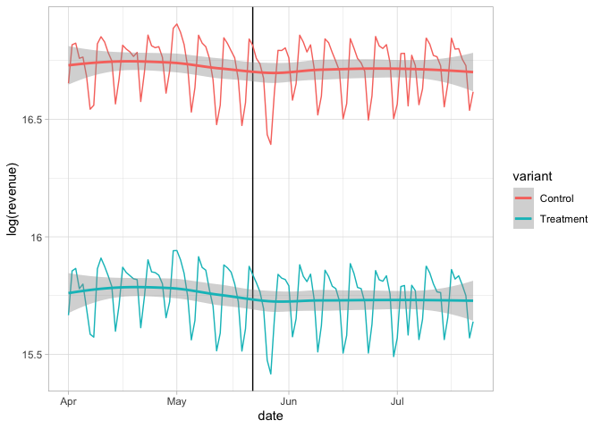
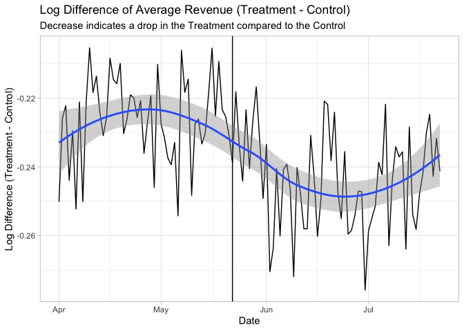
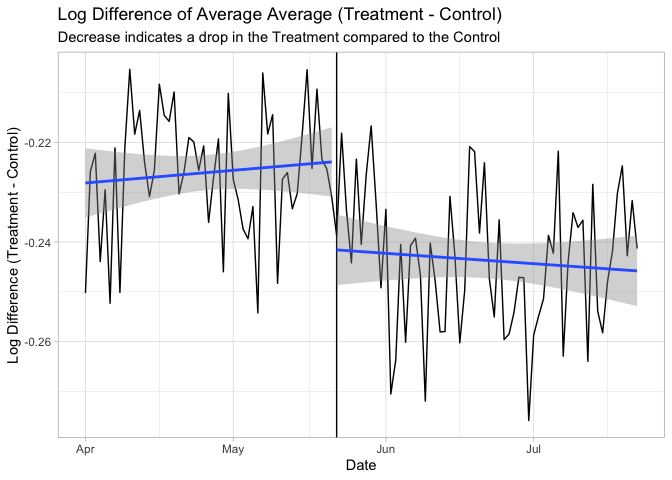
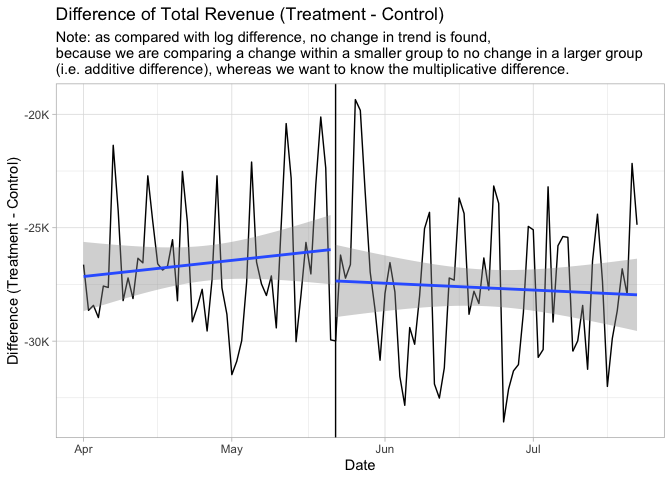
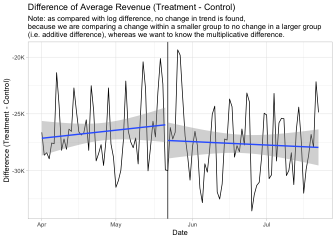
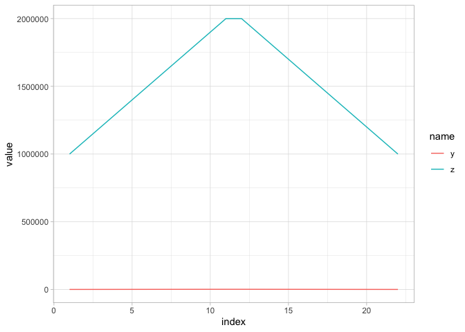
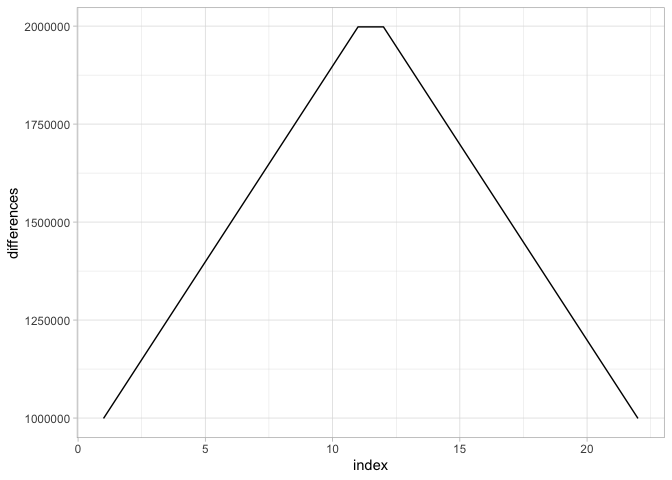
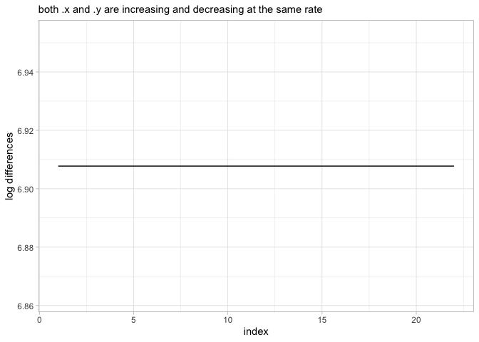

-   [Quick Refresher & Example with
    Logs](#quick-refresher-example-with-logs)
-   [Create dataset that is basis for regression
    model.](#create-dataset-that-is-basis-for-regression-model.)
-   [Create Model](#create-model)
-   [Coefficient interpretation](#coefficient-interpretation)
-   [Controlling for DMA-sepciic revenue
    levels](#controlling-for-dma-sepciic-revenue-levels)

> A diff-in-diff analysis applies when you have two groups whose
> pretreatment differences can be isolated and modeled so that
> post-treatment differences are the basis for causal estimates of the
> treatment effect. - Business Data Science pg 141

Author’s Original Code:
<a href="https://github.com/TaddyLab/BDS/blob/master/examples/paidsearch.R" class="uri">https://github.com/TaddyLab/BDS/blob/master/examples/paidsearch.R</a>

See my questions:
<a href="https://github.com/TaddyLab/BDS/issues/17" class="uri">https://github.com/TaddyLab/BDS/issues/17</a>

``` r
# business data science pg 141
sem <- read.csv("data/paidsearch.csv")
sem <- sem %>%
    mutate(date = as.Date(strptime(date, "%d-%b-%y", tz = 'UTC')),
           dma = factor(dma),
           variant = ifelse(search.stays.on == 1, 'Control', 'Treatment')) %>%
    relocate(variant, .after=search.stays.on)
head(sem)
```

    ##         date dma treatment_period search.stays.on   variant    revenue
    ## 1 2012-04-01 500                0               0 Treatment   76718.74
    ## 2 2012-04-01 501                0               1   Control 2096176.54
    ## 3 2012-04-01 502                0               1   Control   34993.85
    ## 4 2012-04-01 503                0               1   Control   34198.75
    ## 5 2012-04-01 504                0               1   Control  641014.21
    ## 6 2012-04-01 505                0               0 Treatment  327989.31

Here is the overall data, because the treatment is much smaller in total
revenue, it is difficult to see if there is a noticable drop after
Adwords was shut off.

``` r
sem %>%
    count(date, variant, wt=revenue, name='revenue') %>%
    ggplot(aes(x=date, y=revenue, color=variant, group=variant)) +
    geom_vline(xintercept = ymd('2012-05-22')) +
    geom_line() +
    scale_x_date() +
    scale_y_continuous(labels=rt_pretty_axes) +
    geom_smooth() +
    labs(title="Daily Revenue",
         subtitle="The 'Control' are the DMAs where adwords will be left on.\nThe 'Treatment' are the DMAs where adwords is turned off.\nWe could expect a drop in the Treatment as compared to the Control.")
```


Using log() makes it easier to visualize.

``` r
sem %>%
    count(date, variant, wt=revenue, name='revenue') %>%
    ggplot(aes(x=date, y=log(revenue), color=variant, group=variant)) +
    geom_vline(xintercept = ymd('2012-05-22')) +
    geom_line() +
    scale_x_date() +
    scale_y_continuous(labels=rt_pretty_axes) +
    geom_smooth()
```



> Here we will focus on differences in `log` revenue because we
> anticipate that the treatment and control groups are related on
> percentage scale. BDS pg 143.

``` r
sem %>%
    group_by(date) %>%
    summarise(difference = log(mean(revenue[variant == 'Treatment'])) - log(mean(revenue[variant == 'Control']))) %>%
    ungroup() %>%
    ggplot(aes(x=date, y=difference)) +
    geom_vline(xintercept = ymd('2012-05-22')) +
    geom_line() +
    scale_x_date() +
    scale_y_continuous(labels=rt_pretty_axes) +
    geom_smooth() +
    labs(title = "Log Difference of Average Revenue (Treatment - Control)",
         subtitle = "Decrease indicates a drop in the Treatment compared to the Control",
         y = "Log Difference (Treatment - Control)",
         x = 'Date')
```



(Sum would give us the same pattern/trend on different scale)

``` r
sem %>%
    group_by(date) %>%
    summarise(difference = log(sum(revenue[variant == 'Treatment'])) - log(sum(revenue[variant == 'Control']))) %>%
    ungroup() %>%
    ggplot(aes(x=date, y=difference)) +
    geom_vline(xintercept = ymd('2012-05-22')) +
    geom_line() +
    scale_x_date() +
    scale_y_continuous(labels=rt_pretty_axes) +
    geom_smooth() +
    labs(title = "Log Difference of Total Revenue (Treatment - Control)",
         subtitle = "Decrease indicates a drop in the Treatment compared to the Control",
         y = "Log Difference (Treatment - Control)",
         x = 'Date')
```



Same but using separate `lm` on before vs. after.

``` r
sem %>%
    group_by(date, treatment_period) %>%
    summarise(difference = log(mean(revenue[variant == 'Treatment'])) - log(mean(revenue[variant == 'Control']))) %>%
    ungroup() %>%
    ggplot(aes(x=date, y=difference)) +
    geom_vline(xintercept = ymd('2012-05-22')) +
    geom_line() +
    scale_x_date() +
    scale_y_continuous(labels=rt_pretty_axes) +
    geom_smooth(method='lm', aes(group=treatment_period)) +
    labs(title = "Log Difference of Average Average (Treatment - Control)",
         subtitle = "Decrease indicates a drop in the Treatment compared to the Control",
         y = "Log Difference (Treatment - Control)",
         x = 'Date')
```



Quick Refresher & Example with Logs
-----------------------------------

If we would not have used log differences, here is what we would have
had. The difference is dominated by the larger group (control).

``` r
sem %>%
    group_by(date, treatment_period) %>%
    summarise(difference = mean(revenue[variant == 'Treatment']) - mean(revenue[variant == 'Control'])) %>%
    ungroup() %>%
    #pivot_longer(-date, names_to=)
    ggplot(aes(x=date, y=difference)) +
    geom_vline(xintercept = ymd('2012-05-22')) +
    geom_line() +
    scale_x_date() +
    scale_y_continuous(labels=rt_pretty_axes) +
    geom_smooth(method='lm', aes(group=treatment_period)) +
    labs(title = "Difference of Average Revenue (Treatment - Control)",
         subtitle = "Note: as compared with log difference, no change in trend is found,\nbecause we are comparing a change within a smaller group to no change in a larger group\n(i.e. additive difference), whereas we want to know the multiplicative difference.",
         y = "Difference (Treatment - Control)",
         x = 'Date')
```



For example, `.y` and `.z` change multiplicatively (actually percent
change is the same for each, which you can see in the last graph)

``` r
.x <- seq(1, 2, .1)
.x <- c(.x, rev(.x))
(.y <- .x * 1000)
```

    ##  [1] 1000 1100 1200 1300 1400 1500 1600 1700 1800 1900 2000 2000 1900 1800 1700
    ## [16] 1600 1500 1400 1300 1200 1100 1000

``` r
(.z <- .y * 1000)
```

    ##  [1] 1000000 1100000 1200000 1300000 1400000 1500000 1600000 1700000 1800000
    ## [10] 1900000 2000000 2000000 1900000 1800000 1700000 1600000 1500000 1400000
    ## [19] 1300000 1200000 1100000 1000000

Both sequences above have the same percent change.

However, there additive difference doesn’t reflect that.

``` r
.z - .y
```

    ##  [1]  999000 1098900 1198800 1298700 1398600 1498500 1598400 1698300 1798200
    ## [10] 1898100 1998000 1998000 1898100 1798200 1698300 1598400 1498500 1398600
    ## [19] 1298700 1198800 1098900  999000

But when we look at the log differences, it is exactly the same for each
value, because each variable is changing at constant rate, and so there
log differences are the same… i.e. they change multiplicatively.

``` r
log(.z) - log(.y)
```

    ##  [1] 6.907755 6.907755 6.907755 6.907755 6.907755 6.907755 6.907755 6.907755
    ##  [9] 6.907755 6.907755 6.907755 6.907755 6.907755 6.907755 6.907755 6.907755
    ## [17] 6.907755 6.907755 6.907755 6.907755 6.907755 6.907755

Both differences are graphed below.

``` r
data.frame(index=1:length(.y), y=.y, z=.z) %>%
    pivot_longer(cols=-index) %>%
    ggplot(aes(x=index, y=value, color=name, group=name)) +
    geom_line()
```



``` r
data.frame(index=1:length(.y), y=.y, z=.z) %>%
    mutate(differences = z - y) %>%
    ggplot(aes(x=index, y=differences)) +
    geom_line()
```



``` r
data.frame(index=1:length(.y), y=.y, z=.z) %>%
    mutate(difference = log(z) - log(y)) %>%
    ggplot(aes(x=index, y=difference)) +
    geom_line() +
    labs(y='log differences', 
         subtitle = 'both .x and .y are increasing and decreasing at the same rate')
```



Create dataset that is basis for regression model.
--------------------------------------------------

Note: the author uses `mean(log(revenue))` but seems like we would want
to use `log(mean(revenue))`.

This is especially true if we were to use `sum` rather than mean since
control group is much larger and we would want to take the log of the
total (like we did in the graphs).

A model using `log(mean(revenue))` vs `log(sum(revenue))` gives the same
interaction coefficient, which is not true for `mean(log(revenue))` vs
`sum(log(revenue))`.

I ended up using `log(sum(revenue))`, which again is the same as
`log(mean(revenue))` which gives an interaction coefficient of
`-0.005775` compared to `mean(log(revenue))` which gives `-0.006587`
which matches the author’s results.

``` r
# treatment_period of 0 means < May 22, when the ads were on for both variants (consistance difference is expected)
# treatment_period of 1 means >= May 22, when the ads were shut off for Treatment (potental drop in sales for treatment may be expected)
sem_per_dma <- sem %>%
    group_by(dma, treatment_period, variant) %>%
    summarise(log_total_revenue = log(sum(revenue)), n=n()) %>%
    ungroup() %>%
    mutate(variant = factor(variant, levels=c("Control", "Treatment"))) %>%
    as.data.frame()
head(sem_per_dma)
```

    ##   dma treatment_period   variant log_total_revenue  n
    ## 1 500                0 Treatment          15.16856 51
    ## 2 500                1 Treatment          15.31771 62
    ## 3 501                0   Control          18.51881 51
    ## 4 501                1   Control          18.69651 62
    ## 5 502                0   Control          14.32753 51
    ## 6 502                1   Control          14.42551 62

Create Model
------------

``` r
reg_results <- lm(log_total_revenue ~ treatment_period * variant, data=sem_per_dma)
summary(reg_results)
```

    ## 
    ## Call:
    ## lm(formula = log_total_revenue ~ treatment_period * variant, 
    ##     data = sem_per_dma)
    ## 
    ## Residuals:
    ##     Min      1Q  Median      3Q     Max 
    ## -3.8001 -0.7063 -0.0473  0.7613  3.6450 
    ## 
    ## Coefficients:
    ##                                    Estimate Std. Error t value
    ## (Intercept)                       14.895610   0.099849 149.182
    ## treatment_period                   0.155949   0.141207   1.104
    ## variantTreatment                   0.011932   0.175468   0.068
    ## treatment_period:variantTreatment -0.005775   0.248149  -0.023
    ##                                              Pr(>|t|)    
    ## (Intercept)                       <0.0000000000000002 ***
    ## treatment_period                                0.270    
    ## variantTreatment                                0.946    
    ## treatment_period:variantTreatment               0.981    
    ## ---
    ## Signif. codes:  0 '***' 0.001 '**' 0.01 '*' 0.05 '.' 0.1 ' ' 1
    ## 
    ## Residual standard error: 1.19 on 416 degrees of freedom
    ## Multiple R-squared:  0.004229,   Adjusted R-squared:  -0.002952 
    ## F-statistic: 0.5889 on 3 and 416 DF,  p-value: 0.6226

``` r
get_regression_equation(reg_results, .round_by = 5)
```

    ## [1] "log_total_revenue = 14.89561(Intercept) + 0.15595treatment_period + 0.01193variantTreatment + -0.00578treatment_period:variantTreatment + error"

> This says that the treatment - turning off paid search ads - has a
> small but not statistically significant negative effect on log revenue
> (0.66 percentage point drop with a standard error of 0.55% points).
> (pg 145.)

This is a `log-level` model so pg 39 of Intro to econometrics says that
`1 unit` change in x has a `B * 100` percent change in `y`.

So, `-0.006587 * 100` == `-0.6587` i.e. `0.66%` drop.

``` r
(interaction_coeff <- coefficients(reg_results)['treatment_period:variantTreatment'])
```

    ## treatment_period:variantTreatment 
    ##                      -0.005775498

``` r
(interaction_coeff <- paste0(round(interaction_coeff * 100, 2), '%'))
```

    ## [1] "-0.58%"

Coefficient interpretation
--------------------------

Intercept coefficient is the average `log(sum(revenue))` of control
before applying treatment.

``` r
sem_per_dma %>%
    filter(variant == 'Control' & treatment_period == 0) %>%
    pull(log_total_revenue) %>%
    mean()
```

    ## [1] 14.89561

``` r
 coefficients(reg_results)['(Intercept)']
```

    ## (Intercept) 
    ##    14.89561

The coefficient for `treatment_period` is the difference in average
`log(sum(revenue))` before/after for the `control`

``` r
sem_per_dma %>%
    filter(variant == 'Control') %>%
    group_by(treatment_period) %>%
    summarise(mean_y = mean(log_total_revenue)) %>%
    ungroup() %>%
    summarise(diff = mean_y[treatment_period == 1] - mean_y[treatment_period == 0]) %>%
    pull(diff)
```

    ## [1] 0.1559494

``` r
 coefficients(reg_results)['treatment_period']
```

    ## treatment_period 
    ##        0.1559494

The coefficient for `variantTreatment` is the difference in average
`log(sum(revenue))` between the control & variant during the
treatment\_period of 0.

``` r
sem_per_dma %>%
    filter(treatment_period == 0) %>%
    group_by(variant) %>%
    summarise(mean_y = mean(log_total_revenue)) %>%
    ungroup() %>%
    summarise(diff = mean_y[variant == 'Treatment'] - mean_y[variant == 'Control']) %>%
    pull(diff)
```

    ## [1] 0.01193227

``` r
 coefficients(reg_results)['variantTreatment']
```

    ## variantTreatment 
    ##       0.01193227

The coefficient for `treatment_period:variantTreatment`, is the
**difference over time** (i.e. period 1 vs period 2) in the **difference
of average** `log(sum(revenue))` in the two groups (treatment vs
control)… i.e. **difference in difference**.

``` r
sem_per_dma %>%
    group_by(treatment_period, variant) %>%
    summarise(y = mean(log_total_revenue)) %>%
    ungroup() %>%
    summarise(diff = (y[variant == 'Treatment' & treatment_period == 1] -
                      y[variant == 'Control' & treatment_period == 1]) - 
                     (y[variant == 'Treatment' & treatment_period == 0] -
                      y[variant == 'Control' & treatment_period == 0]))
```

    ## # A tibble: 1 x 1
    ##       diff
    ##      <dbl>
    ## 1 -0.00578

``` r
coefficients(reg_results)['treatment_period:variantTreatment']
```

    ## treatment_period:variantTreatment 
    ##                      -0.005775498

Controlling for DMA-sepciic revenue levels
------------------------------------------

``` r
summary(reg_results)
```

    ## 
    ## Call:
    ## lm(formula = log_total_revenue ~ treatment_period * variant, 
    ##     data = sem_per_dma)
    ## 
    ## Residuals:
    ##     Min      1Q  Median      3Q     Max 
    ## -3.8001 -0.7063 -0.0473  0.7613  3.6450 
    ## 
    ## Coefficients:
    ##                                    Estimate Std. Error t value
    ## (Intercept)                       14.895610   0.099849 149.182
    ## treatment_period                   0.155949   0.141207   1.104
    ## variantTreatment                   0.011932   0.175468   0.068
    ## treatment_period:variantTreatment -0.005775   0.248149  -0.023
    ##                                              Pr(>|t|)    
    ## (Intercept)                       <0.0000000000000002 ***
    ## treatment_period                                0.270    
    ## variantTreatment                                0.946    
    ## treatment_period:variantTreatment               0.981    
    ## ---
    ## Signif. codes:  0 '***' 0.001 '**' 0.01 '*' 0.05 '.' 0.1 ' ' 1
    ## 
    ## Residual standard error: 1.19 on 416 degrees of freedom
    ## Multiple R-squared:  0.004229,   Adjusted R-squared:  -0.002952 
    ## F-statistic: 0.5889 on 3 and 416 DF,  p-value: 0.6226

> Note that these rows of data do not satisfy the standard independence
> assumption: each two observations on the same DMA will be correlated.
> … you can use clustered starndard error, or you can get a similar
> result by controlling for the DMA-specific revenue levels in the
> regression equation. BDS pg 144-145

``` r
reg_results <- lm(log_total_revenue ~ dma + treatment_period * variant, data=sem_per_dma)
reg_results %>%
    tidy() %>%
    filter(!str_detect(term, 'dma'))
```

    ## # A tibble: 4 x 5
    ##   term                              estimate std.error statistic    p.value
    ##   <chr>                                <dbl>     <dbl>     <dbl>      <dbl>
    ## 1 (Intercept)                       15.2       0.0200    757.     0.       
    ## 2 treatment_period                   0.156     0.00334    46.7    2.73e-112
    ## 3 variantTreatment                  NA        NA          NA     NA        
    ## 4 treatment_period:variantTreatment -0.00578   0.00586    -0.985  3.26e-  1
