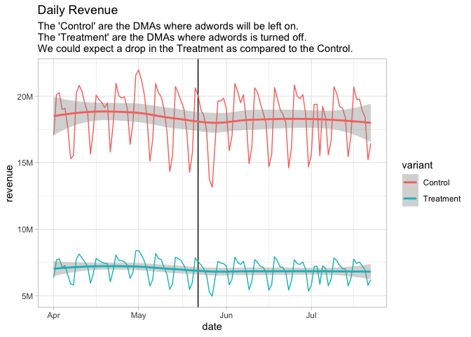

-   [Quick Refresher & Example with
    Logs](#quick-refresher-example-with-logs)
-   [Create dataset that is basis for regression
    model.](#create-dataset-that-is-basis-for-regression-model.)
-   [Create Model](#create-model)
-   [Coefficient interpretation](#coefficient-interpretation)
-   [Controlling for DMA-sepciic revenue
    levels](#controlling-for-dma-sepciic-revenue-levels)

> A diff-in-diff analysis applies when you have two groups whose
> pretreatment differences can be isolated and modeled so that
> post-treatment differences are the basis for causal estimates of the
> treatment effect. - Business Data Science pg 141

``` r
# business data science pg 141
sem <- read.csv("data/paidsearch.csv")
sem <- sem %>%
    mutate(date = as.Date(strptime(date, "%d-%b-%y", tz = 'UTC')),
           dma = factor(dma),
           variant = ifelse(search.stays.on == 1, 'Control', 'Treatment')) %>%
    relocate(variant, .after=search.stays.on)
head(sem)
```

    ##         date dma treatment_period search.stays.on   variant    revenue
    ## 1 2012-04-01 500                0               0 Treatment   76718.74
    ## 2 2012-04-01 501                0               1   Control 2096176.54
    ## 3 2012-04-01 502                0               1   Control   34993.85
    ## 4 2012-04-01 503                0               1   Control   34198.75
    ## 5 2012-04-01 504                0               1   Control  641014.21
    ## 6 2012-04-01 505                0               0 Treatment  327989.31

Here is the overall data, because the treatment is much smaller in total
revenue, it is difficult to see if there is a noticable drop after
Adwords was shut off.

``` r
sem %>%
    count(date, variant, wt=revenue, name='revenue') %>%
    ggplot(aes(x=date, y=revenue, color=variant, group=variant)) +
    geom_vline(xintercept = ymd('2012-05-22')) +
    geom_line() +
    scale_x_date() +
    scale_y_continuous(labels=rt_pretty_axes) +
    geom_smooth() +
    labs(title="Daily Revenue",
         subtitle="The 'Control' are the DMAs where adwords will be left on.\nThe 'Treatment' are the DMAs where adwords is turned off.\nWe could expect a drop in the Treatment as compared to the Control.")
```



Using log() makes it easier to visualize.

``` r
sem %>%
    count(date, variant, wt=revenue, name='revenue') %>%
    ggplot(aes(x=date, y=log(revenue), color=variant, group=variant)) +
    geom_vline(xintercept = ymd('2012-05-22')) +
    geom_line() +
    scale_x_date() +
    scale_y_continuous(labels=rt_pretty_axes) +
    geom_smooth()
```


> Here we will focus on differences in `log` revenue because we
> anticipate that the treatment and control groups are related on
> percentage scale. BDS pg 143.

``` r
sem %>%
    group_by(date) %>%
    summarise(difference = log(mean(revenue[variant == 'Treatment'])) - log(mean(revenue[variant == 'Control']))) %>%
    ungroup() %>%
    ggplot(aes(x=date, y=difference)) +
    geom_vline(xintercept = ymd('2012-05-22')) +
    geom_line() +
    scale_x_date() +
    scale_y_continuous(labels=rt_pretty_axes) +
    geom_smooth() +
    labs(title = "Log Difference of Average Revenue (Treatment - Control)",
         subtitle = "Decrease indicates a drop in the Treatment compared to the Control",
         y = "Log Difference (Treatment - Control)",
         x = 'Date')
```


Same but using separate `lm` on before vs. after.

``` r
sem %>%
    group_by(date, treatment_period) %>%
    summarise(difference = log(mean(revenue[variant == 'Treatment'])) - log(mean(revenue[variant == 'Control']))) %>%
    ungroup() %>%
    ggplot(aes(x=date, y=difference)) +
    geom_vline(xintercept = ymd('2012-05-22')) +
    geom_line() +
    scale_x_date() +
    scale_y_continuous(labels=rt_pretty_axes) +
    geom_smooth(method='lm', aes(group=treatment_period)) +
    labs(title = "Log Difference of Total Average (Treatment - Control)",
         subtitle = "Decrease indicates a drop in the Treatment compared to the Control",
         y = "Log Difference (Treatment - Control)",
         x = 'Date')
```


Quick Refresher & Example with Logs
-----------------------------------

If we would not have used log differences, here is what we would have
had. The difference is dominated by the larger group (control).

``` r
sem %>%
    group_by(date, treatment_period) %>%
    summarise(difference = mean(revenue[variant == 'Treatment']) - mean(revenue[variant == 'Control'])) %>%
    ungroup() %>%
    #pivot_longer(-date, names_to=)
    ggplot(aes(x=date, y=difference)) +
    geom_vline(xintercept = ymd('2012-05-22')) +
    geom_line() +
    scale_x_date() +
    scale_y_continuous(labels=rt_pretty_axes) +
    geom_smooth(method='lm', aes(group=treatment_period)) +
    labs(title = "Difference of Total Revenue (Treatment - Control)",
         subtitle = "Note: as compared with log difference, no change in trend is found,\nbecause we are comparing a change within a smaller group to no change in a larger group\n(i.e. additive difference), whereas we want to know the multiplicative difference.",
         y = "Difference (Treatment - Control)",
         x = 'Date')
```


For example, `.y` and `.z` change multiplicatively (actually percent
change is the same for each, which you can see in the last graph)

``` r
.x <- seq(1, 2, .1)
.x <- c(.x, rev(.x))
(.y <- .x * 1000)
```

    ##  [1] 1000 1100 1200 1300 1400 1500 1600 1700 1800 1900 2000 2000 1900 1800 1700
    ## [16] 1600 1500 1400 1300 1200 1100 1000

``` r
(.z <- .y * 1000)
```

    ##  [1] 1000000 1100000 1200000 1300000 1400000 1500000 1600000 1700000 1800000
    ## [10] 1900000 2000000 2000000 1900000 1800000 1700000 1600000 1500000 1400000
    ## [19] 1300000 1200000 1100000 1000000

Both sequences above have the same percent change.

However, there additive difference doesn’t reflect that.

``` r
.z - .y
```

    ##  [1]  999000 1098900 1198800 1298700 1398600 1498500 1598400 1698300 1798200
    ## [10] 1898100 1998000 1998000 1898100 1798200 1698300 1598400 1498500 1398600
    ## [19] 1298700 1198800 1098900  999000

But when we look at the log differences, it is exactly the same for each
value, because each variable is changing at constant rate, and so there
log differences are the same… i.e. they change multiplicatively.

``` r
log(.z) - log(.y)
```

    ##  [1] 6.907755 6.907755 6.907755 6.907755 6.907755 6.907755 6.907755 6.907755
    ##  [9] 6.907755 6.907755 6.907755 6.907755 6.907755 6.907755 6.907755 6.907755
    ## [17] 6.907755 6.907755 6.907755 6.907755 6.907755 6.907755

Both differences are graphed below.

``` r
data.frame(index=1:length(.y), y=.y, z=.z) %>%
    pivot_longer(cols=-index) %>%
    ggplot(aes(x=index, y=value, color=name, group=name)) +
    geom_line()
```


``` r
data.frame(index=1:length(.y), y=.y, z=.z) %>%
    mutate(differences = z - y) %>%
    ggplot(aes(x=index, y=differences)) +
    geom_line()
```


``` r
data.frame(index=1:length(.y), y=.y, z=.z) %>%
    mutate(difference = log(z) - log(y)) %>%
    ggplot(aes(x=index, y=difference)) +
    geom_line() +
    labs(y='log differences', 
         subtitle = 'both .x and .y are increasing and decreasing at the same rate')
```


Create dataset that is basis for regression model.
--------------------------------------------------

``` r
# treatment_period of 0 means < May 22, when the ads were on for both variants (consistance difference is expected)
# treatment_period of 1 means >= May 22, when the ads were shut off for Treatment (potental drop in sales for treatment may be expected)
sem_per_dma <- sem %>%
    group_by(dma, treatment_period, variant) %>%
    summarise(y = mean(log(revenue)), n=n()) %>%
    ungroup() %>%
    mutate(variant = factor(variant, levels=c("Control", "Treatment"))) %>%
    as.data.frame()
head(sem_per_dma)
```

    ##   dma treatment_period   variant        y  n
    ## 1 500                0 Treatment 11.22800 51
    ## 2 500                1 Treatment 11.17617 62
    ## 3 501                0   Control 14.58000 51
    ## 4 501                1   Control 14.56134 62
    ## 5 502                0   Control 10.38516 51
    ## 6 502                1   Control 10.28572 62

Create Model
------------

``` r
reg_results <- lm(y ~ treatment_period * variant, data=sem_per_dma)
summary(reg_results)
```

    ## 
    ## Call:
    ## lm(formula = y ~ treatment_period * variant, data = sem_per_dma)
    ## 
    ## Residuals:
    ##     Min      1Q  Median      3Q     Max 
    ## -3.8518 -0.7061 -0.0447  0.7696  3.6521 
    ## 
    ## Coefficients:
    ##                                    Estimate Std. Error t value
    ## (Intercept)                       10.948646   0.100495 108.948
    ## treatment_period                  -0.039400   0.142121  -0.277
    ## variantTreatment                   0.014081   0.176603   0.080
    ## treatment_period:variantTreatment -0.006587   0.249754  -0.026
    ##                                              Pr(>|t|)    
    ## (Intercept)                       <0.0000000000000002 ***
    ## treatment_period                                0.782    
    ## variantTreatment                                0.936    
    ## treatment_period:variantTreatment               0.979    
    ## ---
    ## Signif. codes:  0 '***' 0.001 '**' 0.01 '*' 0.05 '.' 0.1 ' ' 1
    ## 
    ## Residual standard error: 1.198 on 416 degrees of freedom
    ## Multiple R-squared:  0.0003231,  Adjusted R-squared:  -0.006886 
    ## F-statistic: 0.04482 on 3 and 416 DF,  p-value: 0.9874

``` r
get_regression_equation(reg_results, .round_by = 5)
```

    ## [1] "y = 10.94865(Intercept) + -0.0394treatment_period + 0.01408variantTreatment + -0.00659treatment_period:variantTreatment + error"

``` r
(interaction_coeff <- coefficients(reg_results)['treatment_period:variantTreatment'])
```

    ## treatment_period:variantTreatment 
    ##                      -0.006586852

``` r
(interaction_coeff <- paste0(round(interaction_coeff * 100, 2), '%'))
```

    ## [1] "-0.66%"

Coefficient interpretation
--------------------------

Intercept coefficient is the average log(revenue) of control before
applying treatment

``` r
sem_per_dma %>%
    filter(variant == 'Control' & treatment_period == 0) %>%
    pull(y) %>%
    mean()
```

    ## [1] 10.94865

``` r
 coefficients(reg_results)['(Intercept)']
```

    ## (Intercept) 
    ##    10.94865

The coefficient for `treatment_period` is the predicted difference
before/after for the `control`

``` r
sem_per_dma %>%
    filter(variant == 'Control') %>%
    group_by(treatment_period) %>%
    summarise(mean_y = mean(y)) %>%
    ungroup() %>%
    summarise(diff = mean_y[treatment_period == 1] - mean_y[treatment_period == 0]) %>%
    pull(diff)
```

    ## [1] -0.03939963

``` r
 coefficients(reg_results)['treatment_period']
```

    ## treatment_period 
    ##      -0.03939963

The coefficient for `treatment_period` is the predicted difference
before/after for the `control`

``` r
sem_per_dma %>%
    filter(variant == 'Control') %>%
    group_by(treatment_period) %>%
    summarise(mean_y = mean(y)) %>%
    ungroup() %>%
    summarise(diff = mean_y[treatment_period == 1] - mean_y[treatment_period == 0]) %>%
    pull(diff)
```

    ## [1] -0.03939963

``` r
 coefficients(reg_results)['treatment_period']
```

    ## treatment_period 
    ##      -0.03939963

The coefficient for `variantTreatment` is the predicted difference
between the control & variant during the treatment\_period of 0.

``` r
sem_per_dma %>%
    filter(treatment_period == 0) %>%
    group_by(variant) %>%
    summarise(mean_y = mean(y)) %>%
    ungroup() %>%
    summarise(diff = mean_y[variant == 'Treatment'] - mean_y[variant == 'Control']) %>%
    pull(diff)
```

    ## [1] 0.01408056

``` r
 coefficients(reg_results)['variantTreatment']
```

    ## variantTreatment 
    ##       0.01408056

The coefficient for `treatment_period:variantTreatment`, is the
difference over tim ein the average difference of (average) revenue in
the two groups.

``` r
sem %>%
    group_by(treatment_period, variant) %>%
    summarise(y = mean(log(revenue))) %>%
    ungroup() %>%
    summarise(diff = (y[variant == 'Treatment' & treatment_period == 1] -
                      y[variant == 'Control' & treatment_period == 1]) - 
                     (y[variant == 'Treatment' & treatment_period == 0] -
                      y[variant == 'Control' & treatment_period == 0]))
```

    ## # A tibble: 1 x 1
    ##       diff
    ##      <dbl>
    ## 1 -0.00659

``` r
coefficients(reg_results)['treatment_period:variantTreatment']
```

    ## treatment_period:variantTreatment 
    ##                      -0.006586852

Controlling for DMA-sepciic revenue levels
------------------------------------------

``` r
summary(reg_results)
```

    ## 
    ## Call:
    ## lm(formula = y ~ treatment_period * variant, data = sem_per_dma)
    ## 
    ## Residuals:
    ##     Min      1Q  Median      3Q     Max 
    ## -3.8518 -0.7061 -0.0447  0.7696  3.6521 
    ## 
    ## Coefficients:
    ##                                    Estimate Std. Error t value
    ## (Intercept)                       10.948646   0.100495 108.948
    ## treatment_period                  -0.039400   0.142121  -0.277
    ## variantTreatment                   0.014081   0.176603   0.080
    ## treatment_period:variantTreatment -0.006587   0.249754  -0.026
    ##                                              Pr(>|t|)    
    ## (Intercept)                       <0.0000000000000002 ***
    ## treatment_period                                0.782    
    ## variantTreatment                                0.936    
    ## treatment_period:variantTreatment               0.979    
    ## ---
    ## Signif. codes:  0 '***' 0.001 '**' 0.01 '*' 0.05 '.' 0.1 ' ' 1
    ## 
    ## Residual standard error: 1.198 on 416 degrees of freedom
    ## Multiple R-squared:  0.0003231,  Adjusted R-squared:  -0.006886 
    ## F-statistic: 0.04482 on 3 and 416 DF,  p-value: 0.9874

> Note that these rwos of data do not satisfy the standard independence
> assumption: each two observations on the same DMA will be correlated.
> … you can use clustered starndard error, or you can get a similar
> result by controlling for the DMA-specific revenue levels in the
> regression equation. BDS pg 144-145

``` r
reg_results <- lm(y ~ dma + treatment_period * variant, data=sem_per_dma)
reg_results %>%
    tidy() %>%
    filter(!str_detect(term, 'dma'))
```

    ## # A tibble: 3 x 5
    ##   term                              estimate std.error statistic  p.value
    ##   <chr>                                <dbl>     <dbl>     <dbl>    <dbl>
    ## 1 (Intercept)                       11.2       0.0190     590.   0.      
    ## 2 treatment_period                  -0.0394    0.00317    -12.4  7.02e-27
    ## 3 treatment_period:variantTreatment -0.00659   0.00557     -1.18 2.38e- 1
