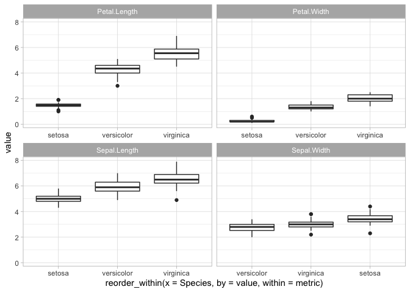
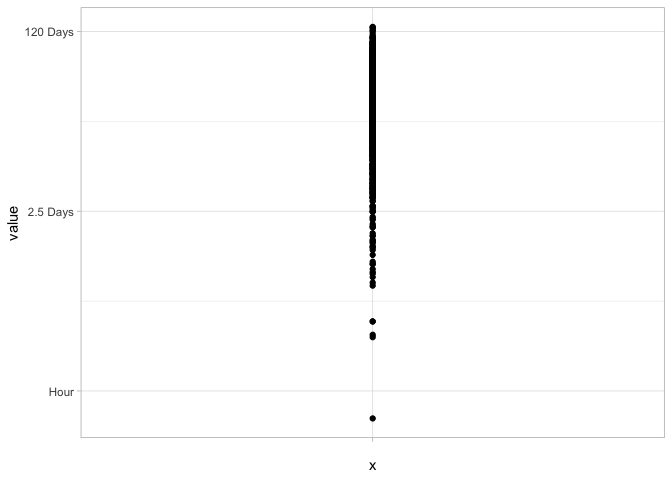

-   [Packages](#packages)
-   [Data Cleaning](#data-cleaning)
    -   [General](#general)
        -   [`clean_names()`](#clean_names)
        -   [`extract()`](#extract)
    -   [Aggregation](#aggregation)
        -   [`group_by() & which.max()`](#group_by-which.max)
        -   [`group_by()` & `top_n()`](#group_by-top_n)
        -   [`summarise()` & `across`](#summarise-across)
        -   [`summarise_at()`](#summarise_at)
        -   [`add_count`](#add_count)
-   [dplyr/tidyverse](#dplyrtidyverse)
    -   [Indirection](#indirection)
        -   [dplyr-like function](#dplyr-like-function)
        -   [.data](#data)
        -   [eval\_tidy](#eval_tidy)
        -   [other examples](#other-examples)
-   [ggplot](#ggplot)
    -   [`reorder_within()`](#reorder_within)
    -   [`scale_x_log10()` with seconds](#scale_x_log10-with-seconds)

Packages
========

``` r
library(tidyverse)
library(janitor)
library(ggplot2)
library(tidytext)
```

Data Cleaning
=============

------------------------------------------------------------------------

General
-------

### `clean_names()`

``` r
iris %>% colnames()
```

    ## [1] "Sepal.Length" "Sepal.Width"  "Petal.Length" "Petal.Width"  "Species"

``` r
iris %>% janitor::clean_names() %>% colnames()
```

    ## [1] "sepal_length" "sepal_width"  "petal_length" "petal_width"  "species"

------------------------------------------------------------------------

### `extract()`

Turn `1` column into `x` columns based on regex

`convert=TRUE` converts them to numeric

``` r
.df <- data.frame(season_epison = paste0('S', c(1, 1, 1, 2, 2, 2, 3, 3, 3),
                                         'E', c(1, 2, 3, 1, 2, 3, 1, 2, 3)))

.df %>% extract(season_epison, c('season', 'episode'), 'S(.*)E(.*)', convert = TRUE, remove = FALSE)
```

    ##   season_epison season episode
    ## 1          S1E1      1       1
    ## 2          S1E2      1       2
    ## 3          S1E3      1       3
    ## 4          S2E1      2       1
    ## 5          S2E2      2       2
    ## 6          S2E3      2       3
    ## 7          S3E1      3       1
    ## 8          S3E2      3       2
    ## 9          S3E3      3       3

------------------------------------------------------------------------

Aggregation
-----------

### `group_by() & which.max()`

``` r
which.max(c(2, 1, 4, 3))
```

    ## [1] 3

``` r
which.max(c(2, 4, 4, 3))
```

    ## [1] 2

`first(name[which.max(height)])`

``` r
starwars %>%
    group_by(gender) %>%
    summarise(n = n(),
              tallest_person = first(name[which.max(height)]),
              tallest_height = max(height, na.rm = TRUE),
              oldest_person = first(name[which.min(birth_year)]))
```

    ## # A tibble: 3 x 5
    ##   gender        n tallest_person tallest_height oldest_person        
    ##   <chr>     <int> <chr>                   <int> <chr>                
    ## 1 feminine     17 Taun We                   213 Leia Organa          
    ## 2 masculine    66 Yarael Poof               264 Wicket Systri Warrick
    ## 3 <NA>          4 Ric Olié                  183 Quarsh Panaka

[Tidy Tuesday screencast: analyzing franchise revenue -
YouTube](https://youtu.be/1xsbTs9-a50?t=365)

------------------------------------------------------------------------

### `group_by()` & `top_n()`

This gets the `N` rows associated with the top `N` values for each
category being grouped

`top_n(3, height)`

``` r
starwars %>%
    group_by(gender) %>%
    top_n(3, height) %>%
    select(gender, name, height) %>%
    arrange(gender, height) %>%
    ungroup()
```

    ## # A tibble: 10 x 3
    ##    gender    name          height
    ##    <chr>     <chr>          <int>
    ##  1 feminine  Ayla Secura      178
    ##  2 feminine  Shaak Ti         178
    ##  3 feminine  Adi Gallia       184
    ##  4 feminine  Taun We          213
    ##  5 masculine Lama Su          229
    ##  6 masculine Tarfful          234
    ##  7 masculine Yarael Poof      264
    ##  8 <NA>      Sly Moore        178
    ##  9 <NA>      Ric Olié         183
    ## 10 <NA>      Quarsh Panaka    183

------------------------------------------------------------------------

### `summarise()` & `across`

-   Summarize multiple columns with multiple functions
-   name columns with `glue` style convention

``` r
mtcars %>% 
  group_by(cyl) %>% 
  summarise(across(starts_with("d"),
                   list(mean = mean,
                           sd = sd),
                   .names = "{col}_{fn}"))
```

    ## # A tibble: 3 x 5
    ##     cyl disp_mean disp_sd drat_mean drat_sd
    ##   <dbl>     <dbl>   <dbl>     <dbl>   <dbl>
    ## 1     4      105.    26.9      4.07   0.365
    ## 2     6      183.    41.6      3.59   0.476
    ## 3     8      353.    67.8      3.23   0.372

------------------------------------------------------------------------

same as above using formulas

``` r
mtcars %>% 
  group_by(cyl) %>% 
  summarise(across(starts_with("d"), 
                   list(minus_sd = ~ (mean(.x) - sd(.x)), 
                        mean = mean, 
                        plus_sd = ~ (mean(.x) + sd(.x)))
                   ))
```

    ## # A tibble: 3 x 7
    ##     cyl disp_minus_sd disp_mean disp_plus_sd drat_minus_sd drat_mean
    ##   <dbl>         <dbl>     <dbl>        <dbl>         <dbl>     <dbl>
    ## 1     4          78.3      105.         132.          3.71      4.07
    ## 2     6         142.       183.         225.          3.11      3.59
    ## 3     8         285.       353.         421.          2.86      3.23
    ## # … with 1 more variable: drat_plus_sd <dbl>

------------------------------------------------------------------------

### `summarise_at()`

``` r
iris %>% group_by(Species) %>% summarise_at(vars(Sepal.Length, Sepal.Width), sum, na.rm = TRUE)
```

    ## # A tibble: 3 x 3
    ##   Species    Sepal.Length Sepal.Width
    ##   <fct>             <dbl>       <dbl>
    ## 1 setosa             250.        171.
    ## 2 versicolor         297.        138.
    ## 3 virginica          329.        149.

------------------------------------------------------------------------

### `add_count`

``` r
iris %>% add_count(Species, name = 'num_species') %>% head()
```

    ##   Sepal.Length Sepal.Width Petal.Length Petal.Width Species num_species
    ## 1          5.1         3.5          1.4         0.2  setosa          50
    ## 2          4.9         3.0          1.4         0.2  setosa          50
    ## 3          4.7         3.2          1.3         0.2  setosa          50
    ## 4          4.6         3.1          1.5         0.2  setosa          50
    ## 5          5.0         3.6          1.4         0.2  setosa          50
    ## 6          5.4         3.9          1.7         0.4  setosa          50

`add_count(Species, name = 'num_species')` is equivalent to
`group_by(Species) %>% mutate(num_species = n()) %>% ungroup()`

------------------------------------------------------------------------

dplyr/tidyverse
===============

Indirection
-----------

Create a dplyr-like function that uses the column names of the dataframe
rather than strings or the object directly.

<a href="https://dplyr.tidyverse.org/articles/programming.html" class="uri">https://dplyr.tidyverse.org/articles/programming.html</a>

### dplyr-like function

``` r
var_summary <- function(data, var) {
    # note the {{ var }}
    data %>%
        summarise(n = n(),
                  min = min({{ var }}),
                  max = max({{ var }}))
}

mtcars %>% 
    group_by(cyl) %>% 
    var_summary(mpg)
```

    ## # A tibble: 3 x 4
    ##     cyl     n   min   max
    ##   <dbl> <int> <dbl> <dbl>
    ## 1     4    11  21.4  33.9
    ## 2     6     7  17.8  21.4
    ## 3     8    14  10.4  19.2

> If you want the user to provide a set of data-variables that are then
> transformed, use across():

``` r
var_summary <- function(data, .group_by, .var) {
    # note the {{ var }}
    data %>%
        group_by(across({{ .group_by }})) %>%
        summarise(n = n(),
                  min = min({{ .var }}),
                  max = max({{ .var }}))
}

mtcars %>% var_summary(.group_by=cyl, .var=mpg)
```

    ## # A tibble: 3 x 4
    ##     cyl     n   min   max
    ##   <dbl> <int> <dbl> <dbl>
    ## 1     4    11  21.4  33.9
    ## 2     6     7  17.8  21.4
    ## 3     8    14  10.4  19.2

``` r
mtcars %>% var_summary(.group_by=c(cyl, vs), .var=mpg)
```

    ## # A tibble: 5 x 5
    ## # Groups:   cyl [3]
    ##     cyl    vs     n   min   max
    ##   <dbl> <dbl> <int> <dbl> <dbl>
    ## 1     4     0     1  26    26  
    ## 2     4     1    10  21.4  33.9
    ## 3     6     0     3  19.7  21  
    ## 4     6     1     4  17.8  21.4
    ## 5     8     0    14  10.4  19.2

------------------------------------------------------------------------

> Use the .names argument to across() to control the names of the
> output.

(Note the vignette uses `.col` instead of `col`, which fails.)

``` r
my_summarise <- function(data, .group_by, .summarise_vars) {
  data %>%
    group_by(across({{ .group_by }})) %>% 
    summarise(across({{ .summarise_vars }},
                     mean,
                     .names = "mean_{col}"))
}
mtcars %>% my_summarise(cyl, mpg)
```

    ## # A tibble: 3 x 2
    ##     cyl mean_mpg
    ##   <dbl>    <dbl>
    ## 1     4     26.7
    ## 2     6     19.7
    ## 3     8     15.1

``` r
mtcars %>% my_summarise(c(cyl, vs), .summarise_vars=c(mpg, hp))
```

    ## # A tibble: 5 x 4
    ## # Groups:   cyl [3]
    ##     cyl    vs mean_mpg mean_hp
    ##   <dbl> <dbl>    <dbl>   <dbl>
    ## 1     4     0     26      91  
    ## 2     4     1     26.7    81.8
    ## 3     6     0     20.6   132. 
    ## 4     6     1     19.1   115. 
    ## 5     8     0     15.1   209.

------------------------------------------------------------------------

### .data

> “Note that `.data` is not a data frame; it’s a special construct, a
> pronoun, that allows you to access the current variables either
> directly, with `.data$x` or indirectly with `.data[[var]]`. Don’t
> expect other functions to work with it.”

``` r
var <- 'cyl'
mtcars %>% count(.data[[var]])
```

    ##   cyl  n
    ## 1   4 11
    ## 2   6  7
    ## 3   8 14

``` r
# ROW_NUMBER() OVER (PARITION BY col_x ORDER BY col_y) AS index
row_number_over_partition_by <- function(data, .partition_by, .order_by) {
    data %>%
        group_by(across({{ .partition_by }})) %>%
        mutate(index = row_number({{ .order_by }})) %>%
        ungroup()
}
mtcars %>% 
    select(cyl, mpg) %>%
    row_number_over_partition_by(cyl, mpg) %>%
    arrange(cyl, mpg)
```

    ## # A tibble: 32 x 3
    ##      cyl   mpg index
    ##    <dbl> <dbl> <int>
    ##  1     4  21.4     1
    ##  2     4  21.5     2
    ##  3     4  22.8     3
    ##  4     4  22.8     4
    ##  5     4  24.4     5
    ##  6     4  26       6
    ##  7     4  27.3     7
    ##  8     4  30.4     8
    ##  9     4  30.4     9
    ## 10     4  32.4    10
    ## # … with 22 more rows

``` r
mtcars %>% 
    select(cyl, mpg) %>%
    row_number_over_partition_by(cyl, desc(mpg)) %>%
    arrange(cyl, mpg)
```

    ## # A tibble: 32 x 3
    ##      cyl   mpg index
    ##    <dbl> <dbl> <int>
    ##  1     4  21.4    11
    ##  2     4  21.5    10
    ##  3     4  22.8     8
    ##  4     4  22.8     9
    ##  5     4  24.4     7
    ##  6     4  26       6
    ##  7     4  27.3     5
    ##  8     4  30.4     3
    ##  9     4  30.4     4
    ## 10     4  32.4     2
    ## # … with 22 more rows

### eval\_tidy

``` r
with_data <- function(data, .x) {
  expr <- rlang::enquo(.x)
  print(expr)
  rlang::eval_tidy(expr, data = data)
}
mtcars %>% with_data(.x=mean(cyl) * 10)
```

    ## <quosure>
    ## expr: ^mean(cyl) * 10
    ## env:  0x7fd022b58200

    ## [1] 61.875

### other examples

``` r
# this is a hack because row_number only takes one column
#.partition_by, 
row_number_over_partition_by <- function(.x, .col_name, .partition_by, ...) {
    .result <- .x %>%
        mutate(temp______original_order = row_number()) %>%
        group_by(across({{ .partition_by }})) %>%
        arrange( ... , .by_group = TRUE) %>%
        mutate(grouped_index = row_number()) %>%
        ungroup() %>%
        arrange(temp______original_order) %>%
        pull(grouped_index)

    .x[deparse(substitute(.col_name))] <- .result
    
    return (.x)
}
mtcars %>% 
    select(cyl, am, vs, mpg) %>%
    row_number_over_partition_by(
        # new column name
        .col_name = my_index,
        # "partition by"
        .partition_by = c(cyl, am),
        # "order by" i.e. sort index in order of these variable
        desc(vs), mpg
    ) %>%
    arrange(desc(cyl), am, desc(vs), mpg)
```

    ##                     cyl am vs  mpg my_index
    ## Cadillac Fleetwood    8  0  0 10.4        1
    ## Lincoln Continental   8  0  0 10.4        2
    ## Camaro Z28            8  0  0 13.3        3
    ## Duster 360            8  0  0 14.3        4
    ## Chrysler Imperial     8  0  0 14.7        5
    ## Merc 450SLC           8  0  0 15.2        6
    ## AMC Javelin           8  0  0 15.2        7
    ## Dodge Challenger      8  0  0 15.5        8
    ## Merc 450SE            8  0  0 16.4        9
    ## Merc 450SL            8  0  0 17.3       10
    ## Hornet Sportabout     8  0  0 18.7       11
    ## Pontiac Firebird      8  0  0 19.2       12
    ## Maserati Bora         8  1  0 15.0        1
    ## Ford Pantera L        8  1  0 15.8        2
    ## Merc 280C             6  0  1 17.8        1
    ## Valiant               6  0  1 18.1        2
    ## Merc 280              6  0  1 19.2        3
    ## Hornet 4 Drive        6  0  1 21.4        4
    ## Ferrari Dino          6  1  0 19.7        1
    ## Mazda RX4             6  1  0 21.0        2
    ## Mazda RX4 Wag         6  1  0 21.0        3
    ## Toyota Corona         4  0  1 21.5        1
    ## Merc 230              4  0  1 22.8        2
    ## Merc 240D             4  0  1 24.4        3
    ## Volvo 142E            4  1  1 21.4        1
    ## Datsun 710            4  1  1 22.8        2
    ## Fiat X1-9             4  1  1 27.3        3
    ## Honda Civic           4  1  1 30.4        4
    ## Lotus Europa          4  1  1 30.4        5
    ## Fiat 128              4  1  1 32.4        6
    ## Toyota Corolla        4  1  1 33.9        7
    ## Porsche 914-2         4  1  0 26.0        8

``` r
filter_over_partition_by <- function(.x, .partition_by, ...) {
    .x %>%
        mutate(temp______original_order = row_number()) %>%
        group_by(across({{ .partition_by }})) %>%
        arrange( ... , .by_group = TRUE) %>%
        filter(row_number() == 1) %>%
        ungroup() %>%
        arrange(temp______original_order) %>%
        select(-temp______original_order)
}
mtcars %>% 
    select(cyl, am, vs, mpg) %>%
    filter_over_partition_by(
        # "partition by"
        .partition_by = c(cyl, am),
        # "order by" i.e. sort index in order of these variable
        desc(vs), mpg
    ) %>%
    arrange(desc(cyl), am, desc(vs), mpg)
```

    ## # A tibble: 6 x 4
    ##     cyl    am    vs   mpg
    ##   <dbl> <dbl> <dbl> <dbl>
    ## 1     8     0     0  10.4
    ## 2     8     1     0  15  
    ## 3     6     0     1  17.8
    ## 4     6     1     0  19.7
    ## 5     4     0     1  21.5
    ## 6     4     1     1  21.4

ggplot
======

### `reorder_within()`

Reorder sub-categories within category e.g. for faceting.

For example, the order of `setosa`, `versicolor`, `virginica` is allowed
to change for each measurement (e.g. `Petal.Length`, `Sepal.Width`)

``` r
iris_gathered <- iris %>% pivot_longer(-Species, names_to = 'metric', values_to = 'value')
iris_gathered %>%
    ggplot(aes(x=reorder_within(x=Species, by=value, within=metric),
               y=value)) +
    geom_boxplot() +
    # this is necessary to undo the transformations to the values that reorder_within did
    scale_x_reordered() +
    facet_wrap(~ metric, scales = 'free_x')
```



### `scale_x_log10()` with seconds

    * scales the x-axis ticks but keeps the actual values the same
    * this works when viewing time (in seconds)

``` r
data.frame(value = abs(rnorm(1000, sd = (60^4) / 3))) %>%
ggplot(aes(x='', y=value)) +
    geom_point() +
    scale_y_log10(breaks = c(0, 60 ^ (0:4)),
                  labels = c("0", "Second", "Minute", "Hour", "2.5 Days", "120 Days"))
```


