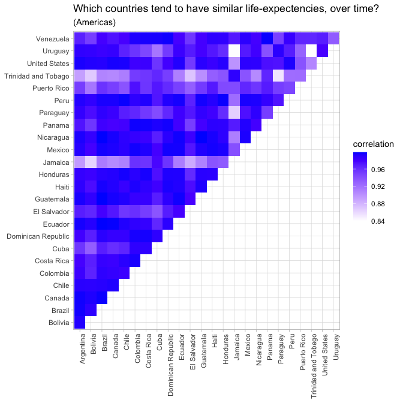

-   [Packages](#packages)
-   [Data Cleaning](#data-cleaning)
    -   [General](#general)
        -   [`clean_names()`](#clean_names)
        -   [`extract()`](#extract)
        -   [regex\_left\_join](#regex_left_join)
    -   [Aggregation](#aggregation)
        -   [`group_by() & which.max()`](#group_by-which.max)
        -   [`group_by()` & `top_n()`](#group_by-top_n)
        -   [`summarise()` & `across`](#summarise-across)
        -   [`summarise_at()`](#summarise_at)
        -   [`add_count`](#add_count)
-   [dplyr/tidyverse](#dplyrtidyverse)
    -   [`join` `suffix`](#join-suffix)
    -   [`semi-join`](#semi-join)
    -   [Indirection](#indirection)
        -   [dplyr-like function](#dplyr-like-function)
        -   [.data](#data)
        -   [eval\_tidy](#eval_tidy)
        -   [other examples](#other-examples)
-   [ggplot](#ggplot)
    -   [`reorder_within()`](#reorder_within)
    -   [`scale_x_log10()` with seconds](#scale_x_log10-with-seconds)
    -   [ggplot2 with `interaction()`](#ggplot2-with-interaction)
    -   [spinogram](#spinogram)
-   [Advanced](#advanced)
    -   [Confidence Intervals w/
        t-tests](#confidence-intervals-w-t-tests)
    -   [Survival Analysis](#survival-analysis)
    -   [Pairwise Correlation](#pairwise-correlation)
    -   [`ebbr` package: Empirical Bayes on the Binomial in
        R](#ebbr-package-empirical-bayes-on-the-binomial-in-r)

Packages
========

``` r
library(tidyverse)
library(janitor)
library(ggplot2)
library(tidytext)
```

Data Cleaning
=============

------------------------------------------------------------------------

General
-------

### `clean_names()`

``` r
iris %>% colnames()
```

    ## [1] "Sepal.Length" "Sepal.Width"  "Petal.Length" "Petal.Width"  "Species"

``` r
iris %>% janitor::clean_names() %>% colnames()
```

    ## [1] "sepal_length" "sepal_width"  "petal_length" "petal_width"  "species"

------------------------------------------------------------------------

### `extract()`

Turn `1` column into `x` columns based on regex

`convert=TRUE` converts them to numeric

``` r
.df <- data.frame(season_epison = paste0('S', c(1, 1, 1, 2, 2, 2, 3, 3, 3),
                                         'E', c(1, 2, 3, 1, 2, 3, 1, 2, 3)))

.df %>% extract(season_epison, c('season', 'episode'), 'S(.*)E(.*)', convert = TRUE, remove = FALSE)
```

    ##   season_epison season episode
    ## 1          S1E1      1       1
    ## 2          S1E2      1       2
    ## 3          S1E3      1       3
    ## 4          S2E1      2       1
    ## 5          S2E2      2       2
    ## 6          S2E3      2       3
    ## 7          S3E1      3       1
    ## 8          S3E2      3       2
    ## 9          S3E3      3       3

------------------------------------------------------------------------

### regex\_left\_join

Example from David Robinson Tidy-Tuesday Screencast
(<a href="https://youtu.be/KiqpX-gNIS4?t=1715" class="uri">https://youtu.be/KiqpX-gNIS4?t=1715</a>)

Join data.frames based on matching regex.

In this example, we will create categories and add them to our
data.frame based on regex.

``` r
#install.packages('fuzzyjoin')
library(fuzzyjoin)

cetaceans_raw <- read_csv('https://raw.githubusercontent.com/rfordatascience/tidytuesday/master/data/2018/2018-12-18/allCetaceanData.csv') %>% 
    select(-X1) %>%
    mutate(birthYear = as.numeric(birthYear))
cetaceans <- cetaceans_raw %>% select(species, originLocation)
head(cetaceans)
```

    ## # A tibble: 6 x 2
    ##   species    originLocation         
    ##   <chr>      <chr>                  
    ## 1 Bottlenose Marineland Florida     
    ## 2 Bottlenose Dolphin Research Center
    ## 3 Bottlenose SeaWorld San Diego     
    ## 4 Bottlenose SeaWorld Orlando       
    ## 5 Bottlenose SeaWorld Orlando       
    ## 6 Bottlenose SeaWorld San Diego

``` r
regexes <- tribble(
  ~ regex, ~ category,
  "Unknown", "Unknown",
  "Gulf of Mexico", "Gulf of Mexico",
  "Florida|FL", "Florida",
  "Texas|TX", "Texas",
  "SeaWorld", "SeaWorld",
  "Pacific", "Pacific Ocean",
  "Atlantic", "Atlantic Ocean"
)

cetaceans %>%
    # left-join will create multiple rows if there are muliple matches
    # so create a row number to track unique rows
    mutate(unique_id = row_number()) %>%
    # join on regexes, based on regex
    regex_left_join(regexes, c(originLocation = "regex")) %>%
    # only keep the unique/distinct rows from the data.frame
    # If there are multiple rows for a given combination of inputs, only the first row will be preserved.
    # If omitted, will use all variables.
    # .keep_all:  If TRUE, keep all variables in .data.
    distinct(unique_id, .keep_all = TRUE) %>%
    # coalesce gets the first value that is not NA
    # so if category is not NA then use category, else use originLocation
    mutate(category = coalesce(category, originLocation)) %>%
    head(20)
```

    ## # A tibble: 20 x 5
    ##    species    originLocation          unique_id regex     category              
    ##    <chr>      <chr>                       <int> <chr>     <chr>                 
    ##  1 Bottlenose Marineland Florida              1 Florida|… Florida               
    ##  2 Bottlenose Dolphin Research Center         2 <NA>      Dolphin Research Cent…
    ##  3 Bottlenose SeaWorld San Diego              3 SeaWorld  SeaWorld              
    ##  4 Bottlenose SeaWorld Orlando                4 SeaWorld  SeaWorld              
    ##  5 Bottlenose SeaWorld Orlando                5 SeaWorld  SeaWorld              
    ##  6 Bottlenose SeaWorld San Diego              6 SeaWorld  SeaWorld              
    ##  7 Bottlenose SeaWorld San Diego              7 SeaWorld  SeaWorld              
    ##  8 Bottlenose SeaWorld Orlando                8 SeaWorld  SeaWorld              
    ##  9 Bottlenose SeaWorld San Diego              9 SeaWorld  SeaWorld              
    ## 10 Bottlenose SeaWorld San Diego             10 SeaWorld  SeaWorld              
    ## 11 Bottlenose Marineland Florida             11 Florida|… Florida               
    ## 12 Bottlenose SeaWorld San Diego             12 SeaWorld  SeaWorld              
    ## 13 Bottlenose SeaWorld Orlando               13 SeaWorld  SeaWorld              
    ## 14 Bottlenose Dolphin Research Center        14 <NA>      Dolphin Research Cent…
    ## 15 Bottlenose Dolphin Research Center        15 <NA>      Dolphin Research Cent…
    ## 16 Bottlenose Dolphin Research Center        16 <NA>      Dolphin Research Cent…
    ## 17 Bottlenose Dolphin Connection             17 <NA>      Dolphin Connection    
    ## 18 Bottlenose SeaWorld Orlando               18 SeaWorld  SeaWorld              
    ## 19 Bottlenose SeaWorld Orlando               19 SeaWorld  SeaWorld              
    ## 20 Bottlenose SeaWorld San Diego             20 SeaWorld  SeaWorld

------------------------------------------------------------------------

Aggregation
-----------

### `group_by() & which.max()`

``` r
which.max(c(2, 1, 4, 3))
```

    ## [1] 3

``` r
which.max(c(2, 4, 4, 3))
```

    ## [1] 2

`first(name[which.max(height)])`

``` r
starwars %>%
    group_by(gender) %>%
    summarise(n = n(),
              tallest_person = first(name[which.max(height)]),
              tallest_height = max(height, na.rm = TRUE),
              oldest_person = first(name[which.min(birth_year)]))
```

    ## # A tibble: 3 x 5
    ##   gender        n tallest_person tallest_height oldest_person        
    ##   <chr>     <int> <chr>                   <int> <chr>                
    ## 1 feminine     17 Taun We                   213 Leia Organa          
    ## 2 masculine    66 Yarael Poof               264 Wicket Systri Warrick
    ## 3 <NA>          4 Ric Olié                  183 Quarsh Panaka

[Tidy Tuesday screencast: analyzing franchise revenue -
YouTube](https://youtu.be/1xsbTs9-a50?t=365)

------------------------------------------------------------------------

### `group_by()` & `top_n()`

This gets the `N` rows associated with the top `N` values for each
category being grouped

`top_n(3, height)`

``` r
starwars %>%
    group_by(gender) %>%
    top_n(3, height) %>%
    select(gender, name, height) %>%
    arrange(gender, height) %>%
    ungroup()
```

    ## # A tibble: 10 x 3
    ##    gender    name          height
    ##    <chr>     <chr>          <int>
    ##  1 feminine  Ayla Secura      178
    ##  2 feminine  Shaak Ti         178
    ##  3 feminine  Adi Gallia       184
    ##  4 feminine  Taun We          213
    ##  5 masculine Lama Su          229
    ##  6 masculine Tarfful          234
    ##  7 masculine Yarael Poof      264
    ##  8 <NA>      Sly Moore        178
    ##  9 <NA>      Ric Olié         183
    ## 10 <NA>      Quarsh Panaka    183

------------------------------------------------------------------------

### `summarise()` & `across`

-   Summarize multiple columns with multiple functions
-   name columns with `glue` style convention

``` r
mtcars %>% 
  group_by(cyl) %>% 
  summarise(across(starts_with("d"),
                   list(mean = mean,
                           sd = sd),
                   .names = "{col}_{fn}"))
```

    ## # A tibble: 3 x 5
    ##     cyl disp_mean disp_sd drat_mean drat_sd
    ##   <dbl>     <dbl>   <dbl>     <dbl>   <dbl>
    ## 1     4      105.    26.9      4.07   0.365
    ## 2     6      183.    41.6      3.59   0.476
    ## 3     8      353.    67.8      3.23   0.372

------------------------------------------------------------------------

same as above using formulas

``` r
mtcars %>% 
  group_by(cyl) %>% 
  summarise(across(starts_with("d"), 
                   list(minus_sd = ~ (mean(.x) - sd(.x)), 
                        mean = mean, 
                        plus_sd = ~ (mean(.x) + sd(.x)))
                   ))
```

    ## # A tibble: 3 x 7
    ##     cyl disp_minus_sd disp_mean disp_plus_sd drat_minus_sd drat_mean
    ##   <dbl>         <dbl>     <dbl>        <dbl>         <dbl>     <dbl>
    ## 1     4          78.3      105.         132.          3.71      4.07
    ## 2     6         142.       183.         225.          3.11      3.59
    ## 3     8         285.       353.         421.          2.86      3.23
    ## # … with 1 more variable: drat_plus_sd <dbl>

------------------------------------------------------------------------

### `summarise_at()`

``` r
iris %>% group_by(Species) %>% summarise_at(vars(Sepal.Length, Sepal.Width), sum, na.rm = TRUE)
```

    ## # A tibble: 3 x 3
    ##   Species    Sepal.Length Sepal.Width
    ##   <fct>             <dbl>       <dbl>
    ## 1 setosa             250.        171.
    ## 2 versicolor         297.        138.
    ## 3 virginica          329.        149.

------------------------------------------------------------------------

### `add_count`

``` r
iris %>% add_count(Species, name = 'num_species') %>% head()
```

    ##   Sepal.Length Sepal.Width Petal.Length Petal.Width Species num_species
    ## 1          5.1         3.5          1.4         0.2  setosa          50
    ## 2          4.9         3.0          1.4         0.2  setosa          50
    ## 3          4.7         3.2          1.3         0.2  setosa          50
    ## 4          4.6         3.1          1.5         0.2  setosa          50
    ## 5          5.0         3.6          1.4         0.2  setosa          50
    ## 6          5.4         3.9          1.7         0.4  setosa          50

`add_count(Species, name = 'num_species')` is equivalent to
`group_by(Species) %>% mutate(num_species = n()) %>% ungroup()`

------------------------------------------------------------------------

dplyr/tidyverse
===============

`join` `suffix`
---------------

``` r
band_members %>%
    inner_join(band_members, by = 'name',
               suffix = c('.x', '.y'))
```

    ## # A tibble: 3 x 3
    ##   name  band.x  band.y 
    ##   <chr> <chr>   <chr>  
    ## 1 Mick  Stones  Stones 
    ## 2 John  Beatles Beatles
    ## 3 Paul  Beatles Beatles

`semi-join`
-----------

``` r
band_members
```

    ## # A tibble: 3 x 2
    ##   name  band   
    ##   <chr> <chr>  
    ## 1 Mick  Stones 
    ## 2 John  Beatles
    ## 3 Paul  Beatles

``` r
band_instruments
```

    ## # A tibble: 3 x 2
    ##   name  plays 
    ##   <chr> <chr> 
    ## 1 John  guitar
    ## 2 Paul  bass  
    ## 3 Keith guitar

`x %>% semi_join(y)` is an `inner_join(y)` that returns only `x`
(doesn’t include any columns from `y`)

``` r
band_members %>% semi_join(band_instruments, by = 'name')
```

    ## # A tibble: 2 x 2
    ##   name  band   
    ##   <chr> <chr>  
    ## 1 John  Beatles
    ## 2 Paul  Beatles

``` r
band_members %>% inner_join(band_instruments, by = 'name') %>% select(name, band)
```

    ## # A tibble: 2 x 2
    ##   name  band   
    ##   <chr> <chr>  
    ## 1 John  Beatles
    ## 2 Paul  Beatles

------------------------------------------------------------------------

Indirection
-----------

Create a dplyr-like function that uses the column names of the dataframe
rather than strings or the object directly.

<a href="https://dplyr.tidyverse.org/articles/programming.html" class="uri">https://dplyr.tidyverse.org/articles/programming.html</a>

### dplyr-like function

``` r
var_summary <- function(data, var) {
    # note the {{ var }}
    data %>%
        summarise(n = n(),
                  min = min({{ var }}),
                  max = max({{ var }}))
}

mtcars %>% 
    group_by(cyl) %>% 
    var_summary(mpg)
```

    ## # A tibble: 3 x 4
    ##     cyl     n   min   max
    ##   <dbl> <int> <dbl> <dbl>
    ## 1     4    11  21.4  33.9
    ## 2     6     7  17.8  21.4
    ## 3     8    14  10.4  19.2

> If you want the user to provide a set of data-variables that are then
> transformed, use across():

``` r
var_summary <- function(data, .group_by, .var) {
    # note the {{ var }}
    data %>%
        group_by(across({{ .group_by }})) %>%
        summarise(n = n(),
                  min = min({{ .var }}),
                  max = max({{ .var }}))
}

mtcars %>% var_summary(.group_by=cyl, .var=mpg)
```

    ## # A tibble: 3 x 4
    ##     cyl     n   min   max
    ##   <dbl> <int> <dbl> <dbl>
    ## 1     4    11  21.4  33.9
    ## 2     6     7  17.8  21.4
    ## 3     8    14  10.4  19.2

``` r
mtcars %>% var_summary(.group_by=c(cyl, vs), .var=mpg)
```

    ## # A tibble: 5 x 5
    ## # Groups:   cyl [3]
    ##     cyl    vs     n   min   max
    ##   <dbl> <dbl> <int> <dbl> <dbl>
    ## 1     4     0     1  26    26  
    ## 2     4     1    10  21.4  33.9
    ## 3     6     0     3  19.7  21  
    ## 4     6     1     4  17.8  21.4
    ## 5     8     0    14  10.4  19.2

------------------------------------------------------------------------

> Use the .names argument to across() to control the names of the
> output.

(Note the vignette uses `.col` instead of `col`, which fails.)

``` r
my_summarise <- function(data, .group_by, .summarise_vars) {
  data %>%
    group_by(across({{ .group_by }})) %>% 
    summarise(across({{ .summarise_vars }},
                     mean,
                     .names = "mean_{col}"))
}
mtcars %>% my_summarise(cyl, mpg)
```

    ## # A tibble: 3 x 2
    ##     cyl mean_mpg
    ##   <dbl>    <dbl>
    ## 1     4     26.7
    ## 2     6     19.7
    ## 3     8     15.1

``` r
mtcars %>% my_summarise(c(cyl, vs), .summarise_vars=c(mpg, hp))
```

    ## # A tibble: 5 x 4
    ## # Groups:   cyl [3]
    ##     cyl    vs mean_mpg mean_hp
    ##   <dbl> <dbl>    <dbl>   <dbl>
    ## 1     4     0     26      91  
    ## 2     4     1     26.7    81.8
    ## 3     6     0     20.6   132. 
    ## 4     6     1     19.1   115. 
    ## 5     8     0     15.1   209.

------------------------------------------------------------------------

### .data

> “Note that `.data` is not a data frame; it’s a special construct, a
> pronoun, that allows you to access the current variables either
> directly, with `.data$x` or indirectly with `.data[[var]]`. Don’t
> expect other functions to work with it.”

``` r
var <- 'cyl'
mtcars %>% count(.data[[var]])
```

    ##   cyl  n
    ## 1   4 11
    ## 2   6  7
    ## 3   8 14

``` r
# ROW_NUMBER() OVER (PARITION BY col_x ORDER BY col_y) AS index
row_number_over_partition_by <- function(data, .partition_by, .order_by) {
    data %>%
        group_by(across({{ .partition_by }})) %>%
        mutate(index = row_number({{ .order_by }})) %>%
        ungroup()
}
mtcars %>% 
    select(cyl, mpg) %>%
    row_number_over_partition_by(cyl, mpg) %>%
    arrange(cyl, mpg)
```

    ## # A tibble: 32 x 3
    ##      cyl   mpg index
    ##    <dbl> <dbl> <int>
    ##  1     4  21.4     1
    ##  2     4  21.5     2
    ##  3     4  22.8     3
    ##  4     4  22.8     4
    ##  5     4  24.4     5
    ##  6     4  26       6
    ##  7     4  27.3     7
    ##  8     4  30.4     8
    ##  9     4  30.4     9
    ## 10     4  32.4    10
    ## # … with 22 more rows

``` r
mtcars %>% 
    select(cyl, mpg) %>%
    row_number_over_partition_by(cyl, desc(mpg)) %>%
    arrange(cyl, mpg)
```

    ## # A tibble: 32 x 3
    ##      cyl   mpg index
    ##    <dbl> <dbl> <int>
    ##  1     4  21.4    11
    ##  2     4  21.5    10
    ##  3     4  22.8     8
    ##  4     4  22.8     9
    ##  5     4  24.4     7
    ##  6     4  26       6
    ##  7     4  27.3     5
    ##  8     4  30.4     3
    ##  9     4  30.4     4
    ## 10     4  32.4     2
    ## # … with 22 more rows

### eval\_tidy

``` r
with_data <- function(data, .x) {
  expr <- rlang::enquo(.x)
  print(expr)
  rlang::eval_tidy(expr, data = data)
}
mtcars %>% with_data(.x=mean(cyl) * 10)
```

    ## <quosure>
    ## expr: ^mean(cyl) * 10
    ## env:  0x7f99c32a7ba8

    ## [1] 61.875

### other examples

``` r
# this is a hack because row_number only takes one column
#.partition_by, 
row_number_over_partition_by <- function(.x, .col_name, .partition_by, ...) {
    .result <- .x %>%
        mutate(temp______original_order = row_number()) %>%
        group_by(across({{ .partition_by }})) %>%
        arrange( ... , .by_group = TRUE) %>%
        mutate(grouped_index = row_number()) %>%
        ungroup() %>%
        arrange(temp______original_order) %>%
        pull(grouped_index)

    .x[deparse(substitute(.col_name))] <- .result
    
    return (.x)
}
mtcars %>% 
    select(cyl, am, vs, mpg) %>%
    row_number_over_partition_by(
        # new column name
        .col_name = my_index,
        # "partition by"
        .partition_by = c(cyl, am),
        # "order by" i.e. sort index in order of these variable
        desc(vs), mpg
    ) %>%
    arrange(desc(cyl), am, desc(vs), mpg)
```

    ##                     cyl am vs  mpg my_index
    ## Cadillac Fleetwood    8  0  0 10.4        1
    ## Lincoln Continental   8  0  0 10.4        2
    ## Camaro Z28            8  0  0 13.3        3
    ## Duster 360            8  0  0 14.3        4
    ## Chrysler Imperial     8  0  0 14.7        5
    ## Merc 450SLC           8  0  0 15.2        6
    ## AMC Javelin           8  0  0 15.2        7
    ## Dodge Challenger      8  0  0 15.5        8
    ## Merc 450SE            8  0  0 16.4        9
    ## Merc 450SL            8  0  0 17.3       10
    ## Hornet Sportabout     8  0  0 18.7       11
    ## Pontiac Firebird      8  0  0 19.2       12
    ## Maserati Bora         8  1  0 15.0        1
    ## Ford Pantera L        8  1  0 15.8        2
    ## Merc 280C             6  0  1 17.8        1
    ## Valiant               6  0  1 18.1        2
    ## Merc 280              6  0  1 19.2        3
    ## Hornet 4 Drive        6  0  1 21.4        4
    ## Ferrari Dino          6  1  0 19.7        1
    ## Mazda RX4             6  1  0 21.0        2
    ## Mazda RX4 Wag         6  1  0 21.0        3
    ## Toyota Corona         4  0  1 21.5        1
    ## Merc 230              4  0  1 22.8        2
    ## Merc 240D             4  0  1 24.4        3
    ## Volvo 142E            4  1  1 21.4        1
    ## Datsun 710            4  1  1 22.8        2
    ## Fiat X1-9             4  1  1 27.3        3
    ## Honda Civic           4  1  1 30.4        4
    ## Lotus Europa          4  1  1 30.4        5
    ## Fiat 128              4  1  1 32.4        6
    ## Toyota Corolla        4  1  1 33.9        7
    ## Porsche 914-2         4  1  0 26.0        8

``` r
filter_over_partition_by <- function(.x, .partition_by, ...) {
    .x %>%
        mutate(temp______original_order = row_number()) %>%
        group_by(across({{ .partition_by }})) %>%
        arrange( ... , .by_group = TRUE) %>%
        filter(row_number() == 1) %>%
        ungroup() %>%
        arrange(temp______original_order) %>%
        select(-temp______original_order)
}
mtcars %>% 
    select(cyl, am, vs, mpg) %>%
    filter_over_partition_by(
        # "partition by"
        .partition_by = c(cyl, am),
        # "order by" i.e. sort index in order of these variable
        desc(vs), mpg
    ) %>%
    arrange(desc(cyl), am, desc(vs), mpg)
```

    ## # A tibble: 6 x 4
    ##     cyl    am    vs   mpg
    ##   <dbl> <dbl> <dbl> <dbl>
    ## 1     8     0     0  10.4
    ## 2     8     1     0  15  
    ## 3     6     0     1  17.8
    ## 4     6     1     0  19.7
    ## 5     4     0     1  21.5
    ## 6     4     1     1  21.4

ggplot
======

### `reorder_within()`

Reorder sub-categories within category e.g. for faceting.

For example, the order of `setosa`, `versicolor`, `virginica` is allowed
to change for each measurement (e.g. `Petal.Length`, `Sepal.Width`)

other examples:
<a href="https://juliasilge.com/blog/reorder-within/" class="uri">https://juliasilge.com/blog/reorder-within/</a>

``` r
iris_gathered <- iris %>% pivot_longer(-Species, names_to = 'metric', values_to = 'value')
iris_gathered %>%
    ggplot(aes(x=tidytext::reorder_within(x=Species, by=value, within=metric),
               y=value)) +
    geom_boxplot() +
    # this is necessary to undo the transformations to the values that reorder_within did
    tidytext::scale_x_reordered() +
    facet_wrap(~ metric, scales = 'free_x')
```


------------------------------------------------------------------------

### `scale_x_log10()` with seconds

    * scales the x-axis ticks but keeps the actual values the same
    * this works when viewing time (in seconds)

``` r
data.frame(value = abs(rnorm(1000, sd = (60^4) / 3))) %>%
ggplot(aes(x='', y=value)) +
    geom_point() +
    scale_y_log10(breaks = c(0, 60 ^ (0:4)),
                  labels = c("0", "Second", "Minute", "Hour", "2.5 Days", "120 Days"))
```


------------------------------------------------------------------------

### ggplot2 with `interaction()`

group by two columns in ggplot2

``` r
# Data frame with two continuous variables and two factors 
set.seed(0)
x <- rep(1:10, 4)
y <- c(rep(1:10, 2)+rnorm(20)/5, rep(6:15, 2) + rnorm(20)/5)
treatment <- gl(2, 20, 40, labels=letters[1:2])
replicate <- gl(2, 10, 40)
d <- data.frame(x=x, y=y, treatment=treatment, replicate=replicate)
d %>%
    ggplot(aes(x=x, y=y, colour=treatment, shape = replicate,
               group=interaction(treatment, replicate))) +
    geom_point() +
    geom_line()
```


------------------------------------------------------------------------

### spinogram

Example from David Robinson Tidy-Tuesday Screencast
(<a href="https://youtu.be/KiqpX-gNIS4?t=1244" class="uri">https://youtu.be/KiqpX-gNIS4?t=1244</a>)

We will use `geom_area` but need to fill in the missing data with
`complete`

First, here is what it would look like if we didn’t use `complete`.

Notice the missing gaps. That is because we have missing years.

``` r
cetaceans <- cetaceans_raw

cateaceans_acquisition_by_decade <- cetaceans %>%
  filter(originDate >= "1960-01-01") %>%
  count(acquisition,
        decade = 5 * (year(originDate) %/% 5))

cateaceans_acquisition_by_decade %>%
    mutate(acquisition = fct_reorder(acquisition, n, sum)) %>%
    group_by(decade) %>%
    mutate(percent = n / sum(n)) %>%
    ungroup() %>%
    ggplot(aes(decade, percent, fill = acquisition)) +
    geom_area() +
    scale_y_continuous(labels = percent_format()) +
    scale_fill_manual(values=rtools::rt_colors()) +
    theme_minimal() +
    labs(x = "year",
       y = "% of dolphins recorded")
```


This shows everything in `cateaceans_acquisition_by_decade_complete`
that is not in `cateaceans_acquisition_by_decade`. `complete` filled in
the gabs.

``` r
cateaceans_acquisition_by_decade_complete <- cateaceans_acquisition_by_decade %>%
  complete(acquisition, decade, fill = list(n = 0))

cateaceans_acquisition_by_decade_complete %>%
    anti_join(cateaceans_acquisition_by_decade, by = c("acquisition", "decade", "n")) %>%
    head(10)
```

    ## # A tibble: 10 x 3
    ##    acquisition decade     n
    ##    <chr>        <dbl> <dbl>
    ##  1 Born          1960     0
    ##  2 Born          1965     0
    ##  3 Capture       2000     0
    ##  4 Capture       2005     0
    ##  5 Capture       2010     0
    ##  6 Capture       2015     0
    ##  7 Miscarriage   1960     0
    ##  8 Miscarriage   1965     0
    ##  9 Miscarriage   1970     0
    ## 10 Miscarriage   1975     0

``` r
cateaceans_acquisition_by_decade_complete %>%
    mutate(acquisition = fct_reorder(acquisition, n, sum)) %>%
    group_by(decade) %>%
    mutate(percent = n / sum(n)) %>%
    ungroup() %>%
    ggplot(aes(decade, percent, fill = acquisition)) +
    geom_area() +
    scale_y_continuous(labels = percent_format()) +
    scale_fill_manual(values=rtools::rt_colors()) +
    theme_minimal() +
    labs(x = "year",
       y = "% of dolphins recorded")
```


Advanced
========

Confidence Intervals w/ t-tests
-------------------------------

Example from David Robinson Tidy-Tuesday Screencast
(<a href="https://youtu.be/em4FXPf4H-Y?t=1783" class="uri">https://youtu.be/em4FXPf4H-Y?t=1783</a>)

``` r
restaurant_inspections_by_dba <- readRDS('data/restaurant_inspections_by_dba.RDS')
head(restaurant_inspections_by_dba, 109)
```

    ## # A tibble: 109 x 5
    ##    dba                 cuisine                  locations avg_score median_score
    ##    <chr>               <chr>                        <int>     <dbl>        <dbl>
    ##  1 DUNKIN'             Donuts                         340      9.07          8.5
    ##  2 STARBUCKS           Café/Coffee/Tea                244      7.95          7  
    ##  3 SUBWAY              Sandwiches                     179     11.5          10  
    ##  4 MCDONALD'S          Hamburgers                     106      9.35          9  
    ##  5 DUNKIN', BASKIN RO… Donuts                          79     10.8           9  
    ##  6 POPEYES             Chicken                         71     10.5          10  
    ##  7 MCDONALD'S          American                        60      9.33          9  
    ##  8 BURGER KING         Hamburgers                      58     10.9          10  
    ##  9 SUBWAY              Sandwiches/Salads/Mixed…        54     11.3           7.5
    ## 10 KENNEDY FRIED CHIC… Chicken                         51     15.8          13  
    ## # … with 99 more rows

`nest(data=-cuisine)` groups by cuisine and creates a data-frame
(tibble) out of all of the rest of the columns. That is, it `nests` the
all of the data (a data.frame) with each row corresponding to a cuisine.

Then we take each of those data.frames, and run a `t.test` of
`ave_score`.

``` r
library(broom)
cuisine_conf_ints <- restaurant_inspections_by_dba %>%
    add_count(cuisine) %>%
    filter(n > 100) %>%
    nest(data=-cuisine) %>%
    mutate(model = map(data, ~ t.test(.$avg_score))) %>%
    mutate(model = map(model, ~ tidy(.))) %>%
    unnest(model)
head(cuisine_conf_ints, 10)
```

    ## # A tibble: 10 x 10
    ##    cuisine data  estimate statistic   p.value parameter conf.low conf.high
    ##    <chr>   <lis>    <dbl>     <dbl>     <dbl>     <dbl>    <dbl>     <dbl>
    ##  1 Café/C… <tib…    12.1       39.2 7.96e-205      1003    11.5       12.8
    ##  2 Chicken <tib…    16.5       16.0 1.36e- 36       181    14.4       18.5
    ##  3 Americ… <tib…    13.5       90.5 0.             4698    13.2       13.8
    ##  4 Sandwi… <tib…    11.4       14.8 5.12e- 28       111     9.87      12.9
    ##  5 Mexican <tib…    16.1       37.6 7.50e-172       720    15.3       16.9
    ##  6 Caribb… <tib…    18.5       29.5 3.94e-116       559    17.3       19.8
    ##  7 Pizza   <tib…    14.3       38.7 2.52e-184       785    13.6       15.0
    ##  8 Ice Cr… <tib…     9.95      17.0 9.72e- 40       185     8.80      11.1
    ##  9 Bakery  <tib…    13.4       31.0 1.66e-125       584    12.5       14.2
    ## 10 Juice,… <tib…    12.1       22.2 4.08e- 63       274    11.0       13.2
    ## # … with 2 more variables: method <chr>, alternative <chr>

``` r
cuisine_conf_ints %>%
  mutate(cuisine = str_remove(cuisine, " \\(.*"),
         cuisine = fct_reorder(cuisine, estimate)) %>%
  ggplot(aes(estimate, cuisine)) +
  geom_point() +
  geom_errorbarh(aes(xmin = conf.low,
                     xmax = conf.high)) +
  labs(x = "Average inspection score (higher means more violations)",
       y = "Type of cuisine",
       title = "Average inspection score by type of cuisine in NYC",
       subtitle = "Each restaurant chain was counted once based on its average score")
```


Survival Analysis
-----------------

Example from David Robinson Tidy-Tuesday Screencast
(<a href="https://youtu.be/KiqpX-gNIS4?t=2424" class="uri">https://youtu.be/KiqpX-gNIS4?t=2424</a>)

Context is dolphins. Are some dolphins living longer than they used to?
This is hard because some dolphins in are dataset are still alive.

``` r
library(survival)
cetaceans <- cetaceans_raw
dolphin_survival <- cetaceans %>%
  filter(status %in% c("Alive", "Died")) %>%
  mutate(deathYear = ifelse(status == "Alive", 2017, year(statusDate)),
         status = ifelse(status == "Alive", 0, 1),  # note: alive == 0
         age = deathYear - birthYear) %>%
  filter(!is.na(deathYear)) %>%
  select(birthYear, deathYear, status, sex, age, acquisition, species) %>%
  filter(deathYear >= birthYear) %>%
  filter(sex != "U")
head(dolphin_survival)
```

    ## # A tibble: 6 x 7
    ##   birthYear deathYear status sex     age acquisition species   
    ##       <dbl>     <dbl>  <dbl> <chr> <dbl> <chr>       <chr>     
    ## 1      1989      2017      0 F        28 Born        Bottlenose
    ## 2      1973      2017      0 F        44 Born        Bottlenose
    ## 3      1978      2017      0 M        39 Born        Bottlenose
    ## 4      1979      2017      0 F        38 Born        Bottlenose
    ## 5      1979      2017      0 M        38 Born        Bottlenose
    ## 6      1980      2017      0 F        37 Born        Bottlenose

`status` is `0` if `alive`, `1` if `died`

So the followin gives the median age of death, by sex, with confidence
intervals.

``` r
model <- survival::survfit(Surv(age, status) ~ sex, dolphin_survival)
model
```

    ## Call: survfit(formula = Surv(age, status) ~ sex, data = dolphin_survival)
    ## 
    ##         n events median 0.95LCL 0.95UCL
    ## sex=F 743    503     18      16      20
    ## sex=M 645    429     16      14      18

``` r
broom::tidy(model) %>%
  ggplot(aes(time, estimate, color = strata)) +
  geom_line() +
  geom_ribbon(aes(ymin = conf.low, ymax = conf.high), alpha = .2) +
  scale_y_continuous(labels = percent_format()) +
  labs(y = "Estimated % survival",
       x = "Age of Dolphin")
```


How can we tell if sex is actually meaningful (i.e. the survival rate is
actual different and not due to chance?)

We can use a `Cox proportional hazards regression model`

``` r
survival::coxph(Surv(age, status) ~ sex, dolphin_survival) %>%
  tidy()
```

    ## # A tibble: 1 x 5
    ##   term  estimate std.error statistic p.value
    ##   <chr>    <dbl>     <dbl>     <dbl>   <dbl>
    ## 1 sexM    0.0982    0.0659      1.49   0.136

p.value is not statistically significant (confience intervals include 0)
so we can say that there is an actual difference.

We can do the same thing for acquisition.

``` r
model <- survival::survfit(Surv(age, status) ~ acquisition, dolphin_survival)
broom::tidy(model) %>%
  filter(strata != "acquisition=Unknown") %>%
  ggplot(aes(time, estimate, color = strata)) +
  geom_line() +
  geom_ribbon(aes(ymin = conf.low, ymax = conf.high), alpha = .2) +
  scale_y_continuous(labels = percent_format()) +
  labs(y = "Estimated % survival",
       x = "Age of Dolphin")
```


If we do `coxph` it looks like the holdout group is `Born` and each
category is being compared to that. `Capture` is not statistically
significant, but `Rescue` and `Unknown` are.

``` r
survival::coxph(Surv(age, status) ~ acquisition, dolphin_survival) %>%
  tidy()
```

    ## # A tibble: 3 x 5
    ##   term               estimate std.error statistic p.value
    ##   <chr>                 <dbl>     <dbl>     <dbl>   <dbl>
    ## 1 acquisitionCapture  -0.0727    0.0753    -0.965 0.334  
    ## 2 acquisitionRescue    0.504     0.164      3.07  0.00211
    ## 3 acquisitionUnknown   0.293     0.148      1.98  0.0474

Pairwise Correlation
--------------------

``` r
library(gapminder)
library(widyr)

life_expectency_pairwise_cor <- gapminder %>% 
         filter(continent == 'Americas') %>%
         pairwise_cor(country, year, lifeExp, sort = TRUE)

head(life_expectency_pairwise_cor)
```

    ## # A tibble: 6 x 3
    ##   item1     item2     correlation
    ##   <fct>     <fct>           <dbl>
    ## 1 Nicaragua Brazil          0.999
    ## 2 Brazil    Nicaragua       0.999
    ## 3 Nicaragua Guatemala       0.999
    ## 4 Guatemala Nicaragua       0.999
    ## 5 Guatemala Brazil          0.999
    ## 6 Brazil    Guatemala       0.999

``` r
life_expectency_pairwise_cor %>%
    mutate(item1=factor(item1, ordered = TRUE),
           item2=factor(item2, ordered = TRUE)) %>%
    filter(item1 < item2) %>%
    ggplot(aes(item1, item2, fill= correlation)) +
    geom_tile() +
    scale_fill_gradient(low="white", high="blue") +
    theme(axis.text.x=element_text(angle=90, hjust=1)) +
    labs(title='Which countries tend to have similar life-expectencies, over time?',
         subtitle = '(Americas)',
         x=NULL,
         y=NULL)
```



``` r
life_expectency_pairwise_cor <- life_expectency_pairwise_cor %>%
    mutate(item1=factor(item1),
           item2=factor(item2)) %>%
    arrange(item2) %>%
    pivot_wider(names_from = item2, values_from = correlation) %>%
    arrange(item1)

life_expectency_pairwise_cor[1:5, 1:5]
```

    ## # A tibble: 5 x 5
    ##   item1     Argentina Bolivia Brazil Canada
    ##   <fct>         <dbl>   <dbl>  <dbl>  <dbl>
    ## 1 Argentina    NA       0.993  0.997  0.997
    ## 2 Bolivia       0.993  NA      0.989  0.994
    ## 3 Brazil        0.997   0.989 NA      0.998
    ## 4 Canada        0.997   0.994  0.998 NA    
    ## 5 Chile         0.991   0.990  0.992  0.994

`ebbr` package: Empirical Bayes on the Binomial in R
----------------------------------------------------

> Methods for empirical Bayes shrinkage and estimation on data with many
> observations of success/total counts.

<a href="https://github.com/dgrtwo/ebbr" class="uri">https://github.com/dgrtwo/ebbr</a>

Examples from
`Robinson, David. Introduction to Empirical Bayes: Examples from Baseball Statistics . Kindle Edition.`

    ## # A tibble: 6 x 5
    ##   playerID  name            hits at_bats batting_average
    ##   <chr>     <chr>          <int>   <int>           <dbl>
    ## 1 aaronha01 Hank Aaron      3771   12364          0.305 
    ## 2 aaronto01 Tommie Aaron     216     944          0.229 
    ## 3 abadan01  Andy Abad          2      21          0.0952
    ## 4 abadijo01 John Abadie       11      49          0.224 
    ## 5 abbated01 Ed Abbaticchio   772    3044          0.254 
    ## 6 abbeych01 Charlie Abbey    493    1756          0.281

> In Chapter 3, we noticed that the distribution of player batting
> averages looked roughly like a beta distribution (Figure 11.1). We
> thus wanted to estimate the beta prior for the overall dataset, which
> is the first step of empirical Bayes analysis. (Robinson, David.
> Introduction to Empirical Bayes: Examples from Baseball Statistics .
> Kindle Edition.)

``` r
career %>%
    filter(at_bats > 500) %>%
    ggplot(aes(x=batting_average)) +
    geom_histogram(bins = 50) +
    labs(title='Batting Average Distribution of Players with >500 At-Bats')
```


``` r
library(ebbr)
prior <- career %>%
  filter(at_bats >= 500) %>%
  ebb_fit_prior(hits, at_bats)

prior
```

    ## Empirical Bayes binomial fit with method mle 
    ## Parameters:
    ## # A tibble: 1 x 2
    ##   alpha  beta
    ##   <dbl> <dbl>
    ## 1  97.8  278.

I’m not sure how `tidy(prior)$mean` is calculated.

``` r
as.numeric(tidy(prior)$mean)
```

    ## [1] 0.2603578

``` r
career %>%
    filter(at_bats >= 500) %>%
    summarise(sum(hits) / sum(at_bats))
```

    ## # A tibble: 1 x 1
    ##   `sum(hits)/sum(at_bats)`
    ##                      <dbl>
    ## 1                    0.269

``` r
career %>%
    filter(at_bats >= 500) %>%
    summarise(mean(batting_average))
```

    ## # A tibble: 1 x 1
    ##   `mean(batting_average)`
    ##                     <dbl>
    ## 1                   0.259

``` r
career %>%
    filter(at_bats >= 500) %>%
    summarise(median(batting_average))
```

    ## # A tibble: 1 x 1
    ##   `median(batting_average)`
    ##                       <dbl>
    ## 1                     0.259

``` r
beta_distribution <- data.frame(x=seq(0.17,0.35,0.001)) %>%
    mutate(y=dbeta(x, prior$parameters$alpha, prior$parameters$beta))

beta_distribution %>%
    ggplot(aes(x=x, y=y)) +
    geom_line() +
    labs(title="Beta Distribution using Alpha/Beta from Calculated Priors",
         subtitle = glue::glue("({ round(prior$parameters$alpha, 2) }, { round(prior$parameters$beta, 2) })"))
```


``` r
career %>%
    filter(at_bats > 500) %>%
    ggplot(aes(x=batting_average)) +
    geom_histogram(bins = 50) +
    geom_line(data=beta_distribution, aes(x=x, y=y*17), color='red') +
    labs(title="Batting Average Distribution of Players with >500 At-Bats",
         subtitle=glue::glue("Red Line is Beta Distribution using Alpha/Beta from Calculated Priors ({ round(prior$parameters$alpha, 2) }, { round(prior$parameters$beta, 2) })"))
```


> The second step of empirical Bayes analysis is updating each
> observation based on the overall statistical model. Based on the
> philosophy of the broom package, this is achieved with the augment()
> function. (Robinson, David. Introduction to Empirical Bayes: Examples
> from Baseball Statistics . Kindle Edition.)

``` r
head(augment(prior, data = career))
```

    ## # A tibble: 6 x 11
    ##   playerID name   hits at_bats batting_average .alpha1 .beta1 .fitted   .raw
    ##   <chr>    <chr> <int>   <int>           <dbl>   <dbl>  <dbl>   <dbl>  <dbl>
    ## 1 aaronha… Hank…  3771   12364          0.305   3869.   8871.   0.304 0.305 
    ## 2 aaronto… Tomm…   216     944          0.229    314.   1006.   0.238 0.229 
    ## 3 abadan01 Andy…     2      21          0.0952    99.8   297.   0.252 0.0952
    ## 4 abadijo… John…    11      49          0.224    109.    316.   0.256 0.224 
    ## 5 abbated… Ed A…   772    3044          0.254    870.   2550.   0.254 0.254 
    ## 6 abbeych… Char…   493    1756          0.281    591.   1541.   0.277 0.281 
    ## # … with 2 more variables: .low <dbl>, .high <dbl>

> Notice we’ve now added several columns to the original data, each
> beginning with . (which is a convention of the augment verb to avoid
> rewriting existing columns). We have the .alpha1 and .beta1 columns as
> the parameters for each player’s posterior distribution, as well as
> .fitted representing the new posterior mean (the “shrunken average”).
> We often want to run these two steps in sequence: estimating a model,
> then using it as a prior for each observation. The ebbr package
> provides a shortcut, combining them into one step with
> add\_ebb\_estimate(). (Robinson, David. Introduction to Empirical
> Bayes: Examples from Baseball Statistics . Kindle Edition.)

``` r
eb_career <- career %>%
  add_ebb_estimate(hits, at_bats,
                   prior_subset = at_bats >= 500)
```

``` r
all(eb_career$batting_average == eb_career$.raw)
```

    ## [1] TRUE

> This was one of the most important visualizations in Chapter 3. I like
> how it captures what empirical Bayes estimation is doing: moving all
> batting averages towards the prior mean (the dashed red line), but
> moving them less if there is a lot of information about that player
> (high at\_bats). (Robinson, David. Introduction to Empirical Bayes:
> Examples from Baseball Statistics . Kindle Edition.)

The red line represents points where the raw batting average and the
estimated batting average are identical.

The dashed red line represents the “prior mean” which is similar, but
doesn’t seem to be exactly, the average of the batting averages (of
people with &gt;= 500 at-bats).

So for example, look at the dots/people to the left of the graph. These
are people that had very few at-bats (dark color), had a very low
batting average (near 0 on x-axis), but we shifted from their raw
batting average to the prior mean batting average (i.e. shifted from
solid red line to dashed red line).

The people with a lot of at bats, tend to have estimated batting average
that is very close to the raw batting average.

``` r
eb_career %>%
    ggplot(aes(x=.raw, y=.fitted, color = at_bats)) +
    geom_point() +
    geom_abline(color = "red") +
    scale_color_continuous(trans = "log", breaks = c(1, 10, 100, 1000)) +
    geom_hline(yintercept = tidy(prior)$mean, color = "red", lty = 2) +
    coord_cartesian(xlim = c(0, .6), ylim=c(0, 0.6)) +
    scale_x_continuous(breaks = pretty_breaks()) +
    scale_y_continuous(breaks = pretty_breaks()) +
    labs(x = "Raw batting average",
       y = "Shrunken batting average")
```


``` r
eb_career %>%
    head(10) %>%
    mutate(name = reorder(name, .fitted)) %>%
    ggplot(aes(x=.fitted, y=name)) +
    geom_point() +
    geom_errorbarh(aes(xmin = .low, xmax = .high)) +
    geom_point(aes(x=.raw), color='red') +
    geom_text(aes(x=.raw, label=glue::glue("({ hits } / { at_bats })")), vjust=-0.7, size=3) +
    labs(x = "Estimated batting average (w/ 95% confidence interval)",
         y = "Player")
```


