# Data Cleaning

------------------------------------------------------------------------

## General

### `clean_names()`

``` r
iris %>% colnames()
```

    ## [1] "Sepal.Length" "Sepal.Width"  "Petal.Length" "Petal.Width"  "Species"

``` r
iris %>% janitor::clean_names() %>% colnames()
```

    ## [1] "sepal_length" "sepal_width"  "petal_length" "petal_width"  "species"

------------------------------------------------------------------------

### `extract()`

Turn `1` column into `x` columns based on regex

`convert=TRUE` converts them to numeric

``` r
.df <- data.frame(season_epison = paste0('S', c(1, 1, 1, 2, 2, 2, 3, 3, 3),
                                         'E', c(1, 2, 3, 1, 2, 3, 1, 2, 3)))

.df %>% extract(season_epison, c('season', 'episode'), 'S(.*)E(.*)', convert = TRUE, remove = FALSE)
```

    ##   season_epison season episode
    ## 1          S1E1      1       1
    ## 2          S1E2      1       2
    ## 3          S1E3      1       3
    ## 4          S2E1      2       1
    ## 5          S2E2      2       2
    ## 6          S2E3      2       3
    ## 7          S3E1      3       1
    ## 8          S3E2      3       2
    ## 9          S3E3      3       3

------------------------------------------------------------------------

### regex_left_join

Example from David Robinson Tidy-Tuesday Screencast
(<https://youtu.be/KiqpX-gNIS4?t=1715>)

Join data.frames based on matching regex.

In this example, we will create categories and add them to our
data.frame based on regex.

``` r
head(cetaceans)
```

    ## # A tibble: 6 × 2
    ##   species    originLocation         
    ##   <chr>      <chr>                  
    ## 1 Bottlenose Marineland Florida     
    ## 2 Bottlenose Dolphin Research Center
    ## 3 Bottlenose SeaWorld San Diego     
    ## 4 Bottlenose SeaWorld Orlando       
    ## 5 Bottlenose SeaWorld Orlando       
    ## 6 Bottlenose SeaWorld San Diego

``` r
#install.packages('fuzzyjoin')
#library(fuzzyjoin)

regexes <- tribble(
  ~ regex, ~ category,
  "Unknown", "Unknown",
  "Gulf of Mexico", "Gulf of Mexico",
  "Florida|FL", "Florida",
  "Texas|TX", "Texas",
  "SeaWorld", "SeaWorld",
  "Pacific", "Pacific Ocean",
  "Atlantic", "Atlantic Ocean"
)

cetaceans %>%
    # left-join will create multiple rows if there are muliple matches
    # so create a row number to track unique rows
    mutate(unique_id = row_number()) %>%
    # join on regexes, based on regex
    fuzzyjoin::regex_left_join(regexes, c(originLocation = "regex")) %>%
    # only keep the unique/distinct rows from the data.frame
    # If there are multiple rows for a given combination of inputs, only the first row will be preserved.
    # If omitted, will use all variables.
    # .keep_all:  If TRUE, keep all variables in .data.
    distinct(unique_id, .keep_all = TRUE) %>%
    # coalesce gets the first value that is not NA
    # so if category is not NA then use category, else use originLocation
    mutate(category = coalesce(category, originLocation)) %>%
    head(20)
```

    ## # A tibble: 20 × 5
    ##    species    originLocation          unique_id regex      category             
    ##    <chr>      <chr>                       <int> <chr>      <chr>                
    ##  1 Bottlenose Marineland Florida              1 Florida|FL Florida              
    ##  2 Bottlenose Dolphin Research Center         2 <NA>       Dolphin Research Cen…
    ##  3 Bottlenose SeaWorld San Diego              3 SeaWorld   SeaWorld             
    ##  4 Bottlenose SeaWorld Orlando                4 SeaWorld   SeaWorld             
    ##  5 Bottlenose SeaWorld Orlando                5 SeaWorld   SeaWorld             
    ##  6 Bottlenose SeaWorld San Diego              6 SeaWorld   SeaWorld             
    ##  7 Bottlenose SeaWorld San Diego              7 SeaWorld   SeaWorld             
    ##  8 Bottlenose SeaWorld Orlando                8 SeaWorld   SeaWorld             
    ##  9 Bottlenose SeaWorld San Diego              9 SeaWorld   SeaWorld             
    ## 10 Bottlenose SeaWorld San Diego             10 SeaWorld   SeaWorld             
    ## 11 Bottlenose Marineland Florida             11 Florida|FL Florida              
    ## 12 Bottlenose SeaWorld San Diego             12 SeaWorld   SeaWorld             
    ## 13 Bottlenose SeaWorld Orlando               13 SeaWorld   SeaWorld             
    ## 14 Bottlenose Dolphin Research Center        14 <NA>       Dolphin Research Cen…
    ## 15 Bottlenose Dolphin Research Center        15 <NA>       Dolphin Research Cen…
    ## 16 Bottlenose Dolphin Research Center        16 <NA>       Dolphin Research Cen…
    ## 17 Bottlenose Dolphin Connection             17 <NA>       Dolphin Connection   
    ## 18 Bottlenose SeaWorld Orlando               18 SeaWorld   SeaWorld             
    ## 19 Bottlenose SeaWorld Orlando               19 SeaWorld   SeaWorld             
    ## 20 Bottlenose SeaWorld San Diego             20 SeaWorld   SeaWorld

------------------------------------------------------------------------

## Aggregation

### `group_by() & which.max()`

``` r
which.max(c(2, 1, 4, 3))
```

    ## [1] 3

``` r
which.max(c(2, 4, 4, 3))
```

    ## [1] 2

`first(name[which.max(height)])`

``` r
starwars %>%
    group_by(gender) %>%
    summarise(n = n(),
              tallest_person = first(name[which.max(height)]),
              tallest_height = max(height, na.rm = TRUE),
              oldest_person = first(name[which.min(birth_year)]))
```

    ## # A tibble: 3 × 5
    ##   gender        n tallest_person tallest_height oldest_person        
    ##   <chr>     <int> <chr>                   <int> <chr>                
    ## 1 feminine     17 Taun We                   213 Leia Organa          
    ## 2 masculine    66 Yarael Poof               264 Wicket Systri Warrick
    ## 3 <NA>          4 Ric Olié                  183 Quarsh Panaka

[Tidy Tuesday screencast: analyzing franchise revenue -
YouTube](https://youtu.be/1xsbTs9-a50?t=365)

------------------------------------------------------------------------

### `group_by()` & `top_n()`

This gets the `N` rows associated with the top `N` values for each
category being grouped

`top_n(3, height)`

``` r
starwars %>%
    group_by(gender) %>%
    top_n(3, height) %>%
    select(gender, name, height) %>%
    arrange(gender, height) %>%
    ungroup()
```

    ## # A tibble: 10 × 3
    ##    gender    name          height
    ##    <chr>     <chr>          <int>
    ##  1 feminine  Ayla Secura      178
    ##  2 feminine  Shaak Ti         178
    ##  3 feminine  Adi Gallia       184
    ##  4 feminine  Taun We          213
    ##  5 masculine Lama Su          229
    ##  6 masculine Tarfful          234
    ##  7 masculine Yarael Poof      264
    ##  8 <NA>      Sly Moore        178
    ##  9 <NA>      Ric Olié         183
    ## 10 <NA>      Quarsh Panaka    183

------------------------------------------------------------------------

### `summarise()` & `across`

-   Summarize multiple columns with multiple functions
-   name columns with `glue` style convention

``` r
mtcars %>% 
  group_by(cyl) %>% 
  summarise(across(starts_with("d"),
                   list(mean = mean,
                           sd = sd),
                   .names = "{col}_{fn}"))
```

    ## # A tibble: 3 × 5
    ##     cyl disp_mean disp_sd drat_mean drat_sd
    ##   <dbl>     <dbl>   <dbl>     <dbl>   <dbl>
    ## 1     4      105.    26.9      4.07   0.365
    ## 2     6      183.    41.6      3.59   0.476
    ## 3     8      353.    67.8      3.23   0.372

------------------------------------------------------------------------

same as above using formulas

``` r
mtcars %>% 
  group_by(cyl) %>% 
  summarise(across(starts_with("d"), 
                   list(minus_sd = ~ (mean(.x) - sd(.x)), 
                        mean = mean, 
                        plus_sd = ~ (mean(.x) + sd(.x)))
                   ))
```

    ## # A tibble: 3 × 7
    ##     cyl disp_minus_sd disp_mean disp_plus_sd drat_minus_sd drat_mean
    ##   <dbl>         <dbl>     <dbl>        <dbl>         <dbl>     <dbl>
    ## 1     4          78.3      105.         132.          3.71      4.07
    ## 2     6         142.       183.         225.          3.11      3.59
    ## 3     8         285.       353.         421.          2.86      3.23
    ## # … with 1 more variable: drat_plus_sd <dbl>

------------------------------------------------------------------------

### `summarise_at()`

``` r
iris %>% group_by(Species) %>% summarise_at(vars(Sepal.Length, Sepal.Width), sum, na.rm = TRUE)
```

    ## # A tibble: 3 × 3
    ##   Species    Sepal.Length Sepal.Width
    ##   <fct>             <dbl>       <dbl>
    ## 1 setosa             250.        171.
    ## 2 versicolor         297.        139.
    ## 3 virginica          329.        149.

------------------------------------------------------------------------

### dynamic `group_by` with `across`

``` r
.group_by <- c("vs", "cyl")

mtcars %>%
  group_by(across(all_of(.group_by))) %>%
  summarise(wt = sum(wt))
```

    ## # A tibble: 5 × 3
    ## # Groups:   vs [2]
    ##      vs   cyl    wt
    ##   <dbl> <dbl> <dbl>
    ## 1     0     4  2.14
    ## 2     0     6  8.26
    ## 3     0     8 56.0 
    ## 4     1     4 23.0 
    ## 5     1     6 13.6

``` r
mtcars %>% count(across(all_of(.group_by)), wt=wt, name='wt')
```

    ##   vs cyl     wt
    ## 1  0   4  2.140
    ## 2  0   6  8.265
    ## 3  0   8 55.989
    ## 4  1   4 23.003
    ## 5  1   6 13.555

``` r
.group_by <- c("vs")
mtcars %>%
  group_by(across(all_of(.group_by))) %>%
  summarise(wt = sum(wt))
```

    ## # A tibble: 2 × 2
    ##      vs    wt
    ##   <dbl> <dbl>
    ## 1     0  66.4
    ## 2     1  36.6

``` r
mtcars %>% count(across(all_of(.group_by)), wt=wt, name='wt')
```

    ##   vs     wt
    ## 1  0 66.394
    ## 2  1 36.558

------------------------------------------------------------------------

### `add_count`

``` r
iris %>% add_count(Species, name = 'num_species') %>% head()
```

    ##   Sepal.Length Sepal.Width Petal.Length Petal.Width Species num_species
    ## 1          5.1         3.5          1.4         0.2  setosa          50
    ## 2          4.9         3.0          1.4         0.2  setosa          50
    ## 3          4.7         3.2          1.3         0.2  setosa          50
    ## 4          4.6         3.1          1.5         0.2  setosa          50
    ## 5          5.0         3.6          1.4         0.2  setosa          50
    ## 6          5.4         3.9          1.7         0.4  setosa          50

`add_count(Species, name = 'num_species')` is equivalent to
`group_by(Species) %>% mutate(num_species = n()) %>% ungroup()`

------------------------------------------------------------------------

# dplyr/tidyverse

## `join` `suffix`

``` r
band_members %>%
    inner_join(band_members, by = 'name',
               suffix = c('.x', '.y'))
```

    ## # A tibble: 3 × 3
    ##   name  band.x  band.y 
    ##   <chr> <chr>   <chr>  
    ## 1 Mick  Stones  Stones 
    ## 2 John  Beatles Beatles
    ## 3 Paul  Beatles Beatles

------------------------------------------------------------------------

## `semi-join`

``` r
band_members
```

    ## # A tibble: 3 × 2
    ##   name  band   
    ##   <chr> <chr>  
    ## 1 Mick  Stones 
    ## 2 John  Beatles
    ## 3 Paul  Beatles

``` r
band_instruments
```

    ## # A tibble: 3 × 2
    ##   name  plays 
    ##   <chr> <chr> 
    ## 1 John  guitar
    ## 2 Paul  bass  
    ## 3 Keith guitar

`x %>% semi_join(y)` is an `inner_join(y)` that returns only `x`
(doesn’t include any columns from `y`)

``` r
band_members %>% semi_join(band_instruments, by = 'name')
```

    ## # A tibble: 2 × 2
    ##   name  band   
    ##   <chr> <chr>  
    ## 1 John  Beatles
    ## 2 Paul  Beatles

``` r
band_members %>% inner_join(band_instruments, by = 'name') %>% select(name, band)
```

    ## # A tibble: 2 × 2
    ##   name  band   
    ##   <chr> <chr>  
    ## 1 John  Beatles
    ## 2 Paul  Beatles

------------------------------------------------------------------------

## `separate_rows`

``` r
df <- tibble(
  x = 1:3,
  y = c("a", "d,e,f", "g,h"),
  z = c("1", "2,3,4", "5,6")
)
df
```

    ## # A tibble: 3 × 3
    ##       x y     z    
    ##   <int> <chr> <chr>
    ## 1     1 a     1    
    ## 2     2 d,e,f 2,3,4
    ## 3     3 g,h   5,6

``` r
separate_rows(df, y, z, convert = TRUE)
```

    ## # A tibble: 6 × 3
    ##       x y         z
    ##   <int> <chr> <int>
    ## 1     1 a         1
    ## 2     2 d         2
    ## 3     2 e         3
    ## 4     2 f         4
    ## 5     3 g         5
    ## 6     3 h         6

------------------------------------------------------------------------

## Indirection

Create a dplyr-like function that uses the column names of the dataframe
rather than strings or the object directly.

<https://dplyr.tidyverse.org/articles/programming.html>

### dplyr-like function

``` r
var_summary <- function(data, var) {
    # note the {{ var }}
    data %>%
        summarise(n = n(),
                  min = min({{ var }}),
                  max = max({{ var }}))
}

mtcars %>% 
    group_by(cyl) %>% 
    var_summary(mpg)
```

    ## # A tibble: 3 × 4
    ##     cyl     n   min   max
    ##   <dbl> <int> <dbl> <dbl>
    ## 1     4    11  21.4  33.9
    ## 2     6     7  17.8  21.4
    ## 3     8    14  10.4  19.2

> If you want the user to provide a set of data-variables that are then
> transformed, use across():

``` r
var_summary <- function(data, .group_by, .var) {
    # note the {{ var }}
    data %>%
        group_by(across({{ .group_by }})) %>%
        summarise(n = n(),
                  min = min({{ .var }}),
                  max = max({{ .var }}))
}

mtcars %>% var_summary(.group_by=cyl, .var=mpg)
```

    ## # A tibble: 3 × 4
    ##     cyl     n   min   max
    ##   <dbl> <int> <dbl> <dbl>
    ## 1     4    11  21.4  33.9
    ## 2     6     7  17.8  21.4
    ## 3     8    14  10.4  19.2

``` r
mtcars %>% var_summary(.group_by=c(cyl, vs), .var=mpg)
```

    ## # A tibble: 5 × 5
    ## # Groups:   cyl [3]
    ##     cyl    vs     n   min   max
    ##   <dbl> <dbl> <int> <dbl> <dbl>
    ## 1     4     0     1  26    26  
    ## 2     4     1    10  21.4  33.9
    ## 3     6     0     3  19.7  21  
    ## 4     6     1     4  17.8  21.4
    ## 5     8     0    14  10.4  19.2

------------------------------------------------------------------------

> Use the .names argument to across() to control the names of the
> output.

(Note the vignette uses `.col` instead of `col`, which fails.)

``` r
my_summarise <- function(data, .group_by, .summarise_vars) {
  data %>%
    group_by(across({{ .group_by }})) %>% 
    summarise(across({{ .summarise_vars }},
                     mean,
                     .names = "mean_{col}"))
}
mtcars %>% my_summarise(cyl, mpg)
```

    ## # A tibble: 3 × 2
    ##     cyl mean_mpg
    ##   <dbl>    <dbl>
    ## 1     4     26.7
    ## 2     6     19.7
    ## 3     8     15.1

``` r
mtcars %>% my_summarise(c(cyl, vs), .summarise_vars=c(mpg, hp))
```

    ## # A tibble: 5 × 4
    ## # Groups:   cyl [3]
    ##     cyl    vs mean_mpg mean_hp
    ##   <dbl> <dbl>    <dbl>   <dbl>
    ## 1     4     0     26      91  
    ## 2     4     1     26.7    81.8
    ## 3     6     0     20.6   132. 
    ## 4     6     1     19.1   115. 
    ## 5     8     0     15.1   209.

------------------------------------------------------------------------

### .data

> “Note that `.data` is not a data frame; it’s a special construct, a
> pronoun, that allows you to access the current variables either
> directly, with `.data$x` or indirectly with `.data[[var]]`. Don’t
> expect other functions to work with it.”

``` r
var <- 'cyl'
mtcars %>% count(.data[[var]])
```

    ##   cyl  n
    ## 1   4 11
    ## 2   6  7
    ## 3   8 14

``` r
# ROW_NUMBER() OVER (PARITION BY col_x ORDER BY col_y) AS index
row_number_over_partition_by <- function(data, .partition_by, .order_by) {
    data %>%
        group_by(across({{ .partition_by }})) %>%
        mutate(index = row_number({{ .order_by }})) %>%
        ungroup()
}
mtcars %>% 
    select(cyl, mpg) %>%
    row_number_over_partition_by(cyl, mpg) %>%
    arrange(cyl, mpg)
```

    ## # A tibble: 32 × 3
    ##      cyl   mpg index
    ##    <dbl> <dbl> <int>
    ##  1     4  21.4     1
    ##  2     4  21.5     2
    ##  3     4  22.8     3
    ##  4     4  22.8     4
    ##  5     4  24.4     5
    ##  6     4  26       6
    ##  7     4  27.3     7
    ##  8     4  30.4     8
    ##  9     4  30.4     9
    ## 10     4  32.4    10
    ## # … with 22 more rows

``` r
mtcars %>% 
    select(cyl, mpg) %>%
    row_number_over_partition_by(cyl, desc(mpg)) %>%
    arrange(cyl, mpg)
```

    ## # A tibble: 32 × 3
    ##      cyl   mpg index
    ##    <dbl> <dbl> <int>
    ##  1     4  21.4    11
    ##  2     4  21.5    10
    ##  3     4  22.8     8
    ##  4     4  22.8     9
    ##  5     4  24.4     7
    ##  6     4  26       6
    ##  7     4  27.3     5
    ##  8     4  30.4     3
    ##  9     4  30.4     4
    ## 10     4  32.4     2
    ## # … with 22 more rows

### eval_tidy

``` r
with_data <- function(data, .x) {
    expr <- rlang::enquo(.x)
    print(expr)
    rlang::eval_tidy(expr, data = data)
}
mtcars %>% with_data(.x=mean(cyl) * 10)
```

    ## <quosure>
    ## expr: ^mean(cyl) * 10
    ## env:  0x127566e80

    ## [1] 61.875

### assignment into dynamic variable

Say we did something like this, where we mutate `hp`, group by `cyl`,
and then summarise with `hp`.

``` r
mtcars %>% 
    mutate(hp = hp + 1) %>%
    group_by(cyl) %>%
    summarise(mean_hp = mean(hp))
```

    ## # A tibble: 3 × 2
    ##     cyl mean_hp
    ##   <dbl>   <dbl>
    ## 1     4    83.6
    ## 2     6   123. 
    ## 3     8   210.

What if we wanted to do the same thing for different variables,
dynamically? We need a special assignment operator `:=`.

``` r
dynamically <- function(data, mutate_var, group_by_var) {
    mtcars %>% 
        mutate({{ mutate_var }} := {{ mutate_var }} + 1) %>%
        group_by({{ group_by_var }}) %>%
        summarise('mean_{{ mutate_var }}' := mean({{ mutate_var }}))
}
```

This gives the same result as above:

``` r
dynamically(mtcars, hp, cyl)
```

    ## # A tibble: 3 × 2
    ##     cyl mean_hp
    ##   <dbl>   <dbl>
    ## 1     4    83.6
    ## 2     6   123. 
    ## 3     8   210.

But not we can do it with other variables:

``` r
dynamically(mtcars, mpg, vs)
```

    ## # A tibble: 2 × 2
    ##      vs mean_mpg
    ##   <dbl>    <dbl>
    ## 1     0     17.6
    ## 2     1     25.6

### other examples

``` r
# this is a hack because row_number only takes one column
#.partition_by, 
row_number_over_partition_by <- function(.x, .col_name, .partition_by, ...) {
    .result <- .x %>%
        mutate(temp______original_order = row_number()) %>%
        group_by(across({{ .partition_by }})) %>%
        arrange( ... , .by_group = TRUE) %>%
        mutate(grouped_index = row_number()) %>%
        ungroup() %>%
        arrange(temp______original_order) %>%
        pull(grouped_index)

    .x[deparse(substitute(.col_name))] <- .result
    
    return (.x)
}
mtcars %>% 
    select(cyl, am, vs, mpg) %>%
    row_number_over_partition_by(
        # new column name
        .col_name = my_index,
        # "partition by"
        .partition_by = c(cyl, am),
        # "order by" i.e. sort index in order of these variable
        desc(vs), mpg
    ) %>%
    arrange(desc(cyl), am, desc(vs), mpg)
```

    ##                     cyl am vs  mpg my_index
    ## Cadillac Fleetwood    8  0  0 10.4        1
    ## Lincoln Continental   8  0  0 10.4        2
    ## Camaro Z28            8  0  0 13.3        3
    ## Duster 360            8  0  0 14.3        4
    ## Chrysler Imperial     8  0  0 14.7        5
    ## Merc 450SLC           8  0  0 15.2        6
    ## AMC Javelin           8  0  0 15.2        7
    ## Dodge Challenger      8  0  0 15.5        8
    ## Merc 450SE            8  0  0 16.4        9
    ## Merc 450SL            8  0  0 17.3       10
    ## Hornet Sportabout     8  0  0 18.7       11
    ## Pontiac Firebird      8  0  0 19.2       12
    ## Maserati Bora         8  1  0 15.0        1
    ## Ford Pantera L        8  1  0 15.8        2
    ## Merc 280C             6  0  1 17.8        1
    ## Valiant               6  0  1 18.1        2
    ## Merc 280              6  0  1 19.2        3
    ## Hornet 4 Drive        6  0  1 21.4        4
    ## Ferrari Dino          6  1  0 19.7        1
    ## Mazda RX4             6  1  0 21.0        2
    ## Mazda RX4 Wag         6  1  0 21.0        3
    ## Toyota Corona         4  0  1 21.5        1
    ## Merc 230              4  0  1 22.8        2
    ## Merc 240D             4  0  1 24.4        3
    ## Volvo 142E            4  1  1 21.4        1
    ## Datsun 710            4  1  1 22.8        2
    ## Fiat X1-9             4  1  1 27.3        3
    ## Honda Civic           4  1  1 30.4        4
    ## Lotus Europa          4  1  1 30.4        5
    ## Fiat 128              4  1  1 32.4        6
    ## Toyota Corolla        4  1  1 33.9        7
    ## Porsche 914-2         4  1  0 26.0        8

``` r
filter_over_partition_by <- function(.x, .partition_by, ...) {
    .x %>%
        mutate(temp______original_order = row_number()) %>%
        group_by(across({{ .partition_by }})) %>%
        arrange( ... , .by_group = TRUE) %>%
        filter(row_number() == 1) %>%
        ungroup() %>%
        arrange(temp______original_order) %>%
        select(-temp______original_order)
}
mtcars %>% 
    select(cyl, am, vs, mpg) %>%
    filter_over_partition_by(
        # "partition by"
        .partition_by = c(cyl, am),
        # "order by" i.e. sort index in order of these variable
        desc(vs), mpg
    ) %>%
    arrange(desc(cyl), am, desc(vs), mpg)
```

    ## # A tibble: 6 × 4
    ##     cyl    am    vs   mpg
    ##   <dbl> <dbl> <dbl> <dbl>
    ## 1     8     0     0  10.4
    ## 2     8     1     0  15  
    ## 3     6     0     1  17.8
    ## 4     6     1     0  19.7
    ## 5     4     0     1  21.5
    ## 6     4     1     1  21.4

# ggplot

### `reorder_within()`

Reorder sub-categories within category e.g. for faceting.

For example, the order of `setosa`, `versicolor`, `virginica` is allowed
to change for each measurement (e.g. `Petal.Length`, `Sepal.Width`)

other examples: <https://juliasilge.com/blog/reorder-within/>

``` r
iris_gathered <- iris %>% pivot_longer(-Species, names_to = 'metric', values_to = 'value')
iris_gathered %>%
    ggplot(aes(x=tidytext::reorder_within(x=Species, by=value, within=metric),
               y=value)) +
    geom_boxplot() +
    # this is necessary to undo the transformations to the values that reorder_within did
    tidytext::scale_x_reordered() +
    facet_wrap(~ metric, scales = 'free_x')
```


------------------------------------------------------------------------

### `scale_x_log10()` with seconds

    * scales the x-axis ticks but keeps the actual values the same
    * this works when viewing time (in seconds)

``` r
set.seed(1)
data.frame(value = abs(rnorm(1000, sd = (60^4) / 3))) %>%
ggplot(aes(x='', y=value)) +
    geom_point() +
    scale_y_log10(breaks = c(0, 60 ^ (0:4)),
                  labels = c("0", "Second", "Minute", "Hour", "2.5 Days", "120 Days"))
```

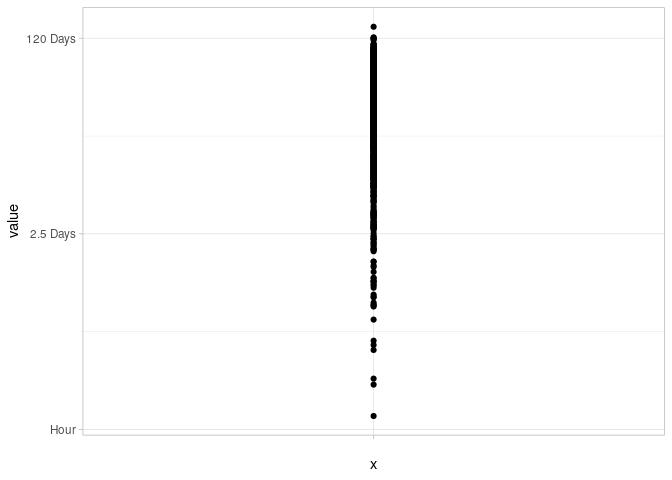

------------------------------------------------------------------------

### ggplot2 with `interaction()`

group by two columns in ggplot2

``` r
# Data frame with two continuous variables and two factors 
set.seed(0)
x <- rep(1:10, 4)
y <- c(rep(1:10, 2)+rnorm(20)/5, rep(6:15, 2) + rnorm(20)/5)
treatment <- gl(2, 20, 40, labels=letters[1:2])
replicate <- gl(2, 10, 40)
d <- data.frame(x=x, y=y, treatment=treatment, replicate=replicate)
d %>%
    ggplot(aes(x=x, y=y, colour=treatment, shape = replicate,
               group=interaction(treatment, replicate))) +
    geom_point() +
    geom_line()
```


------------------------------------------------------------------------

### spinogram

Example from David Robinson Tidy-Tuesday Screencast
(<https://youtu.be/KiqpX-gNIS4?t=1244>)

We will use `geom_area` but need to fill in the missing data with
`complete`

First, here is what it would look like if we didn’t use `complete`.

Notice the missing gaps. That is because we have missing years.

``` r
cateaceans_acquisition_by_decade <- cetaceans_raw %>%
  filter(originDate >= "1960-01-01") %>%
  count(acquisition,
        decade = 5 * (year(originDate) %/% 5))

cateaceans_acquisition_by_decade %>%
    mutate(acquisition = fct_reorder(acquisition, n, sum)) %>%
    group_by(decade) %>%
    mutate(percent = n / sum(n)) %>%
    ungroup() %>%
    ggplot(aes(decade, percent, fill = acquisition)) +
    geom_area() +
    scale_y_continuous(labels = percent_format()) +
    scale_fill_manual(values=rtools::rt_colors()) +
    theme_minimal() +
    labs(x = "year",
       y = "% of dolphins recorded")
```


This shows everything in `cateaceans_acquisition_by_decade_complete`
that is not in `cateaceans_acquisition_by_decade`. `complete` filled in
the gabs.

``` r
cateaceans_acquisition_by_decade_complete <- cateaceans_acquisition_by_decade %>%
  complete(acquisition, decade, fill = list(n = 0))
```

What did `complete()` do? Lets look at the rows that were added
(i.e. the rows in \_complete that are not in \_decade i.e. `anti_join`)?

`complete` filled in the missing combinations with a default value of
`n` = `1`

``` r
cateaceans_acquisition_by_decade_complete %>%
    anti_join(cateaceans_acquisition_by_decade, by = c("acquisition", "decade", "n")) %>%
    head(10)
```

    ## # A tibble: 10 × 3
    ##    acquisition decade     n
    ##    <chr>        <dbl> <dbl>
    ##  1 Born          1960     0
    ##  2 Born          1965     0
    ##  3 Capture       2000     0
    ##  4 Capture       2005     0
    ##  5 Capture       2010     0
    ##  6 Capture       2015     0
    ##  7 Miscarriage   1960     0
    ##  8 Miscarriage   1965     0
    ##  9 Miscarriage   1970     0
    ## 10 Miscarriage   1975     0

``` r
cateaceans_acquisition_by_decade_complete %>%
    mutate(acquisition = fct_reorder(acquisition, n, sum)) %>%
    group_by(decade) %>%
    mutate(percent = n / sum(n)) %>%
    ungroup() %>%
    ggplot(aes(decade, percent, fill = acquisition)) +
    geom_area() +
    scale_y_continuous(labels = percent_format()) +
    scale_fill_manual(values=rtools::rt_colors()) +
    theme_minimal() +
    labs(x = "year",
       y = "% of dolphins recorded")
```


------------------------------------------------------------------------

### Joy Plot

Example from David Robinson’s screencast
(<https://youtu.be/lY0YLDZhT88?t=665>)

``` r
ikea %>% select(category, name, price_usd) %>% head()
```

    ## # A tibble: 6 × 3
    ##   category      name                  price_usd
    ##   <chr>         <chr>                     <dbl>
    ## 1 Bar furniture FREKVENS                   71.6
    ## 2 Bar furniture NORDVIKEN                 269. 
    ## 3 Bar furniture NORDVIKEN / NORDVIKEN     566. 
    ## 4 Bar furniture STIG                       18.6
    ## 5 Bar furniture NORBERG                    60.8
    ## 6 Bar furniture INGOLF                     93.2

``` r
#library(ggridges)
ikea %>%
  mutate(category = glue::glue("{ category } ({ category_total })"),
         category = fct_reorder(category, price_usd)) %>%
  ggplot(aes(price_usd, category)) +
  ggridges::geom_density_ridges() +
  # geom_jitter(width = 0, height = .1, alpha = .25) +
  scale_x_log10(labels = dollar) +
  labs(x = "Price (USD)",
       y = "",
       title = "How much do items in each category cost?")
```

    ## Picking joint bandwidth of 0.165

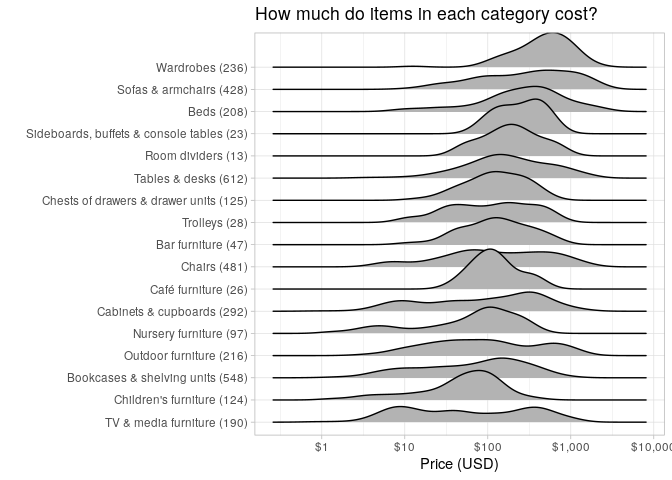

``` r
ikea %>%
  mutate(category = glue::glue("{ category } ({ category_total })"),
         category = fct_reorder(category, price_usd)) %>%
  ggplot(aes(price_usd, category, fill = other_colors)) +
  ggridges::geom_density_ridges(alpha = .5) +
  # geom_jitter(width = 0, height = .1, alpha = .25) +
  scale_x_log10(labels = dollar) +
  labs(x = "Price (USD)",
       y = "",
       title = "How much do items in each category cost?")
```

    ## Picking joint bandwidth of 0.174

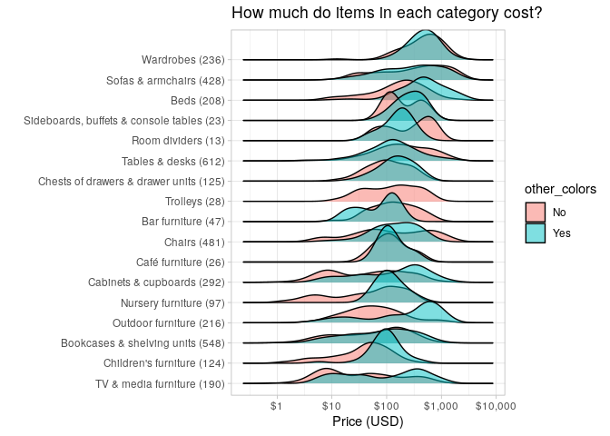

> “If we were building a predictive model, we’d probably include both
> category and other_colors”

------------------------------------------------------------------------

### Sankey

<https://github.com/davidsjoberg/ggsankey>

``` r
# devtools::install_github("davidsjoberg/ggsankey")
#library(ggsankey)

example_dat <- mtcars %>%
  ggsankey::make_long(cyl, vs, am, gear, carb) # function in ggsankey to format data correctly

ggplot(example_dat,
       aes(x = x,
           next_x = next_x, 
           node = node, 
           next_node = next_node,
           fill = factor(node))) +
    ggsankey::geom_sankey(flow.alpha = .6) +
    theme_minimal()
```


------------------------------------------------------------------------

# Advanced

## Confidence Intervals w/ t-tests

Example from David Robinson Tidy-Tuesday Screencast
(<https://youtu.be/em4FXPf4H-Y?t=1783>)

``` r
head(restaurant_inspections_by_dba, 10)
```

    ## # A tibble: 10 × 5
    ##    dba                     cuisine              locations avg_score median_score
    ##    <chr>                   <chr>                    <int>     <dbl>        <dbl>
    ##  1 DUNKIN'                 Donuts                     340      9.07          8.5
    ##  2 STARBUCKS               Café/Coffee/Tea            244      7.95          7  
    ##  3 SUBWAY                  Sandwiches                 179     11.5          10  
    ##  4 MCDONALD'S              Hamburgers                 106      9.35          9  
    ##  5 DUNKIN', BASKIN ROBBINS Donuts                      79     10.8           9  
    ##  6 POPEYES                 Chicken                     71     10.5          10  
    ##  7 MCDONALD'S              American                    60      9.33          9  
    ##  8 BURGER KING             Hamburgers                  58     10.9          10  
    ##  9 SUBWAY                  Sandwiches/Salads/M…        54     11.3           7.5
    ## 10 KENNEDY FRIED CHICKEN   Chicken                     51     15.8          13

`nest(data=-cuisine)` groups by cuisine and creates a data-frame
(tibble) out of all of the rest of the columns. That is, it `nests` the
all of the data (a data.frame) with each row corresponding to a cuisine.

Then we take each of those data.frames, and run a `t.test` of
`ave_score`.

``` r
#library(broom)
cuisine_conf_ints <- restaurant_inspections_by_dba %>%
    add_count(cuisine) %>%  # adds number of dbas for each cuisine
    filter(n > 100) %>%  # only keep cuisines that have >100 invidual DBAs
    nest(data=-cuisine) %>%  # take all columns except for cuisine and collapse the resulting data.frame into the row's cell
    mutate(num_dbas = map_int(data, ~ nrow(.))) %>%
    mutate(mean_avg_score = map_dbl(data, ~ mean(.$avg_score))) %>%
    mutate(model = map(data, ~ t.test(.$avg_score))) %>%
    mutate(model = map(model, ~ broom::tidy(.))) %>%
    unnest(model)
# note: the p-value is meaningless, the null hypothesis is that the mean is equal to 0
# we are just using this to get us confidence intervals

round_2 <- function(.x) {round(.x, 2)}
head(cuisine_conf_ints %>% mutate_if(is.numeric, round_2), 10)
```

    ## # A tibble: 10 × 12
    ##    cuisine   data   num_dbas mean_avg_score estimate statistic p.value parameter
    ##    <chr>     <list>    <dbl>          <dbl>    <dbl>     <dbl>   <dbl>     <dbl>
    ##  1 Café/Cof… <tibb…     1004          12.1     12.1       39.2       0      1003
    ##  2 Chicken   <tibb…      182          16.5     16.5       16.0       0       181
    ##  3 American  <tibb…     4699          13.5     13.5       90.5       0      4698
    ##  4 Sandwich… <tibb…      112          11.4     11.4       14.8       0       111
    ##  5 Mexican   <tibb…      721          16.1     16.1       37.6       0       720
    ##  6 Caribbean <tibb…      560          18.5     18.5       29.5       0       559
    ##  7 Pizza     <tibb…      786          14.3     14.3       38.7       0       785
    ##  8 Ice Crea… <tibb…      186           9.95     9.95      17.0       0       185
    ##  9 Bakery    <tibb…      585          13.4     13.4       31.0       0       584
    ## 10 Juice, S… <tibb…      275          12.1     12.1       22.2       0       274
    ## # … with 4 more variables: conf.low <dbl>, conf.high <dbl>, method <chr>,
    ## #   alternative <chr>

``` r
cuisine_conf_ints %>%
  mutate(cuisine = str_remove(cuisine, " \\(.*"),
         cuisine = fct_reorder(cuisine, estimate)) %>%
  ggplot(aes(estimate, cuisine)) +
  geom_point() +
  geom_errorbarh(aes(xmin = conf.low,
                     xmax = conf.high)) +
  labs(x = "Average inspection score (higher means more violations)",
       y = "Type of cuisine",
       title = "Average inspection score by type of cuisine in NYC",
       subtitle = "Each restaurant chain was counted once based on its average score")
```

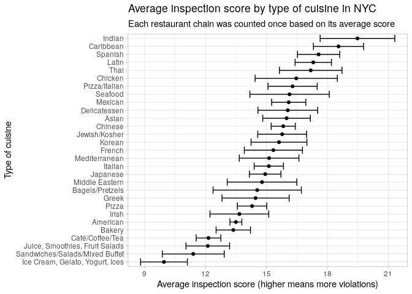

------------------------------------------------------------------------

## `optimize`

The function optimize searches the interval from lower to upper for a
minimum or maximum of the function f with respect to its first argument.

Example: flipping a coin. `dbinom` gives the probability of observing x
“successes” for a given sample size and assumed probability of observing
x.

The probability of observing `7` heads in `10` flips if the true
probability of flipping heads is `50%`, is `11.7%`. dbinom over all
values of heads for a given probability of heads (i.e. 0.5) is a
probability distribution.

``` r
dbinom(7, size=10, prob=0.5)
```

    ## [1] 0.1171875

``` r
sum(dbinom(0:10, size=10, prob=0.5))
```

    ## [1] 1

However, let’s say we want the relative **relative**
probability/plausibility of observing `7` heads over `10` flips if we
didn’t know the true probability was `0.5`

Now we would hold `7` fixed and search `prob` across a grid of possible
values.

``` r
sample_size <- 10
num_heads <- 7
probability_grid <- seq(0, 1, 0.001)
likelihood <- dbinom(num_heads, size=sample_size, prob=probability_grid)
```

But we also want to find the most plausible likelihood.

``` r
most_plausible <- optimize(function (.x) -dbinom(num_heads,
                                                 size=sample_size,
                                                 prob=.x),
                           c(0, 1),
                           tol = 0.0001)
most_plausible
```

    ## $minimum
    ## [1] 0.6999843
    ## 
    ## $objective
    ## [1] -0.2668279

This is **not** a probability distribution, it is a distribution of
relative plausibilities.

``` r
plot(probability_grid, likelihood)
abline(v = most_plausible$minimum, col='red', lwd=3)
```


See
<https://github.com/shane-kercheval/r-examples/blob/main/examples/examples.md#confidence-intervals-w-t-tests>
for a more indepth example.

------------------------------------------------------------------------

## Survival Analysis

Example from David Robinson Tidy-Tuesday Screencast
(<https://youtu.be/KiqpX-gNIS4?t=2424>)

Context is dolphins. Are some dolphins living longer than they used to?
This is hard because some dolphins in are dataset are still alive.

``` r
#library(survival)
cetaceans <- cetaceans_raw
dolphin_survival <- cetaceans %>%
  filter(status %in% c("Alive", "Died")) %>%
         # deathYear needs a value even if they didn't die (status will indicate if they did die)
  mutate(deathYear = ifelse(status == "Alive", 2017, year(statusDate)),
         status = ifelse(status == "Alive", 0, 1),  # note: alive == 0
         age = deathYear - birthYear) %>%
  filter(!is.na(deathYear)) %>%
  select(birthYear, deathYear, status, sex, age, acquisition, species) %>%
  filter(deathYear >= birthYear) %>%
  filter(sex != "U")
head(dolphin_survival)
```

    ## # A tibble: 6 × 7
    ##   birthYear deathYear status sex     age acquisition species   
    ##       <dbl>     <dbl>  <dbl> <chr> <dbl> <chr>       <chr>     
    ## 1      1989      2017      0 F        28 Born        Bottlenose
    ## 2      1973      2017      0 F        44 Born        Bottlenose
    ## 3      1978      2017      0 M        39 Born        Bottlenose
    ## 4      1979      2017      0 F        38 Born        Bottlenose
    ## 5      1979      2017      0 M        38 Born        Bottlenose
    ## 6      1980      2017      0 F        37 Born        Bottlenose

`status` is `0` if `alive`, `1` if `died`

So the followin gives the median age of death, with confidence
intervals.

``` r
model <- survival::survfit(survival::Surv(age, status) ~ 1, dolphin_survival)
model
```

    ## Call: survfit(formula = survival::Surv(age, status) ~ 1, data = dolphin_survival)
    ## 
    ##       n  events  median 0.95LCL 0.95UCL 
    ##    1389     933      17      16      18

``` r
broom::tidy(model) %>%
  ggplot(aes(time, estimate)) +
  geom_line() +
  geom_ribbon(aes(ymin = conf.low, ymax = conf.high), alpha = .2) +
  scale_y_continuous(labels = percent_format()) +
  labs(y = "Estimated % survival",
       x = "Age of Dolphin")
```

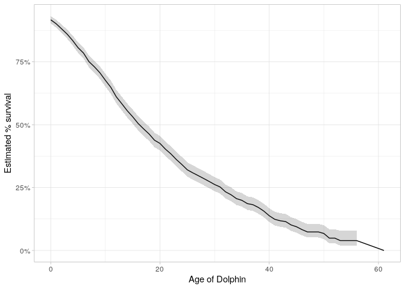

The followin gives the median age of death, by sex, with confidence
intervals.

``` r
model <- survival::survfit(survival::Surv(age, status) ~ sex, dolphin_survival)
model
```

    ## Call: survfit(formula = survival::Surv(age, status) ~ sex, data = dolphin_survival)
    ## 
    ##         n events median 0.95LCL 0.95UCL
    ## sex=F 744    504     18      16      20
    ## sex=M 645    429     16      14      18

``` r
broom::tidy(model) %>%
  ggplot(aes(time, estimate, color = strata)) +
  geom_line() +
  geom_ribbon(aes(ymin = conf.low, ymax = conf.high), alpha = .2) +
  scale_y_continuous(labels = percent_format()) +
  labs(y = "Estimated % survival",
       x = "Age of Dolphin")
```


How can we tell if sex is actually meaningful (i.e. the survival rate is
actual different and not due to chance?)

We can use a `Cox proportional hazards regression model`

``` r
survival::coxph(survival::Surv(age, status) ~ sex, dolphin_survival) %>%
  broom::tidy()
```

    ## # A tibble: 1 × 5
    ##   term  estimate std.error statistic p.value
    ##   <chr>    <dbl>     <dbl>     <dbl>   <dbl>
    ## 1 sexM    0.0982    0.0659      1.49   0.136

p.value is not statistically significant (confience intervals include 0)
so we can say that there is an actual difference.

We can do the same thing for acquisition.

``` r
model <- survival::survfit(survival::Surv(age, status) ~ acquisition, dolphin_survival)
broom::tidy(model) %>%
  filter(strata != "acquisition=Unknown") %>%
  ggplot(aes(time, estimate, color = strata)) +
  geom_line() +
  geom_ribbon(aes(ymin = conf.low, ymax = conf.high), alpha = .2) +
  scale_y_continuous(labels = percent_format()) +
  labs(y = "Estimated % survival",
       x = "Age of Dolphin")
```

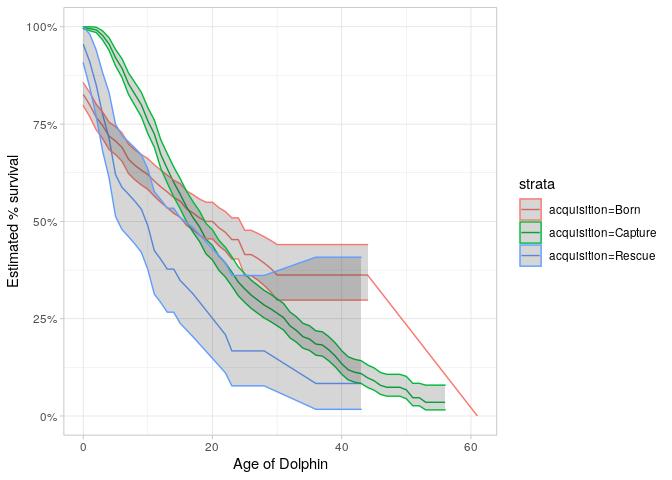

If we do `coxph` it looks like the holdout group is `Born` and each
category is being compared to that. `Capture` is not statistically
significant, but `Rescue` and `Unknown` are.

``` r
survival::coxph(survival::Surv(age, status) ~ acquisition, dolphin_survival) %>%
  broom::tidy()
```

    ## # A tibble: 3 × 5
    ##   term               estimate std.error statistic p.value
    ##   <chr>                 <dbl>     <dbl>     <dbl>   <dbl>
    ## 1 acquisitionCapture  -0.0732    0.0753    -0.972 0.331  
    ## 2 acquisitionRescue    0.489     0.162      3.02  0.00256
    ## 3 acquisitionUnknown   0.293     0.148      1.98  0.0476

## Pairwise Correlation

In this case, we are finding correlations of `lifeExp` among `countries`
across/by `year`. So, which countries tend to have similar
life-expectencies over time (i.e. by year)?

``` r
#library(gapminder)
#library(widyr)

life_expectency_pairwise_cor <- gapminder::gapminder %>% 
         filter(continent == 'Americas') %>%  # filter for one continent just so we can fit into a single graph.
         # add_count(country) %>%
         widyr::pairwise_cor(country, year, lifeExp, sort = TRUE)

head(life_expectency_pairwise_cor)
```

    ## # A tibble: 6 × 3
    ##   item1     item2     correlation
    ##   <fct>     <fct>           <dbl>
    ## 1 Nicaragua Brazil          0.999
    ## 2 Brazil    Nicaragua       0.999
    ## 3 Nicaragua Guatemala       0.999
    ## 4 Guatemala Nicaragua       0.999
    ## 5 Guatemala Brazil          0.999
    ## 6 Brazil    Guatemala       0.999

``` r
life_expectency_pairwise_cor %>%
    filter(item1 %in% c('United States', 'Mexico', 'Canada')) %>%
    ggplot(aes(x=correlation, y=tidytext::reorder_within(x=item2, by=correlation, within=item1))) +
    geom_col() +
    tidytext::scale_y_reordered() +
    facet_wrap(~item1, scales='free') +
    labs(title="Countries with Similar Life-Expectencies to US, Mexico, Canada",
         x='Correlation of Life-Expectencies',
         y=NULL)
```


``` r
life_expectency_pairwise_cor %>%
    mutate(item1=factor(item1, ordered = TRUE),
           item2=factor(item2, ordered = TRUE)) %>%
    filter(item1 < item2) %>%
    ggplot(aes(item1, item2, fill= correlation)) +
    geom_tile() +
    scale_fill_gradient(low="white", high="blue") +
    theme(axis.text.x=element_text(angle=90, hjust=1)) +
    labs(title='Which countries tend to have similar life-expectencies, over time?',
         subtitle = '(Americas)',
         x=NULL,
         y=NULL)
```


``` r
life_expectency_pairwise_cor <- life_expectency_pairwise_cor %>%
    mutate(item1=factor(item1),
           item2=factor(item2)) %>%
    arrange(item2) %>%
    pivot_wider(names_from = item2, values_from = correlation) %>%
    arrange(item1)

life_expectency_pairwise_cor[1:5, 1:5]
```

    ## # A tibble: 5 × 5
    ##   item1     Argentina Bolivia Brazil Canada
    ##   <fct>         <dbl>   <dbl>  <dbl>  <dbl>
    ## 1 Argentina    NA       0.993  0.997  0.997
    ## 2 Bolivia       0.993  NA      0.989  0.994
    ## 3 Brazil        0.997   0.989 NA      0.998
    ## 4 Canada        0.997   0.994  0.998 NA    
    ## 5 Chile         0.991   0.990  0.992  0.994

## `ebbr` package: Empirical Bayes on the Binomial in R

> Methods for empirical Bayes shrinkage and estimation on data with many
> observations of success/total counts.

<https://github.com/dgrtwo/ebbr>

Examples from
`Robinson, David. Introduction to Empirical Bayes: Examples from Baseball Statistics . Kindle Edition.`

    ## # A tibble: 6 × 5
    ##   playerID  name            hits at_bats batting_average
    ##   <chr>     <chr>          <int>   <int>           <dbl>
    ## 1 aaronha01 Hank Aaron      3771   12364          0.305 
    ## 2 aaronto01 Tommie Aaron     216     944          0.229 
    ## 3 abadan01  Andy Abad          2      21          0.0952
    ## 4 abadijo01 John Abadie       11      49          0.224 
    ## 5 abbated01 Ed Abbaticchio   772    3044          0.254 
    ## 6 abbeych01 Charlie Abbey    493    1756          0.281

> In Chapter 3, we noticed that the distribution of player batting
> averages looked roughly like a beta distribution (Figure 11.1). We
> thus wanted to estimate the beta prior for the overall dataset, which
> is the first step of empirical Bayes analysis. (Robinson, David.
> Introduction to Empirical Bayes: Examples from Baseball Statistics .
> Kindle Edition.)

``` r
career %>%
    filter(at_bats > 500) %>%
    ggplot(aes(x=batting_average)) +
    geom_histogram(bins = 50) +
    labs(title='Batting Average Distribution of Players with >500 At-Bats')
```


### Prior Distribution

``` r
#devtools::install_github("dgrtwo/ebbr")
#library(ebbr)
prior <- career %>%
  filter(at_bats >= 500) %>%
  ebbr::ebb_fit_prior(hits, at_bats)

prior
```

    ## Empirical Bayes binomial fit with method mle 
    ## Parameters:
    ## # A tibble: 1 × 2
    ##   alpha  beta
    ##   <dbl> <dbl>
    ## 1  97.9  278.

I’m not sure how `broom::tidy(prior)$mean` is calculated.

``` r
as.numeric(broom::tidy(prior)$mean)
```

    ## [1] 0.2602605

``` r
career %>%
    filter(at_bats >= 500) %>%
    summarise(sum(hits) / sum(at_bats))
```

    ## # A tibble: 1 × 1
    ##   `sum(hits)/sum(at_bats)`
    ##                      <dbl>
    ## 1                    0.269

``` r
career %>%
    filter(at_bats >= 500) %>%
    summarise(mean(batting_average))
```

    ## # A tibble: 1 × 1
    ##   `mean(batting_average)`
    ##                     <dbl>
    ## 1                   0.259

``` r
career %>%
    filter(at_bats >= 500) %>%
    summarise(median(batting_average))
```

    ## # A tibble: 1 × 1
    ##   `median(batting_average)`
    ##                       <dbl>
    ## 1                     0.258

``` r
beta_distribution <- data.frame(x=seq(0.17,0.35,0.001)) %>%
    mutate(y=dbeta(x, prior$parameters$alpha, prior$parameters$beta))

beta_distribution %>%
    ggplot(aes(x=x, y=y)) +
    geom_line() +
    labs(title="Beta Distribution using Alpha/Beta from Calculated Priors",
         subtitle = glue::glue("({ round(prior$parameters$alpha, 2) }, { round(prior$parameters$beta, 2) })"))
```


``` r
career %>%
    filter(at_bats > 500) %>%
    ggplot(aes(x=batting_average)) +
    geom_histogram(bins = 50) +
    geom_line(data=beta_distribution, aes(x=x, y=y*17), color='red') +
    labs(title="Batting Average Distribution of Players with >500 At-Bats",
         subtitle=glue::glue("Red Line is Beta Distribution using Alpha/Beta from Calculated Priors ({ round(prior$parameters$alpha, 2) }, { round(prior$parameters$beta, 2) })"))
```


### Updating Observations based on Priors

> The second step of empirical Bayes analysis is updating each
> observation based on the overall statistical model. Based on the
> philosophy of the broom package, this is achieved with the augment()
> function. (Robinson, David. Introduction to Empirical Bayes: Examples
> from Baseball Statistics . Kindle Edition.)

``` r
head(ebbr::augment(prior, data = career))
```

    ## # A tibble: 6 × 11
    ##   playerID  name      hits at_bats batting_average .alpha1 .beta1 .fitted   .raw
    ##   <chr>     <chr>    <int>   <int>           <dbl>   <dbl>  <dbl>   <dbl>  <dbl>
    ## 1 aaronha01 Hank Aa…  3771   12364          0.305   3869.   8871.   0.304 0.305 
    ## 2 aaronto01 Tommie …   216     944          0.229    314.   1006.   0.238 0.229 
    ## 3 abadan01  Andy Ab…     2      21          0.0952    99.9   297.   0.252 0.0952
    ## 4 abadijo01 John Ab…    11      49          0.224    109.    316.   0.256 0.224 
    ## 5 abbated01 Ed Abba…   772    3044          0.254    870.   2550.   0.254 0.254 
    ## 6 abbeych01 Charlie…   493    1756          0.281    591.   1541.   0.277 0.281 
    ## # … with 2 more variables: .low <dbl>, .high <dbl>

### `add_ebb_estimate`

> Notice we’ve now added several columns to the original data, each
> beginning with . (which is a convention of the augment verb to avoid
> rewriting existing columns). We have the .alpha1 and .beta1 columns as
> the parameters for each player’s posterior distribution, as well as
> .fitted representing the new posterior mean (the “shrunken average”).
> We often want to run these two steps in sequence: estimating a model,
> then using it as a prior for each observation. The ebbr package
> provides a shortcut, combining them into one step with
> add_ebb_estimate(). (Robinson, David. Introduction to Empirical Bayes:
> Examples from Baseball Statistics . Kindle Edition.)

``` r
eb_career <- career %>%
  ebbr::add_ebb_estimate(hits, at_bats,
                   prior_subset = at_bats >= 500)
```

``` r
all(eb_career$batting_average == eb_career$.raw)
```

    ## [1] TRUE

> This \[the graph below\] was one of the most important visualizations
> in Chapter 3. I like how it captures what empirical Bayes estimation
> is doing: moving all batting averages towards the prior mean (the
> dashed red line), but moving them less if there is a lot of
> information about that player (high at_bats). (Robinson, David.
> Introduction to Empirical Bayes: Examples from Baseball Statistics .
> Kindle Edition.)

The red line represents points where the raw batting average and the
estimated batting average are identical.

The dashed red line represents the “prior mean” which is similar, but
doesn’t seem to be exactly, the average of the batting averages (of
people with \>= 500 at-bats).

So for example, look at the dots/people to the left of the graph. These
are people that had very few at-bats (dark color), had a very low
batting average (near 0 on x-axis), but we shifted from their raw
batting average to the prior mean batting average (i.e. shifted from
solid red line to dashed red line).

The people with a lot of at bats, tend to have estimated batting average
that is very close to the raw batting average.

``` r
eb_career %>%
    ggplot(aes(x=.raw, y=.fitted, color = at_bats)) +
    geom_point() +
    geom_abline(color = "red") +
    scale_color_continuous(trans = "log", breaks = c(1, 10, 100, 1000)) +
    geom_hline(yintercept = broom::tidy(prior)$mean, color = "red", lty = 2) +
    coord_cartesian(xlim = c(0, .6), ylim=c(0, 0.6)) +
    scale_x_continuous(breaks = pretty_breaks()) +
    scale_y_continuous(breaks = pretty_breaks()) +
    labs(x = "Raw batting average",
       y = "Shrunken batting average")
```

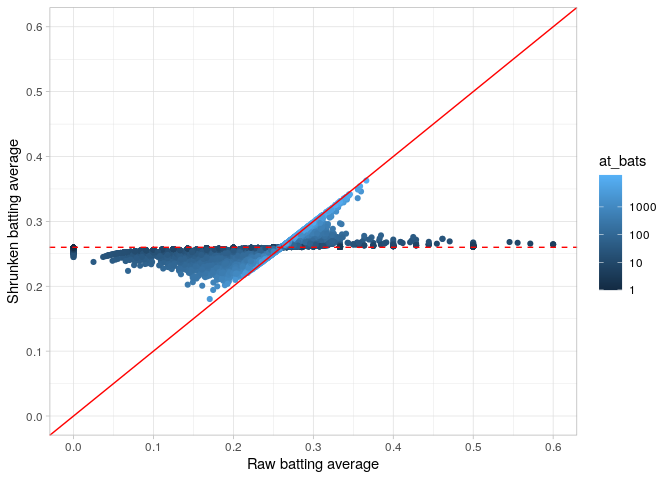

``` r
eb_career %>%
    filter(at_bats > 10) %>%
    rename(Raw = .raw, Shrunken = .fitted) %>%
    gather(type, estimate, Raw, Shrunken) %>%
    ggplot(aes(at_bats, estimate)) +
    geom_point() +
    geom_smooth(method='lm') +
    geom_hline(yintercept = broom::tidy(prior)$mean, color = "red", lty = 2) +
    facet_wrap(~ type) +
    scale_x_log10()
```

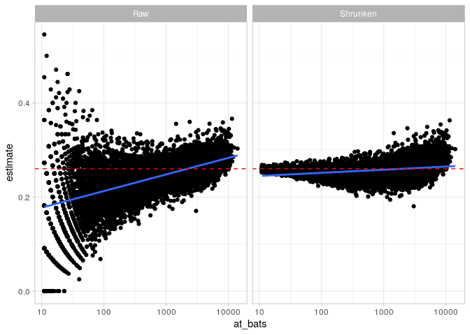

This graph shows that we are shrinking people with a low number of at
bats toward the prior mean (red dotted line) rather than towards the
fitted regression line, which shows that the more at-bats someone has,
the higher their batting-average tends to be (the better you are the
more at bats you get). We’ll solve this below, but for now, this means
that, of the people who have very few at bats, we’re likely
over-estimating their ability/batting-average.

``` r
eb_career %>%
    head(10) %>%
    mutate(name = reorder(name, .fitted)) %>%
    ggplot(aes(x=.fitted, y=name)) +
    geom_point() +
    geom_errorbarh(aes(xmin = .low, xmax = .high)) +
    geom_point(aes(x=.raw), color='red') +
    geom_text(aes(x=.raw, label=glue::glue("({ hits } / { at_bats })")), vjust=-0.7, size=3) +
    labs(x = "Estimated batting average (w/ 95% confidence interval)",
         y = "Player")
```


### Hierarchical Modeling

> In Chapters 7 and 8, we examined how this beta-binomial model may not
> be appropriate, because of the relationship between a player’s at-bats
> and their batting average. Good batters tend to have long careers,
> while poor batters may retire quickly. (Robinson, David. Introduction
> to Empirical Bayes: Examples from Baseball Statistics . Kindle
> Edition.)

This means that, in the previous estimates and graphs, it’s not
appropriate to move people who have very few bats (and for example very
low batting averages), all the way up to the prior mean batting average
(`0.2602605`). We should assume (had they keep getting more and more
at-bats) that they would have a lower batting average than average.

``` r
career %>%
  filter(at_bats >= 10) %>%
  ggplot(aes(at_bats, hits / at_bats)) +
  geom_point() +
  geom_smooth(method = "lm") +
  scale_x_log10()
```


This graphs shows that the more at-bats someone has, the better their
batting average tends to be, which makes sense. This is the line that we
should be pushing people towards who have very few at bats, rather than
the dotted red line above.

> We solved this by fitting a prior that depended on AB, through the
> process of beta-binomial regression. The add_ebb_estimate() function
> from ebbr offers this option, by setting method = “gamlss” and
> providing a formula to mu_predictors.3 (Robinson, David. Introduction
> to Empirical Bayes: Examples from Baseball Statistics . Kindle
> Edition.)

Obviously, now we do not want to filter our prior based on \>=500
at-bats because we are using at-bats directly in our estimation.

Code is Failing… Fix TBD

    eb_career_ab <- career %>%
        ebbr::add_ebb_estimate(hits, at_bats, method = "gamlss",
                               mu_predictors = ~ log10(at_bats))
    head(eb_career_ab)

Now, we are shrinking the players with fewer at-bats to a lower batting
average.

Now, Andy Abad and Dan Abbot have much lower estimated batting-averages
compared to the graph above. In the graph above Dan Abbot was estimated
to have a slightly higher batting average than Kurt Abbott, who has many
more at-bats than Dan. Now, Dan is estimated to have a much lower
batting-avearge.

An important note is that this will not work for rookies, it is only
meant to assess the players’ entire career.

<http://varianceexplained.org/r/beta_binomial_baseball/>

Question in comments

> About this post; don’t you think that letting the estimate being
> affected by AB biases the estimate for young players who have low AB
> because they are starting and not because are not playing? Would it be
> interesting to use something like mean of AB per game?

Answer by Dave

> Your question raises a very important issue- I bring it up in the
> following post in this series (<http://varianceexplained.or>…. In
> short you’re 100% right that this doesn’t work for predicting future
> performance of rookies without more adjustments. “One important aspect
> of this prediction is that it won’t be useful when we’ve just hired a
> “rookie” player, and we’re wondering what his batting average will be.
> This observed variable ABAB is based on a player’s entire career, such
> that a low number is evidence that a player didn’t have much of a
> chance to bat. (If we wanted to make a prediction, we’d have to
> consider the distribution of possible ABAB’s the player could end up
> with and integrate over that, which is beyond the scope of this
> post)."

### Hypothesis Testing

> For example, we wanted to get a posterior probability for the
> statement “this player’s true batting average is greater than .300”,
> so that we could construct a “Hall of Fame” of such players.
> (Robinson, David. Introduction to Empirical Bayes: Examples from
> Baseball Statistics . Kindle Edition.)

> `.pep`: the posterior error probability- the probability that this
> player’s true batting average is less than .3. `.qvalue`: the q-value,
> which corrects for multiple testing by controlling for false discovery
> rate (FDR). Allowing players with a q-value `below .05` would mean
> only 5% of the ones included would be false discoveries. (Robinson,
> David. Introduction to Empirical Bayes: Examples from Baseball
> Statistics . Kindle Edition.)

#### Player-Player AB-test

> Chapter 6 discussed the case where instead of comparing each
> observation to a single threshold (like .300) we want to compare to
> another player’s posterior distribution. We noted that this is similar
> to the problem of “A/B testing”, where we might be comparing two
> clickthrough rates, each represented by successes / total. (Robinson,
> David. Introduction to Empirical Bayes: Examples from Baseball
> Statistics . Kindle Edition.)

> Just like the one-sample test, the function has added .pep and .qvalue
> columns. From this we can see a few players who we’re extremely
> confident are better than Piazza. (Robinson, David. Introduction to
> Empirical Bayes: Examples from Baseball Statistics . Kindle Edition.)

## Tidy Text

``` r
head(mr_boston)
```

    ## # A tibble: 6 × 6
    ##   name            category          row_id ingredient_number ingredient  measure
    ##   <chr>           <chr>              <dbl>             <dbl> <chr>       <chr>  
    ## 1 Gauguin         Cocktail Classics      1                 1 Light Rum   2 oz   
    ## 2 Gauguin         Cocktail Classics      1                 2 Passion Fr… 1 oz   
    ## 3 Gauguin         Cocktail Classics      1                 3 Lemon Juice 1 oz   
    ## 4 Gauguin         Cocktail Classics      1                 4 Lime Juice  1 oz   
    ## 5 Fort Lauderdale Cocktail Classics      2                 1 Light Rum   1 1/2 …
    ## 6 Fort Lauderdale Cocktail Classics      2                 2 Sweet Verm… 1/2 oz

## Pairwise Correlations (again)

Example from David Robinson screencase
(<https://youtu.be/EC0SVkFB2OU?t=1234>)

``` r
#library(widyr)
#library(tidytext)
ingredient_pairs <- mr_boston %>%
  add_count(ingredient) %>%
  filter(n >= 10) %>%
  widyr::pairwise_cor(ingredient, name, sort = TRUE)

head(ingredient_pairs)
```

    ## # A tibble: 6 × 3
    ##   item1                  item2                  correlation
    ##   <chr>                  <chr>                        <dbl>
    ## 1 Juice of a Lemon       Powdered Sugar               0.462
    ## 2 Powdered Sugar         Juice of a Lemon             0.462
    ## 3 Coffee-flavored brandy half-and-half                0.375
    ## 4 half-and-half          Coffee-flavored brandy       0.375
    ## 5 Whole Egg              Powdered Sugar               0.365
    ## 6 Powdered Sugar         Whole Egg                    0.365

``` r
ingredient_pairs %>%
  filter(item1 %in% c("Gin", "Tequila", "Absinthe",
                      "Mezcal", "Bourbon whiskey",
                      "Vodka")) %>%
  group_by(item1) %>%
  top_n(10, correlation) %>%
  mutate(item2 = tidytext::reorder_within(item2, correlation, item1)) %>%
  ggplot(aes(correlation, item2)) +
  geom_col() +
  facet_wrap(~ item1, scales = "free_y") +
  tidytext::scale_y_reordered() +
  labs(title = "What ingredients are most correlated with particular ingredients?")
```

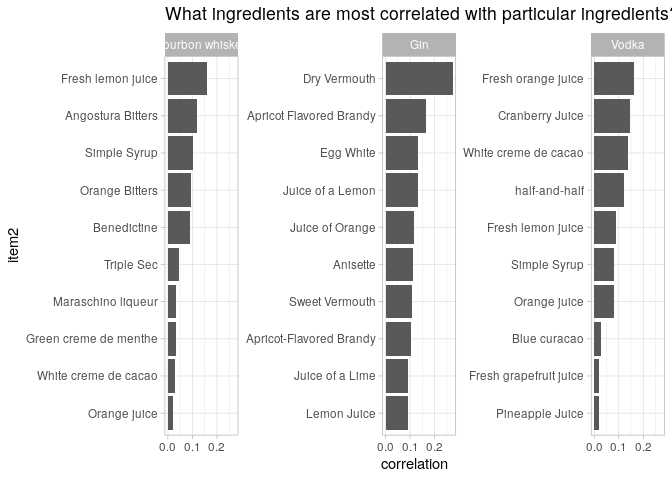

## Network Graph

``` r
mr_boston_parsed <- mr_boston %>%
    extract(measure, "amount", regex = "(.*) oz", remove = FALSE) %>%
    extract(amount, "ones", regex = "(^\\d+$|^\\d+ )", convert = TRUE, remove = FALSE) %>%
    extract(amount, c("numerator", "denominator"),
          regex = "(\\d+)\\/(\\d+)", convert = TRUE, remove = FALSE) %>%
    replace_na(list(ones = 0, numerator = 0, denominator = 1)) %>%
    mutate(oz = ones + numerator / denominator,
         oz = na_if(oz, 0))


ingredients_summarized <- mr_boston_parsed %>%
    # first, groupr by drink name so that we can create a percentile (based off of ingredient number) for all ingrediates within their drink
    group_by(name) %>%
    mutate(percentile = row_number() / n()) %>%
    ungroup() %>%
    # now group by ingredient.
    group_by(ingredient) %>%
    summarize(n = n(),
            n_with_oz = sum(!is.na(oz)),
            avg_position = mean(percentile),
            avg_serving = mean(oz, na.rm = TRUE)) %>%
    arrange(desc(n))

head(ingredients_summarized)
```

    ## # A tibble: 6 × 5
    ##   ingredient            n n_with_oz avg_position avg_serving
    ##   <chr>             <int>     <int>        <dbl>       <dbl>
    ## 1 Gin                 176       176        0.577       1.35 
    ## 2 Fresh lemon juice   138       138        0.728       0.696
    ## 3 Simple Syrup        115       115        0.810       0.635
    ## 4 Vodka               114       114        0.351       1.41 
    ## 5 Light Rum           113       113        0.396       1.33 
    ## 6 Dry Vermouth        107       107        0.662       0.806

`avg_position` is the step number that the ingredient, on average, shows
up when mixing the drink.

<https://youtu.be/EC0SVkFB2OU?t=1269>

``` r
#library(ggraph)
#library(igraph)
top_cors <- ingredient_pairs %>% head(150)  # most correlated cocktail ingrediants
ingredient_info <- ingredients_summarized %>% filter(ingredient %in% top_cors$item1)

set.seed(2)
top_cors %>%
  igraph::graph_from_data_frame(vertices = ingredient_info) %>%
  ggraph::ggraph(layout = "fr") +
  ggraph::geom_edge_link() +
  ggraph::geom_node_text(aes(label = name), repel = TRUE) +
  ggraph::geom_node_point(aes(size = 1.1 * n)) +
  ggraph::geom_node_point(aes(size = n, color = avg_position)) +
  scale_color_gradient2(low = "red", high = "blue", midpoint = .5,
                        labels = scales::percent_format()) +
  labs(size = "# of recipes",
       color = "Avg position in drink",
       title = "The constellations of cocktail ingredients",
       subtitle = "Connected ingredients tend to appear in the same recipes. Red ingredients are early in the recipe, blue tend to be later")
```

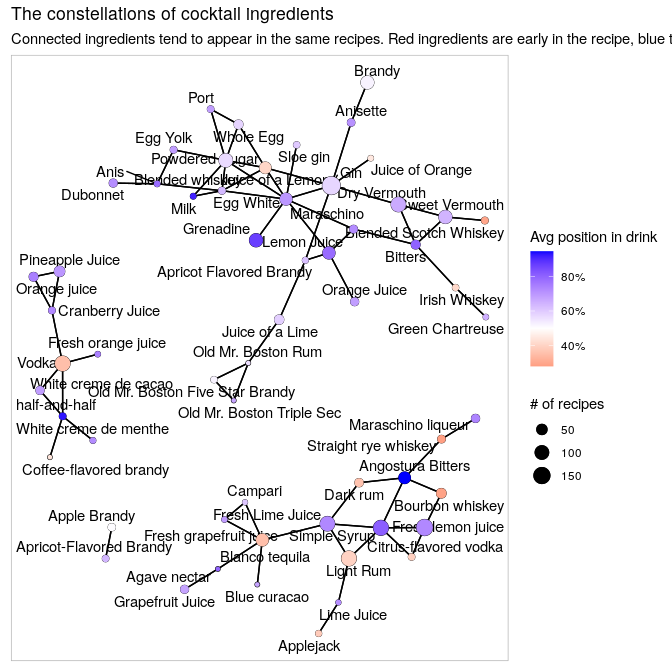

## Singular Value Decomposition (PCA)

<https://youtu.be/EC0SVkFB2OU?t=3009>

What dimensions drive a lot of the variation among cocktails?

Here we have broken the data down by dimensions.

What pairs of ingrediants would never appear in the same ‘type’ of
cocktail together?

This would look better if we removed duplicate ingrediants (e.g. combine
`Fresh lemon juice` and `Juice of a Lemon`)

``` r
ingredient_svd <- mr_boston %>%
    distinct(ingredient, name) %>%
    mutate(value = 1) %>%
    # we're interested in components by intgrediate across name
    widyr::widely_svd(ingredient, name, value)

ingredient_svd %>%
    filter(dimension > 1, 
           dimension <= 5) %>%
    mutate(dimension = paste0("PC", dimension)) %>%
    group_by(dimension) %>%
    top_n(16, abs(value)) %>%
    mutate(ingredient = tidytext::reorder_within(ingredient, value, dimension)) %>%
    ggplot(aes(value, ingredient, fill = value > 0)) +
    geom_col(show.legend = FALSE) +
    tidytext::scale_y_reordered() +
    facet_wrap(~ dimension, scales = "free_y") +
    labs(x = "Principal component value",
         y = "Ingredient",
         title = "What are the sources of variation in ingredients?")
```


``` r
recipe_svd <- mr_boston %>%
  distinct(name, ingredient) %>%
  mutate(value = 1) %>%
  widyr::widely_svd(name, ingredient, value)

recipe_svd %>%
  filter(dimension > 1, dimension <= 5) %>%
  mutate(dimension = paste0("PC", dimension)) %>%
  group_by(dimension) %>%
  top_n(16, abs(value)) %>%
  mutate(recipe = tidytext::reorder_within(name, value, dimension)) %>%
  ggplot(aes(value, recipe, fill = value > 0)) +
  geom_col(show.legend = FALSE) +
  tidytext::scale_y_reordered() +
  facet_wrap(~ dimension, scales = "free_y") +
  labs(x = "Principal component value",
       y = "Ingredient",
       title = "What are the sources of variation in recipes?")
```

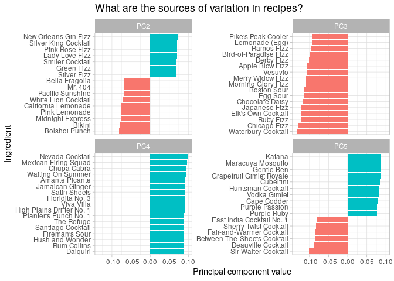

## Logistic Regression

``` r
head(beer_awards)
```

    ## # A tibble: 6 × 7
    ##   medal  beer_name            brewery         city     state category       year
    ##   <fct>  <chr>                <chr>           <chr>    <chr> <chr>         <dbl>
    ## 1 Gold   Volksbier Vienna     Wibby Brewing   Longmont CO    American Amb…  2020
    ## 2 Silver Oktoberfest          Founders Brewi… Grand R… MI    American Amb…  2020
    ## 3 Bronze Amber Lager          Skipping Rock … Staunton VA    American Amb…  2020
    ## 4 Gold   Lager at World's End Epidemic Ales   Concord  CA    American Lag…  2020
    ## 5 Silver Seismic Tremor       Seismic Brewin… Santa R… CA    American Lag…  2020
    ## 6 Bronze Lite Thinking        Pollyanna Brew… Lemont   IL    American Lag…  2020

``` r
awards_by_year_state <- beer_awards %>%
  add_count(year, name = "total_yearly_awards") %>%
  mutate(state = fct_lump(state, 9)) %>%
  count(year, state, total_yearly_awards, name='awards_won', sort = TRUE) %>%
  mutate(pct_awards_won = awards_won / total_yearly_awards,
         awards_not_won = total_yearly_awards - awards_won)

head(awards_by_year_state)
```

    ## # A tibble: 6 × 6
    ##    year state total_yearly_awards awards_won pct_awards_won awards_not_won
    ##   <dbl> <fct>               <int>      <int>          <dbl>          <int>
    ## 1  2019 Other                 257        105          0.409            152
    ## 2  2018 Other                 246         98          0.398            148
    ## 3  2017 Other                 246         96          0.390            150
    ## 4  2020 Other                 218         84          0.385            134
    ## 5  2016 Other                 237         83          0.350            154
    ## 6  2014 Other                 213         78          0.366            135

``` r
awards_by_year_state %>%
  filter(state != "Other") %>%
  ggplot(aes(year, pct_awards_won, color = state)) +
  geom_line() +
  expand_limits(y = 0) +
  scale_y_continuous(labels = percent) +
  facet_wrap(~ state)
```

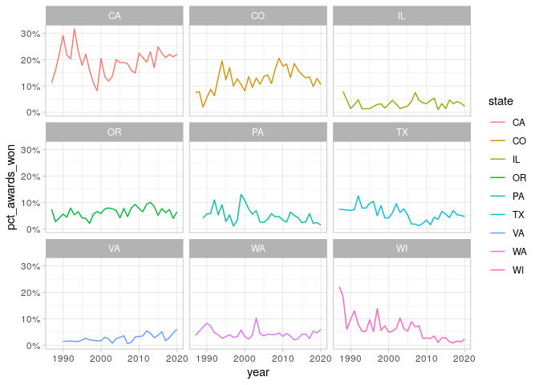

How has the probability of successes vs failtures (i.e. awards vs not
awards) changed over time?

See
<https://github.com/shane-kercheval/r-examples/blob/main/examples/logistic_regression/logistic_regression.md>

> Logistic Regression is a linear model for log odds. The odds of an
> event are the probability that it happens over the probability that it
> doesn’t.

> `log[ p / (1-p) ] = B0 + B1X1 + B2X2 + ... + error`

`log( succeses / failures)` i.e. `log( awards_won / awards_not_won)`

``` r
wi_model <- awards_by_year_state %>%
    filter(state == "WI") %>%
    # cbind(successes, failures)
    glm(cbind(awards_won, awards_not_won) ~ year,
      data = .,
      family = "binomial")

wi_model %>% summary()
```

    ## 
    ## Call:
    ## glm(formula = cbind(awards_won, awards_not_won) ~ year, family = "binomial", 
    ##     data = .)
    ## 
    ## Deviance Residuals: 
    ##     Min       1Q   Median       3Q      Max  
    ## -1.8307  -0.9103  -0.2001   0.4765   2.4040  
    ## 
    ## Coefficients:
    ##               Estimate Std. Error z value            Pr(>|z|)    
    ## (Intercept) 133.006996  14.904298   8.924 <0.0000000000000002 ***
    ## year         -0.067822   0.007441  -9.115 <0.0000000000000002 ***
    ## ---
    ## Signif. codes:  0 '***' 0.001 '**' 0.01 '*' 0.05 '.' 0.1 ' ' 1
    ## 
    ## (Dispersion parameter for binomial family taken to be 1)
    ## 
    ##     Null deviance: 130.098  on 33  degrees of freedom
    ## Residual deviance:  46.238  on 32  degrees of freedom
    ## AIC: 172.72
    ## 
    ## Number of Fisher Scoring iterations: 4

What do the coefficients mean?

> This is a log-odds ratio. So this is how much the log-odds ratio
> changes each year. (<https://youtu.be/BV_afpCDQ70?t=3001>)

``` r
(.log_odds <- coef(wi_model)['year'])
```

    ##        year 
    ## -0.06782239

``` r
(.odds <- -1 / exp(.log_odds))
```

    ##      year 
    ## -1.070175

-   <http://had.co.nz/notes/modelling/logistic-regression.html>
-   <https://www.flutterbys.com.au/stats/tut/tut10.5a.html>

``` r
#library(broom)
models_by_state <- awards_by_year_state %>%
  filter(state != "Other") %>%
  mutate(state = state.name[match(state, state.abb)]) %>%
  group_by(state) %>%
  summarize(model = list(glm(cbind(awards_won, awards_not_won) ~ year, family = "binomial"))) %>%
  mutate(tidied = map(model, broom::tidy, conf.int = TRUE)) %>%
  unnest(tidied) %>%
  filter(term == "year") %>%
  mutate(#p.value = format.pval(p.value),
         state = fct_reorder(state, estimate))

models_by_state %>% mutate_if(is.numeric, function(.x) {round(.x, 3)})
```

    ## # A tibble: 9 × 9
    ##   state        model  term  estimate std.error statistic p.value conf.low conf.high
    ##   <fct>        <list> <chr>    <dbl>     <dbl>     <dbl>   <dbl>    <dbl>     <dbl>
    ## 1 California   <glm>  year     0.008     0.004     1.93    0.054    0         0.016
    ## 2 Colorado     <glm>  year     0.011     0.005     2.30    0.022    0.002     0.021
    ## 3 Illinois     <glm>  year     0.005     0.01      0.454   0.65    -0.015     0.025
    ## 4 Oregon       <glm>  year     0.009     0.007     1.39    0.165   -0.004     0.023
    ## 5 Pennsylvania <glm>  year    -0.033     0.008    -4.19    0       -0.049    -0.018
    ## 6 Texas        <glm>  year    -0.022     0.008    -2.94    0.003   -0.037    -0.007
    ## 7 Virginia     <glm>  year     0.043     0.013     3.37    0.001    0.018     0.068
    ## 8 Washington   <glm>  year    -0.006     0.009    -0.671   0.502   -0.023     0.011
    ## 9 Wisconsin    <glm>  year    -0.068     0.007    -9.12    0       -0.082    -0.053

``` r
models_by_state %>%
  ggplot(aes(estimate, state, color=p.value < .05)) +
  geom_point() +
  geom_vline(xintercept = 0, lty = 2) +
  geom_errorbarh(aes(xmin = conf.low, xmax = conf.high), height = .2) +
  labs(x = "Estimated slope",
       title = "Which states become more or less frequent medal winners?",
       y = "")
```

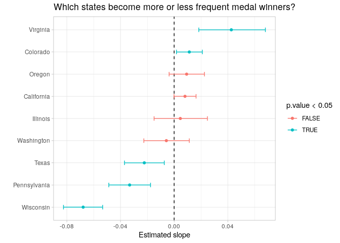

## Nested Regression

Example from David Robinson’s screencast
(<https://youtu.be/lY0YLDZhT88?t=2977>)

``` r
.ikea <- ikea %>% select(price_usd, category, other_colors, depth, height, width)
head(.ikea)
```

    ## # A tibble: 6 × 6
    ##   price_usd category      other_colors depth height width
    ##       <dbl> <chr>         <chr>        <dbl>  <dbl> <dbl>
    ## 1      71.6 Bar furniture No              NA     99    51
    ## 2     269.  Bar furniture No              NA    105    80
    ## 3     566.  Bar furniture No              NA     NA    NA
    ## 4      18.6 Bar furniture Yes             50    100    60
    ## 5      60.8 Bar furniture No              60     43    74
    ## 6      93.2 Bar furniture No              45     91    40

``` r
.ikea_volume <- .ikea %>%
  mutate(volume_m3 = depth * height * width / 1e6) %>%
  filter(!is.na(volume_m3),
         volume_m3 >= .001) %>%
  arrange(desc(volume_m3)) %>%
  add_count(category, name = "category_total")

head(.ikea_volume)
```

    ## # A tibble: 6 × 8
    ##   price_usd category          other_colors depth height width volume_m3 category_total
    ##       <dbl> <chr>             <chr>        <dbl>  <dbl> <dbl>     <dbl>          <int>
    ## 1     1453. Wardrobes         No             210    236   275     13.6             199
    ## 2     1775. Sofas & armchairs Yes            252    104   327      8.57            223
    ## 3     2403  Sofas & armchairs No             252    104   327      8.57            223
    ## 4     2240. Sofas & armchairs Yes            257     83   368      7.85            223
    ## 5     1862. Sofas & armchairs Yes            257     83   328      7.00            223
    ## 6     2267. Sofas & armchairs Yes            249     83   327      6.76            223

``` r
.ikea_model <-lm(log2(price_usd) ~ log2(volume_m3), data = .ikea_volume)
```

If we were to predict price based on only the volumn (cubic meters).

``` r
.ikea_model %>% summary()
```

    ## 
    ## Call:
    ## lm(formula = log2(price_usd) ~ log2(volume_m3), data = .ikea_volume)
    ## 
    ## Residuals:
    ##     Min      1Q  Median      3Q     Max 
    ## -4.9166 -0.5027  0.0594  0.5208  4.2457 
    ## 
    ## Coefficients:
    ##                 Estimate Std. Error t value            Pr(>|t|)    
    ## (Intercept)      8.34960    0.02558  326.46 <0.0000000000000002 ***
    ## log2(volume_m3)  0.81219    0.01219   66.63 <0.0000000000000002 ***
    ## ---
    ## Signif. codes:  0 '***' 0.001 '**' 0.01 '*' 0.05 '.' 0.1 ' ' 1
    ## 
    ## Residual standard error: 0.9528 on 1889 degrees of freedom
    ## Multiple R-squared:  0.7015, Adjusted R-squared:  0.7014 
    ## F-statistic:  4440 on 1 and 1889 DF,  p-value: < 0.00000000000000022

Then what this says that our Intercept (which is where `log2(volume_m3)`
is `0`; or in other words when the volumn_m3 is 1 (cubic meter) because
`log2(1)` equals `0`) …

``` r
log2(1)
```

    ## [1] 0

then `log2(price_usd)` is `8.349597`

``` r
coef(.ikea_model)['(Intercept)']
```

    ## (Intercept) 
    ##    8.349597

In other words, the price is `326.1963889`

``` r
2 ^ coef(.ikea_model)['(Intercept)']
```

    ## (Intercept) 
    ##    326.1964

Putting it together, when the volume of the furniture is 1 cubic meter,
we would predict that the price is `$326.1963889`

For each increase in `log2(volume_m3)` we would expect an increase in
`log2(price_usd)` by `0.8121906`

``` r
coef(.ikea_model)['log2(volume_m3)']
```

    ## log2(volume_m3) 
    ##       0.8121906

i.e. every time we doulbe in cubic meters we would expect an increase to
the price by a factor of `1.7558755`

``` r
2 ^ coef(.ikea_model)['log2(volume_m3)']
```

    ## log2(volume_m3) 
    ##        1.755876

But now lets include `category` and `other_colors`.

``` r
#library(broom)
.ikea_volume %>%
    # we are making `Tables & desk` the first factor level and therefore the reference category in the model for category
    mutate(category = fct_relevel(category, "Tables & desks")) %>%
    lm(log2(price_usd) ~ log2(volume_m3) + category + other_colors, data = .) %>%
    broom::tidy(conf.int = TRUE) %>%
    filter(term != "(Intercept)") %>%
    mutate(term = ifelse(term == "log2(volume_m3)", "Item volume (doubling)", term),
           term = str_remove(term, "^category")) %>%
    mutate(term = fct_reorder(term, estimate)) %>%
    ggplot(aes(estimate, term, color=p.value <= 0.05)) +
    geom_point() +
    geom_errorbarh(aes(xmin = conf.low, xmax = conf.high), height = .2) +
    geom_vline(xintercept = 0, color = "red", lty = 2) +
    labs(x = "Impact on price (relative to Tables & desks)",
         y = "",
         title = "What objects are unusually expensive/inexpensive relative to volume?")
```


