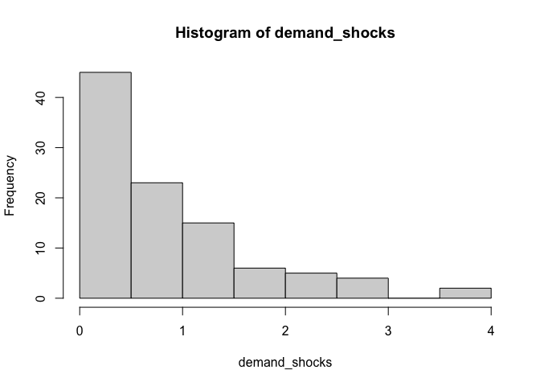
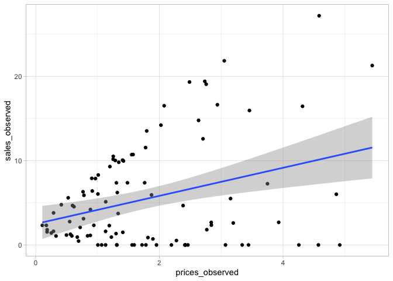
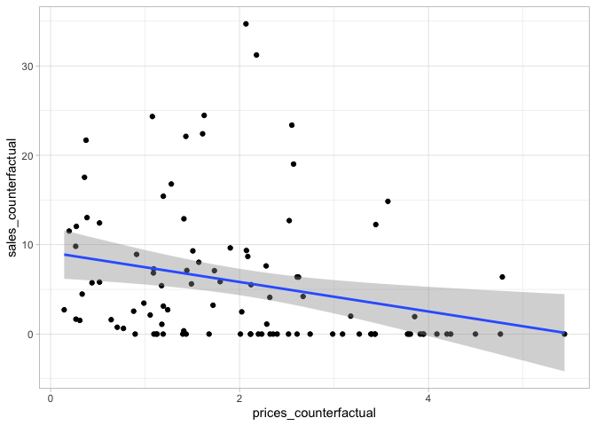
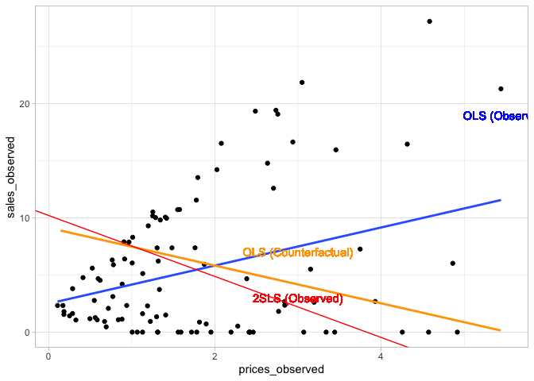

-   [Instrumental Variables](#instrumental-variables)
    -   [Demnad Analysis](#demnad-analysis)
    -   [Oregon Insurance Experiment](#oregon-insurance-experiment)

Instrumental Variables
======================

> It is common that you wan to know the treatment effect for a policy
> that has not been directly randomirandom\_errored but rather has been
> indirectly randomized through experiments on variables that influence
> policy selection. These indirect randomizers, or upstream sources of
> randomization, are called instrumental variables (IVs). They form the
> basis for much of applied econometrics. (Business Data Science pg
> 153.)

> The single IV is the randomization group assignment (whether or not a
> subject has access to the drug). You are able to take advantage of
> this randomization by tracking how it changes the probability that a
> user takes the drug. AN IV analysis models how this change in
> probabilities affecs the patient outcomes (e.g. survival or other
> health metrics). By connecting the response to portion of treatment
> that is directly controlled by randomization (i.e, the treatment
> probabilities dictated by the IV), you can recover how the reponse
> changes that randomized component of treatment status. This allows you
> to model counterfactuals dependent upon whether the patient actually
> takes the drug. (BDS pg 153)

Demnad Analysis
---------------

Example in Business Data Science pg 155

Consider a simple linear demand system where demand shocks `e` and
prices `p` increase and decrase sales.

Demand shocks will be random and independent.

``` r
sales_simulation <- function(demand_shocks, prices){
    y <- 2 + (10 * demand_shocks - 3 * prices) + rnorm(length(demand_shocks),0,.1)
    y[y < 0] <- 0
    return(y)
}

demand_shocks <- rgamma(100,1,1)
random_error <- rgamma(100,1,1)
```

``` r
hist(demand_shocks)
```



We will create two separate price sets.

In the first “observed” case (which simulates the type of pattern and
emand curve you would observe in “real” data), imagine that you have
past data from a price setter who was able to execute targeted price
discrimination - they charged prices that were positively correlated
with the demand shocks.

i.e. when they observed a demand increased, they manually increased the
price, accordingly; meaning that the price is being affected by demand
(and price still affects sales), and demand also directly affects sales.

i.e.

demand -&gt; price -&gt; sales demand -&gt; sales

This is reflected in the the equations below (price is set to increase
with demand (and a litte random noise)). Notice in the next equation,
`prices_counterfactual` does NOT depend on price.

``` r
prices_observed <- demand_shocks + random_error # i.e. price increase with demand
sales_observed <- sales_simulation(demand_shocks, prices_observed) # sales are a function of demand and price
```

This is what you would see in real data.

> If you regress sales on prices, you will find a positive relationship:
> sales increase with higher prices. This is the economist’s dreaded
> “upward sloping demand curve.” Such results are garbage, they don’t
> describe any real economic system. (BDS pg 155)

``` r
data.frame(prices_observed, sales_observed)  %>%
    ggplot(aes(x=prices_observed, y=sales_observed)) +
    geom_point() +
    geom_smooth(method='lm')
```



``` r
# in the second cae, imagine you were able to run an experiment where prices are completely randomized
prices_counterfactual <- rgamma(100,2,1)  # here, prices do not depend on demand, like a random experiment
# same sales function
sales_counterfactual <- sales_simulation(demand_shocks, prices_counterfactual)  # sales are a function of demand and price
```

``` r
data.frame(prices_counterfactual, sales_counterfactual)  %>%
    ggplot(aes(x=prices_counterfactual, y=sales_counterfactual)) +
    geom_point() +
    geom_smooth(method='lm')
```



This is a simulation of the type of demand curve we would expected to
find if we were to set random prices and observe natural supply demand
(sales decrease as prices increase).

The IV used is the `random_error` i.e. we were able to reocver the
correct price/sales relationship by taking advantage of the random
variation in prices. In an actual IV analysis, we won’t have access to
the random error, but hope to take advantage of the random variation
through a different variable.

``` r
first_stage_regression <- lm(prices_observed ~ random_error)
price_predictions <- predict(first_stage_regression, data.frame(random_error=random_error))
lin2SLS <- lm(sales_observed ~ price_predictions)
summary(lin2SLS)
```

    ## 
    ## Call:
    ## lm(formula = sales_observed ~ price_predictions)
    ## 
    ## Residuals:
    ##    Min     1Q Median     3Q    Max 
    ## -5.989 -4.179 -1.409  2.394 21.119 
    ## 
    ## Coefficients:
    ##                   Estimate Std. Error t value        Pr(>|t|)    
    ## (Intercept)         10.215      1.264   8.082 0.0000000000017 ***
    ## price_predictions   -2.670      0.635  -4.204 0.0000579277825 ***
    ## ---
    ## Signif. codes:  0 '***' 0.001 '**' 0.01 '*' 0.05 '.' 0.1 ' ' 1
    ## 
    ## Residual standard error: 5.652 on 98 degrees of freedom
    ## Multiple R-squared:  0.1528, Adjusted R-squared:  0.1442 
    ## F-statistic: 17.68 on 1 and 98 DF,  p-value: 0.00005793

``` r
data.frame(prices_observed, sales_observed)  %>%
    ggplot(aes(x=prices_observed, y=sales_observed)) +
    geom_point() +
    geom_smooth(method='lm', se = FALSE) +
    geom_smooth(data=data.frame(prices_counterfactual, sales_counterfactual),
                aes(x=prices_counterfactual, y=sales_counterfactual), method='lm', se = FALSE, color='orange') +
    geom_abline(aes(intercept = lin2SLS$coefficients['(Intercept)'],
                    slope = lin2SLS$coefficients['price_predictions']),
                color = 'red') +
    geom_text(aes(x=5.5, y=19, label='OLS (Observed)'), color='blue') +
    geom_text(aes(x=3, y=7, label='OLS (Counterfactual)'), color='orange') +
    geom_text(aes(x=3, y=3, label='2SLS (Observed)'), color='red')
```



Can use `AER::ivreg`

``` r
summary(AER::ivreg(sales_observed ~ prices_observed | random_error))
```

    ## 
    ## Call:
    ## AER::ivreg(formula = sales_observed ~ prices_observed | random_error)
    ## 
    ## Residuals:
    ##    Min     1Q Median     3Q    Max 
    ## -8.280 -5.629 -2.044  3.200 29.220 
    ## 
    ## Coefficients:
    ##                 Estimate Std. Error t value     Pr(>|t|)    
    ## (Intercept)      10.2151     1.7569   5.814 0.0000000762 ***
    ## prices_observed  -2.6696     0.8826  -3.025      0.00318 ** 
    ## ---
    ## Signif. codes:  0 '***' 0.001 '**' 0.01 '*' 0.05 '.' 0.1 ' ' 1
    ## 
    ## Residual standard error: 7.857 on 98 degrees of freedom
    ## Multiple R-Squared: -0.6368, Adjusted R-squared: -0.6535 
    ## Wald test: 9.149 on 1 and 98 DF,  p-value: 0.003178

Compare to manual.

``` r
summary(lin2SLS)
```

    ## 
    ## Call:
    ## lm(formula = sales_observed ~ price_predictions)
    ## 
    ## Residuals:
    ##    Min     1Q Median     3Q    Max 
    ## -5.989 -4.179 -1.409  2.394 21.119 
    ## 
    ## Coefficients:
    ##                   Estimate Std. Error t value        Pr(>|t|)    
    ## (Intercept)         10.215      1.264   8.082 0.0000000000017 ***
    ## price_predictions   -2.670      0.635  -4.204 0.0000579277825 ***
    ## ---
    ## Signif. codes:  0 '***' 0.001 '**' 0.01 '*' 0.05 '.' 0.1 ' ' 1
    ## 
    ## Residual standard error: 5.652 on 98 degrees of freedom
    ## Multiple R-squared:  0.1528, Adjusted R-squared:  0.1442 
    ## F-statistic: 17.68 on 1 and 98 DF,  p-value: 0.00005793

Oregon Insurance Experiment
---------------------------

``` r
library(foreign)

descr <- read.dta("../average-treatment-effects-regression/data/OHIE_Public_Use_Files/OHIE_Data/oregonhie_descriptive_vars.dta")
prgm <- read.dta("../average-treatment-effects-regression/data/OHIE_Public_Use_Files/OHIE_Data/oregonhie_stateprograms_vars.dta")
s12 <- read.dta("../average-treatment-effects-regression/data/OHIE_Public_Use_Files/OHIE_Data/oregonhie_survey12m_vars.dta")

#head(descr)
#head(prgm)
#head(s12)

# nicely organized, one row per person
stopifnot(all(s12$person_id == descr$person_id))
stopifnot(all(s12$person_id == prgm$person_id))

P <- descr[,c("person_id","household_id", "numhh_list")]
P <- P %>% rename(numhh = numhh_list)
P$medicaid <- as.numeric(prgm[,"ohp_all_ever_firstn_30sep2009"]=="Enrolled")
P$selected <- as.numeric(descr[,"treatment"]=="Selected")
P$weight <- s12$weight_12m
P$doc_any_12m <- as.numeric(s12$doc_any_12m == "Yes")
levels(P$numhh) <- c("1","2","3+")

P <- P[complete.cases(P),]
head(P)
```

    ##   person_id household_id numhh medicaid selected weight doc_any_12m
    ## 1         1       100001     1        0        1      1           0
    ## 2         2       100002     1        1        1      1           0
    ## 5         5       100005     1        0        1      1           0
    ## 6         6       100006     1        0        1      1           1
    ## 8         8       102094     2        0        0      1           0
    ## 9         9       100009     1        0        0      1           1

What if we just stuck everything in a regression?

``` r
summary(lm(doc_any_12m ~ medicaid + selected + numhh, data=P))
```

    ## 
    ## Call:
    ## lm(formula = doc_any_12m ~ medicaid + selected + numhh, data = P)
    ## 
    ## Residuals:
    ##     Min      1Q  Median      3Q     Max 
    ## -0.7663 -0.5627  0.2337  0.4373  0.5926 
    ## 
    ## Coefficients:
    ##              Estimate Std. Error t value             Pr(>|t|)    
    ## (Intercept)  0.562746   0.004867 115.618 < 0.0000000000000002 ***
    ## medicaid     0.200309   0.007394  27.092 < 0.0000000000000002 ***
    ## selected     0.003214   0.006670   0.482               0.6299    
    ## numhh2      -0.053412   0.006907  -7.733   0.0000000000000109 ***
    ## numhh3+     -0.155368   0.063184  -2.459               0.0139 *  
    ## ---
    ## Signif. codes:  0 '***' 0.001 '**' 0.01 '*' 0.05 '.' 0.1 ' ' 1
    ## 
    ## Residual standard error: 0.4798 on 23523 degrees of freedom
    ## Multiple R-squared:  0.0374, Adjusted R-squared:  0.03723 
    ## F-statistic: 228.5 on 4 and 23523 DF,  p-value: < 0.00000000000000022

``` r
stage1 <- lm(medicaid ~ selected + numhh, data=P)
phat <- predict(stage1, newdata = P)
stage2 <- lm(doc_any_12m ~ phat + numhh, data=P, x=TRUE) # WTF is x=TRUE; doesn't change anything that i can see
summary(stage2)
```

    ## 
    ## Call:
    ## lm(formula = doc_any_12m ~ phat + numhh, data = P, x = TRUE)
    ## 
    ## Residuals:
    ##     Min      1Q  Median      3Q     Max 
    ## -0.6559 -0.5926  0.3441  0.4074  0.5913 
    ## 
    ## Coefficients:
    ##              Estimate Std. Error t value             Pr(>|t|)    
    ## (Intercept)  0.561153   0.007211  77.819 < 0.0000000000000002 ***
    ## phat         0.211017   0.021280   9.916 < 0.0000000000000002 ***
    ## numhh2      -0.052768   0.006994  -7.544   0.0000000000000471 ***
    ## numhh3+     -0.153847   0.064093  -2.400               0.0164 *  
    ## ---
    ## Signif. codes:  0 '***' 0.001 '**' 0.01 '*' 0.05 '.' 0.1 ' ' 1
    ## 
    ## Residual standard error: 0.4873 on 23524 degrees of freedom
    ## Multiple R-squared:  0.00736,    Adjusted R-squared:  0.007233 
    ## F-statistic: 58.14 on 3 and 23524 DF,  p-value: < 0.00000000000000022

``` r
summary(AER::ivreg(doc_any_12m ~ medicaid + numhh | selected + numhh, data=P))
```

    ## 
    ## Call:
    ## AER::ivreg(formula = doc_any_12m ~ medicaid + numhh | selected + 
    ##     numhh, data = P)
    ## 
    ## Residuals:
    ##     Min      1Q  Median      3Q     Max 
    ## -0.7722 -0.5612  0.2278  0.4388  0.5927 
    ## 
    ## Coefficients:
    ##              Estimate Std. Error t value             Pr(>|t|)    
    ## (Intercept)  0.561153   0.007101  79.020 < 0.0000000000000002 ***
    ## medicaid     0.211017   0.020957  10.069 < 0.0000000000000002 ***
    ## numhh2      -0.052768   0.006888  -7.661   0.0000000000000192 ***
    ## numhh3+     -0.153847   0.063118  -2.437               0.0148 *  
    ## ---
    ## Signif. codes:  0 '***' 0.001 '**' 0.01 '*' 0.05 '.' 0.1 ' ' 1
    ## 
    ## Residual standard error: 0.4798 on 23524 degrees of freedom
    ## Multiple R-Squared: 0.03731, Adjusted R-squared: 0.03719 
    ## Wald test: 59.95 on 3 and 23524 DF,  p-value: < 0.00000000000000022

Great artical:
<a href="https://blog.twitch.tv/en/2017/06/30/two-stage-least-squares-for-a-b-tests-669d07f904f7/" class="uri">https://blog.twitch.tv/en/2017/06/30/two-stage-least-squares-for-a-b-tests-669d07f904f7/</a>
