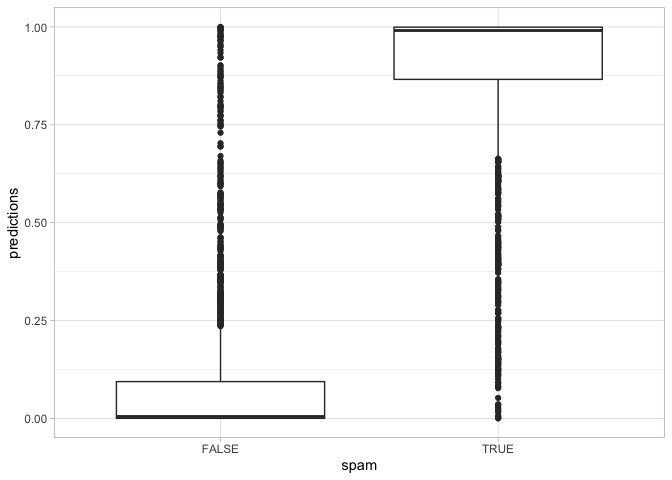

This data contains weekly prices and sales for three OJ brands, as well
as an indicator `feature` showing whether each brand was advertised (in
store or flyer) that week. (Business Data Science, pg 43).

``` r
emails <- read.csv('data/spam.csv')
head(emails[, c(1:4, ncol(emails))])
```

    ##   word_make word_address word_all word_3d spam
    ## 1         0            1        1       0    1
    ## 2         1            1        1       0    1
    ## 3         1            0        1       0    1
    ## 4         0            0        0       0    1
    ## 5         0            0        0       0    1
    ## 6         0            0        0       0    1

Logistic Regression is a linear model for log odds. The odds of an event
are the probability that it happens over the probability that it
doesn’t.

`log[ p / (1-p) ] = B0 + B1X1 + B2X2 + ... + error`

``` r
reg_results <- glm(spam ~ ., data=emails, family='binomial')
```

    ## Warning: glm.fit: fitted probabilities numerically 0 or 1 occurred

``` r
summary(reg_results)
```

    ## 
    ## Call:
    ## glm(formula = spam ~ ., family = "binomial", data = emails)
    ## 
    ## Deviance Residuals: 
    ##     Min       1Q   Median       3Q      Max  
    ## -4.2710  -0.1768  -0.0088   0.0715   3.9864  
    ## 
    ## Coefficients:
    ##                              Estimate Std. Error z value             Pr(>|z|)
    ## (Intercept)                -1.9682470  0.1465703 -13.429 < 0.0000000000000002
    ## word_make                  -0.5529572  0.2356753  -2.346             0.018963
    ## word_address               -0.1338696  0.2217334  -0.604             0.546016
    ## word_all                   -0.4946420  0.1775333  -2.786             0.005333
    ## word_3d                     0.8301668  0.8244961   1.007             0.313994
    ## word_our                    1.1252843  0.1738924   6.471   0.0000000000972587
    ## word_over                   0.2750951  0.2222082   1.238             0.215714
    ## word_remove                 2.4881234  0.2760568   9.013 < 0.0000000000000002
    ## word_internet               0.9333968  0.2521034   3.702             0.000214
    ## word_order                  0.2196402  0.2768192   0.793             0.427520
    ## word_mail                   0.3081450  0.1951604   1.579             0.114352
    ## word_receive               -0.4391531  0.2786137  -1.576             0.114978
    ## word_will                  -0.3105941  0.1598132  -1.943             0.051958
    ## word_people                -0.9585867  0.2546075  -3.765             0.000167
    ## word_report                 0.8466587  0.3426143   2.471             0.013467
    ## word_addresses              1.2553331  0.5583262   2.248             0.024552
    ## word_free                   1.5427059  0.1789503   8.621 < 0.0000000000000002
    ## word_business               1.0566330  0.2503438   4.221   0.0000243514281163
    ## word_email                 -0.5200992  0.2112903  -2.462             0.013834
    ## word_you                    0.1628054  0.1725359   0.944             0.345372
    ## word_credit                 0.4160407  0.4092818   1.017             0.309385
    ## word_your                   0.6949764  0.1710662   4.063   0.0000485258127002
    ## word_font                   1.2999227  0.4370649   2.974             0.002937
    ## word_000                    1.0349534  0.3090871   3.348             0.000813
    ## word_money                  1.7300810  0.2991364   5.784   0.0000000073124577
    ## word_hp                    -3.6043950  0.3868873  -9.316 < 0.0000000000000002
    ## word_hpl                   -0.1806108  0.4086744  -0.442             0.658530
    ## word_george                -5.7798414  0.7582542  -7.623   0.0000000000000249
    ## word_650                    2.1047235  0.4075747   5.164   0.0000002417035162
    ## word_lab                   -0.6635103  0.5092322  -1.303             0.192588
    ## word_labs                  -0.1804292  0.4563317  -0.395             0.692555
    ## word_telnet                -2.3018083  1.0993454  -2.094             0.036278
    ## word_857                   -1.4454869  1.2713870  -1.137             0.255565
    ## word_data                  -0.7849383  0.3717852  -2.111             0.034749
    ## word_415                    0.9195251  1.3326016   0.690             0.490180
    ## word_85                    -1.7312335  0.6064449  -2.855             0.004307
    ## word_technology             0.3719642  0.3186659   1.167             0.243108
    ## word_1999                  -1.0922412  0.2787550  -3.918   0.0000891815074627
    ## word_parts                  1.5572057  0.6127579   2.541             0.011044
    ## word_pm                    -0.5686254  0.3591271  -1.583             0.113341
    ## word_direct                -0.2828228  0.4884136  -0.579             0.562546
    ## word_cs                    -6.2966891  3.4400227  -1.830             0.067187
    ## word_meeting               -2.5034078  0.4584085  -5.461   0.0000000473232525
    ## word_original              -1.2428824  0.5171020  -2.404             0.016237
    ## word_project               -1.6185685  0.4276376  -3.785             0.000154
    ## word_re                    -1.0257826  0.1788160  -5.737   0.0000000096637542
    ## word_edu                   -2.4268251  0.3217540  -7.542   0.0000000000000461
    ## word_table                  0.2853855  0.8765651   0.326             0.744748
    ## word_conference            -2.2234335  0.5821066  -3.820             0.000134
    ## char_semicolon             -0.2928835  0.2255829  -1.298             0.194170
    ## char_leftbrac               0.1256978  0.1536438   0.818             0.413293
    ## char_leftsquarebrac        -0.3345468  0.3677987  -0.910             0.363038
    ## char_exclaim                1.3427284  0.1456317   9.220 < 0.0000000000000002
    ## char_dollar                 1.8707164  0.2074846   9.016 < 0.0000000000000002
    ## char_pound                 -0.8186884  0.2833182  -2.890             0.003857
    ## capital_run_length_average -0.0031379  0.0158553  -0.198             0.843118
    ## capital_run_length_longest  0.0060448  0.0029483   2.050             0.040340
    ## capital_run_length_total    0.0008344  0.0004660   1.791             0.073337
    ##                               
    ## (Intercept)                ***
    ## word_make                  *  
    ## word_address                  
    ## word_all                   ** 
    ## word_3d                       
    ## word_our                   ***
    ## word_over                     
    ## word_remove                ***
    ## word_internet              ***
    ## word_order                    
    ## word_mail                     
    ## word_receive                  
    ## word_will                  .  
    ## word_people                ***
    ## word_report                *  
    ## word_addresses             *  
    ## word_free                  ***
    ## word_business              ***
    ## word_email                 *  
    ## word_you                      
    ## word_credit                   
    ## word_your                  ***
    ## word_font                  ** 
    ## word_000                   ***
    ## word_money                 ***
    ## word_hp                    ***
    ## word_hpl                      
    ## word_george                ***
    ## word_650                   ***
    ## word_lab                      
    ## word_labs                     
    ## word_telnet                *  
    ## word_857                      
    ## word_data                  *  
    ## word_415                      
    ## word_85                    ** 
    ## word_technology               
    ## word_1999                  ***
    ## word_parts                 *  
    ## word_pm                       
    ## word_direct                   
    ## word_cs                    .  
    ## word_meeting               ***
    ## word_original              *  
    ## word_project               ***
    ## word_re                    ***
    ## word_edu                   ***
    ## word_table                    
    ## word_conference            ***
    ## char_semicolon                
    ## char_leftbrac                 
    ## char_leftsquarebrac           
    ## char_exclaim               ***
    ## char_dollar                ***
    ## char_pound                 ** 
    ## capital_run_length_average    
    ## capital_run_length_longest *  
    ## capital_run_length_total   .  
    ## ---
    ## Signif. codes:  0 '***' 0.001 '**' 0.01 '*' 0.05 '.' 0.1 ' ' 1
    ## 
    ## (Dispersion parameter for binomial family taken to be 1)
    ## 
    ##     Null deviance: 6170.2  on 4600  degrees of freedom
    ## Residual deviance: 1548.7  on 4543  degrees of freedom
    ## AIC: 1664.7
    ## 
    ## Number of Fisher Scoring iterations: 10

``` r
get_regression_equation(reg_results)
```

    ## [1] "spam = -1.97(Intercept) + -0.55word_make + -0.13word_address + -0.49word_all + 0.83word_3d + 1.13word_our + 0.28word_over + 2.49word_remove + 0.93word_internet + 0.22word_order + 0.31word_mail + -0.44word_receive + -0.31word_will + -0.96word_people + 0.85word_report + 1.26word_addresses + 1.54word_free + 1.06word_business + -0.52word_email + 0.16word_you + 0.42word_credit + 0.69word_your + 1.3word_font + 1.03word_000 + 1.73word_money + -3.6word_hp + -0.18word_hpl + -5.78word_george + 2.1word_650 + -0.66word_lab + -0.18word_labs + -2.3word_telnet + -1.45word_857 + -0.78word_data + 0.92word_415 + -1.73word_85 + 0.37word_technology + -1.09word_1999 + 1.56word_parts + -0.57word_pm + -0.28word_direct + -6.3word_cs + -2.5word_meeting + -1.24word_original + -1.62word_project + -1.03word_re + -2.43word_edu + 0.29word_table + -2.22word_conference + -0.29char_semicolon + 0.13char_leftbrac + -0.33char_leftsquarebrac + 1.34char_exclaim + 1.87char_dollar + -0.82char_pound + 0capital_run_length_average + 0.01capital_run_length_longest + 0capital_run_length_total + error"

``` r
log_odds_to_probability <- function(.log_odds) {
    if(.log_odds < 0) {
        
        .odds <- 1 / exp(.log_odds)
        return (1 - (.odds / (1 + .odds)))
        
    } else {
    
        .odds <- exp(.log_odds)
        # log odds = probability / 1 - probability
        return (.odds / (1 + .odds))
    }
}
(log_odds_free <- coef(reg_results)['word_free'])
```

    ## word_free 
    ##  1.542706

``` r
(odds_free <- exp(log_odds_free))
```

    ## word_free 
    ##  4.677229

``` r
# log odds = probability / 1 - probability
(probability_free <- odds_free / (1 + odds_free))
```

    ## word_free 
    ## 0.8238577

``` r
probability_free_check <- log_odds_to_probability(log_odds_free)
```

The log odds that an email is spam increase by `1.5` if the email
contains the word `free`.

The odds that an email is spam increase by `4.7` times if the email
contains the word `free`.

The probably that an email is spam is `82%` if the email contains the
word `free`. ??? not sure if this is correct interpretation.

``` r
log_odds_to_probability(1)
```

    ## [1] 0.7310586

``` r
log_odds_to_probability(-1)
```

    ## [1] 0.2689414

``` r
coef(reg_results)['word_george']
```

    ## word_george 
    ##   -5.779841

``` r
-1 / exp(coef(reg_results)['word_george'])
```

    ## word_george 
    ##   -323.7078

``` r
log_odds_to_probability(coef(reg_results)['word_george'])
```

    ## word_george 
    ## 0.003079692

``` r
.log_odds <- 5
exp(.log_odds)
```

    ## [1] 148.4132

``` r
.log_odds <- -5
-1 / exp(.log_odds)
```

    ## [1] -148.4132

``` r
new_data <- c(rep(0, ncol(emails) - 4), mean(emails$capital_run_length_average), mean(emails$capital_run_length_longest), mean(emails$capital_run_length_total))
new_data <- c(rep(0, ncol(emails) - 1))
names(new_data) <- colnames(emails[, 1:(ncol(emails)-1)])
new_data <- t(as.data.frame(new_data)) %>% as.data.frame()
predict(reg_results,
        newdata = new_data,
        type = 'response')
```

    ##  new_data 
    ## 0.1225773

``` r
new_data[1, 'word_free'] <- 1
predict(reg_results,
        newdata = new_data,
        type = 'response')
```

    ##  new_data 
    ## 0.3951916

``` r
new_data[1, 'word_george'] <- 1
predict(reg_results,
        newdata = new_data,
        type = 'response')
```

    ##   new_data 
    ## 0.00201447

``` r
R2(y=emails$spam, pred=predict(reg_results, type='response'), family = 'binomial')
```

    ## [1] 0.7490079

“The difference between Residual Deviance and Null Deviance is due to
information contained in teh covariates. An important metric of how
tightly your regression fits is the proprortion of deviance explained by
x, R-Squared” (BDS pg 56)

``` r
(reg_results$null.deviance - reg_results$deviance) / reg_results$null.deviance
```

    ## [1] 0.7490079

``` r
emails %>%
    mutate(spam = as.logical(spam),
           predictions = predict(reg_results, type='response')) %>%
    ggplot(aes(x=spam, y=predictions, group=spam)) +
    geom_boxplot()
```



``` r
confusion_matrix <- function(actual_classes, predicted_classes, positive_class) {
    print(table(actual_classes, predicted_classes))
    
    stopifnot(positive_class %in% actual_classes)
    stopifnot(positive_class %in% predicted_classes)

    actual_classes <- ifelse(actual_classes == positive_class, TRUE, FALSE)
    predicted_classes <- ifelse(predicted_classes == positive_class, TRUE, FALSE)
    
    actual_positives = sum(actual_classes)
    actual_negatives = sum(!actual_classes)
    total_observations <- length(actual_classes)
    
    stopifnot(actual_positives + actual_negatives == total_observations)

    true_positives = sum(actual_classes & predicted_classes)
    true_negatives = sum(!actual_classes & !predicted_classes)
    false_positives = sum(predicted_classes & !actual_classes)
    false_negatives = sum(!predicted_classes & actual_classes)
    
    stopifnot(true_positives + false_negatives == actual_positives)

    # todo doesn't handle divide-by-zero, etc.
    print(paste('true_positive_rate a.k.a sensitivity:', round(true_positives / actual_positives, 4)))
    print(paste('true_negative_rate a.k.a specificity:', round(true_negatives / actual_negatives, 4)))
    print(paste('false_positive_rate:', round(false_positives / actual_negatives, 4)))
    print(paste('false_negative_rate:', round(false_negatives / actual_positives, 4)))
    # if you predict it's going to be positive (denominator), how often is it (numerator)?
    print(paste('positive_predictive_value:', round(true_positives / (true_positives + false_positives), 4)))
    # if you predict it's going to be negative (denominator), how often is it (numerator)?
    print(paste('negative_predictive_value:', round(true_negatives / (true_negatives + false_negatives), 4)))
    print(paste('accuracy:', round((true_negatives + true_positives) / total_observations, 4)))
    print(paste('error_rate:', round((false_positives + false_negatives) / total_observations, 4)))
    print(paste('prevalence:', round(actual_positives / total_observations, 4)))
}
```

``` r
confusion_matrix(actual_classes=emails$spam,
                 predicted_classes=round(predict(reg_results, type='response')),
                 positive_class=1)
```

    ##               predicted_classes
    ## actual_classes    0    1
    ##              0 2669  119
    ##              1  167 1646
    ## [1] "true_positive_rate a.k.a sensitivity: 0.9079"
    ## [1] "true_negative_rate a.k.a specificity: 0.9573"
    ## [1] "false_positive_rate: 0.0427"
    ## [1] "false_negative_rate: 0.0921"
    ## [1] "positive_predictive_value: 0.9326"
    ## [1] "negative_predictive_value: 0.9411"
    ## [1] "accuracy: 0.9378"
    ## [1] "error_rate: 0.0622"
    ## [1] "prevalence: 0.394"
