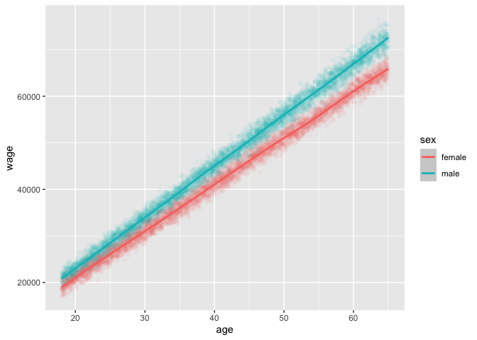
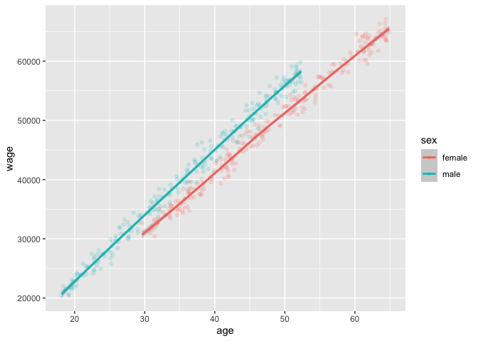

-   [Simulate Data](#simulate-data)

Simulate Data
=============

First Simulate the “Population”; defined to be whatever we want

``` r
population_size <- 10000
percent_male <- 0.5

set.seed(1)
sex <- rbinom(n=population_size, size=1, prob = 0.5)
age <- runif(n=population_size, min=18, max=65)

sex_wage_gap <- 0.10  # males make 5% more than females, on average
age_wage_gap <- 1000  # each year adds an additional $1000 to wage, on average

simualted_male_wage_factor <- rnorm(n=population_size, mean=1+sex_wage_gap, sd=0.02)
simualted_female_wage_factor <- rnorm(n=population_size, mean=1, sd=0.015)

sex_wage_factor <- ifelse(sex == 1, simualted_male_wage_factor, simualted_female_wage_factor)
age_wage_factor <- rnorm(n=population_size, mean=age_wage_gap, sd=age_wage_gap)

wage <- (age * age_wage_gap * sex_wage_factor) + age_wage_factor

pop_data <- data.frame(wage, sex, age) %>%
    mutate(sex = ifelse(sex == 1, 'male', 'female'))
head(pop_data)
```

    ##       wage    sex      age
    ## 1 22733.69 female 21.04149
    ## 2 51877.18 female 49.80078
    ## 3 57302.50   male 52.56247
    ## 4 25703.45   male 23.23108
    ## 5 20975.40 female 20.19277
    ## 6 29020.45   male 24.15278

``` r
pop_data %>%
    group_by(sex) %>%
    summarise(n=n(),
              average_age=mean(age),
              average_wage=mean(wage))
```

    ## `summarise()` ungrouping output (override with `.groups` argument)

    ## # A tibble: 2 x 4
    ##   sex        n average_age average_wage
    ##   <chr>  <int>       <dbl>        <dbl>
    ## 1 female  5047        41.4       42464.
    ## 2 male    4953        41.6       46713.

``` r
average_wage_males <- mean(pop_data %>% filter(sex == 'male') %>% pull(wage))
average_wage_females <- mean(pop_data %>% filter(sex == 'female') %>% pull(wage))

average_wage_males
```

    ## [1] 46712.77

``` r
average_wage_females
```

    ## [1] 42464.5

``` r
(average_wage_males - average_wage_females) / average_wage_females
```

    ## [1] 0.100043

``` r
pop_data %>%
    ggplot(aes(x=age, y=wage, color=sex)) +
    geom_point(alpha=0.05) +
    geom_smooth()
```

    ## `geom_smooth()` using method = 'gam' and formula 'y ~ s(x, bs = "cs")'



``` r
# make model intercept for 18-year old rather than 0-year old
pop_model <- pop_data %>% 
    mutate(age = age - 18) %>%
    lm(wage ~ age*sex, data=.)
summary(pop_model)
```

    ## 
    ## Call:
    ## lm(formula = wage ~ age * sex, data = .)
    ## 
    ## Residuals:
    ##     Min      1Q  Median      3Q     Max 
    ## -4773.8  -823.5     4.1   824.4  5665.3 
    ## 
    ## Coefficients:
    ##              Estimate Std. Error t value            Pr(>|t|)    
    ## (Intercept) 19054.053     34.785  547.76 <0.0000000000000002 ***
    ## age           998.477      1.283  778.43 <0.0000000000000002 ***
    ## sexmale      1746.664     49.698   35.15 <0.0000000000000002 ***
    ## age:sexmale   100.751      1.831   55.03 <0.0000000000000002 ***
    ## ---
    ## Signif. codes:  0 '***' 0.001 '**' 0.01 '*' 0.05 '.' 0.1 ' ' 1
    ## 
    ## Residual standard error: 1242 on 9996 degrees of freedom
    ## Multiple R-squared:  0.9926, Adjusted R-squared:  0.9926 
    ## F-statistic: 4.477e+05 on 3 and 9996 DF,  p-value: < 0.00000000000000022

-   `Intercept`: because we did `age = age - 18`, the `Intercept` is the
    average pay of an 18 year old female (rather than 0-year old
    female), confirm below (`pop_predictions[2]`)
-   `age`: because of interactions, age is how much additional money, on
    average, each additional year gives a `female`; `age + age:sexmale`
    is how much additional money, on average, each additional year gives
    a `male`
-   `sexmale`: is how much more a male makes than a female **at age 18**
    (again, because of the interaction, and because we did age-18).
    verify number (`pop_predictions[1] - pop_predictions[2]`) below
-   `age:sexmale`: each addional year gives a male 100 more over a
    female. Notice in the graph above the pay gap widens as people get
    older.

``` r
new_data <- tribble(~sex, ~age,
                    'male',   18,
                    'female', 18,
                    'male',   19,
                    'female', 19,
                    'male',   40,
                    'female', 40,
                    'male',   65,
                    'female', 65) %>%
    mutate(age = age - 18)

pop_predictions <- predict(pop_model, newdata = new_data)
pop_predictions
```

    ##        1        2        3        4        5        6        7        8 
    ## 20800.72 19054.05 21899.94 20052.53 44983.72 41020.54 72464.40 65982.45

``` r
pop_predictions[1] - pop_predictions[2]
```

    ##        1 
    ## 1746.664

``` r
pop_predictions[3] - pop_predictions[4]
```

    ##        3 
    ## 1847.415

``` r
pop_predictions[5] - pop_predictions[6]
```

    ##        5 
    ## 3963.177

``` r
pop_predictions[7] - pop_predictions[8]
```

    ##        7 
    ## 6481.942

Survey data; under-sample older males

``` r
male_survey_data <- pop_data %>% filter(sex == 'male') %>% arrange(age)
male_75th_quantile <- round(nrow(male_survey_data) * 0.75)
male_survey_data <- male_survey_data[sample(x=1:male_75th_quantile, size=250),]

female_survey_data <- pop_data %>% filter(sex == 'female') %>% arrange(age)
female_25th_quantile <- round(nrow(female_survey_data) * 0.25)
female_survey_data <- female_survey_data[sample(x=female_25th_quantile:nrow(female_survey_data), size=250),]

survey_data <- bind_rows(male_survey_data, female_survey_data)
```

Now, `females` make more on average, but they are also older on average

``` r
survey_data %>%
    group_by(sex) %>%
    summarise(n=n(),
              average_age=mean(age),
              average_wage=mean(wage))
```

    ## `summarise()` ungrouping output (override with `.groups` argument)

    ## # A tibble: 2 x 4
    ##   sex        n average_age average_wage
    ##   <chr>  <int>       <dbl>        <dbl>
    ## 1 female   250        47.6       48641.
    ## 2 male     250        36.1       40631.

`males` make 16% lower than `females` on average

``` r
survey_average_wage_males <- mean(survey_data %>% filter(sex == 'male') %>% pull(wage))
survey_average_wage_females <- mean(survey_data %>% filter(sex == 'female') %>% pull(wage))

survey_average_wage_males
```

    ## [1] 40630.97

``` r
survey_average_wage_females
```

    ## [1] 48640.63

``` r
(survey_average_wage_males - survey_average_wage_females) / survey_average_wage_females
```

    ## [1] -0.1646702

But we can see that makes still make more at the same age level.

``` r
survey_data %>%
    ggplot(aes(x=age, y=wage, color=sex)) +
    geom_point(alpha=0.15) +
    geom_smooth()
```

    ## `geom_smooth()` using method = 'loess' and formula 'y ~ x'



``` r
survey_model <- survey_data %>%
    mutate(age = age - 18) %>%
    lm(wage ~ age*sex, data=.)
summary(survey_model)
```

    ## 
    ## Call:
    ## lm(formula = wage ~ age * sex, data = .)
    ## 
    ## Residuals:
    ##     Min      1Q  Median      3Q     Max 
    ## -3285.5  -771.6   -20.5   744.1  3722.4 
    ## 
    ## Coefficients:
    ##              Estimate Std. Error t value             Pr(>|t|)    
    ## (Intercept) 19146.066    229.477  83.434 < 0.0000000000000002 ***
    ## age           995.900      7.302 136.393 < 0.0000000000000002 ***
    ## sexmale      1579.064    275.767   5.726         0.0000000178 ***
    ## age:sexmale   105.592     10.338  10.214 < 0.0000000000000002 ***
    ## ---
    ## Signif. codes:  0 '***' 0.001 '**' 0.01 '*' 0.05 '.' 0.1 ' ' 1
    ## 
    ## Residual standard error: 1214 on 496 degrees of freedom
    ## Multiple R-squared:  0.9895, Adjusted R-squared:  0.9894 
    ## F-statistic: 1.557e+04 on 3 and 496 DF,  p-value: < 0.00000000000000022

``` r
coef(survey_model)
```

    ## (Intercept)         age     sexmale age:sexmale 
    ##  19146.0664    995.9003   1579.0641    105.5921

``` r
coef(pop_model)
```

    ## (Intercept)         age     sexmale age:sexmale 
    ##  19054.0532    998.4766   1746.6645    100.7506

``` r
survey_predictions <- predict(survey_model, newdata = new_data)
survey_predictions
```

    ##        1        2        3        4        5        6        7        8 
    ## 20725.13 19146.07 21826.62 20141.97 44957.96 41055.87 72495.27 65953.38

18-year males are predicted to make \~ \`1900

``` r
survey_predictions[1] - survey_predictions[2]
```

    ##        1 
    ## 1579.064

``` r
survey_predictions[3] - survey_predictions[4]
```

    ##        3 
    ## 1684.656

``` r
survey_predictions[5] - survey_predictions[6]
```

    ##       5 
    ## 3902.09

``` r
survey_predictions[7] - survey_predictions[8]
```

    ##        7 
    ## 6541.892

``` r
pop_predictions[1] - pop_predictions[2]
```

    ##        1 
    ## 1746.664

``` r
pop_predictions[3] - pop_predictions[4]
```

    ##        3 
    ## 1847.415

``` r
pop_predictions[5] - pop_predictions[6]
```

    ##        5 
    ## 3963.177

``` r
pop_predictions[7] - pop_predictions[8]
```

    ##        7 
    ## 6481.942

We can see that, although the estimates are not quite as good and the
model as more extreme predictions (i.e. less of a difference at age 18
and more of a difference at age 65, but pretty close at age 40), the
model does control for the fact that we are under-sampling older males
and younger females and the raw data shows females making more, and the
model predicts that males will make more on average, across all ages.

**We could further extend this example by building a model that only
includes the data where there is overlap in data i.e. age; or, we could
simply refrain from making predictions where there is lack of overlap in
data. This is related to the sections in `Regression and Other Stories`
that describe `imbalance` and \`lack of complete overlap.**
