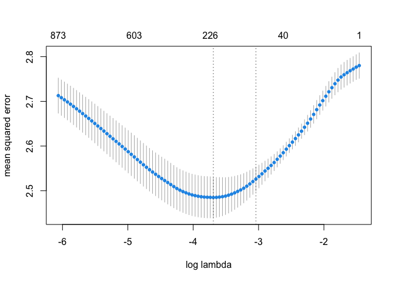

-   [Web spending example](#web-spending-example)
    -   [Data Processing](#data-processing)

Web spending example
====================

Data Processing
---------------

``` r
## Browsing History. 
## The table has three colums: [machine] id, site [id], [# of] visits
web <- read.csv("data/browser-domains.csv")
## Read in the actual website names and relabel site factor
sitenames <- scan("data/browser-sites.txt", what="character")
web$site <- factor(web$site, levels=1:length(sitenames), labels=sitenames)
## also factor machine id
web$id <- factor(web$id, levels=1:length(unique(web$id)))
head(web)
```

    ##     id       site visits
    ## 1  991 032439.com      1
    ## 2 7940 032439.com      2
    ## 3 2453 032439.com     12
    ## 4 1650 032439.com      1
    ## 5 1290 032439.com      6
    ## 6  378 032439.com     55

``` r
web %>% select(id, site) %>% duplicated() %>% any()
```

    ## [1] FALSE

``` r
## get total visits per-machine and % of time on each site
## tapply(a,b,c) does c(a) for every level of factor b.
# same as web %>% count(id, wt=visits) %>% head()
machinetotals <- as.vector(tapply(web$visits, web$id, sum))
# machinetotals[1:6]  # same as count above
visitpercent <- 100 * web$visits / machinetotals[web$id]

dplyr_web <- web %>%
    add_count(id, wt=visits, name='total_visits') %>%
    mutate(visit_percent = visits / total_visits * 100)
head(dplyr_web %>% arrange(id, desc(visits)), 10)
```

    ##    id                      site visits total_visits visit_percent
    ## 1   1                   cox.net    535         3998     13.381691
    ## 2   1                 yahoo.com    474         3998     11.855928
    ## 3   1                google.com    261         3998      6.528264
    ## 4   1                  dell.com    191         3998      4.777389
    ## 5   1                 atdmt.com    162         3998      4.052026
    ## 6   1               dellfix.com    156         3998      3.901951
    ## 7   1 googlesyndication.com-o02    136         3998      3.401701
    ## 8   1        partner2profit.com    117         3998      2.926463
    ## 9   1     relevantknowledge.com     95         3998      2.376188
    ## 10  1                  qnsr.com     87         3998      2.176088

``` r
as.numeric(object.size(dplyr_web)) / 1024^2
```

    ## [1] 52.67826

``` r
# the end result is that each id should add up to 100%
all(dplyr_web %>%
    group_by(id) %>%
    summarise(total_percent = sum(visit_percent)) %>%
    ungroup() %>%
    pull(total_percent) %>% round(9) == 100)
```

    ## [1] TRUE

``` r
#this is the same thing as the sparse matrix below (only takes up more memory, presumably)
dplyr_web <- dplyr_web %>%
    dplyr::select(-visits, -total_visits) %>%
    pivot_wider(names_from = site,
                values_from = visit_percent)
# more than doubles in size
dplyr_web[1:10, 1:5]
```

    ## # A tibble: 10 x 5
    ##    id    `032439.com` `123greetings.com` `157.22.32.111` `180solutions.com`
    ##    <fct>        <dbl>              <dbl>           <dbl>              <dbl>
    ##  1 991        0.0296            NA                NA               NA      
    ##  2 7940       0.0179             0.0358           NA                0.00895
    ##  3 2453       0.131             NA                NA               NA      
    ##  4 1650       0.0155            NA                NA               NA      
    ##  5 1290       0.0887             0.0591           NA               NA      
    ##  6 378        1.04               0.0188           NA               NA      
    ##  7 4678       0.00970            0.00970           0.126           11.9    
    ##  8 4867       0.0630             0.0315           NA               NA      
    ##  9 1538       0.368             NA                NA               NA      
    ## 10 2724       0.208             NA                NA               NA

``` r
as.numeric(object.size(dplyr_web)) / 1024^2
```

    ## [1] 77.06831

``` r
any(duplicated(dplyr_web$id))
```

    ## [1] FALSE

``` r
## use this info in a sparse matrix
## this is something you'll be doing a lot; familiarize yourself.
# this seems to auto arrange by web$id
xweb <- Matrix::sparseMatrix(
    i=as.numeric(web$id),  # i = row = person; this will have duplicates as the same person can appear many times in the dataset (i.e may be assocaited with multiple websites)
    j=as.numeric(web$site),  # j = column = website; this will also have duplicates as each person is associated with many websites and a website with many people
    x=visitpercent,  # x = value at row i column j
    dims=c(nlevels(web$id),  # number of rows
           nlevels(web$site)),  # number of columns
    dimnames=list(id=levels(web$id),  # row names
                  site=levels(web$site)))  # column names

# smaller than both before/longer dplyr_web
as.numeric(object.size(xweb)) / 1024^2
```

    ## [1] 26.6846

``` r
dplyr_web %>%
    filter(id == 1) %>%
    dplyr::select(`atdmt.com`, `yahoo.com`, `whenu.com`) %>%
    head()
```

    ## # A tibble: 1 x 3
    ##   atdmt.com yahoo.com whenu.com
    ##       <dbl>     <dbl>     <dbl>
    ## 1      4.05      11.9        NA

``` r
xweb[1, 1:3]
```

    ## atdmt.com yahoo.com whenu.com 
    ##  4.052026 11.855928  0.000000

``` r
yspend <- read.csv("data/browser-totalspend.csv", row.names=1)  # us 1st column as row names
yspend <- as.matrix(yspend) ## good practice to move from dataframe to matrix
head(yspend)
```

    ##   spend
    ## 1   424
    ## 2  2335
    ## 3   279
    ## 4   829
    ## 5   221
    ## 6  2305

``` r
#install.packages('gamlr')
library(gamlr)
spender <- gamlr(xweb, log(yspend), verb=TRUE)
```

    ## *** n=10000 observations and p=1000 covariates ***
    ## segment 1: lambda = 0.2325, dev = 2.783e+04, npass = 0
    ## segment 2: lambda = 0.2219, dev = 2.778e+04, npass = 3
    ## segment 3: lambda = 0.2118, dev = 2.774e+04, npass = 3
    ## segment 4: lambda = 0.2022, dev = 2.77e+04, npass = 3
    ## segment 5: lambda = 0.193, dev = 2.766e+04, npass = 3
    ## segment 6: lambda = 0.1842, dev = 2.76e+04, npass = 3
    ## segment 7: lambda = 0.1759, dev = 2.753e+04, npass = 4
    ## segment 8: lambda = 0.1679, dev = 2.744e+04, npass = 5
    ## segment 9: lambda = 0.1602, dev = 2.733e+04, npass = 5
    ## segment 10: lambda = 0.153, dev = 2.72e+04, npass = 5
    ## segment 11: lambda = 0.146, dev = 2.708e+04, npass = 5
    ## segment 12: lambda = 0.1394, dev = 2.697e+04, npass = 5
    ## segment 13: lambda = 0.133, dev = 2.687e+04, npass = 5
    ## segment 14: lambda = 0.127, dev = 2.676e+04, npass = 5
    ## segment 15: lambda = 0.1212, dev = 2.663e+04, npass = 5
    ## segment 16: lambda = 0.1157, dev = 2.65e+04, npass = 5
    ## segment 17: lambda = 0.1104, dev = 2.639e+04, npass = 5
    ## segment 18: lambda = 0.1054, dev = 2.628e+04, npass = 5
    ## segment 19: lambda = 0.1006, dev = 2.616e+04, npass = 5
    ## segment 20: lambda = 0.09606, dev = 2.605e+04, npass = 5
    ## segment 21: lambda = 0.09169, dev = 2.595e+04, npass = 5
    ## segment 22: lambda = 0.08753, dev = 2.584e+04, npass = 5
    ## segment 23: lambda = 0.08355, dev = 2.574e+04, npass = 4
    ## segment 24: lambda = 0.07975, dev = 2.564e+04, npass = 4
    ## segment 25: lambda = 0.07613, dev = 2.553e+04, npass = 4
    ## segment 26: lambda = 0.07267, dev = 2.543e+04, npass = 4
    ## segment 27: lambda = 0.06936, dev = 2.532e+04, npass = 4
    ## segment 28: lambda = 0.06621, dev = 2.522e+04, npass = 4
    ## segment 29: lambda = 0.0632, dev = 2.511e+04, npass = 4
    ## segment 30: lambda = 0.06033, dev = 2.501e+04, npass = 4
    ## segment 31: lambda = 0.05759, dev = 2.491e+04, npass = 4
    ## segment 32: lambda = 0.05497, dev = 2.481e+04, npass = 4
    ## segment 33: lambda = 0.05247, dev = 2.47e+04, npass = 4
    ## segment 34: lambda = 0.05009, dev = 2.46e+04, npass = 4
    ## segment 35: lambda = 0.04781, dev = 2.449e+04, npass = 5
    ## segment 36: lambda = 0.04564, dev = 2.438e+04, npass = 5
    ## segment 37: lambda = 0.04356, dev = 2.427e+04, npass = 6
    ## segment 38: lambda = 0.04158, dev = 2.416e+04, npass = 6
    ## segment 39: lambda = 0.03969, dev = 2.405e+04, npass = 6
    ## segment 40: lambda = 0.03789, dev = 2.395e+04, npass = 6
    ## segment 41: lambda = 0.03617, dev = 2.384e+04, npass = 6
    ## segment 42: lambda = 0.03452, dev = 2.374e+04, npass = 6
    ## segment 43: lambda = 0.03295, dev = 2.365e+04, npass = 6
    ## segment 44: lambda = 0.03146, dev = 2.355e+04, npass = 5
    ## segment 45: lambda = 0.03003, dev = 2.346e+04, npass = 5
    ## segment 46: lambda = 0.02866, dev = 2.337e+04, npass = 5
    ## segment 47: lambda = 0.02736, dev = 2.328e+04, npass = 5
    ## segment 48: lambda = 0.02611, dev = 2.319e+04, npass = 5
    ## segment 49: lambda = 0.02493, dev = 2.311e+04, npass = 5
    ## segment 50: lambda = 0.02379, dev = 2.302e+04, npass = 5
    ## segment 51: lambda = 0.02271, dev = 2.293e+04, npass = 5
    ## segment 52: lambda = 0.02168, dev = 2.285e+04, npass = 5
    ## segment 53: lambda = 0.0207, dev = 2.277e+04, npass = 5
    ## segment 54: lambda = 0.01975, dev = 2.269e+04, npass = 5
    ## segment 55: lambda = 0.01886, dev = 2.261e+04, npass = 4
    ## segment 56: lambda = 0.018, dev = 2.253e+04, npass = 4
    ## segment 57: lambda = 0.01718, dev = 2.245e+04, npass = 4
    ## segment 58: lambda = 0.0164, dev = 2.238e+04, npass = 4
    ## segment 59: lambda = 0.01566, dev = 2.23e+04, npass = 4
    ## segment 60: lambda = 0.01494, dev = 2.223e+04, npass = 4
    ## segment 61: lambda = 0.01426, dev = 2.216e+04, npass = 5
    ## segment 62: lambda = 0.01362, dev = 2.209e+04, npass = 4
    ## segment 63: lambda = 0.013, dev = 2.203e+04, npass = 4
    ## segment 64: lambda = 0.01241, dev = 2.197e+04, npass = 4
    ## segment 65: lambda = 0.01184, dev = 2.191e+04, npass = 4
    ## segment 66: lambda = 0.0113, dev = 2.186e+04, npass = 4
    ## segment 67: lambda = 0.01079, dev = 2.18e+04, npass = 4
    ## segment 68: lambda = 0.0103, dev = 2.175e+04, npass = 6
    ## segment 69: lambda = 0.009832, dev = 2.17e+04, npass = 4
    ## segment 70: lambda = 0.009385, dev = 2.165e+04, npass = 6
    ## segment 71: lambda = 0.008959, dev = 2.16e+04, npass = 7
    ## segment 72: lambda = 0.008551, dev = 2.155e+04, npass = 7
    ## segment 73: lambda = 0.008163, dev = 2.151e+04, npass = 6
    ## segment 74: lambda = 0.007792, dev = 2.147e+04, npass = 6
    ## segment 75: lambda = 0.007438, dev = 2.143e+04, npass = 6
    ## segment 76: lambda = 0.007099, dev = 2.139e+04, npass = 6
    ## segment 77: lambda = 0.006777, dev = 2.136e+04, npass = 6
    ## segment 78: lambda = 0.006469, dev = 2.132e+04, npass = 6
    ## segment 79: lambda = 0.006175, dev = 2.129e+04, npass = 7
    ## segment 80: lambda = 0.005894, dev = 2.126e+04, npass = 7
    ## segment 81: lambda = 0.005626, dev = 2.122e+04, npass = 10
    ## segment 82: lambda = 0.00537, dev = 2.119e+04, npass = 10
    ## segment 83: lambda = 0.005126, dev = 2.117e+04, npass = 9
    ## segment 84: lambda = 0.004893, dev = 2.114e+04, npass = 9
    ## segment 85: lambda = 0.004671, dev = 2.112e+04, npass = 9
    ## segment 86: lambda = 0.004459, dev = 2.109e+04, npass = 8
    ## segment 87: lambda = 0.004256, dev = 2.107e+04, npass = 8
    ## segment 88: lambda = 0.004063, dev = 2.105e+04, npass = 8
    ## segment 89: lambda = 0.003878, dev = 2.103e+04, npass = 7
    ## segment 90: lambda = 0.003702, dev = 2.102e+04, npass = 7
    ## segment 91: lambda = 0.003533, dev = 2.1e+04, npass = 7
    ## segment 92: lambda = 0.003373, dev = 2.098e+04, npass = 7
    ## segment 93: lambda = 0.00322, dev = 2.097e+04, npass = 6
    ## segment 94: lambda = 0.003073, dev = 2.095e+04, npass = 6
    ## segment 95: lambda = 0.002934, dev = 2.094e+04, npass = 6
    ## segment 96: lambda = 0.0028, dev = 2.093e+04, npass = 6
    ## segment 97: lambda = 0.002673, dev = 2.091e+04, npass = 6
    ## segment 98: lambda = 0.002551, dev = 2.09e+04, npass = 5
    ## segment 99: lambda = 0.002435, dev = 2.089e+04, npass = 5
    ## segment 100: lambda = 0.002325, dev = 2.088e+04, npass = 5

``` r
plot(spender)
```


``` r
head(coef(spender)) ## the coefficients selected under AICc
```

    ## 6 x 1 sparse Matrix of class "dgCMatrix"
    ##                       seg52
    ## intercept       5.880040755
    ## atdmt.com       .          
    ## yahoo.com      -0.003188405
    ## whenu.com       .          
    ## weatherbug.com  0.003583690
    ## msn.com         .

``` r
head(coef(spender, select=which.min(BIC(spender)))) ## and BIC instead
```

    ## 6 x 1 sparse Matrix of class "dgCMatrix"
    ##                   seg31
    ## intercept      5.929791
    ## atdmt.com      .       
    ## yahoo.com      .       
    ## whenu.com      .       
    ## weatherbug.com .       
    ## msn.com        .

``` r
cv.spender <- cv.gamlr(xweb, log(yspend), verb=TRUE)
```

    ## fold 1,2,3,4,5,done.

``` r
plot(cv.spender)
```



``` r
plot(cv.spender$gamlr)
```


``` r
cv.spender$lambda.1se
```

    ## [1] 0.04780899

``` r
log(cv.spender$lambda.1se)
```

    ## [1] -3.040541

``` r
head(coef(cv.spender)) ## 1se rule; see ?cv.gamlr
```

    ## 6 x 1 sparse Matrix of class "dgCMatrix"
    ##                        seg35
    ## intercept       5.9041570897
    ## atdmt.com       .           
    ## yahoo.com      -0.0001940653
    ## whenu.com       .           
    ## weatherbug.com  0.0010888921
    ## msn.com         .

``` r
cv.spender$lambda.min
```

    ## [1] 0.02492765

``` r
log(cv.spender$lambda.min)
```

    ## [1] -3.691778

``` r
head(coef(cv.spender, select="min")) ## min cv selection
```

    ## 6 x 1 sparse Matrix of class "dgCMatrix"
    ##                       seg49
    ## intercept       5.879710164
    ## atdmt.com       .          
    ## yahoo.com      -0.002719810
    ## whenu.com       .          
    ## weatherbug.com  0.003345741
    ## msn.com         .

``` r
#fitted(cv.spender)
#predict(cv.spender, select="min")
```
