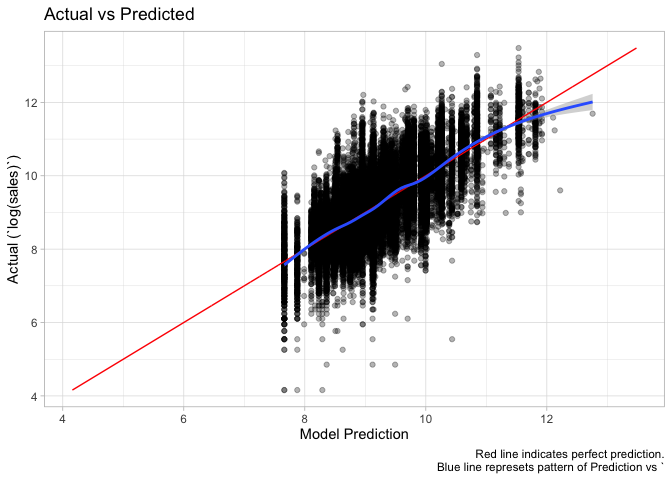

-   [Regression](#regression)
    -   [Results](#results)
    -   [Anova Table](#anova-table)
    -   [Amount of Variation Explained](#amount-of-variation-explained)
    -   [Anova to Compare Models](#anova-to-compare-models)
    -   [Plotting Effects](#plotting-effects)
    -   [Plot Assumptions](#plot-assumptions)
    -   [Residuals](#residuals)
    -   [Interpretation (OJ example)](#interpretation-oj-example)
        -   [Elasticities (i.e. regression
            slopes)](#elasticities-i.e.regression-slopes)
    -   [Regression Coefficient
        Uncertainty](#regression-coefficient-uncertainty)
    -   [Out of Sample R-Squared](#out-of-sample-r-squared)

This data contains weekly prices and sales for three OJ brands, as well
as an indicator `feature` showing whether each brand was advertised (in
store or flyer) that week. (Business Data Science, pg 43).

``` r
weekly_oj_sales <- read.csv('data/oj.csv') %>% rename(featured = feat) %>% mutate(featured = featured == 1)
head(weekly_oj_sales)
```

    ##   sales price     brand featured
    ## 1  8256  3.87 tropicana    FALSE
    ## 2  6144  3.87 tropicana    FALSE
    ## 3  3840  3.87 tropicana    FALSE
    ## 4  8000  3.87 tropicana    FALSE
    ## 5  8896  3.87 tropicana    FALSE
    ## 6  7168  3.87 tropicana    FALSE

``` r
weekly_oj_sales %>%
    ggplot(aes(x=price, y=sales, color = brand)) +
    geom_point(alpha=0.1) +
    geom_smooth() +
    facet_wrap(~ featured)
```


``` r
weekly_oj_sales %>%
    ggplot(aes(x=log(price), y=log(sales), color = brand)) +
    geom_point(alpha=0.1) +
    geom_smooth() +
    facet_wrap(~ featured)
```


``` r
weekly_oj_sales %>%
    ggplot(aes(x=log(price), y=log(sales), color = brand)) +
    geom_point(alpha=0.1) +
    geom_smooth(method = 'lm') +
    facet_wrap(~ featured)
```


-   Sales decrease as prices increase.

Regression
==========

Results
-------

``` r
reg_results <- lm(log(sales) ~ log(price)*brand*featured, data = weekly_oj_sales)
summary(reg_results)
```

    ## 
    ## Call:
    ## lm(formula = log(sales) ~ log(price) * brand * featured, data = weekly_oj_sales)
    ## 
    ## Residuals:
    ##     Min      1Q  Median      3Q     Max 
    ## -4.8893 -0.4290 -0.0091  0.4125  3.2368 
    ## 
    ## Coefficients:
    ##                                          Estimate Std. Error t value
    ## (Intercept)                              10.40658    0.02335 445.668
    ## log(price)                               -2.77415    0.03883 -71.445
    ## brandminute.maid                          0.04720    0.04663   1.012
    ## brandtropicana                            0.70794    0.05080  13.937
    ## featuredTRUE                              1.09441    0.03810  28.721
    ## log(price):brandminute.maid               0.78293    0.06140  12.750
    ## log(price):brandtropicana                 0.73579    0.05684  12.946
    ## log(price):featuredTRUE                  -0.47055    0.07409  -6.351
    ## brandminute.maid:featuredTRUE             1.17294    0.08196  14.312
    ## brandtropicana:featuredTRUE               0.78525    0.09875   7.952
    ## log(price):brandminute.maid:featuredTRUE -1.10922    0.12225  -9.074
    ## log(price):brandtropicana:featuredTRUE   -0.98614    0.12411  -7.946
    ##                                                      Pr(>|t|)    
    ## (Intercept)                              < 0.0000000000000002 ***
    ## log(price)                               < 0.0000000000000002 ***
    ## brandminute.maid                                        0.311    
    ## brandtropicana                           < 0.0000000000000002 ***
    ## featuredTRUE                             < 0.0000000000000002 ***
    ## log(price):brandminute.maid              < 0.0000000000000002 ***
    ## log(price):brandtropicana                < 0.0000000000000002 ***
    ## log(price):featuredTRUE                    0.0000000002171102 ***
    ## brandminute.maid:featuredTRUE            < 0.0000000000000002 ***
    ## brandtropicana:featuredTRUE                0.0000000000000019 ***
    ## log(price):brandminute.maid:featuredTRUE < 0.0000000000000002 ***
    ## log(price):brandtropicana:featuredTRUE     0.0000000000000020 ***
    ## ---
    ## Signif. codes:  0 '***' 0.001 '**' 0.01 '*' 0.05 '.' 0.1 ' ' 1
    ## 
    ## Residual standard error: 0.695 on 28935 degrees of freedom
    ## Multiple R-squared:  0.5354, Adjusted R-squared:  0.5352 
    ## F-statistic:  3031 on 11 and 28935 DF,  p-value: < 0.00000000000000022

``` r
names(reg_results)
```

    ##  [1] "coefficients"  "residuals"     "effects"       "rank"         
    ##  [5] "fitted.values" "assign"        "qr"            "df.residual"  
    ##  [9] "contrasts"     "xlevels"       "call"          "terms"        
    ## [13] "model"

``` r
coefficients(reg_results)
```

    ##                              (Intercept) 
    ##                              10.40657579 
    ##                               log(price) 
    ##                              -2.77415436 
    ##                         brandminute.maid 
    ##                               0.04720317 
    ##                           brandtropicana 
    ##                               0.70794089 
    ##                             featuredTRUE 
    ##                               1.09440665 
    ##              log(price):brandminute.maid 
    ##                               0.78293210 
    ##                log(price):brandtropicana 
    ##                               0.73579299 
    ##                  log(price):featuredTRUE 
    ##                              -0.47055331 
    ##            brandminute.maid:featuredTRUE 
    ##                               1.17294361 
    ##              brandtropicana:featuredTRUE 
    ##                               0.78525237 
    ## log(price):brandminute.maid:featuredTRUE 
    ##                              -1.10922376 
    ##   log(price):brandtropicana:featuredTRUE 
    ##                              -0.98614093

``` r
coefficients(reg_results)['log(price)']
```

    ## log(price) 
    ##  -2.774154

``` r
reg_results %>%
    tidy() %>%
    mutate(conf.low = estimate - (2 * std.error),
           conf.high = estimate + (2 * std.error)) %>%
    filter(term != '(Intercept)') %>%
    mutate(color = case_when(
        estimate > 0 & conf.low > 0 ~ 'blue',
        estimate < 0 & conf.high < 0 ~ 'red',
        TRUE ~ 'grey'
    )) %>%
    mutate(term = fct_reorder(term, estimate)) %>%
    ggplot(aes(x = term, y=estimate, color=color)) +
    geom_point() +
    scale_color_manual(values=c('blue','dark grey','red')) +
    geom_errorbar(aes(ymin = conf.low, ymax = conf.high)) +
    coord_flip() +
    theme(legend.position = 'none') +
    labs(title = 'Regression Coefficients')
```


``` r
actual_values <- log(weekly_oj_sales$sales)
predicted_values <- predict(reg_results) %>% as.numeric()
residual_values <- residuals(reg_results) %>% as.numeric()

equal <- function(.expected, .actual, .precision=6) {
    round(.expected, .precision) == round(.actual, .precision)
}
all(equal(actual_values - predicted_values, residual_values))
```

    ## [1] TRUE

Anova Table
-----------

<a href="https://stats.stackexchange.com/questions/115304/interpreting-output-from-anova-when-using-lm-as-input" class="uri">https://stats.stackexchange.com/questions/115304/interpreting-output-from-anova-when-using-lm-as-input</a>
<a href="https://stats.stackexchange.com/questions/49924/how-does-anova-lm-in-r-calculates-sum-sq" class="uri">https://stats.stackexchange.com/questions/49924/how-does-anova-lm-in-r-calculates-sum-sq</a>
<a href="http://rinterested.github.io/statistics/anova_of_OLS_models.html" class="uri">http://rinterested.github.io/statistics/anova_of_OLS_models.html</a>

Why use anova?

The Anova Table can be used to calculate the percent of “explained
variance” of the model.

Also, from
<a href="https://stats.stackexchange.com/questions/115304/interpreting-output-from-anova-when-using-lm-as-input" class="uri">https://stats.stackexchange.com/questions/115304/interpreting-output-from-anova-when-using-lm-as-input</a>

> First of all, you may be perfectly satisfied with the summary output,
> and that’s fine. However, the ANOVA table may offer some advantages.
>
> First, if you have a categorical / factor variable with more than two
> levels, the summary output is hard to interpret. It will give you
> tests of individual levels against the reference level, but won’t give
> you a test of the factor as a whole.
>
> Another reason you might prefer to look at an ANOVA table is that it
> allows you to use information about the possible associations between
> your independent variables and

``` r
anova_table <- reg_results %>%
    anova() %>%
    tidy() %>%
    mutate(p.value = round(p.value, 5)) %>%
    arrange(term)
anova_table
```

    ## # A tibble: 8 x 6
    ##   term                         df   sumsq   meansq statistic p.value
    ##   <chr>                     <int>   <dbl>    <dbl>     <dbl>   <dbl>
    ## 1 brand                         2  5593.  2797.       5790.        0
    ## 2 brand:featured                2   216.   108.        223.        0
    ## 3 featured                      1  3650.  3650.       7557.        0
    ## 4 log(price)                    1  6261.  6261.      12963.        0
    ## 5 log(price):brand              2   150.    75.2       156.        0
    ## 6 log(price):brand:featured     2    51.8   25.9        53.7       0
    ## 7 log(price):featured           1   182.   182.        378.        0
    ## 8 Residuals                 28935 13975.     0.483      NA        NA

The sum of `sumsq` (i.e. `sum of squares`) is the same as
`Total Sum of Suares (SST)` explained in Introductory Econometrics 7e
pg. 34.

``` r
# Total Sum of Squares (SST)
(SST <- sum((log(weekly_oj_sales$sales) - mean(log(weekly_oj_sales$sales)))^2))
```

    ## [1] 30078.71

``` r
equal(SST, sum(anova_table$sumsq))
```

    ## [1] TRUE

The `sumsq` value of `Residuals` is the same as the
`Residual Sum of Squares (SSR)`

Sum of Residuals

``` r
# Residual Sum of Squares ()
(SSR <- sum(residual_values^2))
```

    ## [1] 13974.76

``` r
SSR == anova_table %>% filter(term == 'Residuals') %>% pull(sumsq)
```

    ## [1] TRUE

The `Explained Sum of Squares (SSE)` is the same as all of the `sumsq`
values added together, excluding the `Residuals` value.

`SST = SSE + SSR`

``` r
# Explained Sum of Squares (SSE)
(SSE <- sum((fitted(reg_results) - mean(log(weekly_oj_sales$sales)))^2))
```

    ## [1] 16103.96

``` r
equal(SSE, anova_table %>% filter(term != 'Residuals') %>% pull(sumsq) %>% sum())
```

    ## [1] TRUE

``` r
equal(SST, SSE + SSR)
```

    ## [1] TRUE

R-squared is simply the percent of variation explained by the model
(i.e. SSE / SST)

``` r
summary(reg_results)$r.squared
```

    ## [1] 0.5353939

``` r
SSE / SST
```

    ## [1] 0.5353939

``` r
# can also use the R2 function provided by Taddy in Business Data Science pg 72
# which will work for models beyond linear/logistic regression
R2(y=log(weekly_oj_sales$sales), pred = predicted_values, family = 'gaussian')
```

    ## [1] 0.5353939

However, R-squared will go up every time you add a new feature. So you
can artificially inflate this number.

`Adjusted R-Squared` “imposes a penatly for adding additional
independent variables to a model.” (Introductory Econometrics 7E)

``` r
summary(reg_results)$adj.r.squared
```

    ## [1] 0.5352172

Amount of Variation Explained
-----------------------------

``` r
anova_table %>%
    select(term, sumsq) %>%
    mutate(percent_variation = percent(sumsq / sum(sumsq))) %>%
    arrange(desc(sumsq))
```

    ## # A tibble: 8 x 3
    ##   term                        sumsq percent_variation
    ##   <chr>                       <dbl> <chr>            
    ## 1 Residuals                 13975.  46.46%           
    ## 2 log(price)                 6261.  20.81%           
    ## 3 brand                      5593.  18.60%           
    ## 4 featured                   3650.  12.13%           
    ## 5 brand:featured              216.  0.72%            
    ## 6 log(price):featured         182.  0.61%            
    ## 7 log(price):brand            150.  0.50%            
    ## 8 log(price):brand:featured    51.8 0.17%

``` r
plot_regression_variance_explained(reg_results)
```


Anova to Compare Models
-----------------------

<a href="https://bookdown.org/ndphillips/YaRrr/comparing-regression-models-with-anova.html" class="uri">https://bookdown.org/ndphillips/YaRrr/comparing-regression-models-with-anova.html</a>

> To compare the fits of two models, you can use the anova() function
> with the regression objects as two separate arguments. The anova()
> function will take the model objects as arguments, and return an ANOVA
> testing whether the more complex model is significantly better at
> capturing the data than the simpler model. If the resulting p-value is
> sufficiently low (usually less than 0.05), we conclude that the more
> complex model is significantly better than the simpler model, and thus
> favor the more complex model. If the p-value is not sufficiently low
> (usually greater than 0.05), we should favor the simpler model.

(This only make statistical sense if the models are nested.)

``` r
anova(
      # simple model
      lm(log(sales) ~ log(price)+brand+featured, data = weekly_oj_sales),
      # more complex model (interaction)
      lm(log(sales) ~ log(price)*brand*featured, data = weekly_oj_sales)
)
```

    ## Analysis of Variance Table
    ## 
    ## Model 1: log(sales) ~ log(price) + brand + featured
    ## Model 2: log(sales) ~ log(price) * brand * featured
    ##   Res.Df   RSS Df Sum of Sq      F                Pr(>F)    
    ## 1  28942 14575                                              
    ## 2  28935 13975  7    600.48 177.61 < 0.00000000000000022 ***
    ## ---
    ## Signif. codes:  0 '***' 0.001 '**' 0.01 '*' 0.05 '.' 0.1 ' ' 1

In this case, we conclude that the more complex model is significantly
better than the simpler model, and thus favor the more complex model.

Plotting Effects
----------------

``` r
#install.packages('effects')
plot(effects::effect(c('log(price)', 'brand'), reg_results))
```


Plot Assumptions
----------------

``` r
plot(reg_results)
```


``` r
plot_actual_vs_predicted(reg_results)
```



``` r
plot_residual_vs_predicted(model=reg_results)
```


``` r
plot_residual_vs_variable(model=reg_results,
                          predictor = 'price',
                          dataset = weekly_oj_sales %>% mutate(`log(price)` = log(price)))
```


Residuals
---------

Residuals contain infomratino that the model doesn’t pick up.

Example

``` r
price_regression <- lm(log(price) ~ brand, data=weekly_oj_sales)
# the residuals are log(weekly_oj_sales$price) - predict(price_regression, newdata=weekly_oj_sales)
price_residuals <- residuals(price_regression)
# remember, residuals contain the information
coef(lm(log(sales) ~ price_residuals, data=weekly_oj_sales))['price_residuals']
```

    ## price_residuals 
    ##       -3.138691

Since residuals contain the information tha the model doesn’t pick up,
these residuals contain price information after removing the effects of
brand. If we run a regression on `log(sales)` using these residuals, the
coefficient should match what we would get for the price coefficient if
we ran a regression predicting `log(sales)` from `log(price)` and
`brand`, since both refer to `log(price)`’s effect on `log(sales)` after
removing the effects of `brand` i.e. "controlling for `brand`.

``` r
coef(lm(log(sales) ~ log(price) + brand, data=weekly_oj_sales))['log(price)']
```

    ## log(price) 
    ##  -3.138691

Interpretation (OJ example)
---------------------------

### Elasticities (i.e. regression slopes)

`log(sales) = intercept + log(price) + e` gives a regression line
describing the expected sales given price. This is the price elasticity
of sales (i.e. elasticity of sales based on price).

``` r
reg_results <- lm(log(sales) ~ log(price), data = weekly_oj_sales)
get_regression_equation(reg_results)
```

    ## [1] "log(sales) = 10.42(Intercept) + -1.6log(price) + error"

``` r
(log_price_coefficient <- coef(reg_results)['log(price)'])
```

    ## log(price) 
    ##  -1.601307

This is an example of a log-log model, which have an interpretation of

> sales increase by B% for every 1% increase in price (Business Data
> Science pg. 45-47)

Where `B` is the coefficient on price.

So `sales` drop (i.e. increase by negative coefficient) by about `1.6%`
for every `1%` increase in `price`.

``` r
weekly_oj_sales %>%
    ggplot(aes(x=log(price), y=log(sales))) +
    geom_point(alpha=0.2) +
    geom_smooth(method='lm')
```


------------------------------------------------------------------------

`log(sales) = intercept + log(price) + brand + e`, below, gives a
regression line that has a different intercept for each brand, but the
same price elasticities. This equation says “even though all brand sales
have the same elasticity to price, at the same price they will have
different expected sales.” i.e. they have the same regression slope.

``` r
reg_results <- lm(log(sales) ~ log(price) + brand, data = weekly_oj_sales)

price_elasticity <- coef(reg_results)['log(price)']

dominicks_intercept <- coefficients(reg_results)['(Intercept)']
minute_maid_intercept <- coefficients(reg_results)['(Intercept)'] + coefficients(reg_results)['brandminute.maid']
tropicana_intercept <- coefficients(reg_results)['(Intercept)'] + coefficients(reg_results)['brandtropicana']

get_regression_equation(reg_results)
```

    ## [1] "log(sales) = 10.83(Intercept) + -3.14log(price) + 0.87brandminute.maid + 1.53brandtropicana + error"

In this example, we see that when we control for brand, `sales` are
expected to drop by about `3.1%` for every `1%` increase in `price`
across all brands (i.e. each brand has the same slope).

Each brand is allowed to have it’s own intercept, meaning that “even
though all brand sales have the same elasticity to price, at the same
price they will have different expected sales.” (BDS pg 46)

The intercept gives the value for `Dominick`’s `log-sales` at a
`log-price` of `0` (i.e. `log(1) == 0` so intercept gives expected
log-sales at a price of `$1`). In other words, when all other variables
have a value of zero (i.e. `log(price)` = `0`, `brandminute.maid` = `0`,
and `brandtropicana` = `0`).

-   Expected Log-Sales for Dominicks at $1 (i.e. log(1) == 0):
    `10.8288216`
-   Expected Log-Sales for Minute Maid at $1 (i.e. log(1) == 0):
    `11.6989962`
-   Expected Log-Sales for Tropicana at $1 (i.e. log(1) == 0):
    `12.3587643`

``` r
weekly_oj_sales %>%
    ggplot(aes(x=log(price), y=log(sales), color=brand)) +
    geom_point(alpha=0.2) +
    geom_abline(slope = price_elasticity, intercept = dominicks_intercept, color='red', size=1.5) +
    geom_abline(slope = price_elasticity, intercept = minute_maid_intercept, color='green', size=1.5) +
    geom_abline(slope = price_elasticity, intercept = tropicana_intercept, color='blue', size=1.5)
```


As mentioned, all brands in this model share that same elasticity
(regression slope). “This is unrealistic: money is less of an issue for
Tropicana customer than it is for the average Dominick’s customer.” (BDS
pg 47)

------------------------------------------------------------------------

`log(sales) = intercept + log(price) + brand + log(price)*brand + e`
allows us to add an interaction term.

The R regression shorthand is: `log(sales) ~ log(price) * brand`).

The result is a separate intercept for each brand (which we had in the
last model) as well as a separate slope (elasticity) for each brand.

``` r
reg_results <- lm(log(sales) ~ log(price) * brand, data = weekly_oj_sales) # same as lm(log(sales) ~ log(price) + brand + log(price)*brand, data = weekly_oj_sales)

dominicks_price_elasticity <- coef(reg_results)['log(price)']
minute_maid_price_elasticity <- coef(reg_results)['log(price)'] + coef(reg_results)['log(price):brandminute.maid']
tropicana_price_elasticity <- coef(reg_results)['log(price)'] + coef(reg_results)['log(price):brandtropicana']

get_regression_equation(reg_results)
```

    ## [1] "log(sales) = 10.95(Intercept) + -3.38log(price) + 0.89brandminute.maid + 0.96brandtropicana + 0.06log(price):brandminute.maid + 0.67log(price):brandtropicana + error"

Now it no longer makes sense to talk about an overall elasticity number,
but rather elasticity for each brand.

-   Elasticity for Dominicks: `-3.3775296` (`sales` are expected to drop
    by about `3.4%` for every `1%` increase in `price`)
-   Intercept for Minute Maid: `-3.3207349` (`sales` are expected to
    drop by about `3.3%` for every `1%` increase in `price`)
-   Intercept for Tropicana: `-2.7117688` (`sales` are expected to drop
    by about `2.7%` for every `1%` increase in `price`)

``` r
weekly_oj_sales %>%
    ggplot(aes(x=log(price), y=log(sales), color=brand)) +
    geom_point(alpha=0.2) +
    geom_smooth(method='lm')
```


------------------------------------------------------------------------

Now let’s look at the affect of advertising using the `featured` dummy
variable, “indicating that a given brand was promoted with either an
in-store display promo or a flier ad during the week that sales and
prices were recorded. The ads can increase sales at all prices, and they
can change the price sensitivity, and they can do both of these things
in a brand-specific manner.” (BDS pg 48)

We add a 3-way interaction between price, brand, and featured; meaning
that each brand will have different elasticities and intercepts, which
will be different for featured vs not-featured.

``` r
reg_results <- lm(log(sales) ~ log(price) * brand * featured, data = weekly_oj_sales)

format_elasticity <- function(.x) {
    paste0(round(.x, 1), '%')
}

dominicks_not_featured_price_elasticity <- format_elasticity(coef(reg_results)['log(price)'])
dominicks_featured_price_elasticity <- format_elasticity(coef(reg_results)['log(price)'] + coef(reg_results)['log(price):featuredTRUE'])

# relevant coefficients
# 'log(price)'
# 'log(price):brandminute.maid'
# 'log(price):brandminute.maid:featuredTRUE'
# 'log(price):featuredTRUE'
minute_maid_not_featured_price_elasticity <- coef(reg_results)['log(price)'] + coef(reg_results)['log(price):brandminute.maid']
minute_maid_featured_price_elasticity <- format_elasticity(minute_maid_not_featured_price_elasticity + 
                                                               coef(reg_results)['log(price):brandminute.maid:featuredTRUE'] +
                                                               coef(reg_results)['log(price):featuredTRUE'])
minute_maid_not_featured_price_elasticity <- format_elasticity(minute_maid_not_featured_price_elasticity)

topicana_not_featured_price_elasticity <- coef(reg_results)['log(price)'] + coef(reg_results)['log(price):brandtropicana']
topicana_featured_price_elasticity <- format_elasticity(topicana_not_featured_price_elasticity +
                                                            coef(reg_results)['log(price):brandtropicana:featuredTRUE'] +
                                                            coef(reg_results)['log(price):featuredTRUE'])
topicana_not_featured_price_elasticity <- format_elasticity(topicana_not_featured_price_elasticity)

get_regression_equation(reg_results)
```

    ## [1] "log(sales) = 10.41(Intercept) + -2.77log(price) + 0.05brandminute.maid + 0.71brandtropicana + 1.09featuredTRUE + 0.78log(price):brandminute.maid + 0.74log(price):brandtropicana + -0.47log(price):featuredTRUE + 1.17brandminute.maid:featuredTRUE + 0.79brandtropicana:featuredTRUE + -1.11log(price):brandminute.maid:featuredTRUE + -0.99log(price):brandtropicana:featuredTRUE + error"

Now it no longer makes sense to talk about an overall elasticity number
for each brand, but rather elasticity per brand depending on `featured`.

| Featured | Dominick’s | Minute Maid | Tropicana |
|----------|------------|-------------|-----------|
| No       | `-2.8%`    | `-2%`       | `-2%`     |
| Yes      | `-3.2%`    | `-3.6%`     | `-3.5%`   |

``` r
weekly_oj_sales %>%
    ggplot(aes(x=log(price), y=log(sales), color=brand)) +
    geom_point(alpha=0.2) +
    geom_smooth(method='lm') +
    facet_wrap(~ featured)
```


… “It could be that the demand curve is nonlinear” ….

``` r
weekly_oj_sales %>%
    ggplot(aes(x=log(price), y=log(sales), color=brand)) +
    geom_point(alpha=0.2) +
    geom_smooth() +
    facet_wrap(~ featured)
```


Regression Coefficient Uncertainty
----------------------------------

BDS pg. 58

For example, “the usual standard errors will be wrong if there are
heteroskedastic errors” or “if there is any dependence betweeen
observations”.

“The `AER` package can be used to obtain HC standard errors with little
effort.” “It turns out that, for OLS, the parameter variance estimates
you get from the nonparametric bootstrap actually approximated by the HC
procedure. That is, you can use the HC standard errors as a fast
alternative to bootstrapping for OLS.”

Note that the HC procedure still assumes independence between
observations. (Clustered Standard errors discussed in Chapter 5 of BDS
can be used.)

``` r
library(AER)
reg_results <- lm(log(sales) ~ log(price) * brand * featured, data = weekly_oj_sales)
coefficient_variances <- vcovHC(reg_results)
coefficient_variances[1:5, 1:5]
```

    ##                    (Intercept)   log(price) brandminute.maid brandtropicana
    ## (Intercept)       0.0008883832 -0.001376418    -0.0008883832  -0.0008883832
    ## log(price)       -0.0013764177  0.002398970     0.0013764177   0.0013764177
    ## brandminute.maid -0.0008883832  0.001376418     0.0019660527   0.0008883832
    ## brandtropicana   -0.0008883832  0.001376418     0.0008883832   0.0028934356
    ## featuredTRUE     -0.0008883832  0.001376418     0.0008883832   0.0008883832
    ##                   featuredTRUE
    ## (Intercept)      -0.0008883832
    ## log(price)        0.0013764177
    ## brandminute.maid  0.0008883832
    ## brandtropicana    0.0008883832
    ## featuredTRUE      0.0023737098

“This is the sampling covariance matrix of the coefficients; variances
are along the diagonal. To get the standard error, which is the sampling
standard deviation, you need to take the square root of the diagnal
variance estimate.” BDS pg 60

``` r
coefficient_names <- colnames(coefficient_variances) %>% rtools::rt_remove_val('(Intercept)')
coefficient_starndard_errors <- map_dbl(coefficient_names, ~sqrt(coefficient_variances[ ., .]))
names(coefficient_starndard_errors) <- coefficient_names
coefficient_starndard_errors
```

    ##                               log(price) 
    ##                               0.04897928 
    ##                         brandminute.maid 
    ##                               0.04434019 
    ##                           brandtropicana 
    ##                               0.05379066 
    ##                             featuredTRUE 
    ##                               0.04872073 
    ##              log(price):brandminute.maid 
    ##                               0.06235611 
    ##                log(price):brandtropicana 
    ##                               0.06362280 
    ##                  log(price):featuredTRUE 
    ##                               0.11397218 
    ##            brandminute.maid:featuredTRUE 
    ##                               0.09043499 
    ##              brandtropicana:featuredTRUE 
    ##                               0.09262110 
    ## log(price):brandminute.maid:featuredTRUE 
    ##                               0.15541262 
    ##   log(price):brandtropicana:featuredTRUE 
    ##                               0.14357603

``` r
reg_results %>%
    tidy() %>%
    filter(term != '(Intercept)') %>%
    dplyr::select(term, `std.error`) %>%
    rename(original_standard_errors = std.error) %>%
    mutate(new_standard_errors = coefficient_starndard_errors,
           perc_diff = percent((coefficient_starndard_errors - original_standard_errors) / original_standard_errors))
```

    ## # A tibble: 11 x 4
    ##    term                        original_standard_er… new_standard_err… perc_diff
    ##    <chr>                                       <dbl>             <dbl> <chr>    
    ##  1 log(price)                                 0.0388            0.0490 26.14%   
    ##  2 brandminute.maid                           0.0466            0.0443 -4.91%   
    ##  3 brandtropicana                             0.0508            0.0538 5.89%    
    ##  4 featuredTRUE                               0.0381            0.0487 27.86%   
    ##  5 log(price):brandminute.maid                0.0614            0.0624 1.55%    
    ##  6 log(price):brandtropicana                  0.0568            0.0636 11.94%   
    ##  7 log(price):featuredTRUE                    0.0741            0.114  53.83%   
    ##  8 brandminute.maid:featuredT…                0.0820            0.0904 10.35%   
    ##  9 brandtropicana:featuredTRUE                0.0987            0.0926 -6.20%   
    ## 10 log(price):brandminute.mai…                0.122             0.155  27.13%   
    ## 11 log(price):brandtropicana:…                0.124             0.144  15.69%

Out of Sample R-Squared
-----------------------

``` r
reg_results <- lm(log(sales) ~ log(price) * brand * featured, data = weekly_oj_sales)
(in_sample_r2 <- R2(y=log(weekly_oj_sales$sales), pred = predict(reg_results), family = 'gaussian'))
```

    ## [1] 0.5353939

``` r
num_records <- nrow(weekly_oj_sales)
k_folds <- 10
fold_id <- sample.int(k_folds, num_records, replace = TRUE)
oos_validation <- data.frame(fold = 1:k_folds, r_squared_in_sample=rep(NA, k_folds), r_squared_out_sample=rep(NA, k_folds))

for(fold in 1:k_folds) {
    train_indices <- which(fold_id != fold)
    
    fold_model <- lm(log(sales) ~ log(price) * brand * featured, data = weekly_oj_sales[train_indices,])
    
    in_sample_actuals <- log(weekly_oj_sales[train_indices, ]$sales)
    in_sample_predictions <- predict(fold_model)
    
    out_sample_actuals <- log(weekly_oj_sales[-train_indices,]$sales)
    out_sample_predictions <- predict(fold_model, newdata = weekly_oj_sales[-train_indices,])
    
    oos_validation[fold, 'r_squared_in_sample'] <- R2(y=in_sample_actuals, pred=in_sample_predictions, family = 'gaussian')
    oos_validation[fold, 'r_squared_out_sample'] <- R2(y=out_sample_actuals, pred=out_sample_predictions, family = 'gaussian')
}
oos_validation %>%
    mutate(percent_diff = (r_squared_out_sample - r_squared_in_sample) / r_squared_in_sample)
```

    ##    fold r_squared_in_sample r_squared_out_sample percent_diff
    ## 1     1           0.5317954            0.5657359  0.063822476
    ## 2     2           0.5341069            0.5466151  0.023418860
    ## 3     3           0.5361390            0.5279182 -0.015333333
    ## 4     4           0.5358617            0.5308910 -0.009276109
    ## 5     5           0.5366611            0.5239387 -0.023706601
    ## 6     6           0.5354246            0.5348576 -0.001058906
    ## 7     7           0.5358583            0.5309191 -0.009217261
    ## 8     8           0.5374287            0.5158148 -0.040217218
    ## 9     9           0.5344993            0.5434769  0.016796176
    ## 10   10           0.5363854            0.5257841 -0.019764359

``` r
mean(oos_validation$r_squared_out_sample)
```

    ## [1] 0.5345951

``` r
paste0(round((mean(oos_validation$r_squared_out_sample) - in_sample_r2) / in_sample_r2 * 100, 2), '%')
```

    ## [1] "-0.15%"

This isn’t too bad actually, lets look at an example that is much worse
(from BDS pg 72)

``` r
semi_conductors <- read.csv('data/semiconductor.csv')
reg_results <- glm(FAIL ~ ., data=semi_conductors, family='binomial')
(in_sample_r2 <- R2(y=semi_conductors$FAIL, pred = predict(reg_results, type='response'), family = 'binomial'))
```

    ## [1] 0.5621432

``` r
num_records <- nrow(semi_conductors)
k_folds <- 10
fold_id <- sample.int(k_folds, num_records, replace = TRUE)
oos_validation <- data.frame(fold = 1:k_folds, r_squared_in_sample=rep(NA, k_folds), r_squared_out_sample=rep(NA, k_folds))

for(fold in 1:k_folds) {
    train_indices <- which(fold_id != fold)
    
    fold_model <- suppressWarnings(glm(FAIL ~ ., data=semi_conductors[train_indices, ], family='binomial'))
    
    in_sample_actuals <- semi_conductors[train_indices, ]$FAIL
    in_sample_predictions <- predict(fold_model, type='response')
    
    out_sample_actuals <- semi_conductors[-train_indices,]$FAIL
    out_sample_predictions <- predict(fold_model, newdata = semi_conductors[-train_indices,], type='response')
    
    oos_validation[fold, 'r_squared_in_sample'] <- R2(y=in_sample_actuals, pred=in_sample_predictions, family = 'binomial')
    oos_validation[fold, 'r_squared_out_sample'] <- R2(y=out_sample_actuals, pred=out_sample_predictions, family = 'binomial')
}
oos_validation %>%
    mutate(percent_diff = (r_squared_out_sample - r_squared_in_sample) / r_squared_in_sample)
```

    ##    fold r_squared_in_sample r_squared_out_sample percent_diff
    ## 1     1          -6.0445365          -13.0614188    1.1608636
    ## 2     2           0.6907772           -7.0989702  -11.2767872
    ## 3     3           0.5920358           -0.9017796   -2.5231842
    ## 4     4           0.6490839           -3.5151832   -6.4156065
    ## 5     5           0.6280984           -2.9458886   -5.6901708
    ## 6     6           0.6664260           -5.9389813   -9.9116886
    ## 7     7          -6.7871241          -13.5552043    0.9971941
    ## 8     8           0.5867978           -2.9263651   -5.9870072
    ## 9     9           0.6690095           -5.1265398   -8.6628806
    ## 10   10           0.5910584           -2.6253586   -5.4417921

``` r
in_sample_r2
```

    ## [1] 0.5621432

``` r
mean(oos_validation$r_squared_out_sample)
```

    ## [1] -5.769569

``` r
paste0(round((mean(oos_validation$r_squared_out_sample) - in_sample_r2) / in_sample_r2 * 100, 2), '%')
```

    ## [1] "-1126.35%"
