-   [Overview](#overview)
-   [Resources](#resources)
-   [Packages](#packages)
    -   [statistical packages](#statistical-packages)
    -   [base packages](#base-packages)
    -   [Settings](#settings)
-   [Chapter 2](#chapter-2)
    -   [Bayesian Updating](#bayesian-updating)
    -   [Grid Approximation](#grid-approximation)
    -   [Quadratic Approximation
        (`quap`)](#quadratic-approximation-quap)
    -   [MCMC](#mcmc)
    -   [Homework](#homework)
-   [Chapter 3](#chapter-3)

Overview
========

This document includes examples and exercises from
`Statistical Rethinking, Second Edition` by Richard McElreath.

This is a sandbox to experiment with the concepts. Most of the code is
from the book
(<a href="http://xcelab.net/rmpubs/sr2/code.txt" class="uri">http://xcelab.net/rmpubs/sr2/code.txt</a>)
and the links below that provide additional references.

Resources
=========

-   [Book website](http://xcelab.net/rm/statistical-rethinking/)
-   [Course Slides and
    Videos](https://github.com/rmcelreath/stat_rethinking_2020#calendar--topical-outline)
    -   [2019](https://github.com/rmcelreath/statrethinking_winter2019)
-   [Code](http://xcelab.net/rmpubs/sr2/code.txt)
-   [Homework
    Solutions](https://github.com/rmcelreath/stat_rethinking_2020/tree/main/homework)
    -   [2019](https://github.com/rmcelreath/statrethinking_winter2019/tree/master/homework)
-   [Stan &
    Tidyverse](https://vincentarelbundock.github.io/rethinking2/)
-   [brms & Tidier](https://bookdown.org/content/4857)
    -   [brms](https://github.com/paul-buerkner/brms)
-   [Python](https://github.com/pymc-devs/resources/tree/master/Rethinking_2)

Packages
========

statistical packages
--------------------

``` r
# install.packages(c('coda', 'mvtnorm', 'devtools', 'dagitty'))
# library(devtools)
# devtools::install_github('rmcelreath/rethinking')
library(rethinking)
library(rstan)
library(rstanarm)
#install.packages('brms')
library(brms)
library(bayesplot)
library(loo)
```

base packages
-------------

``` r
library(broom)
library(broom.mixed)

library(tidyverse)
library(ggplot2)
library(scales)
library(ggridges)
```

Settings
--------

``` r
theme_set(theme_light())
options(scipen=999) # non-scientific notation
options(dplyr.summarise.inform=F)
```

Chapter 2
=========

Bayesian Updating
-----------------

`dbinom` gives the probability of observing x “successes” for a given
sample size and probability of observing x.

``` r
dbinom(x=5, size=10, prob=0.5)
```

    ## [1] 0.2460938

So if we say the probability of a “successful event” is 50%
(e.g. flipping a coin and landing on heads) and that we are going to
flip the coin 10 times (i.e. sample size of 10) the probability we will
get exactly 5 heads (i.e. successes) is 24.6%.

``` r
sum(dbinom(x=0:10, size=10, prob=0.5))
```

    ## [1] 1

``` r
plot(x=0:10, y=dbinom(x=0:10, size=10, prob=0.5), type='h')
```

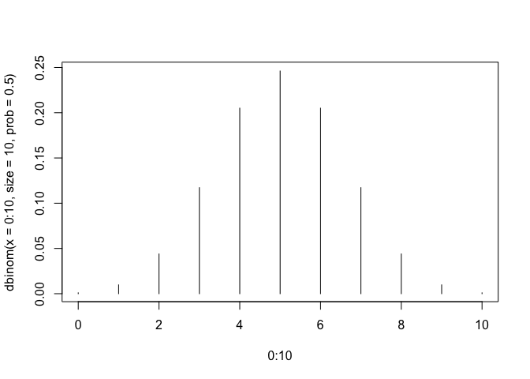

This is the probability distribution of observing `x` heads for `10`
flips. (All numbers sum to `1`.)

But we don’t want the probability distrubtion of seeing heads
(i.e. assuming a constant 50% prob of flipping heads), which is what the
graph above shows.

We want the **relative** probability/plausibility of seeing six heads
out of 9 flips, assuming all sorts of probablities of flipping heads.

Or to tie into the example, we want the **relative**
probability/plausibility of seeing six W’s heads out of globe tosses, at
each possible value of `p`, the proportion of water, which takes on
possible values of `0`-`1` (i.e. no water to all water.).

So if we have `dbinom(x=6, size=9, prob = X)` over a range of
probabilities, as we do below, the area under the curve will not sum to
1. This is not a probability distribution it is a distribution of
relative plausibilities.

``` r
most_plausible <- optimize(function (.x) -dbinom(x=6, size=9, prob = .x),
                           c(0, 1),
                           tol = 0.0001)
most_plausible
```

    ## $minimum
    ## [1] 0.6666774
    ## 
    ## $objective
    ## [1] -0.2731291

``` r
dbinom(x=6, size=9, prob = most_plausible$minimum)
```

    ## [1] 0.2731291

``` r
sum(dbinom(0:2, 2, 0.5))
```

    ## [1] 1

``` r
curve( dbinom(x=2, size=3, prob=x), 0, 1, lty=3, col='gray', xlab = '', ylab='')
curve( dbinom(x=5, size=8, prob=x), 0, 1, add=T, lty=2, xlab = '', ylab='')
curve( dbinom(x=6, size=9, prob=x), 0, 1, add=T, col='blue', xlab = '', ylab='')
abline(v=most_plausible$minimum, col="red", lty=2, lwd=3)
title(xlab="Probability of Water", ylab="dbinom(x=6, size=9, prob=x) (plausibility)")
```

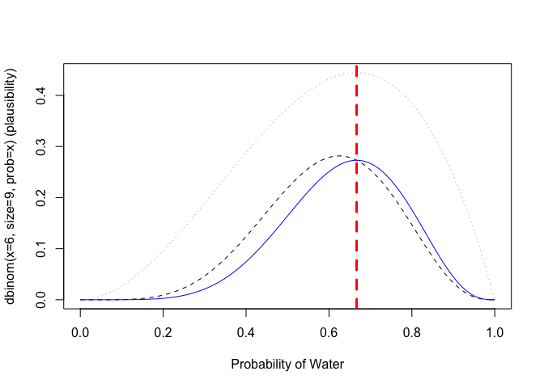

We can standardize the relative plausibilities (based on the fact that
curve plots 101 points) by calculating dbinom for a given x, size, and
prob, and summing the dbinom for the same x & size over 101 points
points between 0 and 1.

The
`sum(dbinom(x=.x, size=.size, prob=seq(0, 1, length.out = .length.out)`
part is the `P(W, L)` i.e. `average probability of the data` the thing
the standardizes the posterior.

Now the values will add up to 1

``` r
dbinom_density_to_probability <- function(.x, .size, .prob, .length.out=101) {
    dbinom(x=.x, size=.size, prob=.prob) / sum(dbinom(x=.x, size=.size, prob=seq(0, 1, length.out = .length.out)))
}
sum(dbinom_density_to_probability(.x=6, .size=9, .prob = seq(0, 1, length.out = 101)))
```

    ## [1] 1

We see that more information now makes the density higher. The graph is
now consistent with the bottom right fiture on page 30.

``` r
curve( dbinom_density_to_probability(.x=6, .size=9, .prob = x), 0, 1, lwd=2, col='blue', xlab = '', ylab='')
curve( dbinom_density_to_probability(.x=5, .size=8, .prob = x), 0, 1, add=T, lty=2, xlab = '', ylab='')
curve( dbinom_density_to_probability(.x=2, .size=3, .prob = x), 0, 1, add=T, lty=2, col='gray', xlab = '', ylab='')
abline(v=most_plausible$minimum, col="red", lty=2, lwd=3)
title(xlab="Probability of Water", ylab="dbinom(x=6, size=9, prob=x) (posterior probablity)")
```

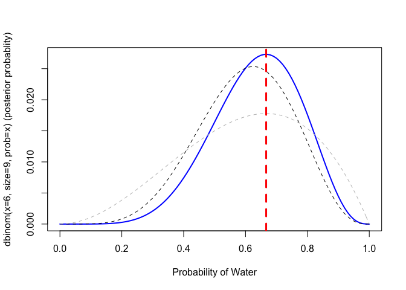

from
<a href="https://bookdown.org/content/4857/small-worlds-and-large-worlds.html#building-a-model" class="uri">https://bookdown.org/content/4857/small-worlds-and-large-worlds.html#building-a-model</a>

``` r
d <- tibble(toss = c("w", "l", "w", "w", "w", "l", "w", "l", "w")) %>%
    mutate(n_trials  = 1:9,
           n_success = cumsum(toss == "w"))
d
```

    ## # A tibble: 9 x 3
    ##   toss  n_trials n_success
    ##   <chr>    <int>     <int>
    ## 1 w            1         1
    ## 2 l            2         1
    ## 3 w            3         2
    ## 4 w            4         3
    ## 5 w            5         4
    ## 6 l            6         4
    ## 7 w            7         5
    ## 8 l            8         5
    ## 9 w            9         6

``` r
sequence_length <- 50
d <- d %>% 
  expand(nesting(n_trials, toss, n_success), 
         p_water = seq(from = 0, to = 1, length.out = sequence_length)) %>% 
  group_by(p_water) %>% 
 # you can learn more about lagging here: https://www.rdocumentation.org/packages/stats/versions/3.5.1/topics/lag or here: https://dplyr.tidyverse.org/reference/lead-lag.html
  mutate(lagged_n_trials  = lag(n_trials, k = 1),
         lagged_n_success = lag(n_success, k = 1)) %>% 
  ungroup() %>% 
  mutate(prior      = ifelse(n_trials == 1, .5,
                             dbinom(x    = lagged_n_success, 
                                    size = lagged_n_trials, 
                                    prob = p_water)),
         likelihood = dbinom(x    = n_success, 
                             size = n_trials, 
                             prob = p_water),
         strip      = str_c("n = ", n_trials)) %>% 
  # the next three lines allow us to normalize the prior and the likelihood, 
  # putting them both in a probability metric 
  group_by(n_trials) %>% 
  mutate(prior      = prior / sum(prior),
         likelihood = likelihood / sum(likelihood))

head(d)
```

    ## # A tibble: 6 x 9
    ## # Groups:   n_trials [1]
    ##   n_trials toss  n_success p_water lagged_n_trials lagged_n_success prior
    ##      <int> <chr>     <int>   <dbl>           <int>            <int> <dbl>
    ## 1        1 w             1  0                   NA               NA  0.02
    ## 2        1 w             1  0.0204              NA               NA  0.02
    ## 3        1 w             1  0.0408              NA               NA  0.02
    ## 4        1 w             1  0.0612              NA               NA  0.02
    ## 5        1 w             1  0.0816              NA               NA  0.02
    ## 6        1 w             1  0.102               NA               NA  0.02
    ## # … with 2 more variables: likelihood <dbl>, strip <chr>

``` r
  # plot!
d %>%
  ggplot(aes(x = p_water)) +
  geom_line(aes(y = prior), 
            linetype = 2) +
  geom_line(aes(y = likelihood)) +
  scale_x_continuous("proportion water", breaks = c(0, .5, 1)) +
  scale_y_continuous("plausibility", breaks = NULL) +
  theme(panel.grid = element_blank()) +
  facet_wrap(~strip, scales = "free_y")
```

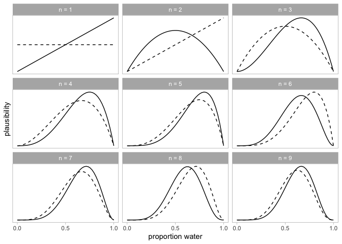

Grid Approximation
------------------

For each possible value of `p`, the proportion of water, what is the
relatively plausibility of observing the data (6 Ws in 9 tosses) for
that value of p.

``` r
## R code 2.3
# define grid
p_grid <- seq( from=0 , to=1 , length.out=20 )
# define prior
prior <- rep( 1 , 20 )
# compute likelihood at each value in grid
likelihood <- dbinom( 6 , size=9 , prob=p_grid )
```

``` r
prior
```

    ##  [1] 1 1 1 1 1 1 1 1 1 1 1 1 1 1 1 1 1 1 1 1

``` r
likelihood
```

    ##  [1] 0.000000000000 0.000001518149 0.000081850929 0.000777292279 0.003598575366
    ##  [6] 0.011160946094 0.026682986514 0.052921099148 0.090826975982 0.138341326017
    ## [11] 0.189768622794 0.236114658267 0.266611251684 0.271400561902 0.245005088648
    ## [16] 0.189768622794 0.117918117579 0.050266702076 0.008853844865 0.000000000000

``` r
sum(likelihood)  # doesn't sum to 1, not a probability distribution
```

    ## [1] 1.9001

``` r
# compute product of likelihood and prior
unstd.posterior <- likelihood * prior
# standardize the posterior, so it sums to 1
posterior <- unstd.posterior / sum(unstd.posterior)
```

``` r
sum(unstd.posterior)
```

    ## [1] 1.9001

``` r
sum(posterior)
```

    ## [1] 1

``` r
posterior
```

    ##  [1] 0.0000000000000 0.0000007989837 0.0000430771684 0.0004090796601
    ##  [5] 0.0018938873153 0.0058738728763 0.0140429377069 0.0278517435944
    ##  [9] 0.0478011546858 0.0728073906769 0.0998729638915 0.1242643298570
    ## [13] 0.1403143234142 0.1428348802869 0.1289432573813 0.0998729638915
    ## [17] 0.0620588995470 0.0264547660594 0.0046596730033 0.0000000000000

``` r
## R code 2.4
plot( p_grid , posterior , type="b" ,
    xlab="probability of water" , ylab="posterior probability" )
mtext( "20 points" )
```

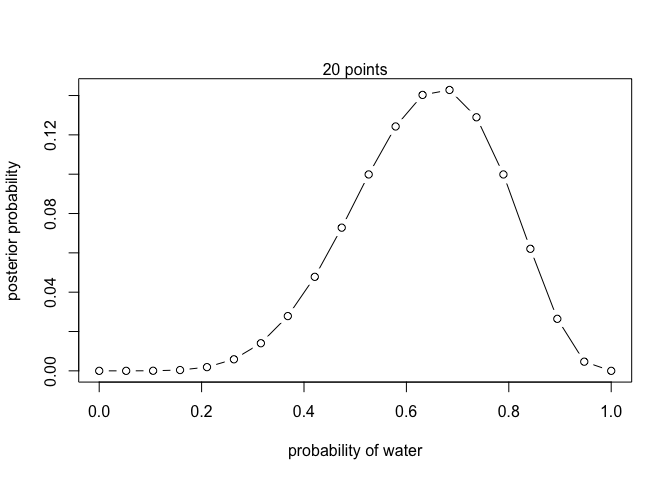

Or,
<a href="https://bookdown.org/content/4857/small-worlds-and-large-worlds.html#building-a-model" class="uri">https://bookdown.org/content/4857/small-worlds-and-large-worlds.html#building-a-model</a>

``` r
d <- tibble(p_grid = seq(from = 0, to = 1, length.out = 20),      # define grid
            prior  = 1) %>%                                       # define prior
    mutate(likelihood = dbinom(6, size = 9, prob = p_grid)) %>%   # compute likelihood at each value in grid
    mutate(unstd_posterior = likelihood * prior) %>%              # compute product of likelihood and prior
    mutate(posterior = unstd_posterior / sum(unstd_posterior))    # standardize the posterior, so it sums to 1
d
```

    ## # A tibble: 20 x 5
    ##    p_grid prior likelihood unstd_posterior   posterior
    ##     <dbl> <dbl>      <dbl>           <dbl>       <dbl>
    ##  1 0          1 0               0          0          
    ##  2 0.0526     1 0.00000152      0.00000152 0.000000799
    ##  3 0.105      1 0.0000819       0.0000819  0.0000431  
    ##  4 0.158      1 0.000777        0.000777   0.000409   
    ##  5 0.211      1 0.00360         0.00360    0.00189    
    ##  6 0.263      1 0.0112          0.0112     0.00587    
    ##  7 0.316      1 0.0267          0.0267     0.0140     
    ##  8 0.368      1 0.0529          0.0529     0.0279     
    ##  9 0.421      1 0.0908          0.0908     0.0478     
    ## 10 0.474      1 0.138           0.138      0.0728     
    ## 11 0.526      1 0.190           0.190      0.0999     
    ## 12 0.579      1 0.236           0.236      0.124      
    ## 13 0.632      1 0.267           0.267      0.140      
    ## 14 0.684      1 0.271           0.271      0.143      
    ## 15 0.737      1 0.245           0.245      0.129      
    ## 16 0.789      1 0.190           0.190      0.0999     
    ## 17 0.842      1 0.118           0.118      0.0621     
    ## 18 0.895      1 0.0503          0.0503     0.0265     
    ## 19 0.947      1 0.00885         0.00885    0.00466    
    ## 20 1          1 0               0          0

``` r
d %>% 
  ggplot(aes(x = p_grid, y = posterior)) +
  geom_point() +
  geom_line()
```

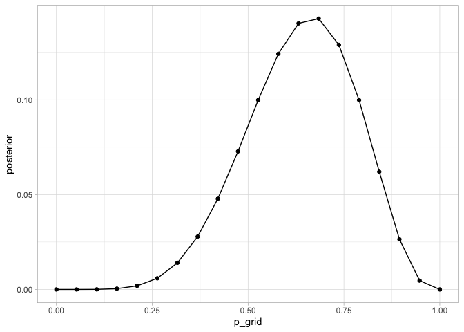

Now same thing with a different prior.

``` r
prior <- ifelse( p_grid < 0.5 , 0 , 1 )  # makes anything less than 0.5 have 0 plausibility.
#prior <- exp( -5*abs( p_grid - 0.5 ) )
```

``` r
## R code 2.3
# define grid
p_grid <- seq( from=0 , to=1 , length.out=20 )
# compute likelihood at each value in grid
likelihood <- dbinom( 6 , size=9 , prob=p_grid )
# compute product of likelihood and prior
unstd.posterior <- likelihood * prior
# standardize the posterior, so it sums to 1
posterior <- unstd.posterior / sum(unstd.posterior)
plot( p_grid , posterior , type="b" ,
    xlab="probability of water" , ylab="posterior probability" )
mtext( "20 points" )
```

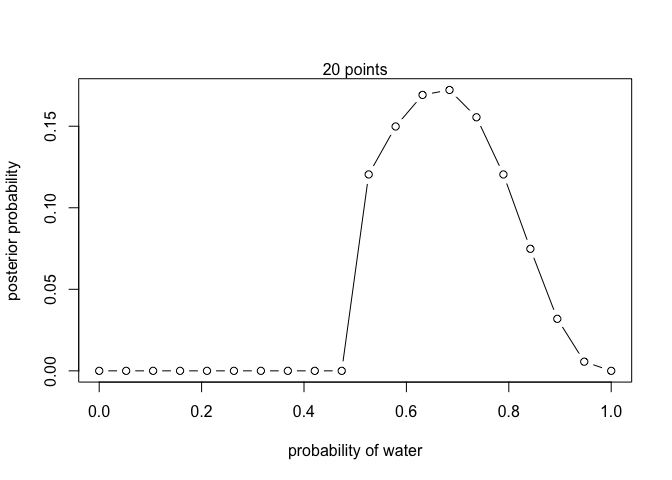

Quadratic Approximation (`quap`)
--------------------------------

Same thing from above condensed. Note that we pass the same functions to
`quap`

``` r
p_grid <- seq(0, 1, 0.01)
prior <- dunif(p_grid, 0,1)
likelihood <- dbinom(6, 9, p_grid)
posterior <- prior * likelihood / sum(prior * likelihood)
sum(posterior)
```

    ## [1] 1

``` r
plot(seq(0, 1, 0.01), dbinom(6, 9 , seq(0, 1, 0.01)) * dunif(seq(0,1,0.01), 0,1) / sum(dbinom(6, 9 , seq(0, 1, 0.01)) * dunif(seq(0,1,0.01), 0,1)))
```

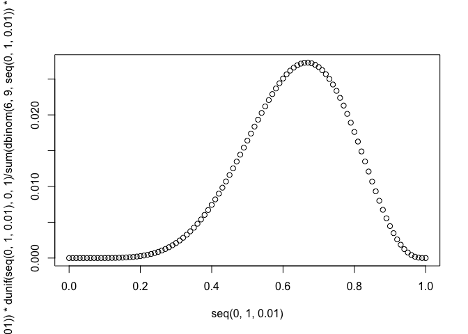

``` r
globe.qa <- quap(
    alist(
        # X ~ B(n, p), that is, X is a binomially distributed random variable, n being the total number of experiments and p the probability of each experiment yielding a successful result
        W ~ dbinom( W+L , p) ,  # binomial likelihood
        p ~ dunif(0,1)     # uniform prior
    ) ,
    data=list(W=6,L=3) 
)

# display summary of quadratic approximation
precis( globe.qa , digits = 4)
```

    ##        mean        sd     5.5%     94.5%
    ## p 0.6666663 0.1571339 0.415536 0.9177966

``` r
globe.qa <- quap(
    alist(
        W ~ dbinom( W+L , p) ,  # binomial likelihood
        p ~ dunif(0,1)     # uniform prior
    ) ,
    data=list(W=12,L=6) 
)

# display summary of quadratic approximation
precis( globe.qa , digits = 4)
```

    ##        mean        sd      5.5%     94.5%
    ## p 0.6666662 0.1111104 0.4890903 0.8442421

``` r
y <- c(1, 1, 1, 1, 1, 1, 0, 0, 0)
summary(lm(y~1))
```

    ## 
    ## Call:
    ## lm(formula = y ~ 1)
    ## 
    ## Residuals:
    ##     Min      1Q  Median      3Q     Max 
    ## -0.6667 -0.6667  0.3333  0.3333  0.3333 
    ## 
    ## Coefficients:
    ##             Estimate Std. Error t value Pr(>|t|)   
    ## (Intercept)   0.6667     0.1667       4  0.00395 **
    ## ---
    ## Signif. codes:  0 '***' 0.001 '**' 0.01 '*' 0.05 '.' 0.1 ' ' 1
    ## 
    ## Residual standard error: 0.5 on 8 degrees of freedom

``` r
set.seed(1)
print(rstanarm::stan_glm(y~1, refresh = 0), 3)
```

    ## Warning: Omitting the 'data' argument is not recommended and may not be allowed
    ## in future versions of rstanarm. Some post-estimation functions (in particular
    ## 'update', 'loo', 'kfold') are not guaranteed to work properly unless 'data' is
    ## specified as a data frame.

    ## stan_glm
    ##  family:       gaussian [identity]
    ##  formula:      y ~ 1
    ##  observations: 9
    ##  predictors:   1
    ## ------
    ##             Median MAD_SD
    ## (Intercept) 0.669  0.168 
    ## 
    ## Auxiliary parameter(s):
    ##       Median MAD_SD
    ## sigma 0.517  0.127 
    ## 
    ## ------
    ## * For help interpreting the printed output see ?print.stanreg
    ## * For info on the priors used see ?prior_summary.stanreg

``` r
prop.test(x=6, n=9, conf.level = 0.89)
```

    ## Warning in prop.test(x = 6, n = 9, conf.level = 0.89): Chi-squared approximation
    ## may be incorrect

    ## 
    ##  1-sample proportions test with continuity correction
    ## 
    ## data:  6 out of 9, null probability 0.5
    ## X-squared = 0.44444, df = 1, p-value = 0.505
    ## alternative hypothesis: true p is not equal to 0.5
    ## 89 percent confidence interval:
    ##  0.3560271 0.8893434
    ## sample estimates:
    ##         p 
    ## 0.6666667

MCMC
----

``` r
## R code 2.8
n_samples <- 1000
p <- rep( NA , n_samples )
p[1] <- 0.5
W <- 6
L <- 3
for ( i in 2:n_samples ) {
    p_new <- rnorm( 1 , p[i-1] , 0.1 )
    if ( p_new < 0 ) p_new <- abs( p_new )
    if ( p_new > 1 ) p_new <- 2 - p_new
    q0 <- dbinom( W , W+L , p[i-1] )
    q1 <- dbinom( W , W+L , p_new )
    p[i] <- ifelse( runif(1) < q1/q0 , p_new , p[i-1] )
}

## R code 2.9
dens( p , xlim=c(0,1) )
curve( dbeta( x , W+1 , L+1 ) , lty=2 , add=TRUE )
```

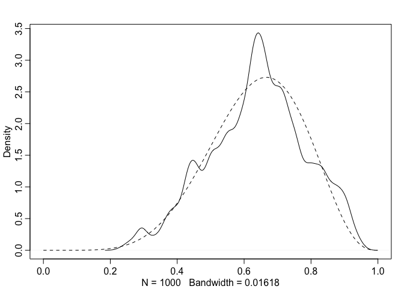

------------------------------------------------------------------------

Homework
--------

<a href="https://github.com/rmcelreath/stat_rethinking_2020/blob/main/homework/week01/week01_solutions.pdf" class="uri">https://github.com/rmcelreath/stat_rethinking_2020/blob/main/homework/week01/week01_solutions.pdf</a>

1.  Suppose the globe tossing data (Chapter 2) had turned out to be 4
    water in 15 tosses. Construct the posterior distribution, using grid
    approximation. Use the same flat prior as in the book.

``` r
# remember p_grid is the possible values of the proprortion of water
p_grid <- seq( from=0 , to=1 , length.out=1000 )
prior <- rep( 1 , 1000 )
prob_data <- dbinom( 4 , size=15 , prob=p_grid )
posterior <- prob_data * prior
posterior <- posterior / sum(posterior)
plot(p_grid, posterior)
```

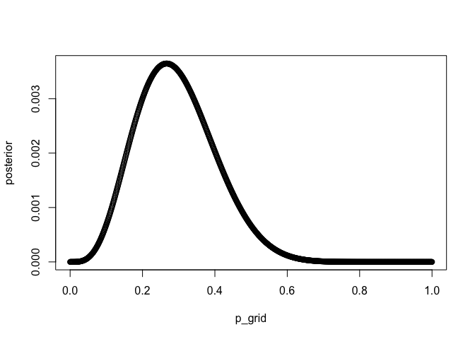

``` r
sum(posterior)
```

    ## [1] 1

> When you plot the result, the posterior will have much more mass over
> values below 0.5, since that is what the sample indicates. The
> posterior mean is about 0.30.

``` r
set.seed(1)
# p_grid is the possible values of the proprortion of water
# posterior is the probability of that proportion being correct
# we are going to sample from the possible values, relative to the probablity of each value
samples <- sample( p_grid , prob=posterior , size=1e4, replace=TRUE )
mean(samples)
```

    ## [1] 0.2933629

``` r
sd(samples)
```

    ## [1] 0.1076291

------------------------------------------------------------------------

1.  Start over in 1, but now use a prior that is zero below p = 0.5 and
    a constant above p = 0.5. This corresponds to prior information that
    a majority of the Earth’s surface is water. What difference does the
    better prior make?

``` r
p_grid <- seq( from=0 , to=1 , length.out=1000 )
prior <- c( rep( 0 , 500 ) , rep( 1 , 500 ) )
prob_data <- dbinom( 4 , size=15 , prob=p_grid )
posterior <- prob_data * prior
posterior <- posterior / sum(posterior)
plot(p_grid, posterior)
```

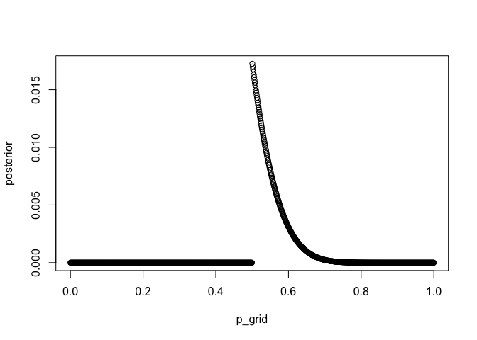

``` r
set.seed(1)
# bootstrap
samples <- sample( p_grid , prob=posterior , size=1e4, replace=TRUE )
mean(samples)
```

    ## [1] 0.549689

``` r
sd(samples)
```

    ## [1] 0.04350969

------------------------------------------------------------------------

1.  For the posterior distribution from 2, compute 89% percentile and
    HPDI intervals. Compare the widths of these intervals. Which is
    wider? Why? If you had only the information in the interval, what
    might you misunderstand about the shape of the posterior
    distribution?

``` r
quantile(samples, c(0.055, 0.945))
```

    ##      5.5%     94.5% 
    ## 0.5035035 0.6346346

``` r
set.seed(100)
PI( samples )
```

    ##        5%       94% 
    ## 0.5035035 0.6346346

``` r
HPDI( samples )
```

    ##     |0.89     0.89| 
    ## 0.5005005 0.6066066

> The percentile interval (the top one) is wider. The lower bound is
> above 0.5 (a little bit) and the upper bound is 0.63. The HPDI (bottom
> interval) is narrower. The lower bound is right at 0.50, but the upper
> bound is 0.60 instead of 0.63. You should expect the HPDI to be
> narrower and the include the point with highest posterior probability.
> This is just like the example on page 57 in the book. But since the
> boundaries of these intervals aren’t really informative—nothing
> special happens at the boundary—when these intervals are very
> different, the best thing is not to report intervals at all. Just draw
> the posterior distribution, so your colleagues can see what is going
> on.

Chapter 3
=========

``` r
## R code 3.1
Pr_Positive_Vampire <- 0.95 # true positive
Pr_Positive_Mortal <- 0.01  # false positive
Pr_Vampire <- 0.001  # prevalance 

# (probability of true positive * relative occurance true positive) + (probability false positive * relative occurance of false positive)
# i.e. average probability of data
Pr_Positive <- Pr_Positive_Vampire * Pr_Vampire +  # (probability of true positive * relative occurance true positive)
               Pr_Positive_Mortal * ( 1 - Pr_Vampire )  # (probability false positive * relative occurance of false positive)
( Pr_Vampire_Positive <- Pr_Positive_Vampire*Pr_Vampire / Pr_Positive )
```

    ## [1] 0.08683729

------------------------------------------------------------------------

``` r
## R code 3.2
p_grid <- seq( from=0 , to=1 , length.out=1000 )
prob_p <- rep( 1 , 1000 )
prob_data <- dbinom( 6 , size=9 , prob=p_grid )
posterior <- prob_data * prob_p
posterior <- posterior / sum(posterior)
```

``` r
## R code 3.3
samples <- sample( p_grid , prob=posterior , size=1e4 , replace=TRUE )
```

``` r
## R code 3.5
dens( samples )
```

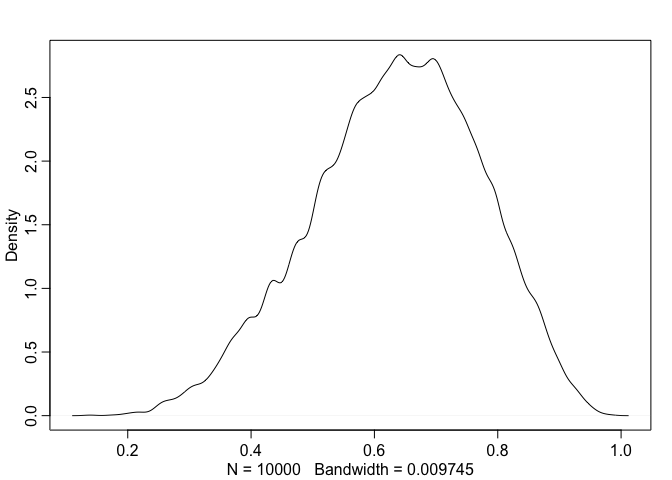

``` r
dens( sample( p_grid , prob=posterior , size=1e3 , replace=TRUE ) )
```

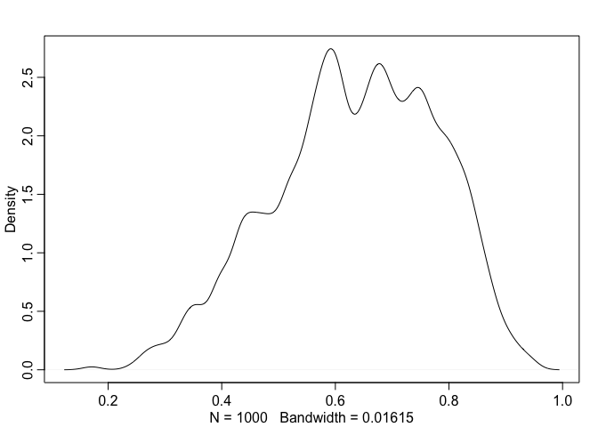

``` r
dens( sample( p_grid , prob=posterior , size=1e4 , replace=TRUE ) )
```

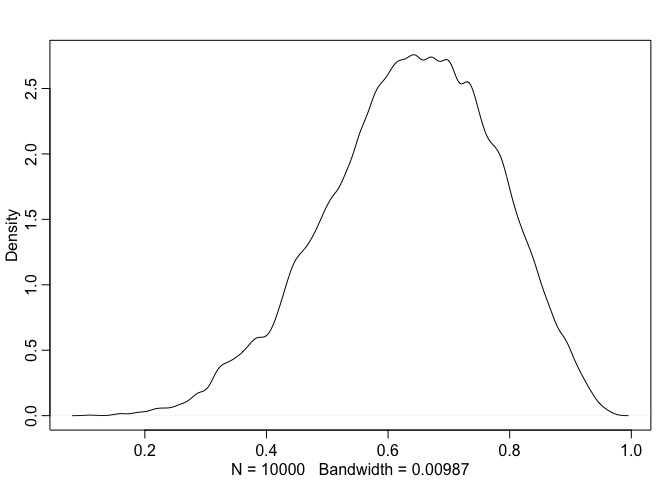

``` r
dens( sample( p_grid , prob=posterior , size=1e5 , replace=TRUE ) )
```

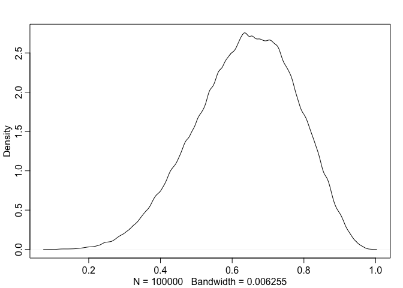

``` r
## R code 3.6
# add up posterior probability where p < 0.5
sum( posterior[ p_grid < 0.5 ] )
```

    ## [1] 0.1718746

``` r
## R code 3.7
sum( samples < 0.5 ) / 1e4
```

    ## [1] 0.1669

``` r
## R code 3.8
sum( samples > 0.5 & samples < 0.75 ) / 1e4
```

    ## [1] 0.6209

``` r
## R code 3.9
quantile( samples , 0.8 )
```

    ##       80% 
    ## 0.7557558

``` r
## R code 3.10
quantile( samples , c( 0.1 , 0.9 ) )
```

    ##       10%       90% 
    ## 0.4474474 0.8078078

``` r
## R code 3.11
set.seed(1)
p_grid <- seq( from=0 , to=1 , length.out=1000 )
prior <- rep(1,1000)
likelihood <- dbinom( 3 , size=3 , prob=p_grid )
posterior <- likelihood * prior
posterior <- posterior / sum(posterior)
samples <- sample( p_grid , size=1e4 , replace=TRUE , prob=posterior )
```

``` r
plot(p_grid, posterior)
```

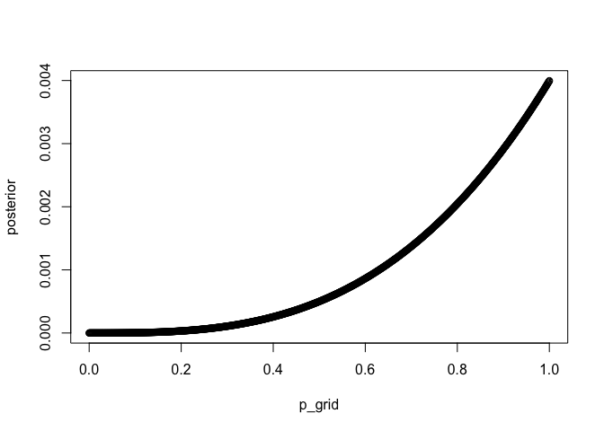

``` r
## R code 3.12
PI( samples , prob=0.5 )
```

    ##       25%       75% 
    ## 0.7027027 0.9309309

``` r
## R code 3.13
HPDI( samples , prob=0.5 )
```

    ##      |0.5      0.5| 
    ## 0.8408408 1.0000000

``` r
## R code 3.14
p_grid[ which.max(posterior) ]
```

    ## [1] 1

``` r
## R code 3.15
chainmode( samples , adj=0.01 )
```

    ## [1] 0.9839674

``` r
## R code 3.16
mean( samples )
```

    ## [1] 0.7991177

``` r
median( samples )
```

    ## [1] 0.8408408

------------------------------------------------------------------------

Loss Functions, here is our posterior.

``` r
plot(p_grid, posterior)
```


Absolute loss, pg 60

``` r
## R code 3.17
sum( posterior*abs( 0.5 - p_grid ) )
```

    ## [1] 0.3128752

``` r
sum( posterior*abs( 0.8 - p_grid ) )
```

    ## [1] 0.1312101

`posterior*abs( d - p_grid )` takes a particular guess at the “TRUE”
value of p (the proportion of water in this example), and calculates the
distance from our guess `d` to each of the possible points `p` which is
defined by `p_grid`.

Now that we have the relative distance away from our guess for each
possible value of p, we multiply that by posterior which gives higher
numbers for more plausible values.

So the further a particular guess is from a particular point, the higher
the distance and the more it will be penalized relative to the
plausibility of that p.

Let’s say our best guess is `0.5`. We’ll calculate a single value in the
calculation above, let’s use `p=1` which corresponds with the mode of
the graph.

We are a distance of 0.5, and that posterior is going to penalize us the
most since it has the highest plausiability.

``` r
abs(0.5 - p_grid[1000]) 
```

    ## [1] 0.5

``` r
posterior[1000]
```

    ## [1] 0.003996

``` r
posterior[1000] * abs(0.5 - p_grid[1000])
```

    ## [1] 0.001998

Now if our guess was `0.8` we wouldn’t get penalized as much at that
same point, because we are closer.

``` r
abs(0.8 - p_grid[1000]) 
```

    ## [1] 0.2

``` r
posterior[1000]
```

    ## [1] 0.003996

``` r
posterior[1000] * abs(0.8 - p_grid[1000])
```

    ## [1] 0.0007992

Or a guess of `1.0`

Now we aren’t penalized at all because we aren’t any distance away.

``` r
abs(1 - p_grid[1000]) 
```

    ## [1] 0

``` r
posterior[1000]
```

    ## [1] 0.003996

``` r
posterior[1000] * abs(1 - p_grid[1000])
```

    ## [1] 0

But this function does not optimize for the mode, because you are still
calculating all the penalties across the entire space of plausible
values (p\_grid), for each guess.

So while a guess of 0.8 gives you a higher penalty at that specific
value of 1, it turns out that summing across all the penalties will
produce a lower overall penalty (for 0.8) than if you were to guess 1.0

Instead, we’ll make a guess at each possible value of p (probability of
water), which is defined by p\_grid. At each value, we’ll calculate our
loss.

``` r
## R code 3.18
loss <- sapply( p_grid , function(d) sum( posterior*abs( d - p_grid ) ) )
```

``` r
## R code 3.19
p_grid[ which.min(loss) ]
```

    ## [1] 0.8408408

``` r
plot(p_grid, loss)
abline(v = p_grid[ which.min(loss) ], col="red", lwd=3, lty=2)
```

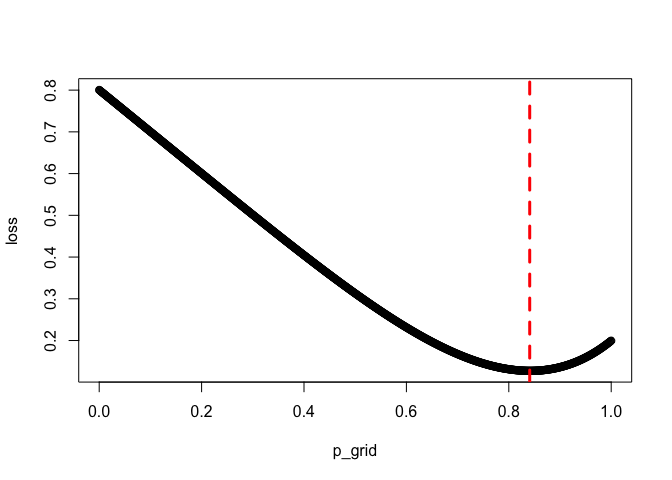

``` r
## R code 3.20
dbinom( 0:2 , size=2 , prob=0.7 )
```

    ## [1] 0.09 0.42 0.49

``` r
## R code 3.21
rbinom( 1 , size=2 , prob=0.7 )
```

    ## [1] 0

``` r
## R code 3.22
rbinom( 10 , size=2 , prob=0.7 )
```

    ##  [1] 2 1 0 2 2 1 2 1 1 1

``` r
## R code 3.23
dummy_w <- rbinom( 1e5 , size=2 , prob=0.7 )
table(dummy_w)/1e5
```

    ## dummy_w
    ##       0       1       2 
    ## 0.08833 0.42170 0.48997

``` r
## R code 3.24
dummy_w <- rbinom( 1e5 , size=9 , prob=0.7 )
simplehist( dummy_w , xlab="dummy water count" )
```

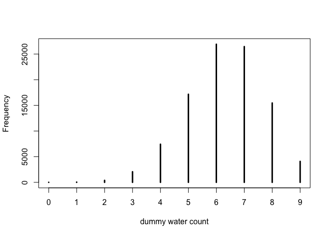

``` r
## R code 3.25
w <- rbinom( 1e4 , size=9 , prob=0.6 )
w[1:20]
```

    ##  [1] 6 5 4 6 5 3 5 5 5 6 7 7 4 5 5 7 4 7 5 8

``` r
hist(w)
```

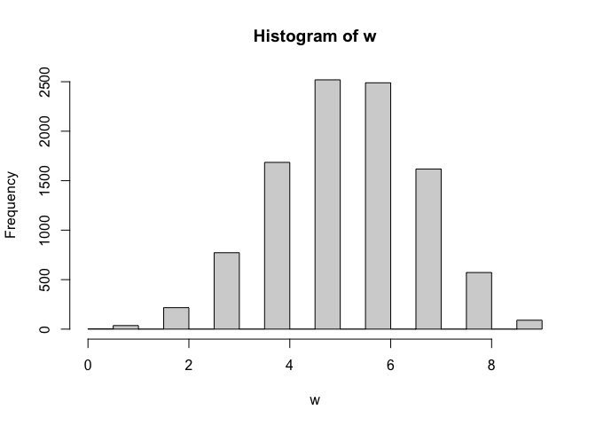

``` r
## R code 3.27
p_grid <- seq( from=0 , to=1 , length.out=1000 )
prior <- rep( 1 , 1000 )
likelihood <- dbinom( 6 , size=9 , prob=p_grid )
posterior <- likelihood * prior
posterior <- posterior / sum(posterior)
set.seed(100)
samples <- sample( p_grid , prob=posterior , size=1e5 , replace=TRUE )
```

``` r
## R code 3.26
w <- rbinom( 1e5 , size=9 , prob=samples )
length(w)
```

    ## [1] 100000

``` r
samples[1:20]
```

    ##  [1] 0.7137137 0.3573574 0.5985986 0.7177177 0.6296296 0.4694695 0.4734735
    ##  [8] 0.8378378 0.9029029 0.7267267 0.5035035 0.6126126 0.5935936 0.4554555
    ## [15] 0.7927928 0.4344344 0.7877878 0.6166166 0.6766767 0.3463463

``` r
w[1:20]
```

    ##  [1] 6 5 4 8 6 4 5 9 8 5 5 4 7 6 7 6 8 4 6 3

So, we calculated the posterior probability based on our sample of
observing 6 waters in 9 tosses.

We then sampled our posterior distribution, which gives us a list of
possible proportions of water with relative frequency corresponding to
posterior probability.

We then feed this into `rbinom` which produces random generation of how
many times you’d expect to see water in 9 tosses, and uses the sampled
proportions from our posterior distribution.

So we are propagating the uncertainty of the posterior into `rbinom`
which is why the histogram below is more spread out (less certain) than
the histogram above. The histogram above only shows the expected
distribution if the true proportion of water is 0.

``` r
hist(w)
```

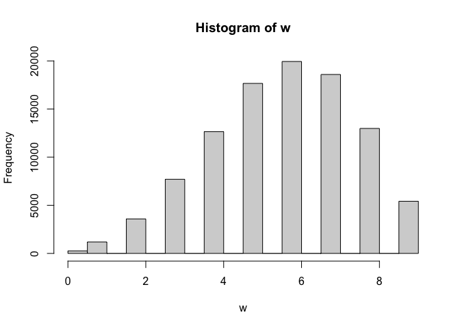

``` r
## R code 3.28
birth1 <- c(1,0,0,0,1,1,0,1,0,1,0,0,1,1,0,1,1,0,0,0,1,0,0,0,1,0,
0,0,0,1,1,1,0,1,0,1,1,1,0,1,0,1,1,0,1,0,0,1,1,0,1,0,0,0,0,0,0,0,
1,1,0,1,0,0,1,0,0,0,1,0,0,1,1,1,1,0,1,0,1,1,1,1,1,0,0,1,0,1,1,0,
1,0,1,1,1,0,1,1,1,1)
birth2 <- c(0,1,0,1,0,1,1,1,0,0,1,1,1,1,1,0,0,1,1,1,0,0,1,1,1,0,
1,1,1,0,1,1,1,0,1,0,0,1,1,1,1,0,0,1,0,1,1,1,1,1,1,1,1,1,1,1,1,1,
1,1,1,0,1,1,0,1,1,0,1,1,1,0,0,0,0,0,0,1,0,0,0,1,1,0,0,1,0,0,1,1,
0,0,0,1,1,1,0,0,0,0)
```

``` r
## R code 3.29
library(rethinking)
data(homeworkch3)
```

``` r
## R code 3.30
sum(birth1) + sum(birth2)
```

    ## [1] 111

``` r
knitr::knit_exit()
```
